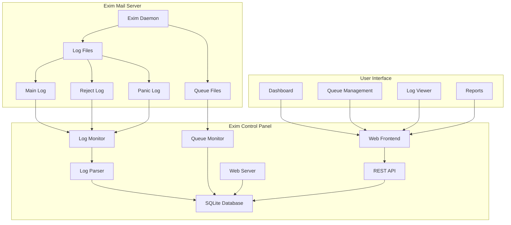

# Design Document

## Overview

The Exim Control Panel (Exim-Pilot) is a web-based management interface for Exim mail servers running on Ubuntu/Debian systems. The application consists of a Go backend that processes Exim logs and provides a REST API, coupled with a responsive web frontend for queue management, log analysis, and deliverability reporting.

### Key Design Principles

- **Real-time Processing**: Continuous monitoring of Exim log files with immediate UI updates
- **Performance**: Efficient SQLite database design with proper indexing for fast queries
- **Security**: Minimal privileges, input validation, and audit logging for all operations
- **Scalability**: Designed to handle large mail queues and high log volumes
- **Usability**: Intuitive web interface with responsive design for desktop and mobile

## Architecture

### High-Level Architecture



### System Components

1. **Log Monitor Service**: Watches Exim log files for changes using filesystem events
2. **Log Parser**: Parses Exim log entries and extracts structured data
3. **Queue Monitor**: Interfaces with Exim queue management commands
4. **Database Layer**: SQLite database with optimized schema for fast queries
5. **REST API**: HTTP API providing access to all system functionality
6. **Web Frontend**: React/TypeScript SPA with embedded static assets
7. **Background Services**: Cleanup, aggregation, and maintenance tasks
8. **Static Asset Server**: Serves embedded Vite-built frontend from Go binary

## Components and Interfaces

### 1. Log Processing System

#### Log Monitor (`internal/logmonitor`)
- **Purpose**: Monitor Exim log files for changes and trigger parsing
- **Key Functions**:
  - `WatchLogFiles()`: Set up filesystem watchers for log files
  - `HandleLogRotation()`: Detect and handle log file rotation
  - `ProcessNewEntries()`: Process new log entries as they arrive

#### Log Parser (`internal/parser`)
- **Purpose**: Parse Exim log entries into structured data
- **Key Functions**:
  - `ParseMainLog()`: Parse main log entries (arrivals, deliveries, deferrals)
  - `ParseRejectLog()`: Parse reject log entries
  - `ParsePanicLog()`: Parse panic/error log entries
  - `ExtractMessageID()`: Extract message IDs from log lines

**Log Entry Structure**:
```go
type LogEntry struct {
    ID          int64     `json:"id"`
    Timestamp   time.Time `json:"timestamp"`
    MessageID   string    `json:"message_id"`
    LogType     string    `json:"log_type"` // main, reject, panic
    Event       string    `json:"event"`    // arrival, delivery, defer, etc.
    Host        string    `json:"host"`
    Sender      string    `json:"sender"`
    Recipients  []string  `json:"recipients"`
    Size        int64     `json:"size"`
    Status      string    `json:"status"`
    ErrorCode   string    `json:"error_code"`
    ErrorText   string    `json:"error_text"`
    RawLine     string    `json:"raw_line"`
}
```

### 2. Queue Management System

#### Queue Interface (`internal/queue`)
- **Purpose**: Interface with Exim queue management
- **Key Functions**:
  - `ListQueue()`: Get current queue status
  - `InspectMessage()`: Get detailed message information
  - `DeliverNow()`: Force immediate delivery
  - `FreezeMessage()`: Freeze/pause message
  - `ThawMessage()`: Thaw/resume message
  - `DeleteMessage()`: Remove message from queue

**Queue Message Structure**:
```go
type QueueMessage struct {
    ID          string    `json:"id"`
    Size        int64     `json:"size"`
    Age         string    `json:"age"`
    Sender      string    `json:"sender"`
    Recipients  []string  `json:"recipients"`
    Status      string    `json:"status"` // queued, deferred, frozen
    RetryCount  int       `json:"retry_count"`
    LastAttempt time.Time `json:"last_attempt"`
    NextRetry   time.Time `json:"next_retry"`
}
```

### 3. Database Layer

#### Schema Design (`internal/database`)

**Core Tables**:
```sql
-- Messages table for tracking all messages
CREATE TABLE messages (
    id TEXT PRIMARY KEY,
    timestamp DATETIME NOT NULL,
    sender TEXT NOT NULL,
    size INTEGER,
    status TEXT NOT NULL, -- received, delivered, deferred, bounced
    created_at DATETIME DEFAULT CURRENT_TIMESTAMP,
    updated_at DATETIME DEFAULT CURRENT_TIMESTAMP
);

-- Recipients table for message recipients
CREATE TABLE recipients (
    id INTEGER PRIMARY KEY AUTOINCREMENT,
    message_id TEXT NOT NULL,
    recipient TEXT NOT NULL,
    status TEXT NOT NULL, -- delivered, deferred, bounced
    delivered_at DATETIME,
    FOREIGN KEY (message_id) REFERENCES messages(id)
);

-- Delivery attempts table
CREATE TABLE delivery_attempts (
    id INTEGER PRIMARY KEY AUTOINCREMENT,
    message_id TEXT NOT NULL,
    recipient TEXT NOT NULL,
    timestamp DATETIME NOT NULL,
    host TEXT,
    ip_address TEXT,
    status TEXT NOT NULL, -- success, defer, bounce
    smtp_code TEXT,
    error_message TEXT,
    FOREIGN KEY (message_id) REFERENCES messages(id)
);

-- Log entries table for searchable log history
CREATE TABLE log_entries (
    id INTEGER PRIMARY KEY AUTOINCREMENT,
    timestamp DATETIME NOT NULL,
    message_id TEXT,
    log_type TEXT NOT NULL, -- main, reject, panic
    event TEXT NOT NULL,
    host TEXT,
    sender TEXT,
    recipients TEXT, -- JSON array
    size INTEGER,
    status TEXT,
    error_code TEXT,
    error_text TEXT,
    raw_line TEXT NOT NULL
);

-- Audit log for administrative actions
CREATE TABLE audit_log (
    id INTEGER PRIMARY KEY AUTOINCREMENT,
    timestamp DATETIME DEFAULT CURRENT_TIMESTAMP,
    action TEXT NOT NULL,
    message_id TEXT,
    user_id TEXT,
    details TEXT, -- JSON
    ip_address TEXT
);

-- Queue snapshots for historical tracking
CREATE TABLE queue_snapshots (
    id INTEGER PRIMARY KEY AUTOINCREMENT,
    timestamp DATETIME DEFAULT CURRENT_TIMESTAMP,
    total_messages INTEGER,
    deferred_messages INTEGER,
    frozen_messages INTEGER,
    oldest_message_age INTEGER -- seconds
);
```

**Indexes for Performance**:
```sql
CREATE INDEX idx_messages_timestamp ON messages(timestamp);
CREATE INDEX idx_messages_status ON messages(status);
CREATE INDEX idx_recipients_message_id ON recipients(message_id);
CREATE INDEX idx_recipients_status ON recipients(status);
CREATE INDEX idx_delivery_attempts_message_id ON delivery_attempts(message_id);
CREATE INDEX idx_delivery_attempts_timestamp ON delivery_attempts(timestamp);
CREATE INDEX idx_log_entries_timestamp ON log_entries(timestamp);
CREATE INDEX idx_log_entries_message_id ON log_entries(message_id);
CREATE INDEX idx_log_entries_event ON log_entries(event);
```

### 4. REST API Layer

#### API Structure (`internal/api`)

**Core Endpoints**:
```
GET    /api/v1/dashboard              - Dashboard metrics
GET    /api/v1/queue                  - List queue messages
POST   /api/v1/queue/search           - Search queue
GET    /api/v1/queue/{id}             - Get message details
POST   /api/v1/queue/{id}/deliver     - Force delivery
POST   /api/v1/queue/{id}/freeze      - Freeze message
POST   /api/v1/queue/{id}/thaw        - Thaw message
DELETE /api/v1/queue/{id}             - Delete message
POST   /api/v1/queue/bulk             - Bulk operations

GET    /api/v1/logs                   - List log entries
POST   /api/v1/logs/search            - Search logs
GET    /api/v1/logs/tail              - Real-time log tail (WebSocket)

GET    /api/v1/reports/deliverability - Deliverability reports
GET    /api/v1/reports/volume         - Volume reports
GET    /api/v1/reports/failures       - Failure analysis

GET    /api/v1/messages/{id}/trace    - Message delivery trace
GET    /api/v1/messages/{id}/content  - Message content (safe)
```

**API Response Structure**:
```go
type APIResponse struct {
    Success bool        `json:"success"`
    Data    interface{} `json:"data,omitempty"`
    Error   string      `json:"error,omitempty"`
    Meta    *Meta       `json:"meta,omitempty"`
}

type Meta struct {
    Page       int `json:"page,omitempty"`
    PerPage    int `json:"per_page,omitempty"`
    Total      int `json:"total,omitempty"`
    TotalPages int `json:"total_pages,omitempty"`
}
```

### 5. Web Frontend

#### Technology Stack
- **Framework**: React 18+ with functional components and hooks
- **Language**: TypeScript for type safety and better development experience
- **CSS**: Tailwind CSS for responsive design
- **Charts**: Apache ECharts for React (echarts-for-react)
- **Real-time**: Plain WebSocket implementation for live updates
- **Build**: Vite.js for fast development and optimized production builds
- **State Management**: React Context API and useState/useReducer hooks
- **Development**: Air for automatic Go rebuilds on file changes
- **Embedding**: Vite build output embedded in Go binary using embed package

#### Component Structure
```
web/
├── src/
│   ├── components/
│   │   ├── Dashboard/
│   │   │   ├── Dashboard.tsx
│   │   │   ├── MetricsCard.tsx
│   │   │   └── WeeklyChart.tsx      # Uses echarts-for-react
│   │   ├── Queue/
│   │   │   ├── QueueList.tsx
│   │   │   ├── QueueSearch.tsx
│   │   │   ├── MessageDetails.tsx
│   │   │   └── BulkActions.tsx
│   │   ├── Logs/
│   │   │   ├── LogViewer.tsx
│   │   │   ├── LogSearch.tsx
│   │   │   └── RealTimeTail.tsx     # WebSocket integration
│   │   ├── Reports/
│   │   │   ├── DeliverabilityReport.tsx
│   │   │   ├── VolumeReport.tsx
│   │   │   └── FailureAnalysis.tsx
│   │   └── Common/
│   │       ├── Layout.tsx
│   │       ├── Navigation.tsx
│   │       ├── Pagination.tsx
│   │       └── LoadingSpinner.tsx
│   ├── hooks/
│   │   ├── useWebSocket.ts          # Custom WebSocket hook
│   │   ├── useApi.ts               # API integration hook
│   │   └── usePagination.ts        # Pagination logic
│   ├── services/
│   │   ├── api.ts                  # Axios-based API client
│   │   └── websocket.ts            # WebSocket service
│   ├── context/
│   │   ├── AppContext.tsx          # Global app state
│   │   └── WebSocketContext.tsx    # WebSocket state management
│   ├── types/
│   │   ├── api.ts                  # API response types
│   │   ├── queue.ts                # Queue-related types
│   │   └── logs.ts                 # Log-related types
│   ├── utils/
│   │   ├── formatters.ts           # Date, size, time formatters
│   │   └── constants.ts            # App constants
│   ├── App.tsx
│   └── main.tsx
├── public/
│   └── index.html
├── package.json
├── vite.config.ts
├── tsconfig.json
├── tailwind.config.js
└── .air.toml                       # Air configuration
```

#### Key React Implementation Details

**TypeScript Integration**:
```typescript
// types/api.ts
export interface APIResponse<T = any> {
  success: boolean;
  data?: T;
  error?: string;
  meta?: {
    page?: number;
    per_page?: number;
    total?: number;
    total_pages?: number;
  };
}

export interface QueueMessage {
  id: string;
  size: number;
  age: string;
  sender: string;
  recipients: string[];
  status: 'queued' | 'deferred' | 'frozen';
  retry_count: number;
  last_attempt: string;
  next_retry: string;
}
```

**WebSocket Integration with TypeScript**:
```typescript
// hooks/useWebSocket.ts
interface UseWebSocketOptions {
  onMessage?: (data: any) => void;
  onOpen?: () => void;
  onClose?: () => void;
  onError?: (error: Event) => void;
}

export const useWebSocket = (url: string, options: UseWebSocketOptions = {}) => {
  const [socket, setSocket] = useState<WebSocket | null>(null);
  const [lastMessage, setLastMessage] = useState<any>(null);
  const [readyState, setReadyState] = useState<number>(WebSocket.CONNECTING);

  useEffect(() => {
    const ws = new WebSocket(url);
    
    ws.onopen = () => {
      setReadyState(WebSocket.OPEN);
      options.onOpen?.();
    };
    ws.onclose = () => {
      setReadyState(WebSocket.CLOSED);
      options.onClose?.();
    };
    ws.onmessage = (event) => {
      const data = JSON.parse(event.data);
      setLastMessage(data);
      options.onMessage?.(data);
    };
    ws.onerror = (error) => {
      options.onError?.(error);
    };
    
    setSocket(ws);
    return () => ws.close();
  }, [url]);

  const sendMessage = useCallback((message: any) => {
    if (socket && readyState === WebSocket.OPEN) {
      socket.send(JSON.stringify(message));
    }
  }, [socket, readyState]);

  return { lastMessage, readyState, sendMessage };
};
```

**ECharts Integration with TypeScript**:
```typescript
// components/Dashboard/WeeklyChart.tsx
import ReactECharts from 'echarts-for-react';
import { EChartsOption } from 'echarts';

interface WeeklyChartProps {
  data: {
    dates: string[];
    delivered: number[];
    failed: number[];
    pending: number[];
    deferred: number[];
  };
}

export const WeeklyChart: React.FC<WeeklyChartProps> = ({ data }) => {
  const option: EChartsOption = {
    title: { text: 'Weekly Email Overview' },
    tooltip: { trigger: 'axis' },
    legend: { data: ['Delivered', 'Failed', 'Pending', 'Deferred'] },
    xAxis: { type: 'category', data: data.dates },
    yAxis: { type: 'value' },
    series: [
      { name: 'Delivered', type: 'bar', data: data.delivered, color: '#10b981' },
      { name: 'Failed', type: 'bar', data: data.failed, color: '#ef4444' },
      { name: 'Pending', type: 'bar', data: data.pending, color: '#f59e0b' },
      { name: 'Deferred', type: 'bar', data: data.deferred, color: '#6b7280' }
    ]
  };

  return <ReactECharts option={option} style={{ height: '400px' }} />;
};
```

## Data Models

### Message Lifecycle States
```go
const (
    StatusReceived  = "received"
    StatusQueued    = "queued"
    StatusDelivered = "delivered"
    StatusDeferred  = "deferred"
    StatusBounced   = "bounced"
    StatusFrozen    = "frozen"
)
```

### Delivery Attempt Outcomes
```go
const (
    AttemptSuccess = "success"
    AttemptDefer   = "defer"
    AttemptBounce  = "bounce"
    AttemptTimeout = "timeout"
)
```

### Log Event Types
```go
const (
    EventArrival   = "arrival"
    EventDelivery  = "delivery"
    EventDefer     = "defer"
    EventBounce    = "bounce"
    EventReject    = "reject"
    EventPanic     = "panic"
)
```

## Error Handling

### Error Categories
1. **System Errors**: File system access, database connectivity
2. **Parsing Errors**: Malformed log entries, unexpected formats
3. **Queue Errors**: Exim command failures, permission issues
4. **API Errors**: Invalid requests, authentication failures

### Error Response Strategy
- **Graceful Degradation**: Continue operation when non-critical components fail
- **Retry Logic**: Automatic retry for transient failures
- **Error Logging**: Comprehensive error logging with context
- **User Feedback**: Clear error messages in the UI

### Example Error Handling
```go
type AppError struct {
    Code    string `json:"code"`
    Message string `json:"message"`
    Details string `json:"details,omitempty"`
}

func (e *AppError) Error() string {
    return fmt.Sprintf("%s: %s", e.Code, e.Message)
}
```

## Security Considerations

### Authentication and Authorization
- **Basic Authentication**: Simple username/password for initial version
- **Session Management**: Secure session handling with timeouts
- **Future Enhancement**: Integration with system authentication (PAM, LDAP)

### Input Validation
- **API Validation**: Strict input validation for all API endpoints
- **SQL Injection Prevention**: Parameterized queries only
- **XSS Prevention**: Proper output encoding in web interface

### File System Security
- **Minimal Privileges**: Run with minimal required file system permissions
- **Path Validation**: Validate all file paths to prevent directory traversal
- **Log File Access**: Read-only access to Exim log directories

### Audit Trail
- **Action Logging**: Log all administrative actions with user context
- **Immutable Records**: Audit log entries cannot be modified
- **Retention Policy**: Configurable audit log retention

## Performance Optimization

### Database Optimization
- **Indexing Strategy**: Comprehensive indexing for common query patterns
- **Query Optimization**: Efficient queries with proper LIMIT and pagination
- **Connection Pooling**: SQLite connection pooling for concurrent access
- **Data Retention**: Configurable data retention policies

### Log Processing Optimization
- **Streaming Processing**: Process logs in streaming fashion to minimize memory
- **Batch Inserts**: Batch database inserts for better performance
- **Background Processing**: Process historical logs in background
- **Compression**: Compress old log data for storage efficiency

### Frontend Optimization
- **Lazy Loading**: React.lazy() for code splitting and component lazy loading
- **Caching**: React Query or SWR for API caching and state management
- **WebSocket Efficiency**: Custom WebSocket hook for efficient real-time updates
- **Asset Optimization**: Vite's built-in optimization for production builds
- **Virtual Scrolling**: For large lists in queue and log viewers

## Deployment Architecture

### System Requirements
- **OS**: Ubuntu 18.04+ or Debian 9+
- **Go**: Go 1.19+
- **Exim**: Exim 4.90+
- **Resources**: 512MB RAM minimum, 1GB recommended

### File Structure
```
/opt/exim-pilot/
├── bin/
│   └── exim-pilot      # Single binary with embedded frontend
├── config/
│   └── config.yaml
├── data/
│   └── exim-pilot.db
└── logs/
    └── exim-pilot.log
```

### Development Structure
```
exim-pilot/
├── cmd/
│   └── exim-pilot/
│       └── main.go
├── internal/
│   ├── server/
│   │   └── server.go   # Embedded static files
│   ├── api/
│   ├── database/
│   └── ...
├── web/                # Frontend development
│   ├── src/
│   ├── dist/          # Vite build output (embedded)
│   ├── package.json
│   ├── vite.config.ts
│   └── tsconfig.json
├── .air.toml          # Air configuration
├── go.mod
├── go.sum
└── Makefile
```

### Embedded Static Assets
```go
// internal/server/server.go
package server

import (
    "embed"
    "net/http"
)

//go:embed web/dist/*
var staticFiles embed.FS

func (s *Server) setupStaticRoutes() {
    // Serve embedded frontend
    staticHandler := http.FileServer(http.FS(staticFiles))
    s.router.PathPrefix("/").Handler(
        http.StripPrefix("/", staticHandler),
    )
}
```

### Configuration Management
```yaml
# config.yaml
server:
  port: 8080
  host: "0.0.0.0"
  
database:
  path: "/opt/exim-pilot/data/exim-pilot.db"
  
exim:
  log_paths:
    - "/var/log/exim4/mainlog"
    - "/var/log/exim4/rejectlog"
    - "/var/log/exim4/paniclog"
  spool_dir: "/var/spool/exim4"
  
logging:
  level: "info"
  file: "/opt/exim-pilot/logs/exim-pilot.log"
  
retention:
  log_entries_days: 90
  audit_log_days: 365
  queue_snapshots_days: 30
```

### Development Configuration

**Air Configuration (.air.toml)**:
```toml
root = "."
testdata_dir = "testdata"
tmp_dir = "tmp"

[build]
  args_bin = []
  bin = "./tmp/main"
  cmd = "make build-dev"
  delay = 1000
  exclude_dir = ["assets", "tmp", "vendor", "testdata", "web/node_modules", "web/dist"]
  exclude_file = []
  exclude_regex = ["_test.go"]
  exclude_unchanged = false
  follow_symlink = false
  full_bin = ""
  include_dir = []
  include_ext = ["go", "tpl", "tmpl", "html"]
  kill_delay = "0s"
  log = "build-errors.log"
  send_interrupt = false
  stop_on_root = false

[color]
  app = ""
  build = "yellow"
  main = "magenta"
  runner = "green"
  watcher = "cyan"

[log]
  time = false

[misc]
  clean_on_exit = false

[screen]
  clear_on_rebuild = false
```

**Makefile**:
```makefile
.PHONY: build build-dev build-frontend clean dev

# Development build (no frontend embedding)
build-dev:
	go build -o tmp/main cmd/exim-pilot/main.go

# Production build with embedded frontend
build: build-frontend
	go build -tags embed -o bin/exim-pilot cmd/exim-pilot/main.go

# Build frontend
build-frontend:
	cd web && npm run build

# Development server with hot reload
dev:
	air

# Clean build artifacts
clean:
	rm -rf tmp/ bin/ web/dist/

# Install dependencies
install:
	go mod download
	cd web && npm install
```

**Vite Configuration (vite.config.ts)**:
```typescript
import { defineConfig } from 'vite'
import react from '@vitejs/plugin-react'
import path from 'path'

export default defineConfig({
  plugins: [react()],
  build: {
    outDir: 'dist',
    assetsDir: 'assets',
    sourcemap: false,
    minify: 'terser',
  },
  server: {
    port: 3000,
    proxy: {
      '/api': {
        target: 'http://localhost:8080',
        changeOrigin: true,
      },
      '/ws': {
        target: 'ws://localhost:8080',
        ws: true,
      },
    },
  },
  resolve: {
    alias: {
      '@': path.resolve(__dirname, './src'),
    },
  },
})
```

### Service Management
- **Systemd Service**: Run as systemd service for automatic startup
- **Process Monitoring**: Health checks and automatic restart
- **Log Rotation**: Integrate with system log rotation
- **Backup Strategy**: Regular database backups

This design provides a solid foundation for implementing the Exim Control Panel with all the required features while maintaining performance, security, and scalability.