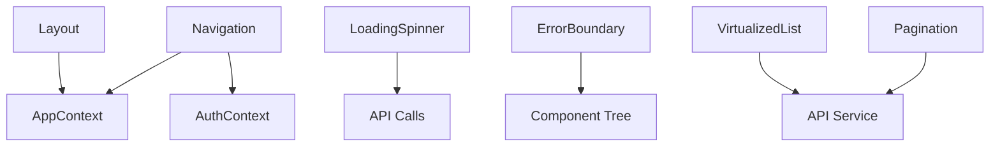

# Frontend Components


## Table of Contents
1. [Introduction](#introduction)
2. [Core UI Components Overview](#core-ui-components-overview)
3. [Layout Component](#layout-component)
4. [Navigation Component](#navigation-component)
5. [VirtualizedList Component](#virtualizedlist-component)
6. [Pagination Component](#pagination-component)
7. [LoadingSpinner Component](#loadingspinner-component)
8. [ErrorBoundary Component](#errorboundary-component)
9. [Integration Patterns](#integration-patterns)
10. [Accessibility and Responsive Design](#accessibility-and-responsive-design)
11. [Performance Considerations](#performance-considerations)

## Introduction
The exim-pilot frontend application utilizes a set of reusable UI components to ensure consistency, performance, and maintainability across its interface. These components are designed to handle common patterns such as page scaffolding, navigation, data rendering, user feedback, and error handling. Built with React and TypeScript, they leverage modern web practices including virtualization, responsive design via Tailwind CSS, and integration with React Router and context-based state management. This document provides a comprehensive overview of the core UI components used throughout the application.

## Core UI Components Overview
The Common components directory contains foundational UI elements that are reused across various features of the exim-pilot application. These components include:

- **Layout**: Provides consistent page structure with navigation, status indicators, and content areas.
- **Navigation**: Renders the top navigation bar with route links and user session controls.
- **VirtualizedList**: Efficiently renders large datasets like mail queues and log entries using windowing techniques.
- **Pagination**: Enables chunked display of data with intuitive page controls.
- **LoadingSpinner**: Displays visual feedback during asynchronous operations such as API calls.
- **ErrorBoundary**: Catches and gracefully handles JavaScript errors in the component tree.

These components work together to create a cohesive, performant, and user-friendly interface for managing email server operations.

## Layout Component
The `Layout` component serves as the structural foundation for all pages in the application. It wraps child components with consistent scaffolding including navigation, status banners, and notification overlays.

### Purpose and Implementation
The Layout component ensures a uniform appearance and behavior across all views by:
- Rendering the global `Navigation` bar at the top
- Displaying connection status (connected, connecting, disconnected)
- Showing error messages from the global application state
- Providing a container for main content with responsive padding
- Positioning notifications in a fixed overlay

It consumes global state via `useApp()` from `AppContext`, which provides access to:
- `connectionStatus`: Current WebSocket or API connection status
- `error`: Global error message to display
- `notifications`: List of transient messages to show


```tsx
export default function Layout({ children }: LayoutProps) {
  const { state } = useApp();

  return (
    <div className="min-h-screen bg-gray-50">
      <Navigation />
      
      {/* Connection Status Indicator */}
      {state.connectionStatus !== 'connected' && (
        <div className={`px-4 py-2 text-sm text-center ${...}`}>
          {state.connectionStatus === 'connecting' 
            ? 'Connecting to server...' 
            : 'Disconnected from server'}
        </div>
      )}

      {/* Error Banner */}
      {state.error && (
        <div className="bg-red-100 border border-red-400 text-red-700 px-4 py-3">
          <span className="block sm:inline">{state.error}</span>
        </div>
      )}

      {/* Main Content */}
      <main className="container mx-auto px-4 py-6">
        {children}
      </main>

      {/* Notifications */}
      <div className="fixed top-4 right-4 space-y-2 z-50">
        {state.notifications.map((notification) => (
          <div key={notification.id} className={`...`}>
            {notification.message}
          </div>
        ))}
      </div>
    </div>
  );
}
```


### Props Interface

```typescript
interface LayoutProps {
  children: ReactNode;
}
```


**Section sources**
- [Layout.tsx](file://web/src/components/Common/Layout.tsx#L1-L58)

## Navigation Component
The `Navigation` component implements the primary navigation interface, enabling users to switch between major application sections and manage their session.

### Route Handling and Menu Rendering
The navigation bar displays links to key application areas:
- Dashboard
- Queue Management
- Log Monitoring
- Reports

It uses `react-router-dom`'s `useLocation` hook to determine the active route and highlight the corresponding menu item. The `isActive` function handles route matching logic, with special treatment for the root path.

The component also integrates authentication state via `useAuth()` from `AuthContext`, displaying:
- Current username
- Logout button
- Help button contextualized to the current page

Mobile responsiveness is achieved through conditional rendering—menu items appear horizontally on desktop and vertically on mobile.


```tsx
const navItems = [
  { id: 'dashboard', label: 'Dashboard', path: '/' },
  { id: 'queue', label: 'Queue Management', path: '/queue' },
  { id: 'logs', label: 'Log Monitoring', path: '/logs' },
  { id: 'reports', label: 'Reports', path: '/reports' },
];

return (
  <nav className="bg-white shadow-sm border-b">
    <div className="container mx-auto px-4">
      <div className="flex items-center justify-between h-16">
        {/* Logo */}
        <div className="flex items-center">
          <h1 className="text-xl font-bold text-gray-900">Exim-Pilot</h1>
        </div>

        {/* Desktop Navigation Links */}
        <div className="hidden md:block">
          <div className="ml-10 flex items-baseline space-x-4">
            {navItems.map((item) => (
              <Link
                key={item.id}
                to={item.path}
                className={`... ${isActive(item.path) ? 'bg-blue-100 text-blue-700' : ''}`}
              >
                {item.label}
              </Link>
            ))}
          </div>
        </div>

        {/* User Info & Controls */}
        <div className="flex items-center space-x-4">
          <HelpButton section={getCurrentSection(location.pathname)} />
          
          {/* Connection Status Indicator */}
          <div className="flex items-center space-x-2">
            <div className={`w-2 h-2 rounded-full ${getConnectionDotColor()}`} />
            <span className="text-sm text-gray-600">{getConnectionText()}</span>
          </div>

          {/* User Greeting and Logout */}
          {user && (
            <div className="flex items-center space-x-3">
              <div className="text-sm text-gray-600">Welcome, {user.username}</div>
              <button onClick={handleLogout} className="...">
                Logout
              </button>
            </div>
          )}
        </div>
      </div>

      {/* Mobile Navigation */}
      <div className="md:hidden">
        <div className="px-2 pt-2 pb-3 space-y-1 sm:px-3">
          {navItems.map((item) => (
            <Link key={item.id} to={item.path} className={`...`}>
              {item.label}
            </Link>
          ))}
        </div>
      </div>
    </div>
  </nav>
);
```


### Props and State
The component uses:
- `useLocation()` to track current route
- `useApp()` for connection status
- `useAuth()` for user session

No explicit props are required.

**Section sources**
- [Navigation.tsx](file://web/src/components/Common/Navigation.tsx#L1-L133)

## VirtualizedList Component
The `VirtualizedList` component enables efficient rendering of large datasets by only rendering visible items, significantly improving performance for views like the mail queue.

### Efficient Rendering of Large Datasets
This component is built on `react-window` and `react-window-infinite-loader` to implement virtualization:
- Only renders items currently in the viewport
- Recycles DOM elements as user scrolls
- Supports infinite loading patterns
- Minimizes memory usage and re-renders

It provides a generic `VirtualizedList` base component and two specialized implementations:
- `VirtualizedQueueList`: For mail queue messages
- `VirtualizedLogList`: For log entries

#### Generic VirtualizedList

```tsx
interface VirtualizedListProps<T> {
  items: T[];
  height: number;
  itemHeight: number;
  renderItem: (item: T, index: number, style: React.CSSProperties) => React.ReactNode;
  hasNextPage?: boolean;
  isNextPageLoading?: boolean;
  loadNextPage?: () => Promise<void>;
  className?: string;
  overscanCount?: number;
}
```


The component uses `InfiniteLoader` when pagination is enabled, allowing seamless loading of additional data as the user scrolls.

#### VirtualizedQueueList
Specialized for displaying mail queue messages with columns for:
- Message ID
- Sender
- Recipients
- Size
- Age
- Status
- Retry count

Includes selection support for bulk operations and click-to-view functionality.


```tsx
export const VirtualizedQueueList: React.FC<VirtualizedQueueListProps> = ({
  messages,
  height,
  onMessageSelect,
  selectedMessages = [],
  onSelectionChange,
  hasNextPage,
  isNextPageLoading,
  loadNextPage,
}) => {
  // Formatting and rendering logic
  const formatSize = useCallback((bytes: number): string => { ... }, []);
  const getStatusBadgeClass = useCallback((status: string): string => { ... }, []);

  const renderQueueItem = useCallback((message: any, index: number, style: React.CSSProperties) => {
    return (
      <div style={style} className="...">
        {onSelectionChange && (
          <input
            type="checkbox"
            checked={selectedMessages.includes(message.id)}
            onChange={(e) => handleSelectMessage(message.id, e.target.checked)}
          />
        )}
        <div className="grid grid-cols-7 gap-4">
          <div className="font-mono text-xs truncate">{message.id}</div>
          <div className="truncate">{message.sender}</div>
          <div>{renderRecipients(message.recipients)}</div>
          <div>{formatSize(message.size)}</div>
          <div>{message.age}</div>
          <div><StatusBadge status={message.status} /></div>
          <div>{message.retry_count}</div>
        </div>
        <button onClick={() => onMessageSelect?.(message)}>View</button>
      </div>
    );
  }, [...]);

  return (
    <div className="bg-white shadow rounded-lg">
      <div className="bg-gray-50 px-4 py-3 border-b">
        <div className="grid grid-cols-7 gap-4 text-xs font-medium text-gray-500 uppercase">
          <div>Message ID</div>
          <div>Sender</div>
          <div>Recipients</div>
          <div>Size</div>
          <div>Age</div>
          <div>Status</div>
          <div>Retries</div>
        </div>
      </div>
      <VirtualizedList
        items={messages}
        height={height}
        itemHeight={80}
        renderItem={renderQueueItem}
        hasNextPage={hasNextPage}
        isNextPageLoading={isNextPageLoading}
        loadNextPage={loadNextPage}
        overscanCount={10}
      />
    </div>
  );
};
```


#### VirtualizedLogList
Similar structure but optimized for log data with columns for:
- Timestamp
- Message ID
- Log type
- Event
- Sender
- Recipients
- Status
- Raw line preview

Uses color-coded badges for log types and events to enhance readability.

**Section sources**
- [VirtualizedList.tsx](file://web/src/components/Common/VirtualizedList.tsx#L1-L460)

## Pagination Component
The `Pagination` component provides standard pagination controls for chunked data display, commonly used with API responses that return paginated results.

### Chunked Data Display
The component renders:
- Previous/Next buttons
- Page number buttons with ellipsis for large page counts
- Optional result information (e.g., "Showing 1-10 of 100 results")

It supports responsive design, showing full details on desktop and simplified view on mobile.


```tsx
interface PaginationProps {
  currentPage: number;
  totalPages: number;
  onPageChange: (page: number) => void;
  showInfo?: boolean;
  totalItems?: number;
  itemsPerPage?: number;
}
```


The `getVisiblePages` function implements intelligent page number display:
- Always shows first and last pages
- Shows current page with ±2 neighbors
- Inserts ellipsis when gaps exist


```tsx
function getVisiblePages() {
  const delta = 2;
  const range = [];
  const rangeWithDots = [];

  for (
    let i = Math.max(2, currentPage - delta);
    i <= Math.min(totalPages - 1, currentPage + delta);
    i++
  ) {
    range.push(i);
  }

  if (currentPage - delta > 2) {
    rangeWithDots.push(1, '...');
  } else {
    rangeWithDots.push(1);
  }

  rangeWithDots.push(...range);

  if (currentPage + delta < totalPages - 1) {
    rangeWithDots.push('...', totalPages);
  } else if (totalPages > 1) {
    rangeWithDots.push(totalPages);
  }

  return rangeWithDots;
}
```


The component is fully accessible with proper ARIA labels and keyboard navigation support.

**Section sources**
- [Pagination.tsx](file://web/src/components/Common/Pagination.tsx#L1-L151)

## LoadingSpinner Component
The `LoadingSpinner` component provides visual feedback during asynchronous operations such as API calls and data loading.

### UX Feedback During API Calls
The component offers:
- Three size variants: small, medium, large
- Customizable styling via className prop
- A full-page spinner variant for major loading states


```tsx
interface LoadingSpinnerProps {
  size?: 'sm' | 'md' | 'lg';
  className?: string;
}

export default function LoadingSpinner({ size = 'md', className = '' }: LoadingSpinnerProps) {
  const sizeClasses = {
    sm: 'w-4 h-4',
    md: 'w-8 h-8',
    lg: 'w-12 h-12',
  };

  return (
    <div className={`flex justify-center items-center ${className}`}>
      <div
        className={`${sizeClasses[size]} border-2 border-gray-300 border-t-blue-600 rounded-full animate-spin`}
      />
    </div>
  );
}
```


The animation is created using CSS `@keyframes` with a rotating border where only the top border is colored, creating a spinning effect.

#### FullPageSpinner
A specialized variant that covers the entire viewport:


```tsx
export function FullPageSpinner() {
  return (
    <div className="fixed inset-0 bg-white bg-opacity-75 flex items-center justify-center z-50">
      <div className="text-center">
        <LoadingSpinner size="lg" />
        <p className="mt-4 text-gray-600">Loading...</p>
      </div>
    </div>
  );
}
```


This is typically used during initial page load or major state transitions.

**Section sources**
- [LoadingSpinner.tsx](file://web/src/components/Common/LoadingSpinner.tsx#L1-L33)

## ErrorBoundary Component
The `ErrorBoundary` component implements graceful error handling for the React component tree, preventing complete application crashes due to JavaScript errors.

### Graceful Error Handling
Implemented as a class component using the error boundary pattern:


```tsx
export default class ErrorBoundary extends Component<Props, State> {
  constructor(props: Props) {
    super(props);
    this.state = { hasError: false };
  }

  static getDerivedStateFromError(error: Error): State {
    return { hasError: true, error };
  }

  componentDidCatch(error: Error, errorInfo: ErrorInfo) {
    console.error('Error caught by boundary:', error, errorInfo);
  }

  render() {
    if (this.state.hasError) {
      if (this.props.fallback) {
        return this.props.fallback;
      }

      return (
        <div className="min-h-screen flex items-center justify-center bg-gray-50">
          <div className="max-w-md w-full bg-white shadow-lg rounded-lg p-6">
            <div className="flex items-center justify-center w-12 h-12 mx-auto bg-red-100 rounded-full">
              <svg className="w-6 h-6 text-red-600" fill="none" stroke="currentColor" viewBox="0 0 24 24">
                <path strokeLinecap="round" strokeLinejoin="round" strokeWidth={2} d="M12 9v2m0 4h.01m-6.938 4h13.856c1.54 0 2.502-1.667 1.732-2.5L13.732 4c-.77-.833-1.964-.833-2.732 0L3.732 16.5c-.77.833.192 2.5 1.732 2.5z" />
              </svg>
            </div>
            <div className="mt-4 text-center">
              <h3 className="text-lg font-medium text-gray-900">
                Something went wrong
              </h3>
              <p className="mt-2 text-sm text-gray-600">
                An unexpected error occurred. Please refresh the page and try again.
              </p>
              {this.state.error && (
                <details className="mt-4 text-left">
                  <summary className="cursor-pointer text-sm text-gray-500 hover:text-gray-700">
                    Error details
                  </summary>
                  <pre className="mt-2 text-xs text-red-600 bg-red-50 p-2 rounded overflow-auto">
                    {this.state.error.message}
                  </pre>
                </details>
              )}
              <div className="mt-6">
                <button
                  onClick={() => window.location.reload()}
                  className="w-full inline-flex justify-center px-4 py-2 border border-transparent text-sm font-medium rounded-md text-white bg-blue-600 hover:bg-blue-700 focus:outline-none focus:ring-2 focus:ring-offset-2 focus:ring-blue-500"
                >
                  Refresh Page
                </button>
              </div>
            </div>
          </div>
        </div>
      );
    }

    return this.props.children;
  }
}
```


#### Key Features
- Catches JavaScript errors in child components
- Displays a user-friendly error screen
- Optionally accepts a custom fallback UI
- Shows error details in a collapsible section
- Provides a "Refresh Page" button to recover
- Logs errors to console for debugging

The component should be placed around major application sections to contain potential errors.

**Section sources**
- [ErrorBoundary.tsx](file://web/src/components/Common/ErrorBoundary.tsx#L1-L83)

## Integration Patterns
The core UI components integrate with various application systems to provide a cohesive experience.

### React Router Integration
Navigation components use `react-router-dom` for client-side routing:
- `Link` components for navigation without page reloads
- `useLocation` hook to determine active routes
- Route-based help content via `HelpButton`

### API Service Integration
Components work with API services through:
- `services/api.ts` for data fetching
- Loading spinners during requests
- Error boundaries for failed requests
- Pagination for paginated responses
- Virtualized lists for large result sets

### Context-Based State Management
Global state is managed through React Context:
- `AppContext` provides application-wide state (connection status, notifications, errors)
- `AuthContext` manages authentication state (user, login/logout)





**Diagram sources**
- [Layout.tsx](file://web/src/components/Common/Layout.tsx)
- [Navigation.tsx](file://web/src/components/Common/Navigation.tsx)
- [AppContext.tsx](file://web/src/context/AppContext.tsx)
- [AuthContext.tsx](file://web/src/context/AuthContext.tsx)

**Section sources**
- [Layout.tsx](file://web/src/components/Common/Layout.tsx)
- [Navigation.tsx](file://web/src/components/Common/Navigation.tsx)
- [AppContext.tsx](file://web/src/context/AppContext.tsx)
- [AuthContext.tsx](file://web/src/context/AuthContext.tsx)

## Accessibility and Responsive Design
All components are designed with accessibility and responsiveness in mind, using Tailwind CSS for styling.

### Accessibility Features
- Proper ARIA labels and roles
- Keyboard navigation support
- Screen reader-friendly markup
- Semantic HTML structure
- Focus management
- Color contrast compliance

### Responsive Design
Tailwind CSS enables responsive behavior:
- Mobile-first design approach
- Conditional rendering based on screen size
- Flexible grid layouts
- Touch-friendly controls

Example from Navigation component:

```tsx
<div className="hidden md:block">...</div>  // Desktop menu
<div className="md:hidden">...</div>        // Mobile menu
```


The design system ensures usability across devices from mobile phones to large desktop monitors.

**Section sources**
- [Layout.tsx](file://web/src/components/Common/Layout.tsx)
- [Navigation.tsx](file://web/src/components/Common/Navigation.tsx)
- [tailwind.config.js](file://web/tailwind.config.js)

## Performance Considerations
The component design prioritizes performance, especially for data-intensive views.

### Virtualization Benefits
The `VirtualizedList` component dramatically improves performance when rendering large datasets:
- Reduces DOM nodes from thousands to ~10-20 visible items
- Minimizes memory usage
- Prevents browser freezes during scrolling
- Enables smooth 60fps scrolling

For a mail queue with 10,000 messages:
- Traditional rendering: ~70,000 DOM nodes
- Virtualized rendering: ~20 DOM nodes + recycling

### Optimization Techniques
- `useCallback` to prevent unnecessary re-renders of render functions
- `useMemo` to memoize expensive computations
- Proper key usage for list items
- Efficient state management with Context
- Code splitting potential for large components

### Performance Implications
In message-heavy views like the queue and logs:
- Initial load time is reduced
- Scroll performance remains consistent regardless of dataset size
- Memory footprint is minimized
- User experience remains responsive

The combination of virtualization, pagination, and efficient React patterns ensures the application remains performant even under heavy load.

**Section sources**
- [VirtualizedList.tsx](file://web/src/components/Common/VirtualizedList.tsx)
- [Pagination.tsx](file://web/src/components/Common/Pagination.tsx)
- [react-window documentation](https://github.com/bvaughn/react-window)

**Referenced Files in This Document**  
- [Layout.tsx](file://web/src/components/Common/Layout.tsx)
- [Navigation.tsx](file://web/src/components/Common/Navigation.tsx)
- [VirtualizedList.tsx](file://web/src/components/Common/VirtualizedList.tsx)
- [Pagination.tsx](file://web/src/components/Common/Pagination.tsx)
- [LoadingSpinner.tsx](file://web/src/components/Common/LoadingSpinner.tsx)
- [ErrorBoundary.tsx](file://web/src/components/Common/ErrorBoundary.tsx)
- [AppContext.tsx](file://web/src/context/AppContext.tsx)
- [AuthContext.tsx](file://web/src/context/AuthContext.tsx)