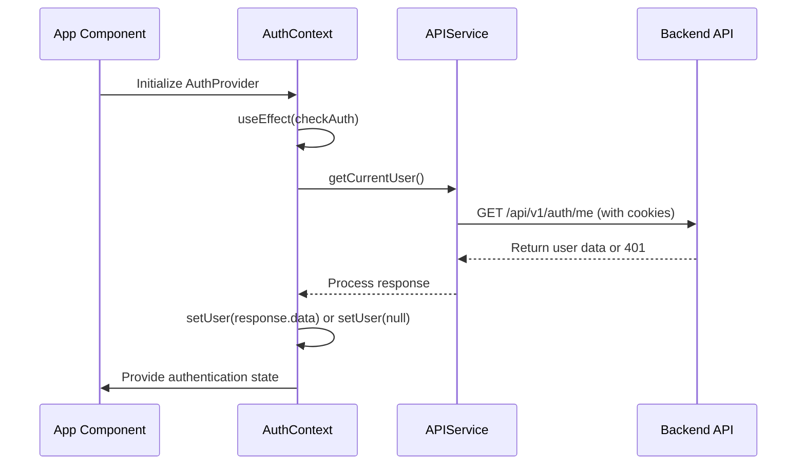
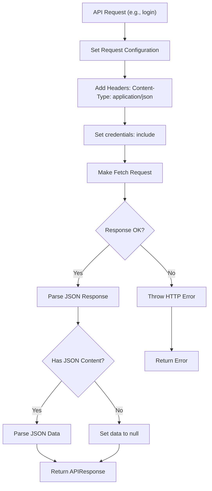
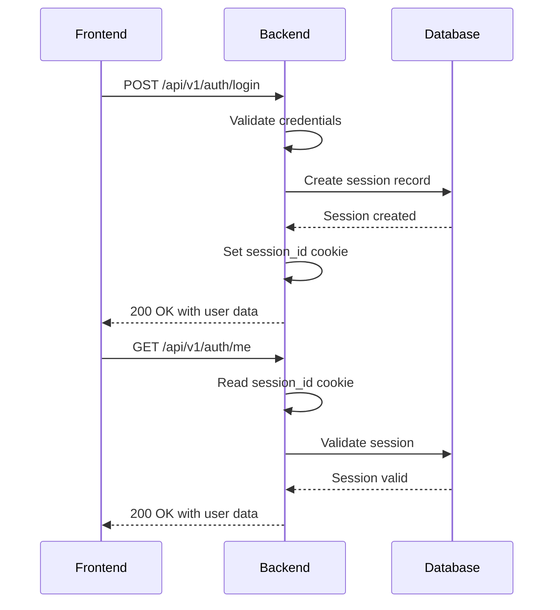
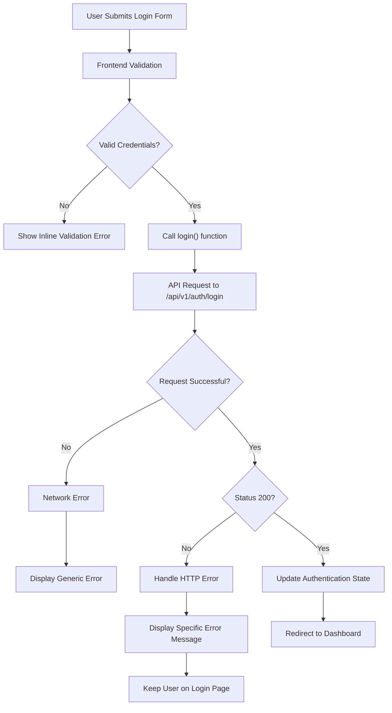
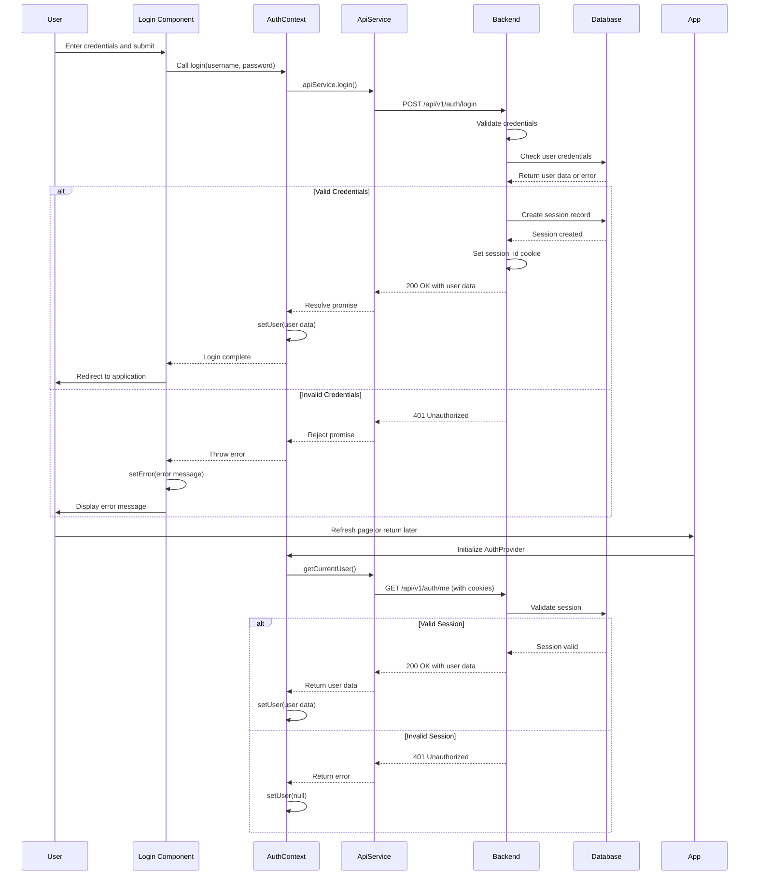

# Authentication Components


## Table of Contents
1. [Authentication Components](#authentication-components)
2. [Login Component Implementation](#login-component-implementation)
3. [Authentication State Management](#authentication-state-management)
4. [API Service and Authentication Requests](#api-service-and-authentication-requests)
5. [Session Persistence and Token Handling](#session-persistence-and-token-handling)
6. [Protected Routes and Access Control](#protected-routes-and-access-control)
7. [Error Handling and Failed Authentication](#error-handling-and-failed-authentication)
8. [Authentication Flow Sequence](#authentication-flow-sequence)

## Login Component Implementation

The Login component (`Login.tsx`) provides the user interface for authentication, implementing form validation, error handling, and submission logic. It is a React functional component that manages local state for user credentials and form status.

Key implementation details:
- **Form Fields**: Username and password inputs with HTML5 validation (`required` attribute)
- **State Management**: Uses React's `useState` hook to manage:
  - `username`: Stores the username input value
  - `password`: Stores the password input value
  - `error`: Stores error messages from failed login attempts
  - `isSubmitting`: Tracks form submission state to prevent duplicate submissions
- **Form Validation**: Built-in browser validation via the `required` attribute on input fields
- **Error Display**: Shows error messages in a red alert box when authentication fails
- **Loading State**: Disables the submit button and displays "Signing in..." text during submission

The component uses the `useAuth` hook to access authentication functionality from the `AuthContext`, specifically the `login` function for credential submission.


```tsx
const handleSubmit = async (e: React.FormEvent) => {
  e.preventDefault();
  setError('');
  setIsSubmitting(true);

  try {
    await login(username, password);
  } catch (err) {
    setError(err instanceof Error ? err.message : 'Login failed');
  } finally {
    setIsSubmitting(false);
  }
};
```


**Section sources**
- [Login.tsx](file://web/src/components/Auth/Login.tsx#L1-L93)

## Authentication State Management

The `AuthContext` (`AuthContext.tsx`) manages authentication state throughout the application using React's Context API. It provides a centralized way to access and modify authentication status across all components.

### State Structure
The context maintains the following state variables:
- `user`: User object when authenticated, null otherwise
- `isAuthenticated`: Boolean indicating current authentication status
- `isLoading`: Boolean indicating whether authentication state is being initialized

### Key Functions
- **`login(username, password)`**: Initiates the login process by calling the API service
- **`logout()`**: Logs the user out and clears the user state
- **`checkAuth()`**: Verifies current authentication status by fetching user data

The context initializes by calling `checkAuth()` in a `useEffect` hook to determine the user's authentication status when the application loads. This ensures that users remain authenticated across page refreshes if they have a valid session.





**Diagram sources**
- [AuthContext.tsx](file://web/src/context/AuthContext.tsx#L1-L82)
- [api.ts](file://web/src/services/api.ts#L1-L119)

**Section sources**
- [AuthContext.tsx](file://web/src/context/AuthContext.tsx#L1-L82)
- [auth.ts](file://web/src/types/auth.ts#L1-L29)

## API Service and Authentication Requests

The `APIService` class (`api.ts`) handles all communication with the backend API, including authentication requests. It provides methods for login, logout, and checking authentication status.

### Request Configuration
The service configures requests with:
- **Content-Type**: `application/json` header
- **Credentials**: `include` policy to send cookies with requests
- **Error Handling**: Comprehensive error handling for network issues and HTTP errors

### Authentication Methods
- **`login(username, password)`**: Sends credentials to `/api/v1/auth/login`
- **`logout()`**: Sends request to `/api/v1/auth/logout`
- **`getCurrentUser()`**: Retrieves current user data from `/api/v1/auth/me`

The service automatically includes authentication cookies with requests, enabling stateful authentication. When a user is authenticated, subsequent API requests include the session cookie, allowing the backend to identify the user.





**Diagram sources**
- [api.ts](file://web/src/services/api.ts#L1-L119)

**Section sources**
- [api.ts](file://web/src/services/api.ts#L1-L119)
- [api.ts](file://web/src/types/api.ts#L1-L19)

## Session Persistence and Token Handling

Authentication state is persisted using HTTP cookies managed by the backend. When a user successfully logs in, the server creates a session and returns a session cookie.

### Backend Session Management
The backend (`auth_handlers.go`) handles sessions as follows:
1. On successful login, creates a session in the database with a unique session ID
2. Sets a `session_id` cookie with:
   - `HttpOnly`: Prevents client-side JavaScript access
   - `Secure`: Only sent over HTTPS
   - `SameSite: Strict`: Prevents CSRF attacks
   - `Expires`: Set to 24 hours from creation
3. Stores session data in the database with user ID, expiration time, IP address, and user agent

### Frontend Session Handling
The frontend automatically includes the session cookie with all API requests due to the `credentials: 'include'` setting. This maintains the user's authenticated state across requests without storing tokens in local storage.

Session persistence across application restarts is achieved through the cookie's expiration policy. The `checkAuth` function in `AuthContext` verifies the session on application load by calling `getCurrentUser()`.





**Diagram sources**
- [auth_handlers.go](file://internal/api/auth_handlers.go#L1-L100)
- [service.go](file://internal/auth/service.go#L1-L135)
- [models.go](file://internal/database/models.go#L320-L339)

**Section sources**
- [auth_handlers.go](file://internal/api/auth_handlers.go#L1-L100)
- [service.go](file://internal/auth/service.go#L1-L135)
- [models.go](file://internal/database/models.go#L320-L339)

## Protected Routes and Access Control

The application implements protected routes through conditional rendering in the main `App` component (`App.tsx`). This approach ensures that only authenticated users can access protected content.

### Route Protection Mechanism
The `AppContent` component determines which content to display based on authentication status:
1. If `isLoading` is true, shows a loading spinner
2. If `isAuthenticated` is false, renders the `Login` component
3. If `isAuthenticated` is true, renders the application layout with all routes

This creates a seamless user experience where unauthenticated users are automatically redirected to the login page, while authenticated users see the full application interface.


```tsx
if (isLoading) {
  return <LoadingSpinner />;
}

if (!isAuthenticated) {
  return <Login />;
}

return (
  <Layout>
    <Routes>
      <Route path="/" element={<Dashboard />} />
      <Route path="/queue" element={<Queue />} />
      {/* Other protected routes */}
    </Routes>
  </Layout>
);
```


The routing is implemented using React Router, with all application routes nested within the authenticated branch. This ensures that no protected route can be accessed without first passing the authentication check.

**Section sources**
- [App.tsx](file://web/src/App.tsx#L1-L77)

## Error Handling and Failed Authentication

The authentication system implements comprehensive error handling for both client-side and server-side failures.

### Client-Side Error Handling
In the `Login` component, errors are caught and displayed to the user:
- Network errors and API failures are caught in the `handleSubmit` try-catch block
- Error messages are stored in the `error` state variable and displayed in a red alert box
- The form is reset to an idle state in the `finally` block, regardless of success or failure

### Server-Side Error Handling
The backend returns structured error responses:
- Invalid credentials: 401 Unauthorized with "Invalid credentials" message
- Missing fields: 400 Bad Request with "Username and password are required"
- Server errors: Appropriate HTTP status codes with descriptive messages

The `AuthContext` also handles errors during authentication status checks, logging errors to the console but treating them as unauthenticated states to prevent application crashes.





**Section sources**
- [Login.tsx](file://web/src/components/Auth/Login.tsx#L1-L93)
- [AuthContext.tsx](file://web/src/context/AuthContext.tsx#L1-L82)
- [auth_handlers.go](file://internal/api/auth_handlers.go#L1-L100)

## Authentication Flow Sequence

The complete authentication flow involves multiple components working together to authenticate users and maintain session state.





**Diagram sources**
- [Login.tsx](file://web/src/components/Auth/Login.tsx#L1-L93)
- [AuthContext.tsx](file://web/src/context/AuthContext.tsx#L1-L82)
- [api.ts](file://web/src/services/api.ts#L1-L119)
- [auth_handlers.go](file://internal/api/auth_handlers.go#L1-L100)

**Referenced Files in This Document**   
- [Login.tsx](file://web/src/components/Auth/Login.tsx)
- [AuthContext.tsx](file://web/src/context/AuthContext.tsx)
- [api.ts](file://web/src/services/api.ts)
- [App.tsx](file://web/src/App.tsx)
- [auth_handlers.go](file://internal/api/auth_handlers.go)
- [service.go](file://internal/auth/service.go)
- [models.go](file://internal/database/models.go)
- [auth.ts](file://web/src/types/auth.ts)
- [api.ts](file://web/src/types/api.ts)