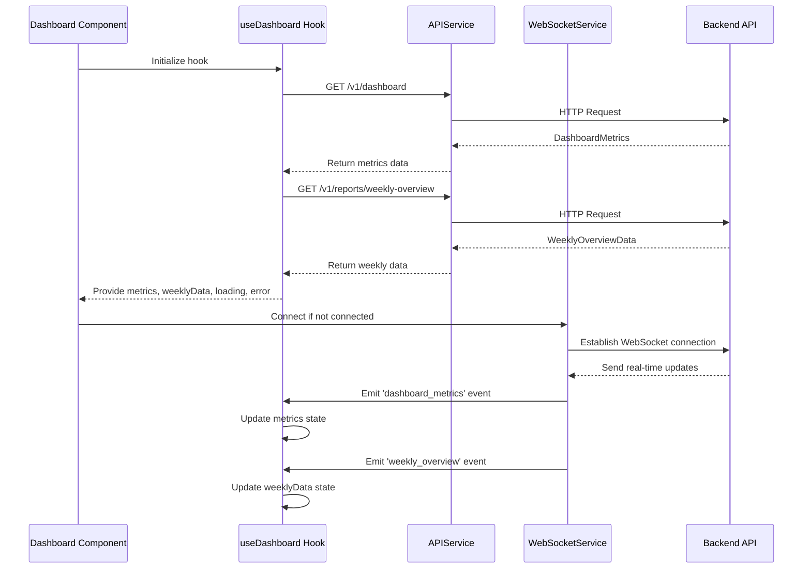
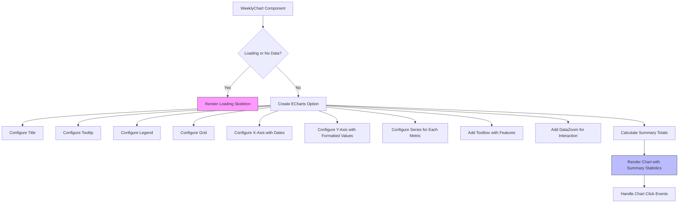
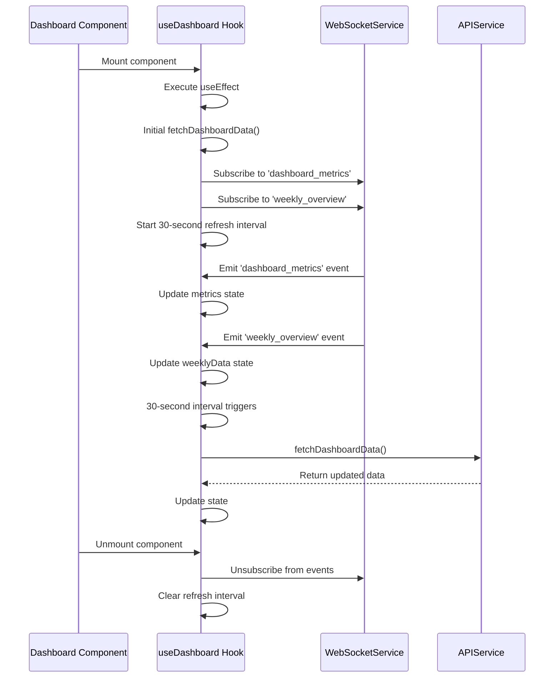
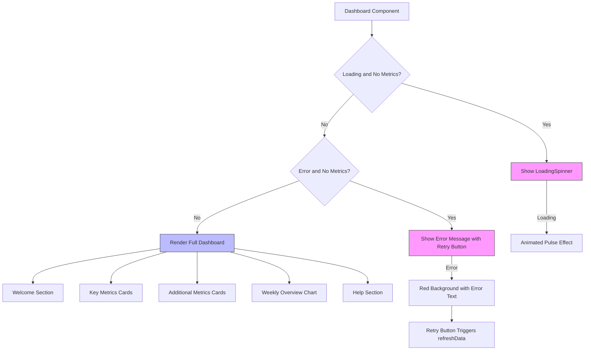

# Dashboard


## Table of Contents
1. [Introduction](#introduction)
2. [Core Components Overview](#core-components-overview)
3. [Data Flow and State Management](#data-flow-and-state-management)
4. [MetricsCard Component Analysis](#metricscard-component-analysis)
5. [WeeklyChart Component Analysis](#weeklychart-component-analysis)
6. [Real-Time Updates and WebSocket Integration](#real-time-updates-and-websocket-integration)
7. [Error Handling and Loading States](#error-handling-and-loading-states)
8. [Backend API Integration](#backend-api-integration)
9. [Troubleshooting Common Issues](#troubleshooting-common-issues)

## Introduction
The Dashboard module in the exim-pilot frontend serves as the central hub for system monitoring and performance visualization. It provides administrators with immediate insights into key email delivery metrics, queue health, and system performance through an intuitive interface. The component displays real-time data on message throughput, delivery success rates, and queue status, enabling proactive management of the Exim mail server infrastructure. Built using React with TypeScript, the Dashboard leverages modern frontend patterns including custom hooks, component composition, and responsive design to deliver a seamless user experience across devices.

## Core Components Overview
The Dashboard module consists of three primary components that work together to present system metrics:
- **Dashboard**: The main container component that orchestrates data fetching and layout
- **MetricsCard**: Reusable component for displaying individual metric values with visual indicators
- **WeeklyChart**: Data visualization component showing weekly email delivery trends

These components are supported by the `useDashboard` custom hook which manages data fetching, state, and real-time updates.

**Section sources**
- [Dashboard.tsx](file://web/src/components/Dashboard/Dashboard.tsx#L1-L231)
- [MetricsCard.tsx](file://web/src/components/Dashboard/MetricsCard.tsx#L1-L109)
- [WeeklyChart.tsx](file://web/src/components/Dashboard/WeeklyChart.tsx#L1-L282)

## Data Flow and State Management
The Dashboard implements a comprehensive data flow pattern using React hooks and service integration. The `useDashboard` hook serves as the central state management mechanism, handling data retrieval from both REST API endpoints and WebSocket connections.





**Diagram sources**
- [useDashboard.ts](file://web/src/hooks/useDashboard.ts#L0-L79)
- [Dashboard.tsx](file://web/src/components/Dashboard/Dashboard.tsx#L0-L231)

**Section sources**
- [useDashboard.ts](file://web/src/hooks/useDashboard.ts#L0-L79)

## MetricsCard Component Analysis
The MetricsCard component displays individual metrics with visual styling based on importance and trend direction. It accepts several props to customize its appearance and behavior.


```mermaid
classDiagram
class MetricsCard {
+title : string
+value : string | number
+subtitle? : string
+color? : 'blue' | 'green' | 'yellow' | 'red' | 'purple' | 'gray'
+trend? : { value : number, direction : 'up' | 'down' | 'stable' }
+loading? : boolean
+helpContent? : string
+render() : JSX.Element
}
class colorClasses {
+blue : { bg : string, text : string, value : string, subtitle : string }
+green : { bg : string, text : string, value : string, subtitle : string }
+yellow : { bg : string, text : string, value : string, subtitle : string }
+red : { bg : string, text : string, value : string, subtitle : string }
+purple : { bg : string, text : string, value : string, subtitle : string }
+gray : { bg : string, text : string, value : string, subtitle : string }
}
class trendIcons {
+up : '↗'
+down : '↘'
+stable : '→'
}
class trendColors {
+up : 'text-green-600'
+down : 'text-red-600'
+stable : 'text-gray-600'
}
MetricsCard --> colorClasses : "uses"
MetricsCard --> trendIcons : "uses"
MetricsCard --> trendColors : "uses"
MetricsCard --> HelpTooltip : "contains"
```


**Diagram sources**
- [MetricsCard.tsx](file://web/src/components/Dashboard/MetricsCard.tsx#L1-L109)

**Section sources**
- [MetricsCard.tsx](file://web/src/components/Dashboard/MetricsCard.tsx#L1-L109)

## WeeklyChart Component Analysis
The WeeklyChart component visualizes weekly email delivery trends using the ECharts library. It displays multiple data series (delivered, failed, pending, deferred) in a stacked bar chart format with interactive features.





The component implements several advanced features:
- **Responsive design**: Adapts to different screen sizes
- **Interactive tooltips**: Show detailed information on hover
- **Data zooming**: Allow users to focus on specific date ranges
- **Export functionality**: Enable saving charts as images
- **Summary statistics**: Display period totals below the chart

**Diagram sources**
- [WeeklyChart.tsx](file://web/src/components/Dashboard/WeeklyChart.tsx#L1-L282)

**Section sources**
- [WeeklyChart.tsx](file://web/src/components/Dashboard/WeeklyChart.tsx#L1-L282)

## Real-Time Updates and WebSocket Integration
The Dashboard implements a hybrid approach to data updates, combining WebSocket real-time updates with periodic polling as a fallback mechanism.





This dual mechanism ensures that users receive immediate updates when WebSocket connections are available, while maintaining data freshness even if real-time connections fail. The fallback polling every 30 seconds provides resilience against network issues.

**Diagram sources**
- [useDashboard.ts](file://web/src/hooks/useDashboard.ts#L50-L79)

**Section sources**
- [useDashboard.ts](file://web/src/hooks/useDashboard.ts#L50-L79)

## Error Handling and Loading States
The Dashboard implements comprehensive error handling and loading state management to provide a smooth user experience during data retrieval and potential failures.





The component handles three primary states:
- **Initial loading**: Displays a spinner when first fetching data
- **Error state**: Shows a descriptive error message with a retry option
- **Normal operation**: Renders the complete dashboard with metrics and charts

Each MetricsCard also implements its own loading state, showing skeleton placeholders with animated pulse effects when data is being refreshed.

**Diagram sources**
- [Dashboard.tsx](file://web/src/components/Dashboard/Dashboard.tsx#L30-L199)

**Section sources**
- [Dashboard.tsx](file://web/src/components/Dashboard/Dashboard.tsx#L30-L199)

## Backend API Integration
The Dashboard integrates with backend endpoints to retrieve system metrics and performance data. The frontend communicates with the backend through well-defined API endpoints.


```mermaid
graph TB
subgraph Frontend
D[Dashboard Component]
H[useDashboard Hook]
A[APIService]
end
subgraph Backend
W[WebSocketService]
E[Express Server]
L[LogHandlers]
DB[(Database)]
end
H --> A: GET /v1/dashboard
H --> A: GET /v1/reports/weekly-overview
A --> E: HTTP Requests
E --> L: Route Handling
L --> DB: Query Statistics
DB --> L: Return Data
L --> E: Create Response
E --> A: JSON Response
A --> H: Process Response
H --> D: Update State
W --> L: Real-time Events
L --> W: Push Updates
W --> H: Emit Events
H --> D: Update State
```


The backend implementation in `log_handlers.go` defines the `/api/v1/dashboard` endpoint that returns comprehensive system metrics including log statistics, service status, and retention information. The response includes data for the last 24 hours by default, with support for custom time ranges via query parameters.

**Diagram sources**
- [useDashboard.ts](file://web/src/hooks/useDashboard.ts#L15-L25)
- [log_handlers.go](file://internal/api/log_handlers.go#L166-L195)

**Section sources**
- [useDashboard.ts](file://web/src/hooks/useDashboard.ts#L15-L25)
- [log_handlers.go](file://internal/api/log_handlers.go#L166-L195)

## Troubleshooting Common Issues
This section addresses common issues that may occur with the Dashboard module and provides guidance for resolution.

### Stale or Outdated Data
**Symptoms**: Dashboard metrics appear outdated or don't reflect recent changes.

**Causes and Solutions**:
- **WebSocket connection failure**: Check browser console for WebSocket errors. The system automatically falls back to polling every 30 seconds.
- **Network connectivity issues**: Verify network connection and firewall settings allow WebSocket connections (typically port 80/443).
- **Server-side processing delays**: Check backend logs for any delays in data processing.

### Missing Metrics
**Symptoms**: Some metrics cards show 0 or are missing entirely.

**Causes and Solutions**:
- **Incomplete API response**: Check browser developer tools for API responses. The backend might not be returning all expected data fields.
- **Data processing errors**: Verify that the log processor service is running and processing logs correctly.
- **Permission issues**: Ensure the authenticated user has sufficient permissions to access all dashboard data.

### Performance Issues
**Symptoms**: Dashboard loads slowly or becomes unresponsive.

**Causes and Solutions**:
- **Large data sets**: The weekly chart may struggle with very large data volumes. Implement server-side pagination or data sampling.
- **Frequent updates**: Monitor WebSocket message frequency. Consider throttling real-time updates if too frequent.
- **Client-side rendering**: For users with older devices, consider implementing lazy loading for non-critical components.

### Error Messages
Common error messages and their meanings:
- **"Failed to connect to WebSocket"**: Real-time updates unavailable. Data will refresh periodically.
- **"Failed to fetch dashboard data"**: Could not retrieve data from the API. Check network connection and server status.
- **"Invalid JSON response from server"**: Backend returned malformed JSON. Check server logs for errors.

**Section sources**
- [Dashboard.tsx](file://web/src/components/Dashboard/Dashboard.tsx#L30-L199)
- [useDashboard.ts](file://web/src/hooks/useDashboard.ts#L25-L45)
- [api.ts](file://web/src/services/api.ts#L0-L118)

**Referenced Files in This Document**   
- [Dashboard.tsx](file://web/src/components/Dashboard/Dashboard.tsx)
- [MetricsCard.tsx](file://web/src/components/Dashboard/MetricsCard.tsx)
- [WeeklyChart.tsx](file://web/src/components/Dashboard/WeeklyChart.tsx)
- [useDashboard.ts](file://web/src/hooks/useDashboard.ts)
- [dashboard.ts](file://web/src/types/dashboard.ts)
- [api.ts](file://web/src/services/api.ts)
- [log_handlers.go](file://internal/api/log_handlers.go)