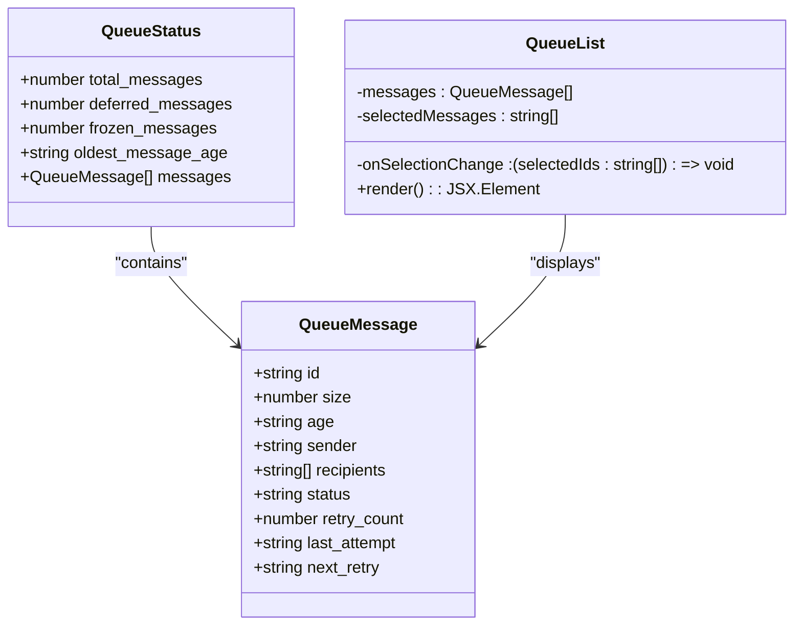
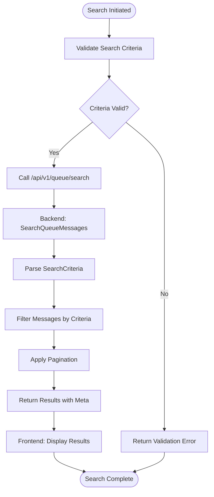
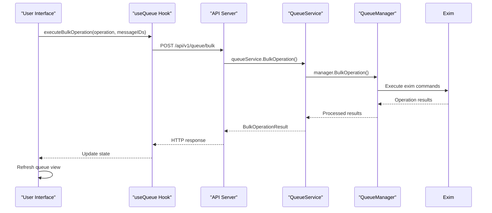
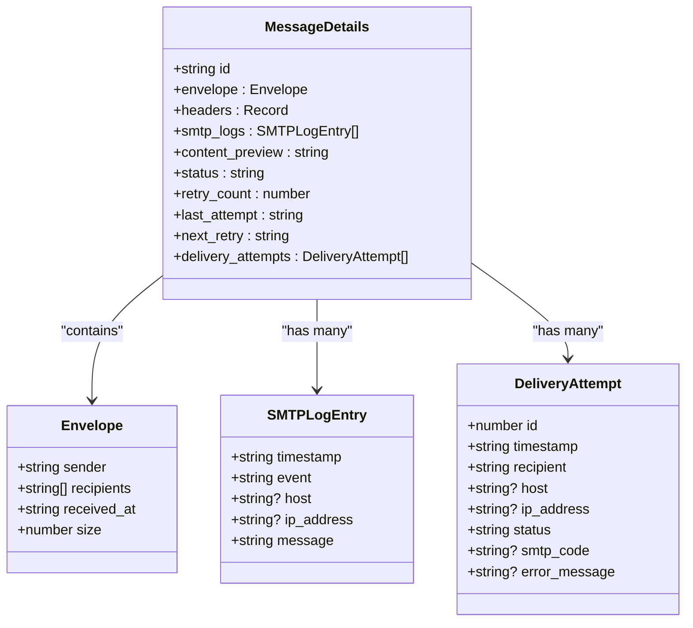
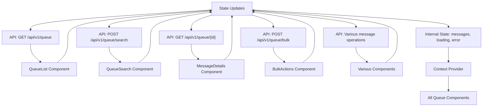
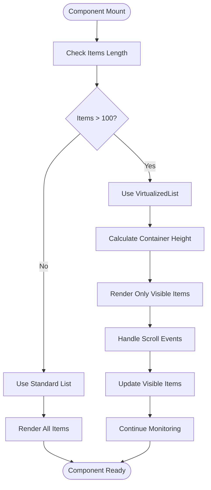
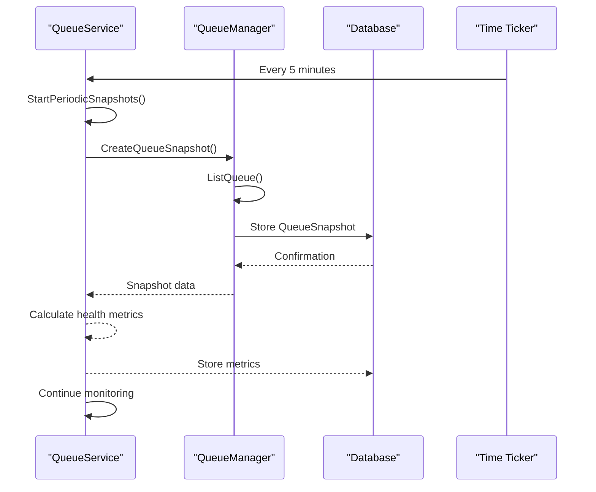

# Queue Management


## Table of Contents
1. [Introduction](#introduction)
2. [Core Components](#core-components)
3. [Architecture Overview](#architecture-overview)
4. [Detailed Component Analysis](#detailed-component-analysis)
5. [State Management and API Integration](#state-management-and-api-integration)
6. [Performance Considerations](#performance-considerations)
7. [Troubleshooting Guide](#troubleshooting-guide)

## Introduction
The Queue Management module provides a comprehensive interface for monitoring, inspecting, and managing email messages in the Exim mail server queue. This document details the architecture, functionality, and implementation of the queue management system, covering message listing, search capabilities, bulk operations, message inspection, and performance optimization techniques.

## Core Components

The Queue Management module consists of several key components that work together to provide a complete queue management solution:

- **QueueList**: Displays paginated lists of queue messages with filtering and sorting capabilities
- **QueueSearch**: Enables advanced search functionality across message metadata
- **BulkActions**: Handles mass operations on selected messages (deliver, freeze, delete)
- **MessageDetails**: Provides in-depth inspection of individual message content and delivery history
- **VirtualizedList**: Implements virtualized rendering for optimal performance with large queues

These components are supported by backend services that interface directly with the Exim mail server and provide RESTful API endpoints for frontend interaction.

**Section sources**
- [queue.ts](file://web/src/types/queue.ts#L1-L96)
- [VirtualizedList.tsx](file://web/src/components/Common/VirtualizedList.tsx#L1-L199)

## Architecture Overview

The Queue Management system follows a client-server architecture with a React-based frontend and Go-based backend services. The frontend components communicate with backend APIs to retrieve queue data and execute operations.


```mermaid
graph TB
subgraph "Frontend"
Queue[Queue Component]
QueueList[QueueList]
QueueSearch[QueueSearch]
BulkActions[BulkActions]
MessageDetails[MessageDetails]
VirtualizedList[VirtualizedList]
end
subgraph "Backend"
API[API Server]
QueueHandlers[QueueHandlers]
QueueService[QueueService]
Manager[QueueManager]
Exim[Exim Mail Server]
end
QueueList --> API : GET /api/v1/queue
QueueSearch --> API : POST /api/v1/queue/search
MessageDetails --> API : GET /api/v1/queue/{id}
BulkActions --> API : POST /api/v1/queue/bulk
API --> QueueHandlers : Route handling
QueueHandlers --> QueueService : Business logic
QueueService --> Manager : Queue operations
Manager --> Exim : exim -bp command
Exim --> Manager : Queue output
Manager --> QueueService : Parsed data
QueueService --> QueueHandlers : Response data
QueueHandlers --> API : HTTP response
API --> Frontend : JSON data
```


**Diagram sources**
- [server.go](file://internal/api/server.go#L90-L141)
- [queue_handlers.go](file://internal/api/queue_handlers.go#L48-L93)
- [service.go](file://internal/queue/service.go#L0-L199)
- [queue.go](file://internal/queue/queue.go#L0-L199)

## Detailed Component Analysis

### QueueList and Message Display

The QueueList component displays messages from the Exim queue with key metadata including message ID, sender, recipients, size, age, and status. It uses virtualized rendering to maintain performance with large queues.





**Diagram sources**
- [queue.ts](file://web/src/types/queue.ts#L1-L20)
- [queue.go](file://internal/queue/queue.go#L10-L30)

**Section sources**
- [queue.ts](file://web/src/types/queue.ts#L1-L20)
- [queue.go](file://internal/queue/queue.go#L10-L30)

### QueueSearch Functionality

The QueueSearch component enables users to filter messages based on various criteria including sender, recipient, message ID, status, age, size, and retry count. The search functionality is implemented on both frontend and backend.





**Diagram sources**
- [queue_handlers.go](file://internal/api/queue_handlers.go#L89-L138)
- [service.go](file://internal/queue/service.go#L150-L199)

**Section sources**
- [queue_handlers.go](file://internal/api/queue_handlers.go#L89-L138)
- [service.go](file://internal/queue/service.go#L150-L199)

### Bulk Operations Handling

The BulkActions component enables users to perform operations on multiple selected messages simultaneously. Supported operations include deliver, freeze, thaw, and delete.





**Diagram sources**
- [queue_handlers.go](file://internal/api/queue_handlers.go#L225-L267)
- [service.go](file://internal/queue/service.go#L250-L300)

**Section sources**
- [queue_handlers.go](file://internal/api/queue_handlers.go#L225-L267)
- [service.go](file://internal/queue/service.go#L250-L300)

### MessageDetails Component

The MessageDetails component provides comprehensive inspection of individual messages, including envelope information, headers, SMTP logs, content preview, and delivery attempts.





**Diagram sources**
- [queue.ts](file://web/src/types/queue.ts#L22-L60)
- [queue_handlers.go](file://internal/api/queue_handlers.go#L133-L179)

**Section sources**
- [queue.ts](file://web/src/types/queue.ts#L22-L60)
- [queue_handlers.go](file://internal/api/queue_handlers.go#L133-L179)

## State Management and API Integration

The Queue Management module uses React hooks for state management and API integration. The useQueue hook centralizes API calls and state management for queue operations.





**Diagram sources**
- [queue_handlers.go](file://internal/api/queue_handlers.go#L48-L394)
- [server.go](file://internal/api/server.go#L90-L141)

**Section sources**
- [queue_handlers.go](file://internal/api/queue_handlers.go#L48-L394)
- [server.go](file://internal/api/server.go#L90-L141)

## Performance Considerations

### Virtualized Rendering

The VirtualizedList component implements virtualized rendering to optimize performance when displaying large queues. Only visible items are rendered, significantly reducing memory usage and improving scroll performance.





**Diagram sources**
- [VirtualizedList.tsx](file://web/src/components/Common/VirtualizedList.tsx#L1-L199)

**Section sources**
- [VirtualizedList.tsx](file://web/src/components/Common/VirtualizedList.tsx#L1-L199)

### Backend Performance Optimization

The backend implements several performance optimizations including periodic queue snapshots and health metrics calculation.





**Diagram sources**
- [service.go](file://internal/queue/service.go#L50-L100)
- [queue.go](file://internal/queue/queue.go#L200-L250)

**Section sources**
- [service.go](file://internal/queue/service.go#L50-L100)
- [queue.go](file://internal/queue/queue.go#L200-L250)

## Troubleshooting Guide

### Common Issues and Resolutions

**Issue: Failed Queue Operations**
- **Symptoms**: Bulk operations return partial or complete failures
- **Causes**: Invalid message IDs, permission issues, Exim command failures
- **Resolution**: 
  1. Verify message IDs exist in the queue
  2. Check user permissions for queue operations
  3. Review Exim server logs for command execution errors
  4. Implement retry logic with exponential backoff

**Issue: Inconsistent UI States**
- **Symptoms**: UI shows stale data after operations
- **Causes**: Missing state updates, failed API calls, caching issues
- **Resolution**:
  1. Ensure all API responses trigger state updates
  2. Implement proper error handling in useQueue hook
  3. Add manual refresh capability
  4. Use optimistic updates when appropriate

**Issue: Slow Performance with Large Queues**
- **Symptoms**: UI lag, slow search, long load times
- **Causes**: Non-virtualized rendering, inefficient search, large payloads
- **Resolution**:
  1. Ensure VirtualizedList is used for message display
  2. Optimize backend search algorithms
  3. Implement pagination with reasonable page sizes
  4. Add loading states and progress indicators

**Issue: Search Not Returning Expected Results**
- **Symptoms**: Missing messages in search results
- **Causes**: Case sensitivity, partial matching issues, field selection
- **Resolution**:
  1. Verify search criteria format
  2. Check case-insensitive matching implementation
  3. Validate all searchable fields are indexed
  4. Test with simplified criteria first

**Section sources**
- [service.go](file://internal/queue/service.go#L190-L200)
- [queue_handlers.go](file://internal/api/queue_handlers.go#L225-L267)
- [VirtualizedList.tsx](file://web/src/components/Common/VirtualizedList.tsx#L1-L199)

**Referenced Files in This Document**   
- [queue.ts](file://web/src/types/queue.ts)
- [VirtualizedList.tsx](file://web/src/components/Common/VirtualizedList.tsx)
- [queue_handlers.go](file://internal/api/queue_handlers.go)
- [service.go](file://internal/queue/service.go)
- [queue.go](file://internal/queue/queue.go)
- [server.go](file://internal/api/server.go)