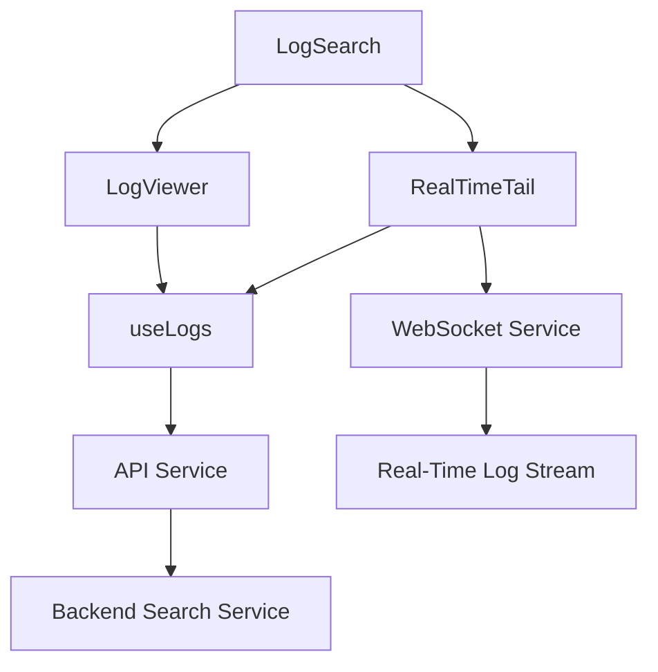
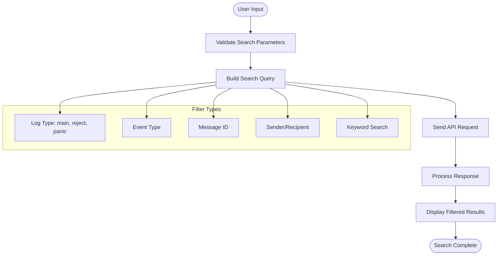
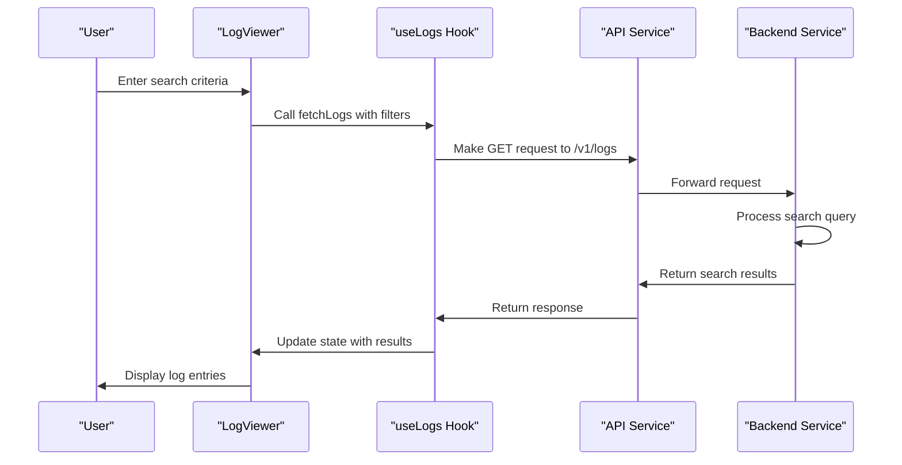
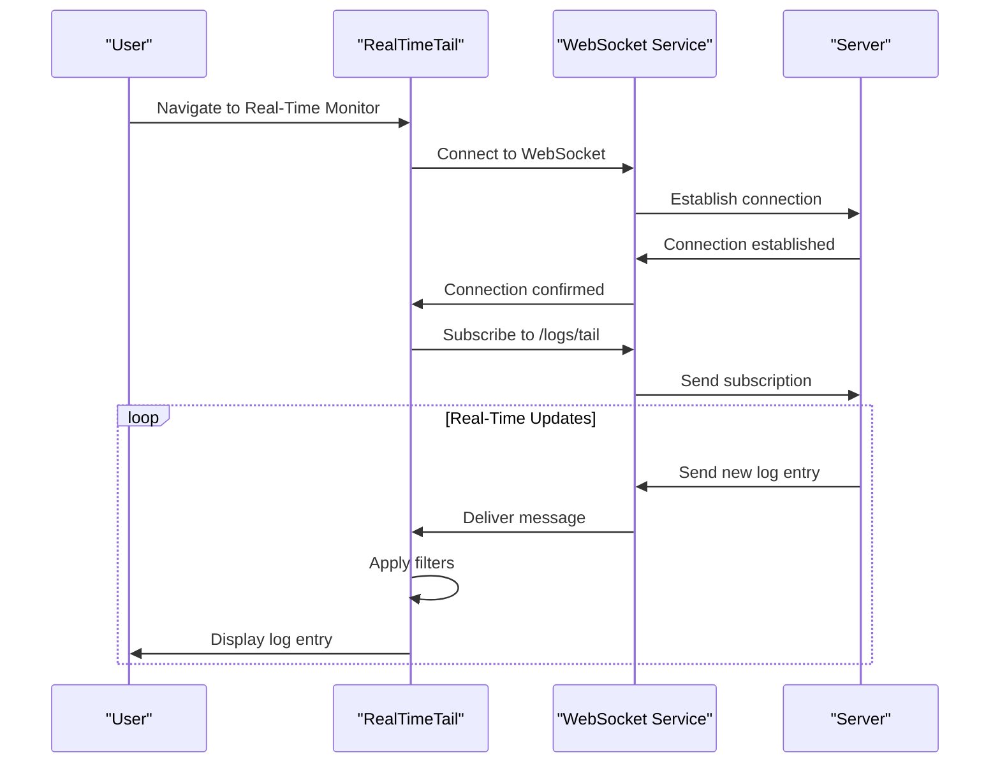
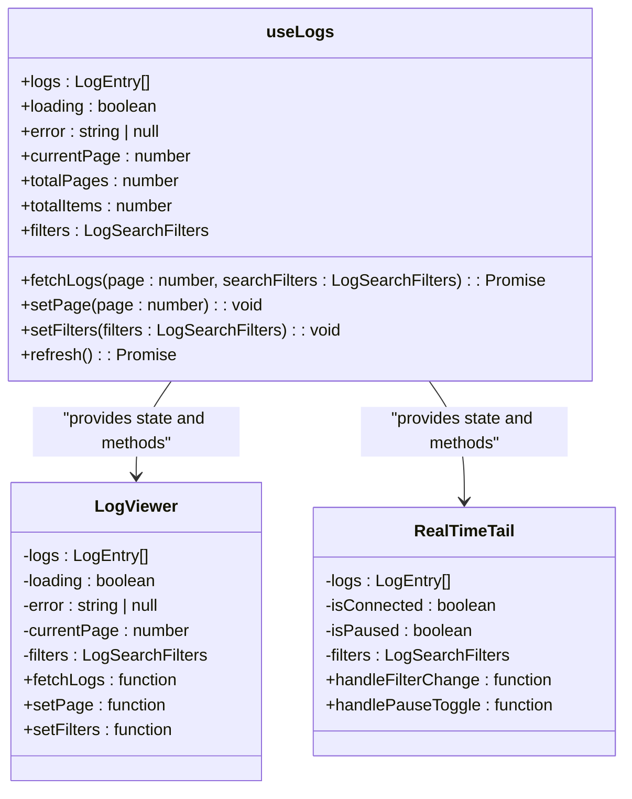
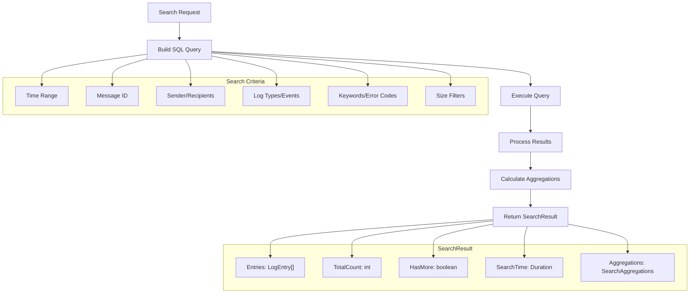
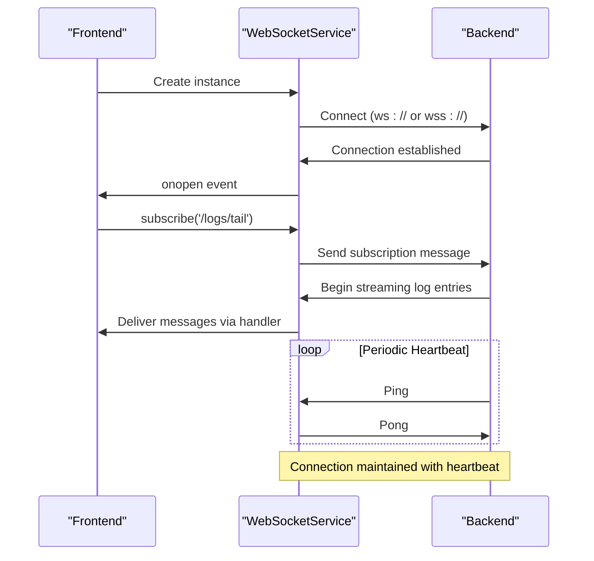
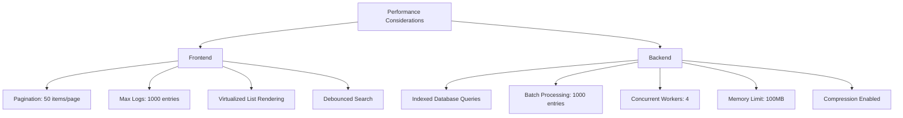

# Logs

## Table of Contents
1. [Introduction](#introduction)
2. [Core Components Overview](#core-components-overview)
3. [Log Search Functionality](#log-search-functionality)
4. [Log Viewer Component](#log-viewer-component)
5. [Real-Time Log Tailing](#real-time-log-tailing)
6. [State Management with useLogs](#state-management-with-uselogs)
7. [Backend Search Implementation](#backend-search-implementation)
8. [WebSocket Communication](#websocket-communication)
9. [Performance and Memory Management](#performance-and-memory-management)
10. [Common Issues and Debugging](#common-issues-and-debugging)

## Introduction
The Logs module in Exim-Pilot provides comprehensive log monitoring capabilities, enabling users to search, filter, and inspect log entries in both historical and real-time contexts. The system is designed to handle large volumes of log data efficiently while providing an intuitive interface for analysis. This documentation details the architecture, components, and functionality of the Logs module, focusing on the interaction between frontend components and backend services.

## Core Components Overview
The Logs module consists of three primary frontend components: LogSearch, LogViewer, and RealTimeTail. These components work together to provide a complete log analysis experience. The system leverages the useLogs hook for state management and API communication, while real-time functionality is enabled through WebSocket connections.

**Diagram sources**
- [LogSearch.tsx](file://web/src/components/Logs/LogSearch.tsx)
- [LogViewer.tsx](file://web/src/components/Logs/LogViewer.tsx)
- [RealTimeTail.tsx](file://web/src/components/Logs/RealTimeTail.tsx)
- [useLogs.ts](file://web/src/hooks/useLogs.ts)
- [websocket.ts](file://web/src/services/websocket.ts)

**Section sources**
- [LogSearch.tsx](file://web/src/components/Logs/LogSearch.tsx)
- [LogViewer.tsx](file://web/src/components/Logs/LogViewer.tsx)
- [RealTimeTail.tsx](file://web/src/components/Logs/RealTimeTail.tsx)

## Log Search Functionality
The LogSearch component provides a user interface for filtering log entries based on various criteria. It supports both basic and advanced search operations, allowing users to narrow down results by log type, event, message ID, sender, recipient, and keyword.

**Diagram sources**
- [LogSearch.tsx](file://web/src/components/Logs/LogSearch.tsx#L0-L235)
- [logs.ts](file://web/src/types/logs.ts#L15-L33)

**Section sources**
- [LogSearch.tsx](file://web/src/components/Logs/LogSearch.tsx)
- [logs.ts](file://web/src/types/logs.ts)

## Log Viewer Component
The LogViewer component displays search results in a tabular format with pagination support. It integrates with the useLogs hook to manage state and handle API communication for retrieving log entries.

**Diagram sources**
- [LogViewer.tsx](file://web/src/components/Logs/LogViewer.tsx#L32-L78)
- [useLogs.ts](file://web/src/hooks/useLogs.ts#L39-L82)

**Section sources**
- [LogViewer.tsx](file://web/src/components/Logs/LogViewer.tsx)
- [useLogs.ts](file://web/src/hooks/useLogs.ts)

## Real-Time Log Tailing
The RealTimeTail component enables live monitoring of log entries as they are generated. It establishes a WebSocket connection to receive real-time updates and applies client-side filtering to display relevant entries.

**Diagram sources**
- [RealTimeTail.tsx](file://web/src/components/Logs/RealTimeTail.tsx#L31-L68)
- [websocket.ts](file://web/src/services/websocket.ts#L0-L42)

**Section sources**
- [RealTimeTail.tsx](file://web/src/components/Logs/RealTimeTail.tsx)
- [websocket.ts](file://web/src/services/websocket.ts)

## State Management with useLogs
The useLogs hook provides centralized state management for log-related components. It handles API communication, pagination, filtering, and error handling, exposing a clean interface for components to interact with the log data.

**Diagram sources**
- [useLogs.ts](file://web/src/hooks/useLogs.ts#L0-L40)
- [LogViewer.tsx](file://web/src/components/Logs/LogViewer.tsx#L0-L36)
- [RealTimeTail.tsx](file://web/src/components/Logs/RealTimeTail.tsx#L0-L31)

**Section sources**
- [useLogs.ts](file://web/src/hooks/useLogs.ts)
- [LogViewer.tsx](file://web/src/components/Logs/LogViewer.tsx)
- [RealTimeTail.tsx](file://web/src/components/Logs/RealTimeTail.tsx)

## Backend Search Implementation
The backend search functionality is implemented in the logprocessor package, which provides advanced search capabilities through the SearchService. This service constructs SQL queries based on search criteria and returns paginated results with metadata.

**Diagram sources**
- [search.go](file://internal/logprocessor/search.go#L44-L199)
- [log_handlers.go](file://internal/api/log_handlers.go#L88-L135)

**Section sources**
- [search.go](file://internal/logprocessor/search.go)
- [log_handlers.go](file://internal/api/log_handlers.go)

## WebSocket Communication
The WebSocket implementation enables real-time communication between the frontend and backend. The WebSocketService class manages the connection lifecycle, including automatic reconnection and subscription management for different endpoints.

**Diagram sources**
- [websocket.ts](file://web/src/services/websocket.ts#L0-L164)
- [RealTimeTail.tsx](file://web/src/components/Logs/RealTimeTail.tsx#L31-L68)

**Section sources**
- [websocket.ts](file://web/src/services/websocket.ts)
- [RealTimeTail.tsx](file://web/src/components/Logs/RealTimeTail.tsx)

## Performance and Memory Management
The system implements several performance optimizations to handle large datasets efficiently. These include pagination, client-side memory limits for real-time logs, and backend query optimization.

**Key Performance Features:**
- **Pagination**: Limits results to 50 entries per page by default
- **Memory Management**: RealTimeTail limits stored entries to configurable maximum (default 1000)
- **Query Optimization**: Backend uses indexed database queries with appropriate filtering
- **Streaming Processing**: Log files are processed in a streaming fashion to minimize memory usage
- **Batch Processing**: Log entries are processed in batches to optimize database operations

**Diagram sources**
- [useLogs.ts](file://web/src/hooks/useLogs.ts#L0-L40)
- [RealTimeTail.tsx](file://web/src/components/Logs/RealTimeTail.tsx#L270-L306)
- [streaming.go](file://internal/logprocessor/streaming.go#L15-L30)
- [search.go](file://internal/logprocessor/search.go#L44-L199)

**Section sources**
- [useLogs.ts](file://web/src/hooks/useLogs.ts)
- [RealTimeTail.tsx](file://web/src/components/Logs/RealTimeTail.tsx)
- [streaming.go](file://internal/logprocessor/streaming.go)
- [search.go](file://internal/logprocessor/search.go)

## Common Issues and Debugging
This section addresses common issues encountered when using the Logs module and provides debugging techniques and best practices.

### Common Issues
- **Delayed Updates**: Real-time logs may have a slight delay due to processing and network latency
- **Parsing Errors**: Invalid log formats may cause parsing failures in the streaming processor
- **Memory Issues**: Large search results or unbounded real-time logging can lead to high memory usage
- **Connection Problems**: WebSocket connections may drop due to network issues or server restarts

### Debugging Techniques
- **Check Browser Console**: Look for JavaScript errors and WebSocket connection status
- **Verify API Responses**: Use browser developer tools to inspect API requests and responses
- **Monitor Network Traffic**: Check for failed requests or slow responses
- **Review Server Logs**: Examine backend logs for processing errors or database issues

### Best Practices
- **Use Specific Filters**: Narrow down search criteria to improve performance
- **Clear Filters Regularly**: Reset filters when changing analysis focus
- **Limit Real-Time Duration**: Pause real-time monitoring when not actively observing
- **Monitor Connection Status**: Pay attention to WebSocket connection indicators
- **Use Message ID Correlation**: Leverage message IDs to trace related log entries across different log types

**Section sources**
- [RealTimeTail.tsx](file://web/src/components/Logs/RealTimeTail.tsx)
- [websocket.ts](file://web/src/services/websocket.ts)
- [search.go](file://internal/logprocessor/search.go)
- [streaming.go](file://internal/logprocessor/streaming.go)

**Referenced Files in This Document**   
- [search.go](file://internal/logprocessor/search.go)
- [streaming.go](file://internal/logprocessor/streaming.go)
- [websocket.ts](file://web/src/services/websocket.ts)
- [logs.ts](file://web/src/types/logs.ts)
- [LogSearch.tsx](file://web/src/components/Logs/LogSearch.tsx)
- [LogViewer.tsx](file://web/src/components/Logs/LogViewer.tsx)
- [RealTimeTail.tsx](file://web/src/components/Logs/RealTimeTail.tsx)
- [useLogs.ts](file://web/src/hooks/useLogs.ts)
- [log_handlers.go](file://internal/api/log_handlers.go)