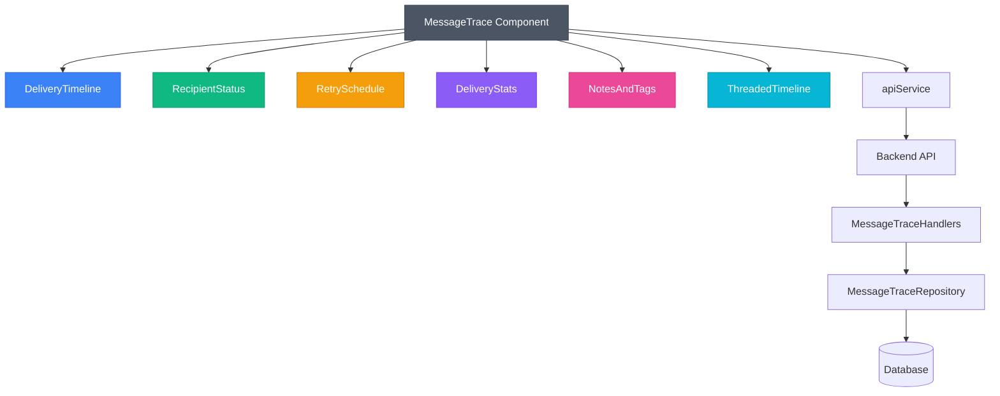
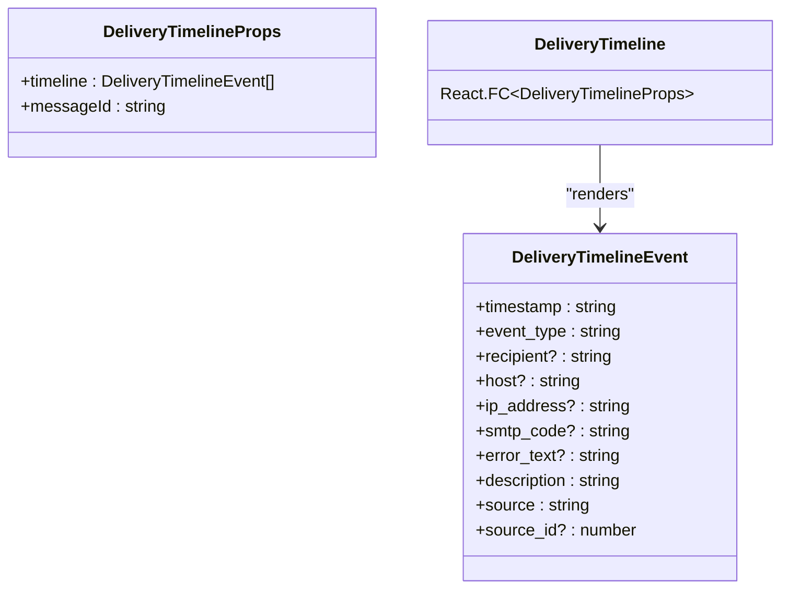
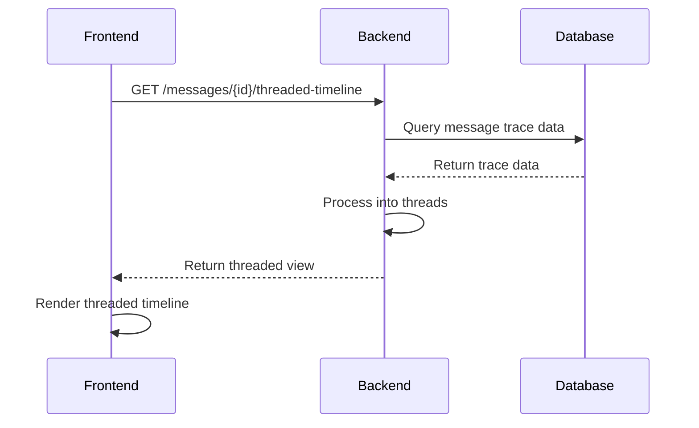
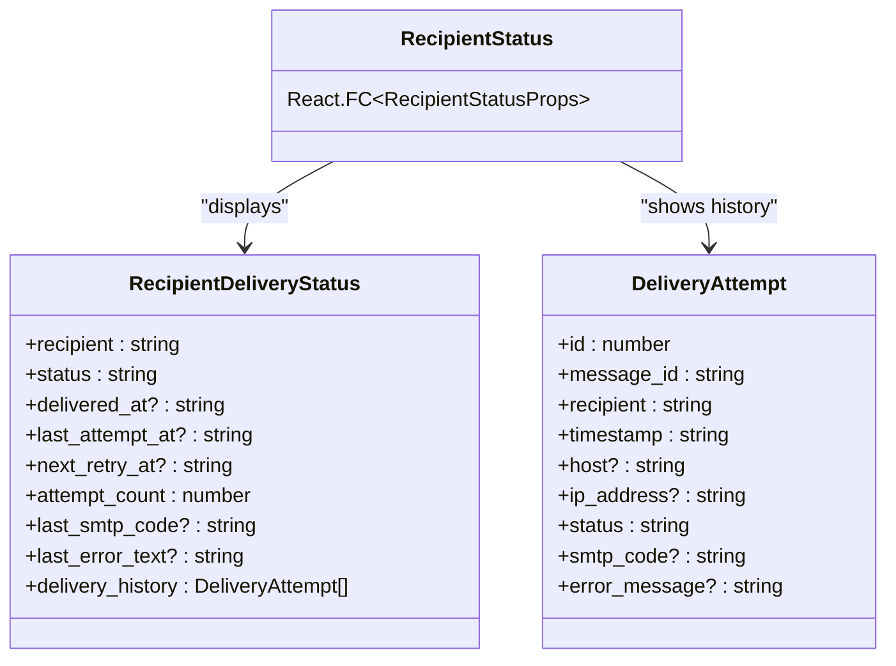
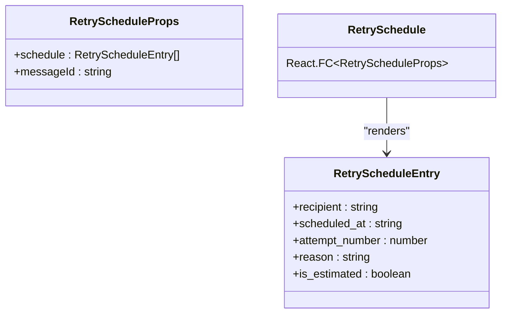
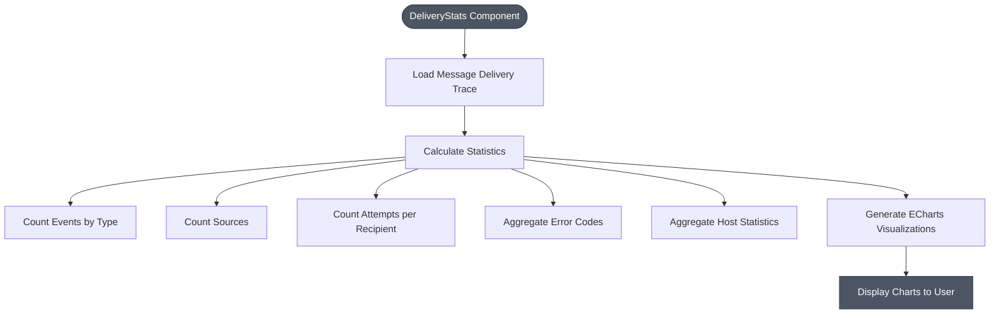
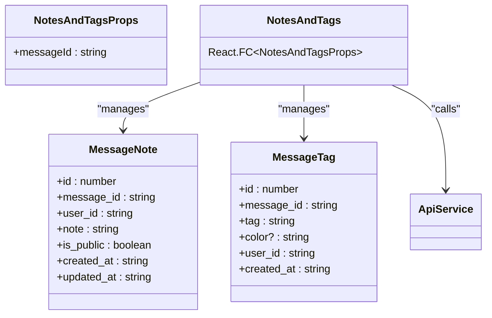
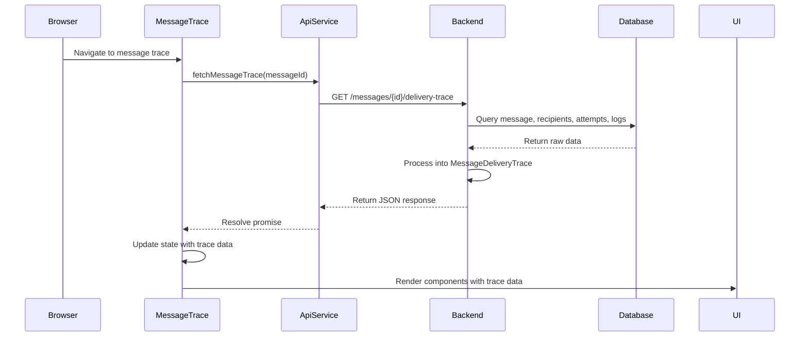

# Message Trace

## Table of Contents
1. [Introduction](#introduction)
2. [Core Components Overview](#core-components-overview)
3. [Message Delivery Visualization](#message-delivery-visualization)
4. [Recipient-Level Status Tracking](#recipient-level-status-tracking)
5. [Retry Scheduling System](#retry-scheduling-system)
6. [Delivery Statistics and Analytics](#delivery-statistics-and-analytics)
7. [Message Annotation System](#message-annotation-system)
8. [API Integration and Data Flow](#api-integration-and-data-flow)
9. [Troubleshooting Common Issues](#troubleshooting-common-issues)
10. [Conclusion](#conclusion)

## Introduction
The Message Trace module provides comprehensive visibility into the delivery lifecycle of individual email messages within the Exim-Pilot system. This documentation details how the system visualizes message delivery paths, tracks recipient status, manages retry schedules, displays delivery statistics, and enables message annotation. The module integrates frontend React components with backend Go services to deliver a complete tracing solution that helps administrators diagnose delivery issues and monitor message flow through the system.

## Core Components Overview

The Message Trace module consists of several interconnected React components that work together to provide a comprehensive view of message delivery. The main `MessageTrace` component serves as the container that orchestrates the display of various trace aspects through tabbed navigation. It fetches trace data from the backend API and distributes it to specialized subcomponents for rendering specific aspects of the message delivery history.

**Diagram sources**
- [MessageTrace.tsx](file://web/src/components/MessageTrace/MessageTrace.tsx#L1-L340)
- [message_trace_handlers.go](file://internal/api/message_trace_handlers.go#L1-L754)

**Section sources**
- [MessageTrace.tsx](file://web/src/components/MessageTrace/MessageTrace.tsx#L1-L340)

## Message Delivery Visualization

### Delivery Timeline Component
The `DeliveryTimeline` component visualizes the chronological path of a message through the system, showing key events from arrival to final delivery or bounce. It displays events with appropriate icons and color coding based on event type, allowing users to quickly identify the message's journey.

**Diagram sources**
- [DeliveryTimeline.tsx](file://web/src/components/MessageTrace/DeliveryTimeline.tsx#L1-L283)

The component supports filtering by event type, recipient, and data source, enabling users to focus on specific aspects of the delivery process. Each event is displayed with a timestamp, descriptive text, and source information, providing context for when and where each delivery event occurred.

### Threaded Timeline Component
The `ThreadedTimeline` component provides an alternative view that organizes delivery events into logical threads based on recipients, hosts, or system processes. This threading approach helps users understand complex delivery patterns and identify issues affecting specific message paths.

**Diagram sources**
- [ThreadedTimeline.tsx](file://web/src/components/MessageTrace/ThreadedTimeline.tsx#L1-L361)
- [message_trace_handlers.go](file://internal/api/message_trace_handlers.go#L390-L436)

The threaded view groups related events together, making it easier to follow the delivery attempts for individual recipients or analyze patterns across multiple delivery attempts. Users can expand and collapse threads to focus on specific aspects of the delivery process.

**Section sources**
- [DeliveryTimeline.tsx](file://web/src/components/MessageTrace/DeliveryTimeline.tsx#L1-L283)
- [ThreadedTimeline.tsx](file://web/src/components/MessageTrace/ThreadedTimeline.tsx#L1-L361)

## Recipient-Level Status Tracking

The `RecipientStatus` component displays detailed delivery information for each message recipient, including current status, delivery timing, attempt counts, and error details. This granular view helps identify delivery issues affecting specific recipients.

**Diagram sources**
- [RecipientStatus.tsx](file://web/src/components/MessageTrace/RecipientStatus.tsx#L1-L282)

The component provides a filterable list of recipients, allowing users to quickly identify recipients with specific status conditions (delivered, deferred, bounced, or pending). Each recipient entry shows key metrics and can be expanded to reveal detailed delivery history, including timestamps, hosts, and error messages from each delivery attempt.

**Section sources**
- [RecipientStatus.tsx](file://web/src/components/MessageTrace/RecipientStatus.tsx#L1-L282)

## Retry Scheduling System

The `RetrySchedule` component visualizes upcoming delivery retry attempts for deferred messages, helping administrators anticipate future delivery activity and identify messages requiring attention.

**Diagram sources**
- [RetrySchedule.tsx](file://web/src/components/MessageTrace/RetrySchedule.tsx#L1-L218)

The component displays retry information in both timeline and grouped views, showing the scheduled time, attempt number, reason for retry, and whether the schedule is estimated or confirmed. It provides relative time indicators (e.g., "in 2 hours") and highlights overdue or imminent retries with appropriate visual cues.

The backend calculates retry schedules by analyzing recipient delivery statuses and historical attempt patterns. Estimated retries are indicated with a different icon and color, helping users distinguish between confirmed schedule entries and predictive estimates.

**Section sources**
- [RetrySchedule.tsx](file://web/src/components/MessageTrace/RetrySchedule.tsx#L1-L218)

## Delivery Statistics and Analytics

The `DeliveryStats` component provides visual analytics of message delivery performance, using charts to illustrate key metrics and patterns in the delivery process.

**Diagram sources**
- [DeliveryStats.tsx](file://web/src/components/MessageTrace/DeliveryStats.tsx#L1-L332)

The component includes several visualizations:
- **Delivery Status Distribution**: A pie chart showing the proportion of recipients in each delivery state (delivered, deferred, bounced, pending)
- **Event Types Distribution**: A bar chart displaying the frequency of different delivery event types
- **Delivery Attempts per Recipient**: A bar chart showing the number of delivery attempts for each recipient

These visualizations help identify patterns in delivery performance, such as messages with unusually high retry counts or specific error codes affecting multiple recipients.

**Section sources**
- [DeliveryStats.tsx](file://web/src/components/MessageTrace/DeliveryStats.tsx#L1-L332)

## Message Annotation System

The `NotesAndTags` component enables users to annotate messages with contextual information and categorize them using tags, creating a collaborative troubleshooting environment.

**Diagram sources**
- [NotesAndTags.tsx](file://web/src/components/MessageTrace/NotesAndTags.tsx#L1-L434)

The annotation system supports both private and public notes, allowing team members to share insights while maintaining space for personal observations. Tags can be color-coded and are persisted to the database, enabling message categorization and filtering. The component also displays popular tags from across the system, promoting consistent tagging practices.

The persistence mechanism uses REST API endpoints to create, read, update, and delete notes and tags, with all operations returning appropriate success or error responses that are handled by the component's state management.

**Section sources**
- [NotesAndTags.tsx](file://web/src/components/MessageTrace/NotesAndTags.tsx#L1-L434)

## API Integration and Data Flow

The Message Trace module integrates with backend services through a well-defined API contract, ensuring consistent data exchange between frontend and backend components.

**Diagram sources**
- [MessageTrace.tsx](file://web/src/components/MessageTrace/MessageTrace.tsx#L1-L340)
- [message_trace_handlers.go](file://internal/api/message_trace_handlers.go#L121-L164)

Key API endpoints include:
- `GET /messages/{id}/delivery-trace`: Retrieves comprehensive delivery trace data
- `GET /messages/{id}/threaded-timeline`: Returns message events organized into logical threads
- `GET /messages/{id}/notes`: Fetches all notes associated with a message
- `POST /messages/{id}/notes`: Creates a new note for a message
- `GET /messages/{id}/tags`: Retrieves all tags associated with a message
- `POST /messages/{id}/tags`: Adds a new tag to a message

The backend `MessageTraceHandlers` processes these requests by coordinating with the `MessageTraceRepository` to retrieve and format data from the database, ensuring consistent and efficient data access patterns.

**Section sources**
- [message_trace_handlers.go](file://internal/api/message_trace_handlers.go#L1-L754)
- [repository.go](file://internal/database/repository.go#L664-L1388)

## Troubleshooting Common Issues

### Incomplete Traces
Incomplete traces may occur when message data is not fully processed or when there are gaps in log collection. To address this:

1. Verify that all relevant log files have been processed by the log processor service
2. Check that the message ID exists in the database
3. Ensure that the message has progressed beyond initial receipt

The system handles missing data gracefully by displaying available information and indicating when trace data is incomplete.

### Timing Discrepancies
Timing discrepancies between system components can cause confusion in trace analysis. These may arise from:
- Clock synchronization issues between servers
- Processing delays in log aggregation
- Network latency affecting timestamp recording

To mitigate timing issues:
- Ensure all servers use synchronized time sources (NTP)
- Consider time zone differences when interpreting timestamps
- Use relative time calculations when comparing events across systems

### Data Consistency Issues
When trace data appears inconsistent (e.g., delivery status conflicts with timeline events), consider:
- The data source for each piece of information (log files vs. queue data vs. audit logs)
- The timing of data collection relative to message processing
- Potential race conditions in data recording

The Message Trace system resolves these conflicts by prioritizing authoritative data sources and providing transparency about data provenance through the source field in timeline events.

**Section sources**
- [models.go](file://internal/database/models.go#L1-L341)
- [repository.go](file://internal/database/repository.go#L664-L1388)

## Conclusion
The Message Trace module provides a comprehensive suite of tools for visualizing and analyzing message delivery in the Exim-Pilot system. By combining chronological timelines, recipient-level status tracking, retry scheduling, statistical analytics, and collaborative annotation features, it offers administrators deep insights into message delivery patterns and issues. The modular component architecture allows for flexible display options while maintaining a consistent data model across views. The integration between frontend React components and backend Go services ensures efficient data retrieval and processing, enabling real-time analysis of message delivery performance.

**Referenced Files in This Document**   
- [MessageTrace.tsx](file://web/src/components/MessageTrace/MessageTrace.tsx)
- [DeliveryTimeline.tsx](file://web/src/components/MessageTrace/DeliveryTimeline.tsx)
- [ThreadedTimeline.tsx](file://web/src/components/MessageTrace/ThreadedTimeline.tsx)
- [RecipientStatus.tsx](file://web/src/components/MessageTrace/RecipientStatus.tsx)
- [RetrySchedule.tsx](file://web/src/components/MessageTrace/RetrySchedule.tsx)
- [DeliveryStats.tsx](file://web/src/components/MessageTrace/DeliveryStats.tsx)
- [NotesAndTags.tsx](file://web/src/components/MessageTrace/NotesAndTags.tsx)
- [message_trace_handlers.go](file://internal/api/message_trace_handlers.go)
- [models.go](file://internal/database/models.go)
- [repository.go](file://internal/database/repository.go)