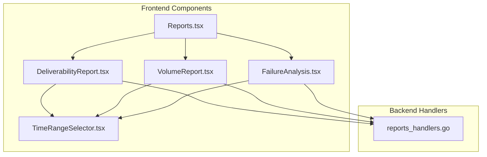
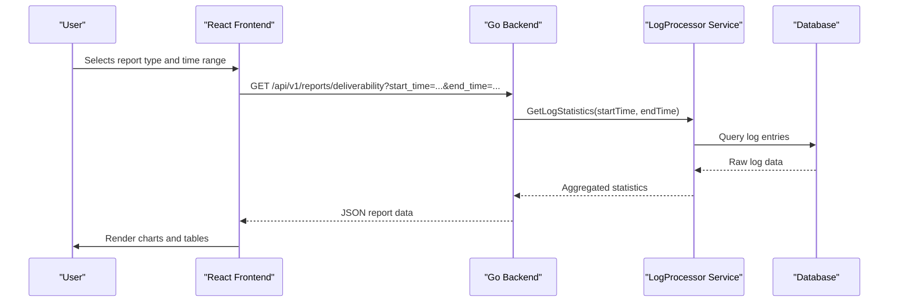
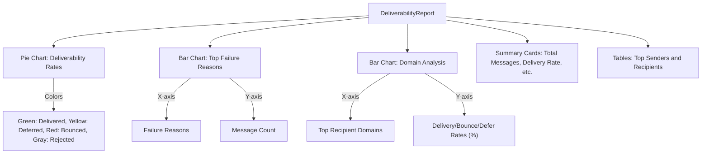
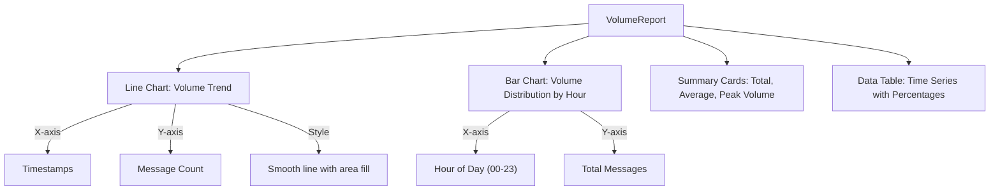
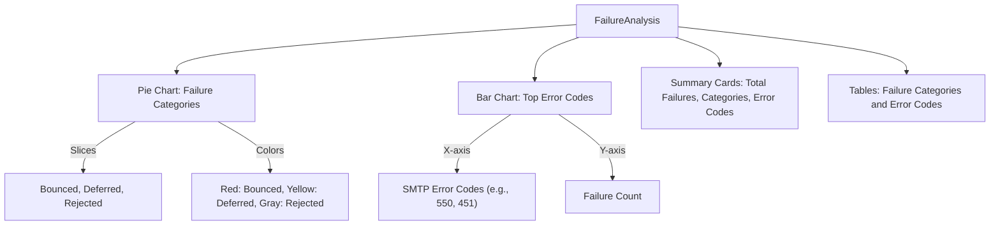
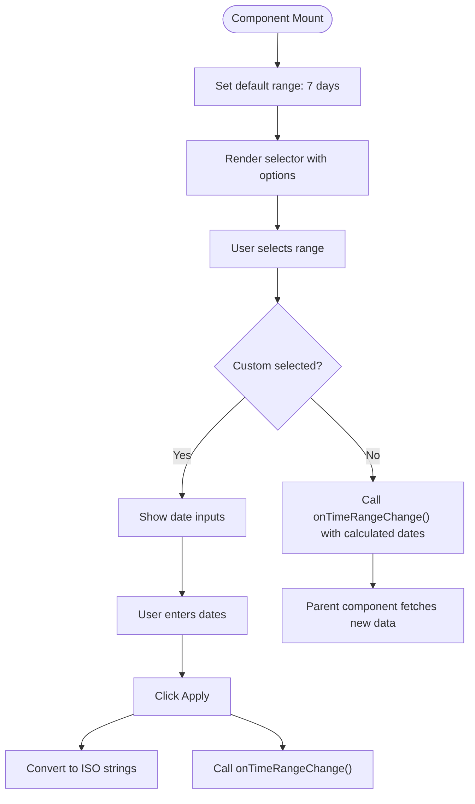
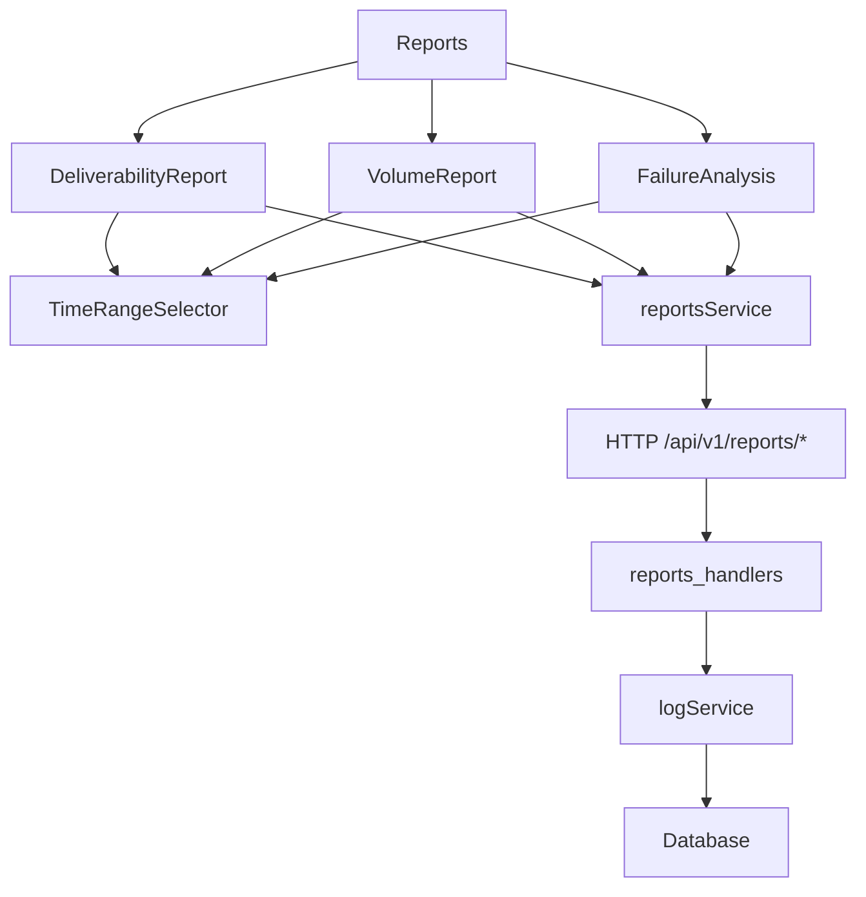

# Reports

## Table of Contents
1. [Introduction](#introduction)
2. [Project Structure](#project-structure)
3. [Core Components](#core-components)
4. [Architecture Overview](#architecture-overview)
5. [Detailed Component Analysis](#detailed-component-analysis)
6. [Dependency Analysis](#dependency-analysis)
7. [Performance Considerations](#performance-considerations)
8. [Troubleshooting Guide](#troubleshooting-guide)
9. [Conclusion](#conclusion)

## Introduction
The Reports module in the Exim-Pilot system provides comprehensive analytics for email deliverability, volume trends, and failure analysis. It enables administrators and system operators to monitor messaging performance, identify delivery issues, and optimize email infrastructure. The module consists of three primary subcomponents—DeliverabilityReport, VolumeReport, and FailureAnalysis—each offering specialized visualizations and statistical insights. These components are integrated with backend reporting endpoints and support dynamic filtering through the TimeRangeSelector, allowing users to analyze data across custom date ranges. The system also supports data export functionality for offline analysis and reporting.

## Project Structure
The Reports module is organized under the `web/src/components/Reports` directory and includes dedicated React components for each report type, along with shared utilities like the TimeRangeSelector. The backend reporting logic resides in the `internal/api/reports_handlers.go` file, which defines RESTful endpoints for generating various types of reports. The frontend communicates with these endpoints via service calls, retrieving structured JSON responses that are rendered using ECharts for interactive data visualization.

**Diagram sources**
- [Reports.tsx](file://web/src/components/Reports/Reports.tsx)
- [DeliverabilityReport.tsx](file://web/src/components/Reports/DeliverabilityReport.tsx)
- [VolumeReport.tsx](file://web/src/components/Reports/VolumeReport.tsx)
- [FailureAnalysis.tsx](file://web/src/components/Reports/FailureAnalysis.tsx)
- [TimeRangeSelector.tsx](file://web/src/components/Reports/TimeRangeSelector.tsx)
- [reports_handlers.go](file://internal/api/reports_handlers.go)

**Section sources**
- [Reports.tsx](file://web/src/components/Reports/Reports.tsx)
- [reports_handlers.go](file://internal/api/reports_handlers.go)

## Core Components
The Reports module is composed of several key components that work together to deliver actionable insights. The main container component, `Reports.tsx`, manages navigation between different report types using a tabbed interface. Each subcomponent—`DeliverabilityReport`, `VolumeReport`, and `FailureAnalysis`—fetches data from the backend, processes it, and renders visualizations using ECharts. The `TimeRangeSelector` component provides a unified interface for filtering reports by time period, supporting both predefined ranges and custom date selections.

**Section sources**
- [Reports.tsx](file://web/src/components/Reports/Reports.tsx)
- [DeliverabilityReport.tsx](file://web/src/components/Reports/DeliverabilityReport.tsx)
- [VolumeReport.tsx](file://web/src/components/Reports/VolumeReport.tsx)
- [FailureAnalysis.tsx](file://web/src/components/Reports/FailureAnalysis.tsx)
- [TimeRangeSelector.tsx](file://web/src/components/Reports/TimeRangeSelector.tsx)

## Architecture Overview
The Reports module follows a client-server architecture where the frontend React components request data from backend Go handlers via HTTP APIs. The backend retrieves log statistics from the database through the logprocessor service and aggregates them into structured reports. These reports are serialized as JSON and sent to the frontend, where they are visualized using interactive charts. The system supports efficient handling of large datasets by aggregating data on the server side and only transmitting summarized results.

**Diagram sources**
- [reports_handlers.go](file://internal/api/reports_handlers.go)
- [DeliverabilityReport.tsx](file://web/src/components/Reports/DeliverabilityReport.tsx)

## Detailed Component Analysis

### DeliverabilityReport Analysis
The `DeliverabilityReport` component provides insights into email delivery success rates, bounce rates, deferral rates, and rejection rates. It fetches multiple datasets in parallel, including deliverability metrics, top senders, top recipients, and domain analysis. The component uses a pie chart to visualize deliverability rates and bar charts to show top failure reasons and domain performance.

#### Data Visualization

**Diagram sources**
- [DeliverabilityReport.tsx](file://web/src/components/Reports/DeliverabilityReport.tsx)

**Section sources**
- [DeliverabilityReport.tsx](file://web/src/components/Reports/DeliverabilityReport.tsx)
- [reports_handlers.go](file://internal/api/reports_handlers.go#L100-L150)

### VolumeReport Analysis
The `VolumeReport` component analyzes email volume trends over time. It allows users to group data by hour, day, week, or month and provides both trend line charts and distribution histograms. The component includes interactive controls for changing the grouping interval and displays summary metrics such as total volume, average volume, and peak volume.

#### Data Visualization

**Diagram sources**
- [VolumeReport.tsx](file://web/src/components/Reports/VolumeReport.tsx)

**Section sources**
- [VolumeReport.tsx](file://web/src/components/Reports/VolumeReport.tsx)
- [reports_handlers.go](file://internal/api/reports_handlers.go#L150-L180)

### FailureAnalysis Analysis
The `FailureAnalysis` component focuses on diagnosing email delivery failures. It categorizes failures into types such as bounces, deferrals, and rejections, and provides detailed breakdowns by error code. The component uses a pie chart for failure categories and a bar chart for top error codes, along with detailed tables that include descriptions and counts.

#### Data Visualization

**Diagram sources**
- [FailureAnalysis.tsx](file://web/src/components/Reports/FailureAnalysis.tsx)

**Section sources**
- [FailureAnalysis.tsx](file://web/src/components/Reports/FailureAnalysis.tsx)
- [reports_handlers.go](file://internal/api/reports_handlers.go#L180-L210)

### TimeRangeSelector Analysis
The `TimeRangeSelector` component enables users to filter reports by time period. It supports predefined ranges (last 7 days, 30 days, etc.) and custom date ranges. When a range is selected, it converts the dates to ISO format and triggers data refetching in the parent report components.

**Diagram sources**
- [TimeRangeSelector.tsx](file://web/src/components/Reports/TimeRangeSelector.tsx)

**Section sources**
- [TimeRangeSelector.tsx](file://web/src/components/Reports/TimeRangeSelector.tsx)

## Dependency Analysis
The Reports module has a clear dependency hierarchy where frontend components depend on backend APIs, which in turn depend on data services. The components are loosely coupled through well-defined interfaces, allowing for independent development and testing.

**Diagram sources**
- [reports_handlers.go](file://internal/api/reports_handlers.go)
- [DeliverabilityReport.tsx](file://web/src/components/Reports/DeliverabilityReport.tsx)
- [VolumeReport.tsx](file://web/src/components/Reports/VolumeReport.tsx)
- [FailureAnalysis.tsx](file://web/src/components/Reports/FailureAnalysis.tsx)
- [TimeRangeSelector.tsx](file://web/src/components/Reports/TimeRangeSelector.tsx)

**Section sources**
- [reports_handlers.go](file://internal/api/reports_handlers.go)
- [web/src/services/reports.ts](file://web/src/services/reports.ts)

## Performance Considerations
The Reports module handles large datasets efficiently by aggregating data on the server side rather than transferring raw logs to the client. The backend uses time-based grouping and limits result sets to prevent excessive memory usage. For example, the `generateTimeSeriesData` function in the backend creates summarized time series data based on the requested grouping interval (hour, day, week, month). The frontend implements lazy loading with loading spinners to maintain responsiveness during data fetching. However, for very large date ranges, report generation times may increase due to the volume of log data that must be processed. Optimization opportunities include implementing caching for frequently accessed report periods and adding pagination for large result sets.

## Troubleshooting Guide
Common issues with the Reports module include data inaccuracies and slow report generation. Data inaccuracies may occur if log processing is delayed or if there are gaps in log collection. To validate data accuracy, compare report totals with direct database queries. Slow generation times are typically caused by large date ranges or high message volumes. To optimize performance:
- Use smaller time ranges when possible
- Avoid grouping by hour for long periods
- Implement server-side caching for common report configurations
- Monitor database query performance and add indexes on timestamp columns
- Validate that the logprocessor service is running and processing logs in real-time

Error handling is implemented in both frontend and backend components. The frontend displays user-friendly error messages when API calls fail, while the backend logs detailed error information for debugging. If reports return empty data, check the time range selection and verify that log data exists for the selected period.

**Section sources**
- [reports_handlers.go](file://internal/api/reports_handlers.go)
- [DeliverabilityReport.tsx](file://web/src/components/Reports/DeliverabilityReport.tsx)
- [VolumeReport.tsx](file://web/src/components/Reports/VolumeReport.tsx)
- [FailureAnalysis.tsx](file://web/src/components/Reports/FailureAnalysis.tsx)

## Conclusion
The Reports module provides a comprehensive suite of analytics tools for monitoring email deliverability, volume trends, and failure analysis. Its modular architecture separates concerns between data retrieval, processing, and visualization, enabling maintainable and scalable reporting capabilities. The integration of interactive charts, time range filtering, and CSV export functionality makes it a powerful tool for system administrators. Future enhancements could include real-time reporting, predictive analytics, and deeper integration with message tracing features.

**Referenced Files in This Document**   
- [reports_handlers.go](file://internal/api/reports_handlers.go)
- [Reports.tsx](file://web/src/components/Reports/Reports.tsx)
- [DeliverabilityReport.tsx](file://web/src/components/Reports/DeliverabilityReport.tsx)
- [VolumeReport.tsx](file://web/src/components/Reports/VolumeReport.tsx)
- [FailureAnalysis.tsx](file://web/src/components/Reports/FailureAnalysis.tsx)
- [TimeRangeSelector.tsx](file://web/src/components/Reports/TimeRangeSelector.tsx)