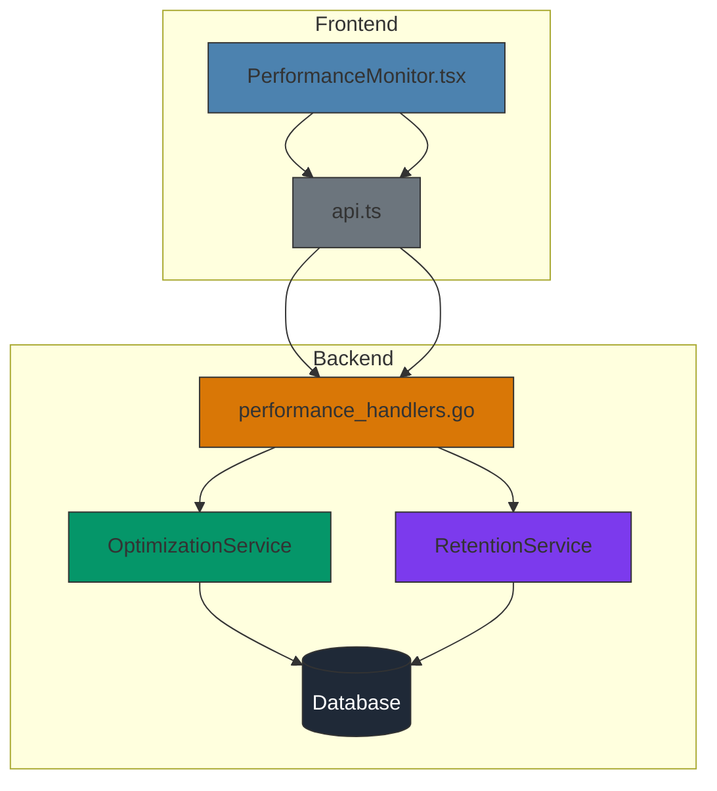
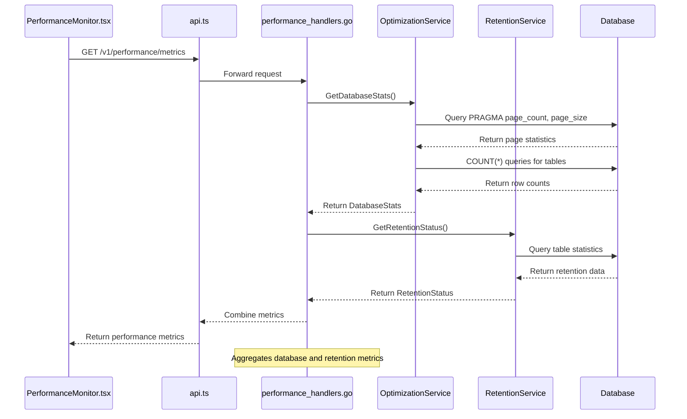
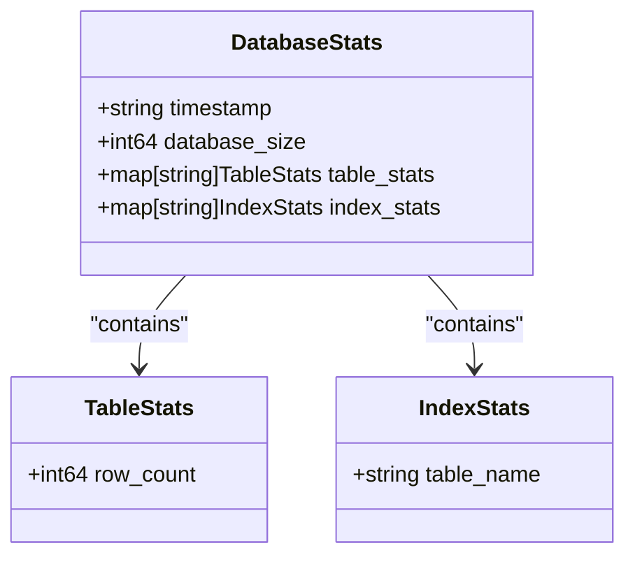
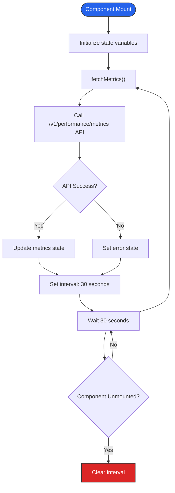
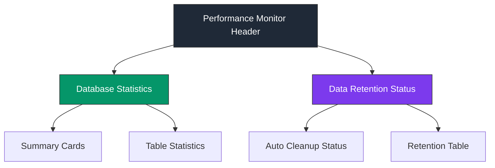
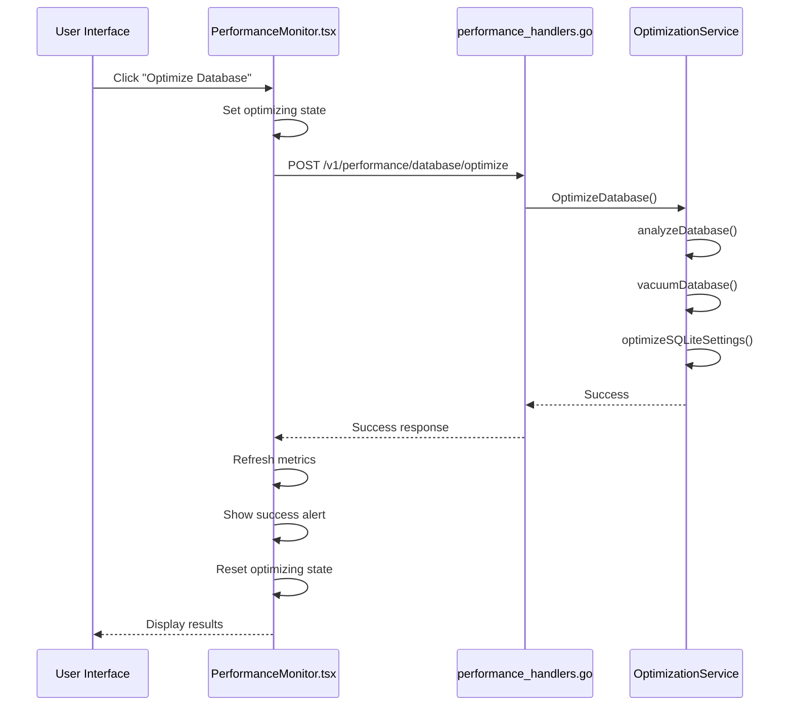
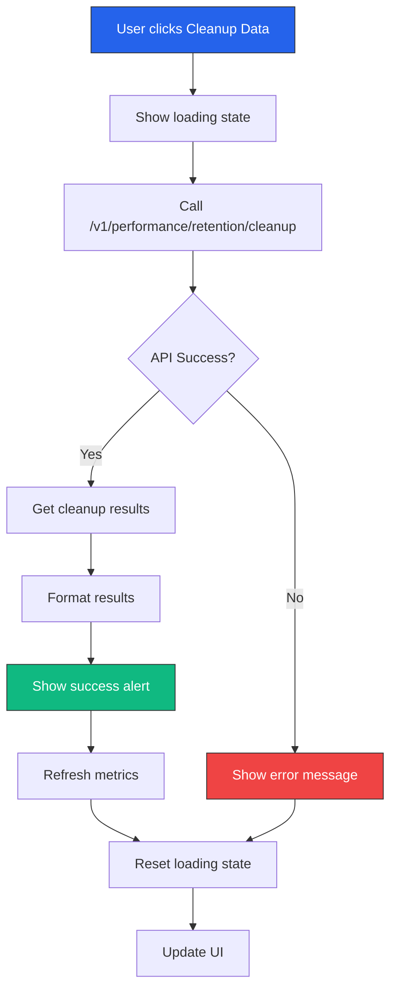
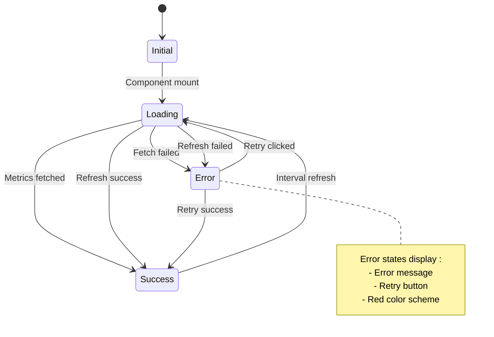

# Performance Monitor


## Table of Contents
1. [Introduction](#introduction)
2. [Architecture Overview](#architecture-overview)
3. [Data Fetching Mechanism](#data-fetching-mechanism)
4. [Performance Metrics Structure](#performance-metrics-structure)
5. [Real-time Updates](#real-time-updates)
6. [Visualization Approach](#visualization-approach)
7. [Performance Optimization Features](#performance-optimization-features)
8. [Data Retention Management](#data-retention-management)
9. [Error Handling and Diagnostics](#error-handling-and-diagnostics)
10. [Common Issues and Troubleshooting](#common-issues-and-troubleshooting)
11. [Optimization Recommendations](#optimization-recommendations)

## Introduction
The Performance Monitor module provides comprehensive system health monitoring for the Exim-Pilot application. It tracks critical performance metrics including database statistics, data retention status, and system resource utilization. The component enables administrators to identify performance bottlenecks, optimize database performance, and manage data retention policies through an intuitive interface. This documentation details the implementation, functionality, and usage patterns of the Performance Monitor, providing guidance for maintaining optimal system performance.

## Architecture Overview
The Performance Monitor follows a client-server architecture with a React frontend component communicating with Go backend handlers through RESTful API endpoints. The system collects performance metrics from various database services and presents them in a user-friendly interface with real-time updates.





**Diagram sources**
- [PerformanceMonitor.tsx](file://web/src/components/Performance/PerformanceMonitor.tsx)
- [performance_handlers.go](file://internal/api/performance_handlers.go)
- [optimization.go](file://internal/database/optimization.go)
- [retention.go](file://internal/database/retention.go)

**Section sources**
- [PerformanceMonitor.tsx](file://web/src/components/Performance/PerformanceMonitor.tsx#L1-L356)
- [performance_handlers.go](file://internal/api/performance_handlers.go#L1-L273)

## Data Fetching Mechanism
The Performance Monitor retrieves system metrics through a dedicated API endpoint that aggregates data from multiple backend services. The frontend component makes HTTP requests to the backend, which in turn queries database services to collect performance statistics.





**Diagram sources**
- [PerformanceMonitor.tsx](file://web/src/components/Performance/PerformanceMonitor.tsx#L43-L57)
- [performance_handlers.go](file://internal/api/performance_handlers.go#L74-L101)
- [optimization.go](file://internal/database/optimization.go#L208-L278)
- [retention.go](file://internal/database/retention.go#L280-L359)

**Section sources**
- [PerformanceMonitor.tsx](file://web/src/components/Performance/PerformanceMonitor.tsx#L43-L57)
- [performance_handlers.go](file://internal/api/performance_handlers.go#L74-L101)

## Performance Metrics Structure
The Performance Monitor collects and displays metrics organized into three main categories: database statistics, retention status, and system information. The data structure is consistent between frontend and backend implementations.

### Database Statistics
The database statistics include key metrics that indicate the health and size of the database:

**DatabaseStats Structure**

```typescript
interface DatabaseStats {
  timestamp: string;
  database_size: number; // in bytes
  table_stats: Record<string, { row_count: number }>;
  index_stats: Record<string, { table_name: string }>;
}
```


**Key Metrics:**
- **Database Size**: Total size of the database file in bytes
- **Table Count**: Number of tables in the database
- **Index Count**: Number of indexes created for optimization
- **Total Rows**: Sum of all rows across all tracked tables
- **Table Statistics**: Row count for each individual table





**Diagram sources**
- [optimization.go](file://internal/database/optimization.go#L253-L258)
- [PerformanceMonitor.tsx](file://web/src/components/Performance/PerformanceMonitor.tsx#L4-L9)

**Section sources**
- [optimization.go](file://internal/database/optimization.go#L208-L278)

## Real-time Updates
The Performance Monitor implements automatic refresh functionality to provide real-time visibility into system performance. The component fetches updated metrics at regular intervals without requiring manual intervention.

### Update Mechanism
The real-time update system uses React's useEffect hook with setInterval to refresh performance data every 30 seconds:





**Section sources**
- [PerformanceMonitor.tsx](file://web/src/components/Performance/PerformanceMonitor.tsx#L108-L116)

### Implementation Details
The real-time update functionality is implemented as follows:


```typescript
useEffect(() => {
  fetchMetrics();
  
  // Refresh metrics every 30 seconds
  const interval = setInterval(fetchMetrics, 30000);
  return () => clearInterval(interval);
}, []);
```


This implementation ensures that:
- Metrics are fetched immediately when the component mounts
- Subsequent fetches occur every 30 seconds
- The interval is properly cleaned up when the component unmounts
- The component remains responsive during data fetching

## Visualization Approach
The Performance Monitor presents performance metrics through a combination of summary cards, detailed tables, and status indicators. The visualization approach prioritizes clarity and immediate understanding of system health.

### Dashboard Layout
The interface is organized into three main sections:





**Section sources**
- [PerformanceMonitor.tsx](file://web/src/components/Performance/PerformanceMonitor.tsx#L184-L356)

### Data Visualization Components
The component uses several visualization techniques:

**Summary Cards**
- Color-coded cards for different metric types
- Large, prominent values for key statistics
- Descriptive labels for context
- Responsive grid layout

**Data Tables**
- Sortable columns for detailed analysis
- Formatted numbers with thousands separators
- Conditional formatting for critical values
- Responsive design with horizontal scrolling

**Status Indicators**
- Color-coded badges for auto cleanup status
- Red highlighting for expired rows
- Timestamp formatting for date values

## Performance Optimization Features
The Performance Monitor includes built-in tools for database optimization and performance tuning. These features allow administrators to improve system performance directly from the monitoring interface.

### Database Optimization
The "Optimize Database" feature triggers backend optimization procedures that improve database performance:





**Diagram sources**
- [PerformanceMonitor.tsx](file://web/src/components/Performance/PerformanceMonitor.tsx#L60-L77)
- [performance_handlers.go](file://internal/api/performance_handlers.go#L34-L44)
- [optimization.go](file://internal/database/optimization.go#L27-L88)

**Section sources**
- [PerformanceMonitor.tsx](file://web/src/components/Performance/PerformanceMonitor.tsx#L60-L77)
- [optimization.go](file://internal/database/optimization.go#L27-L88)

### Optimization Operations
The database optimization performs three key operations:

1. **ANALYZE**: Updates table statistics for better query planning
2. **VACUUM**: Reclaims space and defragments the database using incremental vacuum
3. **PRAGMA Settings**: Optimizes SQLite configuration for performance


```go
// optimizeSQLiteSettings configures SQLite for optimal performance
func (s *OptimizationService) optimizeSQLiteSettings(ctx context.Context) error {
    settings := map[string]string{
        "journal_mode": "WAL",
        "foreign_keys": "ON",
        "cache_size": "-2000",
        "page_size": "4096",
        "temp_store": "MEMORY",
        "synchronous": "NORMAL",
        "busy_timeout": "5000",
        "mmap_size": "67108864",
    }
    // Apply settings...
}
```


## Data Retention Management
The Performance Monitor provides comprehensive data retention management, allowing administrators to view retention policies and clean up expired data.

### Retention Status
The component displays retention status for various data types:

**RetentionConfig Structure**

```go
type RetentionConfig struct {
    LogEntriesRetentionDays       int  `json:"log_entries_retention_days"`
    AuditLogRetentionDays         int  `json:"audit_log_retention_days"`
    QueueSnapshotsRetentionDays   int  `json:"queue_snapshots_retention_days"`
    DeliveryAttemptsRetentionDays int  `json:"delivery_attempts_retention_days"`
    SessionsRetentionDays         int  `json:"sessions_retention_days"`
    EnableAutoCleanup             bool `json:"enable_auto_cleanup"`
    CleanupBatchSize              int  `json:"cleanup_batch_size"`
    CleanupIntervalHours          int  `json:"cleanup_interval_hours"`
}
```


**Section sources**
- [retention.go](file://internal/database/retention.go#L10-L40)

### Data Cleanup Process
The "Cleanup Data" feature removes expired data based on retention policies:





**Section sources**
- [PerformanceMonitor.tsx](file://web/src/components/Performance/PerformanceMonitor.tsx#L79-L98)
- [retention.go](file://internal/database/retention.go#L42-L148)

### Cleanup Implementation
The cleanup process follows these steps:
1. Identify tables with expired data based on retention policies
2. Count expired rows before deletion
3. Delete data in batches to avoid long transactions
4. Run database optimization after cleanup
5. Return detailed results including rows deleted and duration

## Error Handling and Diagnostics
The Performance Monitor includes robust error handling to ensure reliability and provide meaningful feedback when issues occur.

### Error States
The component handles three main error scenarios:





**Section sources**
- [PerformanceMonitor.tsx](file://web/src/components/Performance/PerformanceMonitor.tsx#L119-L157)

### Error Handling Implementation
The error handling follows a comprehensive approach:


```typescript
const fetchMetrics = async () => {
  try {
    setLoading(true);
    setError(null);
    
    const response = await apiService.get('/v1/performance/metrics');
    if (response.success) {
      setMetrics(response.data as PerformanceMetrics);
    } else {
      setError(response.error || 'Failed to fetch performance metrics');
    }
  } catch (err) {
    setError(err instanceof Error ? err.message : 'Failed to fetch performance metrics');
  } finally {
    setLoading(false);
  }
};
```


Key aspects of the error handling:
- Clear error messages for users
- Retry functionality to recover from transient issues
- Loading state management to prevent duplicate requests
- Comprehensive error capture including network and API errors

## Common Issues and Troubleshooting
This section addresses common issues encountered with the Performance Monitor and provides diagnostic workflows.

### Metric Spikes
**Issue**: Sudden spikes in database size or row counts.

**Diagnostic Workflow**:
1. Check the "Last updated" timestamp to verify data freshness
2. Examine individual table statistics to identify which table is growing
3. Review application logs for unusual activity
4. Check system resource utilization (CPU, memory, disk I/O)
5. Verify backup and retention schedules are running correctly

**Potential Causes**:
- Log rotation failure
- Message processing backlog
- Database backup in progress
- Unusual email traffic patterns

### Missing Data Points
**Issue**: Empty or missing metrics in the Performance Monitor.

**Diagnostic Workflow**:
1. Check network connectivity between frontend and backend
2. Verify API endpoint availability (/v1/performance/metrics)
3. Check backend service logs for errors
4. Verify database connectivity and permissions
5. Test database queries manually if possible

**Troubleshooting Commands**:

```bash
# Test API endpoint
curl -X GET http://localhost:8080/api/v1/performance/metrics

# Check service status
systemctl status exim-pilot

# View recent logs
journalctl -u exim-pilot -n 50
```


**Section sources**
- [PerformanceMonitor.tsx](file://web/src/components/Performance/PerformanceMonitor.tsx#L119-L157)
- [performance_handlers.go](file://internal/api/performance_handlers.go#L74-L101)

## Optimization Recommendations
Based on the Performance Monitor implementation and typical usage patterns, the following optimization recommendations are provided:

### Monitoring Best Practices
1. **Regular Check-ins**: Monitor performance metrics at least daily during peak usage periods
2. **Baseline Establishment**: Document normal performance levels to identify anomalies
3. **Alert Configuration**: Set up alerts for critical thresholds (e.g., database size > 80% of capacity)
4. **Trend Analysis**: Track metrics over time to identify gradual performance degradation

### Database Optimization
1. **Scheduled Optimization**: Run database optimization during off-peak hours
2. **Retention Policy Review**: Regularly review and adjust retention policies based on storage capacity
3. **Index Management**: Monitor index usage and remove unused indexes
4. **Query Optimization**: Use the provided query optimization hints for critical operations

### System Performance
1. **Resource Monitoring**: Correlate frontend performance metrics with backend system metrics
2. **Capacity Planning**: Use historical data to predict future resource requirements
3. **Backup Strategy**: Ensure backups are performed regularly and verified for integrity
4. **Security Updates**: Keep the system updated with the latest security patches

The Performance Monitor provides essential insights into system health and should be used proactively to maintain optimal performance rather than reactively when issues occur.

**Section sources**
- [PerformanceMonitor.tsx](file://web/src/components/Performance/PerformanceMonitor.tsx)
- [performance_handlers.go](file://internal/api/performance_handlers.go)
- [optimization.go](file://internal/database/optimization.go)
- [retention.go](file://internal/database/retention.go)

**Referenced Files in This Document**   
- [PerformanceMonitor.tsx](file://web/src/components/Performance/PerformanceMonitor.tsx)
- [performance_handlers.go](file://internal/api/performance_handlers.go)
- [optimization.go](file://internal/database/optimization.go)
- [retention.go](file://internal/database/retention.go)
- [api.ts](file://web/src/services/api.ts)
- [server.go](file://internal/api/server.go)