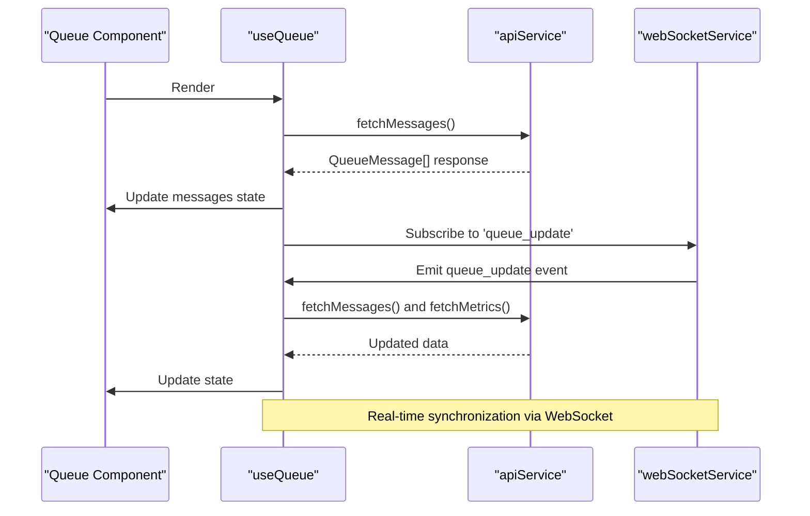
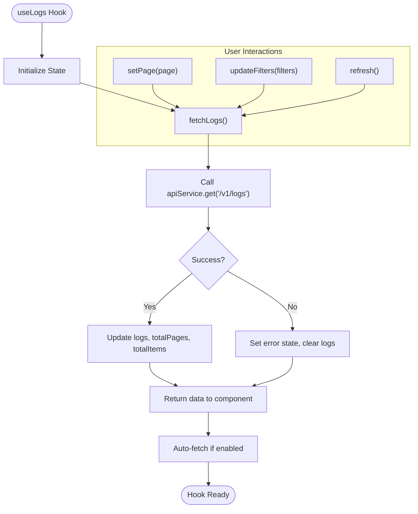
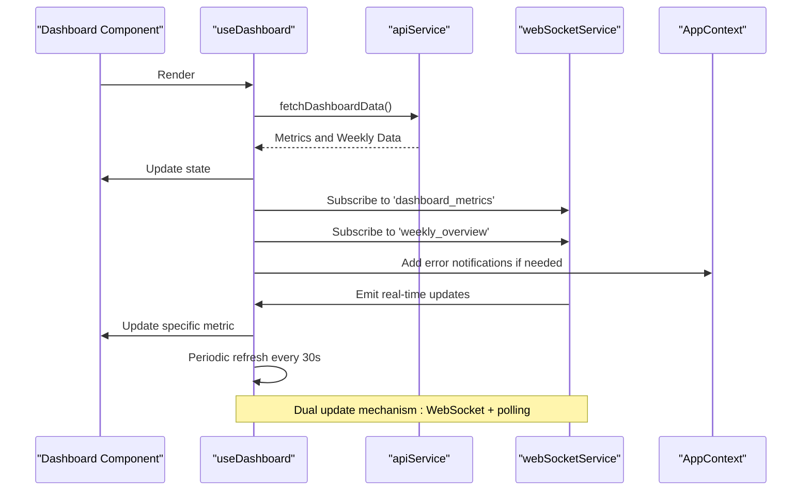
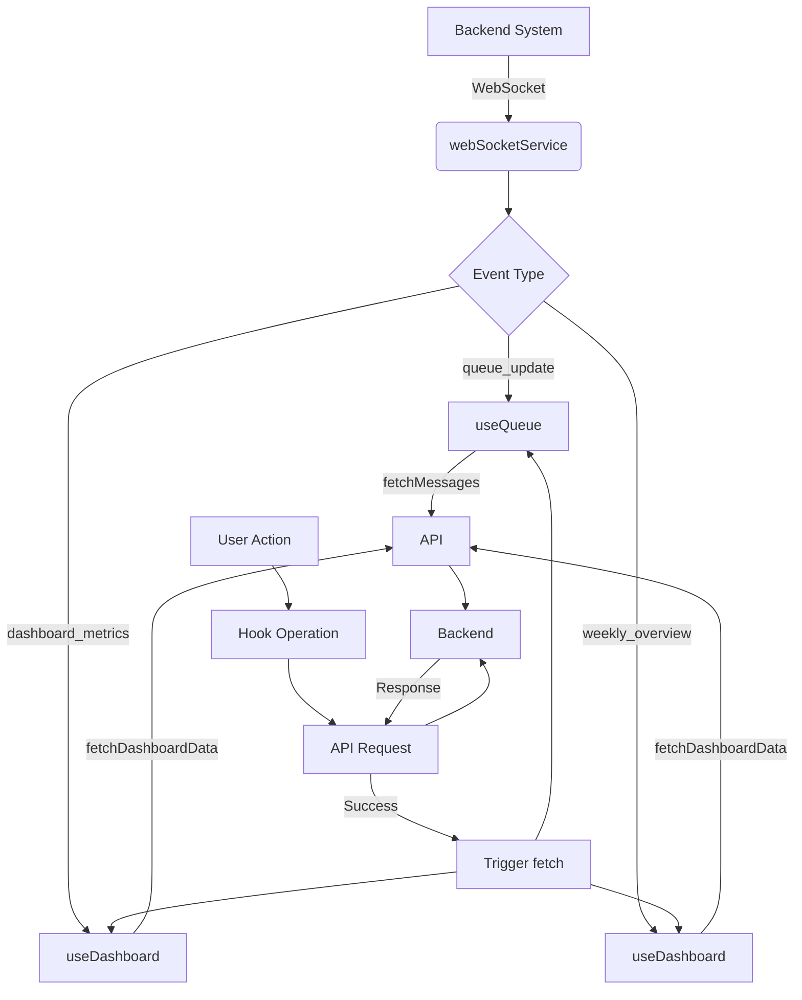
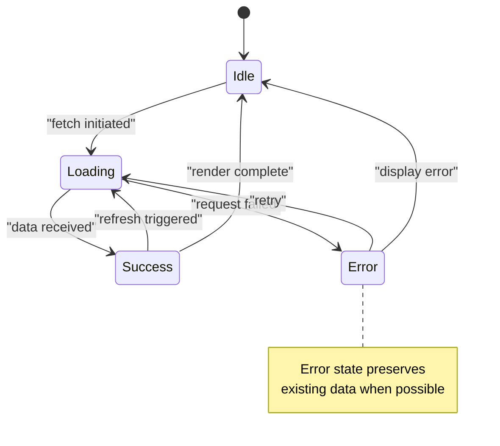

# State Management


## Table of Contents
1. [Introduction](#introduction)
2. [Global State with AppContext](#global-state-with-appcontext)
3. [Domain-Specific Hooks](#domain-specific-hooks)
4. [Data Fetching and Caching Strategies](#data-fetching-and-caching-strategies)
5. [State Synchronization with Backend](#state-synchronization-with-backend)
6. [Performance Optimization Techniques](#performance-optimization-techniques)
7. [Error and Loading State Handling](#error-and-loading-state-handling)
8. [Component Consumption Patterns](#component-consumption-patterns)
9. [Conclusion](#conclusion)

## Introduction
The exim-pilot frontend implements a robust state management architecture that combines React Context for global application state with custom hooks for domain-specific logic. This hybrid approach enables efficient data flow, separation of concerns, and optimal performance across the application. The system manages user authentication state, UI preferences, real-time updates, and complex data interactions with the backend API. This document details the implementation, patterns, and best practices used in the state management system.

## Global State with AppContext

The `AppContext` provides a centralized store for application-wide state using React's Context API combined with the useReducer hook. It manages critical global information including user authentication status, connection state, loading indicators, error messages, and notifications.


```mermaid
classDiagram
class AppState {
+isLoading : boolean
+error : string | null
+notifications : Notification[]
+user : User | null
+connectionStatus : "connected" | "disconnected" | "connecting"
}
class AppAction {
+type : string
+payload : any
}
class AppContextType {
+state : AppState
+dispatch : Dispatch<AppAction>
+actions : {
setLoading : (boolean) => void
setError : (string | null) => void
addNotification : (notification) => void
removeNotification : (id : string) => void
setUser : (User | null) => void
setConnectionStatus : (status) => void
}
}
class AppProvider {
+children : ReactNode
+state : AppState
+dispatch : Dispatch<AppAction>
+actions : object
}
AppProvider --> AppState : "manages"
AppProvider --> AppContextType : "provides"
AppProvider --> AppAction : "handles"
```


**Diagram sources**
- [AppContext.tsx](file://web/src/context/AppContext.tsx#L7-L146)

**Section sources**
- [AppContext.tsx](file://web/src/context/AppContext.tsx#L7-L146)

The context exposes both raw dispatch functions and convenience action methods, making it easy for components to update state. The `useApp` hook provides type-safe access to the context, throwing an error if used outside the provider. This pattern ensures that critical application state like user authentication and connection status is consistently available throughout the component tree.

## Domain-Specific Hooks

### useQueue Hook Analysis

The `useQueue` hook encapsulates all logic related to managing the email queue, including data fetching, operations, and real-time updates. It maintains local state for messages, metrics, loading status, and errors.





**Diagram sources**
- [useQueue.ts](file://web/src/hooks/useQueue.ts#L11-L180)

**Section sources**
- [useQueue.ts](file://web/src/hooks/useQueue.ts#L11-L180)

The hook provides methods for all queue operations (deliver, freeze, thaw, delete, bulk operations) that automatically refresh the data after successful execution. It supports configurable auto-refresh with a default 30-second interval and WebSocket-based real-time updates, ensuring the UI stays synchronized with the backend state.

### useLogs Hook Analysis

The `useLogs` hook manages log data with comprehensive support for pagination, filtering, and search functionality. It maintains state for current page, total pages, filters, and loading status.





**Diagram sources**
- [useLogs.ts](file://web/src/hooks/useLogs.ts#L25-L110)

**Section sources**
- [useLogs.ts](file://web/src/hooks/useLogs.ts#L25-L110)

The hook implements intelligent filtering by removing empty filter values before making API requests. It exposes methods for pagination control and filter updates, with automatic refetching when these values change. The `refresh` method allows components to manually trigger data reloading, useful for user-initiated refresh actions.

### useDashboard Hook Analysis

The `useDashboard` hook combines data from multiple endpoints to provide a comprehensive overview of system metrics. It fetches both dashboard metrics and weekly overview data in a single operation.





**Diagram sources**
- [useDashboard.ts](file://web/src/hooks/useDashboard.ts#L6-L79)

**Section sources**
- [useDashboard.ts](file://web/src/hooks/useDashboard.ts#L6-L79)

The hook implements a dual update strategy: real-time WebSocket events for immediate updates and periodic polling as a fallback. This ensures data freshness even if WebSocket connections are temporarily disrupted. Error handling includes both local error state and global notifications via the AppContext, providing user feedback for critical issues.

## Data Fetching and Caching Strategies

The application employs multiple data fetching patterns to optimize performance and user experience. The primary strategy involves direct API calls through the `apiService` for initial data loading and specific operations.

For more advanced scenarios, the `useOptimizedDataFetching` hook (part of `useLazyLoading.ts`) implements a caching mechanism with configurable cache and stale times. This hook stores responses in a Map-based cache, checking freshness before making new requests. It supports forced refetching and cache invalidation, providing fine-grained control over data freshness.


```mermaid
flowchart TD
A[fetchData()] --> B{In Cache?}
B --> |Yes| C{Fresh?}
B --> |No| D[Make API Request]
C --> |Yes| E[Return Cached Data]
C --> |No| D
D --> F[Process Response]
F --> G[Update Cache]
G --> H[Return Data]
E --> H
```


**Diagram sources**
- [useLazyLoading.ts](file://web/src/hooks/useLazyLoading.ts#L250-L350)

The caching strategy uses time-based invalidation with default values of 5 minutes for cache time and 1 minute for stale time. When data becomes stale, it automatically refetches on window focus, ensuring users see up-to-date information when returning to the application.

## State Synchronization with Backend

The state management system maintains synchronization with the backend through multiple mechanisms:

1. **WebSocket Real-time Updates**: The application establishes WebSocket connections to receive immediate notifications of state changes. The `useQueue`, `useLogs`, and `useDashboard` hooks all subscribe to relevant events, triggering data refreshes when updates occur.

2. **Periodic Polling**: As a fallback mechanism, hooks implement setInterval-based polling (typically every 30 seconds) to ensure data remains current even if WebSocket connections fail.

3. **Operation-Triggered Refresh**: After any mutating operation (deliver, freeze, delete, etc.), the hooks automatically call fetch methods to update the local state with the latest backend state.

4. **Event-Driven Architecture**: The `webSocketService` acts as an event bus, allowing components to subscribe to specific event types. This decouples the WebSocket connection logic from the state management logic.





**Diagram sources**
- [useQueue.ts](file://web/src/hooks/useQueue.ts#L110-L150)
- [useDashboard.ts](file://web/src/hooks/useDashboard.ts#L50-L70)
- [useLogs.ts](file://web/src/hooks/useLogs.ts#L1-L110)

## Performance Optimization Techniques

### Memoization with useCallback

All hook functions are wrapped in `useCallback` to prevent unnecessary re-creations on each render. This optimization is critical for maintaining referential equality, especially when these functions are passed as dependencies to other hooks or used in component props.


```typescript
const fetchMessages = useCallback(async (
  filters?: QueueSearchFilters,
  page: number = 1,
  perPage: number = 25
): Promise<APIResponse<QueueMessage[]>> => {
  // implementation
}, []);
```


The dependency arrays are carefully managed, including only the necessary dependencies to ensure functions update when required while avoiding excessive re-creations.

### Lazy Loading and Infinite Scroll

The `useLazyLoading` hook implements infinite scroll functionality for large datasets. It loads data in pages, only fetching additional items when the user approaches the end of the current dataset.


```mermaid
flowchart TD
A[Initial Load] --> B[Fetch First Page]
B --> C[Display Items]
C --> D{User Scrolls Down}
D --> |Near End| E[loadMore()]
E --> F[Fetch Next Page]
F --> G[Append Items]
G --> C
D --> |Not Near End| H[Wait]
```


**Diagram sources**
- [useLazyLoading.ts](file://web/src/hooks/useLazyLoading.ts#L1-L100)

The hook exposes a `loadMore` function and `hasMore` flag, allowing components to implement infinite scroll with minimal boilerplate. It also provides `reset`, `setItems`, and `appendItems` methods for programmatic control over the loaded data.

### Debounced Search

The `useDebouncedLazySearch` hook combines debouncing with lazy loading for search functionality. It delays API requests until the user stops typing, reducing unnecessary network calls.


```typescript
// Debounce search queries
useEffect(() => {
  if (debounceTimeoutRef.current) {
    clearTimeout(debounceTimeoutRef.current);
  }

  debounceTimeoutRef.current = setTimeout(() => {
    setDebouncedQuery(query);
    setCurrentPage(1);
    setSearchResults([]);
  }, debounceMs);
}, [query, debounceMs]);
```


This prevents excessive API calls during fast typing and improves responsiveness by only making requests when the user has paused input.

## Error and Loading State Handling

The state management system implements comprehensive error and loading state handling across all hooks:

- **Loading States**: Each hook maintains a `loading` boolean that components can use to display spinners or skeleton loaders during data fetching operations.

- **Error States**: A `error` string field captures error messages, allowing components to display user-friendly error messages when API calls fail.

- **Global Notifications**: The `AppContext` provides a notification system that can display success, error, warning, and info messages across the application.

- **Graceful Degradation**: When errors occur, hooks typically preserve existing data rather than clearing it, providing a better user experience during temporary connectivity issues.





**Diagram sources**
- [AppContext.tsx](file://web/src/context/AppContext.tsx#L50-L75)
- [useQueue.ts](file://web/src/hooks/useQueue.ts#L30-L50)
- [useLogs.ts](file://web/src/hooks/useLogs.ts#L20-L40)

## Component Consumption Patterns

Components consume state through a consistent pattern across the application:

1. **Context Consumption**: Components use the `useApp` hook to access global state like user information and notifications.

2. **Domain Hook Usage**: Components import and call the appropriate domain hook (`useQueue`, `useDashboard`, etc.) to access specific data and actions.

3. **State Destructuring**: Components destructure the hook return values to access data, loading states, errors, and action functions.

4. **Event Handling**: Components pass hook actions to event handlers (onClick, onSubmit, etc.) to trigger state changes.

Example component usage:

```typescript
function QueueComponent() {
  const { messages, loading, error, fetchMessages, deliverMessage } = useQueue();
  const { actions } = useApp();
  
  if (loading) return <LoadingSpinner />;
  if (error) return <ErrorMessage message={error} />;
  
  return (
    <div>
      <QueueList 
        messages={messages} 
        onDeliver={deliverMessage}
        onRefresh={fetchMessages}
      />
    </div>
  );
}
```


This pattern ensures consistent state access across components while maintaining separation of concerns between presentation and logic.

## Conclusion
The exim-pilot frontend state management architecture effectively combines React Context for global state with custom hooks for domain-specific logic. This hybrid approach provides a scalable solution that balances reusability, performance, and maintainability. The system implements robust patterns for data fetching, caching, real-time synchronization, and error handling, ensuring a responsive and reliable user experience. By leveraging React's built-in hooks and implementing optimization techniques like memoization and lazy loading, the architecture delivers high performance even with complex data interactions. The clear separation between global and domain-specific state makes the codebase easier to understand and maintain, providing a solid foundation for future development.

**Referenced Files in This Document**   
- [AppContext.tsx](file://web/src/context/AppContext.tsx#L1-L146)
- [useQueue.ts](file://web/src/hooks/useQueue.ts#L1-L180)
- [useLogs.ts](file://web/src/hooks/useLogs.ts#L1-L110)
- [useDashboard.ts](file://web/src/hooks/useDashboard.ts#L1-L79)
- [useLazyLoading.ts](file://web/src/hooks/useLazyLoading.ts#L1-L368)
- [api.ts](file://web/src/services/api.ts)
- [websocket.ts](file://web/src/services/websocket.ts)