# API Client Services


## Table of Contents
1. [Introduction](#introduction)
2. [Core API Client Architecture](#core-api-client-architecture)
3. [Base HTTP Client Implementation](#base-http-client-implementation)
4. [Report-Specific Service Layer](#report-specific-service-layer)
5. [Real-Time WebSocket Management](#real-time-websocket-management)
6. [Error Handling Strategy](#error-handling-strategy)
7. [Type Safety and Response Mapping](#type-safety-and-response-mapping)
8. [Security Implementation](#security-implementation)
9. [Request Lifecycle and Data Flow](#request-lifecycle-and-data-flow)
10. [Usage Examples](#usage-examples)

## Introduction
The API client services in the Exim-Pilot application provide a comprehensive interface for frontend components to interact with the backend API. This documentation details the architecture and implementation of three core services: the base HTTP client (api.ts), the report-specific service (reports.ts), and the WebSocket service (websocket.ts). These services work together to provide type-safe, secure, and efficient communication between the frontend and backend systems, supporting critical functionality such as queue management, log searching, and report generation.

## Core API Client Architecture


**Diagram sources**
- [api.ts](file://web/src/services/api.ts)
- [reports.ts](file://web/src/services/reports.ts)
- [websocket.ts](file://web/src/services/websocket.ts)

**Section sources**
- [api.ts](file://web/src/services/api.ts)
- [reports.ts](file://web/src/services/reports.ts)
- [websocket.ts](file://web/src/services/websocket.ts)

## Base HTTP Client Implementation

The `APIService` class in api.ts serves as the foundation for all HTTP communication in the application. It provides a wrapper around the native fetch API with consistent configuration, error handling, and response processing.


**Diagram sources**
- [api.ts](file://web/src/services/api.ts#L0-L118)
- [api.ts](file://web/src/types/api.ts#L0-L18)

**Section sources**
- [api.ts](file://web/src/services/api.ts#L0-L118)

### Request Configuration
The base HTTP client configures all requests with standardized headers and credentials:

- **Content-Type**: Automatically set to `application/json`
- **Credentials**: Set to `include` to support cookie-based authentication
- **Error Handling**: Comprehensive error handling for network issues, HTTP errors, and JSON parsing failures
- **Response Processing**: Intelligent response handling that checks content type before parsing JSON

The client handles various response scenarios, including empty responses and non-JSON content, ensuring robustness across different API endpoints.

### Authentication Methods
The API client includes built-in authentication methods that handle the complete authentication flow:

- **login(username, password)**: Sends credentials to `/v1/auth/login` with credentials included
- **logout()**: Terminates the current session via `/v1/auth/logout`
- **getCurrentUser()**: Retrieves current user information from `/v1/auth/me`

The authentication system uses session cookies managed by the backend, with the frontend automatically including these cookies in all requests through the `credentials: 'include'` setting.

## Report-Specific Service Layer

The `ReportsService` extends the base API functionality to provide specialized methods for report generation and retrieval. This service acts as a domain-specific interface for all reporting functionality in the application.


**Diagram sources**
- [reports.ts](file://web/src/services/reports.ts#L0-L88)
- [reports.ts](file://web/src/types/reports.ts#L0-L115)

**Section sources**
- [reports.ts](file://web/src/services/reports.ts#L0-L88)

### Report Endpoints
The ReportsService provides methods for accessing various types of reports:

- **Deliverability Report**: Provides delivery statistics including delivery, deferral, bounce, and rejection rates
- **Volume Report**: Shows message volume over time, with configurable grouping (day, hour, etc.)
- **Failure Report**: Analyzes message failures by category and SMTP error codes
- **Top Senders/Recipients**: Identifies the most active senders and recipients
- **Domain Analysis**: Provides insights into sender and recipient domains

All report methods support optional time range parameters (startTime, endTime) and additional parameters like limit and grouping options, allowing for flexible data retrieval.

## Real-Time WebSocket Management

The `WebSocketService` manages real-time connections for live updates, enabling features like live log tailing and queue monitoring without constant polling.


**Diagram sources**
- [websocket.ts](file://web/src/services/websocket.ts#L0-L164)

**Section sources**
- [websocket.ts](file://web/src/services/websocket.ts#L0-L164)

### Connection Management
The WebSocket service implements robust connection handling with:

- **Automatic Reconnection**: Attempts to reconnect up to 5 times with exponential backoff
- **Connection State Tracking**: Provides methods to check connection status
- **Event Handling**: Supports both event-based and subscription-based message handling

The service automatically constructs the WebSocket URL based on the current page's protocol (ws:// or wss://), ensuring compatibility with both HTTP and HTTPS deployments.

### Subscription Model
The service supports a subscription model for specific data streams:

- **subscribe(endpoint, handler)**: Subscribes to updates from a specific endpoint
- **unsubscribe(endpoint, handler)**: Removes a subscription
- **Multiple Handlers**: Supports multiple handlers per endpoint

This model enables components to receive real-time updates for specific data sources, such as live log tailing or queue changes, without receiving irrelevant messages.

## Error Handling Strategy

The error handling system provides a consistent approach to managing API errors across the application, transforming low-level errors into structured application errors.


**Diagram sources**
- [api.ts](file://web/src/services/api.ts#L41-L88)
- [errorHandler.ts](file://web/src/utils/errorHandler.ts#L0-L83)

**Section sources**
- [errorHandler.ts](file://web/src/utils/errorHandler.ts#L0-L83)

### Error Types
The system defines several error types to handle different failure scenarios:

- **AppError**: Base error class with code, message, and optional status code
- **NetworkError**: Errors related to network connectivity issues
- **AuthenticationError**: Errors related to authentication and authorization
- **APIError**: Errors returned by the API with structured error information

### Error Utilities
The errorHandler.ts module provides several utility functions:

- **handleAPIError(error)**: Transforms various error types into AppError instances
- **getErrorMessage(error)**: Extracts a user-friendly error message
- **logError(error, context)**: Logs error details for debugging
- **isNetworkError(error)**: Checks if an error is network-related
- **isAuthError(error)**: Checks if an error is authentication-related

These utilities ensure consistent error handling across the application and provide helpful information for both users and developers.

## Type Safety and Response Mapping

The application leverages TypeScript to ensure type safety throughout the API client layer, with well-defined interfaces for API responses and report data.

```mermaid
classDiagram
class APIResponse~T~ {
+success : boolean
+data? : T
+error? : string
+meta? : MetaData
}
class DeliverabilityReport {
+period : Period
+total_messages : number
+delivered_count : number
+deferred_count : number
+bounced_count : number
+rejected_count : number
+delivery_rate : number
+deferral_rate : number
+bounce_rate : number
+rejection_rate : number
+event_counts : Map~string, number~
+log_type_counts : Map~string, number~
+top_failure_reasons : FailureReason[]
}
class VolumeReport {
+period : Period
+group_by : string
+total_volume : number
+average_volume : number
+peak_volume : number
+time_series : TimeSeriesPoint[]
}
class Period {
+start : string
+end : string
}
class TimeSeriesPoint {
+timestamp : string
+count : number
}
class FailureReason {
+reason : string
+count : number
}
APIResponse~DeliverabilityReport~ --> DeliverabilityReport
APIResponse~VolumeReport~ --> VolumeReport
DeliverabilityReport --> Period
DeliverabilityReport --> FailureReason
VolumeReport --> Period
VolumeReport --> TimeSeriesPoint
```





**Diagram sources**
- [api.ts](file://web/src/types/api.ts#L0-L18)
- [reports.ts](file://web/src/types/reports.ts#L0-L115)

**Section sources**
- [api.ts](file://web/src/types/api.ts#L0-L18)
- [reports.ts](file://web/src/types/reports.ts#L0-L115)

### API Response Structure
The `APIResponse<T>` interface defines a consistent structure for all API responses:

- **success**: Boolean indicating if the request was successful
- **data**: The response data of type T, when successful
- **error**: Error message when the request failed
- **meta**: Optional metadata for pagination and other information

This structure allows components to consistently handle API responses, regardless of the specific endpoint.

### Report Data Models
The report types define the structure of data returned by the reporting endpoints:

- **Period**: Represents a time period with start and end timestamps
- **TimeSeriesPoint**: Represents a data point in a time series
- **FailureReason**: Represents a specific failure reason with count
- **Report-specific interfaces**: Define the structure of each report type

These interfaces ensure type safety when working with report data and provide IntelliSense support in development.

## Security Implementation

The application implements several security measures to protect against common web vulnerabilities and ensure secure communication.

### Authentication and Session Management
The system uses cookie-based authentication with the following security features:

- **HttpOnly Cookies**: Session cookies are marked as HttpOnly to prevent access via JavaScript
- **Secure Flag**: Cookies are marked as secure when served over HTTPS
- **SameSite Strict**: Cookies use SameSite=Strict to prevent CSRF attacks
- **Session Expiration**: Sessions expire after a configurable timeout period

The backend sets these cookie attributes, while the frontend ensures cookies are included in all requests.

### Cross-Site Scripting (XSS) Protection
The application implements XSS protection at multiple levels:


**Diagram sources**
- [validation.go](file://internal/validation/service.go#L440-L520)

**Section sources**
- [validation.go](file://internal/validation/service.go#L440-L520)

The backend validation service checks for suspicious content patterns and sanitizes strings by removing potentially dangerous characters. The frontend also benefits from React's automatic HTML escaping, which prevents XSS in rendered content.

### Server Configuration Security
The server configuration includes several security-related settings:

- **CSRF Protection**: Enabled by default to prevent cross-site request forgery
- **Secure Cookies**: Enabled to ensure cookies are only sent over HTTPS
- **Session Timeout**: Configurable session timeout (default 60 minutes)
- **Login Lockout**: Account lockout after multiple failed login attempts

These settings are defined in the config.go file and can be customized based on deployment requirements.

## Request Lifecycle and Data Flow

The complete request lifecycle demonstrates how data flows through the API client system from user interaction to backend response.


**Diagram sources**
- [api.ts](file://web/src/services/api.ts)
- [reports.ts](file://web/src/services/reports.ts)
- [websocket.ts](file://web/src/services/websocket.ts)
- [errorHandler.ts](file://web/src/utils/errorHandler.ts)

**Section sources**
- [api.ts](file://web/src/services/api.ts)
- [reports.ts](file://web/src/services/reports.ts)
- [websocket.ts](file://web/src/services/websocket.ts)

### HTTP Request Flow
1. Component calls a method on APIService or ReportsService
2. The service constructs the request with appropriate headers and parameters
3. The request is sent to the backend via fetch
4. The response is processed, checking for errors and parsing JSON
5. The result is returned to the component as an APIResponse
6. The component updates state and UI based on the result

### WebSocket Flow
1. Component connects to WebSocketService
2. Component subscribes to specific endpoints or events
3. WebSocketService maintains the connection and handles reconnection
4. Backend pushes updates to subscribed clients
5. WebSocketService routes messages to appropriate handlers
6. Components update UI in response to real-time updates

## Usage Examples

### Queue Management CRUD Operations
The QueueList component demonstrates CRUD operations for queue management:


```typescript
// Fetch queue messages with pagination and sorting
const fetchMessagesPage = async (page: number, pageSize: number) => {
  const params = {
    page,
    per_page: pageSize,
    sort_field: sortConfig.field,
    sort_direction: sortConfig.direction,
    ...searchFilters,
  };

  const response = await apiService.get('/v1/queue', params);
  
  if (response.success && response.data) {
    return {
      data: response.data,
      total: response.meta?.total || 0,
      hasMore: (response.meta?.page || 1) < (response.meta?.total_pages || 1),
    };
  } else {
    throw new Error(response.error || 'Failed to fetch queue messages');
  }
};
```


**Section sources**
- [QueueList.tsx](file://web/src/components/Queue/QueueList.tsx#L0-L199)

### Log Search Queries
The LogSearch component implements log search functionality:


```typescript
// Handle search form submission
const handleSearch = (e: React.FormEvent) => {
  e.preventDefault();
  onSearch(filters);
};

// Clear all search filters
const handleClear = () => {
  const clearedFilters = {};
  setFilters(clearedFilters);
  onSearch(clearedFilters);
};
```


**Section sources**
- [LogSearch.tsx](file://web/src/components/Logs/LogSearch.tsx#L0-L199)

### Report Generation
The ReportsService provides methods for generating various reports:


```typescript
// Get deliverability report for a specific time period
const getDeliverabilityReport = async (
  startTime?: string,
  endTime?: string
): Promise<APIResponse<DeliverabilityReport>> => {
  const params: Record<string, string> = {};
  if (startTime) params.start_time = startTime;
  if (endTime) params.end_time = endTime;

  return apiService.get<DeliverabilityReport>('/v1/reports/deliverability', params);
};
```


**Section sources**
- [reports.ts](file://web/src/services/reports.ts#L0-L88)

### Real-Time Updates
The QueueList component uses WebSocket for real-time updates:


```typescript
// Handle real-time queue updates
useEffect(() => {
  const handleQueueUpdate = (data: any) => {
    if (data.type === 'queue_update') {
      // Refresh the current page when queue updates
      fetchMessages();
    }
  };

  webSocketService.on('queue_update', handleQueueUpdate);
  
  return () => {
    webSocketService.off('queue_update', handleQueueUpdate);
  };
}, [fetchMessages]);
```


**Section sources**
- [QueueList.tsx](file://web/src/components/Queue/QueueList.tsx#L0-L199)

**Referenced Files in This Document**   
- [api.ts](file://web/src/services/api.ts)
- [reports.ts](file://web/src/services/reports.ts)
- [websocket.ts](file://web/src/services/websocket.ts)
- [errorHandler.ts](file://web/src/utils/errorHandler.ts)
- [api.ts](file://web/src/types/api.ts)
- [reports.ts](file://web/src/types/reports.ts)
- [config.go](file://internal/config/config.go)
- [validation.go](file://internal/validation/service.go)