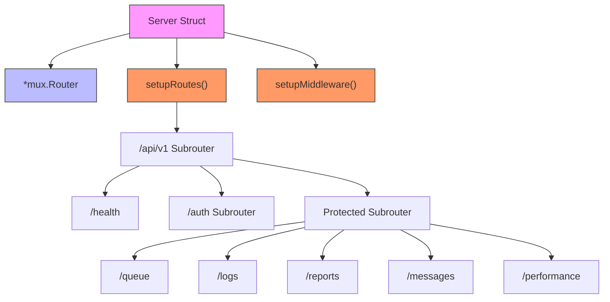
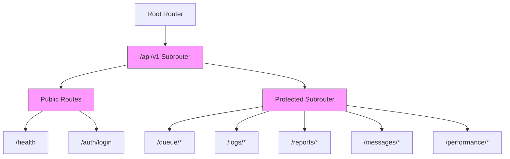
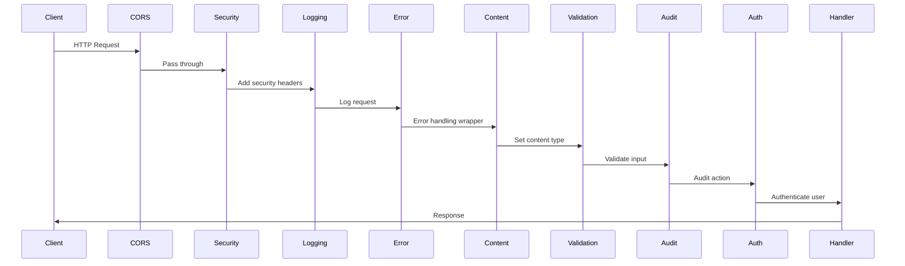
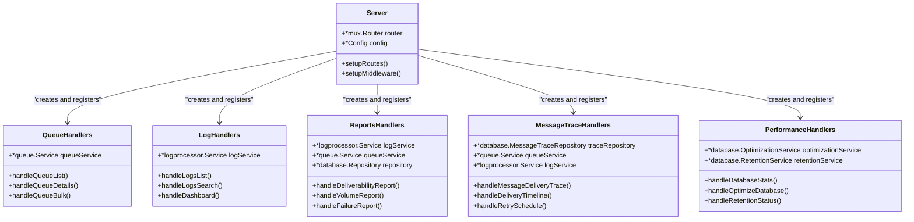
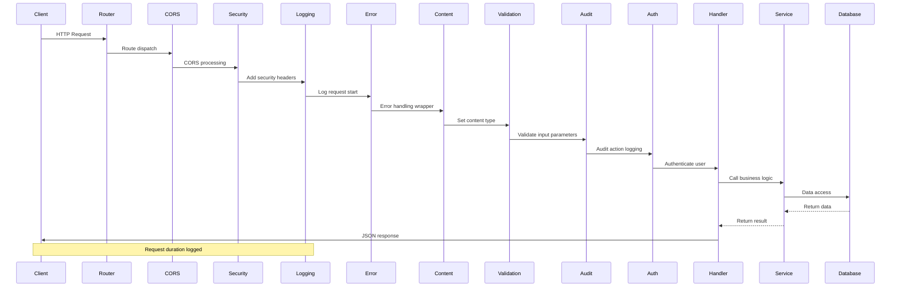

# API Routing Structure


## Table of Contents
1. [Introduction](#introduction)
2. [Core Routing Architecture](#core-routing-architecture)
3. [Route Definition and Pattern Matching](#route-definition-and-pattern-matching)
4. [Subrouter Organization](#subrouter-organization)
5. [Middleware Integration](#middleware-integration)
6. [Handler Registration and Implementation](#handler-registration-and-implementation)
7. [Request Flow Analysis](#request-flow-analysis)
8. [URL Encoding and Pattern Matching](#url-encoding-and-pattern-matching)
9. [Troubleshooting Common Routing Issues](#troubleshooting-common-routing-issues)
10. [Conclusion](#conclusion)

## Introduction
The exim-pilot application implements a comprehensive API routing architecture using the gorilla/mux router to manage HTTP endpoints for various system components. This documentation provides a detailed analysis of the routing structure, focusing on how gorilla/mux is utilized to define routes, organize API sections, integrate middleware, and handle requests across different functional domains including queue management, log monitoring, reporting, authentication, and performance optimization. The routing system follows RESTful principles with versioned endpoints and implements a layered middleware approach for cross-cutting concerns such as authentication, logging, and security.

## Core Routing Architecture

The API routing architecture in exim-pilot is centered around the gorilla/mux router, which provides powerful URL routing capabilities with support for variables, subrouters, and middleware. The core routing structure is implemented in the Server struct within server.go, which encapsulates the router instance and provides methods for route configuration.





**Diagram sources**
- [server.go](file://internal/api/server.go#L1-L275)

**Section sources**
- [server.go](file://internal/api/server.go#L1-L275)

## Route Definition and Pattern Matching

The exim-pilot application uses gorilla/mux to define routes with specific patterns, path variables, and method restrictions. Route definitions are organized in the `setupRoutes` method of the Server struct, which creates a hierarchical structure of subrouters for different API sections.

Route patterns in exim-pilot follow a consistent structure with versioned API endpoints (`/api/v1`) and use path variables for resource identification. The application defines both simple routes and complex routes with parameters, demonstrating various gorilla/mux features:


```go
// API v1 routes
api := s.router.PathPrefix("/api/v1").Subrouter()

// Simple routes with method restrictions
api.HandleFunc("/health", s.handleHealth).Methods("GET")
api.HandleFunc("/auth/login", authHandlers.handleLogin).Methods("POST")

// Routes with path variables
protected.HandleFunc("/queue/{id}", queueHandlers.handleQueueDetails).Methods("GET")
protected.HandleFunc("/queue/{id}/deliver", queueHandlers.handleQueueDeliver).Methods("POST")
protected.HandleFunc("/messages/{id}/delivery-trace", messageTraceHandlers.handleMessageDeliveryTrace).Methods("GET")
protected.HandleFunc("/messages/{id}/recipients/{recipient}/history", messageTraceHandlers.handleRecipientDeliveryHistory).Methods("GET")
```


The route patterns use curly brace syntax `{variable}` to define path variables, which are then accessed in handlers using the `mux.Vars()` function. This allows handlers to extract dynamic segments from URLs and use them in business logic.

**Section sources**
- [server.go](file://internal/api/server.go#L75-L250)

## Subrouter Organization

The exim-pilot API architecture uses a hierarchical subrouter structure to organize routes by functional domain. This approach provides several benefits including logical grouping of related endpoints, shared middleware application, and simplified route management.

The primary subrouter organization follows this hierarchy:

1. **API Version Subrouter**: Created with `PathPrefix("/api/v1")` to group all version 1 API endpoints
2. **Authentication Routes**: Public routes for login and health checks
3. **Protected Subrouter**: Applies authentication middleware to all child routes
4. **Functional Domain Subrouters**: Organized by feature area (queue, logs, reports, etc.)





**Diagram sources**
- [server.go](file://internal/api/server.go#L75-L250)

**Section sources**
- [server.go](file://internal/api/server.go#L75-L250)

The protected subrouter is particularly important as it applies the `authMiddleware` to all routes beneath it, ensuring that only authenticated users can access these endpoints. This middleware is applied using the `Use()` method:


```go
// Protected routes - apply auth middleware
protected := api.PathPrefix("").Subrouter()
protected.Use(s.authMiddleware)
```


Each functional domain has its own handler struct that is instantiated and registered with the router. For example:


```go
// Queue management routes
if s.queueService != nil {
    queueHandlers := NewQueueHandlers(s.queueService)
    protected.HandleFunc("/queue", queueHandlers.handleQueueList).Methods("GET")
    // ... other queue routes
}

// Log and monitoring routes
if s.logService != nil {
    logHandlers := NewLogHandlers(s.logService)
    protected.HandleFunc("/logs", logHandlers.handleLogsList).Methods("GET")
    // ... other log routes
}
```


This pattern ensures that each handler has access to the necessary service dependencies while maintaining separation of concerns.

## Middleware Integration

The exim-pilot routing architecture implements a comprehensive middleware pipeline that processes requests before they reach the final handlers. Middleware functions are registered using the gorilla/mux `Use()` method and execute in the order they are registered.

The middleware stack in exim-pilot includes:


```go
// setupMiddleware configures all middleware for the server
func (s *Server) setupMiddleware() {
    // CORS middleware for frontend integration
    corsHandler := handlers.CORS(
        handlers.AllowedOrigins(s.config.AllowedOrigins),
        handlers.AllowedMethods([]string{"GET", "POST", "PUT", "DELETE", "OPTIONS"}),
        handlers.AllowedHeaders([]string{"Content-Type", "Authorization", "X-Requested-With"}),
        handlers.AllowCredentials(),
    )
    
    // Apply CORS to all routes
    s.router.Use(corsHandler)
    
    // Security headers middleware (first for all responses)
    s.router.Use(s.securityHeadersMiddleware)
    
    // Request logging middleware (if enabled)
    if s.config.LogRequests {
        s.router.Use(s.loggingMiddleware)
    }
    
    // Error handling middleware
    s.router.Use(s.errorHandlingMiddleware)
    
    // Content-type middleware
    s.router.Use(s.contentTypeMiddleware)
    
    // Input validation middleware
    s.router.Use(s.validationMiddleware)
    
    // Audit logging middleware (after validation, before auth)
    s.router.Use(s.auditMiddleware)
}
```


The middleware execution order is critical to the application's behavior:

1. **CORS**: Handles cross-origin requests first
2. **Security Headers**: Adds security-related HTTP headers
3. **Logging**: Logs request details if enabled
4. **Error Handling**: Catches panics and converts them to proper HTTP responses
5. **Content-Type**: Ensures proper content-type headers
6. **Validation**: Validates input parameters
7. **Audit**: Logs administrative actions
8. **Authentication**: Verifies user authentication for protected routes





**Diagram sources**
- [server.go](file://internal/api/server.go#L45-L73)
- [middleware.go](file://internal/api/middleware.go#L1-L426)

**Section sources**
- [server.go](file://internal/api/server.go#L45-L73)
- [middleware.go](file://internal/api/middleware.go#L1-L426)

## Handler Registration and Implementation

The exim-pilot application follows a structured approach to handler registration and implementation, with each functional domain having its own handler struct and registration pattern. Handlers are registered to endpoints through the Server's `setupRoutes` method, which creates instances of handler structs and binds their methods to specific routes.

### Handler Structure and Registration

Each handler type follows a consistent pattern:


```go
// Handler struct with service dependencies
type QueueHandlers struct {
    queueService      *queue.Service
    validationService *validation.Service
}

// Constructor function
func NewQueueHandlers(queueService *queue.Service) *QueueHandlers {
    return &QueueHandlers{
        queueService:      queueService,
        validationService: validation.NewService(),
    }
}
```


Handlers are registered in the `setupRoutes` method:


```go
// Queue management routes
if s.queueService != nil {
    queueHandlers := NewQueueHandlers(s.queueService)
    
    // Queue listing and search
    protected.HandleFunc("/queue", queueHandlers.handleQueueList).Methods("GET")
    protected.HandleFunc("/queue/search", queueHandlers.handleQueueSearch).Methods("POST")
    // ... other routes
}
```


### Handler Implementation Patterns

Handlers implement consistent patterns for request processing, error handling, and response generation. The application uses a standardized response format through the `APIResponse` struct and helper functions in `response.go`.

Common handler patterns include:

**Parameter Extraction:**

```go
// Extract path parameters
messageID := GetPathParam(r, "id")

// Extract query parameters
page, perPage, err := GetPaginationParams(r)

// Parse JSON body
var searchRequest struct {
    Criteria queue.SearchCriteria `json:"criteria"`
    Page     int                  `json:"page"`
    PerPage  int                  `json:"per_page"`
}
if err := ParseJSONBody(r, &searchRequest); err != nil {
    WriteBadRequestResponse(w, "Invalid JSON: "+err.Error())
    return
}
```


**Error Handling:**

```go
// Input validation
if messageID == "" {
    WriteBadRequestResponse(w, "Message ID is required")
    return
}

// Service error handling
details, err := h.queueService.GetMessageDetails(messageID)
if err != nil {
    if strings.Contains(err.Error(), "not found") {
        WriteNotFoundResponse(w, "Message not found")
    } else {
        WriteInternalErrorResponse(w, "Failed to retrieve message details")
    }
    return
}
```


**Response Generation:**

```go
// Success response
WriteSuccessResponse(w, details)

// Success response with metadata
meta := CalculatePagination(page, perPage, total)
WriteSuccessResponseWithMeta(w, response, meta)

// Error responses
WriteBadRequestResponse(w, "Invalid request")
WriteNotFoundResponse(w, "Resource not found")
WriteInternalErrorResponse(w, "Server error")
```





**Diagram sources**
- [server.go](file://internal/api/server.go#L1-L275)
- [queue_handlers.go](file://internal/api/queue_handlers.go#L1-L396)
- [log_handlers.go](file://internal/api/log_handlers.go#L1-L431)
- [reports_handlers.go](file://internal/api/reports_handlers.go#L1-L664)
- [message_trace_handlers.go](file://internal/api/message_trace_handlers.go#L1-L754)
- [performance_handlers.go](file://internal/api/performance_handlers.go#L1-L274)

**Section sources**
- [server.go](file://internal/api/server.go#L1-L275)
- [queue_handlers.go](file://internal/api/queue_handlers.go#L1-L396)
- [log_handlers.go](file://internal/api/log_handlers.go#L1-L431)
- [reports_handlers.go](file://internal/api/reports_handlers.go#L1-L664)
- [message_trace_handlers.go](file://internal/api/message_trace_handlers.go#L1-L754)
- [performance_handlers.go](file://internal/api/performance_handlers.go#L1-L274)

## Request Flow Analysis

The request flow in exim-pilot follows a well-defined path from router dispatch through middleware processing to final handler execution. Understanding this flow is essential for debugging and optimizing API performance.

### Complete Request Flow





**Diagram sources**
- [server.go](file://internal/api/server.go#L1-L275)
- [middleware.go](file://internal/api/middleware.go#L1-L426)

**Section sources**
- [server.go](file://internal/api/server.go#L1-L275)
- [middleware.go](file://internal/api/middleware.go#L1-L426)

### Detailed Flow Steps

1. **Router Dispatch**: The gorilla/mux router matches the incoming request URL against defined route patterns, extracting path variables and determining the appropriate handler.

2. **CORS Processing**: The CORS middleware handles preflight OPTIONS requests and adds appropriate CORS headers to responses, enabling cross-origin requests from the frontend.

3. **Security Headers**: The security headers middleware adds HTTP security headers such as X-Content-Type-Options, X-Frame-Options, and Content-Security-Policy to protect against common web vulnerabilities.

4. **Request Logging**: If enabled in configuration, the logging middleware records request details including method, URL, response status, duration, client IP, and user agent.

5. **Error Handling**: The error handling middleware wraps the request processing in a defer/recover block to catch any panics and convert them to proper HTTP 500 responses.

6. **Content-Type Handling**: The content-type middleware ensures that API responses have the appropriate Content-Type header set to application/json.

7. **Input Validation**: The validation middleware checks common request parameters such as pagination values and path parameters for validity.

8. **Audit Logging**: The audit middleware logs administrative actions, capturing user context, IP address, user agent, and request details for security and compliance purposes.

9. **Authentication**: The auth middleware validates user sessions by checking the session_id cookie and verifying it with the auth service, adding user information to the request context.

10. **Handler Execution**: The final handler processes the request, calling service methods to perform business logic and database operations.

11. **Response Generation**: Handlers use standardized response functions to generate consistent JSON responses with success/error status, data, and metadata.

## URL Encoding and Pattern Matching

The exim-pilot routing system handles URL encoding and pattern matching through gorilla/mux's built-in capabilities. The router automatically decodes URL-encoded path segments and query parameters, making them available to handlers in their decoded form.

### Path Variable Pattern Matching

The application uses gorilla/mux's path variable syntax `{variable}` to capture dynamic segments in URLs:


```go
// Routes with path variables
protected.HandleFunc("/queue/{id}", queueHandlers.handleQueueDetails).Methods("GET")
protected.HandleFunc("/messages/{id}/recipients/{recipient}/history", messageTraceHandlers.handleRecipientDeliveryHistory).Methods("GET")
protected.HandleFunc("/messages/{id}/notes/{noteId}", messageTraceHandlers.handleUpdateMessageNote).Methods("PUT")
```


When a request is received, gorilla/mux extracts the variable values and makes them available through `mux.Vars(r)`:


```go
// Get path parameters
messageID := GetPathParam(r, "id")
recipient := GetPathParam(r, "recipient")
```


The `GetPathParam` utility function wraps `mux.Vars()` for convenience:


```go
// GetPathParam extracts a path parameter from the URL
func GetPathParam(r *http.Request, key string) string {
    vars := mux.Vars(r)
    return vars[key]
}
```


### Query Parameter Handling

Query parameters are handled using Go's built-in `url.Values` interface, with utility functions provided for common use cases:


```go
// GetQueryParam extracts a query parameter with a default value
func GetQueryParam(r *http.Request, key, defaultValue string) string {
    value := r.URL.Query().Get(key)
    if value == "" {
        return defaultValue
    }
    return value
}

// GetQueryParamInt extracts an integer query parameter with a default value
func GetQueryParamInt(r *http.Request, key string, defaultValue int) (int, error) {
    value := r.URL.Query().Get(key)
    if value == "" {
        return defaultValue, nil
    }
    
    intValue, err := strconv.Atoi(value)
    if err != nil {
        return defaultValue, fmt.Errorf("invalid integer value for %s: %s", key, value)
    }
    
    return intValue, nil
}
```


These functions are used extensively in handlers to extract and validate query parameters:


```go
// In log_handlers.go
func (h *LogHandlers) handleLogsList(w http.ResponseWriter, r *http.Request) {
    // Get pagination parameters
    page, perPage, err := GetPaginationParams(r)
    if err != nil {
        WriteBadRequestResponse(w, err.Error())
        return
    }
    
    // Parse time range
    if startTimeStr := GetQueryParam(r, "start_time", ""); startTimeStr != "" {
        if startTime, err := time.Parse(time.RFC3339, startTimeStr); err == nil {
            criteria.StartTime = &startTime
        }
    }
}
```


### Route Ordering and Priority

Gorilla/mux matches routes in the order they are defined, with more specific routes taking precedence over general ones. The exim-pilot application follows best practices by defining routes from most specific to least specific within each subrouter.

The static file handler is registered last as a catch-all route:


```go
// Setup static file serving for embedded frontend
s.setupStaticRoutes()

// setupStaticRoutes configures static file serving for the embedded frontend
func (s *Server) setupStaticRoutes() {
    // Create static handler for embedded files
    staticHandler := static.NewHandler()
    
    // Serve static files for all non-API routes
    // This should be the last route to catch all unmatched paths
    s.router.PathPrefix("/").Handler(staticHandler)
}
```


This ensures that API routes are matched first, and only requests that don't match any API route are served as static files.

**Section sources**
- [server.go](file://internal/api/server.go#L75-L250)
- [utils.go](file://internal/api/utils.go#L1-L105)
- [middleware.go](file://internal/api/middleware.go#L1-L426)

## Troubleshooting Common Routing Issues

When working with the exim-pilot routing system, several common issues may arise. This section provides guidance for diagnosing and resolving these problems.

### 404 Not Found Errors

404 errors typically occur when a request URL doesn't match any defined route. Common causes include:

- **Incorrect API version**: Ensure the request uses `/api/v1` prefix
- **Wrong HTTP method**: Verify the request method matches the route definition
- **Path variable format**: Check that path variables don't contain invalid characters
- **Case sensitivity**: Route paths are case-sensitive

**Debugging steps:**
1. Verify the exact URL and HTTP method being used
2. Check the server logs for the incoming request
3. Review the route definitions in `server.go` to confirm the expected pattern
4. Ensure the route is registered in the correct subrouter (public vs. protected)

### Method Not Allowed (405) Errors

Method not allowed errors occur when a request uses an HTTP method that isn't supported by the route:


```go
// Route only allows GET method
protected.HandleFunc("/queue", queueHandlers.handleQueueList).Methods("GET")
```


**Solutions:**
- Use the correct HTTP method as defined in the route
- Check the API documentation for supported methods
- Verify that CORS headers allow the requested method

### Authentication Issues

Protected routes require valid authentication. Common authentication issues include:

- **Missing session cookie**: Ensure the client sends the session_id cookie
- **Expired session**: Sessions may expire after a period of inactivity
- **Invalid session**: The session may have been invalidated

**Debugging steps:**
1. Verify the session_id cookie is present in the request
2. Check that the request is being made over HTTPS if the cookie is marked as secure
3. Confirm the user is properly logged in and has a valid session

### Middleware-Related Issues

Issues with middleware can affect multiple routes. Common problems include:

- **CORS errors**: Ensure the origin is in the allowed origins list
- **Validation failures**: Check that query parameters and path variables are valid
- **Content-type issues**: Verify the request has the correct Content-Type header

**Example validation middleware issue:**

```go
// Validation middleware checks pagination parameters
func (s *Server) validateCommonParams(r *http.Request, validator *validation.Service) error {
    if page := r.URL.Query().Get("page"); page != "" {
        if perPage := r.URL.Query().Get("per_page"); perPage != "" {
            pageInt, err := getIntParam(page, 1)
            if err != nil {
                return &validation.ValidationError{Field: "page", Message: "invalid page parameter"}
            }
            // ... validation logic
        }
    }
    return nil
}
```


### Route Conflicts and Ordering

Route conflicts can occur when multiple routes match the same URL pattern. The exim-pilot application minimizes this risk by:

- Using specific route patterns
- Organizing routes in a logical hierarchy
- Registering the static file handler last

**Best practices:**
- Define more specific routes before general ones
- Use `Methods()` to restrict routes to specific HTTP methods
- Test routes with various URL patterns to ensure correct matching

### Debugging Tools and Techniques

The application provides several tools for debugging routing issues:

1. **Request logging**: Enabled by default, logs show incoming requests and response details
2. **Structured error responses**: Standardized error format helps identify the source of issues
3. **Health check endpoint**: `/api/v1/health` verifies the server is running
4. **CORS configuration**: Properly configured to support frontend development

**Example of a complete debugging workflow:**
1. Check server logs for the incoming request
2. Verify the route pattern and HTTP method
3. Confirm authentication requirements are met
4. Validate input parameters and headers
5. Review middleware processing order
6. Examine handler implementation for error conditions

**Section sources**
- [server.go](file://internal/api/server.go#L1-L275)
- [middleware.go](file://internal/api/middleware.go#L1-L426)
- [response.go](file://internal/api/response.go#L1-L92)
- [utils.go](file://internal/api/utils.go#L1-L105)

## Conclusion

The exim-pilot application implements a robust and well-structured API routing architecture using gorilla/mux. The system features a hierarchical subrouter organization that groups related endpoints by functional domain, with clear separation between public and protected routes. The routing system leverages gorilla/mux's powerful features including path variables, method restrictions, and middleware integration to create a maintainable and scalable API.

Key strengths of the routing architecture include:

- **Consistent organization**: Routes are logically grouped by functionality with a clear versioning scheme
- **Comprehensive middleware**: A layered middleware approach handles cross-cutting concerns like authentication, logging, and security
- **Standardized responses**: Consistent response formatting improves client integration
- **Robust error handling**: Comprehensive error handling at multiple levels ensures reliable API behavior
- **Extensible design**: The handler registration pattern makes it easy to add new endpoints and functionality

The integration between server.go and individual handler files follows a clean dependency injection pattern, with the server creating handler instances and registering their methods to specific routes. This separation of concerns allows for modular development and testing of individual components.

Overall, the routing architecture in exim-pilot demonstrates best practices in Go web application design, providing a solid foundation for the application's various features including queue management, log monitoring, reporting, and performance optimization.

**Referenced Files in This Document**   
- [server.go](file://internal/api/server.go)
- [auth_handlers.go](file://internal/api/auth_handlers.go)
- [queue_handlers.go](file://internal/api/queue_handlers.go)
- [log_handlers.go](file://internal/api/log_handlers.go)
- [reports_handlers.go](file://internal/api/reports_handlers.go)
- [message_trace_handlers.go](file://internal/api/message_trace_handlers.go)
- [performance_handlers.go](file://internal/api/performance_handlers.go)
- [middleware.go](file://internal/api/middleware.go)
- [config.go](file://internal/api/config.go)
- [response.go](file://internal/api/response.go)
- [utils.go](file://internal/api/utils.go)