# API Middleware Pipeline

## Table of Contents
1. [Introduction](#introduction)
2. [Middleware Execution Order](#middleware-execution-order)
3. [Authentication Validation](#authentication-validation)
4. [Request/Response Logging](#requestresponse-logging)
5. [CORS Policy Enforcement](#cors-policy-enforcement)
6. [Panic Recovery](#panic-recovery)
7. [Input Validation](#input-validation)
8. [Audit Logging](#audit-logging)
9. [Security Headers](#security-headers)
10. [Context Management](#context-management)
11. [Error Handling](#error-handling)
12. [Configuration Options](#configuration-options)
13. [Integration with Gorilla/Mux](#integration-with-gorillamux)

## Introduction
The API middleware pipeline in exim-pilot provides a comprehensive layer of processing between incoming HTTP requests and the application's business logic. This pipeline implements essential security, logging, validation, and monitoring functionality to ensure robust and secure API operations. The middleware components are implemented using the gorilla/mux router framework and follow the standard Go http.Handler pattern, allowing for flexible composition and ordering of processing steps.

The middleware architecture follows a layered approach where each component focuses on a specific concern, from CORS policy enforcement to authentication validation and audit logging. This separation of concerns enables maintainable and testable code while providing comprehensive protection and monitoring for the API endpoints.

**Section sources**
- [server.go](file://internal/api/server.go#L50-L92)
- [middleware.go](file://internal/api/middleware.go#L0-L425)

## Middleware Execution Order

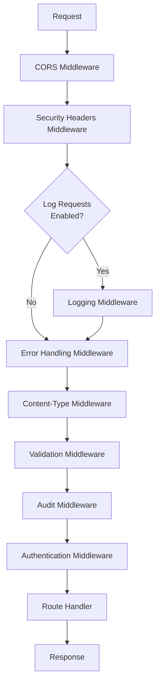

**Diagram sources**
- [server.go](file://internal/api/server.go#L50-L92)
- [middleware.go](file://internal/api/middleware.go#L0-L425)

**Section sources**
- [server.go](file://internal/api/server.go#L50-L92)
- [middleware.go](file://internal/api/middleware.go#L0-L425)

The middleware execution order is carefully designed to ensure proper processing flow and security. The pipeline begins with CORS middleware to handle cross-origin requests, followed by security headers middleware that adds essential security protections to all responses. Request logging is conditionally applied based on configuration, followed by error handling middleware that catches panics and ensures graceful error recovery.

The content-type middleware ensures proper response formatting, followed by input validation middleware that validates request parameters before further processing. Audit logging captures administrative actions, and authentication middleware validates user sessions for protected endpoints. This ordering ensures that security and validation occur before business logic execution while allowing audit logging to capture authentication attempts.

## Authentication Validation

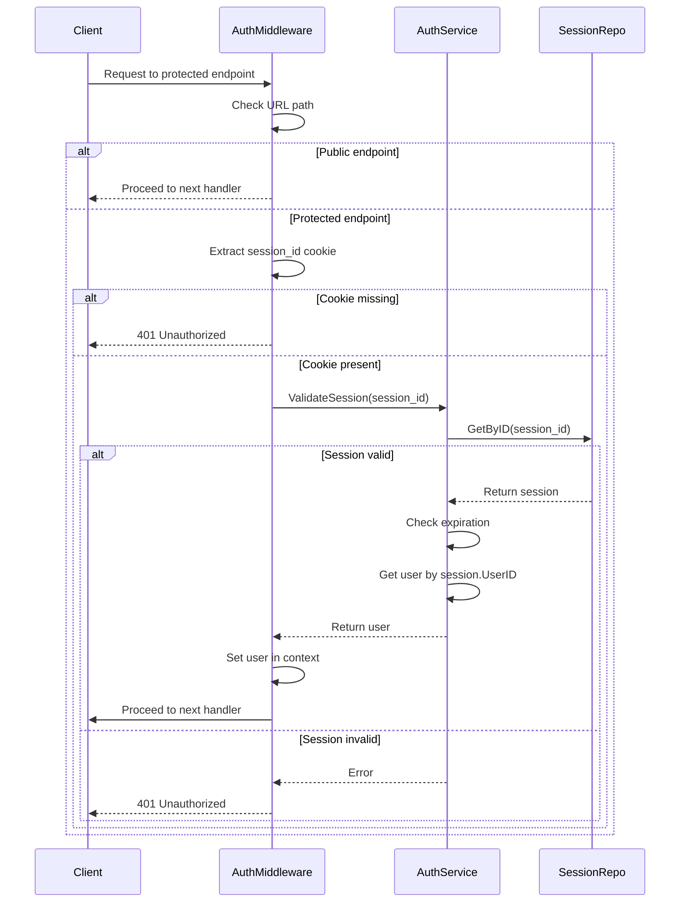

**Diagram sources**
- [middleware.go](file://internal/api/middleware.go#L65-L104)
- [auth.go](file://internal/auth/service.go#L84-L135)

**Section sources**
- [middleware.go](file://internal/api/middleware.go#L65-L104)
- [auth.go](file://internal/auth/service.go#L84-L135)

The authentication validation middleware implements session-based authentication using HTTP cookies. The authMiddleware function checks for a "session_id" cookie in incoming requests and validates it against the session repository. Public endpoints like login and health checks are exempt from authentication, allowing unauthenticated access to these specific routes.

When a session cookie is present, the middleware calls the authService.ValidateSession method to verify the session's validity and retrieve the associated user. If validation succeeds, the user information is stored in the request context for downstream handlers to access. Invalid or missing sessions result in a 401 Unauthorized response with a standardized API error format.

The authentication system uses server-side sessions stored in the database, with session IDs cryptographically generated and stored as HTTP-only cookies to prevent XSS attacks. Sessions include expiration times and are associated with user IP addresses and user agents for additional security.

## Request/Response Logging

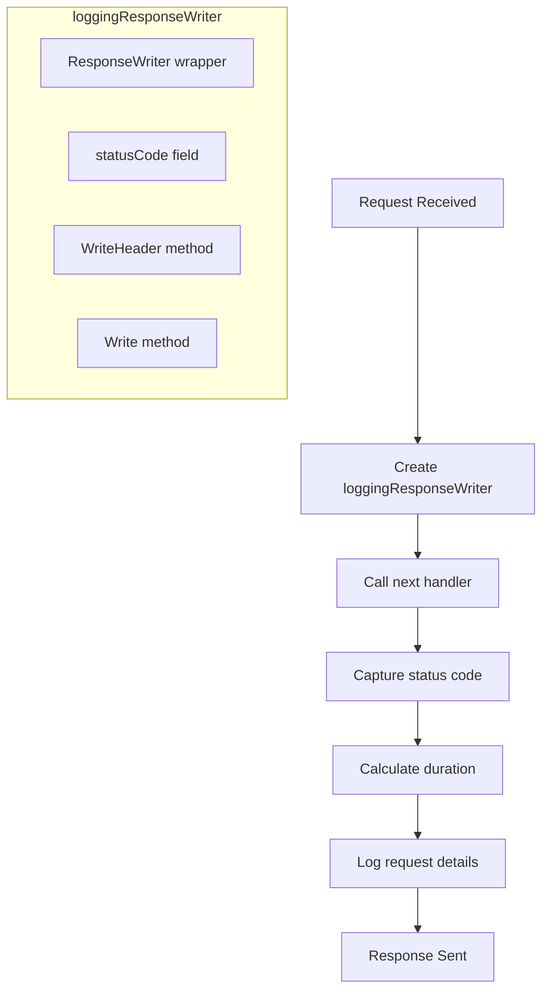

**Diagram sources**
- [middleware.go](file://internal/api/middleware.go#L17-L44)
- [middleware.go](file://internal/api/middleware.go#L99-L113)

**Section sources**
- [middleware.go](file://internal/api/middleware.go#L17-L44)

The request/response logging middleware captures detailed information about each HTTP request and response. It uses a custom loggingResponseWriter that wraps the standard http.ResponseWriter to capture the response status code, which is not otherwise accessible until WriteHeader is called.

The middleware measures request duration from receipt to response completion and logs key information including HTTP method, request URI, response status code, duration, client IP address, and user agent. This information is written to the standard application log using Go's built-in log package.

Logging is configurable through the API configuration, allowing it to be enabled or disabled based on the environment. In production, this logging provides valuable operational insights and audit trails, while in development it aids debugging and performance analysis.

## CORS Policy Enforcement

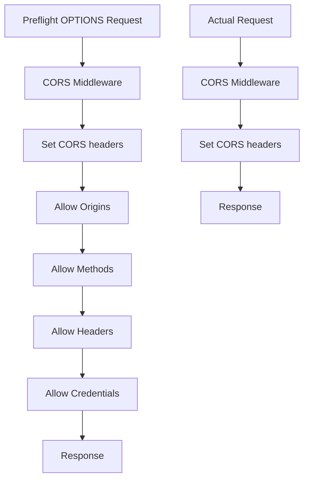

**Diagram sources**
- [server.go](file://internal/api/server.go#L51-L59)
- [middleware.go](file://internal/api/middleware.go#L50-L104)

**Section sources**
- [server.go](file://internal/api/server.go#L51-L59)

The CORS (Cross-Origin Resource Sharing) policy enforcement is implemented using the gorilla/handlers.CORS middleware. This middleware automatically handles preflight OPTIONS requests and adds appropriate CORS headers to all responses, enabling secure cross-origin requests from the frontend application.

The CORS configuration allows configurable origins, with a default setting of "*" (allow all origins) that should be restricted in production environments. The middleware permits standard HTTP methods (GET, POST, PUT, DELETE, OPTIONS) and specific headers including Content-Type, Authorization, and X-Requested-With. Credentials are allowed, enabling cookie-based authentication to work across origins.

This implementation ensures that the API can be securely consumed by the frontend application regardless of its hosting location, while maintaining appropriate security controls to prevent unauthorized cross-origin access.

## Panic Recovery

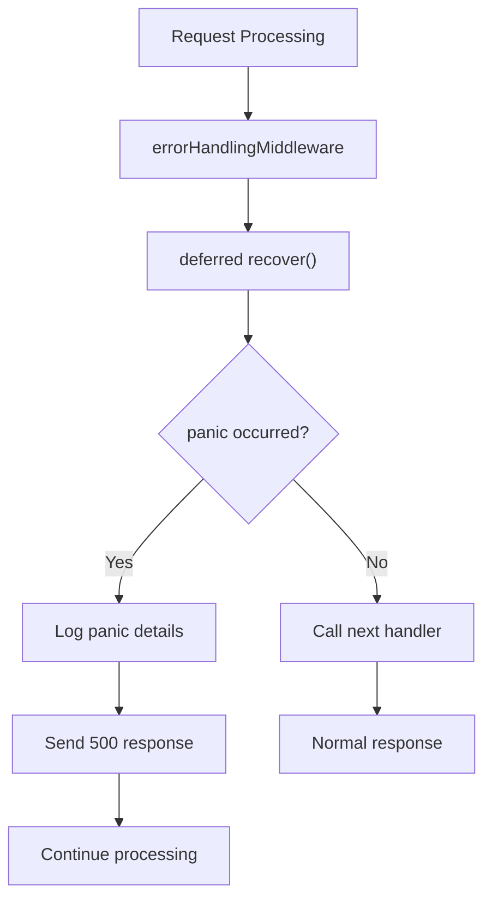

**Diagram sources**
- [middleware.go](file://internal/api/middleware.go#L45-L55)

**Section sources**
- [middleware.go](file://internal/api/middleware.go#L45-L55)

The panic recovery middleware provides centralized error handling for uncaught panics in request handlers. It uses Go's defer and recover mechanism to catch any panics that occur during request processing, preventing server crashes and ensuring graceful error responses.

When a panic occurs, the middleware logs detailed information about the panic, including the error value and stack trace, aiding in debugging and issue resolution. It then sends a standardized 500 Internal Server Error response to the client, maintaining API consistency even in error conditions.

This safety net ensures that programming errors or unexpected conditions in individual handlers do not bring down the entire server, improving system reliability and providing better user experience by avoiding abrupt connection closures.

## Input Validation

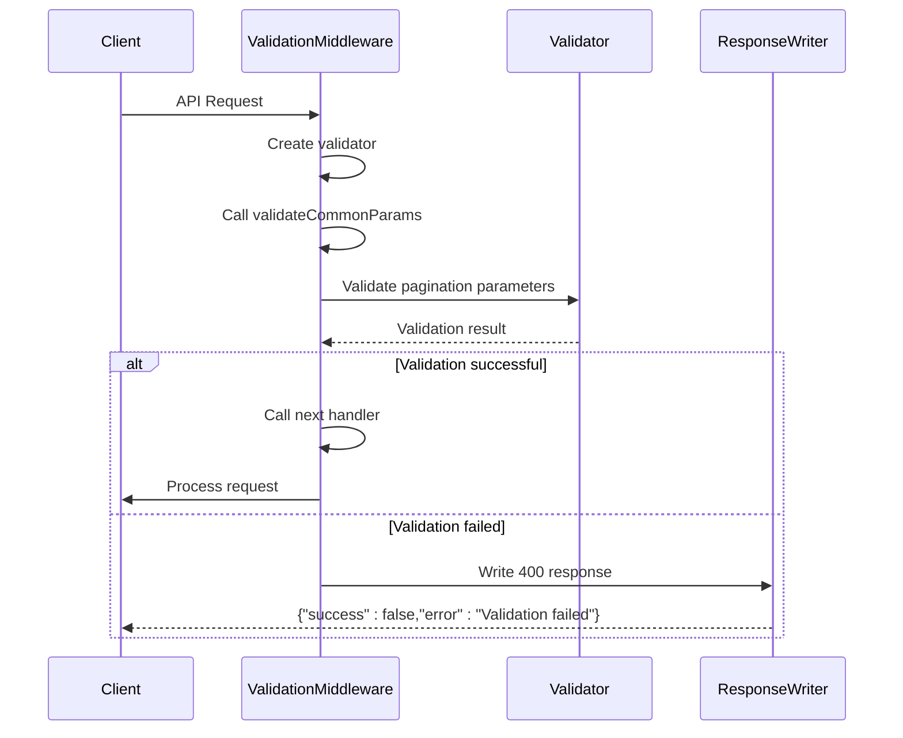

**Diagram sources**
- [middleware.go](file://internal/api/middleware.go#L154-L183)
- [middleware.go](file://internal/api/middleware.go#L226-L255)

**Section sources**
- [middleware.go](file://internal/api/middleware.go#L154-L183)

The input validation middleware ensures that incoming API requests contain valid parameters before they reach business logic handlers. It uses a validation service to check common parameters like pagination values (page, per_page) and extracts message IDs from URL paths for validation.

When validation fails, the middleware returns a 400 Bad Request response with detailed error information, including specific validation errors. The response follows the standard API response format with success: false and an error message, providing clear feedback to API consumers.

The validation process is extensible, allowing additional validation rules to be added for specific endpoints or request types. This middleware acts as a gatekeeper, preventing malformed requests from consuming server resources and ensuring data integrity throughout the application.

## Audit Logging

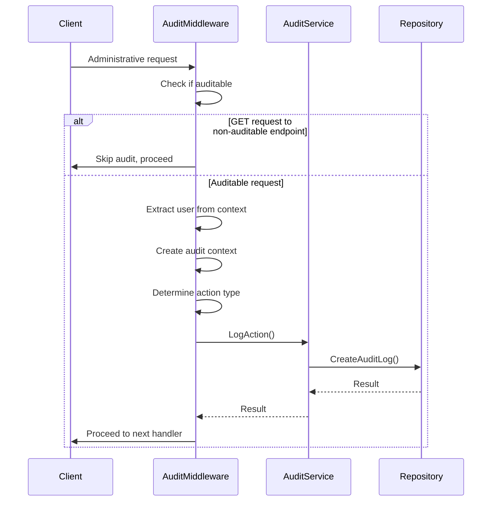

**Diagram sources**
- [middleware.go](file://internal/api/middleware.go#L175-L225)
- [service.go](file://internal/audit/service.go#L0-L286)

**Section sources**
- [middleware.go](file://internal/api/middleware.go#L175-L225)
- [service.go](file://internal/audit/service.go#L0-L286)

The audit logging middleware captures administrative actions for security and compliance purposes. It logs operations like queue management, authentication events, and message access, creating an immutable audit trail in the database.

The middleware determines the action type based on the request path and method, mapping API endpoints to specific audit action types. For example, POST requests to /queue/{id}/deliver are logged as ActionQueueDeliver actions. The audit entry includes contextual information such as user ID, IP address, user agent, request ID, and relevant parameters.

Audit logging occurs before the request is processed, ensuring that even failed attempts are recorded. This provides comprehensive visibility into system usage and helps detect suspicious activity. The audit service also writes entries to the system log as a redundancy measure.

## Security Headers

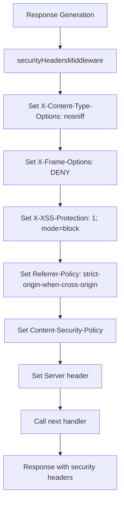

**Diagram sources**
- [middleware.go](file://internal/api/middleware.go#L257-L278)

**Section sources**
- [middleware.go](file://internal/api/middleware.go#L257-L278)

The security headers middleware enhances the application's security posture by adding several HTTP security headers to all responses. These headers help protect against common web vulnerabilities:

- **X-Content-Type-Options: nosniff** prevents MIME type sniffing, reducing the risk of content injection attacks
- **X-Frame-Options: DENY** prevents clickjacking attacks by disallowing iframe embedding
- **X-XSS-Protection: 1; mode=block** enables XSS filtering in compatible browsers
- **Referrer-Policy: strict-origin-when-cross-origin** controls referrer information disclosure
- **Content-Security-Policy** restricts resource loading to trusted sources
- **Server** header is set to a generic value to avoid exposing server software details

These security headers work together to create multiple layers of defense against common web-based attacks, improving the overall security of the application without requiring changes to the core business logic.

## Context Management

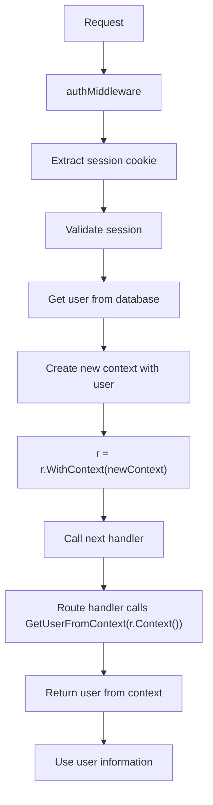

**Diagram sources**
- [middleware.go](file://internal/api/middleware.go#L99-L142)

**Section sources**
- [middleware.go](file://internal/api/middleware.go#L99-L142)

The middleware pipeline uses Go's context package to pass request-scoped data between handlers. A custom context key is used to store user information after successful authentication, allowing downstream handlers to access the authenticated user without repeating authentication checks.

The SetUserInContext and GetUserFromContext functions provide a type-safe interface for storing and retrieving user data in the request context. This pattern ensures that user information is available throughout the request lifecycle while maintaining type safety and avoiding context pollution.

The context also inherits cancellation and timeout behavior from the HTTP server, ensuring that long-running operations can be terminated when requests are cancelled or time out.

## Error Handling

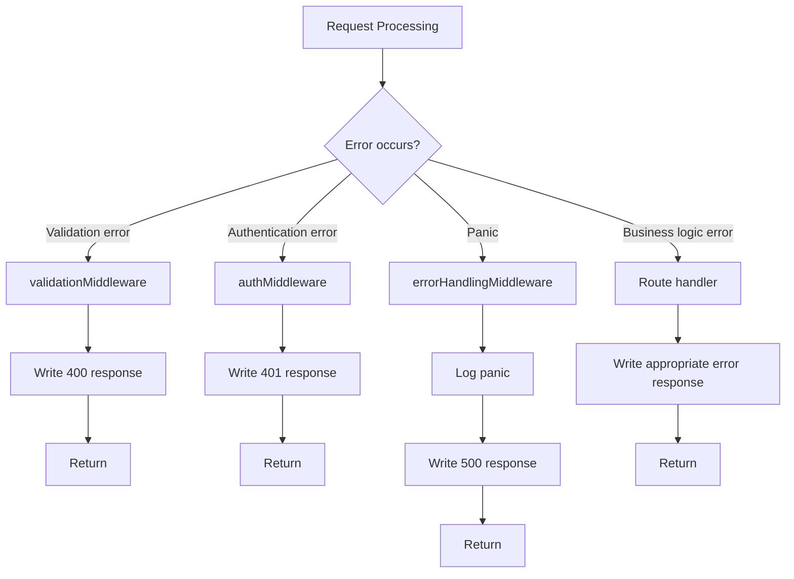

**Diagram sources**
- [response.go](file://internal/api/response.go#L0-L91)
- [middleware.go](file://internal/api/middleware.go#L45-L55)

**Section sources**
- [response.go](file://internal/api/response.go#L0-L91)

The error handling strategy in the middleware pipeline follows a consistent pattern using standardized response formats. Each middleware component handles errors appropriate to its responsibility and returns early with an appropriate HTTP error response.

The APIResponse structure provides a consistent format for all responses, with success, data, error, and meta fields. Helper functions like WriteErrorResponse, WriteBadRequestResponse, and WriteUnauthorizedResponse simplify error response generation with proper HTTP status codes and JSON formatting.

Errors are handled at the appropriate layer: validation errors in the validation middleware, authentication errors in the auth middleware, and panics in the error handling middleware. This layered approach ensures that errors are caught and handled as close to their source as possible, with meaningful error messages returned to clients.

## Configuration Options

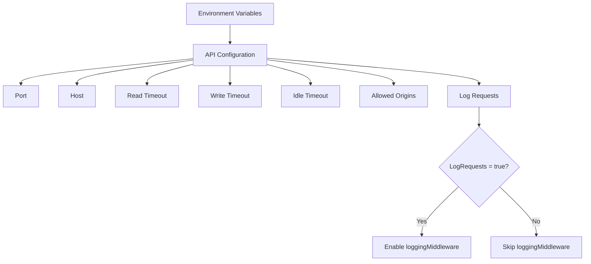

**Diagram sources**
- [config.go](file://internal/api/config.go#L0-L70)
- [server.go](file://internal/api/server.go#L50-L92)

**Section sources**
- [config.go](file://internal/api/config.go#L0-L70)

The middleware pipeline provides configuration options that allow different behaviors in various environments. The primary configurable option is request logging, controlled by the LogRequests boolean in the API configuration.

This configuration can be set via environment variables (API_LOG_REQUESTS) and defaults to true. When disabled, the logging middleware is not registered with the router, eliminating the performance overhead of request logging in environments where it's not needed.

Other configuration options include server port, host, timeouts, and CORS allowed origins, which indirectly affect middleware behavior. The modular design allows for easy extension of configuration options to control other middleware components as needed.

## Integration with Gorilla/Mux

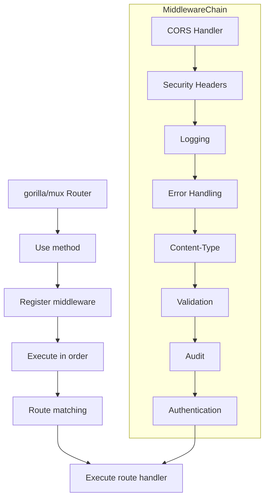

**Diagram sources**
- [server.go](file://internal/api/server.go#L50-L92)
- [middleware.go](file://internal/api/middleware.go#L0-L425)

**Section sources**
- [server.go](file://internal/api/server.go#L50-L92)

The middleware components are integrated with the gorilla/mux routing framework using the router.Use() method, which registers middleware handlers to be executed before route-specific handlers. Each middleware function follows the standard pattern of taking a next http.Handler parameter and returning a new http.Handler, creating a chain of responsibility.

The mux router executes middleware in the order they are registered, with each middleware calling the next handler in the chain via next.ServeHTTP(). This creates a layered processing pipeline where requests flow through each middleware before reaching the final route handler, and responses flow back through the same chain in reverse order.

This integration pattern is idiomatic Go web development and provides a clean, composable way to add cross-cutting concerns to HTTP request processing without coupling them to specific routes or handlers.

**Referenced Files in This Document**   
- [middleware.go](file://internal/api/middleware.go)
- [server.go](file://internal/api/server.go)
- [response.go](file://internal/api/response.go)
- [auth.go](file://internal/auth/service.go)
- [service.go](file://internal/audit/service.go)
- [config.go](file://internal/api/config.go)