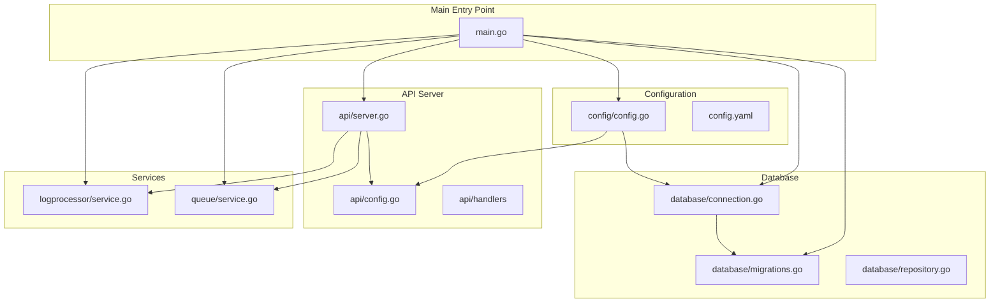
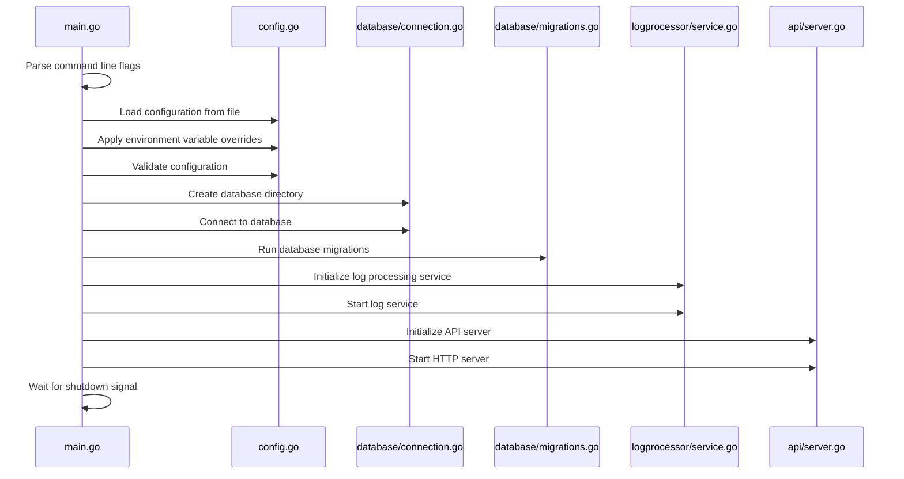
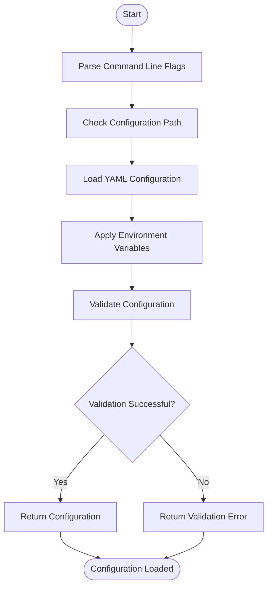
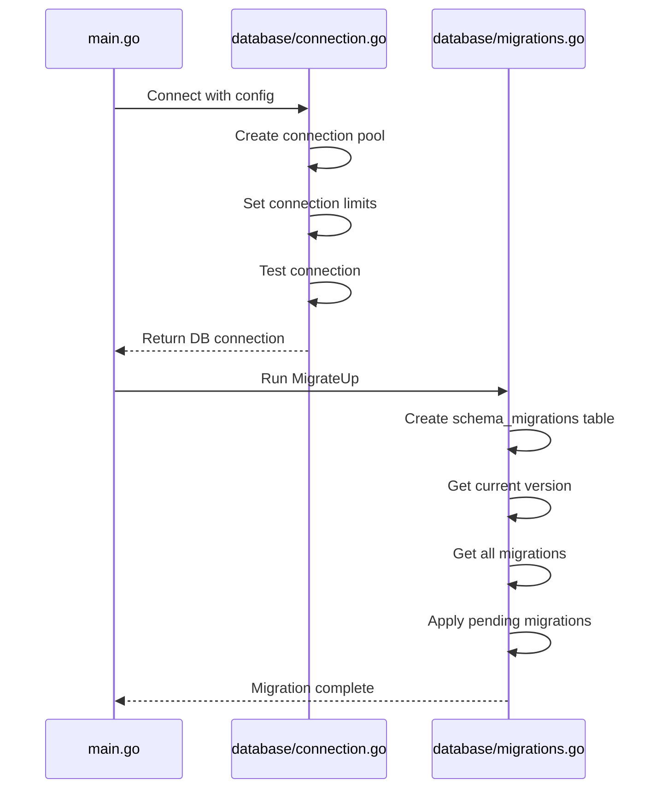
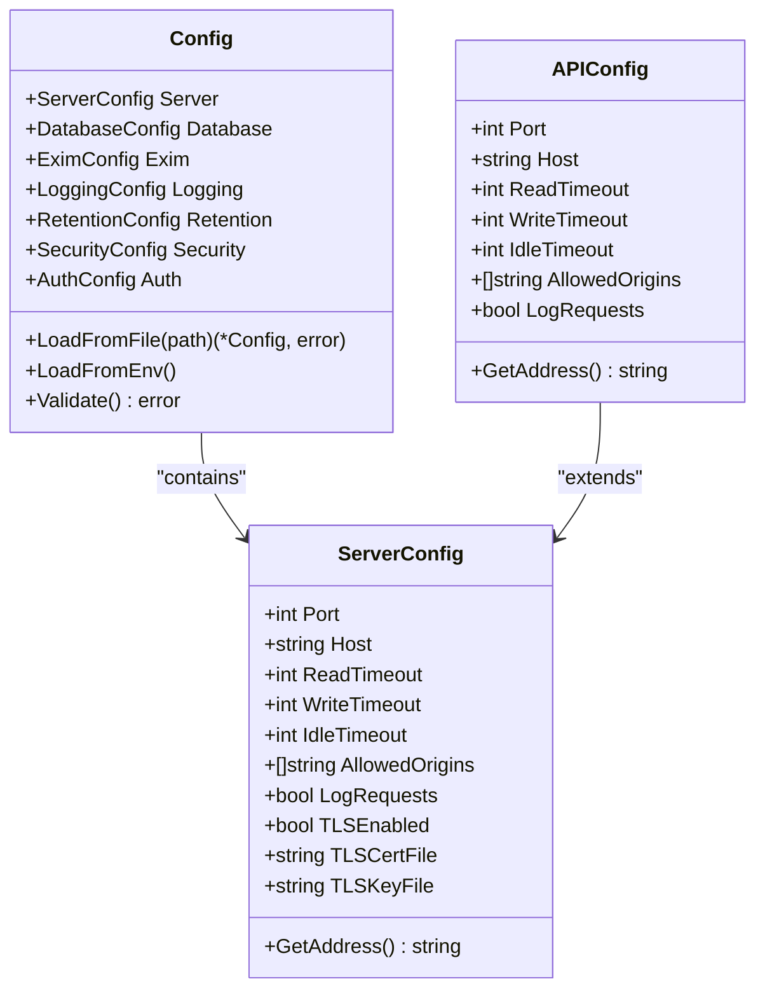
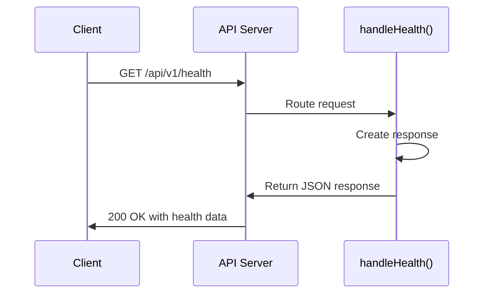
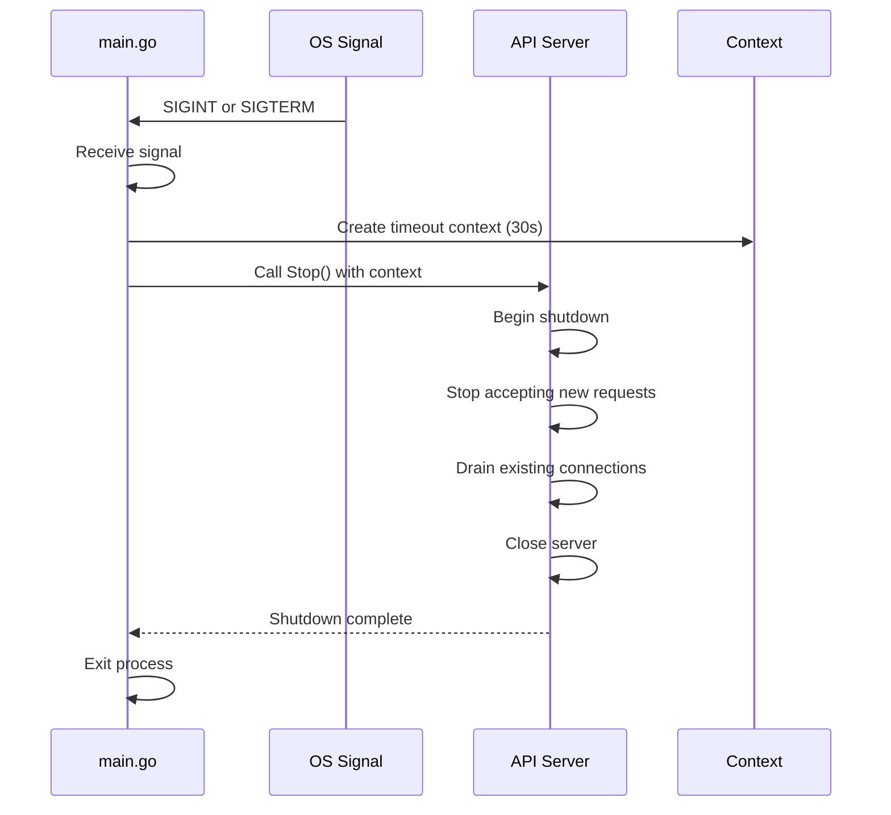

# API Server Lifecycle and Health


## Table of Contents
1. [Introduction](#introduction)
2. [Project Structure](#project-structure)
3. [Server Startup Sequence](#server-startup-sequence)
4. [Configuration Loading](#configuration-loading)
5. [Database Initialization](#database-initialization)
6. [API Server Configuration](#api-server-configuration)
7. [Health Check Endpoint](#health-check-endpoint)
8. [Graceful Shutdown](#graceful-shutdown)
9. [Operational Guidance](#operational-guidance)
10. [Troubleshooting](#troubleshooting)

## Introduction
This document provides comprehensive documentation for the API server lifecycle management in the exim-pilot application. It details the complete startup sequence, configuration loading, database initialization, health monitoring, and graceful shutdown procedures. The documentation is designed to provide both technical and operational teams with the necessary information to deploy, manage, and troubleshoot the API server effectively.

## Project Structure
The exim-pilot project follows a well-organized structure with clear separation of concerns. The application is structured into several key directories:

- **cmd/**: Contains the main application entry points
- **internal/**: Houses all internal packages and business logic
- **config/**: Configuration files and examples
- **web/**: Frontend assets and React components
- **tests/**: Comprehensive test suite

The API server lifecycle is primarily managed through the `cmd/exim-pilot` package, which coordinates the initialization of various services and components.





**Diagram sources**
- [main.go](file://cmd/exim-pilot/main.go#L1-L233)
- [config.go](file://internal/config/config.go#L1-L480)
- [connection.go](file://internal/database/connection.go#L1-L91)
- [migrations.go](file://internal/database/migrations.go#L1-L733)
- [server.go](file://internal/api/server.go#L1-L275)
- [service.go](file://internal/logprocessor/service.go#L1-L344)

**Section sources**
- [main.go](file://cmd/exim-pilot/main.go#L1-L233)
- [project_structure](file://#L1-L100)

## Server Startup Sequence
The API server startup sequence follows a well-defined initialization process that ensures all dependencies are properly configured before the server begins accepting requests.





**Diagram sources**
- [main.go](file://cmd/exim-pilot/main.go#L1-L233)

**Section sources**
- [main.go](file://cmd/exim-pilot/main.go#L1-L233)

### Startup Process Details
The server startup process begins with the `main()` function in `cmd/exim-pilot/main.go` and follows these steps:

1. **Command Line Flag Parsing**: The application parses command line arguments including configuration path, migration commands, and help/version flags.
2. **Configuration Loading**: The configuration is loaded from the specified YAML file with environment variable overrides.
3. **Embedded Assets Initialization**: Frontend assets are initialized for serving.
4. **Database Directory Creation**: The database directory is created if it doesn't exist.
5. **Database Connection**: A connection to the SQLite database is established with configured connection pool settings.
6. **Database Migrations**: Database schema migrations are applied to ensure the database is up-to-date.
7. **Service Initialization**: Key services like the queue service and log processing service are initialized.
8. **Default User Initialization**: A default admin user is created if no users exist in the database.
9. **API Server Initialization**: The API server is configured with routes, middleware, and handlers.
10. **Server Start**: The HTTP server is started in a goroutine to handle incoming requests.
11. **Signal Handling**: The main goroutine waits for interrupt signals (SIGINT/SIGTERM) to initiate graceful shutdown.

## Configuration Loading
The configuration system in exim-pilot provides flexible configuration through YAML files with environment variable overrides.





**Diagram sources**
- [config.go](file://internal/config/config.go#L1-L480)

**Section sources**
- [config.go](file://internal/config/config.go#L1-L480)

### Configuration Implementation
The configuration loading process is implemented in `internal/config/config.go` and follows this sequence:

1. **Default Configuration**: A default configuration is created with sensible defaults for all settings.
2. **File Loading**: The configuration file is read from the specified path (default: `/opt/exim-pilot/config/config.yaml`).
3. **YAML Parsing**: The YAML content is parsed into the configuration struct.
4. **Environment Overrides**: Environment variables prefixed with `EXIM_PILOT_` are applied to override configuration values.
5. **Validation**: The configuration is validated to ensure all values are within acceptable ranges and required files exist.

The configuration system supports environment variable overrides for key settings:

- `EXIM_PILOT_PORT`: HTTP server port
- `EXIM_PILOT_HOST`: HTTP server host
- `EXIM_PILOT_DB_PATH`: Database file path
- `EXIM_PILOT_ADMIN_USER`: Default admin username
- `EXIM_PILOT_ADMIN_PASSWORD`: Default admin password

## Database Initialization
The database initialization process ensures the SQLite database is properly configured and migrated to the latest schema version.





**Diagram sources**
- [connection.go](file://internal/database/connection.go#L1-L91)
- [migrations.go](file://internal/database/migrations.go#L1-L733)

**Section sources**
- [connection.go](file://internal/database/connection.go#L1-L91)
- [migrations.go](file://internal/database/migrations.go#L1-L733)

### Database Connection
The database connection is established in `internal/database/connection.go` using the following parameters:

- **Path**: Database file path
- **MaxOpenConns**: Maximum number of open connections (default: 25)
- **MaxIdleConns**: Maximum number of idle connections (default: 5)
- **ConnMaxLifetime**: Maximum lifetime of a connection (default: 5 minutes)

The connection uses SQLite with WAL (Write-Ahead Logging) mode and foreign key constraints enabled for improved performance and data integrity.

### Database Migrations
The migration system in `internal/database/migrations.go` manages schema evolution through versioned migration scripts. Key features include:

- **Versioned Migrations**: Each migration has a unique version number and description.
- **Up and Down Scripts**: Migrations include both forward (Up) and rollback (Down) SQL scripts.
- **Migration Tracking**: A `schema_migrations` table tracks which migrations have been applied.
- **Transaction Safety**: Each migration is applied within a transaction to ensure atomicity.

The system includes six initial migrations:
1. Initial schema creation with core tables
2. Performance indexes
3. Message notes and tags for troubleshooting
4. Configuration and system status tables
5. Audit log improvements
6. Schema consistency fixes

## API Server Configuration
The API server configuration defines how the HTTP server binds to network interfaces and handles requests.





**Diagram sources**
- [config.go](file://internal/config/config.go#L1-L480)
- [api/config.go](file://internal/api/config.go#L1-L72)

**Section sources**
- [config.go](file://internal/config/config.go#L1-L480)
- [api/config.go](file://internal/api/config.go#L1-L72)

### Server Configuration Parameters
The API server configuration is defined in `internal/api/config.go` and includes the following parameters:

**Network Binding**
- **Port**: TCP port to bind (default: 8080)
- **Host**: Host interface to bind (default: "0.0.0.0" for all interfaces)

**Timeout Settings**
- **ReadTimeout**: Maximum duration for reading the entire request (default: 15 seconds)
- **WriteTimeout**: Maximum duration for writing the response (default: 15 seconds)
- **IdleTimeout**: Maximum amount of time to wait for the next request (default: 60 seconds)

**Security and CORS**
- **AllowedOrigins**: CORS allowed origins (default: ["*"] for development)
- **LogRequests**: Enable request logging (default: true)

These configuration values can be overridden via environment variables:
- `API_PORT`: Sets the server port
- `API_HOST`: Sets the server host
- `API_READ_TIMEOUT`: Sets the read timeout in seconds
- `API_WRITE_TIMEOUT`: Sets the write timeout in seconds
- `API_IDLE_TIMEOUT`: Sets the idle timeout in seconds
- `API_LOG_REQUESTS`: Enables/disables request logging

## Health Check Endpoint
The health check endpoint provides a simple way to monitor the API server's availability and status.





**Diagram sources**
- [server.go](file://internal/api/server.go#L1-L275)
- [response.go](file://internal/api/response.go#L1-L92)

**Section sources**
- [server.go](file://internal/api/server.go#L256-L273)
- [response.go](file://internal/api/response.go#L1-L92)

### Health Check Implementation
The health check endpoint is implemented in `internal/api/server.go` and responds to GET requests at `/api/v1/health`. The implementation is straightforward:


```go
func (s *Server) handleHealth(w http.ResponseWriter, r *http.Request) {
    response := APIResponse{
        Success: true,
        Data: map[string]interface{}{
            "status":    "healthy",
            "timestamp": time.Now().UTC(),
            "version":   "1.0.0",
        },
    }
    WriteJSONResponse(w, http.StatusOK, response)
}
```


The endpoint returns a JSON response with:
- **Success**: Boolean indicating success
- **Data**: Object containing:
  - **status**: "healthy" status string
  - **timestamp**: Current UTC timestamp
  - **version**: Application version

The health check does not perform any database queries or external service checks, making it a lightweight liveness probe. For readiness checks, additional endpoints or enhanced health checks would be needed to verify database connectivity and other dependencies.

## Graceful Shutdown
The graceful shutdown mechanism ensures the server can terminate cleanly without dropping active connections.





**Diagram sources**
- [main.go](file://cmd/exim-pilot/main.go#L1-L233)
- [server.go](file://internal/api/server.go#L1-L275)

**Section sources**
- [main.go](file://cmd/exim-pilot/main.go#L141-L199)
- [server.go](file://internal/api/server.go#L256-L258)

### Shutdown Process
The graceful shutdown process is implemented in `cmd/exim-pilot/main.go` and follows these steps:

1. **Signal Registration**: The application registers for SIGINT (Ctrl+C) and SIGTERM signals using `signal.Notify()`.
2. **Signal Reception**: When a signal is received, the main goroutine proceeds with shutdown.
3. **Context Creation**: A context with a 30-second timeout is created to limit the shutdown duration.
4. **Server Shutdown**: The API server's `Stop()` method is called with the context.
5. **Connection Draining**: The HTTP server stops accepting new connections and waits for existing requests to complete.
6. **Resource Cleanup**: Deferred functions close database connections and stop background services.
7. **Process Termination**: The application exits cleanly.

The API server's `Stop()` method uses Go's `http.Server.Shutdown()` method, which gracefully shuts down the server without interrupting active connections. If the shutdown process takes longer than 30 seconds, the context timeout will force termination.

### Signal Handling
Signal handling is implemented in the main function:


```go
quit := make(chan os.Signal, 1)
signal.Notify(quit, syscall.SIGINT, syscall.SIGTERM)
<-quit

// Create a context with timeout for graceful shutdown
ctx, cancel := context.WithTimeout(context.Background(), 30*time.Second)
defer cancel()

if err := server.Stop(ctx); err != nil {
    log.Fatalf("Server forced to shutdown: %v", err)
}
```


This approach ensures that:
- The server can be terminated with Ctrl+C (SIGINT) or kill commands (SIGTERM)
- Active requests are allowed to complete within the 30-second window
- Background services have an opportunity to clean up resources
- The application exits with a clear log message

## Operational Guidance
This section provides guidance for operating and managing the exim-pilot API server in production environments.

### Server Restarting
To restart the server:
1. Send a SIGTERM signal: `kill <pid>` or use systemd: `systemctl restart exim-pilot`
2. The server will begin graceful shutdown, completing within 30 seconds
3. Start the server again with the same command line arguments

For zero-downtime deployments, consider running multiple instances behind a load balancer and draining connections from one instance at a time.

### Server Updates
When updating the server:
1. Stop the current instance gracefully
2. Replace the binary with the new version
3. Start the new instance
4. Verify functionality through health checks

Database migrations are automatically applied on startup, so ensure the database directory is preserved between updates.

### Monitoring
Monitor the server using the following methods:
- **Health Check**: Regularly poll `/api/v1/health` to verify server availability
- **Logs**: Monitor the application log file for errors and warnings
- **Metrics**: Implement additional monitoring for request rates, response times, and error rates
- **Database**: Monitor database size and performance

### Environment Variables
Key environment variables for operational control:
- `EXIM_PILOT_CONFIG`: Path to configuration file
- `EXIM_PILOT_PORT`: Override server port
- `EXIM_PILOT_DB_PATH`: Override database path
- `EXIM_PILOT_ADMIN_USER`: Set default admin username
- `EXIM_PILOT_ADMIN_PASSWORD`: Set default admin password
- `EXIM_PILOT_LOG_LEVEL`: Set log level (debug, info, warn, error)

## Troubleshooting
This section addresses common issues encountered during server operation.

### Startup Failures
**Configuration File Not Found**
- **Symptom**: "configuration file not found" error
- **Solution**: Ensure the config file exists at the specified path or set `EXIM_PILOT_CONFIG` environment variable

**Invalid Configuration Values**
- **Symptom**: "configuration validation failed" error
- **Solution**: Check configuration values against requirements:
  - Port must be between 1-65535
  - Database path cannot be empty
  - At least one Exim log path must be specified

**Database Connection Issues**
- **Symptom**: "Failed to connect to database" error
- **Solution**: 
  - Verify database directory is writable
  - Check file permissions on the database file
  - Ensure no other process is using the database

**Migration Failures**
- **Symptom**: "Failed to run database migrations" error
- **Solution**:
  - Check database file permissions
  - Verify disk space is available
  - Examine the specific SQL error in logs

### Connection Issues
**Port Already in Use**
- **Symptom**: Server fails to start with "address already in use" error
- **Solution**: 
  - Check if another instance is running: `ps aux | grep exim-pilot`
  - Change the port in configuration or environment variable
  - Kill the existing process

**Firewall Blocking**
- **Symptom**: Client cannot connect to server
- **Solution**:
  - Verify the server is binding to the correct interface (0.0.0.0 for external access)
  - Check firewall rules on the server
  - Test connectivity with telnet or curl

**TLS Configuration Issues**
- **Symptom**: SSL/TLS handshake failures
- **Solution**:
  - Verify TLS certificate and key files exist
  - Check file permissions on certificate files
  - Ensure certificate is valid and not expired

### Health Check Failures
**500 Internal Server Error**
- **Symptom**: Health check returns 500 error
- **Solution**:
  - Check server logs for panic messages
  - Verify the server is fully started
  - Test basic connectivity

**Timeout Issues**
- **Symptom**: Health check times out
- **Solution**:
  - Verify server is responsive
  - Check for high CPU or memory usage
  - Examine slow database queries

**Referenced Files in This Document**   
- [main.go](file://cmd/exim-pilot/main.go)
- [server.go](file://internal/api/server.go)
- [config.go](file://internal/config/config.go)
- [connection.go](file://internal/database/connection.go)
- [migrations.go](file://internal/database/migrations.go)
- [response.go](file://internal/api/response.go)
- [service.go](file://internal/logprocessor/service.go)