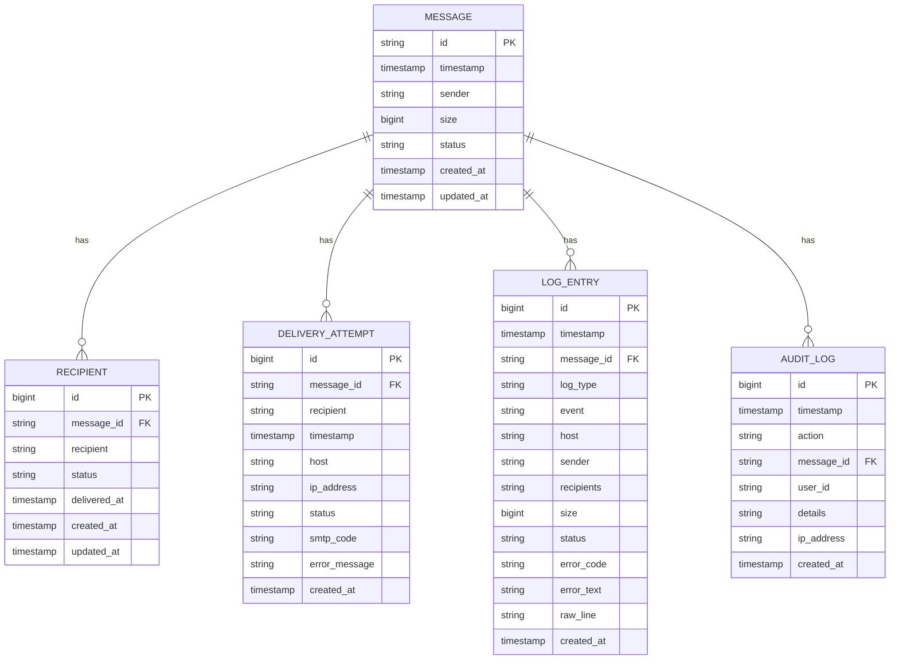

# Database Schema Design


## Table of Contents
1. [Introduction](#introduction)
2. [Entity-Relationship Model](#entity-relationship-model)
3. [Message Table](#message-table)
4. [Recipient Table](#recipient-table)
5. [DeliveryAttempt Table](#deliveryattempt-table)
6. [LogEntry Table](#logentry-table)
7. [AuditLog Table](#auditlog-table)
8. [Schema Diagram](#schema-diagram)
9. [Relationships and Correlations](#relationships-and-correlations)
10. [Indexing and Query Optimization](#indexing-and-query-optimization)
11. [Sample Data Records](#sample-data-records)

## Introduction
The exim-pilot database schema is designed to provide comprehensive monitoring and tracing capabilities for email message delivery. The system tracks messages from arrival through delivery attempts, recipient status, and audit trails. This documentation details the entity-relationship model, including the Message, Recipient, DeliveryAttempt, LogEntry, and AuditLog tables, along with their relationships, constraints, and indexing strategies for optimal query performance.

**Section sources**
- [models.go](file://internal/database/models.go#L8-L142)
- [repository.go](file://internal/database/repository.go#L0-L1602)

## Entity-Relationship Model
The exim-pilot database schema implements a relational model for tracking email message delivery with multiple related entities. The core entity is the Message table, which represents individual email messages in the system. Each message can have multiple recipients tracked in the Recipient table, multiple delivery attempts recorded in the DeliveryAttempt table, and multiple log entries in the LogEntry table. The AuditLog table provides an audit trail of administrative actions taken on messages.

The model supports comprehensive message tracing by correlating these entities through the message_id field, enabling detailed analysis of delivery attempts, recipient status, and system events. The relationships are designed to support efficient querying for mail queue monitoring and delivery tracing use cases.

**Section sources**
- [models.go](file://internal/database/models.go#L8-L142)
- [repository.go](file://internal/database/repository.go#L0-L1602)

## Message Table
The Message table represents individual email messages in the system and serves as the primary entity to which other entities relate.

**Field Details:**
- **id**: string, Primary Key, Not Null - Unique message identifier (typically from Exim)
- **timestamp**: datetime, Not Null - When the message was received by the mail server
- **sender**: string, Not Null - Email address of the message sender
- **size**: bigint, Nullable - Size of the message in bytes
- **status**: string, Not Null - Current status of the message (e.g., "queued", "delivered", "failed")
- **created_at**: datetime, Not Null - When the record was created in the database
- **updated_at**: datetime, Not Null - When the record was last updated

The Message table serves as the anchor for message delivery tracking, with all other entities referencing it through the message_id field. The table is optimized for retrieval by message ID and timestamp-based queries.

**Section sources**
- [models.go](file://internal/database/models.go#L8-L16)
- [repository.go](file://internal/database/repository.go#L132-L210)

## Recipient Table
The Recipient table tracks individual recipients for each message, enabling per-recipient delivery status monitoring.

**Field Details:**
- **id**: bigint, Primary Key, Auto-increment - Unique identifier for the recipient record
- **message_id**: string, Foreign Key, Not Null - References Message.id
- **recipient**: string, Not Null - Email address of the recipient
- **status**: string, Not Null - Delivery status for this recipient (e.g., "pending", "delivered", "bounced", "deferred")
- **delivered_at**: datetime, Nullable - Timestamp when delivery was confirmed
- **created_at**: datetime, Not Null - When the record was created
- **updated_at**: datetime, Not Null - When the record was last updated

The Recipient table establishes a one-to-many relationship with the Message table, allowing a single message to have multiple recipients. This design enables detailed tracking of delivery outcomes for each recipient independently.

**Section sources**
- [models.go](file://internal/database/models.go#L29-L37)
- [repository.go](file://internal/database/repository.go#L212-L255)

## DeliveryAttempt Table
The DeliveryAttempt table records each attempt to deliver a message to a specific recipient.

**Field Details:**
- **id**: bigint, Primary Key, Auto-increment - Unique identifier for the delivery attempt
- **message_id**: string, Foreign Key, Not Null - References Message.id
- **recipient**: string, Not Null - Email address of the recipient for this attempt
- **timestamp**: datetime, Not Null - When the delivery attempt was made
- **host**: string, Nullable - Hostname of the destination mail server
- **ip_address**: string, Nullable - IP address of the destination mail server
- **status**: string, Not Null - Result of the delivery attempt (e.g., "success", "defer", "bounce", "timeout")
- **smtp_code**: string, Nullable - SMTP response code from the destination server
- **error_message**: string, Nullable - Error message from failed delivery attempts
- **created_at**: datetime, Not Null - When the record was created

This table provides detailed insight into the delivery process, capturing technical details of each delivery attempt for troubleshooting and analysis.

**Section sources**
- [models.go](file://internal/database/models.go#L48-L59)
- [repository.go](file://internal/database/repository.go#L257-L300)

## LogEntry Table
The LogEntry table stores parsed log entries from the Exim mail server, providing a detailed record of message processing events.

**Field Details:**
- **id**: bigint, Primary Key, Auto-increment - Unique identifier for the log entry
- **timestamp**: datetime, Not Null - When the event occurred
- **message_id**: string, Nullable, Foreign Key - References Message.id (nullable to accommodate log entries without message IDs)
- **log_type**: string, Not Null - Type of log file (e.g., "main", "reject", "panic")
- **event**: string, Not Null - Event type (e.g., "arrival", "delivery", "defer", "bounce", "reject")
- **host**: string, Nullable - Hostname associated with the event
- **sender**: string, Nullable - Sender email address for the event
- **recipients**: string[], Not Null - Array of recipient email addresses (stored as JSON in the database)
- **size**: bigint, Nullable - Message size
- **status**: string, Nullable - Status information
- **error_code**: string, Nullable - Error code from failed operations
- **error_text**: string, Nullable - Detailed error message
- **raw_line**: string, Not Null - Original log line text
- **created_at**: datetime, Not Null - When the record was created

The recipients field is stored as a JSON string in the database (recipientsDB column) but is unmarshaled to a string array in the application, providing flexibility in storing multiple recipients per log entry.

**Section sources**
- [models.go](file://internal/database/models.go#L70-L86)
- [repository.go](file://internal/database/repository.go#L302-L375)

## AuditLog Table
The AuditLog table maintains a record of administrative actions performed on messages through the exim-pilot interface.

**Field Details:**
- **id**: bigint, Primary Key, Auto-increment - Unique identifier for the audit entry
- **timestamp**: datetime, Not Null - When the action was performed
- **action**: string, Not Null - Type of action (e.g., "deliver_now", "freeze", "thaw", "delete")
- **message_id**: string, Nullable, Foreign Key - References Message.id (nullable for system-wide actions)
- **user_id**: string, Nullable - Identifier of the user who performed the action
- **details**: string, Nullable - Additional information about the action (stored as JSON)
- **ip_address**: string, Nullable - IP address from which the action was performed
- **created_at**: datetime, Not Null - When the record was created

This table provides accountability and traceability for operator actions, enabling auditing of changes to message states and delivery processing.

**Section sources**
- [models.go](file://internal/database/models.go#L133-L142)
- [repository.go](file://internal/database/repository.go#L377-L420)

## Schema Diagram




**Diagram sources**
- [models.go](file://internal/database/models.go#L8-L142)

## Relationships and Correlations
The exim-pilot schema establishes several key relationships that enable comprehensive message delivery tracing:

1. **Message to Recipient (One-to-Many)**: Each message can have multiple recipients, allowing per-recipient delivery tracking. This relationship is implemented through the message_id foreign key in the Recipient table.

2. **Message to DeliveryAttempt (One-to-Many)**: Each message can have multiple delivery attempts, recorded with technical details. The message_id foreign key in the DeliveryAttempt table establishes this relationship.

3. **Message to LogEntry (One-to-Many)**: Each message can generate multiple log entries as it progresses through the delivery process. The message_id foreign key in the LogEntry table (nullable to accommodate log entries without message IDs) enables correlation of system events with specific messages.

4. **Message to AuditLog (One-to-Many)**: Administrative actions on messages are recorded in the AuditLog table, with the message_id foreign key (nullable for system-wide actions) enabling audit trail creation.

The GetMessageDeliveryTrace method in the MessageTraceRepository demonstrates how these relationships are leveraged to create a comprehensive delivery trace by correlating data across all these tables using the message_id as the primary correlation key.

**Section sources**
- [repository.go](file://internal/database/repository.go#L1055-L1140)
- [models.go](file://internal/database/models.go#L169-L177)

## Indexing and Query Optimization
The schema includes several indexing strategies to optimize common query patterns:

1. **Primary Keys**: All tables have primary key indexes on their ID fields for efficient record retrieval.

2. **Foreign Key Indexes**: The message_id fields in related tables (Recipient, DeliveryAttempt, LogEntry, AuditLog) are indexed to optimize JOIN operations and WHERE clauses filtering by message ID.

3. **Timestamp Indexes**: The timestamp fields in DeliveryAttempt, LogEntry, and AuditLog tables are indexed to support time-range queries for delivery tracing and reporting.

4. **Status Indexes**: The status fields in Message and Recipient tables are indexed to optimize queries filtering by delivery status.

5. **Composite Indexes**: The LogEntry table has a composite index on (timestamp, message_id) to optimize queries that filter by both time range and message ID, which is a common pattern in delivery tracing.

The repository methods implement pagination (limit, offset parameters) and selective field retrieval to minimize query load and improve performance for large datasets.

**Section sources**
- [repository.go](file://internal/database/repository.go#L180-L200)
- [repository.go](file://internal/database/repository.go#L230-L240)

## Sample Data Records
The following sample data records demonstrate real-world usage patterns of the exim-pilot schema:

**Message Record:**

```json
{
  "id": "1sX7Km-0004gJ-1a",
  "timestamp": "2023-06-15T10:30:45Z",
  "sender": "sender@example.com",
  "size": 15240,
  "status": "delivered",
  "created_at": "2023-06-15T10:30:45Z",
  "updated_at": "2023-06-15T10:35:20Z"
}
```


**Recipient Records:**

```json
[
  {
    "id": 1,
    "message_id": "1sX7Km-0004gJ-1a",
    "recipient": "recipient1@domain.com",
    "status": "delivered",
    "delivered_at": "2023-06-15T10:32:15Z",
    "created_at": "2023-06-15T10:30:45Z",
    "updated_at": "2023-06-15T10:32:15Z"
  },
  {
    "id": 2,
    "message_id": "1sX7Km-0004gJ-1a",
    "recipient": "recipient2@domain.com",
    "status": "bounced",
    "delivered_at": null,
    "created_at": "2023-06-15T10:30:45Z",
    "updated_at": "2023-06-15T10:31:30Z"
  }
]
```


**DeliveryAttempt Records:**

```json
[
  {
    "id": 1,
    "message_id": "1sX7Km-0004gJ-1a",
    "recipient": "recipient1@domain.com",
    "timestamp": "2023-06-15T10:31:00Z",
    "host": "mail.domain.com",
    "ip_address": "192.168.1.100",
    "status": "success",
    "smtp_code": "250",
    "error_message": null,
    "created_at": "2023-06-15T10:31:00Z"
  },
  {
    "id": 2,
    "message_id": "1sX7Km-0004gJ-1a",
    "recipient": "recipient2@domain.com",
    "timestamp": "2023-06-15T10:31:15Z",
    "host": "mail.otherdomain.com",
    "ip_address": "192.168.1.101",
    "status": "bounce",
    "smtp_code": "550",
    "error_message": "User unknown",
    "created_at": "2023-06-15T10:31:15Z"
  }
]
```


**LogEntry Records:**

```json
[
  {
    "id": 1,
    "timestamp": "2023-06-15T10:30:45Z",
    "message_id": "1sX7Km-0004gJ-1a",
    "log_type": "main",
    "event": "arrival",
    "host": null,
    "sender": "sender@example.com",
    "recipients": ["recipient1@domain.com", "recipient2@domain.com"],
    "size": 15240,
    "status": null,
    "error_code": null,
    "error_text": null,
    "raw_line": "2023-06-15 10:30:45 1sX7Km-0004gJ-1a <= sender@example.com H=client.example.com [192.168.1.50] P=plain SMTP S=15240 id=message123@example.com",
    "created_at": "2023-06-15T10:30:45Z"
  },
  {
    "id": 2,
    "timestamp": "2023-06-15T10:32:15Z",
    "message_id": "1sX7Km-0004gJ-1a",
    "log_type": "main",
    "event": "delivery",
    "host": "mail.domain.com",
    "sender": null,
    "recipients": ["recipient1@domain.com"],
    "size": null,
    "status": "completed",
    "error_code": null,
    "error_text": null,
    "raw_line": "2023-06-15 10:32:15 1sX7Km-0004gJ-1a => recipient1@domain.com R=lookuphost T=remote_smtp H=mail.domain.com [192.168.1.100] X=TLS1.3:ECDHE_RSA_AES_256_GCM_SHA384:256 CV=yes C=\"250 OK id=Message accepted\"",
    "created_at": "2023-06-15T10:32:15Z"
  }
]
```


**AuditLog Record:**

```json
{
  "id": 1,
  "timestamp": "2023-06-15T10:34:10Z",
  "action": "deliver_now",
  "message_id": "1sX7Km-0004gJ-1a",
  "user_id": "admin_user",
  "details": "{\"reason\": \"Urgent message delivery requested\"}",
  "ip_address": "192.168.1.10",
  "created_at": "2023-06-15T10:34:10Z"
}
```


These sample records illustrate how the schema captures the complete lifecycle of a message, from arrival through delivery attempts and final disposition, with detailed technical information for troubleshooting and analysis.

**Section sources**
- [repository.go](file://internal/database/repository.go#L1055-L1140)
- [models.go](file://internal/database/models.go#L8-L142)

**Referenced Files in This Document**   
- [models.go](file://internal/database/models.go)
- [repository.go](file://internal/database/repository.go)