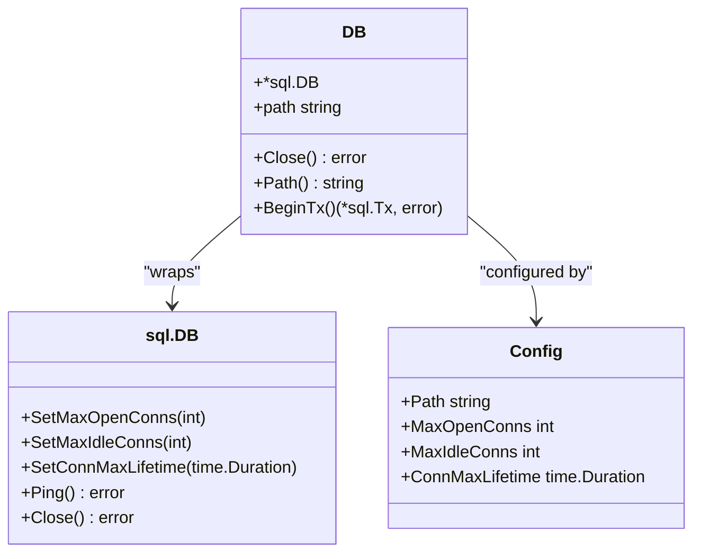
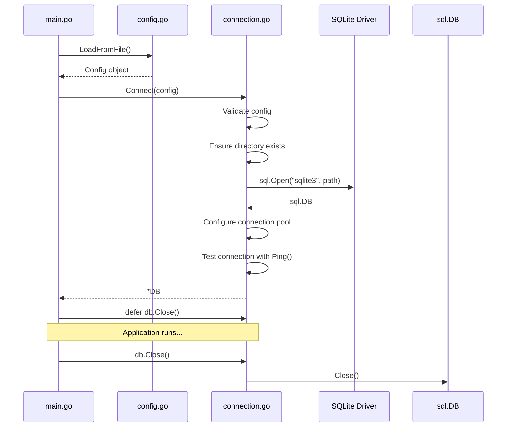
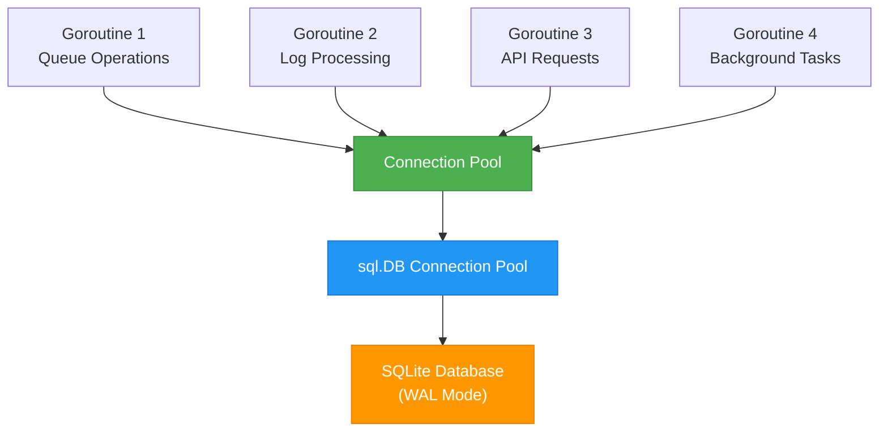
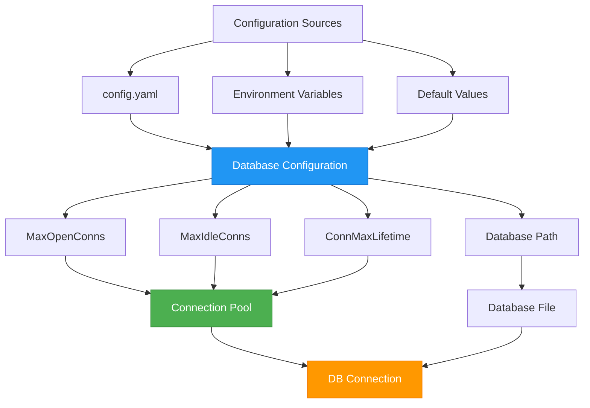
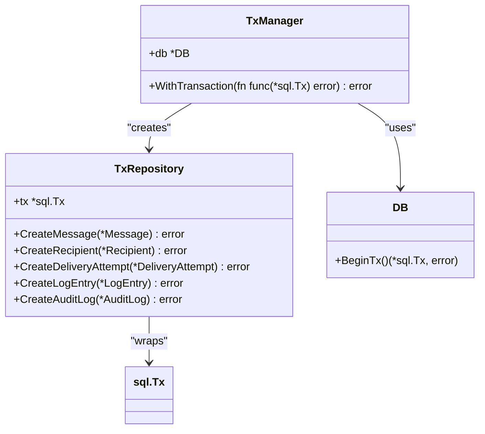
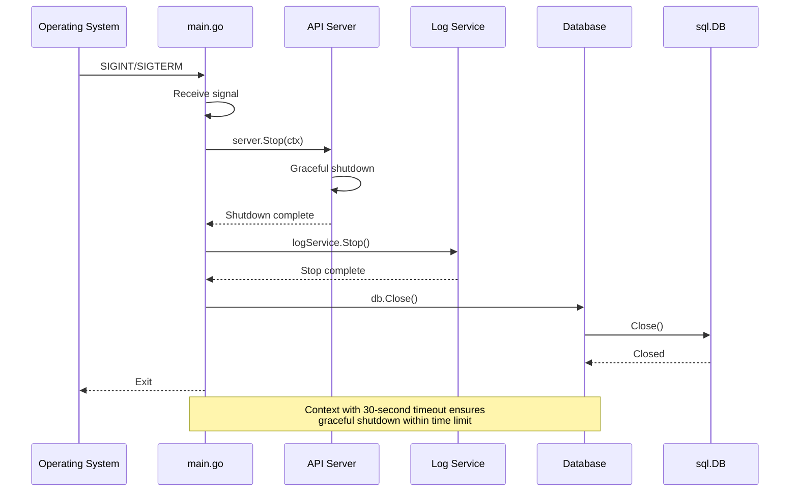

# Connection Management


## Table of Contents
1. [Introduction](#introduction)
2. [Database Connection Pooling](#database-connection-pooling)
3. [Connection Lifecycle Management](#connection-lifecycle-management)
4. [Thread-Safe Access Patterns](#thread-safe-access-patterns)
5. [Configuration and Initialization](#configuration-and-initialization)
6. [Transaction Management API](#transaction-management-api)
7. [Connection Pool Configuration Parameters](#connection-pool-configuration-parameters)
8. [Application Shutdown and Resource Cleanup](#application-shutdown-and-resource-cleanup)
9. [Usage Examples and Best Practices](#usage-examples-and-best-practices)
10. [Common Pitfalls and Troubleshooting](#common-pitfalls-and-troubleshooting)

## Introduction
The exim-pilot application implements a robust database connection and transaction management system using SQLite as the underlying database engine. This documentation provides a comprehensive overview of the connection pooling mechanism, connection lifecycle, thread-safe access patterns, and transaction management API. The system is designed to handle concurrent access from multiple goroutines while maintaining data consistency during queue operations and log processing. The implementation leverages Go's built-in database/sql package with specific configurations optimized for SQLite performance and reliability.

## Database Connection Pooling
The database connection pooling system in exim-pilot is implemented through the `DB` struct in the internal/database package, which wraps Go's standard `sql.DB` connection pool. The connection pool is configured with specific parameters to optimize performance and resource utilization.





**Diagram sources**
- [connection.go](file://internal/database/connection.go#L15-L88)

**Section sources**
- [connection.go](file://internal/database/connection.go#L15-L88)

The connection pool is initialized with the following key parameters:
- **MaxOpenConns**: Maximum number of open connections to the database
- **MaxIdleConns**: Maximum number of idle connections in the pool
- **ConnMaxLifetime**: Maximum amount of time a connection can be reused

These parameters are configurable through the application configuration system, allowing administrators to tune the connection pool based on their specific deployment requirements and workload characteristics.

## Connection Lifecycle Management
The connection lifecycle in exim-pilot follows a well-defined pattern from initialization to cleanup. The lifecycle is managed through the `Connect` and `Close` methods of the database package.





**Diagram sources**
- [main.go](file://cmd/exim-pilot/main.go#L50-L97)
- [connection.go](file://internal/database/connection.go#L45-L88)

**Section sources**
- [main.go](file://cmd/exim-pilot/main.go#L50-L97)
- [connection.go](file://internal/database/connection.go#L45-L88)

The connection lifecycle consists of the following phases:
1. **Configuration**: Load database configuration from YAML file or environment variables
2. **Initialization**: Create database directory if it doesn't exist and establish connection
3. **Validation**: Test the connection with a ping operation
4. **Usage**: Application uses the connection for database operations
5. **Cleanup**: Close the connection when the application shuts down

The `Connect` function in connection.go handles the initialization phase, setting up the connection pool with the specified configuration parameters and testing the connection before returning the database handle.

## Thread-Safe Access Patterns
The database connection system in exim-pilot is designed to handle concurrent access from multiple goroutines safely. The underlying Go database/sql package provides thread-safe connection pooling, and exim-pilot builds upon this foundation with additional patterns to ensure data consistency.





**Diagram sources**
- [connection.go](file://internal/database/connection.go#L45-L88)
- [main.go](file://cmd/exim-pilot/main.go#L50-L97)

**Section sources**
- [connection.go](file://internal/database/connection.go#L45-L88)

The thread-safe access patterns include:
- **Connection Pooling**: Multiple goroutines can safely use the same *DB instance, with the connection pool managing the distribution of connections
- **WAL Mode**: SQLite is configured to use Write-Ahead Logging mode, which allows multiple readers and a single writer to operate concurrently
- **Foreign Key Constraints**: Enabled to maintain referential integrity across concurrent operations
- **Transaction Isolation**: Proper transaction boundaries ensure data consistency during complex operations

The system has been tested for concurrent operations, as evidenced by the performance tests in the codebase that verify the ability to handle multiple simultaneous database operations without conflicts.

## Configuration and Initialization
The database connection system is initialized with configuration parameters from the application's configuration file, which can be overridden by environment variables. The configuration process follows a hierarchical approach to ensure flexibility and ease of deployment.





**Diagram sources**
- [config.go](file://internal/config/config.go#L60-L84)
- [main.go](file://cmd/exim-pilot/main.go#L50-L97)

**Section sources**
- [config.go](file://internal/config/config.go#L60-L84)
- [main.go](file://cmd/exim-pilot/main.go#L50-L97)

The initialization process in main.go demonstrates how the configuration is applied:


```go
// Create database config from main config
dbConfig := &database.Config{
    Path:            cfg.Database.Path,
    MaxOpenConns:    cfg.Database.MaxOpenConns,
    MaxIdleConns:    cfg.Database.MaxIdleConns,
    ConnMaxLifetime: cfg.GetDatabaseConnMaxLifetime(),
}

// Connect to database
db, err := database.Connect(dbConfig)
if err != nil {
    log.Fatalf("Failed to connect to database: %v", err)
}
defer db.Close()
```


The configuration parameters are validated during the loading process, ensuring that values like MaxOpenConns are at least 1 and MaxIdleConns are not negative. This validation prevents common configuration errors that could lead to connection issues.

## Transaction Management API
The transaction management system in exim-pilot provides a clean API for executing operations within database transactions, ensuring data consistency during complex operations that involve multiple database writes.





**Diagram sources**
- [transaction.go](file://internal/database/transaction.go#L10-L151)

**Section sources**
- [transaction.go](file://internal/database/transaction.go#L10-L151)

The transaction API consists of two main components:
1. **TxManager**: Provides the `WithTransaction` method that handles the transaction lifecycle
2. **TxRepository**: Provides methods for database operations within a transaction

The `WithTransaction` method implements a common pattern for transaction management:


```go
func (tm *TxManager) WithTransaction(fn func(*sql.Tx) error) error {
    tx, err := tm.db.BeginTx()
    if err != nil {
        return fmt.Errorf("failed to begin transaction: %w", err)
    }

    defer func() {
        if p := recover(); p != nil {
            tx.Rollback()
            panic(p)
        }
    }()

    if err := fn(tx); err != nil {
        if rbErr := tx.Rollback(); rbErr != nil {
            return fmt.Errorf("transaction error: %v, rollback error: %v", err, rbErr)
        }
        return err
    }

    if err := tx.Commit(); err != nil {
        return fmt.Errorf("failed to commit transaction: %w", err)
    }

    return nil
}
```


This implementation ensures that:
- Transactions are automatically rolled back if an error occurs
- Panic recovery is handled properly with transaction rollback
- Errors during rollback are captured and reported
- Successful operations are committed automatically

## Connection Pool Configuration Parameters
The connection pool parameters are configurable through the application's configuration system, allowing administrators to tune the database performance based on their specific requirements.

**Database Configuration Parameters**

| Parameter | Default Value | Description | Configuration File Path |
|---------|-------------|-----------|------------------------|
| Path | /opt/exim-pilot/data/exim-pilot.db | SQLite database file path | database.path |
| MaxOpenConns | 25 | Maximum open database connections | database.max_open_conns |
| MaxIdleConns | 5 | Maximum idle database connections | database.max_idle_conns |
| ConnMaxLifetime | 5 minutes | Connection lifetime before reuse | database.conn_max_lifetime |
| BackupEnabled | true | Enable automatic database backups | database.backup_enabled |
| BackupInterval | 24 hours | Backup interval | database.backup_interval |
| BackupPath | /opt/exim-pilot/backups | Backup directory path | database.backup_path |

These parameters are defined in the DatabaseConfig struct in config.go and are validated during configuration loading:


```go
// Validate database configuration
if c.Database.Path == "" {
    return fmt.Errorf("database path cannot be empty")
}

if c.Database.MaxOpenConns < 1 {
    return fmt.Errorf("database max_open_conns must be at least 1")
}

if c.Database.MaxIdleConns < 0 {
    return fmt.Errorf("database max_idle_conns cannot be negative")
}
```


The connection maximum lifetime is converted from minutes (as stored in the configuration) to a time.Duration:


```go
// GetDatabaseConnMaxLifetime returns the connection max lifetime as a duration
func (c *Config) GetDatabaseConnMaxLifetime() time.Duration {
    return time.Duration(c.Database.ConnMaxLifetime) * time.Minute
}
```


**Section sources**
- [config.go](file://internal/config/config.go#L60-L84)
- [config.go](file://internal/config/config.go#L294-L338)

## Application Shutdown and Resource Cleanup
The application implements proper resource cleanup during shutdown to ensure all database connections are properly closed and resources are released.





**Diagram sources**
- [main.go](file://cmd/exim-pilot/main.go#L180-L210)

**Section sources**
- [main.go](file://cmd/exim-pilot/main.go#L180-L210)

The shutdown process in main.go follows these steps:
1. Register signal handlers for SIGINT and SIGTERM
2. Wait for interrupt signal
3. Create a context with a 30-second timeout for graceful shutdown
4. Stop the API server
5. Stop the log processing service
6. Close the database connection (handled by defer)

The defer statement in main.go ensures that the database connection is closed even if an error occurs during shutdown:


```go
// Connect to database
db, err := database.Connect(dbConfig)
if err != nil {
    log.Fatalf("Failed to connect to database: %v", err)
}
defer db.Close() // Ensures connection is closed on exit
```


Additional resource cleanup occurs through background services that handle data retention and cleanup:


```go
// Schedule periodic cleanup
for {
    select {
    case <-ctx.Done():
        log.Println("Auto cleanup scheduler stopped")
        return
    case <-ticker.C:
        go func() {
            if _, err := rs.CleanupExpiredData(ctx); err != nil {
                log.Printf("Scheduled cleanup failed: %v", err)
            }
        }()
    }
}
```


This ensures that expired data is regularly cleaned up, maintaining database performance and adhering to retention policies.

## Usage Examples and Best Practices
The following examples demonstrate proper usage patterns for the database connection and transaction management system.

### Basic Database Operations

```go
// Initialize configuration
cfg, err := config.LoadFromFile(*configPath)
if err != nil {
    log.Fatalf("Failed to load configuration: %v", err)
}

// Create database configuration
dbConfig := &database.Config{
    Path:            cfg.Database.Path,
    MaxOpenConns:    cfg.Database.MaxOpenConns,
    MaxIdleConns:    cfg.Database.MaxIdleConns,
    ConnMaxLifetime: cfg.GetDatabaseConnMaxLifetime(),
}

// Connect to database
db, err := database.Connect(dbConfig)
if err != nil {
    log.Fatalf("Failed to connect to database: %v", err)
}
defer db.Close()
```


### Transaction Usage Pattern

```go
// Create transaction manager
txManager := database.NewTxManager(db)

// Execute operations within a transaction
err := txManager.WithTransaction(func(tx *sql.Tx) error {
    // Create transaction repository
    txRepo := database.NewTxRepository(tx)
    
    // Create message
    msg := &database.Message{
        ID:        "msg-123",
        Timestamp: time.Now(),
        Sender:    "user@example.com",
        Size:      1024,
        Status:    "queued",
        CreatedAt: time.Now(),
        UpdatedAt: time.Now(),
    }
    
    if err := txRepo.CreateMessage(msg); err != nil {
        return fmt.Errorf("failed to create message: %w", err)
    }
    
    // Create recipient
    recipient := &database.Recipient{
        MessageID:  msg.ID,
        Recipient:  "recipient@example.com",
        Status:     "pending",
        CreatedAt:  time.Now(),
        UpdatedAt:  time.Now(),
    }
    
    if err := txRepo.CreateRecipient(recipient); err != nil {
        return fmt.Errorf("failed to create recipient: %w", err)
    }
    
    // Create audit log
    auditLog := &database.AuditLog{
        Timestamp: time.Now(),
        Action:    "message_created",
        MessageID: msg.ID,
        UserID:    "admin",
        Details:   "Message created via API",
        IPAddress: "127.0.0.1",
        CreatedAt: time.Now(),
    }
    
    if err := txRepo.CreateAuditLog(auditLog); err != nil {
        return fmt.Errorf("failed to create audit log: %w", err)
    }
    
    return nil // Commit transaction
})

if err != nil {
    log.Printf("Transaction failed: %v", err)
}
```


### Queue Service Integration

```go
// Initialize queue service with database connection
queueService := queue.NewService(cfg.Exim.BinaryPath, db)

// Use queue service methods that internally manage transactions
status, err := queueService.GetQueueStatus()
if err != nil {
    log.Printf("Failed to get queue status: %v", err)
}

// Perform queue operations
result, err := queueService.DeliverNow("msg-123", "admin", "127.0.0.1")
if err != nil {
    log.Printf("Failed to deliver message: %v", err)
}
```


**Section sources**
- [main.go](file://cmd/exim-pilot/main.go#L50-L97)
- [transaction.go](file://internal/database/transaction.go#L10-L151)
- [service.go](file://internal/queue/service.go#L10-L311)

## Common Pitfalls and Troubleshooting
This section addresses common issues and pitfalls when working with the database connection and transaction management system.

### Connection Issues
**Problem**: "Failed to connect to database" error
**Causes**:
- Database directory does not exist or is not writable
- Invalid database path in configuration
- Permission issues with database file
- SQLite file is locked by another process

**Solutions**:
1. Verify the database directory exists and has proper permissions:

```bash
mkdir -p /opt/exim-pilot/data
chmod 755 /opt/exim-pilot/data
```


2. Check the database path in config.yaml:

```yaml
database:
  path: "/opt/exim-pilot/data/exim-pilot.db"
```


3. Ensure no other process is using the database file:

```bash
lsof /opt/exim-pilot/data/exim-pilot.db
```


### Transaction Deadlocks
**Problem**: Transactions timing out or deadlocking
**Causes**:
- Long-running transactions holding locks
- Circular dependencies between transactions
- Insufficient connection pool size for concurrent operations

**Solutions**:
1. Keep transactions as short as possible
2. Order operations consistently across transactions
3. Increase MaxOpenConns if needed:

```yaml
database:
  max_open_conns: 50
```


### Performance Issues
**Problem**: Slow database operations under load
**Causes**:
- Insufficient connection pool size
- Long connection lifetime causing stale connections
- Lack of proper indexing on frequently queried columns

**Solutions**:
1. Monitor and adjust connection pool parameters:

```yaml
database:
  max_open_conns: 50
  max_idle_conns: 10
  conn_max_lifetime: 10
```


2. Ensure proper indexing on commonly queried fields like message_id, timestamp, and status.

3. Use the optimization service to periodically optimize the database:

```go
// Run database optimization after cleanup
if err := rs.optimizeAfterCleanup(ctx); err != nil {
    log.Printf("Failed to optimize database after cleanup: %v", err)
}
```


### Configuration Validation Errors
**Problem**: "Configuration validation failed" error
**Causes**:
- Missing required configuration values
- Invalid values (e.g., negative MaxIdleConns)
- File paths that don't exist

**Solutions**:
1. Ensure all required configuration values are present:

```yaml
database:
  path: "data/exim-pilot.db"
  max_open_conns: 25
  max_idle_conns: 5
  conn_max_lifetime: 5
```


2. Validate the configuration file syntax:

```bash
yamllint config.yaml
```


3. Check file permissions for database and log directories.

**Section sources**
- [config.go](file://internal/config/config.go#L294-L338)
- [connection.go](file://internal/database/connection.go#L45-L88)
- [main.go](file://cmd/exim-pilot/main.go#L50-L97)

**Referenced Files in This Document**   
- [connection.go](file://internal/database/connection.go)
- [transaction.go](file://internal/database/transaction.go)
- [config.go](file://internal/config/config.go)
- [main.go](file://cmd/exim-pilot/main.go)
- [service.go](file://internal/queue/service.go)