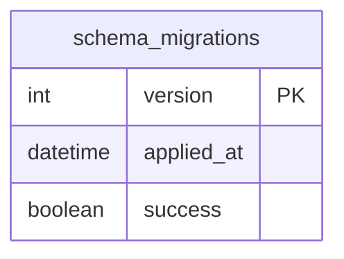
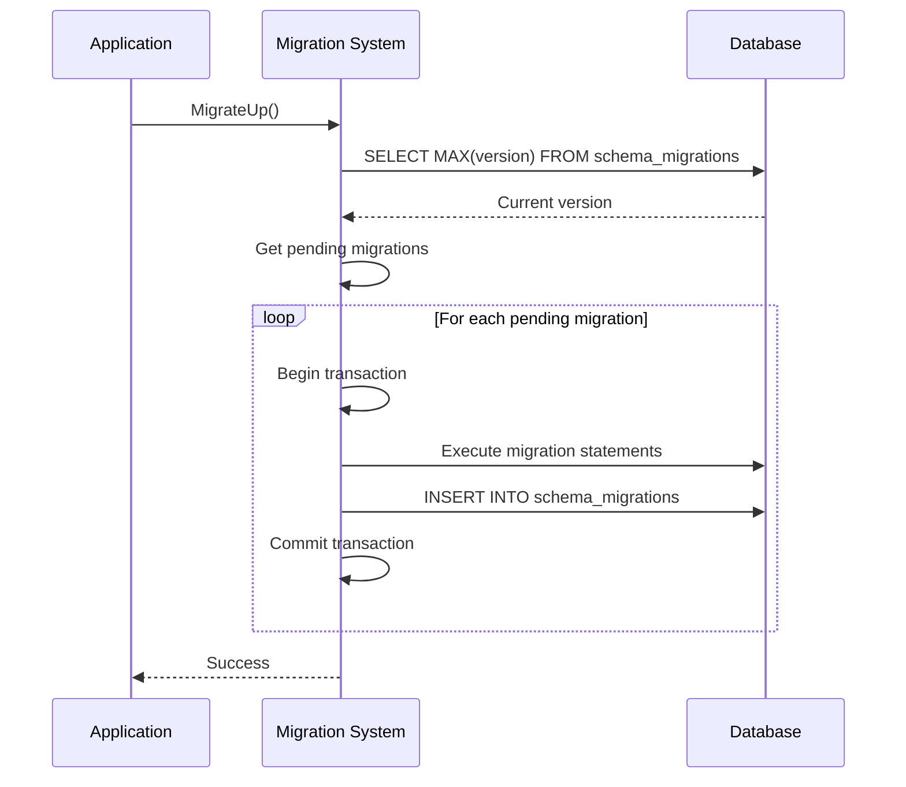
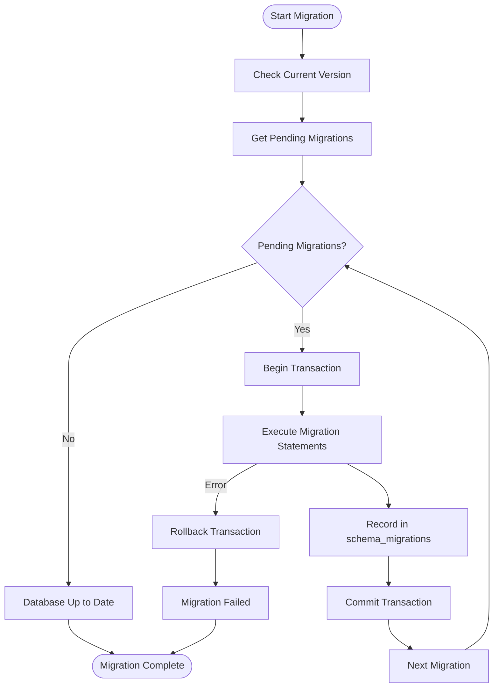
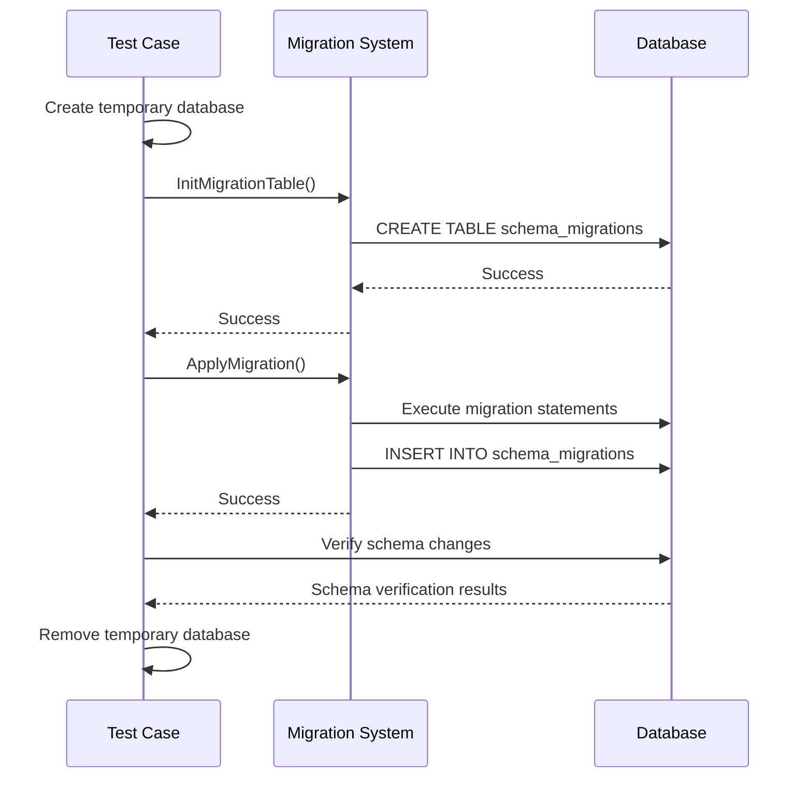
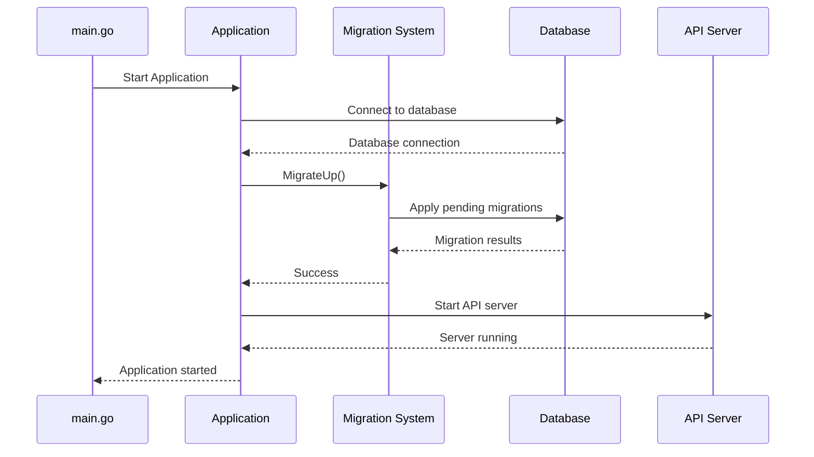
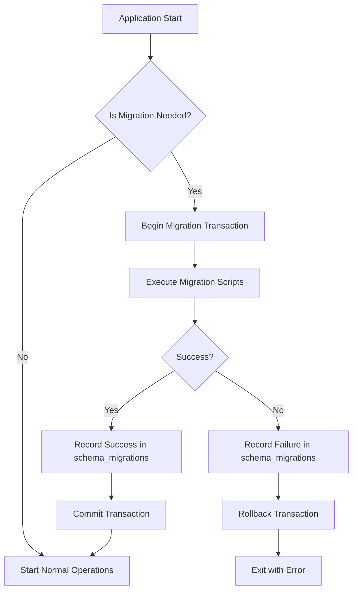

# Schema Migrations


## Table of Contents
1. [Introduction](#introduction)
2. [Migration Registry and Tracking](#migration-registry-and-tracking)
3. [Migration Execution Process](#migration-execution-process)
4. [Idempotency and Safety Guarantees](#idempotency-and-safety-guarantees)
5. [Adding New Migrations](#adding-new-migrations)
6. [Testing Migration Scenarios](#testing-migration-scenarios)
7. [Handling Migration Failures](#handling-migration-failures)
8. [Example Migration Scripts](#example-migration-scripts)
9. [Automatic Migration Application](#automatic-migration-application)
10. [Safety Mechanisms for Concurrent Execution](#safety-mechanisms-for-concurrent-execution)

## Introduction
The exim-pilot database migration system provides a robust mechanism for evolving the database schema safely across deployments. The system uses a versioned migration approach with sequential scripts to ensure consistent schema changes across different environments. This documentation details the architecture, implementation, and operational aspects of the migration system, including how migrations are tracked, executed, and managed throughout the application lifecycle.

## Migration Registry and Tracking
The migration system maintains a registry of all available migrations through the `GetMigrations()` function, which returns a predefined list of `Migration` structs ordered by version number. Each migration includes a version number, description, "up" script for applying the migration, and "down" script for rolling it back.

Migration execution status is tracked in the `schema_migrations` table, which records which migrations have been successfully applied to the database. This table serves as the source of truth for the current database version and ensures that migrations are not reapplied.





**Diagram sources**
- [migrations.go](file://internal/database/migrations.go#L590-L598)

**Section sources**
- [migrations.go](file://internal/database/migrations.go#L15-L732)

## Migration Execution Process
The migration system provides several functions for executing migrations:

- `MigrateUp(db *DB)`: Applies all pending migrations to bring the database to the latest version
- `MigrateDown(db *DB)`: Rolls back the last applied migration
- `MigrateToVersion(db *DB, targetVersion int)`: Migrates to a specific version, either up or down

When applying migrations, the system follows a sequential process:
1. Check the current database version by querying the `schema_migrations` table
2. Identify pending migrations that have not been applied
3. Apply each migration in version order within a database transaction
4. Record successful application in the `schema_migrations` table





**Diagram sources**
- [migrations.go](file://internal/database/migrations.go#L387-L441)
- [migrations.go](file://internal/database/migrations.go#L622-L654)

**Section sources**
- [migrations.go](file://internal/database/migrations.go#L387-L441)

## Idempotency and Safety Guarantees
The migration system provides idempotency guarantees by tracking applied migrations in the `schema_migrations` table. Before applying a migration, the system checks the current version and only applies migrations with a higher version number. This ensures that migrations are never reapplied, making the migration process idempotent.

Each migration is executed within a database transaction, providing atomicity - either all statements in a migration succeed, or the entire migration is rolled back. This prevents partial schema changes that could leave the database in an inconsistent state.

The system also validates migrations before execution, checking for:
- Duplicate version numbers
- Empty "up" scripts
- Version gaps in the migration sequence





**Diagram sources**
- [migrations.go](file://internal/database/migrations.go#L622-L654)
- [migrations.go](file://internal/database/migrations.go#L442-L485)

**Section sources**
- [migrations.go](file://internal/database/migrations.go#L442-L485)

## Adding New Migrations
To add a new migration, developers must modify the `GetMigrations()` function in `migrations.go` to include the new migration with a sequential version number. Each migration should include:

- A unique version number (sequential from 1)
- A descriptive name
- SQL statements in the "up" field to apply the migration
- SQL statements in the "down" field to roll back the migration

The system validates that migration versions are sequential and without gaps. The `CreateMigration(description string)` function can be used to generate a new migration template with the next available version number.


```go
// Example of adding a new migration
{
    Version:     7,
    Description: "Add email templates table",
    Up: `
CREATE TABLE IF NOT EXISTS email_templates (
    id INTEGER PRIMARY KEY AUTOINCREMENT,
    name TEXT NOT NULL,
    subject TEXT NOT NULL,
    body TEXT NOT NULL,
    created_at DATETIME DEFAULT CURRENT_TIMESTAMP,
    updated_at DATETIME DEFAULT CURRENT_TIMESTAMP
);
CREATE INDEX IF NOT EXISTS idx_email_templates_name ON email_templates(name);
`,
    Down: `
DROP INDEX IF EXISTS idx_email_templates_name;
DROP TABLE IF EXISTS email_templates;
`,
}
```


**Section sources**
- [migrations.go](file://internal/database/migrations.go#L649-L697)

## Testing Migration Scenarios
The migration system includes comprehensive tests in `migrations_test.go` that verify the correct behavior of migration operations. These tests cover:

- Initialization of the migration tracking table
- Application of individual migrations
- Execution of multiple migrations in sequence
- Database initialization with all migrations

The tests use temporary database files to isolate test execution and ensure that each test starts with a clean state. Test cases verify that migrations are properly recorded in the `schema_migrations` table and that the expected database schema changes are applied.





**Diagram sources**
- [migrations_test.go](file://internal/database/migrations_test.go#L0-L190)

**Section sources**
- [migrations_test.go](file://internal/database/migrations_test.go#L0-L190)

## Handling Migration Failures
The migration system includes robust error handling to manage migration failures safely. When a migration fails:

1. The system records the failure in the `schema_migrations` table with `success = FALSE`
2. The database transaction is rolled back, ensuring no partial changes are committed
3. An error is returned with detailed information about the failure

This approach allows operators to diagnose migration issues and decide whether to fix the migration and retry, or roll back to a previous version. The record of failed migrations in the database helps prevent repeated attempts to apply the same failing migration.


```go
// In applyMigration function
if _, err := tx.Exec(stmt); err != nil {
    // Record failed migration
    tx.Exec("INSERT INTO schema_migrations (version, success) VALUES (?, FALSE)", migration.Version)
    return fmt.Errorf("failed to execute migration statement: %w", err)
}
```


**Section sources**
- [migrations.go](file://internal/database/migrations.go#L633-L636)

## Example Migration Scripts
The migration system includes several example migrations that demonstrate common use cases:

### Adding Indexes for Performance Optimization
Migration version 2 adds indexes to improve query performance across various tables:


```sql
-- Indexes for messages table
CREATE INDEX IF NOT EXISTS idx_messages_timestamp ON messages(timestamp);
CREATE INDEX IF NOT EXISTS idx_messages_status ON messages(status);
CREATE INDEX IF NOT EXISTS idx_messages_sender ON messages(sender);

-- Indexes for recipients table
CREATE INDEX IF NOT EXISTS idx_recipients_message_id ON recipients(message_id);
CREATE INDEX IF NOT EXISTS idx_recipients_status ON recipients(status);
```


### Modifying Table Structures for New Features
Migration version 3 adds tables for message notes and tags to support troubleshooting:


```sql
-- Message notes table for operator notes
CREATE TABLE IF NOT EXISTS message_notes (
    id INTEGER PRIMARY KEY AUTOINCREMENT,
    message_id TEXT NOT NULL,
    user_id INTEGER NOT NULL,
    note TEXT NOT NULL,
    created_at DATETIME DEFAULT CURRENT_TIMESTAMP,
    FOREIGN KEY (message_id) REFERENCES messages(id),
    FOREIGN KEY (user_id) REFERENCES users(id)
);

-- Message tags table for categorization
CREATE TABLE IF NOT EXISTS message_tags (
    id INTEGER PRIMARY KEY AUTOINCREMENT,
    message_id TEXT NOT NULL,
    tag TEXT NOT NULL,
    user_id INTEGER NOT NULL,
    created_at DATETIME DEFAULT CURRENT_TIMESTAMP,
    FOREIGN KEY (message_id) REFERENCES messages(id),
    FOREIGN KEY (user_id) REFERENCES users(id)
);
```


**Section sources**
- [migrations.go](file://internal/database/migrations.go#L15-L732)

## Automatic Migration Application
Migrations are automatically applied during application startup in the main application entry point. When the `exim-pilot` service starts, it connects to the database and calls `database.MigrateUp(db)` to ensure the database schema is up to date before starting the API server.

The application also supports command-line flags to run migrations manually:
- `-migrate-up`: Run pending migrations and exit
- `-migrate-down`: Roll back the last migration and exit





**Diagram sources**
- [main.go](file://cmd/exim-pilot/main.go#L0-L199)

**Section sources**
- [main.go](file://cmd/exim-pilot/main.go#L0-L199)

## Safety Mechanisms for Concurrent Execution
The migration system prevents concurrent migration execution through several mechanisms:

1. **Database Transactions**: Each migration is executed within a transaction, ensuring atomicity and preventing partial schema changes.

2. **Sequential Execution**: Migrations are applied one at a time in version order, preventing race conditions between migrations.

3. **Application-Level Coordination**: Since migrations are typically run during application startup or through dedicated CLI commands, the design assumes that only one process will be responsible for migrations at a time.

4. **Version Tracking**: The `schema_migrations` table serves as a coordination point, with each migration recording its version upon successful completion.

While the current implementation doesn't include explicit locking mechanisms to prevent multiple processes from attempting migrations simultaneously, the typical deployment pattern (where migrations are run as part of deployment scripts or application startup) naturally prevents concurrent execution. For environments where multiple instances might start simultaneously, external coordination (such as leader election in Kubernetes) should be used to ensure only one instance runs migrations.





**Diagram sources**
- [migrations.go](file://internal/database/migrations.go#L622-L654)

**Section sources**
- [migrations.go](file://internal/database/migrations.go#L622-L654)

**Referenced Files in This Document**   
- [migrations.go](file://internal/database/migrations.go)
- [migrations_test.go](file://internal/database/migrations_test.go)
- [main.go](file://cmd/exim-pilot/main.go)
- [main.go](file://cmd/exim-pilot-config/main.go)