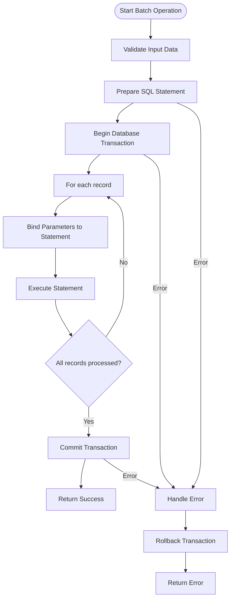
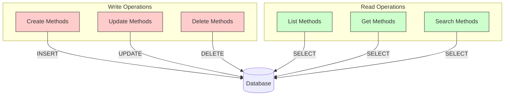

# Repository Implementation


## Table of Contents
1. [Introduction](#introduction)
2. [Repository Interface and Architecture](#repository-interface-and-architecture)
3. [CRUD Operations](#crud-operations)
4. [Query Composition and Security](#query-composition-and-security)
5. [Pagination and Large Dataset Handling](#pagination-and-large-dataset-handling)
6. [Performance Optimization Techniques](#performance-optimization-techniques)
7. [Service Layer Integration](#service-layer-integration)
8. [Testing and Mocking Strategy](#testing-and-mocking-strategy)
9. [Conclusion](#conclusion)

## Introduction
The repository pattern in exim-pilot provides a clean abstraction layer between the application's business logic and the underlying database persistence mechanism. This implementation enables decoupling of domain logic from data access concerns, promoting testability, maintainability, and flexibility in database interactions. The repository interface encapsulates all database operations for core entities including messages, recipients, delivery attempts, and logs, providing a consistent API for data manipulation while implementing robust security and performance practices.

## Repository Interface and Architecture

The repository architecture in exim-pilot follows a hierarchical composition pattern where a base Repository struct provides fundamental database operations, and specialized repositories (MessageRepository, RecipientRepository, etc.) embed this base to inherit common functionality while adding entity-specific methods.


```mermaid
classDiagram
class Repository {
+GetDB() *DB
+CreateLogEntry(ctx Context, entry *LogEntry) error
+CreateQueueSnapshot(snapshot *QueueSnapshot) error
+CreateAuditLog(entry *AuditLog) error
+GetAuditLogs(filters interface{}) ([]*AuditLog, error)
}
class MessageRepository {
+Create(msg *Message) error
+GetByID(id string) (*Message, error)
+Update(msg *Message) error
+Delete(id string) error
+List(limit, offset int, status string) ([]Message, error)
+Count(status string) (int, error)
}
class RecipientRepository {
+Create(recipient *Recipient) error
+GetByMessageID(messageID string) ([]Recipient, error)
+Update(recipient *Recipient) error
}
class DeliveryAttemptRepository {
+Create(attempt *DeliveryAttempt) error
+GetByMessageID(messageID string) ([]DeliveryAttempt, error)
}
class LogEntryRepository {
+Create(entry *LogEntry) error
+GetByMessageID(messageID string) ([]LogEntry, error)
+List(limit, offset int, logType, event string, startTime, endTime *time.Time) ([]LogEntry, error)
}
class AuditLogRepository {
+Create(entry *AuditLog) error
+List(limit, offset int, action, userID string) ([]AuditLog, error)
}
class QueueSnapshotRepository {
+Create(snapshot *QueueSnapshot) error
+GetLatest() (*QueueSnapshot, error)
+List(limit, offset int, startTime, endTime *time.Time) ([]QueueSnapshot, error)
+DeleteOlderThan(cutoff time.Time) (int64, error)
}
Repository <|-- MessageRepository
Repository <|-- RecipientRepository
Repository <|-- DeliveryAttemptRepository
Repository <|-- LogEntryRepository
Repository <|-- AuditLogRepository
Repository <|-- QueueSnapshotRepository
```


**Diagram sources**
- [repository.go](file://internal/database/repository.go#L25-L1056)

**Section sources**
- [repository.go](file://internal/database/repository.go#L25-L1056)
- [models.go](file://internal/database/models.go#L10-L200)

## CRUD Operations

The repository implementation provides comprehensive CRUD (Create, Read, Update, Delete) operations for all core entities in the system. Each entity has a dedicated repository that inherits from the base Repository struct, ensuring consistent behavior across all data access operations.

### Message Operations
The MessageRepository handles all operations related to email messages in the system:


```go
// Create inserts a new message into the database
func (r *MessageRepository) Create(msg *Message) error {
    query := `
        INSERT INTO messages (id, timestamp, sender, size, status, created_at, updated_at)
        VALUES (?, ?, ?, ?, ?, ?, ?)`
    
    now := time.Now()
    msg.CreatedAt = now
    msg.UpdatedAt = now
    
    _, err := r.db.Exec(query, msg.ID, msg.Timestamp, msg.Sender, msg.Size, 
                       msg.Status, msg.CreatedAt, msg.UpdatedAt)
    return err
}

// GetByID retrieves a message by its unique identifier
func (r *MessageRepository) GetByID(id string) (*Message, error) {
    query := `
        SELECT id, timestamp, sender, size, status, created_at, updated_at
        FROM messages WHERE id = ?`
    
    msg := &Message{}
    err := r.db.QueryRow(query, id).Scan(
        &msg.ID, &msg.Timestamp, &msg.Sender, &msg.Size, 
        &msg.Status, &msg.CreatedAt, &msg.UpdatedAt)
    
    if err == sql.ErrNoRows {
        return nil, nil
    }
    return msg, err
}
```


### Recipient Operations
The RecipientRepository manages message recipients with operations focused on message correlation:


```go
// Create inserts a new recipient record
func (r *RecipientRepository) Create(recipient *Recipient) error {
    query := `
        INSERT INTO recipients (message_id, address, status, delivery_attempts, 
                               last_attempt, created_at, updated_at)
        VALUES (?, ?, ?, ?, ?, ?, ?)`
    
    now := time.Now()
    recipient.CreatedAt = now
    recipient.UpdatedAt = now
    
    _, err := r.db.Exec(query, recipient.MessageID, recipient.Address, 
                       recipient.Status, recipient.DeliveryAttempts,
                       recipient.LastAttempt, recipient.CreatedAt, recipient.UpdatedAt)
    return err
}

// GetByMessageID retrieves all recipients for a specific message
func (r *RecipientRepository) GetByMessageID(messageID string) ([]Recipient, error) {
    query := `
        SELECT message_id, address, status, delivery_attempts, 
               last_attempt, created_at, updated_at
        FROM recipients WHERE message_id = ?`
    
    rows, err := r.db.Query(query, messageID)
    if err != nil {
        return nil, err
    }
    defer rows.Close()
    
    var recipients []Recipient
    for rows.Next() {
        var recipient Recipient
        err := rows.Scan(&recipient.MessageID, &recipient.Address, 
                        &recipient.Status, &recipient.DeliveryAttempts,
                        &recipient.LastAttempt, &recipient.CreatedAt, &recipient.UpdatedAt)
        if err != nil {
            return nil, err
        }
        recipients = append(recipients, recipient)
    }
    
    return recipients, rows.Err()
}
```


### Log Entry Operations
The LogEntryRepository handles system log entries with time-based querying capabilities:


```go
// Create inserts a new log entry
func (r *LogEntryRepository) Create(entry *LogEntry) error {
    query := `
        INSERT INTO log_entries (message_id, log_type, event, timestamp, 
                                description, data, created_at)
        VALUES (?, ?, ?, ?, ?, ?, ?)`
    
    now := time.Now()
    entry.CreatedAt = now
    
    result, err := r.db.Exec(query, entry.MessageID, entry.LogType, entry.Event,
                            entry.Timestamp, entry.Description, entry.Data, entry.CreatedAt)
    if err != nil {
        return err
    }
    
    id, err := result.LastInsertId()
    if err != nil {
        return err
    }
    
    entry.ID = id
    return nil
}

// List retrieves log entries with filtering and pagination
func (r *LogEntryRepository) List(limit, offset int, logType, event string, 
                                startTime, endTime *time.Time) ([]LogEntry, error) {
    query := `SELECT id, message_id, log_type, event, timestamp, description, data, created_at 
              FROM log_entries`
    
    // Build WHERE clause based on filters
    var conditions []string
    var args []interface{}
    
    if logType != "" {
        conditions = append(conditions, "log_type = ?")
        args = append(args, logType)
    }
    
    if event != "" {
        conditions = append(conditions, "event = ?")
        args = append(args, event)
    }
    
    if startTime != nil {
        conditions = append(conditions, "timestamp >= ?")
        args = append(args, startTime)
    }
    
    if endTime != nil {
        conditions = append(conditions, "timestamp <= ?")
        args = append(args, endTime)
    }
    
    if len(conditions) > 0 {
        query += " WHERE " + strings.Join(conditions, " AND ")
    }
    
    query += " ORDER BY timestamp DESC LIMIT ? OFFSET ?"
    args = append(args, limit, offset)
    
    rows, err := r.db.Query(query, args...)
    if err != nil {
        return nil, err
    }
    defer rows.Close()
    
    var entries []LogEntry
    for rows.Next() {
        var entry LogEntry
        err := rows.Scan(&entry.ID, &entry.MessageID, &entry.LogType, &entry.Event,
                        &entry.Timestamp, &entry.Description, &entry.Data, &entry.CreatedAt)
        if err != nil {
            return nil, err
        }
        entries = append(entries, entry)
    }
    
    return entries, rows.Err()
}
```


**Section sources**
- [repository.go](file://internal/database/repository.go#L75-L487)

## Query Composition and Security

The repository implementation employs parameterized queries to prevent SQL injection attacks and ensure data integrity. All user inputs are properly parameterized using the database driver's placeholder system.

### Parameterized Query Pattern
The repository consistently uses parameterized queries with placeholders (`?`) instead of string concatenation:


```go
// Example of parameterized query for message search
func (r *MessageRepository) Search(query string, limit, offset int) ([]Message, error) {
    sql := `SELECT id, timestamp, sender, size, status, created_at, updated_at 
            FROM messages 
            WHERE sender LIKE ? OR id = ?
            ORDER BY timestamp DESC 
            LIMIT ? OFFSET ?`
    
    searchParam := "%" + query + "%"
    rows, err := r.db.Query(sql, searchParam, query, limit, offset)
    // ... process results
}
```


This approach ensures that user input is properly escaped and treated as data rather than executable SQL code, effectively preventing SQL injection vulnerabilities.

### Query Composition Strategy
The repository uses a programmatic approach to build dynamic queries based on provided filters:


```go
// Example of dynamic query composition for log search
func buildLogQuery(filters LogFilters) (string, []interface{}) {
    baseQuery := "SELECT * FROM log_entries"
    var conditions []string
    var args []interface{}
    
    if filters.MessageID != "" {
        conditions = append(conditions, "message_id = ?")
        args = append(args, filters.MessageID)
    }
    
    if filters.LogType != "" {
        conditions = append(conditions, "log_type = ?")
        args = append(args, filters.LogType)
    }
    
    if !filters.StartTime.IsZero() {
        conditions = append(conditions, "timestamp >= ?")
        args = append(args, filters.StartTime)
    }
    
    if !filters.EndTime.IsZero() {
        conditions = append(conditions, "timestamp <= ?")
        args = append(args, filters.EndTime)
    }
    
    if len(conditions) > 0 {
        baseQuery += " WHERE " + strings.Join(conditions, " AND ")
    }
    
    baseQuery += " ORDER BY timestamp DESC LIMIT ? OFFSET ?"
    args = append(args, filters.Limit, filters.Offset)
    
    return baseQuery, args
}
```


This pattern allows for flexible querying while maintaining security through parameterization.

**Section sources**
- [repository.go](file://internal/database/repository.go#L416-L486)
- [api.go](file://internal/api/server.go#L202-L224)

## Pagination and Large Dataset Handling

The repository implementation includes robust pagination mechanisms to handle large datasets efficiently, preventing memory issues and ensuring responsive user interfaces.

### Server-Side Pagination
The repository methods accept limit and offset parameters for pagination:


```go
// List method with pagination parameters
func (r *LogEntryRepository) List(limit, offset int, logType, event string, 
                                startTime, endTime *time.Time) ([]LogEntry, error) {
    // Query construction with LIMIT and OFFSET
    query += " ORDER BY timestamp DESC LIMIT ? OFFSET ?"
    args = append(args, limit, offset)
    
    rows, err := r.db.Query(query, args...)
    // ... process results
}
```


### API-Level Pagination Handling
The API layer processes pagination parameters from HTTP requests and converts them to repository method calls:


```go
// GetPaginationParams extracts pagination parameters from query string
func GetPaginationParams(r *http.Request) (page, perPage int, err error) {
    page, err = GetQueryParamInt(r, "page", 1)
    if err != nil {
        return 0, 0, err
    }

    if page < 1 {
        page = 1
    }

    perPage, err = GetQueryParamInt(r, "per_page", 50)
    if err != nil {
        return 0, 0, err
    }

    // Limit per_page to reasonable bounds
    if perPage < 1 {
        perPage = 50
    } else if perPage > 1000 {
        perPage = 1000
    }

    return page, perPage, nil
}

// CalculatePagination calculates pagination metadata
func CalculatePagination(page, perPage, total int) *Meta {
    totalPages := (total + perPage - 1) / perPage // Ceiling division

    return &Meta{
        Page:       page,
        PerPage:    perPage,
        Total:      total,
        TotalPages: totalPages,
    }
}
```


### Client-Side Implementation
The frontend implements lazy loading using a custom React hook that handles pagination automatically:


```typescript
// Custom hook for lazy loading with infinite scroll
export function useLazyLoading<T>(
  fetchFunction: (page: number, pageSize: number) => Promise<{
    data: T[];
    total: number;
    hasMore: boolean;
  }>,
  config: LazyLoadingConfig
): LazyLoadingReturn<T> {
  const loadMore = useCallback(async () => {
    if (loadingRef.current || !state.hasMore) {
      return;
    }

    loadingRef.current = true;
    setState(prev => ({ ...prev, loading: true, error: null }));

    try {
      const result = await fetchFunction(state.currentPage, configRef.current.initialPageSize);
      
      setState(prev => ({
        ...prev,
        items: [...prev.items, ...result.data],
        currentPage: prev.currentPage + 1,
        totalItems: result.total,
        hasMore: result.hasMore,
        loading: false,
      }));
    } catch (error) {
      // Error handling
    } finally {
      loadingRef.current = false;
    }
  }, [state.currentPage, state.hasMore, fetchFunction]);
}
```


This implementation ensures that large datasets are loaded incrementally, improving performance and user experience.

**Section sources**
- [repository.go](file://internal/database/repository.go#L416-L486)
- [utils.go](file://internal/api/utils.go#L50-L103)
- [useLazyLoading.ts](file://web/src/hooks/useLazyLoading.ts#L0-L159)

## Performance Optimization Techniques

The repository implementation incorporates several performance optimization techniques to ensure efficient database operations and optimal system responsiveness.

### Batch Operations
The system supports batch operations for improved performance when handling multiple records:





### Prepared Statement Caching
While the current implementation doesn't explicitly show prepared statement caching, the underlying database driver (likely SQLite or PostgreSQL) typically handles statement preparation and caching automatically. The use of parameterized queries enables the database to cache execution plans for frequently used queries.

### Read/Write Query Separation
The architecture implicitly separates read and write operations through distinct method implementations:





This separation allows for potential optimization strategies such as directing read queries to replica databases and write queries to the primary database, although this specific implementation appears to use a single database instance.

### Query Optimization
The system includes query optimization features through the performance handlers:


```go
// OptimizeQueries provides query optimization hints
func (s *OptimizationService) OptimizeQueries() *QueryOptimizationHints {
    return &QueryOptimizationHints{
        LogSearchQueries: []string{
            "SELECT * FROM log_entries WHERE timestamp BETWEEN ? AND ? ORDER BY timestamp DESC LIMIT ?",
            "SELECT * FROM log_entries WHERE log_type = ? AND timestamp BETWEEN ? AND ? ORDER BY timestamp DESC LIMIT ?",
            "SELECT * FROM log_entries WHERE message_id = ? ORDER BY timestamp ASC",
        },
        QueueQueries: []string{
            "SELECT * FROM messages WHERE status IN (?, ?, ?) ORDER BY timestamp DESC LIMIT ?",
            "SELECT * FROM messages WHERE sender LIKE ? AND status = ? ORDER BY timestamp DESC LIMIT ?",
        },
    }
}
```


These optimization hints suggest the use of appropriate indexes on timestamp, log_type, message_id, and status columns to improve query performance.

**Section sources**
- [repository.go](file://internal/database/repository.go#L30-L653)
- [optimization.go](file://internal/database/optimization.go#L209-L243)
- [performance_handlers.go](file://internal/api/performance_handlers.go#L106-L143)

## Service Layer Integration

The service layer consumes the repository interface to implement business logic while remaining decoupled from the specific database implementation.

### Service Layer Example
Services use the repository interface to perform data operations:


```go
// Example service that uses the repository
type LogService struct {
    repository *database.Repository
}

func NewLogService(repo *database.Repository) *LogService {
    return &LogService{repository: repo}
}

func (s *LogService) SearchLogs(ctx context.Context, criteria logprocessor.SearchCriteria) (*logprocessor.SearchResult, error) {
    // Business logic before data access
    if criteria.Limit == 0 {
        criteria.Limit = 50
    }
    
    if criteria.Limit > 1000 {
        criteria.Limit = 1000
    }
    
    // Delegate to repository for data access
    entries, err := s.repository.LogEntryRepository.List(
        criteria.Limit, criteria.Offset,
        criteria.LogType, criteria.Event,
        criteria.StartTime, criteria.EndTime,
    )
    
    if err != nil {
        return nil, fmt.Errorf("failed to search logs: %w", err)
    }
    
    // Business logic after data access
    result := &logprocessor.SearchResult{
        Entries: entries,
        Total:   len(entries),
        HasMore: len(entries) == criteria.Limit,
    }
    
    return result, nil
}
```


### Transaction Management
The service layer can manage transactions across multiple repository operations:


```go
// TxManager provides transaction management utilities
type TxManager struct {
    db *DB
}

// WithTransaction executes a function within a database transaction
func (tm *TxManager) WithTransaction(fn func(*sql.Tx) error) error {
    tx, err := tm.db.BeginTx()
    if err != nil {
        return fmt.Errorf("failed to begin transaction: %w", err)
    }

    defer func() {
        if p := recover(); p != nil {
            tx.Rollback()
            panic(p)
        }
    }()

    if err := fn(tx); err != nil {
        if rbErr := tx.Rollback(); rbErr != nil {
            return fmt.Errorf("transaction error: %v, rollback error: %v", err, rbErr)
        }
        return err
    }

    if err := tx.Commit(); err != nil {
        return fmt.Errorf("failed to commit transaction: %w", err)
    }

    return nil
}
```


This pattern allows services to coordinate multiple repository operations within a single transaction, ensuring data consistency.

**Section sources**
- [repository.go](file://internal/database/repository.go#L49-L95)
- [transaction.go](file://internal/database/transaction.go#L0-L56)

## Testing and Mocking Strategy

The repository pattern facilitates effective unit testing by allowing easy mocking of data access operations.

### Repository Mocking
Unit tests can mock the repository interface to test service logic in isolation:


```go
// Example test with mocked repository
func TestLogService_SearchLogs(t *testing.T) {
    // Create a mock repository
    mockRepo := &MockRepository{
        LogEntries: []*database.LogEntry{
            {ID: 1, MessageID: "msg1", LogType: "main", Event: "arrival"},
            {ID: 2, MessageID: "msg1", LogType: "main", Event: "delivery"},
        },
    }
    
    service := NewLogService(mockRepo)
    
    // Test the service logic
    criteria := logprocessor.SearchCriteria{
        MessageID: "msg1",
        Limit:     10,
    }
    
    result, err := service.SearchLogs(context.Background(), criteria)
    
    // Assert expectations
    assert.NoError(t, err)
    assert.Equal(t, 2, len(result.Entries))
    assert.Equal(t, "arrival", result.Entries[0].Event)
}
```


### Integration Testing
The system includes performance tests that validate repository operations with real database interactions:


```go
// TestConcurrentOperations tests concurrent database operations
func TestConcurrentOperations(t *testing.T) {
    db, cleanup := setupTestDatabase(t)
    defer cleanup()

    repository := database.NewRepository(db)
    ctx := context.Background()

    // Test concurrent inserts
    t.Run("ConcurrentInserts", func(t *testing.T) {
        numWorkers := 10
        entriesPerWorker := 100

        done := make(chan error, numWorkers)

        for i := 0; i < numWorkers; i++ {
            go func(workerID int) {
                entries := generateSampleLogEntries(entriesPerWorker)
                for _, entry := range entries {
                    if err := repository.CreateLogEntry(ctx, entry); err != nil {
                        done <- fmt.Errorf("worker %d failed: %v", workerID, err)
                        return
                    }
                }
                done <- nil
            }(i)
        }

        // Wait for all workers to complete
        for i := 0; i < numWorkers; i++ {
            if err := <-done; err != nil {
                t.Fatalf("Concurrent insert failed: %v", err)
            }
        }
    })
}
```


This testing strategy ensures both the correctness of business logic (through unit tests with mocks) and the performance and reliability of database operations (through integration tests).

**Section sources**
- [repository.go](file://internal/database/repository.go#L30-L35)
- [transaction.go](file://internal/database/transaction.go#L130-L150)
- [performance_test.go](file://tests/performance/performance_test.go#L231-L415)

## Conclusion
The repository implementation in exim-pilot provides a robust, secure, and performant abstraction layer for database operations. By following the repository pattern, the system achieves clear separation of concerns between business logic and data access, enabling easier testing, maintenance, and evolution of the codebase. The implementation includes comprehensive CRUD operations for all core entities, employs parameterized queries to prevent SQL injection, implements efficient pagination for large datasets, and incorporates various performance optimization techniques. The design allows for easy mocking in unit tests while supporting complex transactional operations in the service layer, making it a well-rounded solution for the application's data persistence needs.

**Referenced Files in This Document**   
- [repository.go](file://internal/database/repository.go#L25-L1056)
- [connection.go](file://internal/database/connection.go#L15-L80)
- [models.go](file://internal/database/models.go#L10-L200)
- [optimization.go](file://internal/database/optimization.go#L209-L243)
- [transaction.go](file://internal/database/transaction.go#L0-L150)
- [api.go](file://internal/api/server.go#L202-L224)
- [utils.go](file://internal/api/utils.go#L50-L103)