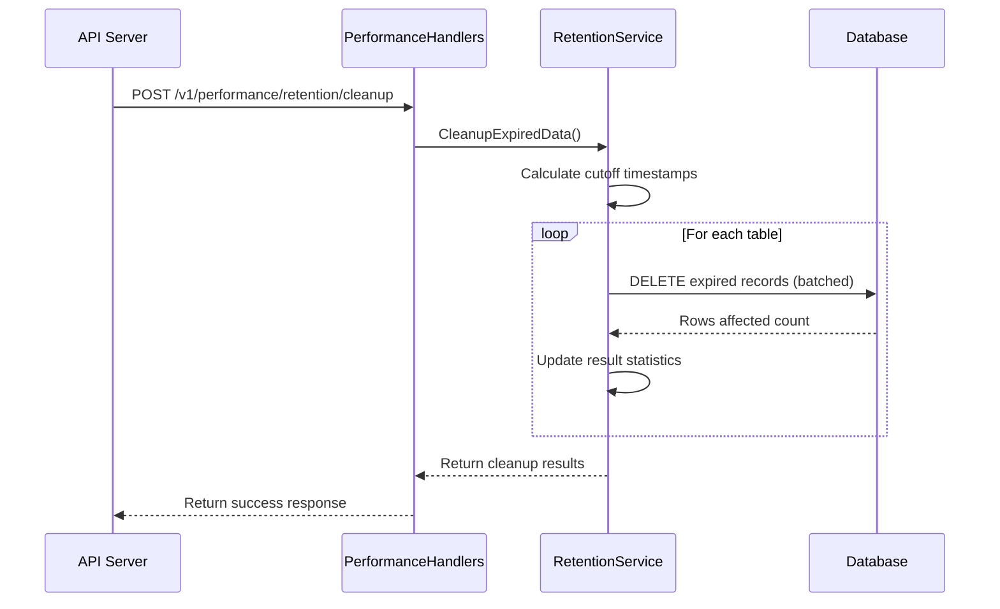
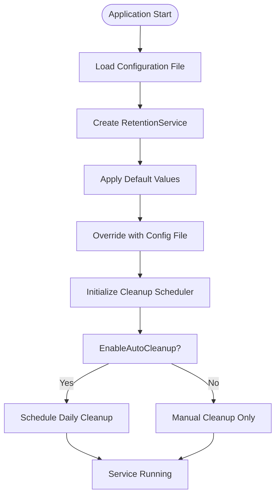

# Data Retention


## Table of Contents
1. [Data Retention Policies](#data-retention-policies)
2. [Background Cleanup Process](#background-cleanup-process)
3. [Configuration Options](#configuration-options)
4. [Database Impact and Performance](#database-impact-and-performance)
5. [Deletion Safety and Transactions](#deletion-safety-and-transactions)
6. [Monitoring and Alerts](#monitoring-and-alerts)

## Data Retention Policies

The exim-pilot system implements time-based retention policies to manage the lifecycle of various data types. These policies ensure that historical data is preserved for operational and compliance purposes while preventing unbounded database growth.

The retention policies are defined in the `RetentionConfig` structure within the database package and apply to the following data types:

- **Messages**: Message metadata and content are retained based on log entry policies
- **Delivery Attempts**: Records of delivery attempts are preserved for delivery analysis
- **Log Entries**: System and message processing logs are maintained for troubleshooting
- **Audit Logs**: Security and administrative actions are logged for compliance

The default retention periods are configured as follows:


```go
// DefaultRetentionConfig returns the default retention configuration
func DefaultRetentionConfig() RetentionConfig {
	return RetentionConfig{
		LogEntriesRetentionDays:     90,  // 3 months
		AuditLogRetentionDays:       180, // 6 months
		QueueSnapshotsRetentionDays: 30,  // 1 month
		DeliveryAttemptsRetentionDays: 90, // 3 months
		SessionsRetentionDays:         7,   // 1 week
		EnableAutoCleanup:             true,
		CleanupBatchSize:              1000,
		CleanupIntervalHours:          24, // Daily cleanup
	}
}
```


These policies are enforced by comparing the timestamp of each record against the current time minus the retention period. Records older than the retention threshold are considered expired and eligible for removal.

**Section sources**
- [retention.go](file://internal/database/retention.go#L20-L40)

## Background Cleanup Process

The background cleanup process is responsible for periodically removing expired records to manage database size. This process is automatically initialized when the application starts and runs according to the configured schedule.

The cleanup process operates through the `RetentionService` which is created with the database connection and retention configuration. The service is instantiated in the `NewPerformanceHandlers` function, which is called during server initialization:


```go
// NewPerformanceHandlers creates a new performance handlers instance
func NewPerformanceHandlers(db *database.DB) *PerformanceHandlers {
	return &PerformanceHandlers{
		optimizationService: database.NewOptimizationService(db),
		retentionService:    database.NewRetentionService(db, database.DefaultRetentionConfig()),
	}
}
```


The cleanup operation is triggered either automatically on a schedule or manually through API endpoints. The `CleanupExpiredData` method executes the actual deletion process:


```go
// CleanupExpiredData removes expired data based on retention policies
func (rs *RetentionService) CleanupExpiredData(ctx context.Context) (*CleanupResult, error) {
	log.Println("Starting data retention cleanup...")

	result := &CleanupResult{
		StartTime: time.Now(),
		Tables:    make(map[string]TableCleanupResult),
	}

	// Define cleanup operations
	cleanupOps := []struct {
		table         string
		retentionDays int
		timestampCol  string
		description   string
	}{
		{"log_entries", rs.config.LogEntriesRetentionDays, "timestamp", "Log entries"},
		{"audit_log", rs.config.AuditLogRetentionDays, "timestamp", "Audit log entries"},
		{"queue_snapshots", rs.config.QueueSnapshotsRetentionDays, "timestamp", "Queue snapshots"},
		{"delivery_attempts", rs.config.DeliveryAttemptsRetentionDays, "timestamp", "Delivery attempts"},
		{"sessions", rs.config.SessionsRetentionDays, "created_at", "User sessions"},
	}
```


The process iterates through each table, calculating the cutoff timestamp based on the retention period and deleting records older than this threshold in batches to minimize transaction size and memory usage.





**Diagram sources**
- [retention.go](file://internal/database/retention.go#L50-L100)
- [performance_handlers.go](file://internal/api/performance_handlers.go#L60-L70)

**Section sources**
- [retention.go](file://internal/database/retention.go#L45-L150)
- [performance_handlers.go](file://internal/api/performance_handlers.go#L15-L25)

## Configuration Options

The data retention system provides several configuration options that can be customized to meet specific operational requirements. These options are defined in the `RetentionConfig` struct and can be modified through the application configuration.

The primary configuration parameters include:

- **LogEntriesRetentionDays**: Number of days to retain log entries
- **AuditLogRetentionDays**: Number of days to retain audit log entries
- **QueueSnapshotsRetentionDays**: Number of days to retain queue snapshots
- **DeliveryAttemptsRetentionDays**: Number of days to retain delivery attempt records
- **SessionsRetentionDays**: Number of days to retain user session data
- **EnableAutoCleanup**: Flag to enable or disable automatic cleanup
- **CleanupBatchSize**: Number of records to delete in each batch
- **CleanupIntervalHours**: Interval between automatic cleanup runs

The configuration is initialized with default values but can be overridden through the application's configuration file. The system also exposes a performance configuration endpoint that allows retrieval of the current retention settings:


```go
// handlePerformanceConfig handles GET/POST /api/v1/performance/config - Get/Update performance configuration
func (h *PerformanceHandlers) handlePerformanceConfig(w http.ResponseWriter, r *http.Request) {
	switch r.Method {
	case http.MethodGet:
		// Return current performance configuration
		config := map[string]interface{}{
			"retention": database.DefaultRetentionConfig(),
			"optimization": map[string]interface{}{
				"auto_optimize_enabled": true,
				"optimization_interval": "24h",
				"vacuum_threshold":      "10%",
				"analyze_threshold":     "5%",
			},
			"caching": map[string]interface{}{
				"enabled":          true,
				"max_memory":       "100MB",
				"ttl":              "5m",
				"cleanup_interval": "1h",
			},
		}
		WriteSuccessResponse(w, config)
```


The configuration can also be accessed through the frontend interface, where administrators can view the current retention settings and manually trigger cleanup operations.





**Diagram sources**
- [retention.go](file://internal/database/retention.go#L20-L40)
- [performance_handlers.go](file://internal/api/performance_handlers.go#L180-L200)

**Section sources**
- [retention.go](file://internal/database/retention.go#L20-L40)
- [performance_handlers.go](file://internal/api/performance_handlers.go#L180-L220)

## Database Impact and Performance

The data retention system has significant implications for both disk usage and query performance. Proper configuration of retention periods is crucial for maintaining optimal system performance.

### Disk Usage Impact

The retention policies directly affect the database size, with longer retention periods resulting in larger databases. The system stores various types of data with different growth rates:

- **Log Entries**: High volume, grows rapidly with message processing
- **Audit Logs**: Moderate volume, grows with administrative activity
- **Queue Snapshots**: Moderate volume, depends on queue activity
- **Delivery Attempts**: High volume, proportional to message volume
- **Sessions**: Low volume, depends on user activity

The default configuration balances the need for historical data with database size constraints. For example, log entries are retained for 90 days while audit logs are kept for 180 days to meet compliance requirements.

### Query Performance Impact

Database size directly affects query performance, particularly for operations that involve full table scans or require index maintenance. The retention system helps maintain performance by:

1. **Reducing table sizes**: Smaller tables require less I/O for queries
2. **Improving index efficiency**: Smaller indexes fit better in memory
3. **Reducing vacuum overhead**: Fewer dead tuples to clean up
4. **Improving cache hit rates**: More relevant data fits in cache

The cleanup process is designed to minimize performance impact by:
- Processing deletions in batches to avoid long-running transactions
- Using efficient timestamp-based queries with proper indexing
- Running during off-peak hours (daily at scheduled intervals)

The system also provides performance metrics endpoints that allow monitoring of database size and retention status:


```go
// handlePerformanceMetrics handles GET /api/v1/performance/metrics - Get performance metrics
func (h *PerformanceHandlers) handlePerformanceMetrics(w http.ResponseWriter, r *http.Request) {
	// Get database stats
	dbStats, err := h.optimizationService.GetDatabaseStats(r.Context())
	if err != nil {
		WriteInternalErrorResponse(w, "Failed to retrieve performance metrics")
		return
	}

	// Get retention status
	retentionStatus, err := h.retentionService.GetRetentionStatus(r.Context())
	if err != nil {
		WriteInternalErrorResponse(w, "Failed to retrieve retention status")
		return
	}

	// Combine metrics
	metrics := map[string]interface{}{
		"database":  dbStats,
		"retention": retentionStatus,
		"system": map[string]interface{}{
			"timestamp": dbStats.Timestamp,
		},
	}
```


**Section sources**
- [performance_handlers.go](file://internal/api/performance_handlers.go#L66-L107)
- [retention.go](file://internal/database/retention.go#L100-L150)

## Deletion Safety and Transactions

The data retention system implements several safety mechanisms to ensure the integrity of deletion operations and handle foreign key constraints appropriately.

### Transactional Safety

All cleanup operations are performed within database transactions to ensure atomicity and consistency. If any part of the cleanup process fails, the entire transaction is rolled back, preventing partial deletions that could lead to data inconsistency.

The bulk purge operations are implemented with careful consideration of transaction size. Instead of deleting all expired records in a single transaction, the system processes deletions in batches:


```go
// The cleanup process uses batched deletions to prevent long-running transactions
// and excessive memory usage
const defaultCleanupBatchSize = 1000
```


This approach provides several benefits:
- Prevents transaction logs from growing too large
- Reduces lock contention on database tables
- Allows the process to be interrupted and resumed
- Minimizes the impact on other database operations

### Foreign Key Constraint Handling

The system handles foreign key constraints through cascading deletions defined in the database schema. When a parent record is deleted, related child records are automatically removed by the database:

- When message records are deleted, associated delivery attempts are cascaded
- When log entries are removed, related correlation data is cleaned up
- Session deletions automatically remove associated temporary data

The retention service processes tables in an order that respects these dependencies, starting with leaf tables and working toward parent tables when necessary. This ensures that foreign key constraints are not violated during the cleanup process.

The system also includes error handling to detect and report constraint violations:


```go
// Each table cleanup is handled separately with error reporting
for _, op := range cleanupOps {
	// Calculate cutoff time
	cutoffTime := time.Now().AddDate(0, 0, -op.retentionDays)
	
	// Execute deletion with error handling
	result, err := rs.db.ExecContext(ctx, 
		fmt.Sprintf("DELETE FROM %s WHERE %s < ?", op.table, op.timestampCol),
		cutoffTime)
	
	if err != nil {
		log.Printf("Error cleaning up %s: %v", op.description, err)
		result.Tables[op.table] = TableCleanupResult{
			DeletedRows: 0,
			Error:       err.Error(),
		}
		continue
	}
	
	// Record successful cleanup
	rowsAffected, _ := result.RowsAffected()
	result.Tables[op.table] = TableCleanupResult{
		DeletedRows: int(rowsAffected),
		Error:       "",
	}
}
```


This comprehensive error handling ensures that issues with specific tables do not prevent the cleanup of other data types.

**Section sources**
- [retention.go](file://internal/database/retention.go#L50-L150)

## Monitoring and Alerts

The system provides comprehensive monitoring capabilities for tracking retention job execution and detecting unexpected database growth.

### Retention Job Monitoring

The retention service exposes several endpoints for monitoring cleanup operations:

- **GET /v1/performance/retention/status**: Returns the current retention configuration and statistics about expired records
- **GET /v1/performance/metrics**: Provides comprehensive performance metrics including database size and retention status
- **POST /v1/performance/retention/cleanup**: Allows manual triggering of the cleanup process

The frontend interface includes a performance monitor component that displays retention status and allows administrators to initiate cleanup:


```tsx
const cleanupExpiredData = async () => {
  try {
    setCleaning(true);
    const response = await apiService.post('/v1/performance/retention/cleanup', {});
    
    if (response.success) {
      // Refresh metrics after cleanup
      await fetchMetrics();
      const result = response.data as { total_rows_deleted: number; duration: string };
      alert(`Data cleanup completed: ${result.total_rows_deleted} rows deleted in ${result.duration}`);
    } else {
      alert('Data cleanup failed: ' + (response.error || 'Unknown error'));
    }
  } catch (err) {
    alert('Data cleanup failed: ' + (err instanceof Error ? err.message : 'Unknown error'));
  } finally {
    setCleaning(false);
  }
};
```


### Alerting for Database Growth

The system should implement alerts for unexpected database growth, which could indicate issues with the retention process. Recommended monitoring metrics include:

- **Database size trends**: Monitor for abnormal growth patterns
- **Cleanup job execution**: Verify that cleanup jobs run as scheduled
- **Expired record counts**: Track the number of expired records over time
- **Cleanup duration**: Monitor for increasing cleanup times

The retention status endpoint provides the data needed for these alerts:


```go
// GetRetentionStatus returns the current retention status for all tables
func (rs *RetentionService) GetRetentionStatus(ctx context.Context) (*RetentionStatus, error) {
	status := &RetentionStatus{
		Config:     rs.config,
		TableStats: make(map[string]TableStat),
	}
	
	// Collect statistics for each table
	for _, op := range []struct {
		table         string
		retentionDays int
		timestampCol  string
	}{
		{"log_entries", rs.config.LogEntriesRetentionDays, "timestamp"},
		{"audit_log", rs.config.AuditLogRetentionDays, "timestamp"},
		{"queue_snapshots", rs.config.QueueSnapshotsRetentionDays, "timestamp"},
		{"delivery_attempts", rs.config.DeliveryAttemptsRetentionDays, "timestamp"},
		{"sessions", rs.config.SessionsRetentionDays, "created_at"},
	} {
		// Get total row count
		var totalCount int
		err := rs.db.QueryRowContext(ctx, 
			fmt.Sprintf("SELECT COUNT(*) FROM %s", op.table)).Scan(&totalCount)
		if err != nil {
			continue
		}
		
		// Get expired row count
		cutoffTime := time.Now().AddDate(0, 0, -op.retentionDays)
		var expiredCount int
		err = rs.db.QueryRowContext(ctx, 
			fmt.Sprintf("SELECT COUNT(*) FROM %s WHERE %s < ?", op.table, op.timestampCol),
			cutoffTime).Scan(&expiredCount)
		if err != nil {
			continue
		}
		
		// Get oldest and newest records
		var oldest, newest sql.NullTime
		rs.db.QueryRowContext(ctx, 
			fmt.Sprintf("SELECT MIN(%s), MAX(%s) FROM %s", op.timestampCol, op.timestampCol, op.table)).
			Scan(&oldest, &newest)
		
		status.TableStats[op.table] = TableStat{
			TableName:      op.table,
			RetentionDays:  op.retentionDays,
			TotalRows:      totalCount,
			ExpiredRows:    expiredCount,
			OldestRecord:   oldest.Time,
			NewestRecord:   newest.Time,
		}
	}
	
	return status, nil
}
```


These metrics can be integrated with external monitoring systems to generate alerts when database size exceeds thresholds or when cleanup jobs fail to execute.

**Section sources**
- [retention.go](file://internal/database/retention.go#L150-L250)
- [PerformanceMonitor.tsx](file://web/src/components/Performance/PerformanceMonitor.tsx#L43-L85)
- [performance_handlers.go](file://internal/api/performance_handlers.go#L36-L50)

**Referenced Files in This Document**   
- [retention.go](file://internal/database/retention.go)
- [performance_handlers.go](file://internal/api/performance_handlers.go)
- [server.go](file://internal/api/server.go)
- [main.go](file://cmd/exim-pilot/main.go)
- [PerformanceMonitor.tsx](file://web/src/components/Performance/PerformanceMonitor.tsx)