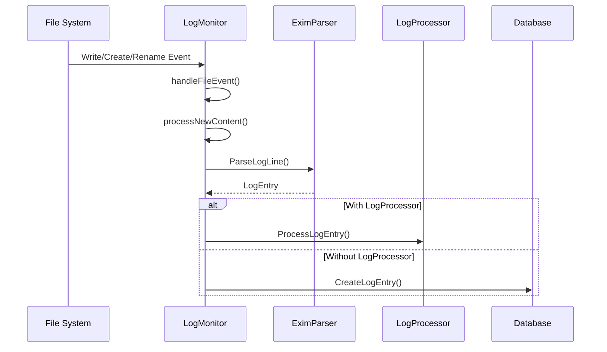
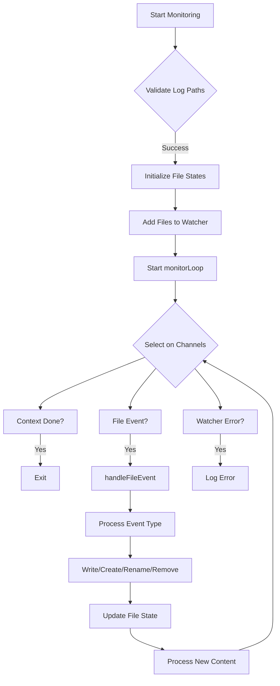
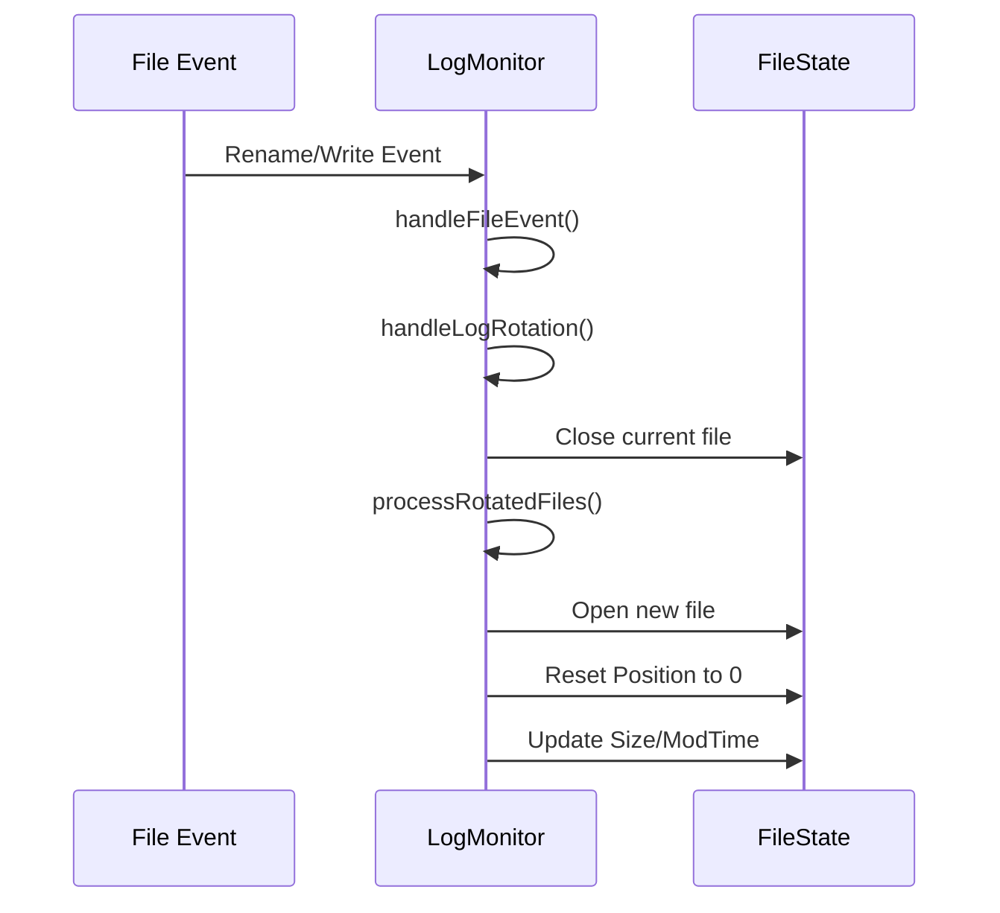
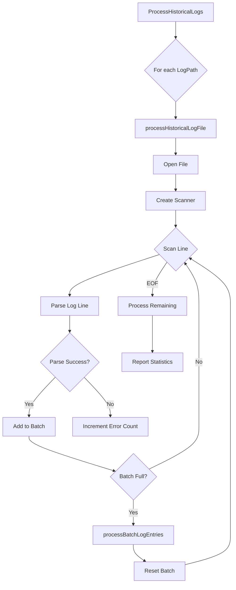

# Log Monitoring


## Table of Contents
1. [Log Monitoring](#log-monitoring)
2. [Core Components](#core-components)
3. [Configuration Options](#configuration-options)
4. [Real-Time File Watching](#real-time-file-watching)
5. [Log Rotation and File Events](#log-rotation-and-file-events)
6. [Error Handling Strategies](#error-handling-strategies)
7. [Integration with Processing Pipeline](#integration-with-processing-pipeline)
8. [Troubleshooting Guide](#troubleshooting-guide)

## Core Components

The LogMonitor component is responsible for real-time monitoring of Exim log files and processing new entries through the system's parsing and storage pipeline. It uses filesystem event detection to efficiently respond to changes in log files without continuous polling.

The core components include:
- **LogMonitor**: Main struct that manages file watching, event handling, and state tracking
- **FileState**: Tracks the position, size, and modification time of monitored log files
- **EximParser**: Parses raw log lines into structured LogEntry objects
- **LogProcessor interface**: Allows integration with downstream processing components

The monitor processes log entries by first detecting filesystem events, then reading new content from the file, parsing it using the EximParser, and finally either passing it to a registered LogProcessor or storing it directly in the database.





**Diagram sources**
- [monitor.go](file://internal/logmonitor/monitor.go#L238-L300)
- [exim_parser.go](file://internal/parser/exim_parser.go#L100-L120)

**Section sources**
- [monitor.go](file://internal/logmonitor/monitor.go#L1-L100)
- [exim_parser.go](file://internal/parser/exim_parser.go#L1-L50)

## Configuration Options

The LogMonitor is configured through the Config struct which accepts the following parameters:

**Config Parameters**
- **LogPaths**: Array of strings specifying the full paths to Exim log files to monitor
- **Repository**: Reference to the database Repository for storing parsed log entries

The configuration is validated during initialization to ensure:
- At least one log path is specified
- All directory paths exist and are accessible
- Read permissions are available for all log directories


```go
type Config struct {
    LogPaths   []string
    Repository *database.Repository
}
```


When a log file does not exist at startup, the monitor watches the parent directory for file creation events, allowing it to automatically begin monitoring when the log file is created.

**Section sources**
- [monitor.go](file://internal/logmonitor/monitor.go#L51-L65)
- [monitor.go](file://internal/logmonitor/monitor.go#L106-L154)

## Real-Time File Watching

The LogMonitor uses the fsnotify package to implement efficient filesystem event detection rather than polling. This approach minimizes CPU usage while ensuring immediate response to log file changes.





**Diagram sources**
- [monitor.go](file://internal/logmonitor/monitor.go#L160-L230)

The monitoring loop runs as a goroutine and listens for three types of events:
- **File events**: Changes to monitored log files
- **Context cancellation**: Signal to stop monitoring
- **Watcher errors**: Issues with the filesystem watcher

When a write event is detected, the monitor checks if the file has been truncated (indicating log rotation) and processes any new content by reading from the last known position to the current end of file.

**Section sources**
- [monitor.go](file://internal/logmonitor/monitor.go#L160-L237)

## Log Rotation and File Events

The LogMonitor implements robust handling of log rotation scenarios, which are common in production environments where log files are periodically rotated, compressed, or archived.

### Log Rotation Detection

The system detects log rotation by comparing the current file size with the previously recorded size. When a file is rotated, it typically appears as a truncated file (smaller size than before):


```go
// Check if file was truncated (log rotation)
info, err := os.Stat(filePath)
if err != nil {
    log.Printf("Failed to stat file %s: %v", filePath, err)
    return
}

if info.Size() < state.Size {
    log.Printf("Log rotation detected for %s, reopening file", filePath)
    m.handleLogRotation(filePath)
    return
}
```


### Event Handling Strategy

The monitor responds to different filesystem events as follows:

**File Event Handling**
- **Write Event**: Process new content from last read position
- **Create Event**: Add new log file to monitoring if it matches configured paths
- **Remove Event**: Clean up file state and close file handle
- **Rename Event**: Handle as log rotation scenario

When log rotation is detected, the monitor:
1. Closes the current file handle
2. Processes any rotated files (e.g., mainlog.1, mainlog.2.gz)
3. Reopens the new log file
4. Resets the read position to 0
5. Updates file state with new size and modification time





**Diagram sources**
- [monitor.go](file://internal/logmonitor/monitor.go#L302-L461)

**Section sources**
- [monitor.go](file://internal/logmonitor/monitor.go#L302-L461)

## Error Handling Strategies

The LogMonitor implements comprehensive error handling to ensure reliability and data integrity in various failure scenarios.

### Retry Mechanism

For database storage operations, the monitor implements a retry strategy with exponential backoff:


```go
func (m *LogMonitor) storeLogEntryWithRetry(entry *database.LogEntry, maxRetries int) error {
    var lastErr error
    
    for i := 0; i < maxRetries; i++ {
        if err := m.repository.CreateLogEntry(m.ctx, entry); err != nil {
            lastErr = err
            if i < maxRetries-1 {
                // Wait with exponential backoff
                time.Sleep(time.Millisecond * 100 * time.Duration(i+1))
            }
            continue
        }
        return nil
    }
    
    return fmt.Errorf("failed after %d retries: %w", maxRetries, lastErr)
}
```


The retry strategy includes:
- Configurable maximum retry count (default: 3)
- Exponential backoff between retries (100ms, 200ms, 300ms)
- Error accumulation for diagnostic purposes

### Parsing Error Management

When log lines cannot be parsed, the monitor:
- Logs the first few errors to prevent log spam
- Continues processing subsequent lines
- Tracks error counts for monitoring purposes


```go
if err != nil {
    errorCount++
    if errorCount <= 5 { // Only log first few errors
        log.Printf("Failed to parse log line from %s: %v", state.Path, err)
    }
    continue
}
```


### File Access and Security

The monitor integrates with a security service to validate file access permissions:


```go
// Validate file access with security service
if err := m.securityService.ValidateFileAccess(logPath, security.AccessRead); err != nil {
    log.Printf("SECURITY: File access denied for %s: %v", logPath, err)
    return fmt.Errorf("security validation failed for log file %s: %w", logPath, err)
}
```


This prevents unauthorized access to log files and provides security auditing.

**Section sources**
- [monitor.go](file://internal/logmonitor/monitor.go#L462-L512)
- [monitor.go](file://internal/logmonitor/monitor.go#L595-L636)

## Integration with Processing Pipeline

The LogMonitor integrates with the overall log processing pipeline through several mechanisms that ensure efficient data flow from log files to storage and analysis.

### Direct Database Storage

When no external processor is configured, the monitor stores entries directly in the database:


```go
if m.logProcessor != nil {
    if err := m.logProcessor.ProcessLogEntry(m.ctx, logEntry); err != nil {
        log.Printf("Failed to process log entry: %v", err)
        continue
    }
} else {
    if err := m.storeLogEntryWithRetry(logEntry, 3); err != nil {
        log.Printf("Failed to store log entry after retries: %v", err)
        continue
    }
}
```


### LogProcessor Interface

The monitor supports integration with external processors through the LogProcessor interface:


```go
type LogProcessor interface {
    ProcessLogEntry(ctx context.Context, entry *database.LogEntry) error
    ProcessLogEntries(ctx context.Context, entries []*database.LogEntry) error
}
```


This allows for:
- Batch processing of log entries
- Custom business logic implementation
- Integration with message queues
- Data enrichment and transformation

### Historical Log Processing

The monitor includes functionality to process existing log files from the beginning:





**Diagram sources**
- [monitor.go](file://internal/logmonitor/monitor.go#L549-L600)

The historical processing:
- Reads files from the beginning
- Processes entries in batches for efficiency
- Provides progress reporting
- Handles parsing errors gracefully

**Section sources**
- [monitor.go](file://internal/logmonitor/monitor.go#L513-L637)
- [monitor.go](file://internal/logmonitor/monitor.go#L549-L600)

## Troubleshooting Guide

This section addresses common issues encountered with the LogMonitor and provides guidance for diagnosis and resolution.

### Missed Log Entries

**Symptoms**: Log entries not appearing in the system despite being present in log files.

**Potential Causes and Solutions**:
- **File permission issues**: Ensure the monitoring process has read access to log files and directories
- **Incorrect log paths**: Verify that LogPaths in configuration match actual file locations
- **Rapid log rotation**: Increase buffer sizes or optimize processing speed
- **Parsing failures**: Check logs for parsing error messages and verify log format compatibility

### High CPU Usage

**Symptoms**: Elevated CPU utilization during high-throughput periods.

**Optimization Strategies**:
- **Batch processing**: Ensure log entries are processed in batches rather than individually
- **Efficient parsing**: Verify that the EximParser is using compiled regular expressions
- **Database optimization**: Ensure proper indexing on log entry tables
- **Resource monitoring**: Implement rate limiting if necessary

### Log Rotation Issues

**Symptoms**: Monitor fails to detect new log entries after rotation.

**Troubleshooting Steps**:
1. Verify that the monitor detects the rename event
2. Check that the new file is being reopened successfully
3. Ensure file state is properly reset after rotation
4. Validate that the security service allows access to the new file

### Configuration Validation

Always validate configuration before deployment:


```bash
# Example configuration check
ls -la /var/log/exim/
# Verify file permissions and existence
```


Ensure that:
- All log paths exist or their parent directories are accessible
- The monitoring process has appropriate read permissions
- Disk space is sufficient for log files
- Filesystem supports inotify events

**Section sources**
- [monitor.go](file://internal/logmonitor/monitor.go#L106-L154)
- [monitor.go](file://internal/logmonitor/monitor.go#L462-L512)

**Referenced Files in This Document**   
- [monitor.go](file://internal/logmonitor/monitor.go)
- [exim_parser.go](file://internal/parser/exim_parser.go)
- [models.go](file://internal/database/models.go)
- [repository.go](file://internal/database/repository.go)