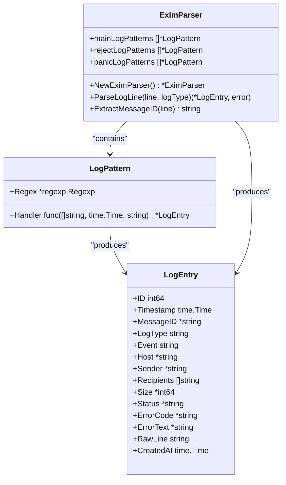
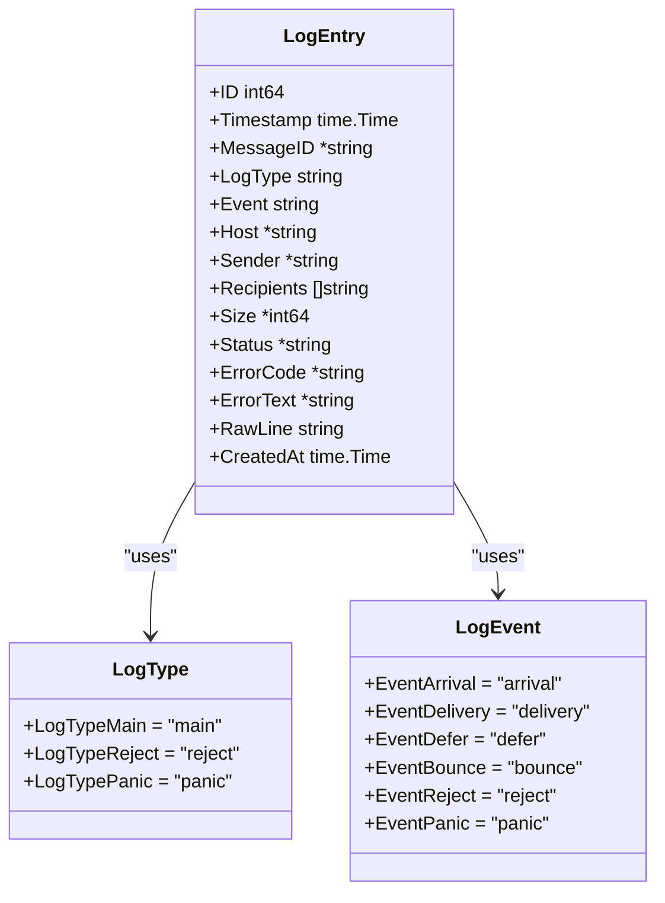
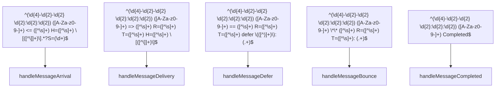
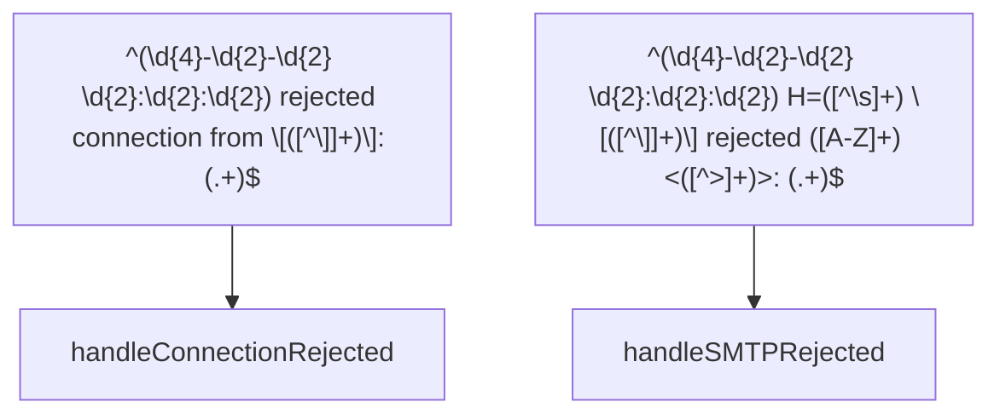
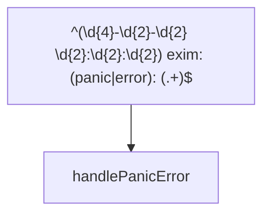
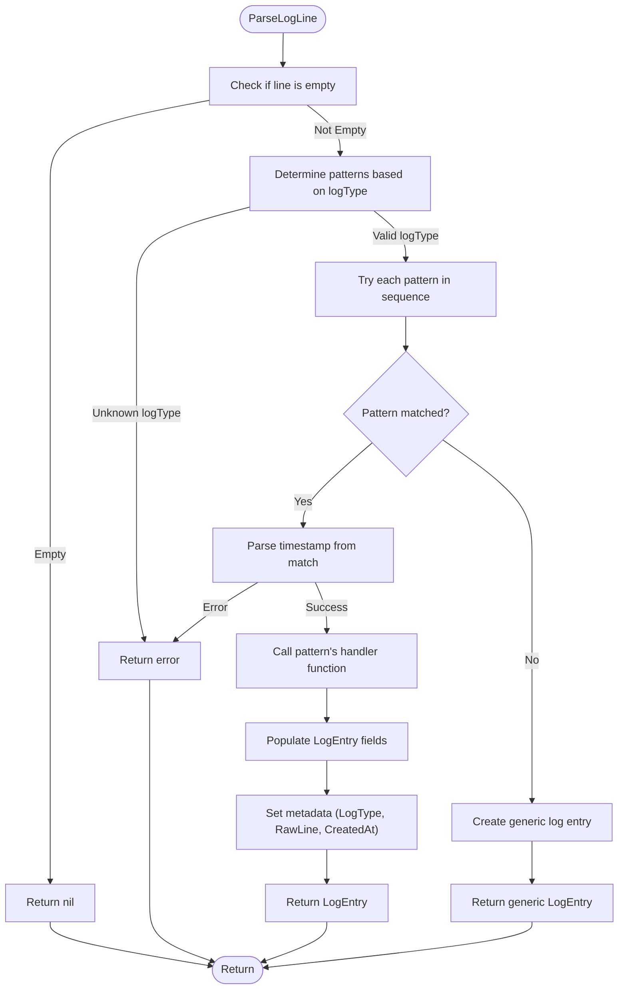
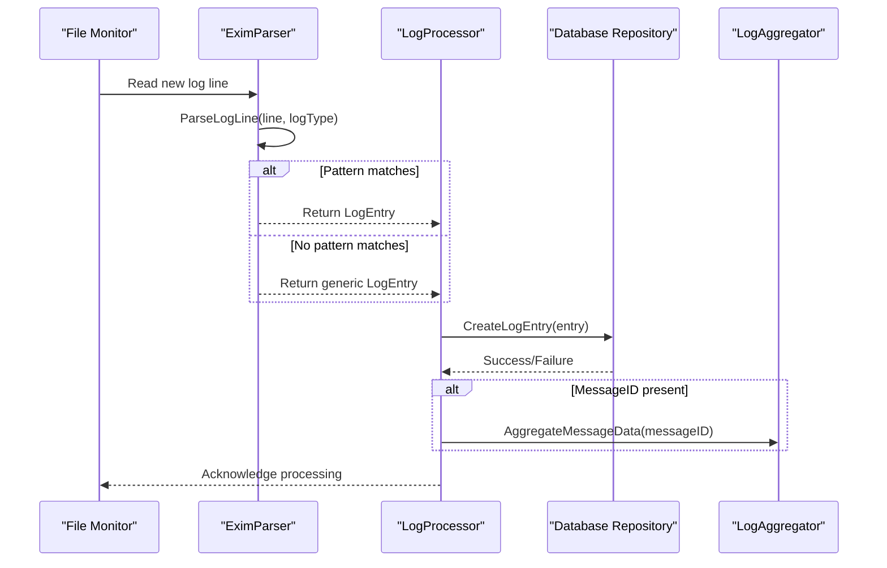
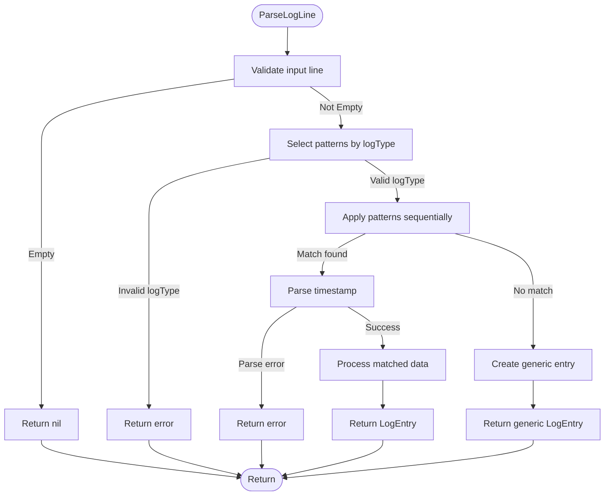

# Log Parsing


## Table of Contents
1. [Introduction](#introduction)
2. [Exim Parser Architecture](#exim-parser-architecture)
3. [Log Entry Structure](#log-entry-structure)
4. [Regular Expression Patterns](#regular-expression-patterns)
5. [Parsing Process](#parsing-process)
6. [Integration with Log Processing Pipeline](#integration-with-log-processing-pipeline)
7. [Error Handling and Recovery](#error-handling-and-recovery)
8. [Performance Considerations](#performance-considerations)
9. [Extending the Parser](#extending-the-parser)
10. [Conclusion](#conclusion)

## Introduction

The log parsing component of the Exim Pilot system is responsible for transforming unstructured Exim mail server log entries into structured data that can be analyzed, stored, and presented to users. This document provides a comprehensive analysis of the `EximParser` implementation, detailing how it identifies message IDs, timestamps, sender/recipient addresses, delivery status codes, and routing events from raw log lines. The parser is a critical component of the log processing pipeline, enabling the system to provide detailed message tracing, delivery analytics, and troubleshooting capabilities.

The parser operates by applying a series of regular expression patterns to incoming log lines, extracting relevant information and mapping it to structured Go objects. It handles multiple log types (main, reject, panic) and various log record formats, including message arrival, delivery, deferral, bounce, and completion events. The parsed data is then integrated with the broader system for correlation, storage, and analysis.

**Section sources**
- [exim_parser.go](file://internal/parser/exim_parser.go#L1-L30)

## Exim Parser Architecture

The `EximParser` is implemented as a Go struct that encapsulates compiled regular expression patterns and their corresponding handler functions. The architecture follows a pattern-based approach where each log format has a dedicated regex pattern and a handler function that processes the matched data.





**Diagram sources**
- [exim_parser.go](file://internal/parser/exim_parser.go#L12-L30)
- [models.go](file://internal/database/models.go#L100-L140)

The `EximParser` struct contains three slices of `LogPattern` objects, each dedicated to a specific log type:
- `mainLogPatterns`: For main log entries containing message routing information
- `rejectLogPatterns`: For rejection log entries containing connection and SMTP rejections
- `panicLogPatterns`: For panic/error log entries containing system errors

Each `LogPattern` consists of a compiled regular expression and a handler function that processes the matched data. This design allows for extensibility, as new patterns can be added without modifying the core parsing logic.

**Section sources**
- [exim_parser.go](file://internal/parser/exim_parser.go#L12-L30)

## Log Entry Structure

The parsed log data is stored in the `LogEntry` struct, which represents a single structured log entry in the system. This structure is defined in the database package and contains all the fields necessary to capture the relevant information from Exim log entries.





**Diagram sources**
- [models.go](file://internal/database/models.go#L100-L140)

The `LogEntry` structure includes the following key fields:
- **Timestamp**: The time when the log entry was created, parsed from the log line
- **MessageID**: The Exim message ID (e.g., "1rABCD-123456-78") that uniquely identifies a message
- **LogType**: The type of log file this entry came from (main, reject, panic)
- **Event**: The type of event (arrival, delivery, defer, bounce, etc.)
- **Host**: The hostname or IP address involved in the event
- **Sender**: The email address of the sender
- **Recipients**: A slice of recipient email addresses
- **Size**: The size of the message in bytes
- **Status**: A human-readable status string
- **ErrorCode**: Delivery error codes when applicable
- **ErrorText**: Detailed error messages for failed deliveries
- **RawLine**: The original unprocessed log line for reference

The structure uses pointer types (*string, *int64) for optional fields, allowing them to be nil when the information is not available in the log entry.

**Section sources**
- [models.go](file://internal/database/models.go#L100-L140)

## Regular Expression Patterns

The Exim parser uses a comprehensive set of regular expression patterns to match different types of log entries. These patterns are compiled during parser initialization and stored for efficient reuse.

### Main Log Patterns

The main log patterns handle the primary message routing events in Exim:





**Diagram sources**
- [exim_parser.go](file://internal/parser/exim_parser.go#L45-L87)

#### Message Arrival Pattern

```
^(\d{4}-\d{2}-\d{2} \d{2}:\d{2}:\d{2}) ([A-Za-z0-9-]+) <= ([^\s]+) H=([^\s]+) \[([^\]]+)\].*?S=(\d+)
```

This pattern matches message arrival events and captures:
1. Timestamp: The date and time of the event
2. MessageID: The Exim message ID
3. Sender: The sender's email address
4. Host: The hostname of the sending server
5. IP Address: The IP address of the sending server
6. Size: The size of the message in bytes

Example: `2024-01-15 10:30:45 1rABCD-123456-78 <= sender@example.com H=mail.example.com [192.168.1.1] P=esmtp S=1234`

#### Message Delivery Pattern

```
^(\d{4}-\d{2}-\d{2} \d{2}:\d{2}:\d{2}) ([A-Za-z0-9-]+) => ([^\s]+) R=([^\s]+) T=([^\s]+) H=([^\s]+) \[([^\]]+)\]
```

This pattern matches successful message deliveries and captures:
1. Timestamp: The date and time of the event
2. MessageID: The Exim message ID
3. Recipient: The recipient's email address
4. Router: The router used for delivery
5. Transport: The transport method used
6. Host: The hostname of the receiving server
7. IP Address: The IP address of the receiving server

Example: `2024-01-15 10:31:00 1rABCD-123456-78 => recipient@example.com R=dnslookup T=remote_smtp H=mx.example.com [192.168.1.2]`

#### Message Deferral Pattern

```
^(\d{4}-\d{2}-\d{2} \d{2}:\d{2}:\d{2}) ([A-Za-z0-9-]+) == ([^\s]+) R=([^\s]+) T=([^\s]+) defer \(([^)]+)\): (.+)
```

This pattern matches deferred (temporarily failed) deliveries and captures:
1. Timestamp: The date and time of the event
2. MessageID: The Exim message ID
3. Recipient: The recipient's email address
4. Router: The router used for delivery
5. Transport: The transport method used
6. ErrorCode: The error code for the deferral
7. ErrorText: The detailed error message

Example: `2024-01-15 10:31:00 1rABCD-123456-78 == recipient@example.com R=dnslookup T=remote_smtp defer (-1): Connection refused`

#### Message Bounce Pattern

```
^(\d{4}-\d{2}-\d{2} \d{2}:\d{2}:\d{2}) ([A-Za-z0-9-]+) \*\* ([^\s]+) R=([^\s]+) T=([^\s]+): (.+)
```

This pattern matches bounced (permanently failed) messages and captures:
1. Timestamp: The date and time of the event
2. MessageID: The Exim message ID
3. Recipient: The recipient's email address
4. Router: The router used for delivery
5. Transport: The transport method used
6. ErrorText: The detailed error message

Example: `2024-01-15 10:31:00 1rABCD-123456-78 ** recipient@example.com R=dnslookup T=remote_smtp: Host not found`

#### Message Completion Pattern

```
^(\d{4}-\d{2}-\d{2} \d{2}:\d{2}:\d{2}) ([A-Za-z0-9-]+) Completed
```

This pattern matches message completion events and captures:
1. Timestamp: The date and time of the event
2. MessageID: The Exim message ID

Example: `2024-01-15 10:31:05 1rABCD-123456-78 Completed`

### Reject Log Patterns

The reject log patterns handle connection and SMTP rejections:





**Diagram sources**
- [exim_parser.go](file://internal/parser/exim_parser.go#L83-L130)

#### Connection Rejected Pattern

```
^(\d{4}-\d{2}-\d{2} \d{2}:\d{2}:\d{2}) rejected connection from \[([^\]]+)\]: (.+)
```

This pattern matches rejected connections and captures:
1. Timestamp: The date and time of the event
2. IPAddress: The IP address of the connecting client
3. Reason: The reason for rejection

Example: `2024-01-15 10:30:45 rejected connection from [192.168.1.100]: (tcp wrappers)`

#### SMTP Rejected Pattern

```
^(\d{4}-\d{2}-\d{2} \d{2}:\d{2}:\d{2}) H=([^\s]+) \[([^\]]+)\] rejected ([A-Z]+) <([^>]+)>: (.+)
```

This pattern matches SMTP command rejections and captures:
1. Timestamp: The date and time of the event
2. Host: The hostname of the connecting client
3. IPAddress: The IP address of the connecting client
4. Command: The SMTP command that was rejected
5. Recipient: The recipient address in the rejected command
6. Reason: The reason for rejection

Example: `2024-01-15 10:30:45 H=mail.example.com [192.168.1.100] rejected RCPT <spam@example.com>: Spam message`

### Panic Log Patterns

The panic log patterns handle system errors and panics:





**Diagram sources**
- [exim_parser.go](file://internal/parser/exim_parser.go#L83-L130)

#### General Panic/Error Pattern

```
^(\d{4}-\d{2}-\d{2} \d{2}:\d{2}:\d{2}) exim: (panic|error): (.+)
```

This pattern matches system panic and error events and captures:
1. Timestamp: The date and time of the event
2. Level: The severity level (panic or error)
3. Message: The error message

Example: `2024-01-15 10:30:45 exim: panic: Out of memory`

**Section sources**
- [exim_parser.go](file://internal/parser/exim_parser.go#L45-L130)

## Parsing Process

The parsing process in the `EximParser` follows a systematic approach to transform raw log lines into structured `LogEntry` objects. The process begins with the `ParseLogLine` method, which serves as the entry point for parsing individual log entries.





**Diagram sources**
- [exim_parser.go](file://internal/parser/exim_parser.go#L89-L130)

The parsing process can be broken down into the following steps:

1. **Input Validation**: The method first checks if the input line is empty or consists only of whitespace. If so, it returns `nil` without an error, as empty lines are considered valid but uninteresting.

2. **Pattern Selection**: Based on the `logType` parameter, the parser selects the appropriate set of patterns to use:
   - `database.LogTypeMain`: Uses `mainLogPatterns` for message routing events
   - `database.LogTypeReject`: Uses `rejectLogPatterns` for rejection events
   - `database.LogTypePanic`: Uses `panicLogPatterns` for system errors
   - Any other value: Returns an error for unknown log types

3. **Pattern Matching**: The parser iterates through the selected patterns in order, applying each regular expression to the log line using `FindStringSubmatch`. This method returns the matched text and all capture groups, or `nil` if no match is found.

4. **Timestamp Parsing**: When a pattern matches, the parser extracts the timestamp from the first capture group and parses it using Go's `time.Parse` function with the format "2006-01-02 15:04:05", which corresponds to the Exim timestamp format.

5. **Handler Invocation**: The parser calls the handler function associated with the matching pattern, passing the capture groups, parsed timestamp, and original log line. The handler function is responsible for extracting the relevant fields from the capture groups and creating a `LogEntry` object.

6. **Metadata Population**: After the handler returns a `LogEntry`, the parser populates additional metadata fields:
   - `LogType`: Set to the input log type
   - `RawLine`: Set to the original log line for reference
   - `CreatedAt`: Set to the current time when the entry was parsed

7. **Fallback Handling**: If no patterns match the log line, the parser creates a generic log entry using the `createGenericLogEntry` method. This method attempts to extract a timestamp from the beginning of the line and creates a minimal `LogEntry` with the event type set to "unknown".

The handler functions are responsible for the actual data extraction and transformation. Each handler corresponds to a specific log pattern and knows how to interpret the capture groups from that pattern. For example, the `handleMessageArrival` handler extracts the message ID, sender, host, and size from the capture groups and creates a `LogEntry` with the event type set to "arrival".

**Section sources**
- [exim_parser.go](file://internal/parser/exim_parser.go#L89-L130)

## Integration with Log Processing Pipeline

The `EximParser` is integrated into the broader log processing pipeline through several components that work together to monitor log files, parse entries, and store/process the structured data.





**Diagram sources**
- [monitor.go](file://internal/logmonitor/monitor.go#L23-L61)
- [streaming.go](file://internal/logprocessor/streaming.go#L20-L56)
- [service.go](file://internal/logprocessor/service.go#L1-L344)
- [aggregator.go](file://internal/logprocessor/aggregator.go#L1-L538)

The integration begins with the `LogMonitor` component, which watches Exim log files for changes using file system notifications. When new content is detected, it reads the log lines and passes them to the `StreamingProcessor` in the `logprocessor` package.

The `StreamingProcessor` contains an instance of `EximParser` and uses it to parse each log line. Once a `LogEntry` is created, it is passed to the `Service` component in the `logprocessor` package, which handles the storage and further processing of the entry.

The `Service.ProcessLogEntry` method stores the `LogEntry` in the database using the `Repository.CreateLogEntry` method. If the entry has a message ID and correlation is enabled, the service triggers asynchronous correlation of the message data using the `LogAggregator`.

The `LogAggregator` is responsible for correlating all log entries, delivery attempts, and other data related to a specific message ID. It creates a comprehensive view of the message's journey through the system, including all delivery attempts, deferrals, and bounces.

This integration allows the system to provide detailed message tracing, delivery analytics, and troubleshooting capabilities. Users can search for messages by ID, sender, recipient, or other criteria, and view a complete timeline of events for each message.

**Section sources**
- [monitor.go](file://internal/logmonitor/monitor.go#L23-L61)
- [streaming.go](file://internal/logprocessor/streaming.go#L20-L56)
- [service.go](file://internal/logprocessor/service.go#L1-L344)
- [aggregator.go](file://internal/logprocessor/aggregator.go#L1-L538)

## Error Handling and Recovery

The Exim parser implements robust error handling and recovery mechanisms to ensure reliable operation even when processing malformed or unexpected log entries.

### Error Types and Handling

The parser handles several types of errors that may occur during the parsing process:

1. **Empty or Whitespace-Only Lines**: These are handled gracefully by returning `nil` without an error. This prevents the system from generating error messages for common log file artifacts.

2. **Unknown Log Types**: When an invalid `logType` parameter is provided, the parser returns an error with a descriptive message. This helps catch configuration issues early.

3. **Timestamp Parsing Errors**: If the timestamp in a log line cannot be parsed, the parser returns an error. This ensures data integrity by preventing entries with invalid timestamps from being processed.

4. **Unmatched Log Lines**: When a log line does not match any of the defined patterns, the parser creates a generic log entry instead of failing. This ensures that no log data is lost, even if the parser doesn't understand the format.





**Diagram sources**
- [exim_parser.go](file://internal/parser/exim_parser.go#L89-L130)

### Recovery Mechanisms

The parser employs several recovery mechanisms to maintain system stability:

1. **Generic Entry Fallback**: When a log line doesn't match any patterns, the parser creates a generic `LogEntry` with the raw line preserved. This ensures that no log data is lost, and administrators can later analyze the unmatched lines to determine if new patterns need to be added.

2. **Partial Data Extraction**: Even when a log line doesn't match a specific pattern, the parser attempts to extract a timestamp from the beginning of the line. This allows the system to at least record when the event occurred, even if the details are not fully understood.

3. **Asynchronous Processing**: The log processing pipeline uses asynchronous processing for correlation and aggregation tasks. This prevents parsing delays from affecting the real-time monitoring of log files.

4. **Batch Processing**: The `Service.ProcessLogEntries` method processes log entries in batches, which improves performance and provides better error resilience. If one entry in a batch fails, the others can still be processed.

5. **Error Logging**: The system logs parsing errors and other issues, allowing administrators to monitor the health of the log processing pipeline and identify potential problems.

These error handling and recovery mechanisms ensure that the log parsing component can handle the variability and unpredictability of real-world log data while maintaining system reliability and data integrity.

**Section sources**
- [exim_parser.go](file://internal/parser/exim_parser.go#L89-L130)
- [service.go](file://internal/logprocessor/service.go#L1-L344)

## Performance Considerations

The Exim parser is designed with performance in mind to handle high-volume log processing efficiently. Several optimizations and considerations ensure that the parser can keep up with the demands of a busy mail server.

### Regular Expression Optimization

The parser compiles all regular expression patterns during initialization using `regexp.MustCompile`. This ensures that the patterns are compiled only once and can be reused for every log line, avoiding the overhead of repeated compilation.


```go
// Patterns are compiled once during initialization
p.mainLogPatterns = []*LogPattern{
    {
        Regex:   regexp.MustCompile(`^(\d{4}-\d{2}-\d{2} \d{2}:\d{2}:\d{2}) ([A-Za-z0-9-]+) <= ([^\s]+) H=([^\s]+) \[([^\]]+)\].*?S=(\d+)`),
        Handler: p.handleMessageArrival,
    },
    // ... other patterns
}
```


The regular expressions are also optimized for performance:
- They use non-capturing groups where possible
- They avoid backtracking with possessive quantifiers
- They anchor patterns to the start of the line with `^`
- They use character classes and quantifiers efficiently

### Memory Management

The parser uses several techniques to minimize memory allocation and garbage collection pressure:

1. **Pointer Fields**: The `LogEntry` struct uses pointer types (*string, *int64) for optional fields, which reduces memory usage when fields are not present.

2. **String Reuse**: The parser avoids unnecessary string allocations by using the capture groups directly from the regex match.

3. **Batch Processing**: The log processing service processes entries in batches, reducing the overhead of database transactions and network calls.

4. **Connection Pooling**: The database repository uses connection pooling to minimize the overhead of establishing database connections.

### Concurrency and Parallelism

The log processing pipeline is designed to handle high volumes of log data through concurrency:

1. **Asynchronous Correlation**: Message correlation is performed asynchronously using goroutines, preventing it from blocking the main parsing loop.


```go
// Correlation is performed asynchronously
if s.config.EnableCorrelation && entry.MessageID != nil && *entry.MessageID != "" {
    go s.correlateMessageAsync(*entry.MessageID)
}
```


2. **Background Services**: The system includes background services for correlation, cleanup, and metrics collection, which run independently of the main parsing process.

3. **Parallel Processing**: Multiple log files can be monitored and processed in parallel, allowing the system to scale with the number of log sources.

### Configuration Tuning

The system provides several configuration options to tune performance based on the specific environment:


```go
type ServiceConfig struct {
    BatchSize         int           `json:"batch_size"`
    ProcessingTimeout time.Duration `json:"processing_timeout"`
    DefaultSearchLimit int          `json:"default_search_limit"`
    MaxSearchLimit     int          `json:"max_search_limit"`
    EnableCorrelation bool          `json:"enable_correlation"`
    EnableCleanup     bool          `json:"enable_cleanup"`
    EnableMetrics     bool          `json:"enable_metrics"`
}
```


These settings allow administrators to balance performance, resource usage, and functionality based on their specific needs.

### Benchmarking

The system includes benchmark tests to measure performance and identify potential bottlenecks:


```go
func BenchmarkSearchCriteria(b *testing.B) {
    for i := 0; i < b.N; i++ {
        criteria := SearchCriteria{
            MessageID: "test-message-id",
            Sender:    "test@example.com",
            LogTypes:  []string{"main", "reject"},
            Events:    []string{"arrival", "delivery"},
            Keywords:  []string{"error", "timeout"},
            Limit:     100,
        }
        _ = criteria
    }
}
```


These benchmarks help ensure that performance remains acceptable as the system evolves.

**Section sources**
- [exim_parser.go](file://internal/parser/exim_parser.go#L26-L30)
- [service.go](file://internal/logprocessor/service.go#L1-L344)
- [service_test.go](file://internal/logprocessor/service_test.go#L1-L287)

## Extending the Parser

The Exim parser is designed to be extensible, allowing administrators to add support for custom log formats or modify existing behavior. The modular architecture makes it relatively straightforward to extend the parser's capabilities.

### Adding New Log Patterns

To add support for a new log format, developers can add a new `LogPattern` to the appropriate pattern list in the `initializePatterns` method:


```go
func (p *EximParser) initializePatterns() {
    // Main log patterns
    p.mainLogPatterns = []*LogPattern{
        // Existing patterns...
        
        // New custom pattern
        {
            Regex:   regexp.MustCompile(`^(\d{4}-\d{2}-\d{2} \d{2}:\d{2}:\d{2}) ([A-Za-z0-9-]+) CUSTOM_EVENT ([^\s]+): (.+)$`),
            Handler: p.handleCustomEvent,
        },
    }
    
    // ... other pattern lists
}
```


The new pattern requires a corresponding handler function that processes the matched data:


```go
func (p *EximParser) handleCustomEvent(matches []string, timestamp time.Time, rawLine string) *database.LogEntry {
    messageID := matches[2]
    eventType := matches[3]
    details := matches[4]
    
    return &database.LogEntry{
        Timestamp: timestamp,
        MessageID: &messageID,
        Event:     "custom_event",
        Status:    stringPtr(eventType),
        ErrorText: &details,
        RawLine:   rawLine,
    }
}
```


### Modifying Existing Patterns

Existing patterns can be modified by changing their regular expressions or replacing their handler functions. For example, to add support for an additional field in the message arrival pattern:


```go
// Modified message arrival pattern with additional TLS information
{
    Regex:   regexp.MustCompile(`^(\d{4}-\d{2}-\d{2} \d{2}:\d{2}:\d{2}) ([A-Za-z0-9-]+) <= ([^\s]+) H=([^\s]+) \[([^\]]+)\].*?S=(\d+)(?:.*?X=([^\s]+))?$`),
    Handler: p.handleMessageArrivalWithTLS,
},
```


The corresponding handler would then extract the additional TLS information:


```go
func (p *EximParser) handleMessageArrivalWithTLS(matches []string, timestamp time.Time, rawLine string) *database.LogEntry {
    // ... existing extraction code ...
    
    var tlsInfo *string
    if len(matches) > 7 && matches[7] != "" {
        tlsInfo = &matches[7]
    }
    
    entry := p.handleMessageArrival(matches, timestamp, rawLine)
    entry.TLSInfo = tlsInfo // Assuming LogEntry has a TLSInfo field
    return entry
}
```


### Creating Custom Parsers

For more extensive modifications, developers can create custom parser types that embed the `EximParser` or implement the same interface:


```go
type CustomEximParser struct {
    *EximParser
    customField string
}

func NewCustomEximParser() *CustomEximParser {
    parser := &CustomEximParser{
        EximParser: NewEximParser(),
        customField: "custom value",
    }
    parser.initializeCustomPatterns()
    return parser
}

func (p *CustomEximParser) initializeCustomPatterns() {
    // Add custom patterns to existing ones
    p.mainLogPatterns = append(p.mainLogPatterns, &LogPattern{
        Regex:   regexp.MustCompile(`^CUSTOM PATTERN$`),
        Handler: p.handleCustomPattern,
    })
}
```


### Configuration-Driven Extensions

The parser could be extended to support configuration-driven pattern definitions, allowing administrators to add new patterns without modifying code:


```go
type PatternConfig struct {
    Name      string `json:"name"`
    Regex     string `json:"regex"`
    LogType   string `json:"log_type"`
    Event     string `json:"event"`
    Status    string `json:"status"`
}

func (p *EximParser) LoadPatternsFromConfig(config []PatternConfig) error {
    for _, pc := range config {
        regex, err := regexp.Compile(pc.Regex)
        if err != nil {
            return fmt.Errorf("invalid regex '%s': %w", pc.Regex, err)
        }
        
        var patterns []*LogPattern
        var handler func([]string, time.Time, string) *database.LogEntry
        
        switch pc.LogType {
        case database.LogTypeMain:
            patterns = p.mainLogPatterns
            handler = func(matches []string, timestamp time.Time, rawLine string) *database.LogEntry {
                return &database.LogEntry{
                    Timestamp: timestamp,
                    Event:     pc.Event,
                    Status:    stringPtr(pc.Status),
                    RawLine:   rawLine,
                }
            }
        // ... other log types
        }
        
        patterns = append(patterns, &LogPattern{
            Regex:   regex,
            Handler: handler,
        })
    }
    return nil
}
```


These extension points make the parser adaptable to different Exim configurations and logging requirements, ensuring that it can evolve with changing needs.

**Section sources**
- [exim_parser.go](file://internal/parser/exim_parser.go#L26-L30)

## Conclusion

The Exim parser in the Exim Pilot system provides a robust and extensible solution for transforming unstructured Exim log entries into structured data that can be analyzed and presented to users. By using a pattern-based approach with compiled regular expressions and dedicated handler functions, the parser efficiently extracts key information such as message IDs, timestamps, sender/recipient addresses, delivery status codes, and routing events from raw log lines.

The parser's architecture is designed for reliability, with comprehensive error handling and recovery mechanisms that ensure no log data is lost even when processing malformed or unexpected entries. It integrates seamlessly with the broader log processing pipeline, enabling real-time monitoring, message tracing, and delivery analytics.

Performance optimizations, including pre-compiled regular expressions, efficient memory management, and asynchronous processing, allow the parser to handle high-volume log processing efficiently. The modular design makes it extensible, allowing administrators to add support for custom log formats or modify existing behavior as needed.

Overall, the Exim parser serves as a critical component of the Exim Pilot system, transforming raw log data into actionable insights that help administrators monitor, troubleshoot, and optimize their mail server operations.

**Referenced Files in This Document**   
- [exim_parser.go](file://internal/parser/exim_parser.go)
- [models.go](file://internal/database/models.go)
- [service.go](file://internal/logprocessor/service.go)
- [aggregator.go](file://internal/logprocessor/aggregator.go)
- [exim_parser_test.go](file://internal/parser/exim_parser_test.go)
- [monitor.go](file://internal/logmonitor/monitor.go)
- [streaming.go](file://internal/logprocessor/streaming.go)