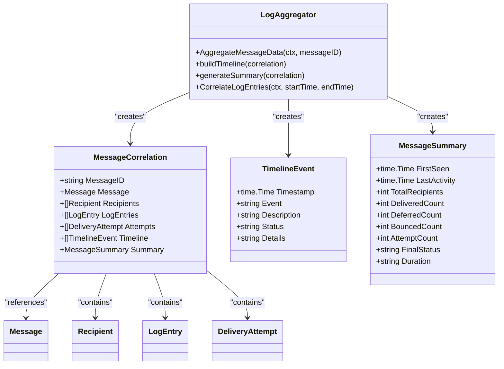
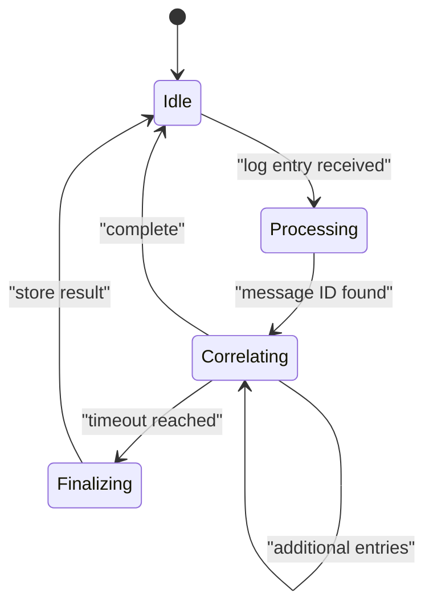
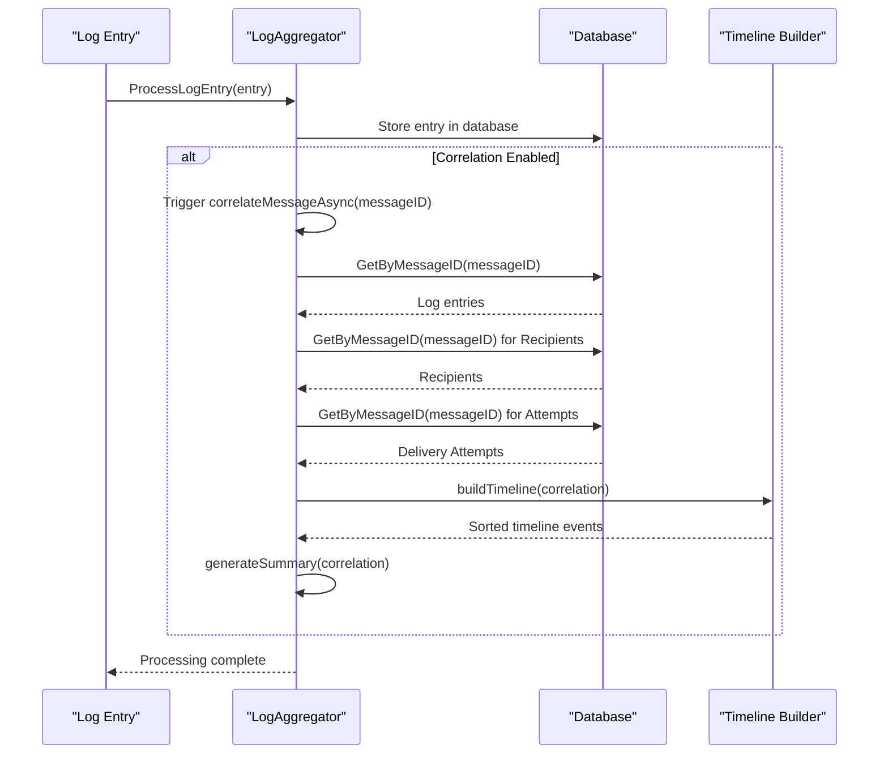
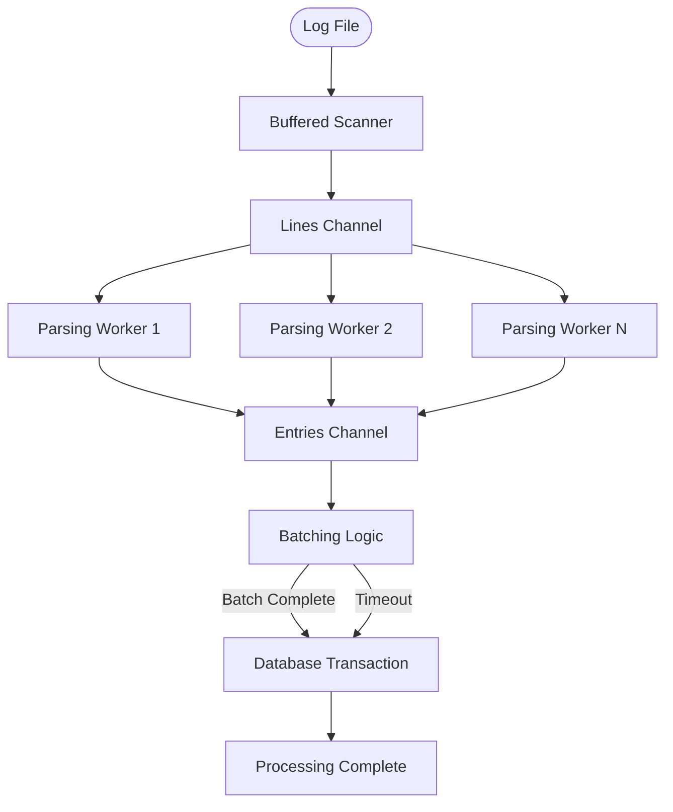
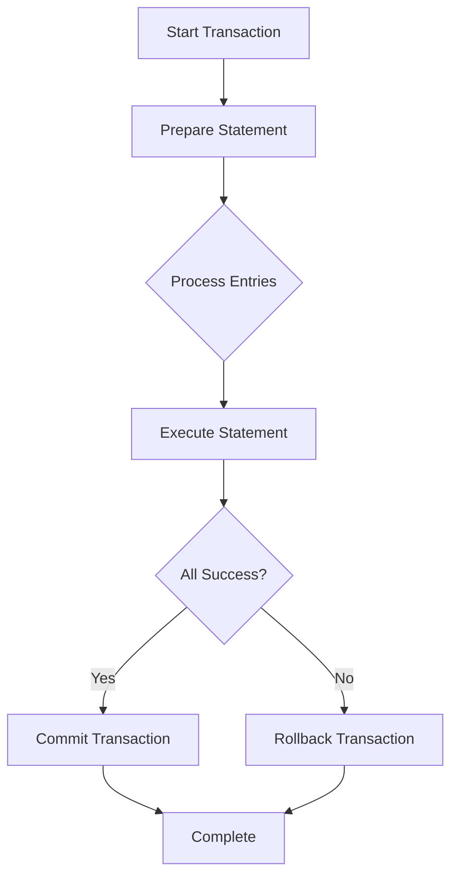

# Log Aggregation and Correlation


## Table of Contents
1. [Introduction](#introduction)
2. [Core Components Overview](#core-components-overview)
3. [Log Aggregation and Correlation Engine](#log-aggregation-and-correlation-engine)
4. [In-Memory Data Structures and Session Tracking](#in-memory-data-structures-and-session-tracking)
5. [Message Correlation Workflow](#message-correlation-workflow)
6. [Concurrency and Batch Processing](#concurrency-and-batch-processing)
7. [Data Flow and Processing Pipeline](#data-flow-and-processing-pipeline)
8. [Example: Reconstructing Message Histories](#example-reconstructing-message-histories)
9. [Performance and Memory Management](#performance-and-memory-management)
10. [Error Handling and Data Consistency](#error-handling-and-data-consistency)

## Introduction
The Log Aggregation and Correlation system in exim-pilot is designed to process, correlate, and reconstruct complete message delivery histories from discrete log entries generated by the Exim mail server. This document provides a comprehensive analysis of how the system correlates log entries by message ID, constructs delivery timelines, manages in-memory data structures, handles timeouts, and ensures data consistency during high-throughput processing.

The system processes log entries from multiple sources (main, reject, panic logs) and reconstructs complete message delivery timelines by correlating entries that share the same message ID. It handles multiple delivery attempts, recipient statuses, and final delivery outcomes, providing a unified view of message delivery across the entire system.

## Core Components Overview

The log aggregation system consists of several key components working together to process and correlate log data:

- **LogAggregator**: Core component responsible for correlating log entries by message ID and constructing complete message delivery timelines
- **LogProcessor Service**: Orchestrates the entire log processing workflow, managing aggregation, search, and background tasks
- **BackgroundService**: Handles periodic correlation, cleanup, and metrics collection tasks
- **StreamingProcessor**: Efficiently processes large log files using streaming and pipelined architecture
- **Database Models**: Define the structure of messages, recipients, delivery attempts, and log entries

These components work together to provide a robust system for log aggregation, message correlation, and delivery timeline reconstruction.

**Section sources**
- [aggregator.go](file://internal/logprocessor/aggregator.go#L1-L50)
- [service.go](file://internal/logprocessor/service.go#L1-L50)
- [models.go](file://internal/database/models.go#L1-L50)

## Log Aggregation and Correlation Engine

The Log Aggregator is the central component responsible for correlating discrete log entries that belong to the same message transaction. It uses message IDs as the primary key to group related log entries and construct complete delivery timelines.

### Message Correlation Process

The correlation process begins when log entries are processed by the system. Each log entry contains a message ID that serves as the correlation key. The aggregator collects all entries with the same message ID and reconstructs the complete delivery history.





**Diagram sources**
- [aggregator.go](file://internal/logprocessor/aggregator.go#L25-L50)
- [models.go](file://internal/database/models.go#L150-L250)

**Section sources**
- [aggregator.go](file://internal/logprocessor/aggregator.go#L1-L100)

## In-Memory Data Structures and Session Tracking

The system uses several in-memory data structures to track message sessions and maintain state during the correlation process. These structures are designed to efficiently handle high-throughput log processing while minimizing memory usage.

### Data Structure Design

The primary data structure used for correlation is a map that groups log entries by message ID:


```go
messageMap := make(map[string][]database.LogEntry)
```


This structure allows for O(1) lookup time when adding new log entries to their respective message groups. For each message ID, the system maintains a slice of log entries that are later sorted chronologically to create the delivery timeline.

### Timeout Policies for Incomplete Transactions

The system implements timeout policies to handle incomplete message transactions. When a message has been partially processed but no new log entries have been received within a specified timeframe, the system can finalize the correlation with the available data.

The timeout behavior is controlled through configuration parameters in the ServiceConfig:


```go
type ServiceConfig struct {
    ProcessingTimeout time.Duration `json:"processing_timeout"`
    EnableCorrelation bool `json:"enable_correlation"`
    BatchSize         int `json:"batch_size"`
}
```


By default, the processing timeout is set to 30 seconds, after which asynchronous correlation operations will be terminated if not completed.





**Diagram sources**
- [service.go](file://internal/logprocessor/service.go#L20-L40)
- [aggregator.go](file://internal/logprocessor/aggregator.go#L25-L35)

**Section sources**
- [service.go](file://internal/logprocessor/service.go#L15-L50)
- [aggregator.go](file://internal/logprocessor/aggregator.go#L15-L35)

## Message Correlation Workflow

The message correlation workflow is a multi-step process that transforms scattered log entries into coherent message histories. This workflow is triggered whenever a new log entry with a message ID is processed.

### Correlation Trigger Mechanism

When a log entry is processed, the system checks if it contains a message ID. If so, it triggers asynchronous correlation:


```go
func (s *Service) ProcessLogEntry(ctx context.Context, entry *database.LogEntry) error {
    // Store the log entry
    if err := s.repository.CreateLogEntry(ctx, entry); err != nil {
        return fmt.Errorf("failed to store log entry: %w", err)
    }

    // If correlation is enabled and entry has a message ID, trigger correlation
    if s.config.EnableCorrelation && entry.MessageID != nil && *entry.MessageID != "" {
        go s.correlateMessageAsync(*entry.MessageID)
    }

    return nil
}
```


This design ensures that log storage is not blocked by the correlation process, allowing the system to maintain high throughput even under heavy load.

### Timeline Construction

The timeline construction process combines log entries and delivery attempts into a single chronological sequence:





**Diagram sources**
- [service.go](file://internal/logprocessor/service.go#L150-L180)
- [aggregator.go](file://internal/logprocessor/aggregator.go#L100-L150)

**Section sources**
- [service.go](file://internal/logprocessor/service.go#L150-L200)
- [aggregator.go](file://internal/logprocessor/aggregator.go#L100-L200)

## Concurrency and Batch Processing

The system employs sophisticated concurrency and batch processing strategies to handle high-volume log processing efficiently.

### Concurrent Processing Architecture

The StreamingProcessor implements a pipelined architecture with multiple concurrent workers:


```go
// Stage 1: Line reading
// Stage 2: Parsing workers (concurrent)
// Stage 3: Batching
// Stage 4: Database insertion
```


This pipeline allows for parallel processing of log entries while maintaining proper ordering within batches.

### Batched Database Insertion

To optimize database performance, the system batches log entries before insertion:


```go
func (sp *StreamingProcessor) processBatch(ctx context.Context, entries []*database.LogEntry) error {
    // Use transaction for batch insert
    tx, err := sp.repository.GetDB().BeginTx()
    if err != nil {
        return fmt.Errorf("failed to begin transaction: %w", err)
    }
    defer tx.Rollback()

    // Prepare statement for efficient batch insert
    stmt, err := tx.PrepareContext(ctx, `
        INSERT INTO log_entries (
            timestamp, message_id, log_type, event, host, sender, 
            recipients, size, status, error_code, error_text, raw_line
        ) VALUES (?, ?, ?, ?, ?, ?, ?, ?, ?, ?, ?, ?)
    `)
    if err != nil {
        return fmt.Errorf("failed to prepare statement: %w", err)
    }
    defer stmt.Close()

    // Insert entries in batch
    for _, entry := range entries {
        _, err := stmt.ExecContext(ctx,
            entry.Timestamp,
            entry.MessageID,
            entry.LogType,
            entry.Event,
            entry.Host,
            entry.Sender,
            recipients,
            entry.Size,
            entry.Status,
            entry.ErrorCode,
            entry.ErrorText,
            entry.RawLine,
        )
        if err != nil {
            log.Printf("Failed to insert log entry: %v", err)
            continue
        }
    }

    if err := tx.Commit(); err != nil {
        return fmt.Errorf("failed to commit transaction: %w", err)
    }
```


The batch size is configurable through the StreamingConfig:


```go
type StreamingConfig struct {
    BatchSize         int           `json:"batch_size"`
    FlushInterval     time.Duration `json:"flush_interval"`
    ConcurrentWorkers int           `json:"concurrent_workers"`
}
```


By default, the system processes 1,000 entries per batch with 4 concurrent workers, balancing memory usage and processing speed.





**Diagram sources**
- [streaming.go](file://internal/logprocessor/streaming.go#L150-L300)
- [streaming.go](file://internal/logprocessor/streaming.go#L300-L400)

**Section sources**
- [streaming.go](file://internal/logprocessor/streaming.go#L150-L400)

## Data Flow and Processing Pipeline

The complete data flow for log processing follows a well-defined pipeline from log file ingestion to message correlation and storage.

### End-to-End Processing Flow


### Service Orchestration

The LogProcessor service orchestrates the entire workflow:


```go
func (s *Service) Start() error {
    // Start background service if enabled
    if s.config.EnableCorrelation || s.config.EnableCleanup || s.config.EnableMetrics {
        if err := s.backgroundService.Start(); err != nil {
            return fmt.Errorf("failed to start background service: %w", err)
        }
    }
    return nil
}
```


The service manages configuration, coordinates between components, and handles lifecycle events for the entire processing system.

**Section sources**
- [service.go](file://internal/logprocessor/service.go#L75-L100)
- [streaming.go](file://internal/logprocessor/streaming.go#L50-L100)

## Example: Reconstructing Message Histories

Let's walk through a concrete example of how scattered log entries are reconstructed into a coherent message history.

### Sample Log Entries

Consider a message with ID "1a2b3c" that goes through multiple delivery attempts:

1. **Arrival**: Message received from sender@example.com
2. **Defer**: Delivery attempt deferred due to temporary failure
3. **Delivery**: Successful delivery to recipient
4. **Bounce**: Delivery attempt to another recipient bounced

### Reconstruction Process

The aggregator collects these entries and constructs a complete timeline:


```go
correlation := &MessageCorrelation{
    MessageID: "1a2b3c",
    Timeline: []TimelineEvent{
        {
            Timestamp:   time1,
            Event:       "arrival",
            Description: "Message received from sender@example.com",
            Status:      "received",
        },
        {
            Timestamp:   time2,
            Event:       "delivery_attempt",
            Description: "Delivery attempt to recipient1@domain.com",
            Status:      "defer",
            Details:     "Host: mail.domain.com, SMTP: 450, Temporarily unavailable",
        },
        {
            Timestamp:   time3,
            Event:       "delivery",
            Description: "Delivered to recipient1@domain.com",
            Status:      "delivered",
            Details:     "Host: mail.domain.com",
        },
        {
            Timestamp:   time4,
            Event:       "bounce",
            Description: "Bounced for recipient2@domain.com",
            Status:      "bounced",
            Details:     "SMTP: 550, User unknown",
        },
    },
    Summary: MessageSummary{
        FirstSeen:       time1,
        LastActivity:    time4,
        TotalRecipients: 2,
        DeliveredCount:  1,
        BouncedCount:    1,
        AttemptCount:    3,
        FinalStatus:     "bounced",
        Duration:        "2h15m",
    },
}
```


### Timeline Visualization

The reconstructed timeline provides a clear view of the message's delivery journey:


```mermaid
graph TD
A[Message Received<br/>sender@example.com] --> B[Delivery Attempt<br/>Deferred: Temporarily unavailable]
B --> C[Successful Delivery<br/>recipient1@domain.com]
B --> D[Bounced<br/>recipient2@domain.com: User unknown]
style A fill:#e6f3ff,stroke:#3399ff
style C fill:#e6ffe6,stroke:#33cc33
style D fill:#ffe6e6,stroke:#ff3333
```


This reconstruction allows administrators to quickly understand the complete delivery history of any message, identify delivery issues, and troubleshoot problems.

**Section sources**
- [aggregator.go](file://internal/logprocessor/aggregator.go#L100-L200)
- [models.go](file://internal/database/models.go#L150-L250)

## Performance and Memory Management

The system is designed to handle high-throughput log processing while managing memory usage efficiently.

### Memory Usage Under Load

The streaming processor implements several memory management strategies:

1. **Configurable Buffer Sizes**: Limits the amount of data held in memory
2. **Batch Processing**: Processes data in chunks rather than loading everything at once
3. **Deduplication**: Removes duplicate entries to reduce memory footprint
4. **Concurrent Worker Limits**: Prevents excessive goroutine creation


```go
type StreamingConfig struct {
    BatchSize           int           `json:"batch_size"`
    BufferSize          int           `json:"buffer_size"`
    MaxMemoryUsage      int64         `json:"max_memory_usage"`
    ConcurrentWorkers   int           `json:"concurrent_workers"`
}
```


### Race Condition Prevention

The system uses appropriate synchronization mechanisms to prevent race conditions:


```go
type Service struct {
    repository        *database.Repository
    aggregator        *LogAggregator
    backgroundService *BackgroundService
    searchService     *SearchService
    config            ServiceConfig
    mu                sync.RWMutex
}
```


The RWMutex allows multiple readers to access the configuration simultaneously while ensuring exclusive access for writers, balancing performance and data consistency.

### Data Consistency Strategies

During high-throughput processing, the system ensures data consistency through:

1. **Database Transactions**: All batch inserts are wrapped in transactions
2. **Atomic Operations**: Critical sections are protected by mutexes
3. **Context-Based Cancellation**: Operations can be canceled gracefully
4. **Error Handling**: Comprehensive error handling with appropriate logging





**Diagram sources**
- [streaming.go](file://internal/logprocessor/streaming.go#L300-L400)
- [service.go](file://internal/logprocessor/service.go#L10-L30)

**Section sources**
- [streaming.go](file://internal/logprocessor/streaming.go#L300-L400)
- [service.go](file://internal/logprocessor/service.go#L10-L50)

## Error Handling and Data Consistency

The system implements robust error handling and data consistency mechanisms to ensure reliable operation under various conditions.

### Error Handling Strategies

The correlation engine handles errors at multiple levels:

1. **Individual Entry Processing**: Failed entries are logged but don't block the entire batch
2. **Batch Processing**: Partially successful batches are committed with error logging
3. **Asynchronous Operations**: Goroutines handle errors internally with appropriate logging
4. **Database Operations**: Transactions ensure atomicity of batch operations


```go
for _, entry := range entries {
    _, err := stmt.ExecContext(ctx,
        entry.Timestamp,
        entry.MessageID,
        // ... other fields
    )
    if err != nil {
        log.Printf("Failed to insert log entry: %v", err)
        continue // Continue with next entry
    }
}
```


### Data Consistency Mechanisms

To ensure data consistency during high-throughput processing:

1. **Transaction Isolation**: Database transactions prevent partial updates
2. **Idempotent Operations**: Where possible, operations can be safely retried
3. **Consistent State Updates**: Related data is updated together
4. **Background Validation**: Periodic consistency checks are performed

The BackgroundService runs periodic cleanup and validation tasks:


```go
func (s *BackgroundService) cleanupOrphanedData() (int, error) {
    totalCleaned := 0
    
    // Clean up recipients without messages
    query := `DELETE FROM recipients WHERE message_id NOT IN (SELECT id FROM messages)`
    
    // Clean up delivery attempts without messages
    query = `DELETE FROM delivery_attempts WHERE message_id NOT IN (SELECT id FROM messages)`
    
    // Clean up messages without any log entries
    query = `DELETE FROM messages WHERE id NOT IN (
        SELECT DISTINCT message_id FROM log_entries WHERE message_id IS NOT NULL
    ) AND created_at < ?`
    
    return totalCleaned, nil
}
```


These mechanisms ensure that the system maintains data integrity even under heavy load or in the event of partial failures.

**Section sources**
- [streaming.go](file://internal/logprocessor/streaming.go#L300-L400)
- [background_service.go](file://internal/logprocessor/background_service.go#L300-L400)

**Referenced Files in This Document**   
- [aggregator.go](file://internal/logprocessor/aggregator.go)
- [service.go](file://internal/logprocessor/service.go)
- [background_service.go](file://internal/logprocessor/background_service.go)
- [streaming.go](file://internal/logprocessor/streaming.go)
- [models.go](file://internal/database/models.go)