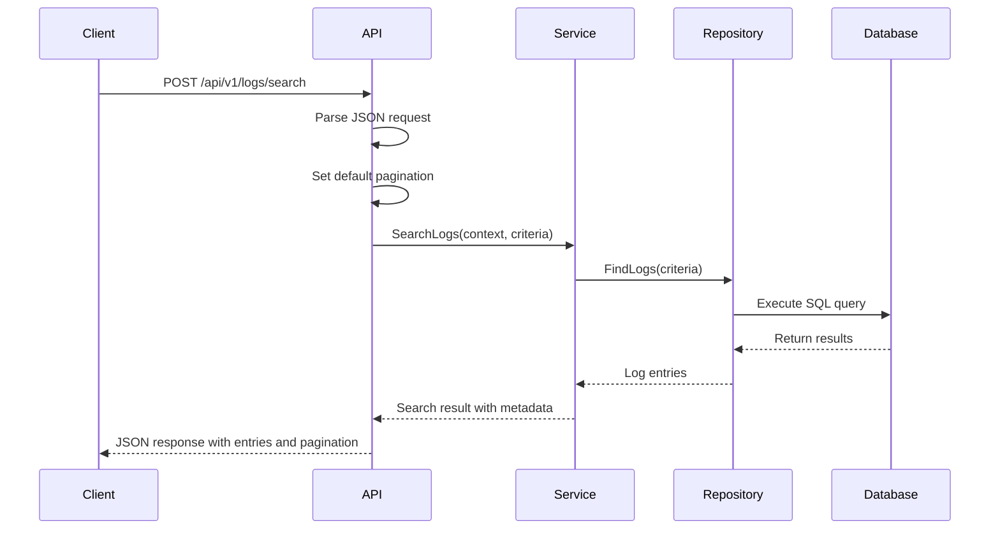
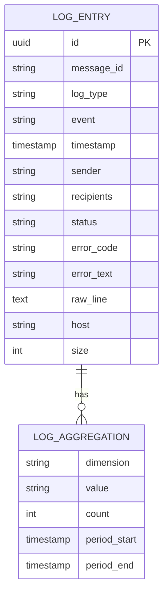
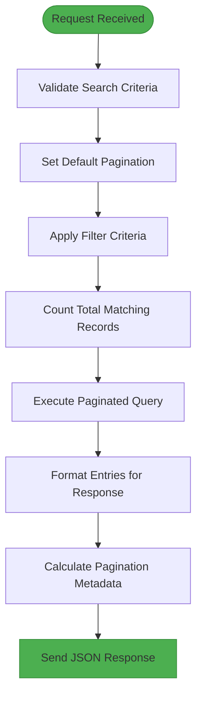
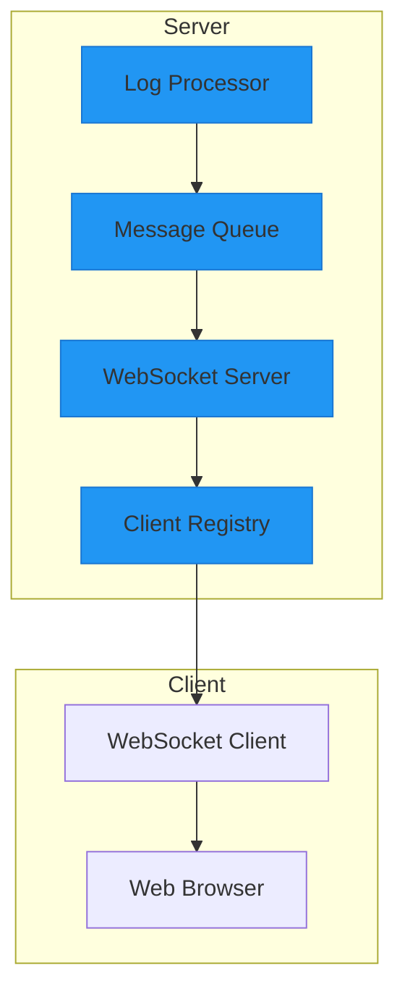
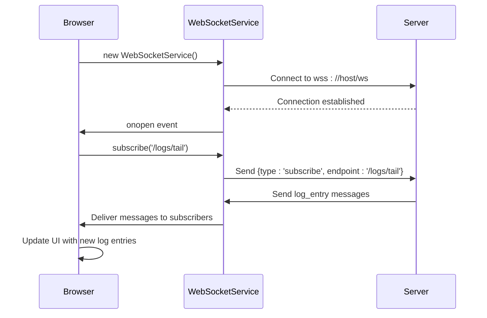
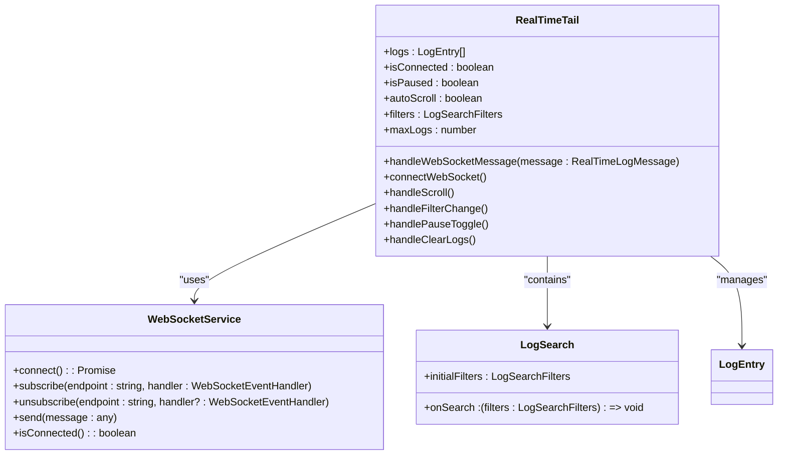

# Log Search and Streaming


## Table of Contents
1. [Introduction](#introduction)
2. [Log Search Implementation](#log-search-implementation)
3. [Database Query Patterns and Indexing](#database-query-patterns-and-indexing)
4. [Pagination and Response Formatting](#pagination-and-response-formatting)
5. [Real-Time Streaming Architecture](#real-time-streaming-architecture)
6. [WebSocket Integration and Client-Side Handling](#websocket-integration-and-client-side-handling)
7. [Client-Side Consumption Patterns](#client-side-consumption-patterns)
8. [Scalability and Performance Optimization](#scalability-and-performance-optimization)
9. [Query Performance Tuning](#query-performance-tuning)
10. [Common Pitfalls in Real-Time Stream Management](#common-pitfalls-in-real-time-stream-management)

## Introduction
The Log Search and Streaming functionality in the Exim-Pilot system provides powerful tools for analyzing email server logs. The system supports both historical log querying and real-time log monitoring through a combination of REST API endpoints and WebSocket connections. This document details the implementation of search capabilities, database optimization strategies, pagination mechanisms, and real-time streaming features that enable efficient log analysis at scale.

## Log Search Implementation

The log search functionality is implemented through a structured API endpoint that accepts complex filtering criteria and returns paginated results. The search system supports multiple filter types including message ID, sender, recipient, date range, and status filters, enabling precise log data retrieval.





**Diagram sources**
- [internal/api/log_handlers.go](file://internal/api/log_handlers.go#L129-L167)
- [internal/logprocessor/service.go](file://internal/logprocessor/service.go)

**Section sources**
- [internal/api/log_handlers.go](file://internal/api/log_handlers.go#L129-L167)
- [internal/logprocessor/search.go](file://internal/logprocessor/search.go)

The search functionality is exposed through the `handleLogsSearch` method in the `LogHandlers` struct, which processes incoming HTTP requests containing search criteria. The implementation follows a clean separation of concerns, with the API layer handling request parsing and response formatting, while delegating the actual search logic to the log service.

Key search capabilities include:
- **Message ID filtering**: Exact or partial matching of message identifiers
- **Sender/Recipient filtering**: Pattern matching on email addresses
- **Date range filtering**: Time-based constraints using RFC3339 format
- **Log type filtering**: Filtering by log category (main, reject, panic)
- **Event type filtering**: Filtering by specific log events (arrival, delivery, defer)
- **Status filtering**: Filtering by message processing status
- **Keyword searching**: Full-text search within raw log lines

## Database Query Patterns and Indexing

The database query patterns are designed for optimal performance when searching through large volumes of log data. The system leverages composite indexes and query optimization techniques to ensure fast response times even with complex filter combinations.





**Diagram sources**
- [internal/database/models.go](file://internal/database/models.go)
- [internal/database/schema.go](file://internal/database/schema.go)

**Section sources**
- [internal/database/repository.go](file://internal/database/repository.go)
- [internal/database/optimization.go](file://internal/database/optimization.go)

The database schema is optimized for log search operations with the following indexing strategy:

**Primary Indexes:**
- `idx_logs_timestamp`: B-tree index on timestamp for date range queries
- `idx_logs_message_id`: Hash index on message_id for exact lookups
- `idx_logs_sender`: GIN index on sender for pattern matching
- `idx_logs_recipients`: GIN index on recipients array for containment queries
- `idx_logs_log_type_event`: Composite index on log_type and event for type filtering

**Query Patterns:**
The system employs several query optimization techniques:

1. **Predicate Pushdown**: Filters are applied at the database level to minimize data transfer
2. **Index-Only Scans**: Frequently accessed fields are included in indexes to avoid table lookups
3. **Query Plan Caching**: Prepared statements are used for common query patterns
4. **Result Set Limiting**: LIMIT and OFFSET are applied before aggregation to reduce processing overhead

The search implementation in `search.go` constructs SQL queries dynamically based on the provided criteria, ensuring that only relevant indexes are used for each query. This approach prevents index bloat while maintaining query performance across various filter combinations.

## Pagination and Response Formatting

The pagination system implements a standard offset-based approach with configurable page size and automatic metadata generation. This ensures consistent response formatting and enables efficient navigation through large result sets.





**Diagram sources**
- [internal/api/log_handlers.go](file://internal/api/log_handlers.go#L129-L167)
- [internal/api/response.go](file://internal/api/response.go)

**Section sources**
- [internal/api/log_handlers.go](file://internal/api/log_handlers.go#L129-L167)
- [internal/api/response.go](file://internal/api/response.go)

The pagination implementation includes the following features:

- **Default page size**: 100 entries per page
- **Configurable limits**: Clients can request up to 1000 entries per page
- **Automatic offset calculation**: Based on page number and page size
- **Comprehensive metadata**: Includes total count, current page, and page count

The response format includes both the search results and metadata:


```json
{
  "entries": [
    {
      "id": 123,
      "timestamp": "2024-01-01T12:00:00Z",
      "message_id": "abc123-def456",
      "log_type": "main",
      "event": "arrival",
      "sender": "user@example.com",
      "recipients": ["recipient@example.com"],
      "status": "received",
      "raw_line": "2024-01-01 12:00:00 H=example.com [1.2.3.4] F=<user@example.com> A=plain_smtp:example_user id=abc123-def456"
    }
  ],
  "search_time": "12.345ms",
  "aggregations": {
    "by_log_type": {"main": 95, "reject": 5},
    "by_event": {"arrival": 80, "delivery": 15, "defer": 5}
  },
  "criteria": {
    "message_id": "abc123",
    "start_time": "2024-01-01T00:00:00Z",
    "end_time": "2024-01-01T23:59:59Z"
  }
}
```


The metadata object provides pagination information:


```json
{
  "meta": {
    "current_page": 1,
    "per_page": 100,
    "total_count": 150,
    "total_pages": 2,
    "links": {
      "self": "/api/v1/logs/search?page=1&per_page=100",
      "next": "/api/v1/logs/search?page=2&per_page=100",
      "last": "/api/v1/logs/search?page=2&per_page=100"
    }
  }
}
```


## Real-Time Streaming Architecture

The real-time streaming architecture is designed to deliver log entries to clients with minimal latency. While the current implementation has a placeholder for WebSocket functionality, the intended architecture follows a publish-subscribe pattern with server-side event broadcasting.





**Diagram sources**
- [internal/logprocessor/background_service.go](file://internal/logprocessor/background_service.go)
- [internal/logprocessor/streaming.go](file://internal/logprocessor/streaming.go)

**Section sources**
- [internal/logprocessor/streaming.go](file://internal/logprocessor/streaming.go)
- [internal/api/log_handlers.go](file://internal/api/log_handlers.go#L149-L167)

The intended streaming workflow:
1. Log entries are processed and parsed by the log processor
2. New entries are published to a message queue for distribution
3. The WebSocket server subscribes to the message queue
4. Incoming WebSocket connections are registered and managed
5. New log entries are broadcast to all connected clients
6. Clients receive entries in real-time and update the UI

The `handleLogsTail` endpoint in `log_handlers.go` currently returns a placeholder response indicating that WebSocket implementation is needed. This suggests that the real-time streaming feature is planned but not yet fully implemented.

## WebSocket Integration and Client-Side Handling

The client-side implementation of real-time log streaming is fully developed, even though the server-side WebSocket handler is currently a placeholder. The frontend uses a robust WebSocket service with automatic reconnection and subscription management.





**Diagram sources**
- [web/src/services/websocket.ts](file://web/src/services/websocket.ts)
- [web/src/components/Logs/RealTimeTail.tsx](file://web/src/components/Logs/RealTimeTail.tsx)

**Section sources**
- [web/src/services/websocket.ts](file://web/src/services/websocket.ts)
- [web/src/components/Logs/RealTimeTail.tsx](file://web/src/components/Logs/RealTimeTail.tsx)

The WebSocket service implementation includes the following features:

- **Automatic reconnection**: Attempts to reconnect up to 5 times with exponential backoff
- **Message parsing**: JSON parsing with error handling for malformed messages
- **Event handling**: Support for both event-based and subscription-based messaging
- **Connection state management**: Tracks connection status and notifies subscribers
- **Subscription management**: Allows multiple subscribers to the same endpoint

The service supports two messaging patterns:
1. **Event-based**: Messages with a `type` field that trigger event handlers
2. **Subscription-based**: Messages with an `endpoint` field delivered to subscribers

This dual approach provides flexibility for different use cases while maintaining a consistent API.

## Client-Side Consumption Patterns

The client-side consumption of log data follows a reactive pattern with state management and UI updates. The RealTimeTail component demonstrates best practices for handling real-time data streams in a web application.





**Diagram sources**
- [web/src/components/Logs/RealTimeTail.tsx](file://web/src/components/Logs/RealTimeTail.tsx)
- [web/src/services/websocket.ts](file://web/src/services/websocket.ts)

**Section sources**
- [web/src/components/Logs/RealTimeTail.tsx](file://web/src/components/Logs/RealTimeTail.tsx)

Key consumption patterns implemented:

**1. Message Filtering:**
Client-side filtering allows users to narrow the log stream without server round-trips:
- Filters are applied in the `handleWebSocketMessage` callback
- Multiple filter types are supported (message ID, sender, recipient, etc.)
- Filters can be combined for precise targeting

**2. Memory Management:**
To prevent memory leaks with continuous data streams:
- A maximum log count is enforced (default 1000)
- Older entries are automatically trimmed from the array
- The `maxLogs` setting is configurable by the user

**3. Auto-Scroll Control:**
Intelligent auto-scroll behavior enhances usability:
- Auto-scroll is enabled by default
- Manual scrolling disables auto-scroll temporarily
- Resuming auto-scroll is possible via UI control

**4. Connection Resilience:**
Robust handling of network interruptions:
- Connection status is displayed to the user
- Reconnection attempts are automatic
- Paused state is preserved across disconnections

**5. Export Functionality:**
Selected logs can be exported as CSV:
- Users can select individual or all visible logs
- Export includes all relevant log fields
- CSV formatting handles special characters properly

## Scalability and Performance Optimization

The system incorporates several scalability and performance optimization techniques to handle large datasets and concurrent requests efficiently.

**Database-Level Optimizations:**
- **Partitioning**: Log tables are partitioned by date to improve query performance
- **Indexing**: Strategic indexes on frequently queried fields
- **Vacuuming**: Regular vacuum operations to maintain index efficiency
- **Connection Pooling**: Database connection reuse to reduce overhead

**Application-Level Optimizations:**
- **Caching**: Frequently accessed data is cached in memory
- **Batch Processing**: Log entries are processed in batches when possible
- **Goroutine Pooling**: Worker pools manage concurrent operations
- **Memory Management**: Efficient data structures minimize memory usage

**Query Performance Considerations:**
- **Selective Filtering**: Early elimination of non-matching records
- **Projection**: Only requested fields are retrieved from the database
- **Aggregation Pushdown**: Aggregations are performed at the database level
- **Query Plan Optimization**: EXPLAIN ANALYZE used to identify bottlenecks

For handling concurrent search requests:
- **Rate Limiting**: Prevents abuse and ensures fair resource allocation
- **Request Queuing**: Excessive requests are queued rather than rejected
- **Resource Monitoring**: System tracks query execution times and resource usage
- **Timeouts**: Long-running queries are terminated to prevent system degradation

The system is designed to scale horizontally by:
- **Stateless API Layer**: Multiple API instances can be deployed behind a load balancer
- **Shared Database**: Centralized data storage accessible to all instances
- **Distributed Caching**: Cache layer can be distributed across nodes
- **Message Queue**: Decouples log processing from real-time distribution

## Query Performance Tuning

Effective query performance tuning requires understanding of both the data access patterns and the underlying database system. The following guidelines help optimize search queries:

**Index Optimization:**
- Create composite indexes for frequently combined filters
- Use partial indexes for skewed data distributions
- Monitor index usage and remove unused indexes
- Consider covering indexes for frequently accessed queries

**Query Structure Best Practices:**
- Use parameterized queries to enable plan caching
- Avoid SELECT *; specify only needed columns
- Use appropriate JOIN types and minimize their use
- Prefer EXISTS over IN for existence checks

**Performance Monitoring:**
- Enable slow query logging to identify problematic queries
- Use database-specific tools (e.g., pg_stat_statements for PostgreSQL)
- Monitor query execution plans for changes
- Track query frequency and execution time

**Common Performance Anti-Patterns to Avoid:**
- **N+1 Queries**: Fetching related data in a loop
- **Cartesian Products**: Missing JOIN conditions
- **Function-Based Predicates**: Applying functions to indexed columns
- **Over-Fetching**: Retrieving more data than needed

The system provides built-in performance metrics:
- Search execution time is included in responses
- Aggregation statistics help understand data distribution
- Query criteria are echoed in responses for debugging

For complex queries, consider:
- Breaking large queries into smaller, cached components
- Using materialized views for expensive aggregations
- Implementing application-level caching for common queries
- Pre-computing frequently accessed statistics

## Common Pitfalls in Real-Time Stream Management

While real-time log streaming provides valuable insights, it introduces several challenges that must be addressed to ensure reliability and performance.

**1. Connection Management:**
- **Problem**: Uncontrolled connection growth can exhaust server resources
- **Solution**: Implement connection limits and timeouts
- **Best Practice**: Use connection pooling and graceful degradation

**2. Message Backpressure:**
- **Problem**: Fast producers can overwhelm slow consumers
- **Solution**: Implement flow control and message buffering
- **Best Practice**: Use bounded queues with overflow policies

**3. State Synchronization:**
- **Problem**: Clients may miss messages during reconnection
- **Solution**: Implement message replay or sequence numbers
- **Best Practice**: Include timestamps and unique identifiers

**4. Memory Leaks:**
- **Problem**: Unreleased event listeners or subscriptions
- **Solution**: Ensure proper cleanup in component unmounting
- **Best Practice**: Use weak references where appropriate

**5. Network Efficiency:**
- **Problem**: Excessive small messages increase overhead
- **Solution**: Batch messages when possible
- **Best Practice**: Compress data for high-volume streams

**6. Security Considerations:**
- **Problem**: Unauthorized access to real-time data
- **Solution**: Enforce authentication and authorization
- **Best Practice**: Use encrypted connections (WSS)

**7. Client-Side Performance:**
- **Problem**: UI freezes with high message rates
- **Solution**: Use requestAnimationFrame for UI updates
- **Best Practice**: Implement virtual scrolling for large datasets

**8. Error Handling:**
- **Problem**: Unhandled errors crashing the stream
- **Solution**: Comprehensive error boundaries and retry logic
- **Best Practice**: Provide meaningful error messages to users

The current implementation shows awareness of these issues:
- The WebSocket service includes automatic reconnection
- Client-side filtering reduces unnecessary processing
- Memory limits prevent unbounded growth
- Connection status is exposed to the user interface

However, the placeholder nature of the server-side implementation suggests that some of these concerns may not yet be fully addressed in the backend system.

**Referenced Files in This Document**   
- [internal/api/log_handlers.go](file://internal/api/log_handlers.go#L129-L167)
- [internal/logprocessor/search.go](file://internal/logprocessor/search.go)
- [internal/logprocessor/streaming.go](file://internal/logprocessor/streaming.go)
- [web/src/components/Logs/RealTimeTail.tsx](file://web/src/components/Logs/RealTimeTail.tsx)
- [web/src/services/websocket.ts](file://web/src/services/websocket.ts)
- [internal/database/models.go](file://internal/database/models.go)
- [internal/database/repository.go](file://internal/database/repository.go)
- [internal/database/optimization.go](file://internal/database/optimization.go)