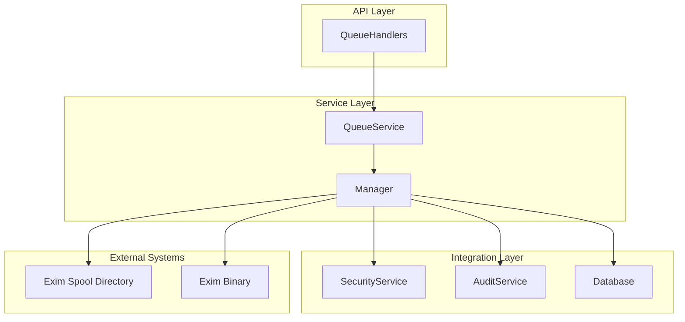
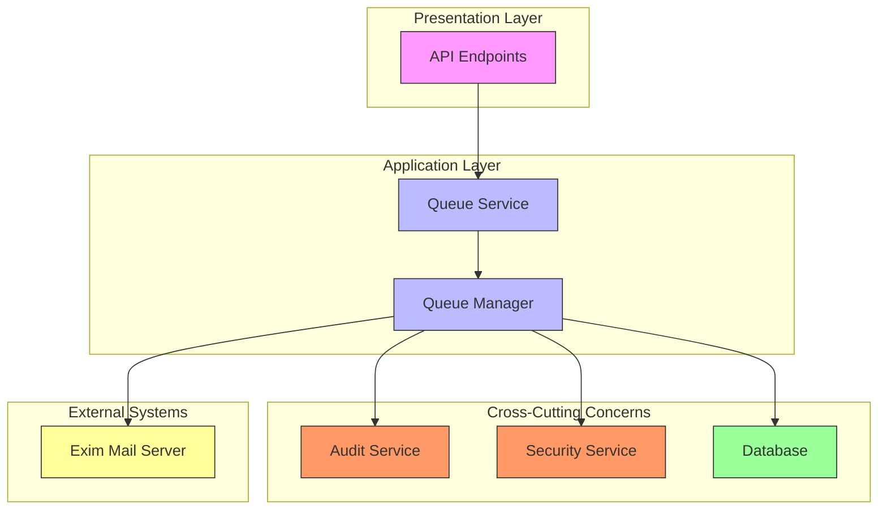
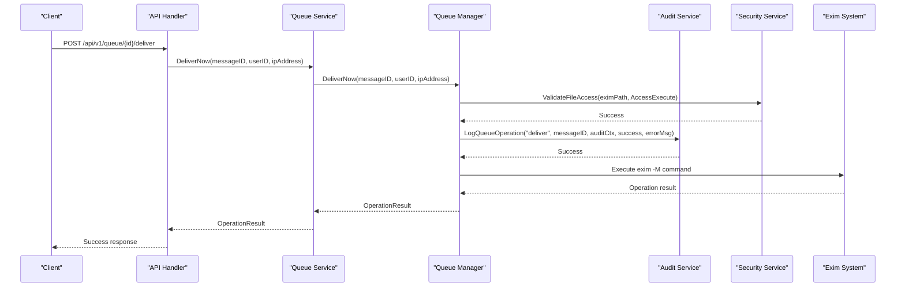
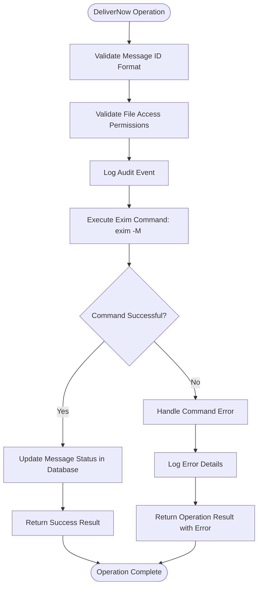
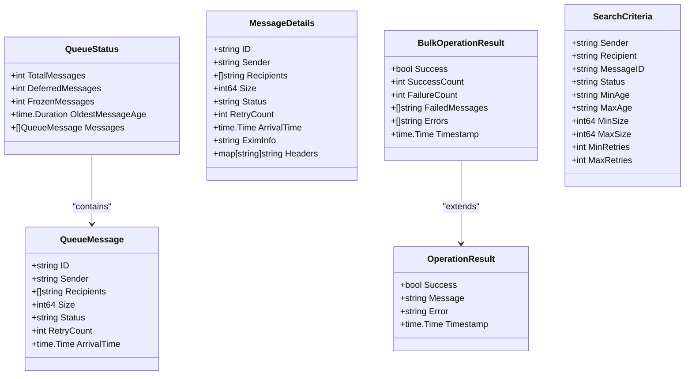
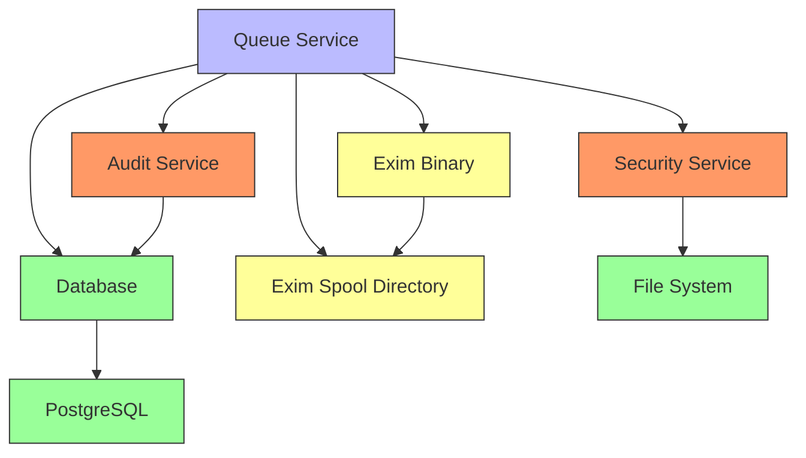

# Queue Service Architecture

## Table of Contents
1. [Introduction](#introduction)
2. [Project Structure](#project-structure)
3. [Core Components](#core-components)
4. [Architecture Overview](#architecture-overview)
5. [Detailed Component Analysis](#detailed-component-analysis)
6. [Dependency Analysis](#dependency-analysis)
7. [Performance Considerations](#performance-considerations)
8. [Troubleshooting Guide](#troubleshooting-guide)
9. [Conclusion](#conclusion)

## Introduction
The Queue Service in exim-pilot serves as the central orchestration layer between the API interface and the Exim mail server spool directory. It provides a secure, auditable, and transactionally consistent interface for managing email messages in the Exim queue. The service abstracts direct interaction with the Exim binary and file system, ensuring that all operations are properly validated, logged, and synchronized with the application's database state. This document details the architecture, design patterns, and operational characteristics of the queue service, providing guidance for extension and maintenance.

## Project Structure
The queue service is organized within the internal/queue package and consists of several key components that work together to provide queue management functionality. The service follows a layered architecture with clear separation of concerns between API handling, business logic, security validation, and data persistence.

**Diagram sources**
- [service.go](file://internal/queue/service.go#L1-L312)
- [queue_handlers.go](file://internal/api/queue_handlers.go#L1-L396)

**Section sources**
- [service.go](file://internal/queue/service.go#L1-L312)
- [queue_handlers.go](file://internal/api/queue_handlers.go#L1-L396)

## Core Components
The queue service consists of several core components that work together to provide comprehensive queue management capabilities. The Service struct acts as the primary interface exposed to the API layer, delegating operations to the underlying Manager which handles the actual interaction with the Exim system. The service ensures that all operations are properly audited through integration with the audit system and validated through the security service to prevent unauthorized access to system resources.

**Section sources**
- [service.go](file://internal/queue/service.go#L1-L312)
- [queue.go](file://internal/queue/queue.go#L1-L150)

## Architecture Overview
The queue service architecture follows a clean separation of concerns, with the Service layer providing a stable API interface while delegating implementation details to the Manager component. This design allows for easier testing and maintenance, as the Service can be mocked for API layer testing, while the Manager can be tested independently for Exim interaction logic. The architecture incorporates dependency injection for the database connection and Exim path configuration, promoting testability and configuration flexibility.

**Diagram sources**
- [service.go](file://internal/queue/service.go#L1-L312)
- [queue_handlers.go](file://internal/api/queue_handlers.go#L1-L396)

## Detailed Component Analysis

### Queue Service Analysis
The Queue Service acts as the primary interface between the API layer and the underlying queue management functionality. It implements a comprehensive set of methods for retrieving queue status, performing operations on messages, and providing statistical information. The service follows the dependency injection pattern, receiving its dependencies (database connection and Exim path) through the NewService constructor, which enhances testability and configuration flexibility.

#### For API/Service Components:

**Diagram sources**
- [service.go](file://internal/queue/service.go#L50-L312)
- [queue_handlers.go](file://internal/api/queue_handlers.go#L130-L150)

**Section sources**
- [service.go](file://internal/queue/service.go#L1-L312)
- [queue_handlers.go](file://internal/api/queue_handlers.go#L1-L396)

### Queue Manager Analysis
The Queue Manager component handles the actual interaction with the Exim system, including executing commands and parsing their output. It is responsible for maintaining consistency between the file system state and the database representation of the queue. The manager implements comprehensive error handling and validation to ensure that operations are performed safely and that the system remains in a consistent state even when operations fail.

#### For Complex Logic Components:

**Diagram sources**
- [operations.go](file://internal/queue/operations.go#L1-L200)
- [service.go](file://internal/queue/service.go#L220-L230)

**Section sources**
- [operations.go](file://internal/queue/operations.go#L1-L200)
- [service.go](file://internal/queue/service.go#L220-L230)

### Data Model Analysis
The queue service utilizes several key data structures to represent queue state and operation results. These structures are designed to provide comprehensive information to the API layer while maintaining a clean separation between internal representation and external API contracts. The data models include QueueStatus for overall queue information, MessageDetails for individual message inspection, and OperationResult for conveying the outcome of queue operations.

#### For Object-Oriented Components:

**Diagram sources**
- [queue.go](file://internal/queue/queue.go#L1-L150)
- [models.go](file://internal/database/models.go#L1-L50)

**Section sources**
- [queue.go](file://internal/queue/queue.go#L1-L150)
- [models.go](file://internal/database/models.go#L1-L50)

## Dependency Analysis
The queue service has well-defined dependencies on several key components within the exim-pilot system. It depends on the database package for persistence operations, the audit service for logging administrative actions, and the security service for validating file access permissions. The service also interacts directly with the Exim mail server binary and spool directory, requiring careful validation to prevent security vulnerabilities. These dependencies are injected through the service constructor, allowing for easy testing and configuration.

**Diagram sources**
- [service.go](file://internal/queue/service.go#L1-L312)
- [models.go](file://internal/database/models.go#L1-L50)

**Section sources**
- [service.go](file://internal/queue/service.go#L1-L312)
- [models.go](file://internal/database/models.go#L1-L50)

## Performance Considerations
The queue service implements several performance optimizations to handle large queue sizes efficiently. The GetQueueStatus method retrieves the entire queue state in a single operation, minimizing the number of interactions with the Exim system. For large queues, the service supports pagination through the API layer to prevent excessive memory usage and response times. The service also implements periodic queue snapshots through the StartPeriodicSnapshots method, which creates database records of queue state at regular intervals, enabling historical analysis without repeatedly querying the Exim system.

The search functionality is implemented as an in-memory filter on the complete queue listing, which is efficient for moderate queue sizes but may require optimization for very large queues. Future enhancements could include database-backed indexing of message attributes to enable more efficient searching. The bulk operations are implemented to process messages sequentially, with each operation properly audited and transactionally isolated to maintain data consistency.

## Troubleshooting Guide
When troubleshooting issues with the queue service, several key areas should be examined. First, check the application logs for any error messages related to queue operations, particularly security validation failures or Exim command execution errors. The audit logs can provide valuable information about recent operations and their outcomes, accessible through the GetOperationHistory method.

Common issues include permission problems when executing the Exim binary, which are handled by the security service's ValidateFileAccess method. If operations are failing with permission errors, verify that the exim-pilot process has execute permissions on the Exim binary and appropriate access to the spool directory. Another common issue is message ID validation failures, which can occur if the message ID format does not match Exim's expectations.

For performance issues with large queues, monitor the response times of the GetQueueStatus method and consider adjusting the snapshot interval to balance between real-time accuracy and system load. If search operations are slow, consider implementing database indexing on frequently searched message attributes.

**Section sources**
- [service.go](file://internal/queue/service.go#L1-L312)
- [service.go](file://internal/audit/service.go#L1-L287)
- [service.go](file://internal/security/service.go#L1-L425)

## Conclusion
The queue service in exim-pilot provides a robust, secure, and auditable interface for managing the Exim mail server queue. By abstracting direct interaction with the Exim system, the service ensures that all operations are properly validated, logged, and synchronized with the application's database state. The architecture follows sound design principles with clear separation of concerns, dependency injection, and comprehensive error handling. The service is well-positioned for future enhancements, such as improved search performance through database indexing or additional queue management operations. When extending the service with new operations, care should be taken to maintain transactional integrity, proper auditing, and security validation to preserve the system's reliability and security posture.

**Referenced Files in This Document**   
- [service.go](file://internal/queue/service.go)
- [queue.go](file://internal/queue/queue.go)
- [operations.go](file://internal/queue/operations.go)
- [queue_handlers.go](file://internal/api/queue_handlers.go)
- [service.go](file://internal/audit/service.go)
- [models.go](file://internal/database/models.go)
- [service.go](file://internal/security/service.go)