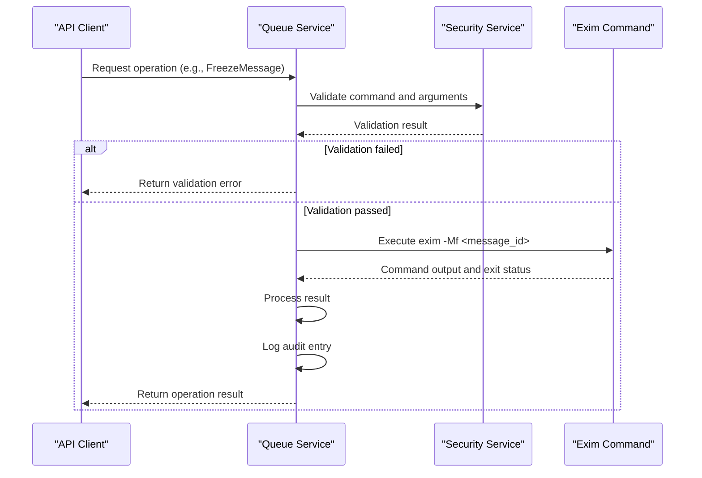
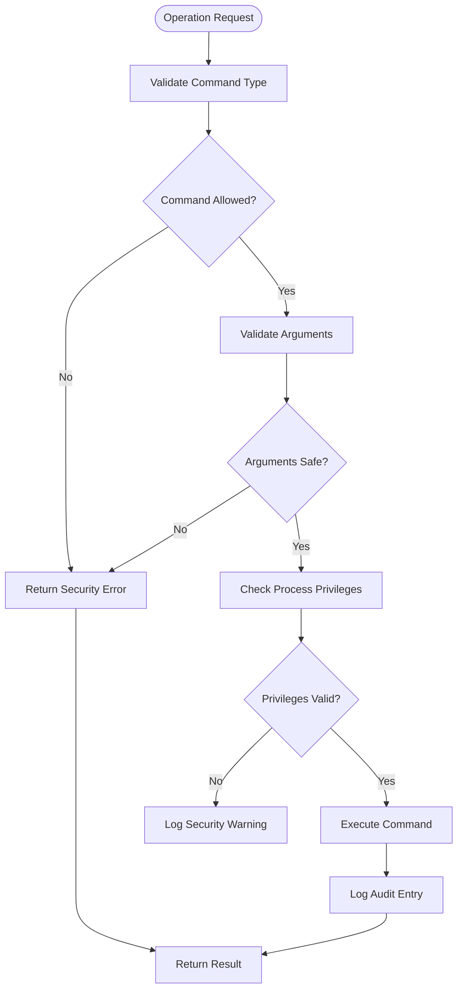
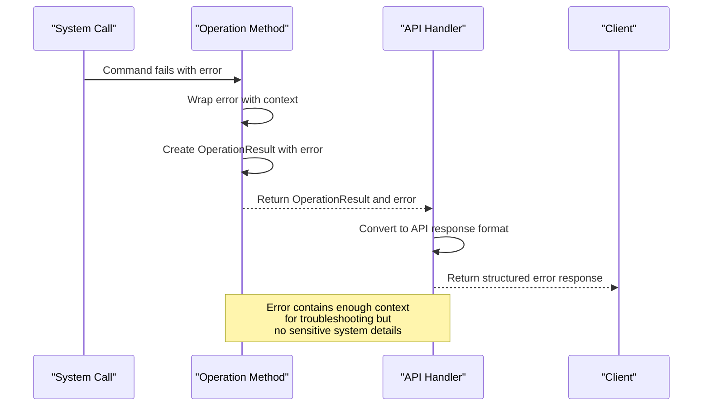

# Queue Operations Implementation


## Table of Contents
1. [Introduction](#introduction)
2. [Core Operations Implementation](#core-operations-implementation)
3. [Security and Privilege Control](#security-and-privilege-control)
4. [Error Handling and Propagation](#error-handling-and-propagation)
5. [Bulk Operations and Retry Mechanisms](#bulk-operations-and-retry-mechanisms)
6. [Usage Examples and Patterns](#usage-examples-and-patterns)
7. [Troubleshooting Guide](#troubleshooting-guide)

## Introduction
The Queue Operations module in Exim-Pilot provides a secure interface for direct interaction with Exim's command-line tools. This document details the implementation of core queue management functions including message delivery, freezing, thawing, and deletion. The system is designed with security, reliability, and auditability as primary concerns, implementing multiple layers of validation and protection when executing privileged system commands.

The implementation follows a service-oriented architecture where queue operations are mediated through a Manager that validates inputs, checks security policies, executes commands, and logs all actions for audit purposes. This approach ensures that direct interaction with the Exim mail transfer agent is performed safely and predictably.

**Section sources**
- [operations.go](file://internal/queue/operations.go#L1-L50)
- [queue.go](file://internal/queue/queue.go#L1-L50)

## Core Operations Implementation

### Direct Command Execution
The queue operations module implements direct interaction with Exim through Go's `os/exec` package, executing specific command-line tools with carefully constructed arguments. Each operation follows a consistent pattern of validation, execution, and result processing.





**Diagram sources**
- [operations.go](file://internal/queue/operations.go#L100-L150)
- [service.go](file://internal/security/service.go#L300-L350)

### Operation Functions
The core operations are implemented as methods on the Manager struct, each following the same security and logging pattern:

#### DeliverMessage (DeliverNow)
Forces immediate delivery attempt of a queued message using `exim -M`:


```go
func (m *Manager) DeliverNow(messageID string, userID string, ipAddress string) (*OperationResult, error) {
    result := &OperationResult{
        MessageID: messageID,
        Operation: "deliver_now",
    }

    // Security validation
    args := []string{"-M", messageID}
    if err := m.securityService.ValidateSystemCommand(m.eximPath, args); err != nil {
        result.Success = false
        result.Error = "Security validation failed: " + err.Error()
        return result, err
    }

    // Execute exim -M command
    cmd := exec.Command(m.eximPath, "-M", messageID)
    output, err := cmd.CombinedOutput()

    if err != nil {
        result.Success = false
        result.Error = fmt.Sprintf("Command failed: %v", err)
        result.Message = string(output)
    } else {
        result.Success = true
        result.Message = "Delivery attempt initiated"
    }

    // Audit logging
    m.logAuditAction("deliver_now", messageID, userID, ipAddress, result)
    return result, nil
}
```


#### FreezeMessage
Prevents a message from being delivered using `exim -Mf`:


```go
func (m *Manager) FreezeMessage(messageID string, userID string, ipAddress string) (*OperationResult, error) {
    result := &OperationResult{
        MessageID: messageID,
        Operation: "freeze",
    }

    // Security validation
    args := []string{"-Mf", messageID}
    if err := m.securityService.ValidateSystemCommand(m.eximPath, args); err != nil {
        result.Success = false
        result.Error = "Security validation failed: " + err.Error()
        return result, err
    }

    // Execute exim -Mf command
    cmd := exec.Command(m.eximPath, "-Mf", messageID)
    output, err := cmd.CombinedOutput()

    if err != nil {
        result.Success = false
        result.Error = fmt.Sprintf("Command failed: %v", err)
        result.Message = string(output)
    } else {
        result.Success = true
        result.Message = "Message frozen successfully"
    }

    m.logAuditAction("freeze", messageID, userID, ipAddress, result)
    return result, nil
}
```


#### DeleteMessage
Removes a message from the queue using `exim -Mrm`:


```go
func (m *Manager) DeleteMessage(messageID string, userID string, ipAddress string) (*OperationResult, error) {
    result := &OperationResult{
        MessageID: messageID,
        Operation: "delete",
    }

    // Security validation
    args := []string{"-Mrm", messageID}
    if err := m.securityService.ValidateSystemCommand(m.eximPath, args); err != nil {
        result.Success = false
        result.Error = "Security validation failed: " + err.Error()
        return result, err
    }

    // Execute exim -Mrm command
    cmd := exec.Command(m.eximPath, "-Mrm", messageID)
    output, err := cmd.CombinedOutput()

    if err != nil {
        result.Success = false
        result.Error = fmt.Sprintf("Command failed: %v", err)
        result.Message = string(output)
    } else {
        result.Success = true
        result.Message = "Message deleted successfully"
    }

    m.logAuditAction("delete", messageID, userID, ipAddress, result)
    return result, nil
}
```


**Section sources**
- [operations.go](file://internal/queue/operations.go#L50-L200)

## Security and Privilege Control

### Command Validation
The system implements multiple layers of security validation to prevent command injection and unauthorized operations. The Security Service validates both the command and its arguments before execution.





**Diagram sources**
- [service.go](file://internal/security/service.go#L300-L400)

### Input Validation and Sanitization
The security implementation includes comprehensive input validation to prevent command injection attacks:


```go
// ValidateSystemCommand validates system commands before execution
func (s *Service) ValidateSystemCommand(command string, args []string) error {
    // Only allow specific Exim commands
    allowedCommands := map[string]bool{
        "exim":            true,
        "exim4":           true,
        "/usr/sbin/exim":  true,
        "/usr/sbin/exim4": true,
    }

    if !allowedCommands[command] {
        log.Printf("SECURITY: Attempted execution of disallowed command: %s", command)
        return fmt.Errorf("command '%s' is not allowed", command)
    }

    // Validate command arguments
    for _, arg := range args {
        if err := s.validateCommandArgument(arg); err != nil {
            log.Printf("SECURITY: Invalid command argument: %s", arg)
            return fmt.Errorf("invalid command argument: %w", err)
        }
    }

    log.Printf("SECURITY: System command validation passed: %s %v", command, args)
    return nil
}

// validateCommandArgument validates individual command arguments
func (s *Service) validateCommandArgument(arg string) error {
    // Check for command injection attempts
    dangerousChars := []string{";", "&", "|", "`", "$", "(", ")", "<", ">", "\"", "'"}
    for _, char := range dangerousChars {
        if strings.Contains(arg, char) {
            return fmt.Errorf("argument contains dangerous character: %s", char)
        }
    }

    // Check for path traversal
    if strings.Contains(arg, "..") {
        return fmt.Errorf("argument contains path traversal sequence")
    }

    return nil
}
```


### Privilege Management
The system includes checks for process privileges to prevent running with excessive permissions:


```go
// CheckProcessPrivileges checks current process privileges
func (s *Service) CheckProcessPrivileges() error {
    // Check if running as root (UID 0)
    if os.Getuid() == 0 {
        log.Printf("SECURITY WARNING: Process is running as root (UID 0)")
        return fmt.Errorf("process should not run as root for security reasons")
    }

    // Check effective UID
    if os.Geteuid() == 0 {
        log.Printf("SECURITY WARNING: Process has effective UID 0 (root)")
        return fmt.Errorf("process should not have root privileges")
    }

    log.Printf("SECURITY: Process privileges check passed - UID: %d, EUID: %d", os.Getuid(), os.Geteuid())
    return nil
}
```


**Section sources**
- [service.go](file://internal/security/service.go#L300-L400)

## Error Handling and Propagation

### Error Propagation Pattern
The system implements a consistent error handling pattern that propagates errors from system calls through to API responses while maintaining security and usability:





**Diagram sources**
- [operations.go](file://internal/queue/operations.go#L100-L200)

### Operation Result Structure
Errors are propagated through the `OperationResult` struct which provides structured feedback:


```go
// OperationResult represents the result of a queue operation
type OperationResult struct {
    Success   bool   `json:"success"`
    MessageID string `json:"message_id"`
    Operation string `json:"operation"`
    Message   string `json:"message"`
    Error     string `json:"error,omitempty"`
}
```


This structure allows API handlers to return consistent responses regardless of the underlying operation:


```go
// Example error handling pattern
result, err := service.FreezeMessage(messageID, userID, ipAddress)
if err != nil {
    // Error from security validation or command execution
    return jsonResponse(w, map[string]interface{}{
        "success": false,
        "error":   result.Error,
        "message": result.Message,
    }, http.StatusBadRequest)
}

if !result.Success {
    // Operation failed but no Go error (e.g., command returned error)
    return jsonResponse(w, map[string]interface{}{
        "success": false,
        "error":   result.Error,
        "message": result.Message,
    }, http.StatusBadRequest)
}

// Operation successful
return jsonResponse(w, map[string]interface{}{
    "success": true,
    "message": result.Message,
}, http.StatusOK)
```


**Section sources**
- [operations.go](file://internal/queue/operations.go#L10-L30)
- [operations_example.go](file://internal/queue/operations_example.go#L197-L220)

## Bulk Operations and Retry Mechanisms

### Bulk Operation Implementation
The system provides bulk operations that apply actions to multiple messages efficiently:


```go
// performBulkOperation is a helper function for bulk operations
func (m *Manager) performBulkOperation(
    messageIDs []string,
    operation string,
    userID string,
    ipAddress string,
    operationFunc func(string, string, string) (*OperationResult, error),
) (*BulkOperationResult, error) {

    bulkResult := &BulkOperationResult{
        TotalMessages: len(messageIDs),
        Operation:     operation,
        Results:       make([]OperationResult, 0, len(messageIDs)),
    }

    // Perform operation on each message
    for _, messageID := range messageIDs {
        result, err := operationFunc(messageID, userID, ipAddress)
        if err != nil {
            // Create error result if operation function failed
            result = &OperationResult{
                Success:   false,
                MessageID: messageID,
                Operation: operation,
                Error:     err.Error(),
            }
        }

        bulkResult.Results = append(bulkResult.Results, *result)

        if result.Success {
            bulkResult.SuccessfulCount++
        } else {
            bulkResult.FailedCount++
        }
    }

    // Log bulk operation in audit trail
    m.logBulkAuditAction(operation, messageIDs, userID, ipAddress, bulkResult)
    return bulkResult, nil
}
```


### Retry Mechanisms
While the current implementation does not include automatic retry logic within the queue operations module, the design supports retry patterns through the structured error responses:


```go
// Example retry pattern implementation
func retryOperation(operation func() (*OperationResult, error), maxRetries int) (*OperationResult, error) {
    var result *OperationResult
    var err error
    
    for i := 0; i <= maxRetries; i++ {
        result, err = operation()
        if err == nil && result.Success {
            return result, nil
        }
        
        if i < maxRetries {
            // Wait before retry (exponential backoff could be implemented)
            time.Sleep(time.Duration(i+1) * time.Second)
            log.Printf("Retrying operation... attempt %d", i+2)
        }
    }
    
    return result, err
}

// Usage example
result, err := retryOperation(func() (*OperationResult, error) {
    return service.DeliverNow(messageID, userID, ipAddress)
}, 3)
```


The bulk operation results also facilitate retry of failed operations:


```go
// Handle partial failures in bulk operations
if result.FailedCount > 0 {
    fmt.Println("Failed operations:")
    failedIDs := []string{}
    for _, opResult := range result.Results {
        if !opResult.Success {
            fmt.Printf("- %s: %s\n", opResult.MessageID, opResult.Error)
            failedIDs = append(failedIDs, opResult.MessageID)
        }
    }
    
    // Retry failed operations
    if len(failedIDs) > 0 {
        retryResult, retryErr := service.BulkDeliverNow(failedIDs, userID, ipAddress)
        // Handle retry results
    }
}
```


**Section sources**
- [operations.go](file://internal/queue/operations.go#L300-L350)
- [operations_example.go](file://internal/queue/operations_example.go#L220-L255)

## Usage Examples and Patterns

### Basic Usage Pattern
The operations_example.go file demonstrates the correct usage patterns for queue operations:


```go
// Example 1: Single message operations
if len(status.Messages) > 0 {
    messageID := status.Messages[0].ID
    fmt.Printf("\n=== Operating on message: %s ===\n", messageID)

    // Inspect message details
    details, err := service.GetMessageDetails(messageID)
    if err != nil {
        log.Printf("Failed to get message details: %v", err)
    } else {
        fmt.Printf("Message size: %d bytes\n", details.Size)
        fmt.Printf("Sender: %s\n", details.Sender)
        fmt.Printf("Recipients: %v\n", details.Recipients)
    }

    // Freeze the message
    result, err := service.FreezeMessage(messageID, userID, ipAddress)
    if err != nil {
        log.Printf("Failed to freeze message: %v", err)
    } else {
        fmt.Printf("Freeze result: %s (success: %t)\n", result.Message, result.Success)
    }

    // Thaw the message
    result, err = service.ThawMessage(messageID, userID, ipAddress)
    if err != nil {
        log.Printf("Failed to thaw message: %v", err)
    } else {
        fmt.Printf("Thaw result: %s (success: %t)\n", result.Message, result.Success)
    }

    // Force delivery
    result, err = service.DeliverNow(messageID, userID, ipAddress)
    if err != nil {
        log.Printf("Failed to deliver message: %v", err)
    } else {
        fmt.Printf("Delivery result: %s (success: %t)\n", result.Message, result.Success)
    }
}
```


### Bulk Operations Pattern
Bulk operations allow efficient processing of multiple messages:


```go
// Example 3: Bulk operations
if len(status.Messages) >= 2 {
    messageIDs := []string{status.Messages[0].ID, status.Messages[1].ID}
    fmt.Printf("\n=== Bulk Operations on messages: %v ===\n", messageIDs)

    // Bulk freeze
    bulkResult, err := service.BulkFreeze(messageIDs, userID, ipAddress)
    if err != nil {
        log.Printf("Failed to bulk freeze: %v", err)
    } else {
        fmt.Printf("Bulk freeze: %d successful, %d failed\n",
            bulkResult.SuccessfulCount, bulkResult.FailedCount)
    }

    // Bulk thaw
    bulkResult, err = service.BulkThaw(messageIDs, userID, ipAddress)
    if err != nil {
        log.Printf("Failed to bulk thaw: %v", err)
    } else {
        fmt.Printf("Bulk thaw: %d successful, %d failed\n",
            bulkResult.SuccessfulCount, bulkResult.FailedCount)
    }
}
```


### Error Handling Pattern
Proper error handling ensures robust operation:


```go
// Example of proper error handling for queue operations
func ExampleErrorHandling() {
    service := &Service{} // Uninitialized service for demonstration

    // Validate message ID before operations
    messageID := "invalid-id"
    if err := service.ValidateMessageID(messageID); err != nil {
        fmt.Printf("Invalid message ID: %v\n", err)
        return
    }

    // Handle operation failures gracefully
    result, err := service.DeliverNow(messageID, "user", "127.0.0.1")
    if err != nil {
        fmt.Printf("Operation failed: %v\n", err)
        return
    }

    if !result.Success {
        fmt.Printf("Operation unsuccessful: %s\n", result.Error)
        // Could implement retry logic here
        return
    }

    fmt.Printf("Operation successful: %s\n", result.Message)
}
```


**Section sources**
- [operations_example.go](file://internal/queue/operations_example.go#L50-L255)

## Troubleshooting Guide

### Permission Denied Errors
Permission denied errors typically occur when the application lacks sufficient privileges to execute Exim commands or access the spool directory.

**Common causes:**
- Running the application as a user without permission to execute Exim
- Incorrect file permissions on the Exim binary or spool directory
- SELinux or AppArmor restrictions

**Solutions:**
1. Ensure the application runs as the same user that Exim uses (typically `Debian-exim` on Debian/Ubuntu)
2. Verify the Exim binary is executable:
   
```bash
   sudo chmod +x /usr/sbin/exim4
   ```

3. Check spool directory permissions:
   
```bash
   sudo chown -R Debian-exim:Debian-exim /var/spool/exim4
   sudo chmod -R 750 /var/spool/exim4
   ```

4. Configure the application to drop privileges appropriately in config.yaml:
   
```yaml
   exim:
     queue_run_user: "Debian-exim"
   ```


### Spool Corruption Issues
Spool corruption can prevent queue operations from succeeding.

**Symptoms:**
- Operations fail with "malformed message" errors
- Inconsistent queue listings
- Missing message files

**Diagnosis:**
1. Check spool directory integrity:
   
```bash
   sudo exim4 -bh  # Check spool headers
   sudo exim4 -bp  # List queue (verify consistency)
   ```

2. Look for orphaned files:
   
```bash
   ls -la /var/spool/exim4/input/ | grep -v "^[d-]"
   ```


**Recovery:**
1. Stop the Exim service:
   
```bash
   sudo systemctl stop exim4
   ```

2. Backup the spool directory:
   
```bash
   sudo cp -r /var/spool/exim4 /var/spool/exim4.backup
   ```

3. Run spool cleanup:
   
```bash
   sudo exim4 -qff  # Force delivery of all messages
   ```

4. Restart the service:
   
```bash
   sudo systemctl start exim4
   ```


### Command Execution Failures
When Exim commands fail to execute:

**Check:**
1. Exim binary path in configuration:
   
```yaml
   exim:
     binary_path: "/usr/sbin/exim4"
   ```

2. Validate the binary exists and is executable:
   
```bash
   ls -la /usr/sbin/exim4
   /usr/sbin/exim4 -bV  # Test basic functionality
   ```

3. Check system logs for Exim errors:
   
```bash
   sudo tail -f /var/log/exim4/mainlog
   sudo tail -f /var/log/exim4/paniclog
   ```


**Section sources**
- [service.go](file://internal/security/service.go#L100-L200)
- [operations.go](file://internal/queue/operations.go#L100-L200)

**Referenced Files in This Document**   
- [operations.go](file://internal/queue/operations.go)
- [queue.go](file://internal/queue/queue.go)
- [operations_example.go](file://internal/queue/operations_example.go)
- [service.go](file://internal/security/service.go)