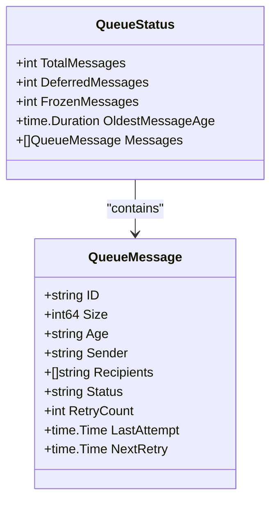
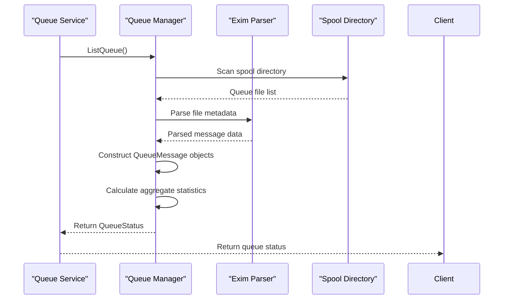
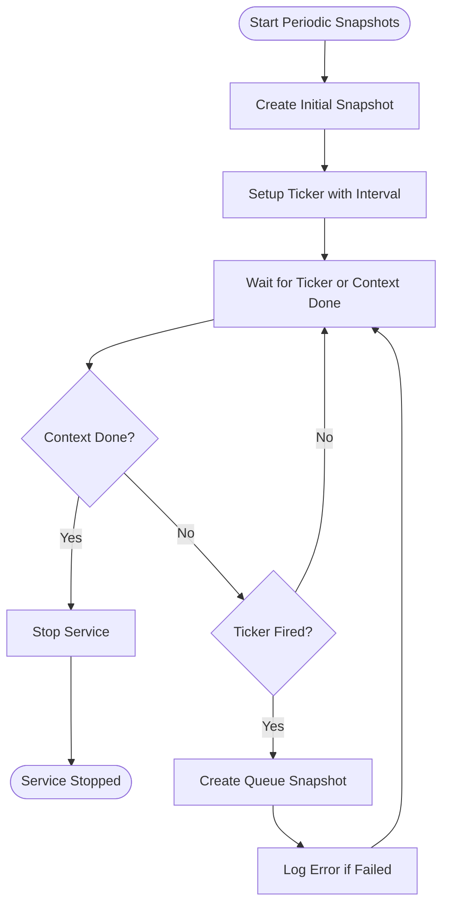
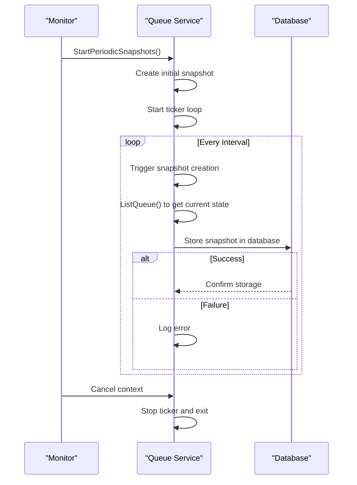
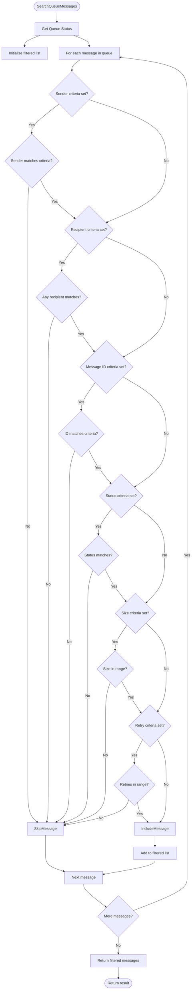
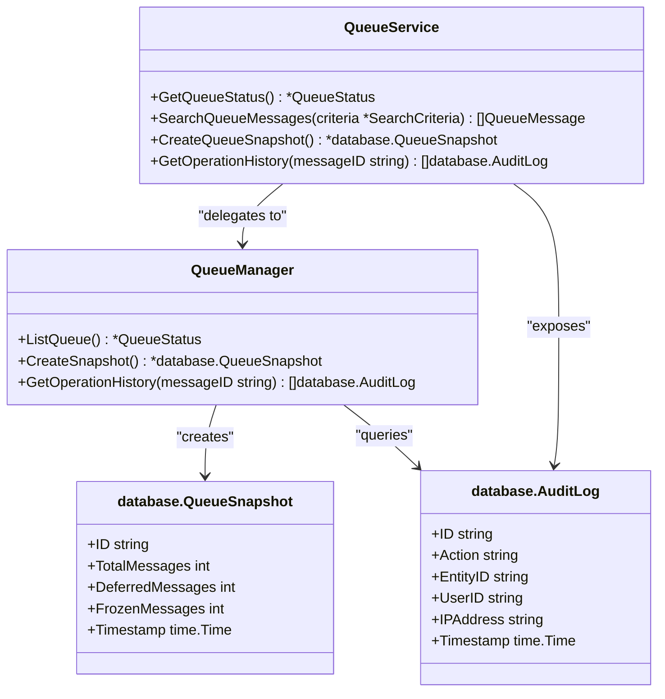
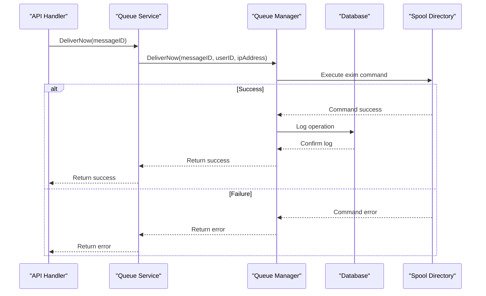

# Queue State Abstraction


## Table of Contents
1. [Introduction](#introduction)
2. [Core Data Structures](#core-data-structures)
3. [Queue Parsing and Metadata Extraction](#queue-parsing-and-metadata-extraction)
4. [Caching and Performance Optimization](#caching-and-performance-optimization)
5. [Change Detection and Synchronization](#change-detection-and-synchronization)
6. [Filtering, Sorting, and Search Operations](#filtering-sorting-and-search-operations)
7. [Database Integration and Consistency](#database-integration-and-consistency)
8. [API Operations and Service Layer](#api-operations-and-service-layer)

## Introduction
The Queue State Abstraction layer in the Exim Pilot system provides an in-memory representation of the Exim mail queue state, enabling efficient querying, manipulation, and monitoring of queued messages. This abstraction bridges the gap between the physical spool directory structure and the application's need for structured, queryable data. The system parses Exim queue files to extract metadata, maintains an optimized in-memory model, and provides comprehensive operations for message management through a well-defined service interface.

**Section sources**
- [service.go](file://internal/queue/service.go#L1-L311)
- [queue.go](file://internal/queue/queue.go#L16-L35)

## Core Data Structures

The queue abstraction is built around several key data structures that model the Exim mail queue state in memory.

### QueueMessage Structure
The `QueueMessage` struct represents an individual message in the queue with its essential metadata:


```go
type QueueMessage struct {
	ID          string    `json:"id"`
	Size        int64     `json:"size"`
	Age         string    `json:"age"`
	Sender      string    `json:"sender"`
	Recipients  []string  `json:"recipients"`
	Status      string    `json:"status"` // queued, deferred, frozen
	RetryCount  int       `json:"retry_count"`
	LastAttempt time.Time `json:"last_attempt"`
	NextRetry   time.Time `json:"next_retry"`
}
```


This structure captures all critical information about a queued message, including its unique identifier, size, age, sender and recipient information, delivery status, retry statistics, and scheduling information for delivery attempts.

### QueueStatus Structure
The `QueueStatus` struct represents the overall state of the mail queue:


```go
type QueueStatus struct {
	TotalMessages    int            `json:"total_messages"`
	DeferredMessages int            `json:"deferred_messages"`
	FrozenMessages   int            `json:"frozen_messages"`
	OldestMessageAge time.Duration  `json:"oldest_message_age"`
	Messages         []QueueMessage `json:"messages"`
}
```


This structure provides both aggregate statistics about the queue (total message count, counts by status type, and age of the oldest message) and the complete list of messages, enabling both high-level monitoring and detailed inspection.





**Diagram sources**
- [queue.go](file://internal/queue/queue.go#L16-L35)

**Section sources**
- [queue.go](file://internal/queue/queue.go#L16-L35)

## Queue Parsing and Metadata Extraction

The queue abstraction integrates with the parser package to extract metadata from Exim queue files. While the specific parser implementation details are not fully visible in the provided context, the integration pattern is evident through the service layer.

The `Manager` component (referenced in `service.go`) is responsible for parsing queue file metadata and constructing the in-memory representation. This parsing process involves:

1. Reading the Exim spool directory structure
2. Extracting message metadata from queue files
3. Converting raw data into structured `QueueMessage` objects
4. Calculating derived properties like message age and status

The parsing logic handles various data formats and units, such as size specifications (e.g., "123", "456K", "2M", "1G") which are converted to byte counts for consistent processing.





**Diagram sources**
- [service.go](file://internal/queue/service.go#L46-L58)
- [queue.go](file://internal/queue/queue.go)

## Caching and Performance Optimization

The system employs a snapshot-based caching strategy to optimize performance and enable historical analysis of queue state.

### Periodic Queue Snapshots
The service implements a background process that creates periodic snapshots of the queue state:


```go
func (s *Service) StartPeriodicSnapshots(ctx context.Context, interval time.Duration) {
	ticker := time.NewTicker(interval)
	defer ticker.Stop()

	// Create initial snapshot
	if _, err := s.CreateQueueSnapshot(); err != nil {
		log.Printf("Failed to create initial queue snapshot: %v", err)
	}

	for {
		select {
		case <-ctx.Done():
			log.Println("Stopping periodic queue snapshots")
			return
		case <-ticker.C:
			if _, err := s.CreateQueueSnapshot(); err != nil {
				log.Printf("Failed to create queue snapshot: %v", err)
			}
		}
	}
}
```


These snapshots are stored in the database and serve multiple purposes:
- Performance optimization by reducing direct spool directory access
- Historical trend analysis and growth monitoring
- Recovery point for queue state reconstruction

### Health Metrics Caching
The system leverages snapshots to calculate queue health metrics efficiently:


```go
// Calculate growth trend by comparing with recent snapshots
repo := database.NewQueueSnapshotRepository(s.db)
recent, err := repo.List(5, 0, nil, nil) // Get last 5 snapshots
if err == nil && len(recent) > 1 {
	// Calculate average growth over recent snapshots
	var totalGrowth int
	for i := 0; i < len(recent)-1; i++ {
		growth := recent[i].TotalMessages - recent[i+1].TotalMessages
		totalGrowth += growth
	}
	health.GrowthTrend = totalGrowth / (len(recent) - 1)
}
```


This approach avoids expensive real-time calculations by using pre-computed snapshot data.





**Diagram sources**
- [service.go](file://internal/queue/service.go#L46-L93)

**Section sources**
- [service.go](file://internal/queue/service.go#L46-L93)

## Change Detection and Synchronization

The system detects queue changes through periodic polling and snapshot comparison. Rather than implementing file system watchers, it uses a polling-based approach with configurable intervals.

### Change Detection Mechanism
The `GetQueueHealth` method demonstrates the change detection logic by comparing recent snapshots:


```go
// Calculate growth trend by comparing with recent snapshots
repo := database.NewQueueSnapshotRepository(s.db)
recent, err := repo.List(5, 0, nil, nil) // Get last 5 snapshots
if err == nil && len(recent) > 1 {
	// Calculate average growth over recent snapshots
	var totalGrowth int
	for i := 0; i < len(recent)-1; i++ {
		growth := recent[i].TotalMessages - recent[i+1].TotalMessages
		totalGrowth += growth
	}
	health.GrowthTrend = totalGrowth / (len(recent) - 1)
}
```


This comparison of consecutive snapshots allows the system to detect trends in queue growth or reduction, effectively identifying changes in queue state over time.

### Synchronization Strategy
The synchronization process follows these steps:
1. Poll the spool directory at regular intervals
2. Parse the current queue state
3. Create a snapshot of the current state
4. Store the snapshot in the database
5. Update in-memory representations as needed

This approach ensures that the in-memory state remains consistent with the actual spool directory while minimizing performance impact.





**Diagram sources**
- [service.go](file://internal/queue/service.go#L46-L93)

## Filtering, Sorting, and Search Operations

The queue abstraction provides comprehensive search and filtering capabilities through the `SearchQueueMessages` method.

### Search Criteria
The `SearchCriteria` struct defines the parameters for message filtering:


```go
type SearchCriteria struct {
	Sender     string `json:"sender"`
	Recipient  string `json:"recipient"`
	MessageID  string `json:"message_id"`
	Status     string `json:"status"`
	MinAge     string `json:"min_age"`
	MaxAge     string `json:"max_age"`
	MinSize    int64  `json:"min_size"`
	MaxSize    int64  `json:"max_size"`
	MinRetries int    `json:"min_retries"`
	MaxRetries int    `json:"max_retries"`
}
```


### Filtering Logic
The `matchesCriteria` method implements the filtering logic:


```go
func (s *Service) matchesCriteria(msg *QueueMessage, criteria *SearchCriteria) bool {
	if criteria.Sender != "" && !contains(msg.Sender, criteria.Sender) {
		return false
	}

	if criteria.Recipient != "" {
		found := false
		for _, recipient := range msg.Recipients {
			if contains(recipient, criteria.Recipient) {
				found = true
				break
			}
		}
		if !found {
			return false
		}
	}

	// Additional criteria checks...
	return true
}
```


The filtering supports:
- Sender and recipient pattern matching
- Message ID filtering
- Status filtering (queued, deferred, frozen)
- Size range filtering
- Retry count range filtering
- Age-based filtering (planned)





**Diagram sources**
- [service.go](file://internal/queue/service.go#L150-L190)

**Section sources**
- [service.go](file://internal/queue/service.go#L150-L190)

## Database Integration and Consistency

The queue abstraction maintains synchronization between the in-memory state and the database through a well-defined integration pattern.

### Snapshot Storage
Queue snapshots are stored in the database to provide historical data and improve performance:


```go
func (s *Service) CreateQueueSnapshot() (*database.QueueSnapshot, error) {
	return s.manager.CreateSnapshot()
}
```


The `QueueSnapshot` model in the database preserves queue state at specific points in time, enabling trend analysis and recovery.

### Operation History
The system maintains audit logs of queue operations, ensuring traceability and consistency:


```go
func (s *Service) GetOperationHistory(messageID string) ([]database.AuditLog, error) {
	return s.manager.GetOperationHistory(messageID)
}
```


This integration ensures that all state changes are recorded and can be audited.

### Consistency Mechanisms
The system resolves inconsistencies through several mechanisms:

1. **Periodic Synchronization**: Regular snapshots ensure the database state remains aligned with the spool directory
2. **Atomic Operations**: Queue operations are designed to update both the spool directory and database records atomically
3. **Validation**: Message IDs are validated before operations to prevent inconsistencies
4. **Error Handling**: Comprehensive error handling ensures partial failures are detected and addressed





**Diagram sources**
- [service.go](file://internal/queue/service.go)
- [database.go](file://internal/database/models.go)

**Section sources**
- [service.go](file://internal/queue/service.go#L1-L311)

## API Operations and Service Layer

The `Service` struct provides a comprehensive API for queue management operations, serving as the primary interface between the application and the queue system.

### Service Interface
The service layer exposes methods for:
- Queue status retrieval
- Message inspection
- Search and filtering
- Individual message operations (deliver now, freeze, thaw, delete)
- Bulk operations
- Operation history retrieval
- Queue health monitoring

### Operation Methods
The service implements both individual and bulk operations:


```go
// Individual operations
func (s *Service) DeliverNow(messageID string, userID string, ipAddress string) (*OperationResult, error)
func (s *Service) FreezeMessage(messageID string, userID string, ipAddress string) (*OperationResult, error)
func (s *Service) ThawMessage(messageID string, userID string, ipAddress string) (*OperationResult, error)
func (s *Service) DeleteMessage(messageID string, userID string, ipAddress string) (*OperationResult, error)

// Bulk operations
func (s *Service) BulkDeliverNow(messageIDs []string, userID string, ipAddress string) (*BulkOperationResult, error)
func (s *Service) BulkFreeze(messageIDs []string, userID string, ipAddress string) (*BulkOperationResult, error)
func (s *Service) BulkThaw(messageIDs []string, userID string, ipAddress string) (*BulkOperationResult, error)
func (s *Service) BulkDelete(messageIDs []string, userID string, ipAddress string) (*BulkOperationResult, error)
```


These methods delegate to the `Manager` component while handling cross-cutting concerns like audit logging and error handling.





**Diagram sources**
- [service.go](file://internal/queue/service.go#L200-L250)
- [queue_handlers.go](file://internal/api/queue_handlers.go)

**Section sources**
- [service.go](file://internal/queue/service.go#L200-L250)

**Referenced Files in This Document**   
- [queue.go](file://internal/queue/queue.go#L16-L35)
- [service.go](file://internal/queue/service.go#L1-L311)
- [queue_handlers.go](file://internal/api/queue_handlers.go)
- [parser.go](file://internal/parser/exim_parser.go)
- [database.go](file://internal/database/models.go)
- [Queue.tsx](file://web/src/components/Queue/Queue.tsx)
- [queue.ts](file://web/src/types/queue.ts)