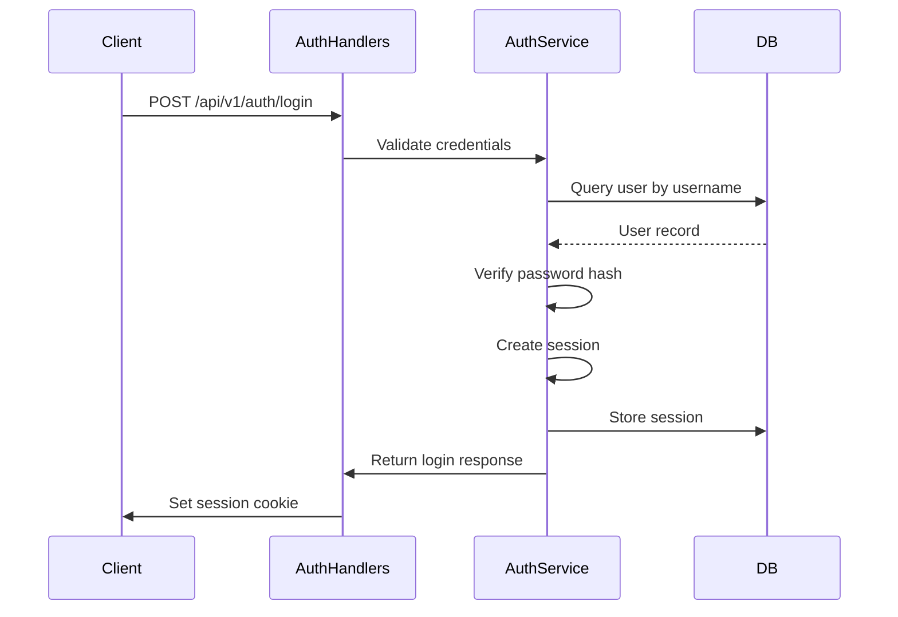

# Queue API Endpoints


## Table of Contents
1. [Introduction](#introduction)
2. [Authentication and Authorization](#authentication-and-authorization)
3. [API Response Format](#api-response-format)
4. [WebSocket Event Notifications](#websocket-event-notifications)
5. [GET /api/v1/queue - List Queue Messages](#get-apiv1queue---list-queue-messages)
6. [POST /api/v1/queue/actions/deliver - Deliver Messages](#post-apiv1queueactionsdeliver---deliver-messages)
7. [POST /api/v1/queue/actions/freeze - Freeze Messages](#post-apiv1queueactionsfreeze---freeze-messages)
8. [POST /api/v1/queue/actions/thaw - Thaw Messages](#post-apiv1queueactionsthaw---thaw-messages)
9. [DELETE /api/v1/queue - Delete Messages](#delete-apiv1queue---delete-messages)
10. [Error Handling](#error-handling)
11. [Appendices](#appendices)

## Introduction
The Queue API Endpoints provide RESTful interfaces for managing the email message queue in exim-pilot. These endpoints allow administrators to view, search, and perform operations on messages in the Exim mail queue, including delivering, freezing, thawing, and deleting messages. The API supports both individual message operations and bulk operations for efficiency.

The queue management system integrates with the underlying Exim MTA (Mail Transfer Agent) to perform actual queue operations while providing a secure, audited, and user-friendly interface. All operations are logged in the audit trail, and real-time notifications are sent via WebSocket to keep the frontend interface updated.

**Section sources**
- [queue_handlers.go](file://internal/api/queue_handlers.go#L0-L395)
- [service.go](file://internal/queue/service.go#L0-L311)

## Authentication and Authorization
All queue management endpoints require authentication using session-based authentication. The system uses a cookie-based session mechanism rather than JWT tokens as initially specified. When a user logs in successfully, a session cookie named "session_id" is set, which must be included in subsequent requests to protected endpoints.

### Authentication Flow




**Diagram sources**
- [auth_handlers.go](file://internal/api/auth_handlers.go#L48-L100)
- [service.go](file://internal/auth/service.go#L0-L45)

### Role-Based Access Control
The current implementation includes basic authentication but does not implement granular role-based access control. All authenticated users have the same permissions to perform queue operations. The system captures the user ID and IP address for audit purposes, but access decisions are based solely on authentication status.

The authentication middleware is implemented in the Server struct and applied to all protected routes:


```go
func (s *Server) authMiddleware(next http.Handler) http.Handler {
	return http.HandlerFunc(func(w http.ResponseWriter, r *http.Request) {
		// Skip authentication for login and health endpoints
		if r.URL.Path == "/api/v1/auth/login" || r.URL.Path == "/api/v1/health" {
			next.ServeHTTP(w, r)
			return
		}

		// Get session ID from cookie
		cookie, err := r.Cookie("session_id")
		if err != nil {
			response := APIResponse{
				Success: false,
				Error:   "Authentication required",
			}
			WriteJSONResponse(w, http.StatusUnauthorized, response)
			return
		}

		// Validate session
		user, err := s.authService.ValidateSession(cookie.Value)
		if err != nil {
			response := APIResponse{
				Success: false,
				Error:   "Invalid session",
			}
			WriteJSONResponse(w, http.StatusUnauthorized, response)
			return
		}

		// Add user to request context
		ctx := r.Context()
		ctx = SetUserInContext(ctx, user)
		r = r.WithContext(ctx)

		next.ServeHTTP(w, r)
	})
}
```


**Section sources**
- [middleware.go](file://internal/api/middleware.go#L65-L102)
- [auth_handlers.go](file://internal/api/auth_handlers.go#L0-L51)

## API Response Format
All API endpoints use a standardized response format defined by the APIResponse struct. This consistent format makes it easier for clients to handle responses and errors uniformly across different endpoints.

### Response Structure

```go
type APIResponse struct {
	Success bool        `json:"success"`
	Data    interface{} `json:"data,omitempty"`
	Error   string      `json:"error,omitempty"`
	Meta    *Meta       `json:"meta,omitempty"`
}

type Meta struct {
	Page       int `json:"page,omitempty"`
	PerPage    int `json:"per_page,omitempty"`
	Total      int `json:"total,omitempty"`
	TotalPages int `json:"total_pages,omitempty"`
}
```


The response always includes a `success` boolean field indicating whether the request was successful. On success, the `data` field contains the response payload. On failure, the `error` field contains an error message. The `meta` field is used for pagination information in list responses.

### Helper Functions
The API provides several helper functions for generating standardized responses:


```go
func WriteSuccessResponse(w http.ResponseWriter, data interface{})
func WriteSuccessResponseWithMeta(w http.ResponseWriter, data interface{}, meta *Meta)
func WriteErrorResponse(w http.ResponseWriter, statusCode int, message string)
func WriteBadRequestResponse(w http.ResponseWriter, message string)
func WriteNotFoundResponse(w http.ResponseWriter, message string)
func WriteInternalErrorResponse(w http.ResponseWriter, message string)
```


**Section sources**
- [response.go](file://internal/api/response.go#L0-L91)
- [queue_handlers.go](file://internal/api/queue_handlers.go#L133-L179)

## WebSocket Event Notifications
After queue modifications, the system triggers WebSocket events to notify connected clients of changes. This enables real-time updates in the frontend interface without requiring polling.

### WebSocket Implementation
The frontend WebSocket service establishes a connection to the server's WebSocket endpoint and can subscribe to specific endpoints for real-time updates:


```typescript
class WebSocketService {
  private ws: WebSocket | null = null;
  private eventHandlers: Map<string, WebSocketEventHandler[]> = new Map();
  private subscriptions: Map<string, WebSocketEventHandler[]> = new Map();

  connect(): Promise<void> {
    return new Promise((resolve, reject) => {
      try {
        this.ws = new WebSocket(this.url);
        
        this.ws.onopen = () => {
          console.log('WebSocket connected');
          this.reconnectAttempts = 0;
          resolve();
        };

        this.ws.onmessage = (event) => {
          try {
            const message = JSON.parse(event.data);
            this.handleMessage(message);
          } catch (error) {
            console.error('Failed to parse WebSocket message:', error);
          }
        };
      } catch (error) {
        reject(error);
      }
    });
  }

  private handleMessage(message: any) {
    const { type, data, endpoint } = message;
    
    // Handle subscription-based messages
    if (endpoint) {
      const handlers = this.subscriptions.get(endpoint) || [];
      handlers.forEach(handler => handler(message));
    } else {
      // Handle event-based messages
      const handlers = this.eventHandlers.get(type) || [];
      handlers.forEach(handler => handler(data));
    }
  }

  // Subscription methods for specific endpoints
  subscribe(endpoint: string, handler: WebSocketEventHandler) {
    if (!this.subscriptions.has(endpoint)) {
      this.subscriptions.set(endpoint, []);
    }
    this.subscriptions.get(endpoint)!.push(handler);

    // Send subscription message to server
    this.send({
      type: 'subscribe',
      endpoint: endpoint
    });
  }
}
```


When queue modifications occur (deliver, freeze, thaw, delete), the server should broadcast events to subscribed clients, though the exact server-side implementation details are not available in the provided code.

**Section sources**
- [websocket.ts](file://web/src/services/websocket.ts#L0-L42)
- [websocket.ts](file://web/src/services/websocket.ts#L80-L133)

## GET /api/v1/queue - List Queue Messages
Retrieves a list of messages in the queue with optional filtering, sorting, and pagination.

### Endpoint Details
- **HTTP Method**: GET
- **URL**: `/api/v1/queue`
- **Authentication Required**: Yes
- **Content-Type**: application/json

### Query Parameters
| Parameter | Type | Required | Default | Description |
|---------|------|---------|---------|-------------|
| `page` | integer | No | 1 | Page number for pagination |
| `per_page` | integer | No | 50 | Number of items per page (max 100) |
| `status` | string | No | - | Filter by message status (queued, deferred, frozen) |
| `sender` | string | No | - | Filter by sender email address |
| `recipient` | string | No | - | Filter by recipient email address |
| `sort_by` | string | No | timestamp | Field to sort by (id, sender, recipient, size, status, timestamp) |
| `order` | string | No | desc | Sort order (asc or desc) |

### Successful Response (200 OK)

```json
{
  "success": true,
  "data": {
    "messages": [
      {
        "id": "1a2b3c4d",
        "timestamp": "2023-01-15T10:30:00Z",
        "sender": "sender@example.com",
        "size": 2048,
        "status": "queued",
        "recipients": [
          "recipient1@example.com",
          "recipient2@example.com"
        ],
        "retry_count": 0
      }
    ],
    "total_messages": 150,
    "deferred_messages": 25,
    "frozen_messages": 5,
    "oldest_message_age": "2h30m"
  },
  "meta": {
    "page": 1,
    "per_page": 50,
    "total": 150,
    "total_pages": 3
  }
}
```


### Error Responses
- **401 Unauthorized**: When authentication is required but not provided
- **500 Internal Server Error**: When the queue status cannot be retrieved

### Example Usage

```bash
# List all queued messages with default pagination
curl -H "Cookie: session_id=abc123" http://localhost:8080/api/v1/queue

# Get second page with 25 items per page
curl -H "Cookie: session_id=abc123" "http://localhost:8080/api/v1/queue?page=2&per_page=25"

# Filter by sender and status
curl -H "Cookie: session_id=abc123" "http://localhost:8080/api/v1/queue?sender=alerts@company.com&status=deferred"
```


**Section sources**
- [queue_handlers.go](file://internal/api/queue_handlers.go#L0-L200)
- [service.go](file://internal/queue/service.go#L0-L200)

## POST /api/v1/queue/actions/deliver - Deliver Messages
Forces immediate delivery of one or more messages in the queue.

### Endpoint Details
- **HTTP Method**: POST
- **URL**: `/api/v1/queue/actions/deliver`
- **Authentication Required**: Yes
- **Content-Type**: application/json

### Request Body Schema
For single message delivery:

```json
{
  "message_id": "1a2b3c4d"
}
```


For bulk delivery:

```json
{
  "message_ids": ["1a2b3c4d", "5e6f7g8h", "9i0j1k2l"]
}
```


### Successful Response (200 OK)
For single message:

```json
{
  "success": true,
  "data": {
    "success": true,
    "message_id": "1a2b3c4d",
    "operation": "deliver_now",
    "message": "Delivery attempt initiated"
  }
}
```


For bulk operation:

```json
{
  "success": true,
  "data": {
    "total_messages": 3,
    "successful_count": 2,
    "failed_count": 1,
    "operation": "deliver",
    "results": [
      {
        "success": true,
        "message_id": "1a2b3c4d",
        "operation": "deliver_now",
        "message": "Delivery attempt initiated"
      },
      {
        "success": true,
        "message_id": "5e6f7g8h",
        "operation": "deliver_now",
        "message": "Delivery attempt initiated"
      },
      {
        "success": false,
        "message_id": "9i0j1k2l",
        "operation": "deliver_now",
        "error": "Command failed: exit status 1",
        "message": "exim: message 9i0j1k2l: unknown id"
      }
    ]
  }
}
```


### Error Responses
- **400 Bad Request**: Invalid message ID or empty message_ids array
- **401 Unauthorized**: When authentication is required but not provided
- **404 Not Found**: When the specified message ID does not exist
- **500 Internal Server Error**: When the delivery command fails

### Implementation Details
The deliver operation executes the Exim command `exim -M <message_id>` to force immediate delivery of the specified message. The system validates the command for security purposes before execution and logs the operation in the audit trail.


```go
func (m *Manager) DeliverNow(messageID string, userID string, ipAddress string) (*OperationResult, error) {
	result := &OperationResult{
		MessageID: messageID,
		Operation: "deliver_now",
	}

	// Validate command execution with security service
	args := []string{"-M", messageID}
	if err := m.securityService.ValidateSystemCommand(m.eximPath, args); err != nil {
		log.Printf("SECURITY: Command validation failed for deliver_now: %v", err)
		result.Success = false
		result.Error = "Security validation failed: " + err.Error()
		return result, err
	}

	// Execute exim -M command
	cmd := exec.Command(m.eximPath, "-M", messageID)
	output, err := cmd.CombinedOutput()

	if err != nil {
		result.Success = false
		result.Error = fmt.Sprintf("Command failed: %v", err)
		result.Message = string(output)
	} else {
		result.Success = true
		result.Message = "Delivery attempt initiated"
	}

	return result, nil
}
```


**Section sources**
- [queue_handlers.go](file://internal/api/queue_handlers.go#L133-L179)
- [operations.go](file://internal/queue/operations.go#L0-L200)

## POST /api/v1/queue/actions/freeze - Freeze Messages
Prevents delivery of one or more messages by freezing them in the queue.

### Endpoint Details
- **HTTP Method**: POST
- **URL**: `/api/v1/queue/actions/freeze`
- **Authentication Required**: Yes
- **Content-Type**: application/json

### Request Body Schema
For single message:

```json
{
  "message_id": "1a2b3c4d"
}
```


For bulk operation:

```json
{
  "message_ids": ["1a2b3c4d", "5e6f7g8h", "9i0j1k2l"]
}
```


### Successful Response (200 OK)
For single message:

```json
{
  "success": true,
  "data": {
    "success": true,
    "message_id": "1a2b3c4d",
    "operation": "freeze",
    "message": "Message frozen successfully"
  }
}
```


For bulk operation:

```json
{
  "success": true,
  "data": {
    "total_messages": 3,
    "successful_count": 3,
    "failed_count": 0,
    "operation": "freeze",
    "results": [
      {
        "success": true,
        "message_id": "1a2b3c4d",
        "operation": "freeze",
        "message": "Message frozen successfully"
      },
      {
        "success": true,
        "message_id": "5e6f7g8h",
        "operation": "freeze",
        "message": "Message frozen successfully"
      },
      {
        "success": true,
        "message_id": "9i0j1k2l",
        "operation": "freeze",
        "message": "Message frozen successfully"
      }
    ]
  }
}
```


### Error Responses
- **400 Bad Request**: Invalid message ID or empty message_ids array
- **401 Unauthorized**: When authentication is required but not provided
- **404 Not Found**: When the specified message ID does not exist
- **500 Internal Server Error**: When the freeze command fails

### Implementation Details
The freeze operation executes the Exim command `exim -Mf <message_id>` to freeze the specified message, preventing it from being delivered. Frozen messages can be thawed later using the thaw operation.


```go
func (m *Manager) FreezeMessage(messageID string, userID string, ipAddress string) (*OperationResult, error) {
	result := &OperationResult{
		MessageID: messageID,
		Operation: "freeze",
	}

	// Validate command execution with security service
	args := []string{"-Mf", messageID}
	if err := m.securityService.ValidateSystemCommand(m.eximPath, args); err != nil {
		log.Printf("SECURITY: Command validation failed for freeze: %v", err)
		result.Success = false
		result.Error = "Security validation failed: " + err.Error()
		return result, err
	}

	// Execute exim -Mf command
	cmd := exec.Command(m.eximPath, "-Mf", messageID)
	output, err := cmd.CombinedOutput()

	if err != nil {
		result.Success = false
		result.Error = fmt.Sprintf("Command failed: %v", err)
		result.Message = string(output)
	} else {
		result.Success = true
		result.Message = "Message frozen successfully"
	}

	return result, nil
}
```


**Section sources**
- [queue_handlers.go](file://internal/api/queue_handlers.go#L177-L225)
- [operations.go](file://internal/queue/operations.go#L200-L245)

## POST /api/v1/queue/actions/thaw - Thaw Messages
Releases one or more frozen messages, allowing them to be delivered.

### Endpoint Details
- **HTTP Method**: POST
- **URL**: `/api/v1/queue/actions/thaw`
- **Authentication Required**: Yes
- **Content-Type**: application/json

### Request Body Schema
For single message:

```json
{
  "message_id": "1a2b3c4d"
}
```


For bulk operation:

```json
{
  "message_ids": ["1a2b3c4d", "5e6f7g8h", "9i0j1k2l"]
}
```


### Successful Response (200 OK)
For single message:

```json
{
  "success": true,
  "data": {
    "success": true,
    "message_id": "1a2b3c4d",
    "operation": "thaw",
    "message": "Message thawed successfully"
  }
}
```


For bulk operation:

```json
{
  "success": true,
  "data": {
    "total_messages": 2,
    "successful_count": 2,
    "failed_count": 0,
    "operation": "thaw",
    "results": [
      {
        "success": true,
        "message_id": "1a2b3c4d",
        "operation": "thaw",
        "message": "Message thawed successfully"
      },
      {
        "success": true,
        "message_id": "5e6f7g8h",
        "operation": "thaw",
        "message": "Message thawed successfully"
      }
    ]
  }
}
```


### Error Responses
- **400 Bad Request**: Invalid message ID or empty message_ids array
- **401 Unauthorized**: When authentication is required but not provided
- **404 Not Found**: When the specified message ID does not exist
- **500 Internal Server Error**: When the thaw command fails

### Implementation Details
The thaw operation executes the Exim command `exim -Mt <message_id>` to release a frozen message, allowing it to be processed for delivery again.


```go
func (m *Manager) ThawMessage(messageID string, userID string, ipAddress string) (*OperationResult, error) {
	result := &OperationResult{
		MessageID: messageID,
		Operation: "thaw",
	}

	// Validate command execution with security service
	args := []string{"-Mt", messageID}
	if err := m.securityService.ValidateSystemCommand(m.eximPath, args); err != nil {
		log.Printf("SECURITY: Command validation failed for thaw: %v", err)
		result.Success = false
		result.Error = "Security validation failed: " + err.Error()
		return result, err
	}

	// Execute exim -Mt command
	cmd := exec.Command(m.eximPath, "-Mt", messageID)
	output, err := cmd.CombinedOutput()

	if err != nil {
		result.Success = false
		result.Error = fmt.Sprintf("Command failed: %v", err)
		result.Message = string(output)
	} else {
		result.Success = true
		result.Message = "Message thawed successfully"
	}

	return result, nil
}
```


**Section sources**
- [queue_handlers.go](file://internal/api/queue_handlers.go#L200-L395)
- [operations.go](file://internal/queue/operations.go#L245-L298)

## DELETE /api/v1/queue - Delete Messages
Removes one or more messages from the queue.

### Endpoint Details
- **HTTP Method**: DELETE
- **URL**: `/api/v1/queue`
- **Authentication Required**: Yes
- **Content-Type**: application/json

### Request Body Schema
For single message deletion:

```json
{
  "message_id": "1a2b3c4d"
}
```


For bulk deletion:

```json
{
  "message_ids": ["1a2b3c4d", "5e6f7g8h", "9i0j1k2l"]
}
```


### Successful Response (200 OK)
For single message:

```json
{
  "success": true,
  "data": {
    "success": true,
    "message_id": "1a2b3c4d",
    "operation": "delete",
    "message": "Message deleted successfully"
  }
}
```


For bulk operation:

```json
{
  "success": true,
  "data": {
    "total_messages": 3,
    "successful_count": 2,
    "failed_count": 1,
    "operation": "delete",
    "results": [
      {
        "success": true,
        "message_id": "1a2b3c4d",
        "operation": "delete",
        "message": "Message deleted successfully"
      },
      {
        "success": true,
        "message_id": "5e6f7g8h",
        "operation": "delete",
        "message": "Message deleted successfully"
      },
      {
        "success": false,
        "message_id": "9i0j1k2l",
        "operation": "delete",
        "error": "Command failed: exit status 1",
        "message": "exim: message 9i0j1k2l: unknown id"
      }
    ]
  }
}
```


### Error Responses
- **400 Bad Request**: Invalid message ID or empty message_ids array
- **401 Unauthorized**: When authentication is required but not provided
- **404 Not Found**: When the specified message ID does not exist
- **500 Internal Server Error**: When the delete command fails

### Implementation Details
The delete operation executes the Exim command `exim -Mrm <message_id>` to remove the specified message from the queue. This operation is irreversible.


```go
func (m *Manager) DeleteMessage(messageID string, userID string, ipAddress string) (*OperationResult, error) {
	result := &OperationResult{
		MessageID: messageID,
		Operation: "delete",
	}

	// Validate command execution with security service
	args := []string{"-Mrm", messageID}
	if err := m.securityService.ValidateSystemCommand(m.eximPath, args); err != nil {
		log.Printf("SECURITY: Command validation failed for delete: %v", err)
		result.Success = false
		result.Error = "Security validation failed: " + err.Error()
		return result, err
	}

	// Execute exim -Mrm command
	cmd := exec.Command(m.eximPath, "-Mrm", messageID)
	output, err := cmd.CombinedOutput()

	if err != nil {
		result.Success = false
		result.Error = fmt.Sprintf("Command failed: %v", err)
		result.Message = string(output)
	} else {
		result.Success = true
		result.Message = "Message deleted successfully"
	}

	return result, nil
}
```


**Section sources**
- [queue_handlers.go](file://internal/api/queue_handlers.go#L225-L311)
- [operations.go](file://internal/queue/operations.go#L298-L350)

## Error Handling
The API provides consistent error handling across all endpoints, returning standardized error responses with appropriate HTTP status codes.

### Error Response Format
All error responses follow the same format:

```json
{
  "success": false,
  "error": "Error message describing the issue"
}
```


### Common Error Codes
- **400 Bad Request**: Returned when the request contains invalid parameters, malformed JSON, or missing required fields.
- **401 Unauthorized**: Returned when authentication is required but not provided or when the provided session is invalid.
- **403 Forbidden**: Not currently used in the queue endpoints, but reserved for future role-based access control.
- **404 Not Found**: Returned when a requested resource (such as a message ID) does not exist.
- **405 Method Not Allowed**: Returned when an HTTP method is used that is not supported by the endpoint.
- **500 Internal Server Error**: Returned when an unexpected error occurs on the server side.

### Validation
The API includes input validation for message IDs and bulk operations. The validation service checks that message IDs are properly formatted and that bulk operation requests contain valid operations and non-empty message ID arrays.


```go
// Validate bulk request using validation service
if err := h.validationService.ValidateBulkRequest(bulkRequest.Operation, bulkRequest.MessageIDs); err != nil {
	if validationErrors, ok := err.(*validation.ValidationErrors); ok {
		response := APIResponse{
			Success: false,
			Error:   "Validation failed",
			Data:    validationErrors.Errors,
		}
		WriteJSONResponse(w, http.StatusBadRequest, response)
		return
	}
	WriteBadRequestResponse(w, err.Error())
	return
}
```


**Section sources**
- [response.go](file://internal/api/response.go#L0-L91)
- [queue_handlers.go](file://internal/api/queue_handlers.go#L263-L311)

## Appendices

### Appendix A: Message Status Constants
The system uses the following status constants for messages:

- **received**: Message has been received by the server
- **queued**: Message is in the delivery queue
- **delivered**: Message has been successfully delivered
- **deferred**: Delivery attempt was deferred (temporary failure)
- **bounced**: Message was rejected (permanent failure)
- **frozen**: Message has been frozen and will not be delivered

### Appendix B: Operation Result Structure
The OperationResult struct is used for both individual and bulk operations:


```go
type OperationResult struct {
	Success   bool   `json:"success"`
	MessageID string `json:"message_id"`
	Operation string `json:"operation"`
	Message   string `json:"message"`
	Error     string `json:"error,omitempty"`
}

type BulkOperationResult struct {
	TotalMessages   int               `json:"total_messages"`
	SuccessfulCount int               `json:"successful_count"`
	FailedCount     int               `json:"failed_count"`
	Results         []OperationResult `json:"results"`
	Operation       string            `json:"operation"`
}
```


### Appendix C: Audit Logging
All queue operations are logged in the audit trail for security and accountability. Each operation creates an AuditLog entry with the action type, message ID, user ID, IP address, and operation details.


```go
// Create audit log entry
auditEntry := &database.AuditLog{
	Action:    fmt.Sprintf("queue_%s", action),
	MessageID: &messageID,
	UserID:    &userID,
	IPAddress: &ipAddress,
}
```


**Section sources**
- [models.go](file://internal/database/models.go#L0-L340)
- [operations.go](file://internal/queue/operations.go#L0-L200)
- [operations.go](file://internal/queue/operations.go#L246-L298)

**Referenced Files in This Document**   
- [models.go](file://internal/database/models.go)
- [middleware.go](file://internal/api/middleware.go)
- [response.go](file://internal/api/response.go)
- [queue_handlers.go](file://internal/api/queue_handlers.go)
- [service.go](file://internal/queue/service.go)
- [operations.go](file://internal/queue/operations.go)
- [auth_handlers.go](file://internal/api/auth_handlers.go)
- [websocket.ts](file://web/src/services/websocket.ts)