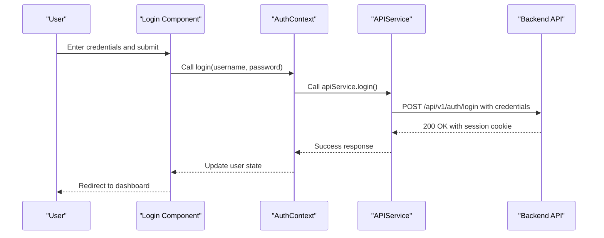
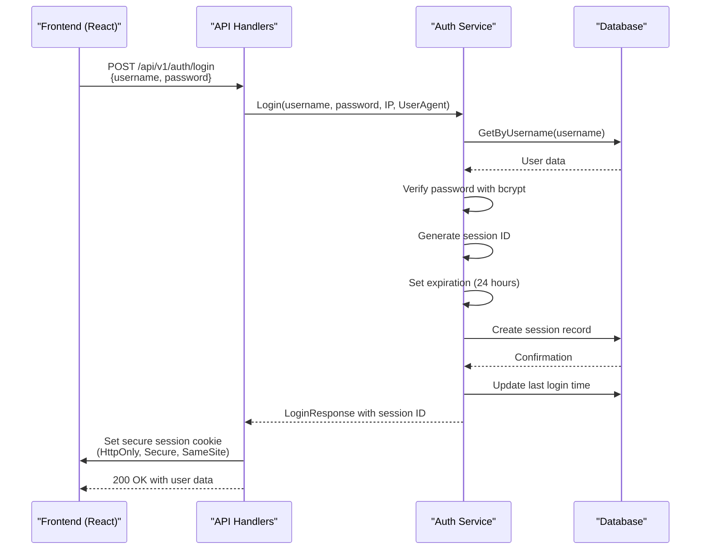
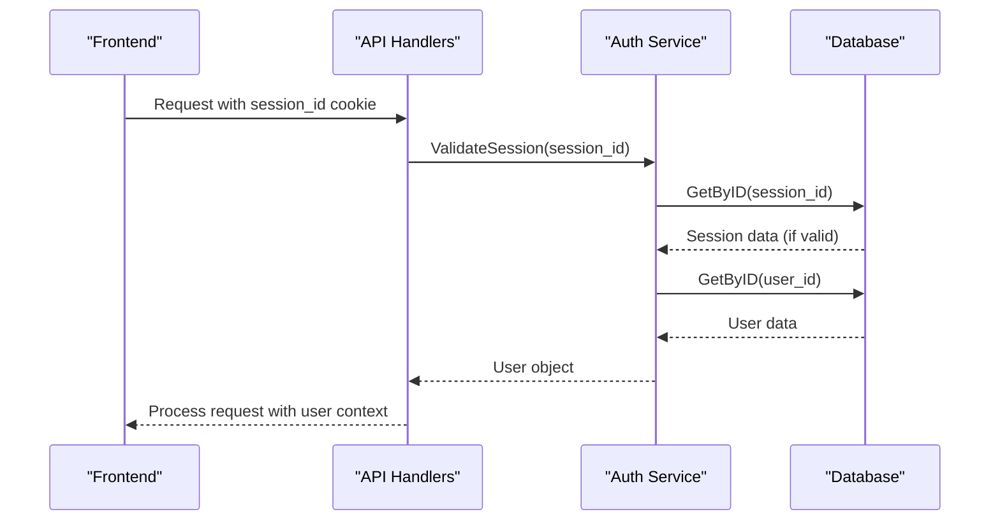

# Authentication Flow


## Table of Contents
1. [Authentication Flow Overview](#authentication-flow-overview)
2. [Frontend Login Process](#frontend-login-process)
3. [Backend Authentication Service](#backend-authentication-service)
4. [Session Management](#session-management)
5. [Data Flow and Sequence Diagrams](#data-flow-and-sequence-diagrams)
6. [Error Handling](#error-handing)
7. [Session Expiration and Cleanup](#session-expiration-and-cleanup)

## Authentication Flow Overview

The authentication flow in exim-pilot follows a standard session-based authentication pattern with secure cookie management. The process begins with the user submitting credentials through the frontend login form, which are then validated against stored user data using bcrypt password hashing. Upon successful authentication, a cryptographically secure session ID is generated and stored in the database with an expiration time of 24 hours. The session ID is returned to the client via a secure HTTP cookie with HttpOnly, Secure, and SameSite flags enabled.

The authentication system is implemented across multiple layers:
- Frontend components in React for user interface
- API handlers for HTTP request processing
- Authentication service for business logic
- Database repositories for data persistence

This multi-layer architecture ensures separation of concerns while maintaining security and reliability throughout the authentication process.

## Frontend Login Process

The frontend login process begins with the user interacting with the Login component, which collects username and password credentials through a form interface. When the user submits their credentials, the form triggers the authentication sequence through the application's context and service layers.

The login form is implemented in the Login component, which uses React state management to handle form inputs and submission states. The component integrates with the AuthContext to access authentication functions and manage user state.





**Section sources**
- [Login.tsx](file://web/src/components/Auth/Login.tsx)
- [AuthContext.tsx](file://web/src/context/AuthContext.tsx)
- [api.ts](file://web/src/services/api.ts)

## Backend Authentication Service

The backend authentication service handles the core logic of user authentication, session creation, and validation. The service is implemented in the auth package and follows a clean separation of concerns with dedicated methods for each authentication operation.

The Login method in the authentication service performs several critical steps:
1. Retrieves the user by username from the database
2. Verifies the provided password against the stored bcrypt hash
3. Creates a new session with a cryptographically secure session ID
4. Updates the user's last login timestamp
5. Returns authentication response with user data and session information


```go
func (s *Service) Login(username, password, ipAddress, userAgent string) (*database.LoginResponse, error) {
	// Get user by username
	user, err := s.userRepo.GetByUsername(username)
	if err != nil {
		// Log failed login attempt
		s.auditRepo.Create(&database.AuditLog{
			Action:    "login_failed",
			UserID:    &username,
			Details:   stringPtr(`{"reason": "user_not_found"}`),
			IPAddress: &ipAddress,
		})
		return nil, fmt.Errorf("invalid credentials")
	}

	// Verify password using bcrypt
	if err := bcrypt.CompareHashAndPassword([]byte(user.PasswordHash), []byte(password)); err != nil {
		// Log failed login attempt
		userIDStr := fmt.Sprintf("%d", user.ID)
		s.auditRepo.Create(&database.AuditLog{
			Action:    "login_failed",
			UserID:    &userIDStr,
			Details:   stringPtr(`{"reason": "invalid_password"}`),
			IPAddress: &ipAddress,
		})
		return nil, fmt.Errorf("invalid credentials")
	}
```


The password verification uses the bcrypt algorithm with the CompareHashAndPassword function, which securely compares the provided password with the stored hash. This implementation protects against timing attacks and ensures that passwords are never stored in plaintext.

The service also handles audit logging for all authentication attempts, creating audit log entries for both successful and failed login attempts. This provides a complete record of authentication activity for security monitoring and compliance purposes.

**Section sources**
- [service.go](file://internal/auth/service.go#L29-L95)
- [repository.go](file://internal/database/repository.go#L1420-L1440)

## Session Management

Session management in exim-pilot is implemented using server-side session storage with secure cookie transmission. When a user successfully authenticates, a session is created in the database and a session ID is returned to the client via a secure HTTP cookie.

### Session Creation

During the login process, the authentication service creates a new session with the following properties:
- Cryptographically secure session ID generated using 32 bytes of random data
- User ID reference to associate the session with a specific user
- 24-hour expiration time from creation
- Client IP address and user agent for additional security context


```go
// Create session
sessionID, err := generateSessionID()
if err != nil {
	return nil, fmt.Errorf("failed to generate session ID: %w", err)
}

expiresAt := time.Now().Add(24 * time.Hour) // 24 hour session
session := &database.Session{
	ID:        sessionID,
	UserID:    user.ID,
	ExpiresAt: expiresAt,
	IPAddress: &ipAddress,
	UserAgent: &userAgent,
}

if err := s.sessionRepo.Create(session); err != nil {
	return nil, fmt.Errorf("failed to create session: %w", err)
}
```


The session ID is generated using Go's crypto/rand package to ensure cryptographically secure randomness. The generateSessionID function creates a 32-byte random value and encodes it as a hexadecimal string, resulting in a 64-character session ID.

### Secure Cookie Implementation

The session ID is transmitted to the client using a secure HTTP cookie with multiple security flags:


```go
// Set session cookie
cookie := &http.Cookie{
	Name:     "session_id",
	Value:    loginResp.SessionID,
	Expires:  loginResp.ExpiresAt,
	HttpOnly: true,
	Secure:   r.TLS != nil, // Only secure if HTTPS
	SameSite: http.SameSiteStrictMode,
	Path:     "/",
}
http.SetCookie(w, cookie)
```


The cookie configuration includes the following security features:
- **HttpOnly**: Prevents client-side JavaScript access to the cookie, protecting against XSS attacks
- **Secure**: Ensures the cookie is only transmitted over HTTPS connections
- **SameSite: Strict**: Prevents CSRF attacks by only sending the cookie in first-party contexts
- **Path**: Restricts the cookie to the root path of the application

### Session Validation

The ValidateSession method verifies the validity of a session by checking the session ID against the database:


```go
func (s *Service) ValidateSession(sessionID string) (*database.User, error) {
	// Get session
	session, err := s.sessionRepo.GetByID(sessionID)
	if err != nil {
		return nil, fmt.Errorf("invalid session")
	}

	// Get user
	user, err := s.userRepo.GetByID(session.UserID)
	if err != nil {
		return nil, fmt.Errorf("user not found")
	}

	return user, nil
}
```


The session repository automatically checks for expiration by including a condition in the database query:


```sql
SELECT id, user_id, expires_at, ip_address, user_agent, created_at, updated_at
FROM sessions
WHERE id = ? AND expires_at > CURRENT_TIMESTAMP
```


This ensures that expired sessions are treated as invalid and cannot be used for authentication.

### Session Logout

The Logout method invalidates a session by removing it from the database:


```go
func (s *Service) Logout(sessionID, ipAddress string) error {
	// Get session to get user ID for audit log
	session, err := s.sessionRepo.GetByID(sessionID)
	if err != nil {
		return fmt.Errorf("session not found")
	}

	// Delete session
	if err := s.sessionRepo.Delete(sessionID); err != nil {
		return fmt.Errorf("failed to delete session: %w", err)
	}

	// Log logout
	userIDStr := fmt.Sprintf("%d", session.UserID)
	s.auditRepo.Create(&database.AuditLog{
		Action:    "logout",
		UserID:    &userIDStr,
		Details:   stringPtr(fmt.Sprintf(`{"session_id": "%s"}`, sessionID)),
		IPAddress: &ipAddress,
	})

	return nil
}
```


After deleting the session from the database, the backend also sends a response to clear the session cookie on the client side by setting an expired cookie.

**Section sources**
- [service.go](file://internal/auth/service.go#L97-L135)
- [auth_handlers.go](file://internal/api/auth_handlers.go#L102-L130)
- [repository.go](file://internal/database/repository.go#L1515-L1574)

## Data Flow and Sequence Diagrams

The authentication flow involves multiple components working together to authenticate users and manage sessions. The following sequence diagrams illustrate the data flow between the frontend, API handlers, and backend services.





**Diagram sources**
- [auth_handlers.go](file://internal/api/auth_handlers.go#L48-L80)
- [service.go](file://internal/auth/service.go#L29-L95)
- [repository.go](file://internal/database/repository.go#L1420-L1440)

The session validation flow occurs on subsequent requests when the user has an active session:





**Diagram sources**
- [auth_handlers.go](file://internal/api/auth_handlers.go#L140-L150)
- [service.go](file://internal/auth/service.go#L137-L158)
- [repository.go](file://internal/database/repository.go#L1530-L1553)

## Error Handling

The authentication system implements comprehensive error handling for various failure scenarios, providing appropriate responses while maintaining security.

### Invalid Credentials

When a user provides invalid credentials (either incorrect username or password), the system returns a generic "Invalid credentials" error message to prevent information leakage about which credential was incorrect:


```go
if err != nil {
	response := APIResponse{
		Success: false,
		Error:   "Invalid credentials",
	}
	WriteJSONResponse(w, http.StatusUnauthorized, response)
	return
}
```


The system distinguishes between two cases internally for audit logging:
- User not found: Logged with the username as the UserID
- Invalid password: Logged with the user ID and reason "invalid_password"

This allows for detailed audit logs while presenting a consistent error message to the client.

### Session-Related Errors

The system handles various session-related error conditions:


```go
// No active session
cookie, err := r.Cookie("session_id")
if err != nil {
	response := APIResponse{
		Success: false,
		Error:   "No active session",
	}
	WriteJSONResponse(w, http.StatusBadRequest, response)
	return
}
```


For expired sessions, the database query automatically filters out expired sessions, causing the ValidateSession method to return an "invalid session" error. This is handled consistently across all authenticated endpoints.

### Error Response Structure

All authentication errors follow a consistent response structure:


```json
{
	"success": false,
	"error": "Descriptive error message"
}
```


The error messages are designed to be user-friendly while avoiding disclosure of sensitive system information. Detailed error information is logged on the server side for debugging and audit purposes, but not exposed to the client.

**Section sources**
- [auth_handlers.go](file://internal/api/auth_handlers.go#L60-L70)
- [auth_handlers.go](file://internal/api/auth_handlers.go#L108-L115)
- [service.go](file://internal/auth/service.go#L40-L45)

## Session Expiration and Cleanup

The exim-pilot authentication system implements a 24-hour session expiration policy to balance user convenience with security. Sessions are automatically invalidated after 24 hours of creation, requiring users to re-authenticate.

### Session Expiration Policy

Each session is created with a 24-hour expiration time:


```go
expiresAt := time.Now().Add(24 * time.Hour) // 24 hour session
```


This expiration time is stored in the database and checked on every session validation request. The SessionRepository's GetByID method includes an expiration check in the SQL query:


```sql
WHERE id = ? AND expires_at > CURRENT_TIMESTAMP
```


This ensures that expired sessions cannot be validated, effectively logging out users after 24 hours of inactivity.

### Cleanup Mechanism for Expired Sessions

To prevent database bloat, the system includes a cleanup mechanism that periodically removes expired sessions from the database:


```go
// CleanupExpiredSessions removes expired sessions
func (s *Service) CleanupExpiredSessions() error {
	deleted, err := s.sessionRepo.DeleteExpired()
	if err != nil {
		return fmt.Errorf("failed to cleanup expired sessions: %w", err)
	}

	if deleted > 0 {
		fmt.Printf("Cleaned up %d expired sessions\n", deleted)
	}

	return nil
}
```


The SessionRepository implements the DeleteExpired method:


```go
// DeleteExpired removes all expired sessions
func (r *SessionRepository) DeleteExpired() (int64, error) {
	query := "DELETE FROM sessions WHERE expires_at <= CURRENT_TIMESTAMP"

	result, err := r.db.Exec(query)
	if err != nil {
		return 0, fmt.Errorf("failed to delete expired sessions: %w", err)
	}

	rowsAffected, err := result.RowsAffected()
	if err != nil {
		return 0, fmt.Errorf("failed to get affected rows: %w", err)
	}

	return rowsAffected, nil
}
```


This cleanup process can be run periodically (e.g., via a scheduled job or cron task) to remove expired sessions and maintain database performance. The method returns the number of deleted sessions, allowing the system to log cleanup activity for monitoring purposes.

The cleanup mechanism is designed to be idempotent and safe to run frequently, as it only affects sessions that are already expired and unusable. This ensures that the database remains clean without impacting active user sessions.

**Section sources**
- [service.go](file://internal/auth/service.go#L170-L184)
- [repository.go](file://internal/database/repository.go#L1575-L1591)
- [schema.go](file://internal/database/schema.go#L175-L180)

**Referenced Files in This Document**   
- [service.go](file://internal/auth/service.go)
- [auth_handlers.go](file://internal/api/auth_handlers.go)
- [Login.tsx](file://web/src/components/Auth/Login.tsx)
- [AuthContext.tsx](file://web/src/context/AuthContext.tsx)
- [api.ts](file://web/src/services/api.ts)
- [models.go](file://internal/database/models.go)
- [schema.go](file://internal/database/schema.go)
- [repository.go](file://internal/database/repository.go)