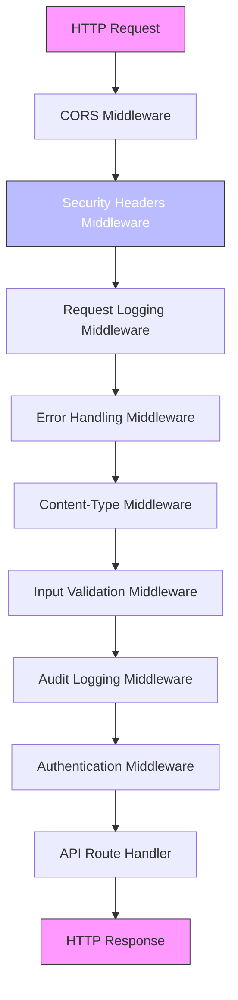
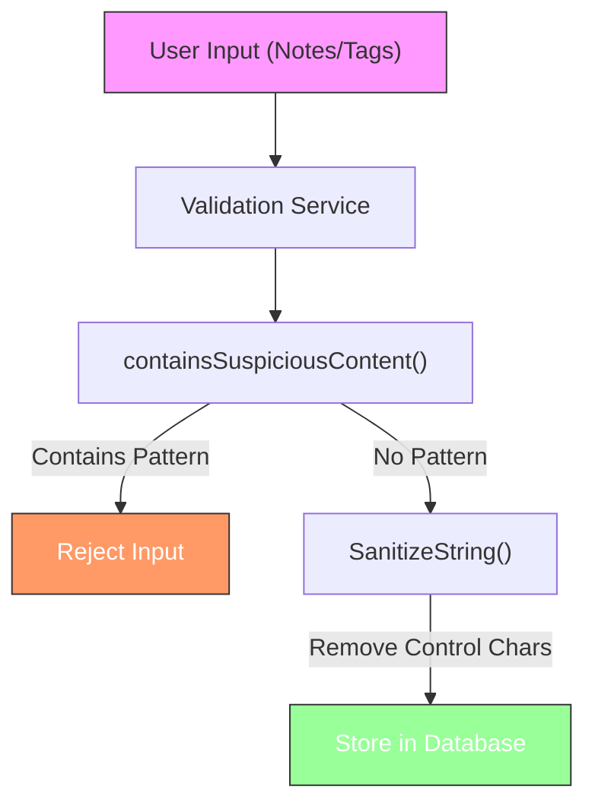
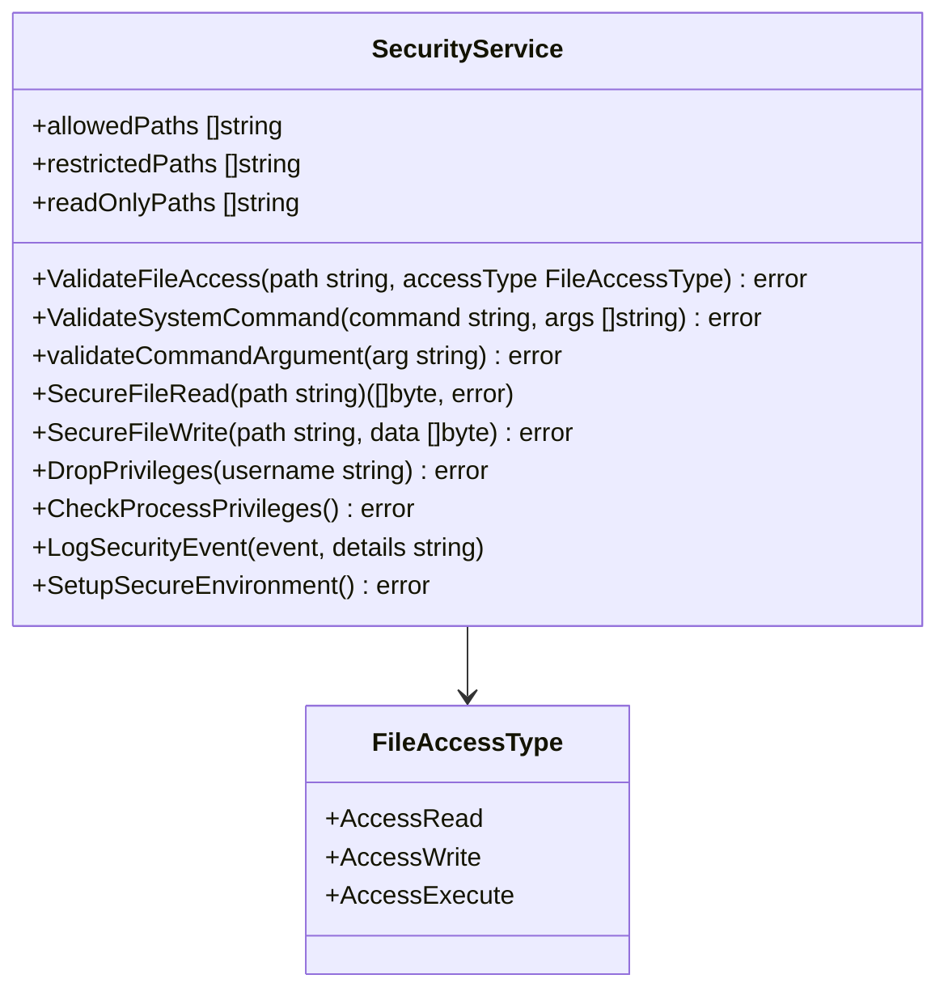
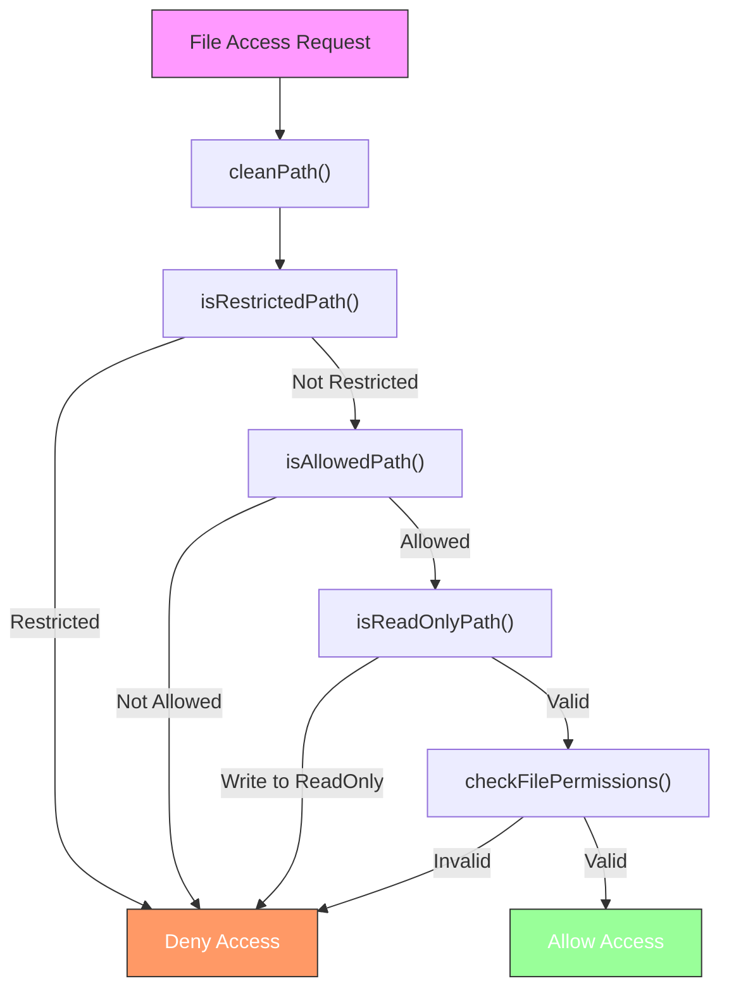

# Security Mechanisms


## Table of Contents
1. [Input Validation Implementation](#input-validation-implementation)
2. [Middleware Enforcement and Security Headers](#middleware-enforcement-and-security-headers)
3. [Protection Against Web Vulnerabilities](#protection-against-web-vulnerabilities)
4. [Brute Force Attack Protection and Audit Logging](#brute-force-attack-protection-and-audit-logging)
5. [Security Service and Input Sanitization](#security-service-and-input-sanitization)
6. [Sensitive Operations and API Endpoint Protection](#sensitive-operations-and-api-endpoint-protection)

## Input Validation Implementation

The exim-pilot application implements a comprehensive input validation system through the `validation.Service` struct, which provides structured validation rules for various types of user input. The validation service is designed to ensure data integrity and prevent malicious input from compromising the system.

The validation service contains specific methods for validating different types of data, including message IDs, email addresses, IP addresses, and various operations. For message ID validation, the system enforces a strict format that matches the Exim message ID pattern: `^[0-9A-Za-z]{6}-[0-9A-Za-z]{6}-[0-9A-Za-z]{2}$`. This pattern ensures that message IDs follow the expected format of six alphanumeric characters, followed by a hyphen, another six alphanumeric characters, another hyphen, and finally two alphanumeric characters.


```mermaid
classDiagram
class ValidationService {
+maxStringLength int
+maxArrayLength int
+allowedOperations map[string]bool
+allowedLogTypes map[string]bool
+allowedStatuses map[string]bool
+ValidateMessageID(messageID string) error
+ValidateEmailAddress(email string) error
+ValidateIPAddress(ip string) error
+ValidateOperation(operation string) error
+ValidateLogType(logType string) error
+ValidateStatus(status string) error
+ValidateString(field, value string, required bool, maxLength int) error
+ValidateStringArray(field string, values []string, required bool, maxItems int) error
+ValidateInteger(field string, value int, required bool, min, max int) error
+ValidateTimeRange(startTime, endTime *time.Time) error
+ValidatePagination(page, perPage int) error
+ValidateSearchCriteria(criteria map[string]interface{}) error
+ValidateBulkRequest(operation string, messageIDs []string) error
+ValidateUserInput(input map[string]interface{}) error
+SanitizeString(input string) string
}
class ValidationError {
+Field string
+Message string
+Value string
+Error() string
}
class ValidationErrors {
+Errors []ValidationError
+Error() string
+Add(field, message, value string)
+HasErrors() bool
}
ValidationService --> ValidationError : "returns"
ValidationService --> ValidationErrors : "returns"
```


**Diagram sources**
- [service.go](file://internal/validation/service.go#L15-L521)

Email address validation uses Go's built-in `mail.ParseAddress` function to ensure that email addresses are properly formatted according to RFC standards. Additionally, the system enforces a maximum length of 320 characters for email addresses, which aligns with RFC 5321 limits. The validation also checks for empty values and returns appropriate error messages when validation fails.

For operation validation, the system maintains a whitelist of allowed operations: "deliver", "freeze", "thaw", and "delete". This prevents unauthorized operations from being executed on the mail queue. Similarly, log types are restricted to "main", "reject", and "panic", while message statuses are limited to "received", "queued", "delivered", "deferred", "bounced", and "frozen". This whitelist approach ensures that only valid values are accepted for these fields.

The validation service also includes methods for validating strings, string arrays, integers, time ranges, pagination parameters, search criteria, bulk requests, and user input. These methods enforce length limits, range constraints, and format requirements to prevent various types of injection attacks and ensure data consistency.

**Section sources**
- [service.go](file://internal/validation/service.go#L15-L521)
- [service_test.go](file://internal/validation/service_test.go#L0-L67)

## Middleware Enforcement and Security Headers

The exim-pilot application implements security measures through a middleware chain in the API server. The middleware stack is configured in the `setupMiddleware` method of the `Server` struct, which applies various security layers to all incoming requests in a specific order.





**Diagram sources**
- [server.go](file://internal/api/server.go#L50-L92)
- [middleware.go](file://internal/api/middleware.go#L239-L270)

The security headers middleware is one of the first layers applied to responses, ensuring that all responses include important security headers regardless of the endpoint. The implemented security headers include:

- **X-Content-Type-Options: nosniff** - Prevents MIME type sniffing, which could lead to content being interpreted as a different type than declared
- **X-Frame-Options: DENY** - Prevents the page from being embedded in iframes, protecting against clickjacking attacks
- **X-XSS-Protection: 1; mode=block** - Enables the XSS filter in browsers and blocks the page if an XSS attack is detected
- **Referrer-Policy: strict-origin-when-cross-origin** - Controls how much referrer information is included in requests, balancing privacy and functionality
- **Content-Security-Policy** - Restricts the sources from which content can be loaded, with a policy that allows only same-origin scripts and styles, including inline scripts and styles

The Content Security Policy (CSP) is set to `default-src 'self'; script-src 'self' 'unsafe-inline'; style-src 'self' 'unsafe-inline'`, which means that by default, content can only be loaded from the same origin as the document. Scripts and styles can be loaded from the same origin and can include inline code, which is necessary for the application's functionality but represents a potential security trade-off.

Additionally, the server header is set to "Exim-Pilot" to remove information about the underlying server software, making it more difficult for attackers to identify potential vulnerabilities based on server version.

The input validation middleware is applied after the security headers but before authentication. This ensures that invalid requests are rejected early in the processing chain, reducing the load on subsequent middleware layers and preventing malformed requests from reaching authenticated endpoints.

**Section sources**
- [middleware.go](file://internal/api/middleware.go#L239-L270)
- [server.go](file://internal/api/server.go#L50-L92)

## Protection Against Web Vulnerabilities

The exim-pilot application implements multiple layers of protection against common web vulnerabilities, including XSS, CSRF, and command injection attacks.

### Cross-Site Scripting (XSS) Protection

XSS protection is implemented through multiple mechanisms. The security headers middleware sets the `X-XSS-Protection` header to enable browser-based XSS filtering. The Content Security Policy restricts script execution to only those from the same origin and inline scripts, preventing unauthorized scripts from being executed.

Additionally, the validation service includes a `containsSuspiciousContent` method that checks for common XSS patterns in user input, such as `<script`, `javascript:`, `onload=`, `onerror=`, `onclick=`, `eval(`, `document.cookie`, and `window.location`. This method is used when validating user input for notes and tags, providing an additional layer of protection against stored XSS attacks.





**Diagram sources**
- [service.go](file://internal/validation/service.go#L488-L507)

The `SanitizeString` method removes null bytes and other control characters from strings, except for newlines and tabs, which are preserved for formatting purposes. This helps prevent various types of injection attacks by removing potentially dangerous characters from user input.

### Cross-Site Request Forgery (CSRF) Protection

CSRF protection is implemented through secure cookie settings and the SameSite cookie attribute. When a user logs in, the application sets a session cookie with the following security attributes:

- **HttpOnly: true** - Prevents client-side scripts from accessing the cookie, protecting against XSS-based session theft
- **Secure: true** - Ensures the cookie is only sent over HTTPS connections, preventing interception over unsecured connections
- **SameSite: Strict** - Prevents the cookie from being sent in cross-site requests, protecting against CSRF attacks
- **Path: "/"** - Limits the cookie to the root path of the application


```mermaid
sequenceDiagram
participant Client
participant Server
participant Attacker
Client->>Server : POST /api/v1/auth/login
Server->>Client : Set-Cookie : session_id=abc123; HttpOnly; Secure; SameSite=Strict
Attacker->>Client : Malicious site with form
Client->>Server : Form submission (no cookie sent due to SameSite=Strict)
Server->>Client : 401 Unauthorized
Client->>Server : Normal request within same site
Client->>Server : Include session_id cookie
Server->>Client : Process request
```


**Diagram sources**
- [auth_handlers.go](file://internal/api/auth_handlers.go#L48-L100)

The SameSite=Strict attribute ensures that the session cookie is only sent in first-party contexts, meaning it won't be included in requests initiated from other sites. This effectively prevents CSRF attacks, as an attacker's site cannot make authenticated requests to the exim-pilot application on behalf of the user.

### Command Injection Protection

The security service implements protection against command injection attacks through the `ValidateSystemCommand` and `validateCommandArgument` methods. These methods validate system commands before they are executed, ensuring that only authorized commands can be run and that command arguments do not contain dangerous characters.

The `validateCommandArgument` method checks for dangerous characters that could be used for command injection, including `;`, `&`, `|`, `` ` ``, `$`, `(`, `)`, `<`, `>`, `"`, and `'`. It also checks for path traversal sequences containing `..`. If any of these patterns are detected, the validation fails and the command is not executed.





**Diagram sources**
- [service.go](file://internal/security/service.go#L15-L425)

The `ValidateSystemCommand` method maintains a whitelist of allowed commands, including `exim`, `exim4`, `/usr/sbin/exim`, and `/usr/sbin/exim4`. This ensures that only Exim-related commands can be executed through the application, preventing attackers from running arbitrary system commands.

**Section sources**
- [auth_handlers.go](file://internal/api/auth_handlers.go#L48-L100)
- [service.go](file://internal/security/service.go#L324-L358)
- [service.go](file://internal/validation/service.go#L488-L507)

## Brute Force Attack Protection and Audit Logging

The exim-pilot application implements protection against brute force attacks through comprehensive audit logging of authentication attempts and other sensitive operations. While the codebase does not contain explicit rate limiting mechanisms, it provides detailed logging that could be used to implement rate limiting at the infrastructure level or through external monitoring tools.

The audit service logs all administrative actions, including authentication events, queue operations, message operations, and system operations. Each audit log entry includes detailed context information such as the user ID, IP address, user agent, request ID, timestamp, and action type. For failed operations, the error message is also recorded, providing valuable information for detecting and analyzing brute force attempts.


```mermaid
classDiagram
class AuditService {
+repository *database.Repository
+LogAction(ctx context.Context, action ActionType, messageID *string, auditCtx *AuditContext, details *AuditDetails) error
+LogQueueOperation(ctx context.Context, operation string, messageID string, auditCtx *AuditContext, success bool, errorMsg string) error
+LogBulkOperation(ctx context.Context, operation string, messageIDs []string, auditCtx *AuditContext, successCount, failureCount int, errors []string) error
+LogAuthentication(ctx context.Context, action ActionType, username string, auditCtx *AuditContext, success bool, errorMsg string) error
}
class AuditContext {
+UserID string
+IPAddress string
+UserAgent string
+RequestID string
}
class AuditDetails {
+MessageIDs []string
+Recipients []string
+Operation string
+Parameters map[string]interface{}
+Result string
+ErrorMessage string
+Duration time.Duration
+ResourcePath string
+PreviousValue interface{}
+NewValue interface{}
}
class ActionType {
+ActionQueueDeliver
+ActionQueueFreeze
+ActionQueueThaw
+ActionQueueDelete
+ActionBulkDeliver
+ActionBulkFreeze
+ActionBulkThaw
+ActionBulkDelete
+ActionLogin
+ActionLogout
+ActionMessageView
+ActionMessageContent
+ActionNoteCreate
+ActionNoteUpdate
+ActionNoteDelete
+ActionTagCreate
+ActionTagDelete
+ActionConfigChange
+ActionSystemAccess
}
AuditService --> AuditContext
AuditService --> AuditDetails
AuditService --> ActionType
```


**Diagram sources**
- [service.go](file://internal/audit/service.go#L15-L287)

The audit middleware automatically logs administrative actions before they are processed, ensuring that even failed attempts are recorded. This is particularly important for detecting brute force attacks, as multiple failed login attempts from the same IP address would be visible in the audit logs.

The `LogAuthentication` method specifically logs login and logout events, recording whether the authentication attempt was successful or failed, along with the username and error message if applicable. This detailed logging allows administrators to monitor for patterns of failed login attempts that might indicate a brute force attack.

While the application does not currently implement rate limiting at the application level, the comprehensive audit logging provides the foundation for implementing such protections. External systems could analyze the audit logs to detect and block brute force attacks, or rate limiting could be added to the authentication handlers based on IP address or username.

**Section sources**
- [service.go](file://internal/audit/service.go#L15-L287)
- [middleware.go](file://internal/api/middleware.go#L184-L234)

## Security Service and Input Sanitization

The security service in exim-pilot plays a crucial role in protecting the system from various security threats by providing file access validation, command validation, and environment security checks. The service acts as a central security enforcement point for operations that interact with the underlying system.

File access validation is implemented through the `ValidateFileAccess` method, which checks whether a requested file operation is allowed based on predefined rules. The service maintains lists of allowed paths, restricted paths, and read-only paths. Allowed paths include Exim-related directories such as `/var/log/exim4`, `/var/spool/exim4`, `/var/lib/exim4`, and `/etc/exim4`. Restricted paths include sensitive system files and directories such as `/etc/passwd`, `/etc/shadow`, `/etc/sudoers`, `/root`, and `/home`.

When validating file access, the service first cleans and resolves the path using `filepath.Clean` and `filepath.EvalSymlinks` to prevent directory traversal and symlink attacks. It then checks if the path is in the restricted list, the allowed list, and whether write operations are permitted on read-only paths. The service also verifies that the process has the necessary permissions to perform the requested operation on the file.





**Diagram sources**
- [service.go](file://internal/security/service.go#L75-L120)

The security service also includes methods for secure file reading and writing (`SecureFileRead` and `SecureFileWrite`), which automatically perform access validation before performing the file operation. This ensures that all file operations go through the security validation process.

For system command execution, the service validates both the command and its arguments to prevent command injection attacks. The `ValidateSystemCommand` method checks that the command is in the allowed list and that all arguments pass the `validateCommandArgument` check, which looks for dangerous characters and path traversal sequences.

The service also includes methods for checking and dropping process privileges. The `CheckProcessPrivileges` method warns if the process is running as root, which is generally not recommended for security reasons. The `DropPrivileges` method is a placeholder for functionality that would drop privileges to a less privileged user, though the actual implementation is commented out in the current code.

**Section sources**
- [service.go](file://internal/security/service.go#L15-L425)
- [service_test.go](file://internal/security/service_test.go#L0-L49)

## Sensitive Operations and API Endpoint Protection

The exim-pilot application protects sensitive operations through a combination of authentication, authorization, input validation, and audit logging. The API server implements a middleware chain that ensures all requests are properly authenticated and authorized before reaching the endpoint handlers.

Authentication is enforced through the `authMiddleware`, which validates the session cookie for all protected routes. The middleware skips authentication for public endpoints such as the health check and login, but requires a valid session for all other endpoints. When a valid session is present, the user information is added to the request context, making it available to downstream handlers.


```mermaid
sequenceDiagram
participant Client
participant Server
participant AuthMiddleware
participant ValidationMiddleware
participant AuditMiddleware
participant Endpoint
Client->>Server : HTTP Request
Server->>AuthMiddleware : Process request
AuthMiddleware->>AuthMiddleware : Check session cookie
alt Valid session
AuthMiddleware->>ValidationMiddleware : Add user to context
else Invalid session
AuthMiddleware->>Client : 401 Unauthorized
stop
end
ValidationMiddleware->>ValidationMiddleware : Validate request parameters
alt Valid parameters
ValidationMiddleware->>AuditMiddleware : Continue processing
else Invalid parameters
ValidationMiddleware->>Client : 400 Bad Request
stop
end
AuditMiddleware->>AuditMiddleware : Log administrative action
AuditMiddleware->>Endpoint : Process request
Endpoint->>Client : Response
```


**Diagram sources**
- [middleware.go](file://internal/api/middleware.go#L97-L140)
- [server.go](file://internal/api/server.go#L100-L145)

Input validation is performed through the `validationMiddleware`, which uses the validation service to check common request parameters such as pagination values and message IDs extracted from the URL path. If validation fails, the middleware returns a 400 Bad Request response with details of the validation errors.

Audit logging is implemented through the `auditMiddleware`, which logs administrative actions before they are processed. The middleware determines the action type based on the request method and path, creates an audit context with user and request information, and logs the action to both the database and system logs. This ensures that all sensitive operations are recorded for security monitoring and compliance purposes.

The API routes are structured to protect sensitive operations by requiring authentication and applying the middleware chain. For example, queue operations such as delivering, freezing, thawing, and deleting messages require authentication and are logged in the audit trail. Similarly, message operations like viewing content, creating notes, and adding tags are protected and logged.

The application also implements protection for file access operations by using the security service to validate all file operations. This ensures that only authorized files in allowed directories can be accessed, and that write operations are not performed on read-only paths.

**Section sources**
- [middleware.go](file://internal/api/middleware.go#L97-L234)
- [server.go](file://internal/api/server.go#L100-L145)
- [auth_handlers.go](file://internal/api/auth_handlers.go#L48-L100)

**Referenced Files in This Document**   
- [service.go](file://internal/security/service.go)
- [service.go](file://internal/validation/service.go)
- [middleware.go](file://internal/api/middleware.go)
- [server.go](file://internal/api/server.go)
- [auth_handlers.go](file://internal/api/auth_handlers.go)
- [service_test.go](file://internal/security/service_test.go)
- [service_test.go](file://internal/validation/service_test.go)