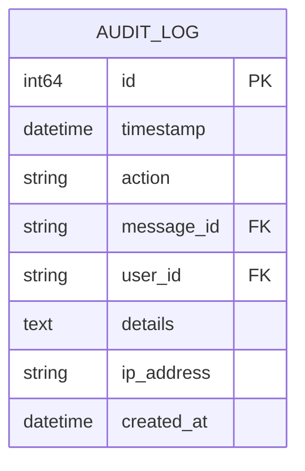
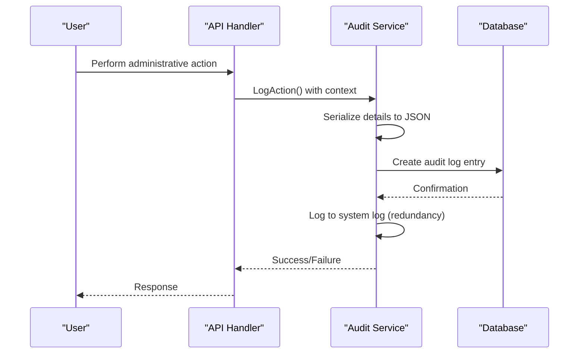
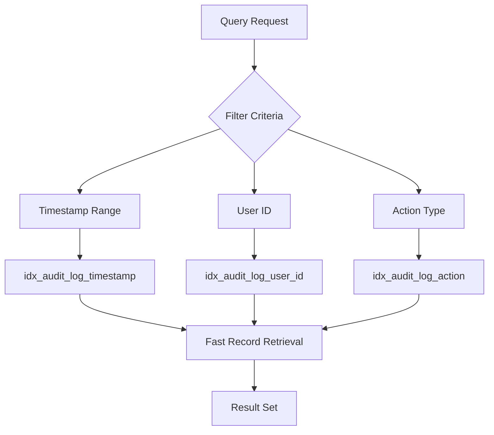

# Audit Logging


## Table of Contents
1. [Audit Trail Data Model](#audit-trail-data-model)
2. [Action Types and User Context](#action-types-and-user-context)
3. [Administrative Action Capture](#administrative-action-capture)
4. [Authentication Event Integration](#authentication-event-integration)
5. [Schema Design and Indexing](#schema-design-and-indexing)
6. [Retention and Cleanup](#retention-and-cleanup)
7. [Query Examples](#query-examples)
8. [Security Implications](#security-implications)

## Audit Trail Data Model

The audit logging system in exim-pilot captures comprehensive records of administrative actions, authentication events, and system access attempts. The core data model is centered around the `AuditLog` struct which contains essential information for tracking and analyzing system activities.





**Diagram sources**
- [models.go](file://internal/database/models.go#L133-L142)

**Section sources**
- [models.go](file://internal/database/models.go#L133-L142)

## Action Types and User Context

The audit system defines a comprehensive set of action types that categorize different administrative operations. Each audit entry captures user context including user ID, IP address, and user agent information to provide complete traceability.

### Authentication Action Types
The system tracks authentication events with specific action types:
- **login**: Successful login attempts
- **logout**: User logout actions
- **login_failed**: Failed authentication attempts

### User Context Information
Each audit entry captures the following user context:
- **UserID**: Unique identifier of the user performing the action
- **IPAddress**: IP address from which the action was initiated
- **UserAgent**: Browser or client application information
- **RequestID**: Unique identifier for tracing the request


```mermaid
classDiagram
class AuditContext {
+string UserID
+string IPAddress
+string UserAgent
+string RequestID
}
class AuditDetails {
+[]string MessageIDs
+string Operation
+map[string]interface{} Parameters
+string Result
+string ErrorMessage
+string ResourcePath
}
class AuditLog {
+int64 ID
+time.Time Timestamp
+string Action
+*string MessageID
+*string UserID
+*string Details
+*string IPAddress
+time.Time CreatedAt
}
AuditLog --> AuditContext : "includes"
AuditLog --> AuditDetails : "contains"
```


**Diagram sources**
- [service.go](file://internal/audit/service.go#L75-L117)
- [models.go](file://internal/database/models.go#L133-L142)

**Section sources**
- [service.go](file://internal/audit/service.go#L75-L117)

## Administrative Action Capture

Administrative actions are captured through the audit service, which provides specialized methods for different types of operations. The system ensures that all significant administrative activities are recorded with appropriate context.

### Queue Operations
The system logs various queue management operations:
- **Queue delivery, freeze, thaw, delete**: Individual message operations
- **Bulk operations**: Mass actions on multiple messages

### Message Operations
Message-related actions are tracked with message-specific context:
- **Message view**: Access to message details
- **Message content**: Viewing message content
- **Note and tag operations**: Creation, update, and deletion of notes and tags

### System Operations
System-level changes are also audited:
- **Configuration changes**: Modifications to system settings
- **System access**: Access to protected system resources





**Diagram sources**
- [service.go](file://internal/audit/service.go#L75-L117)
- [repository.go](file://internal/database/repository.go#L490-L544)

**Section sources**
- [service.go](file://internal/audit/service.go#L75-L117)

## Authentication Event Integration

The audit logging system is tightly integrated with the authentication process to capture all login and logout events, providing critical security monitoring capabilities.

### Login Success and Failure Logging
The system distinguishes between successful and failed login attempts, capturing relevant details for security analysis:


```go
// LogAuthentication logs authentication events
func (s *Service) LogAuthentication(ctx context.Context, action ActionType, username string, auditCtx *AuditContext, success bool, errorMsg string) error {
    details := &AuditDetails{
        Parameters: map[string]interface{}{
            "username": username,
        },
        Result: "success",
    }

    if !success {
        details.Result = "failure"
        details.ErrorMessage = errorMsg
    }

    return s.LogAction(ctx, action, nil, auditCtx, details)
}
```


### Session Details Tracking
When authentication events occur, the system captures:
- **Username**: The username used in the authentication attempt
- **Result**: Success or failure status
- **Error message**: Specific error details for failed attempts
- **IP address**: Origin of the authentication request
- **Timestamp**: Exact time of the authentication attempt

### Logout Event Capture
Logout actions are also recorded to track user session duration and ensure complete audit trails:


```go
// In authentication handlers, logout events trigger:
auditService.LogAuthentication(ctx, ActionLogout, username, auditCtx, true, "")
```


**Section sources**
- [service.go](file://internal/audit/service.go#L156-L206)

## Schema Design and Indexing

The audit log table is designed with performance and query efficiency in mind, featuring appropriate indexing to support fast retrieval of audit records.

### Table Structure
The `audit_log` table schema includes the following columns:
- **id**: Primary key (auto-incrementing integer)
- **timestamp**: When the action occurred (with index)
- **action**: Type of action performed (with index)
- **message_id**: Reference to affected message (if applicable)
- **user_id**: Identifier of the user who performed the action (with index)
- **details**: JSON string containing additional action details
- **ip_address**: IP address of the user
- **created_at**: When the audit record was created

### Indexing Strategy
The system implements a comprehensive indexing strategy to optimize query performance:


```sql
-- Indexes for audit_log table
CREATE INDEX IF NOT EXISTS idx_audit_log_timestamp ON audit_log(timestamp);
CREATE INDEX IF NOT EXISTS idx_audit_log_user_id ON audit_log(user_id);
CREATE INDEX IF NOT EXISTS idx_audit_log_action ON audit_log(action);
```


These indexes enable efficient queries by:
- **Timestamp**: Fast retrieval of audit logs within specific time ranges
- **User ID**: Quick filtering by specific users
- **Action type**: Efficient filtering by action categories





**Diagram sources**
- [migrations.go](file://internal/database/migrations.go#L92-L178)
- [repository.go](file://internal/database/repository.go#L490-L544)

**Section sources**
- [migrations.go](file://internal/database/migrations.go#L92-L178)

## Retention and Cleanup

The system implements automated retention policies to manage audit log storage while maintaining compliance requirements.

### Retention Configuration
Retention policies are configurable through the system configuration:


```go
type RetentionConfig struct {
    LogRetentionDays      int `json:"log_retention_days"`
    AuditRetentionDays    int `json:"audit_retention_days"`
    SnapshotRetentionDays int `json:"snapshot_retention_days"`
}
```


### Automated Cleanup Process
A background service handles periodic cleanup of old audit logs:


```go
// runCleanup performs data retention cleanup
func (s *BackgroundService) runCleanup() {
    log.Println("Starting data retention cleanup")

    // Clean up old audit logs
    if s.config.AuditRetentionDays > 0 {
        cutoff := time.Now().AddDate(0, 0, -s.config.AuditRetentionDays)
        cleaned, err := s.cleanupAuditLogs(cutoff)
        // ...
    }
}
```


### Cleanup Implementation
The cleanup process uses a simple but effective approach:


```go
// cleanupAuditLogs removes old audit logs
func (s *BackgroundService) cleanupAuditLogs(cutoff time.Time) (int, error) {
    query := "DELETE FROM audit_log WHERE timestamp < ?"
    result, err := s.repository.GetDB().Exec(query, cutoff)
    // ...
    return int(rowsAffected), nil
}
```


**Section sources**
- [background_service.go](file://internal/logprocessor/background_service.go#L151-L202)
- [service.go](file://internal/logprocessor/service.go#L314-L342)

## Query Examples

The audit logging system supports various query patterns for retrieving audit trails, enabling administrators to investigate system activities.

### Retrieve Recent Login Attempts

```sql
SELECT * FROM audit_log 
WHERE action = 'login' OR action = 'login_failed'
ORDER BY timestamp DESC 
LIMIT 50;
```


### Find All Actions by a Specific User

```sql
SELECT * FROM audit_log 
WHERE user_id = 'user123' 
ORDER BY timestamp DESC 
LIMIT 100;
```


### Get Bulk Operations Within a Time Range

```sql
SELECT * FROM audit_log 
WHERE action LIKE 'bulk_%' 
AND timestamp >= '2023-01-01 00:00:00' 
AND timestamp <= '2023-01-31 23:59:59'
ORDER BY timestamp DESC;
```


### Find Failed Authentication Attempts by IP

```sql
SELECT user_id, ip_address, details, timestamp 
FROM audit_log 
WHERE action = 'login_failed' 
AND ip_address = '192.168.1.100'
ORDER BY timestamp DESC;
```


### Count Actions by Type

```sql
SELECT action, COUNT(*) as count 
FROM audit_log 
GROUP BY action 
ORDER BY count DESC;
```


**Section sources**
- [repository.go](file://internal/database/repository.go#L490-L544)
- [service.go](file://internal/audit/service.go#L244-L285)

## Security Implications

The audit logging system has significant security implications that must be carefully managed to protect sensitive information and maintain system integrity.

### Access Control
Audit logs contain sensitive information about system activities and must be protected with appropriate access controls:
- **Role-based access**: Only authorized personnel should be able to view audit logs
- **Data minimization**: Logs should contain only information necessary for audit purposes
- **Encryption**: Audit logs should be encrypted at rest and in transit

### Log Integrity
The system ensures audit log integrity through several mechanisms:
- **Immutable records**: Once created, audit logs cannot be modified
- **Redundant logging**: Events are written to both database and system logs
- **Integrity validation**: The system provides methods to validate audit log integrity


```go
// ValidateAuditIntegrity performs basic integrity checks on audit logs
func (s *Service) ValidateAuditIntegrity(ctx context.Context) error {
    // Check for gaps in audit log sequence
    // Check for suspicious patterns
    // This is a placeholder for more sophisticated integrity checks
    return nil
}
```


### Sensitive Information Protection
The system takes care to avoid logging sensitive information:
- **No password logging**: Authentication details do not include passwords
- **Limited personal data**: Only necessary user identifiers are logged
- **Error message sanitization**: Error messages are reviewed to avoid information leakage

### Monitoring and Alerting
The audit system enables security monitoring and alerting:
- **Anomalous pattern detection**: Unusual login patterns can be identified
- **Brute force detection**: Multiple failed login attempts can trigger alerts
- **Privilege escalation monitoring**: Administrative actions are closely tracked

**Section sources**
- [service.go](file://internal/audit/service.go#L244-L285)
- [background_service.go](file://internal/logprocessor/background_service.go#L151-L202)

**Referenced Files in This Document**   
- [service.go](file://internal/audit/service.go)
- [models.go](file://internal/database/models.go)
- [migrations.go](file://internal/database/migrations.go)
- [repository.go](file://internal/database/repository.go)
- [background_service.go](file://internal/logprocessor/background_service.go)
- [config.go](file://internal/config/config.go)