# Queue Management

## Table of Contents
1. [Introduction](#introduction)
2. [Core Components](#core-components)
3. [Architecture Overview](#architecture-overview)
4. [Frontend Implementation](#frontend-implementation)
5. [Backend Implementation](#backend-implementation)
6. [Queue Operations Workflow](#queue-operations-workflow)
7. [Bulk Operations](#bulk-operations)
8. [Search and Filtering](#search-and-filtering)
9. [Queue Health Monitoring](#queue-health-monitoring)
10. [Audit Logging and Security](#audit-logging-and-security)
11. [Performance Considerations](#performance-considerations)
12. [Common Issues and Best Practices](#common-issues-and-best-practices)

## Introduction
The Queue Management feature provides a comprehensive interface for monitoring and controlling the Exim mail queue. It enables administrators to view messages in the queue, perform individual and bulk operations (deliver, freeze, thaw, delete), and assess overall queue health. The system integrates a React-based frontend with a Go backend service that interfaces directly with the Exim spool and a database for persistent storage and historical tracking. This document details the implementation, functionality, and best practices for safe queue manipulation.

## Core Components
The Queue Management system consists of several key components that work together to provide a complete solution for mail queue administration. The frontend components include QueueList for displaying messages and BulkActions for performing operations on multiple messages. The backend includes the QueueHandlers for API endpoints, the QueueService for business logic, and the Manager for direct interaction with the Exim spool. The system also integrates with audit logging and permission checks to ensure secure operations.

**Section sources**
- [queue_handlers.go](file://internal/api/queue_handlers.go#L1-L395)
- [service.go](file://internal/queue/service.go#L1-L311)
- [queue.go](file://internal/queue/queue.go#L1-L397)
- [QueueList.tsx](file://web/src/components/Queue/QueueList.tsx#L1-L500)
- [BulkActions.tsx](file://web/src/components/Queue/BulkActions.tsx#L1-L442)

## Architecture Overview
The Queue Management system follows a layered architecture with a React frontend communicating with a Go backend via REST API endpoints. The backend service interfaces with the Exim mail server through command-line operations and maintains historical data in a database. WebSocket connections provide real-time updates to the frontend when queue changes occur.

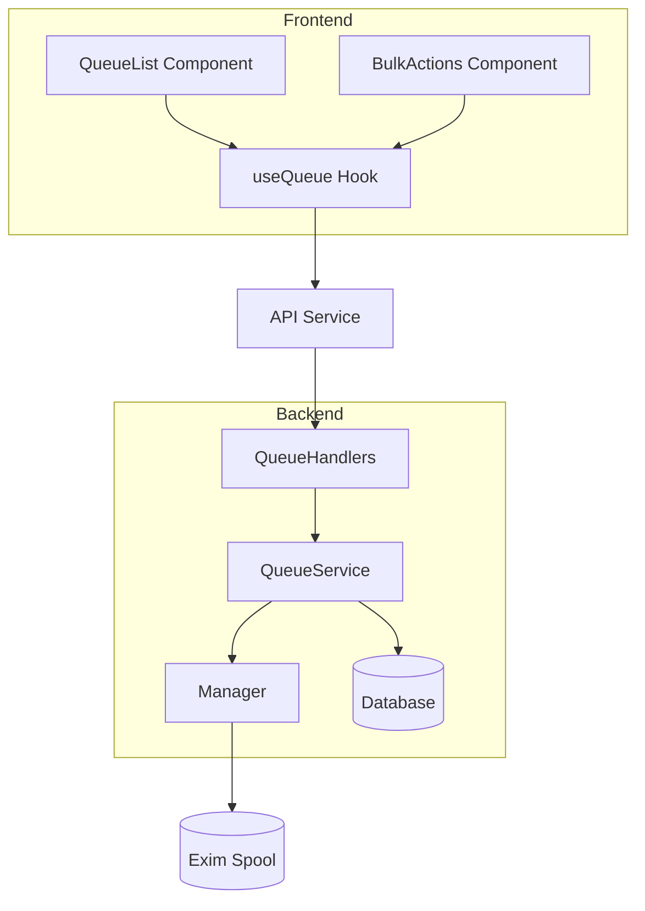

**Diagram sources**
- [queue_handlers.go](file://internal/api/queue_handlers.go#L1-L395)
- [service.go](file://internal/queue/service.go#L1-L311)
- [queue.go](file://internal/queue/queue.go#L1-L397)
- [QueueList.tsx](file://web/src/components/Queue/QueueList.tsx#L1-L500)
- [BulkActions.tsx](file://web/src/components/Queue/BulkActions.tsx#L1-L442)

## Frontend Implementation

### QueueList Component
The QueueList component displays messages from the Exim queue with support for pagination, sorting, and virtual scrolling for large datasets. It allows users to select individual messages or all messages at once, which enables bulk operations through the BulkActions component.

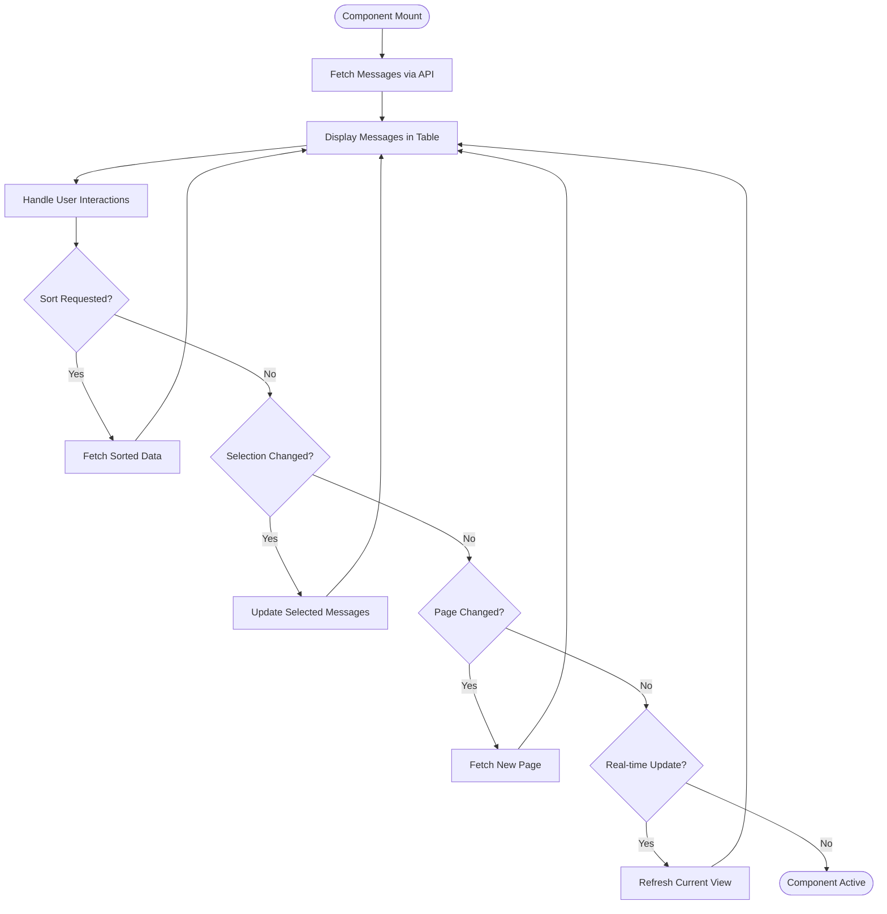

**Diagram sources**
- [QueueList.tsx](file://web/src/components/Queue/QueueList.tsx#L1-L500)

**Section sources**
- [QueueList.tsx](file://web/src/components/Queue/QueueList.tsx#L1-L500)

### BulkActions Component
The BulkActions component provides a user interface for performing operations on multiple selected messages. It includes confirmation dialogs for destructive operations like deletion, progress indicators during operation execution, and result feedback showing success and failure counts.

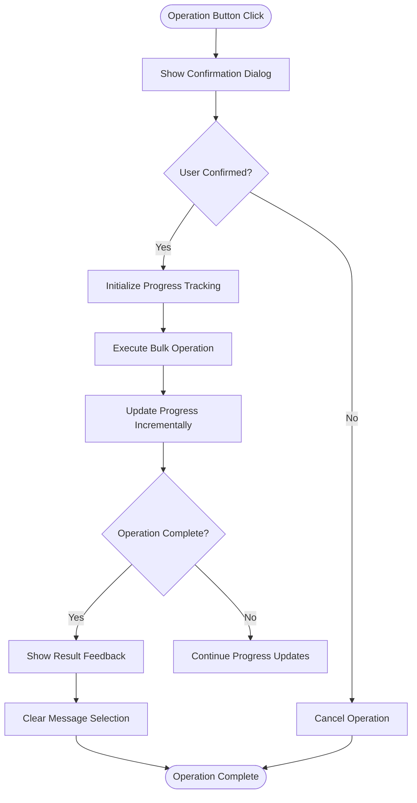

**Diagram sources**
- [BulkActions.tsx](file://web/src/components/Queue/BulkActions.tsx#L1-L442)

**Section sources**
- [BulkActions.tsx](file://web/src/components/Queue/BulkActions.tsx#L1-L442)

## Backend Implementation

### Queue Service Architecture
The backend QueueService acts as an intermediary between the API handlers and the low-level Manager that interacts with Exim. It provides a clean interface for queue operations while handling business logic, validation, and integration with the database for audit logging.

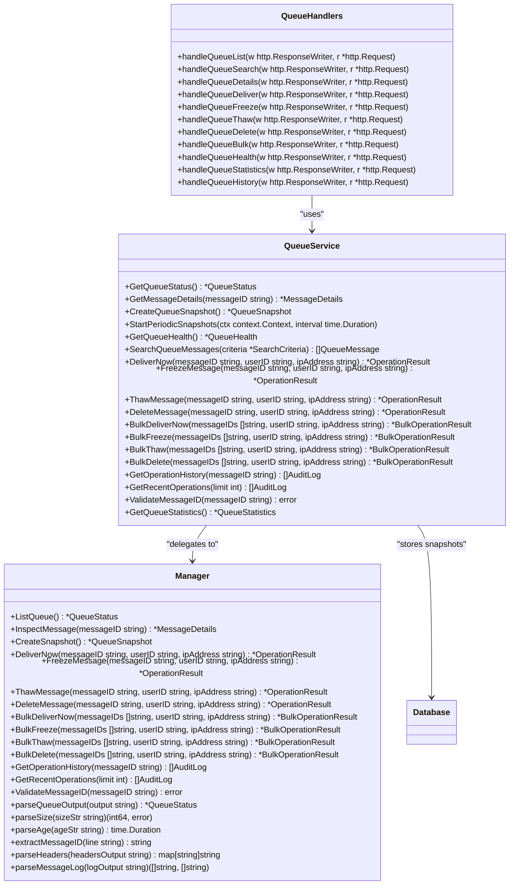

**Diagram sources**
- [service.go](file://internal/queue/service.go#L1-L311)
- [queue.go](file://internal/queue/queue.go#L1-L397)
- [queue_handlers.go](file://internal/api/queue_handlers.go#L1-L395)

**Section sources**
- [service.go](file://internal/queue/service.go#L1-L311)
- [queue.go](file://internal/queue/queue.go#L1-L397)
- [queue_handlers.go](file://internal/api/queue_handlers.go#L1-L395)

### Queue Operations Sequence
The sequence of operations when performing a queue action involves multiple layers from the frontend to the Exim spool. This diagram shows the flow for a bulk delete operation as an example.

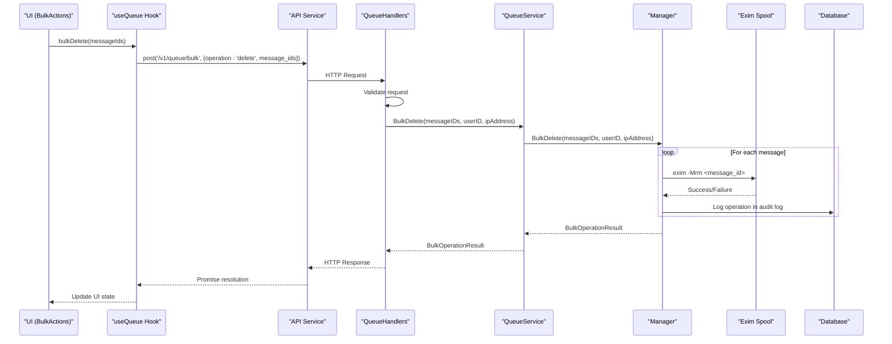

**Diagram sources**
- [queue_handlers.go](file://internal/api/queue_handlers.go#L1-L395)
- [service.go](file://internal/queue/service.go#L1-L311)
- [queue.go](file://internal/queue/queue.go#L1-L397)

**Section sources**
- [queue_handlers.go](file://internal/api/queue_handlers.go#L1-L395)
- [service.go](file://internal/queue/service.go#L1-L311)
- [queue.go](file://internal/queue/queue.go#L1-L397)

## Queue Operations Workflow
The system supports four primary operations on queue messages: deliver, freeze, thaw, and delete. Each operation follows a similar workflow but with different Exim commands and business logic.

### Individual Operations
Individual operations are performed on a single message and are typically initiated from the message details view or through direct API calls.

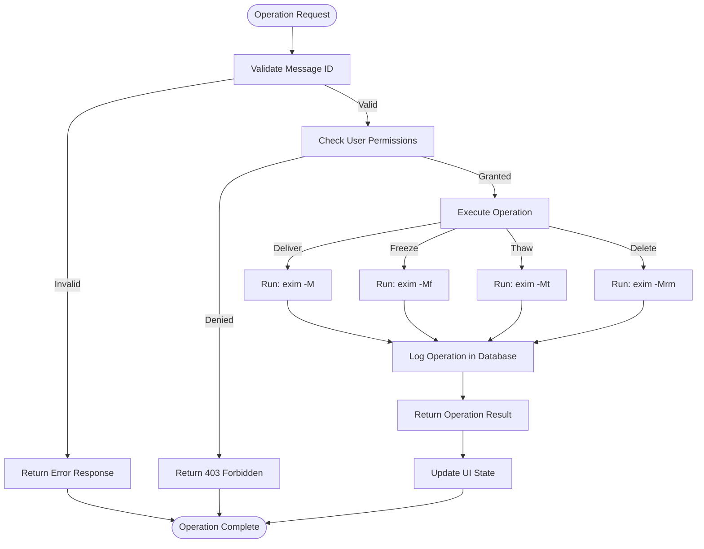

**Diagram sources**
- [queue_handlers.go](file://internal/api/queue_handlers.go#L1-L395)
- [service.go](file://internal/queue/service.go#L1-L311)
- [queue.go](file://internal/queue/queue.go#L1-L397)

**Section sources**
- [queue_handlers.go](file://internal/api/queue_handlers.go#L1-L395)
- [service.go](file://internal/queue/service.go#L1-L311)
- [queue.go](file://internal/queue/queue.go#L1-L397)

## Bulk Operations
Bulk operations allow administrators to perform actions on multiple messages simultaneously, improving efficiency when managing large queues.

### Bulk Operations Implementation
The bulk operations feature enables users to select multiple messages and apply operations like deliver, freeze, thaw, or delete to all selected messages at once.

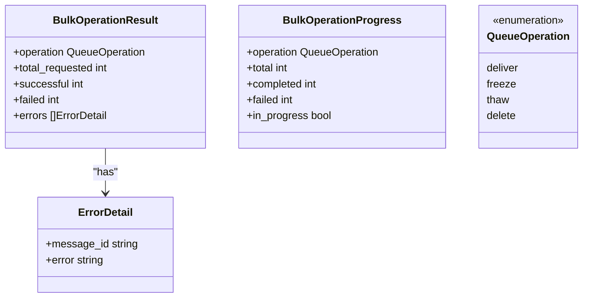

**Diagram sources**
- [queue.ts](file://web/src/types/queue.ts#L55-L96)

**Section sources**
- [queue.ts](file://web/src/types/queue.ts#L55-L96)
- [BulkActions.tsx](file://web/src/components/Queue/BulkActions.tsx#L1-L442)

### Bulk Operations Sequence
The sequence for bulk operations involves collecting selected message IDs, validating the request, and executing the operation on each message while tracking progress and results.

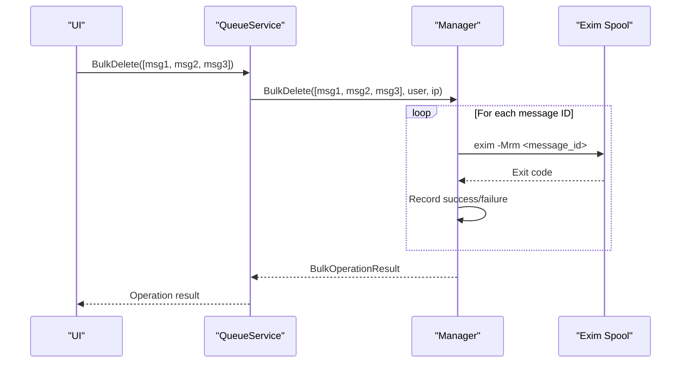

**Diagram sources**
- [service.go](file://internal/queue/service.go#L1-L311)
- [queue.go](file://internal/queue/queue.go#L1-L397)

**Section sources**
- [service.go](file://internal/queue/service.go#L1-L311)
- [queue.go](file://internal/queue/queue.go#L1-L397)

## Search and Filtering
The system provides robust search and filtering capabilities to help administrators locate specific messages in the queue based on various criteria.

### Search Criteria
Users can search for messages using multiple criteria including sender, recipient, message ID, status, size, age, and retry count.

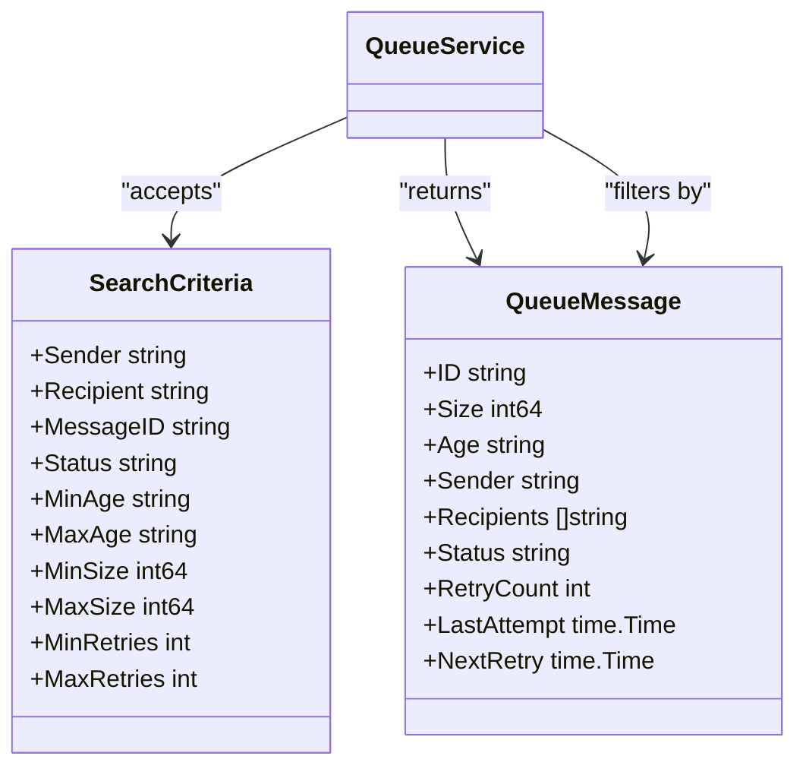

**Diagram sources**
- [service.go](file://internal/queue/service.go#L1-L311)

**Section sources**
- [service.go](file://internal/queue/service.go#L1-L311)

### Search Workflow
The search functionality allows users to find messages matching specific criteria, which is particularly useful in large queues.

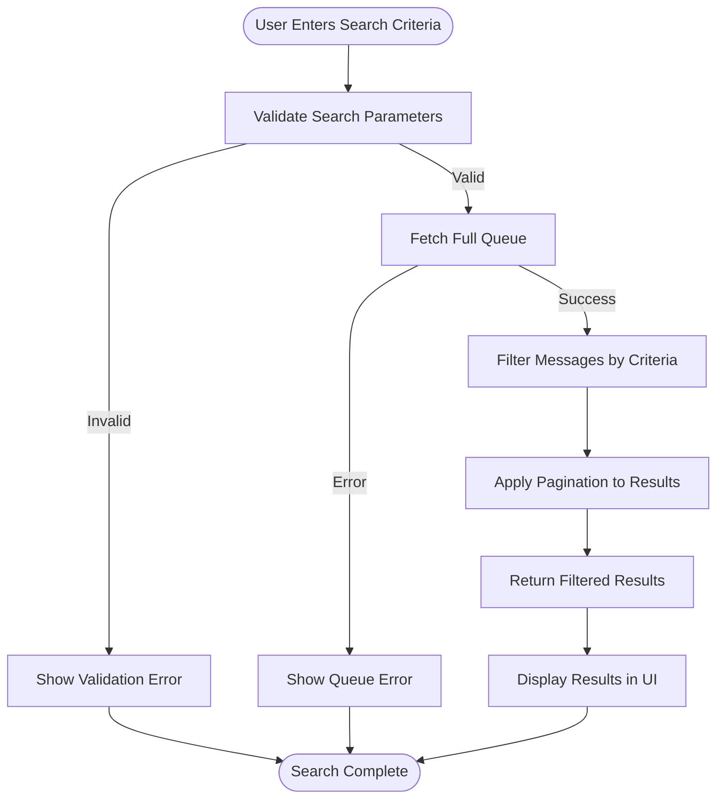

**Diagram sources**
- [service.go](file://internal/queue/service.go#L1-L311)
- [queue_handlers.go](file://internal/api/queue_handlers.go#L1-L395)

**Section sources**
- [service.go](file://internal/queue/service.go#L1-L311)
- [queue_handlers.go](file://internal/api/queue_handlers.go#L1-L395)

## Queue Health Monitoring
The system provides comprehensive queue health monitoring to help administrators assess the overall state of the mail queue and identify potential issues.

### Queue Health Metrics
The QueueHealth struct contains key metrics for assessing the health of the mail queue, including total messages, deferred messages, frozen messages, oldest message age, and growth trend.

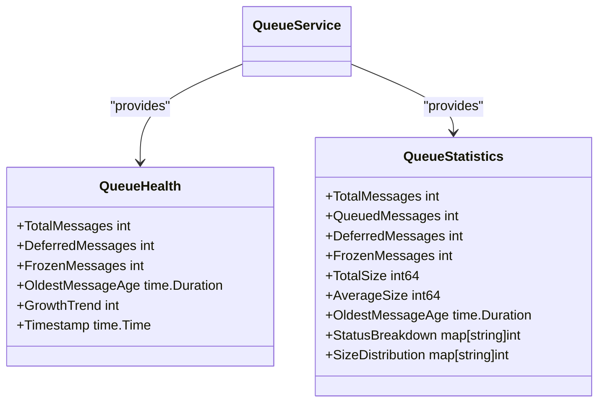

**Diagram sources**
- [service.go](file://internal/queue/service.go#L1-L311)

**Section sources**
- [service.go](file://internal/queue/service.go#L1-L311)

### Health Monitoring Workflow
The system periodically captures queue snapshots to track historical trends and calculate growth rates, providing insights into queue behavior over time.

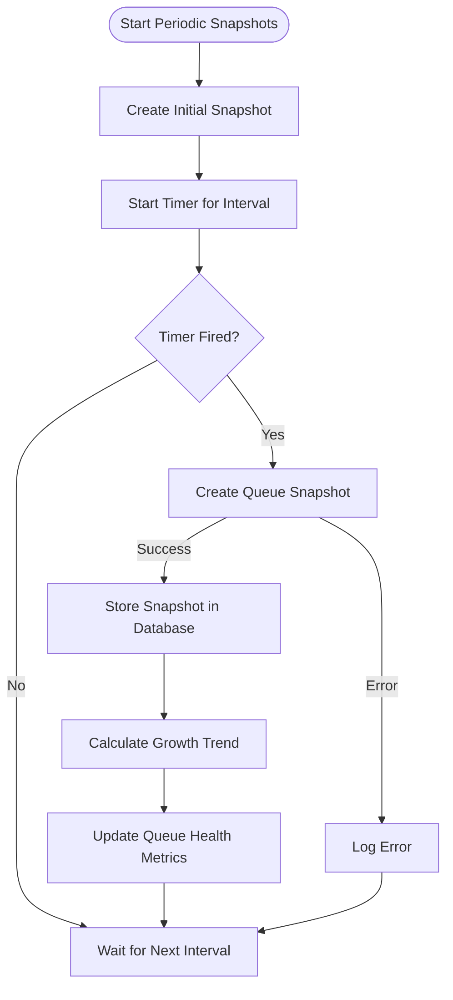

**Diagram sources**
- [service.go](file://internal/queue/service.go#L1-L311)

**Section sources**
- [service.go](file://internal/queue/service.go#L1-L311)

## Audit Logging and Security
All queue operations are logged for security, compliance, and troubleshooting purposes. The system integrates with the audit service to record who performed what action on which message and when.

### Audit Logging Implementation
Every queue operation is recorded in the database with details including the user ID, IP address, operation type, message ID, and timestamp.

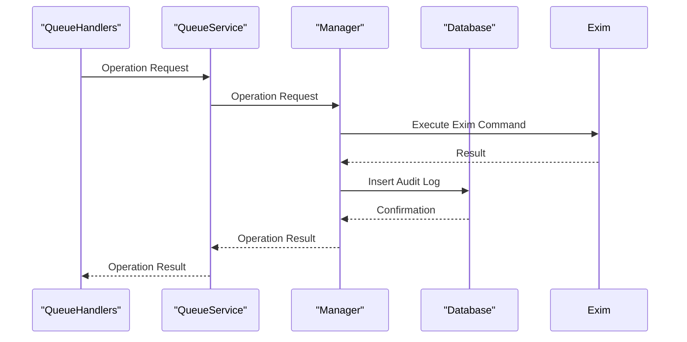

**Diagram sources**
- [queue_handlers.go](file://internal/api/queue_handlers.go#L1-L395)
- [service.go](file://internal/queue/service.go#L1-L311)
- [queue.go](file://internal/queue/queue.go#L1-L397)

**Section sources**
- [queue_handlers.go](file://internal/api/queue_handlers.go#L1-L395)
- [service.go](file://internal/queue/service.go#L1-L311)
- [queue.go](file://internal/queue/queue.go#L1-L397)

## Performance Considerations
The system is designed to handle large queues efficiently with features like virtual scrolling, pagination, and optimized data fetching.

### Virtual Scrolling
For large datasets, the system implements virtual scrolling to render only visible items, significantly improving performance and reducing memory usage.

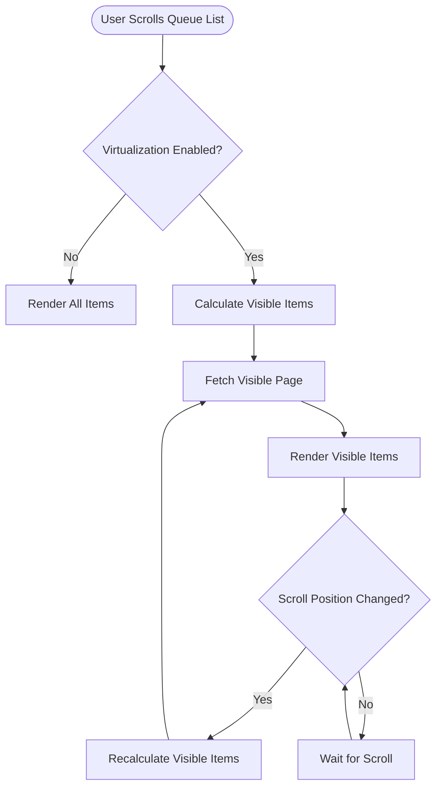

**Diagram sources**
- [QueueList.tsx](file://web/src/components/Queue/QueueList.tsx#L1-L500)

**Section sources**
- [QueueList.tsx](file://web/src/components/Queue/QueueList.tsx#L1-L500)

### Performance Testing
The system includes comprehensive performance tests to ensure responsiveness under various conditions, including large datasets and frequent updates.

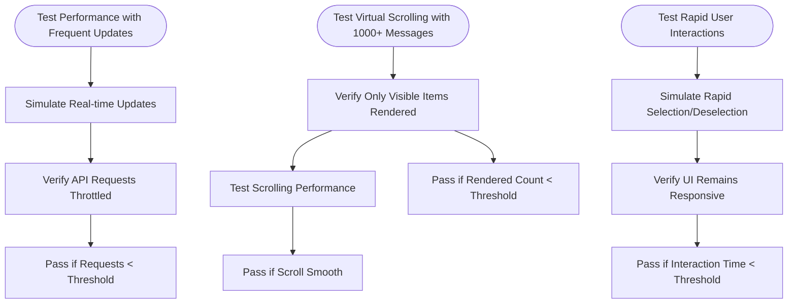

**Diagram sources**
- [queue.spec.ts](file://tests/frontend/queue.spec.ts#L1-L476)

**Section sources**
- [queue.spec.ts](file://tests/frontend/queue.spec.ts#L1-L476)

## Common Issues and Best Practices

### Common Issues
When managing the Exim queue, administrators may encounter several common issues that can affect system performance and reliability.

**Queue Lock Contention**: When multiple processes attempt to modify the queue simultaneously, Exim's queue locking mechanism can cause operations to block or fail. This is particularly common during bulk operations on large queues.

**Performance Under High Load**: Large queues with thousands of messages can impact the performance of queue listing operations, especially when using commands like `exim -bp` which must scan the entire queue directory.

**Partial Operation Failures**: During bulk operations, some messages may fail to process due to various reasons such as invalid message IDs or file system issues, requiring careful error handling and reporting.

### Best Practices for Safe Queue Manipulation
To ensure safe and effective queue management, follow these best practices:

1. **Always Verify Message IDs**: Before performing operations, validate that message IDs exist and are in the expected state to prevent errors.

2. **Use Bulk Operations Judiciously**: While bulk operations improve efficiency, they should be used carefully, especially for destructive operations like deletion. Always confirm with the user before proceeding.

3. **Monitor Queue Health Regularly**: Regularly check queue health metrics to identify growing backlogs or unusual patterns that may indicate underlying issues.

4. **Implement Proper Error Handling**: Ensure that operations include comprehensive error handling and provide clear feedback to users about success and failure rates.

5. **Leverage Search and Filtering**: Use search and filtering capabilities to target specific messages rather than operating on the entire queue unnecessarily.

6. **Review Audit Logs**: Regularly review audit logs to track changes and identify any unauthorized or problematic operations.

7. **Test Operations in Staging**: When possible, test queue operations in a staging environment before applying them to production systems.

8. **Schedule Maintenance During Off-Peak Hours**: Perform major queue cleanup operations during periods of low mail volume to minimize impact on legitimate email delivery.

**Section sources**
- [queue_handlers.go](file://internal/api/queue_handlers.go#L1-L395)
- [service.go](file://internal/queue/service.go#L1-L311)
- [queue.go](file://internal/queue/queue.go#L1-L397)
- [QueueList.tsx](file://web/src/components/Queue/QueueList.tsx#L1-L500)
- [BulkActions.tsx](file://web/src/components/Queue/BulkActions.tsx#L1-L442)
- [queue.spec.ts](file://tests/frontend/queue.spec.ts#L1-L476)

**Referenced Files in This Document**   
- [queue_handlers.go](file://internal/api/queue_handlers.go#L1-L395)
- [service.go](file://internal/queue/service.go#L1-L311)
- [queue.go](file://internal/queue/queue.go#L1-L397)
- [QueueList.tsx](file://web/src/components/Queue/QueueList.tsx#L1-L500)
- [BulkActions.tsx](file://web/src/components/Queue/BulkActions.tsx#L1-L442)
- [queue.ts](file://web/src/types/queue.ts#L55-L96)
- [useQueue.ts](file://web/src/hooks/useQueue.ts#L38-L83)
- [queue.spec.ts](file://tests/frontend/queue.spec.ts#L1-L476)