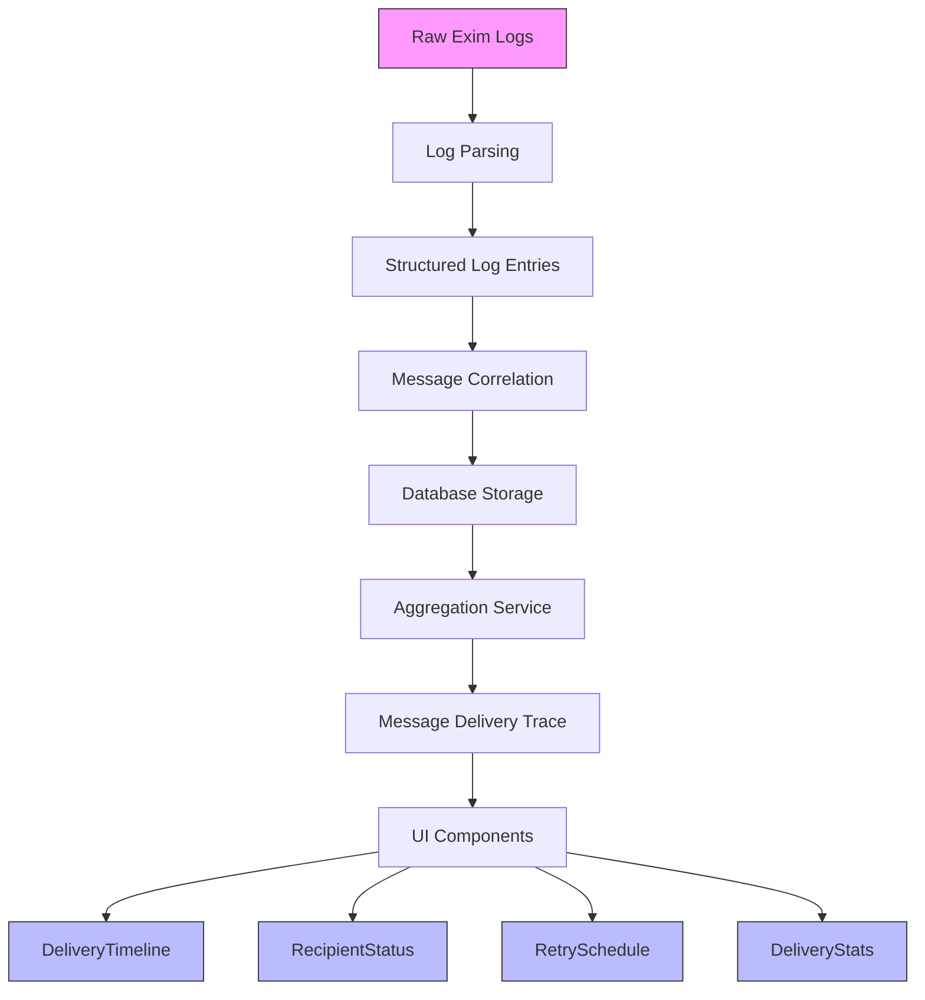
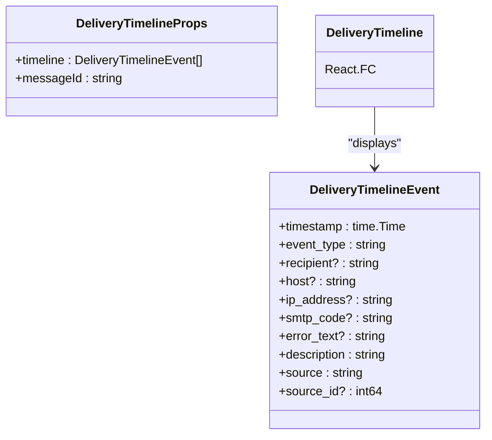
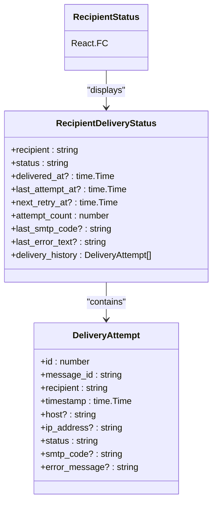
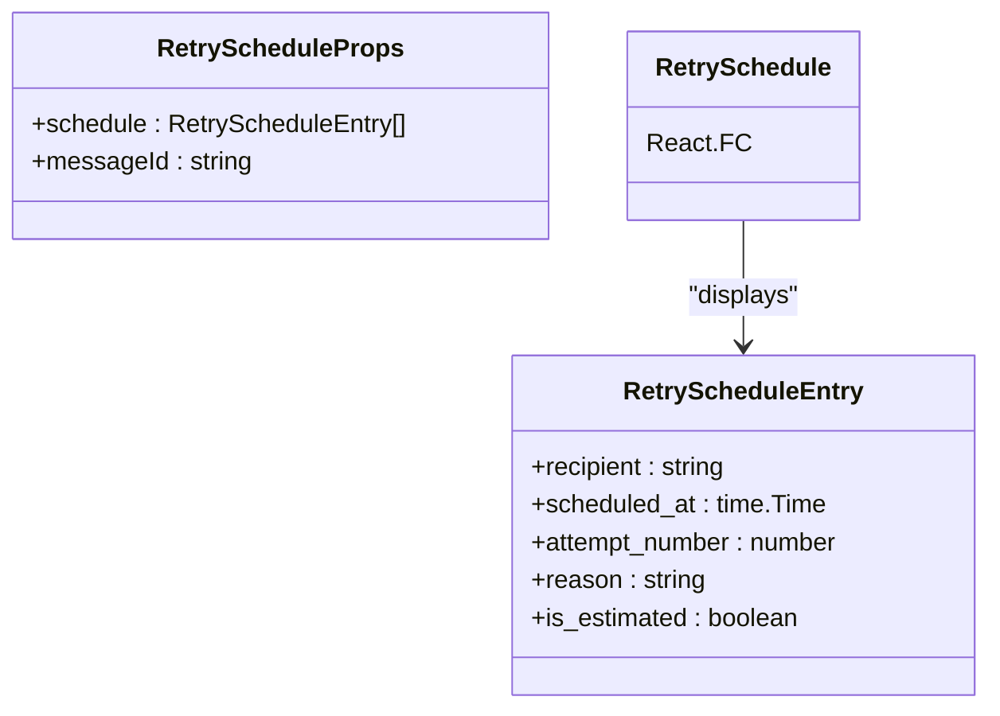
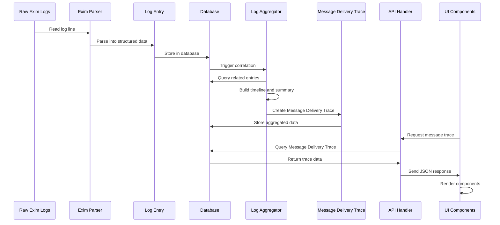
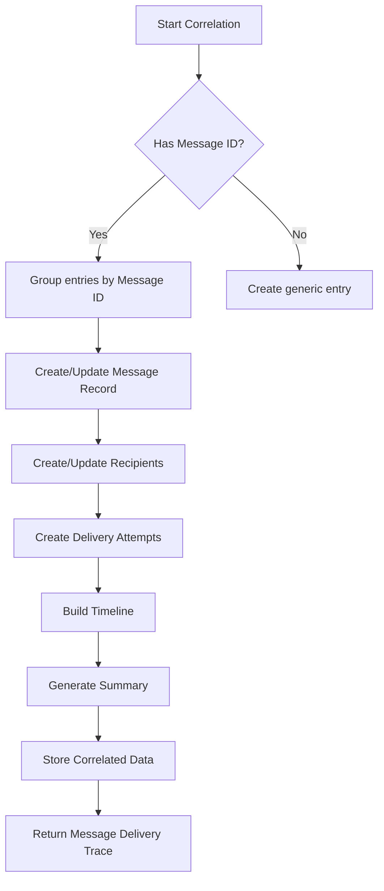
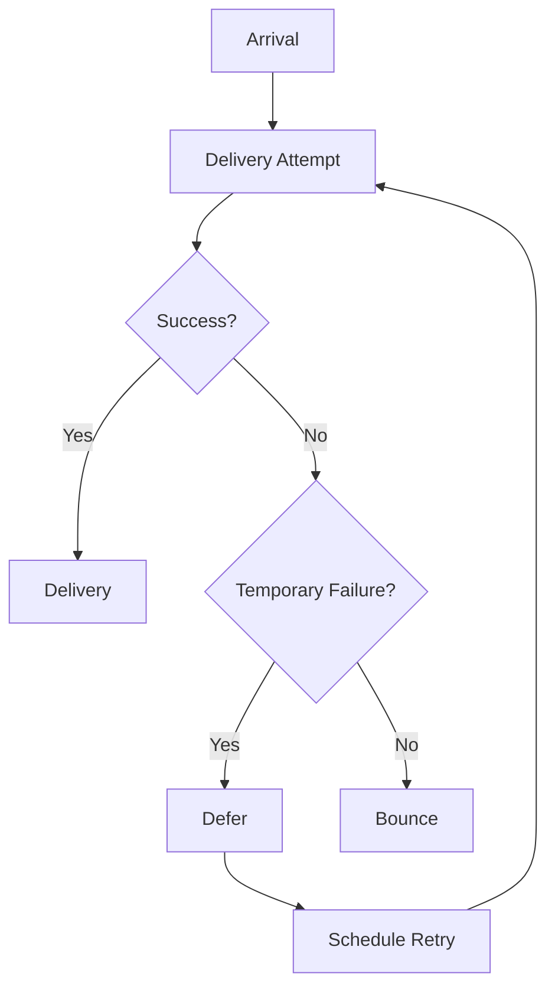
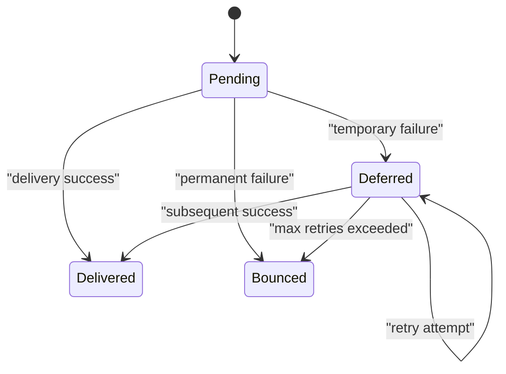
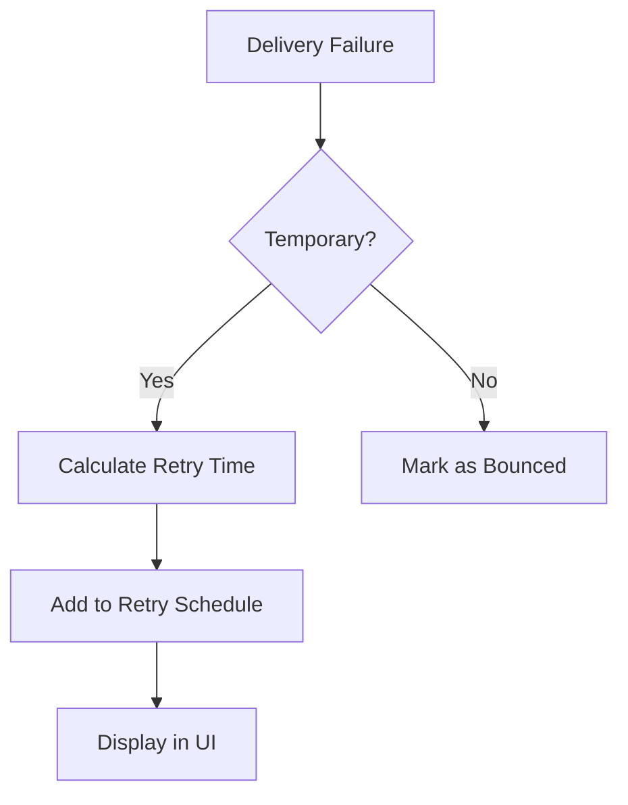

# Message Tracing


## Table of Contents
1. [Introduction](#introduction)
2. [Message Tracing Overview](#message-tracing-overview)
3. [UI Components](#ui-components)
4. [Data Flow and Processing](#data-flow-and-processing)
5. [Log Parsing and Correlation](#log-parsing-and-correlation)
6. [Delivery Timeline Visualization](#delivery-timeline-visualization)
7. [Recipient Status Management](#recipient-status-management)
8. [Retry Schedule Calculation](#retry-schedule-calculation)
9. [Performance Considerations](#performance-considerations)
10. [Troubleshooting Common Issues](#troubleshooting-common-issues)

## Introduction
Message Tracing is a critical feature that enables administrators to track the complete delivery journey of individual email messages through the Exim mail server. This comprehensive tracing capability provides visibility into every hop, attempt, and status change, allowing for effective diagnosis of delivery issues and performance optimization. The system correlates log entries using message IDs to reconstruct the complete delivery timeline from raw Exim logs to structured delivery attempts stored in the database.

## Message Tracing Overview
The Message Tracing feature provides a complete view of a message's lifecycle from receipt to final delivery status. Administrators can follow the delivery journey across multiple hops and attempts, identifying exactly where issues occur. The system captures all relevant information including timestamps, hosts, IP addresses, SMTP codes, and error messages for each delivery event.

The tracing data is organized into several key components:
- **Message metadata**: sender, size, status, and timestamp
- **Delivery timeline**: chronological sequence of all delivery events
- **Recipient status**: per-recipient delivery status and history
- **Retry schedule**: upcoming retry attempts with estimated times
- **Summary statistics**: delivery metrics and performance indicators





**Diagram sources**
- [exim_parser.go](file://internal/parser/exim_parser.go)
- [service.go](file://internal/logprocessor/service.go)
- [aggregator.go](file://internal/logprocessor/aggregator.go)
- [models.go](file://internal/database/models.go)

**Section sources**
- [MessageTrace.tsx](file://web/src/components/MessageTrace/MessageTrace.tsx)
- [models.go](file://internal/database/models.go)

## UI Components
The Message Tracing UI is composed of several React components that visualize different aspects of the delivery process. These components work together to provide a comprehensive view of message delivery.

### DeliveryTimeline Component
The DeliveryTimeline component visualizes the chronological sequence of delivery events for a message. It displays each event with a timestamp, icon, description, and relevant details such as host, IP address, and error information.





**Diagram sources**
- [DeliveryTimeline.tsx](file://web/src/components/MessageTrace/DeliveryTimeline.tsx)
- [models.go](file://internal/database/models.go)

**Section sources**
- [DeliveryTimeline.tsx](file://web/src/components/MessageTrace/DeliveryTimeline.tsx)

### RecipientStatus Component
The RecipientStatus component displays the delivery status for each recipient, allowing filtering by status type and expanding to view detailed delivery history.





**Diagram sources**
- [RecipientStatus.tsx](file://web/src/components/MessageTrace/RecipientStatus.tsx)
- [models.go](file://internal/database/models.go)

**Section sources**
- [RecipientStatus.tsx](file://web/src/components/MessageTrace/RecipientStatus.tsx)

### RetrySchedule Component
The RetrySchedule component displays upcoming retry attempts, distinguishing between confirmed and estimated retries.





**Diagram sources**
- [RetrySchedule.tsx](file://web/src/components/MessageTrace/RetrySchedule.tsx)
- [models.go](file://internal/database/models.go)

**Section sources**
- [RetrySchedule.tsx](file://web/src/components/MessageTrace/RetrySchedule.tsx)

## Data Flow and Processing
The message tracing system follows a structured data flow from raw logs to the final UI presentation. This process ensures that all delivery events are properly correlated and presented in a meaningful way.





**Diagram sources**
- [exim_parser.go](file://internal/parser/exim_parser.go)
- [service.go](file://internal/logprocessor/service.go)
- [aggregator.go](file://internal/logprocessor/aggregator.go)
- [message_trace_handlers.go](file://internal/api/message_trace_handlers.go)
- [MessageTrace.tsx](file://web/src/components/MessageTrace/MessageTrace.tsx)

**Section sources**
- [service.go](file://internal/logprocessor/service.go)
- [aggregator.go](file://internal/logprocessor/aggregator.go)
- [message_trace_handlers.go](file://internal/api/message_trace_handlers.go)

## Log Parsing and Correlation
The system uses a sophisticated parsing and correlation mechanism to transform raw Exim logs into meaningful delivery information.

### Exim Log Parsing
The Exim parser uses regular expressions to identify and extract information from different types of log entries:


```go
// Main log patterns
p.mainLogPatterns = []*LogPattern{
    // Message arrival
    {
        Regex:   regexp.MustCompile(`^(\d{4}-\d{2}-\d{2} \d{2}:\d{2}:\d{2}) ([A-Za-z0-9-]+) <= ([^\s]+) H=([^\s]+) \[([^\]]+)\].*?S=(\d+)`),
        Handler: p.handleMessageArrival,
    },
    // Message delivery
    {
        Regex:   regexp.MustCompile(`^(\d{4}-\d{2}-\d{2} \d{2}:\d{2}:\d{2}) ([A-Za-z0-9-]+) => ([^\s]+) R=([^\s]+) T=([^\s]+) H=([^\s]+) \[([^\]]+)\]`),
        Handler: p.handleMessageDelivery,
    },
    // Message deferral
    {
        Regex:   regexp.MustCompile(`^(\d{4}-\d{2}-\d{2} \d{2}:\d{2}:\d{2}) ([A-Za-z0-9-]+) == ([^\s]+) R=([^\s]+) T=([^\s]+) defer \(([^)]+)\): (.+)`),
        Handler: p.handleMessageDefer,
    },
}
```


Each pattern has an associated handler function that extracts specific fields and creates a structured LogEntry object.

### Message Correlation
The LogAggregator service correlates log entries using message IDs to create a complete delivery trace:





The correlation process involves:
1. Grouping log entries by message ID
2. Creating or updating the message record with sender, size, and status
3. Creating or updating recipient records with their delivery status
4. Creating delivery attempt records for each delivery event
5. Building a chronological timeline of all events
6. Generating summary statistics

**Section sources**
- [exim_parser.go](file://internal/parser/exim_parser.go)
- [aggregator.go](file://internal/logprocessor/aggregator.go)
- [models.go](file://internal/database/models.go)

## Delivery Timeline Visualization
The DeliveryTimeline component provides a visual representation of the message's delivery journey, showing each event in chronological order.

### Timeline Event Types
The timeline displays various event types with appropriate icons and styling:

- **Arrival**: Message received from sender
- **Delivery**: Successful delivery to recipient
- **Defer**: Temporary delivery failure
- **Bounce**: Permanent delivery failure
- **Reject**: Message rejected by server
- **Panic/Error**: System error





The timeline supports filtering by event type, recipient, and source, allowing administrators to focus on specific aspects of the delivery process.

**Section sources**
- [DeliveryTimeline.tsx](file://web/src/components/MessageTrace/DeliveryTimeline.tsx)
- [models.go](file://internal/database/models.go)

## Recipient Status Management
The RecipientStatus component provides detailed information about the delivery status for each recipient.

### Status Tracking
The system tracks recipient status through the following states:
- **Delivered**: Message successfully delivered
- **Deferred**: Temporary delivery failure, retry scheduled
- **Bounced**: Permanent delivery failure
- **Pending**: Awaiting delivery attempt





When a recipient is selected, the component expands to show the complete delivery history, including timestamps, hosts, and error messages for each attempt.

**Section sources**
- [RecipientStatus.tsx](file://web/src/components/MessageTrace/RecipientStatus.tsx)
- [models.go](file://internal/database/models.go)

## Retry Schedule Calculation
The RetrySchedule component displays upcoming retry attempts, helping administrators anticipate future delivery attempts.

### Retry Logic
The system calculates retry schedules based on:
- Number of previous attempts
- Time since last attempt
- Server configuration for retry intervals
- Type of delivery failure


```go
func (p *EximParser) handleMessageDefer(matches []string, timestamp time.Time, rawLine string) *database.LogEntry {
    messageID := matches[2]
    recipient := matches[3]
    errorCode := matches[6]
    errorText := matches[7]

    return &database.LogEntry{
        Timestamp:  timestamp,
        MessageID:  &messageID,
        Event:      database.EventDefer,
        Recipients: []string{recipient},
        Status:     stringPtr("deferred"),
        ErrorCode:  &errorCode,
        ErrorText:  &errorText,
    }
}
```


The UI distinguishes between:
- **Confirmed retries**: Scheduled based on server configuration
- **Estimated retries**: Predicted based on historical patterns





**Section sources**
- [RetrySchedule.tsx](file://web/src/components/MessageTrace/RetrySchedule.tsx)
- [exim_parser.go](file://internal/parser/exim_parser.go)
- [models.go](file://internal/database/models.go)

## Performance Considerations
The message tracing system is designed to handle high-volume message tracking efficiently.

### Log Indexing and Retrieval
The database schema includes indexes on key fields to optimize query performance:


```sql
-- Indexes for efficient message tracing
CREATE INDEX idx_log_entries_message_id ON log_entries(message_id);
CREATE INDEX idx_log_entries_timestamp ON log_entries(timestamp);
CREATE INDEX idx_delivery_attempts_message_id ON delivery_attempts(message_id);
CREATE INDEX idx_recipients_message_id ON recipients(message_id);
```


### Caching Strategy
The system implements caching at multiple levels:
- **Database query caching**: Frequently accessed message traces are cached
- **Result pagination**: Large result sets are paginated
- **Lazy loading**: Detailed information is loaded on demand

### Background Processing
Log correlation and aggregation occur in background services to avoid impacting real-time operations:


```go
// Background processing configuration
backgroundConfig := BackgroundConfig{
    CorrelationInterval:    30 * time.Minute,
    CorrelationBatchHours:  24,
    LogRetentionDays:       90,
    AuditRetentionDays:     365,
    SnapshotRetentionDays:  30,
    CleanupInterval:        6 * time.Hour,
    CleanupBatchSize:       1000,
    MaxConcurrentTasks:     3,
}
```


This approach ensures that the UI remains responsive even when tracing high-volume messages.

**Section sources**
- [service.go](file://internal/logprocessor/service.go)
- [models.go](file://internal/database/models.go)
- [aggregator.go](file://internal/logprocessor/aggregator.go)

## Troubleshooting Common Issues
The message tracing system helps diagnose various delivery issues by providing detailed information about each delivery attempt.

### DNS Failure Diagnosis
When a DNS failure occurs, the system captures the error in the log entry:


```go
// Example of DNS failure in log
// "defer (110): failed to resolve MX host example.com"
func (p *EximParser) handleMessageDefer(matches []string, timestamp time.Time, rawLine string) *database.LogEntry {
    // Extract error code and text
    errorCode := matches[6] // "110" for DNS failure
    errorText := matches[7] // "failed to resolve MX host example.com"
    
    return &database.LogEntry{
        Timestamp:  timestamp,
        Event:      database.EventDefer,
        Status:     stringPtr("deferred"),
        ErrorCode:  &errorCode,
        ErrorText:  &errorText,
    }
}
```


Administrators can identify DNS issues by looking for:
- Error code 110 in deferred messages
- "failed to resolve" or "DNS lookup" in error text
- Multiple deferrals to the same domain

### Recipient Rejection Diagnosis
Recipient rejections are captured with specific error codes and messages:


```go
// Example of recipient rejection
// "R=reject: recipient address rejected: User unknown"
func (p *EximParser) handleSMTPRejected(matches []string, timestamp time.Time, rawLine string) *database.LogEntry {
    host := matches[2]
    recipient := matches[5]
    reason := matches[6] // "recipient address rejected: User unknown"
    
    return &database.LogEntry{
        Timestamp:  timestamp,
        Event:      database.EventReject,
        Host:       &host,
        Recipients: []string{recipient},
        Status:     stringPtr("rejected"),
        ErrorText:  &reason,
    }
}
```


Common rejection patterns include:
- "User unknown" or "mailbox unavailable"
- "Relay access denied"
- "Spam content detected"
- "Rate limit exceeded"

The system correlates these events with the delivery timeline, showing exactly when and why each rejection occurred.

**Section sources**
- [exim_parser.go](file://internal/parser/exim_parser.go)
- [models.go](file://internal/database/models.go)
- [aggregator.go](file://internal/logprocessor/aggregator.go)

**Referenced Files in This Document**   
- [MessageTrace.tsx](file://web/src/components/MessageTrace/MessageTrace.tsx)
- [DeliveryTimeline.tsx](file://web/src/components/MessageTrace/DeliveryTimeline.tsx)
- [RecipientStatus.tsx](file://web/src/components/MessageTrace/RecipientStatus.tsx)
- [RetrySchedule.tsx](file://web/src/components/MessageTrace/RetrySchedule.tsx)
- [exim_parser.go](file://internal/parser/exim_parser.go)
- [models.go](file://internal/database/models.go)
- [service.go](file://internal/logprocessor/service.go)
- [aggregator.go](file://internal/logprocessor/aggregator.go)
- [message_trace_handlers.go](file://internal/api/message_trace_handlers.go)