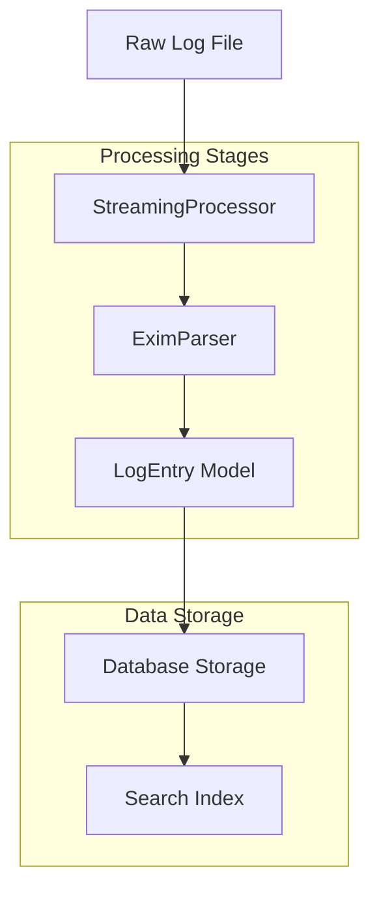
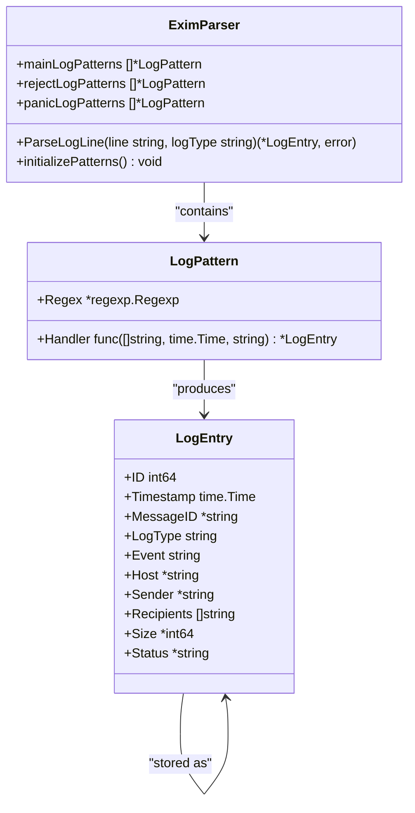
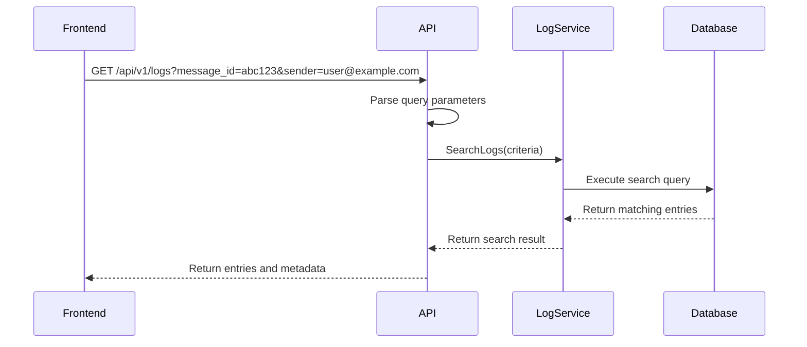
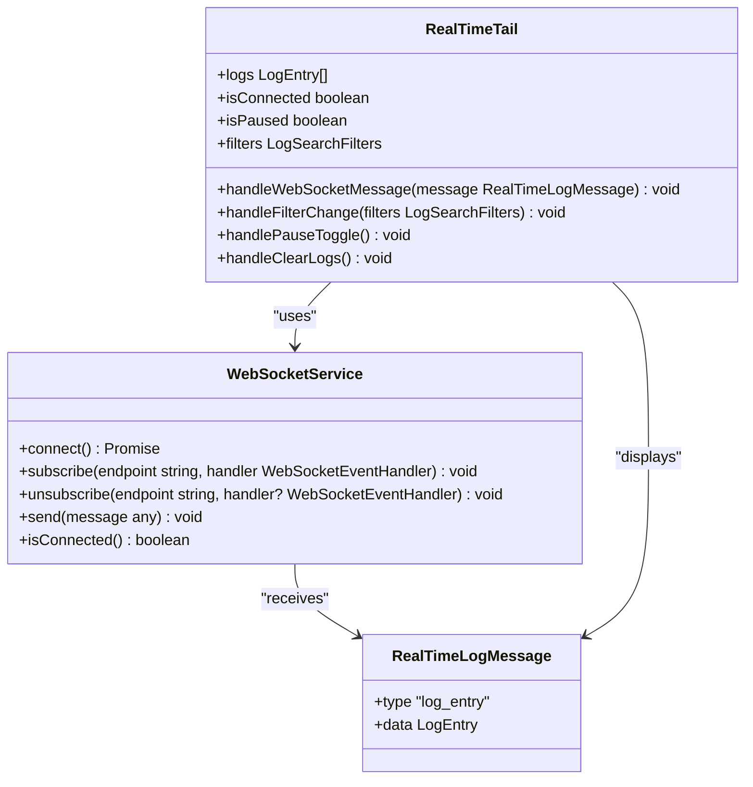
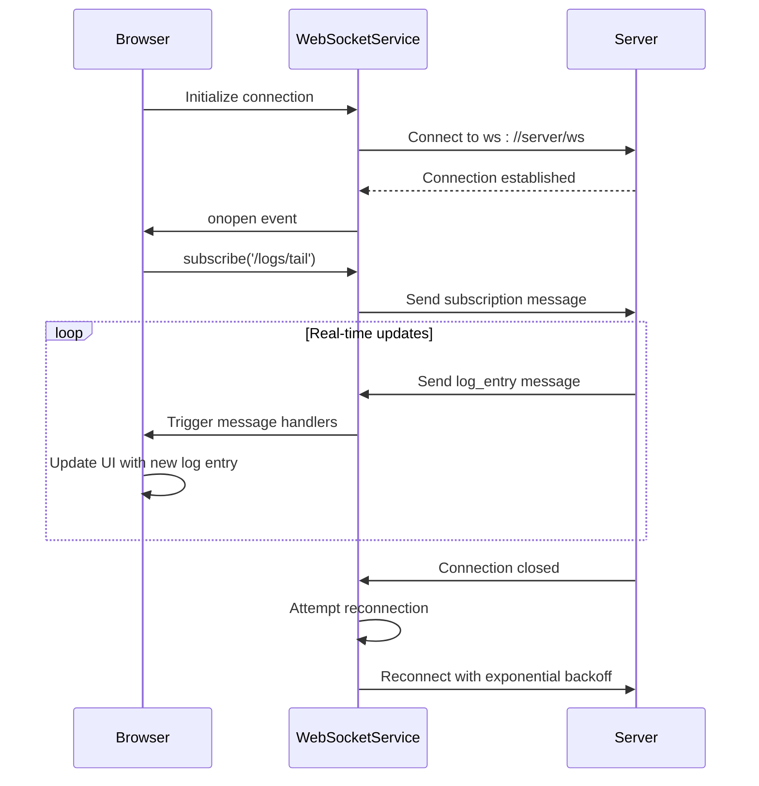
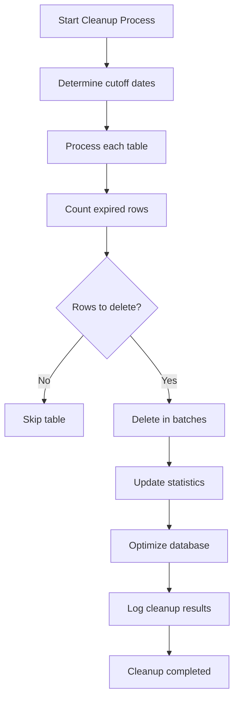
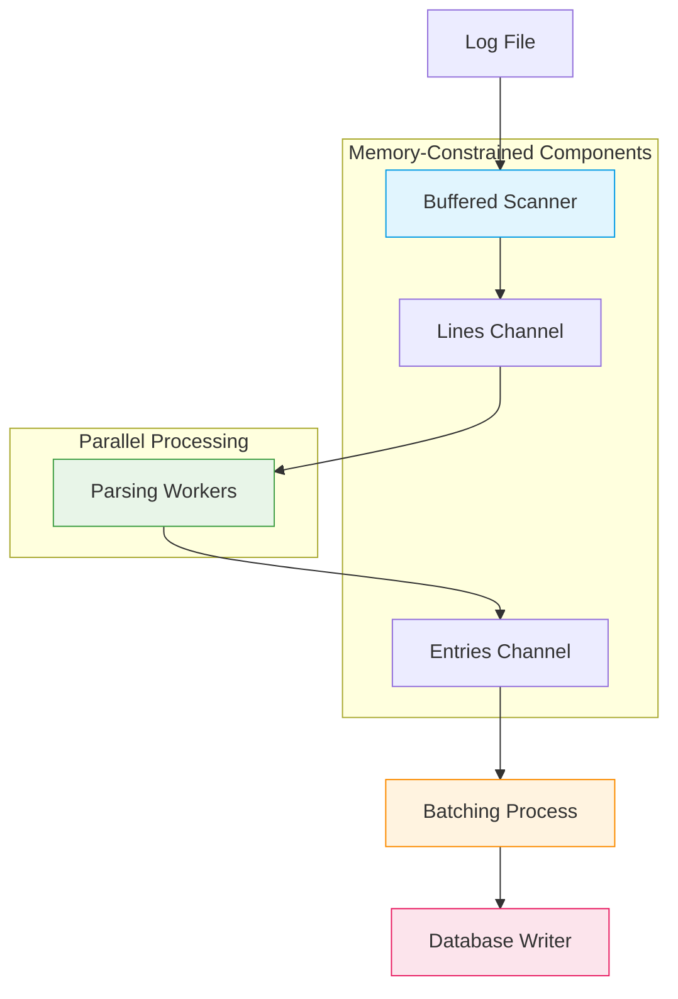

# Log Monitoring


## Table of Contents
1. [Introduction](#introduction)
2. [Core Components](#core-components)
3. [Log Processing Pipeline](#log-processing-pipeline)
4. [Search and Query Processing](#search-and-query-processing)
5. [Real-Time Log Streaming](#real-time-log-streaming)
6. [Data Retention and Cleanup](#data-retention-and-cleanup)
7. [Troubleshooting Delivery Issues](#troubleshooting-delivery-issues)
8. [Performance and Scalability](#performance-and-scalability)

## Introduction
The Log Monitoring feature provides real-time visibility into Exim mail server operations through structured log search and tailing capabilities. This system enables administrators to monitor message flows, troubleshoot delivery issues, and analyze server performance by processing raw Exim log files into structured data that can be efficiently searched and visualized. The architecture consists of a backend log processor that parses, aggregates, and indexes log entries, coupled with frontend components that provide filtering, searching, and live streaming of log data. This documentation details the implementation, functionality, and usage patterns of the log monitoring system.

## Core Components

The log monitoring system comprises several interconnected components that work together to provide comprehensive log visibility:

- **EximParser**: Responsible for parsing raw Exim log entries into structured data
- **LogProcessor**: Handles log processing, aggregation, and indexing for fast retrieval
- **LogHandlers**: API endpoints that expose log data to the frontend
- **LogViewer**: Frontend component for browsing and searching historical logs
- **RealTimeTail**: Frontend component for live streaming of log entries
- **RetentionService**: Manages data retention policies and cleanup processes

These components work together to transform raw log data into actionable insights, enabling administrators to monitor mail server operations effectively.

**Section sources**
- [exim_parser.go](file://internal/parser/exim_parser.go#L1-L300)
- [log_handlers.go](file://internal/api/log_handlers.go#L1-L431)
- [models.go](file://internal/database/models.go#L1-L341)

## Log Processing Pipeline

The log processing pipeline transforms raw Exim log entries into structured data that can be efficiently searched and analyzed. This process involves parsing, validation, and storage of log entries.





**Diagram sources**
- [streaming.go](file://internal/logprocessor/streaming.go#L1-L416)
- [exim_parser.go](file://internal/parser/exim_parser.go#L1-L300)
- [models.go](file://internal/database/models.go#L1-L341)

### Log Parsing Implementation

The EximParser component uses regular expressions to extract structured information from raw log entries. It supports multiple log types including main, reject, and panic logs, each with specific patterns.





**Diagram sources**
- [exim_parser.go](file://internal/parser/exim_parser.go#L1-L300)
- [models.go](file://internal/database/models.go#L1-L341)

The parser identifies various log events including message arrival, delivery, deferral, bounce, and completion. For each matching pattern, it extracts relevant fields such as message ID, sender, recipient, host, and size, creating a structured LogEntry object.

**Section sources**
- [exim_parser.go](file://internal/parser/exim_parser.go#L1-L300)

## Search and Query Processing

The search functionality enables users to filter and retrieve log entries based on various criteria, providing fast access to relevant log data.

### Search Criteria and Filters

Users can search logs using multiple filter parameters:

- **Message ID**: Filter by specific message identifier
- **Sender**: Filter by sender email address
- **Recipient**: Filter by recipient email address
- **Log Type**: Filter by log type (main, reject, panic)
- **Event**: Filter by event type (arrival, delivery, defer, bounce)
- **Status**: Filter by message status
- **Host**: Filter by hostname
- **Time Range**: Filter by timestamp range
- **Size**: Filter by message size (min/max)
- **Keywords**: Filter by text content in raw log line





**Diagram sources**
- [log_handlers.go](file://internal/api/log_handlers.go#L1-L431)
- [models.go](file://internal/database/models.go#L1-L341)

### Search Implementation

The search functionality is implemented through the LogHandlers component, which processes HTTP requests and converts query parameters into search criteria for the log service.


```go
// Search criteria structure
type SearchCriteria struct {
    Limit      int
    Offset     int
    StartTime  *time.Time
    EndTime    *time.Time
    MessageID  string
    Sender     string
    LogTypes   []string
    Events     []string
    Status     string
    Host       string
    ErrorCode  string
    MinSize    *int64
    MaxSize    *int64
    SortBy     string
    SortOrder  string
}
```


The search results include not only the matching log entries but also aggregation data and search performance metrics.

**Section sources**
- [log_handlers.go](file://internal/api/log_handlers.go#L1-L431)

## Real-Time Log Streaming

The real-time log streaming feature provides live monitoring of Exim server operations through WebSocket-based communication.

### Frontend Implementation

The RealTimeTail component implements a WebSocket client that connects to the server and displays incoming log entries in real-time.





**Diagram sources**
- [RealTimeTail.tsx](file://web/src/components/Logs/RealTimeTail.tsx#L1-L387)
- [websocket.ts](file://web/src/services/websocket.ts#L1-L165)

### WebSocket Communication

The WebSocket service handles the connection lifecycle, including automatic reconnection attempts when the connection is lost.





**Diagram sources**
- [websocket.ts](file://web/src/services/websocket.ts#L1-L165)
- [RealTimeTail.tsx](file://web/src/components/Logs/RealTimeTail.tsx#L1-L387)

**Section sources**
- [websocket.ts](file://web/src/services/websocket.ts#L1-L165)
- [RealTimeTail.tsx](file://web/src/components/Logs/RealTimeTail.tsx#L1-L387)

## Data Retention and Cleanup

The system implements configurable data retention policies to manage storage usage and ensure compliance with data retention requirements.

### Retention Configuration

The retention policies are defined in the RetentionConfig structure, which specifies retention periods for different data types:


```go
type RetentionConfig struct {
    LogEntriesRetentionDays       int
    AuditLogRetentionDays         int
    QueueSnapshotsRetentionDays   int
    DeliveryAttemptsRetentionDays int
    SessionsRetentionDays         int
    EnableAutoCleanup             bool
    CleanupBatchSize              int
    CleanupIntervalHours          int
}
```


Default retention periods:
- **Log entries**: 90 days (3 months)
- **Audit log**: 365 days (1 year)
- **Queue snapshots**: 30 days (1 month)
- **Delivery attempts**: 180 days (6 months)
- **Sessions**: 7 days (1 week)





**Diagram sources**
- [retention.go](file://internal/database/retention.go#L1-L360)

The cleanup process runs periodically (default: daily) and deletes expired data in batches to avoid long-running transactions and database performance issues.

**Section sources**
- [retention.go](file://internal/database/retention.go#L1-L360)

## Troubleshooting Delivery Issues

The log monitoring system provides tools to diagnose and troubleshoot email delivery issues by analyzing log patterns and message flows.

### Common Delivery Issues and Log Patterns

#### Message Deferral
When a message cannot be delivered immediately, Exim logs a deferral event:


```
2023-06-15 14:30:22 ABC123 == user@example.com R=dnslookup T=remote_smtp defer (110): Connection timed out
```


This indicates a temporary delivery failure that will be retried.

#### Message Bounce
When a message cannot be delivered permanently, Exim logs a bounce event:


```
2023-06-15 14:35:10 ABC123 ** user@example.com R=dnslookup T=remote_smtp: SMTP error from remote mail server after RCPT TO: 550 5.1.1 <user@example.com>: Recipient address rejected: User unknown
```


This indicates a permanent delivery failure.

#### Connection Rejection
When Exim rejects an incoming connection:


```
2023-06-15 14:40:15 rejected connection from [192.168.1.100]: Access denied
```


This indicates the connection was blocked by access control rules.

### Message Flow Tracing

To trace a message's journey through the system, users can:

1. Search for the message by Message ID
2. Filter logs by the specific message ID
3. Examine the sequence of events (arrival, delivery attempts, deferral, delivery, or bounce)
4. Check recipient-specific status and error messages

This allows administrators to identify where in the delivery process an issue occurred and take appropriate action.

**Section sources**
- [exim_parser.go](file://internal/parser/exim_parser.go#L1-L300)
- [models.go](file://internal/database/models.go#L1-L341)

## Performance and Scalability

The log monitoring system is designed to handle large volumes of log data efficiently through several optimization strategies.

### Scalability Challenges and Solutions

#### Large Log Volumes
To handle large log volumes, the system implements:

- **Streaming processing**: Logs are processed line by line without loading entire files into memory
- **Concurrent workers**: Multiple goroutines process log lines in parallel
- **Batched database operations**: Log entries are inserted in batches to reduce database round trips
- **Efficient indexing**: Database indexes are created on frequently queried fields

#### Memory Management
The streaming processor includes memory usage limits and implements:

- **Configurable buffer sizes**: Limits on the number of lines held in memory
- **Batch flushing**: Regular flushing of processed batches to prevent memory buildup
- **Memory monitoring**: Tracking of memory usage during processing





**Diagram sources**
- [streaming.go](file://internal/logprocessor/streaming.go#L1-L416)

### Indexing Strategies

The system employs strategic database indexing to optimize query performance:

- **Timestamp index**: For time-range queries
- **Message ID index**: For message-specific lookups
- **Sender index**: For sender-based searches
- **Log type index**: For log type filtering
- **Event index**: For event type filtering

These indexes enable fast retrieval of log entries even with large datasets.

**Section sources**
- [streaming.go](file://internal/logprocessor/streaming.go#L1-L416)
- [background_service.go](file://internal/logprocessor/background_service.go#L1-L491)

**Referenced Files in This Document**   
- [exim_parser.go](file://internal/parser/exim_parser.go)
- [log_handlers.go](file://internal/api/log_handlers.go)
- [models.go](file://internal/database/models.go)
- [retention.go](file://internal/database/retention.go)
- [background_service.go](file://internal/logprocessor/background_service.go)
- [streaming.go](file://internal/logprocessor/streaming.go)
- [websocket.ts](file://web/src/services/websocket.ts)
- [RealTimeTail.tsx](file://web/src/components/Logs/RealTimeTail.tsx)
- [LogViewer.tsx](file://web/src/components/Logs/LogViewer.tsx)
- [logs.ts](file://web/src/types/logs.ts)