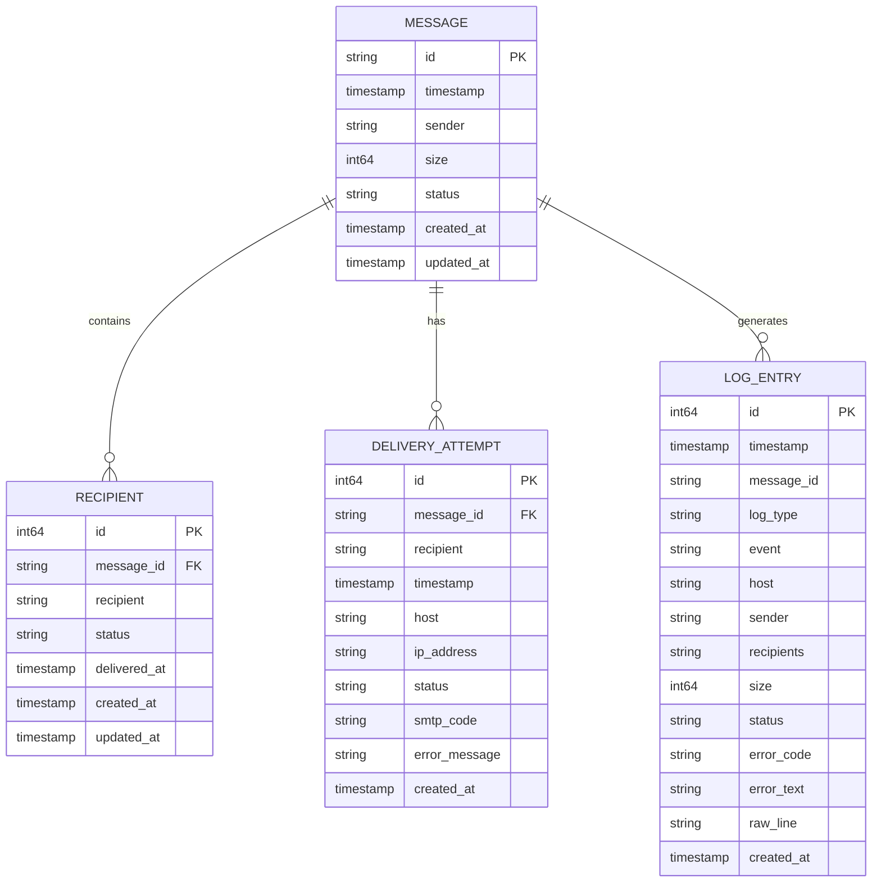
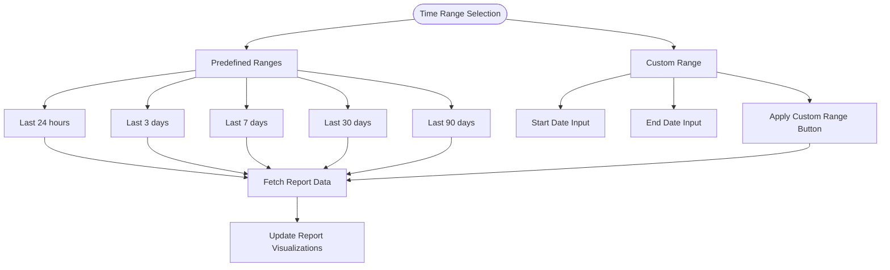
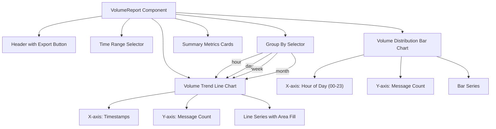
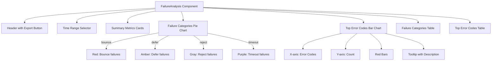
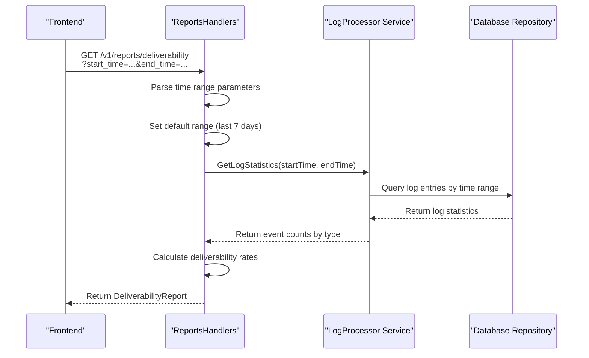
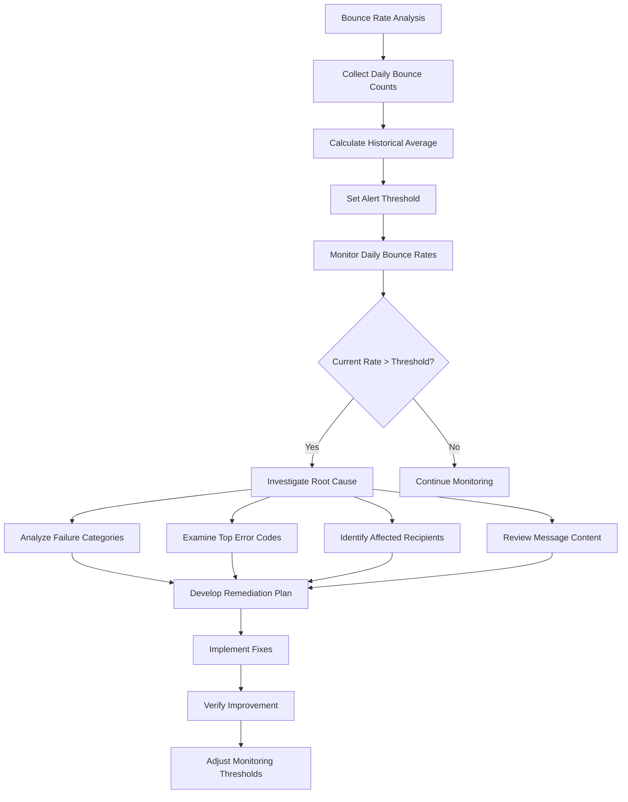
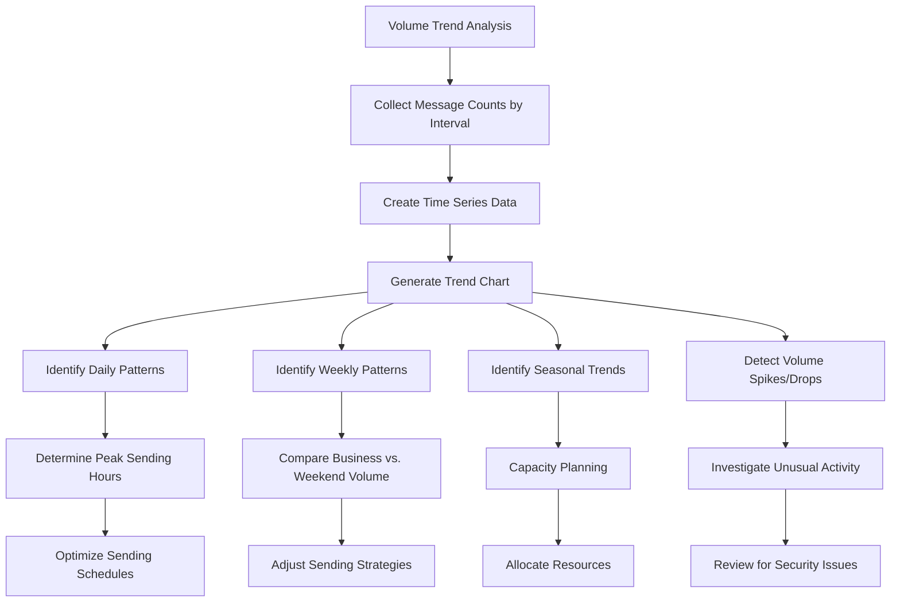
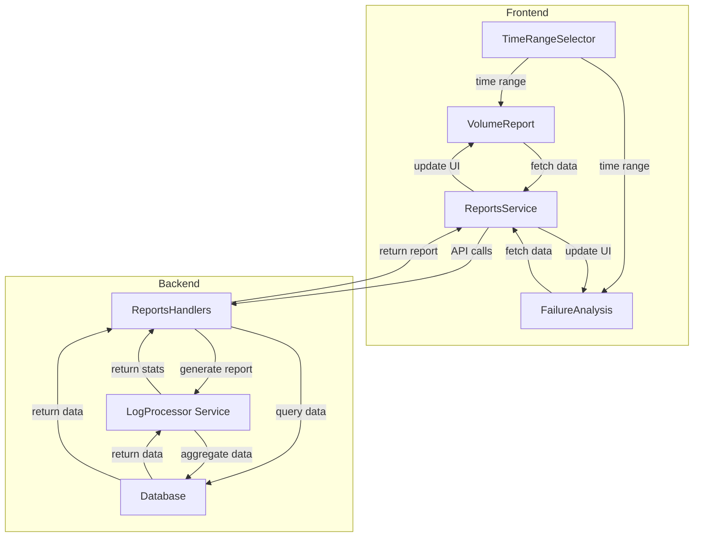

# Reporting


## Table of Contents
1. [Introduction](#introduction)
2. [Core Data Models](#core-data-models)
3. [Frontend Report Components](#frontend-report-components)
4. [Backend Report Generation](#backend-report-generation)
5. [Deliverability Analysis](#deliverability-analysis)
6. [Volume Reporting](#volume-reporting)
7. [Failure Analysis](#failure-analysis)
8. [Performance Considerations](#performance-considerations)
9. [Data Flow and Architecture](#data-flow-and-architecture)

## Introduction
The Reporting feature in Exim-Pilot transforms raw email delivery data into actionable insights through comprehensive analysis of deliverability, volume trends, and failure patterns. This system enables administrators to monitor email performance, identify delivery issues, and optimize their email infrastructure. The reporting functionality is built on a robust architecture that processes log data, aggregates metrics, and presents them through an intuitive frontend interface with interactive visualizations. Users can analyze delivery success rates, track volume patterns over time, and investigate failure causes with detailed breakdowns by category and error code.

## Core Data Models
The reporting system is built upon several key data models that represent email messages, delivery attempts, and recipient status. These models form the foundation for all reporting functionality and are used to calculate metrics and generate insights.





**Diagram sources**
- [models.go](file://internal/database/models.go#L10-L341)

### Message Model
The Message model represents an email message in the system with key properties:

**:ID** - Unique identifier for the message  
**:Timestamp** - When the message was received  
**:Sender** - Email address of the sender  
**:Size** - Size of the message in bytes  
**:Status** - Current status of the message (received, queued, delivered, deferred, bounced, frozen)

Status constants include:
- `StatusReceived` - Message has been received
- `StatusQueued` - Message is in the delivery queue
- `StatusDelivered` - Message has been successfully delivered
- `StatusDeferred` - Delivery attempt was deferred
- `StatusBounced` - Message was bounced
- `StatusFrozen` - Message is frozen and not being processed

**Section sources**
- [models.go](file://internal/database/models.go#L10-L23)

### Recipient Model
The Recipient model tracks the delivery status for each recipient of a message:

**:MessageID** - Reference to the parent message  
**:Recipient** - Email address of the recipient  
**:Status** - Delivery status for this recipient  
**:DeliveredAt** - Timestamp when the recipient was delivered (if applicable)

Recipient status constants include:
- `RecipientStatusDelivered` - Successfully delivered
- `RecipientStatusDeferred` - Delivery deferred
- `RecipientStatusBounced` - Delivery bounced
- `RecipientStatusPending` - Awaiting delivery

**Section sources**
- [models.go](file://internal/database/models.go#L35-L50)

### DeliveryAttempt Model
The DeliveryAttempt model records each attempt to deliver a message to a recipient:

**:MessageID** - Reference to the message  
**:Recipient** - Email address being attempted  
**:Timestamp** - When the attempt occurred  
**:Host** - Target mail server hostname  
**:IPAddress** - Target mail server IP address  
**:Status** - Result of the attempt  
**:SMTPCode** - SMTP response code (if available)  
**:ErrorMessage** - Error message from the target server

Delivery attempt status constants include:
- `AttemptStatusSuccess` - Delivery successful
- `AttemptStatusDefer` - Delivery deferred
- `AttemptStatusBounce` - Delivery bounced
- `AttemptStatusTimeout` - Connection timeout

**Section sources**
- [models.go](file://internal/database/models.go#L52-L70)

## Frontend Report Components
The frontend reporting interface consists of reusable React components that visualize delivery metrics and allow users to interact with the data through time range selection and data export.

### Time Range Selection
The TimeRangeSelector component enables users to select predefined or custom time periods for report analysis:





**Diagram sources**
- [TimeRangeSelector.tsx](file://web/src/components/Reports/TimeRangeSelector.tsx#L1-L112)

The component supports the following time range options:
- **Last 24 hours** - Previous day's data
- **Last 3 days** - Three-day analysis window
- **Last 7 days** - Weekly performance overview
- **Last 30 days** - Monthly trend analysis
- **Last 90 days** - Quarterly performance review
- **Custom** - User-defined date range

When a time range is selected, the component converts the selection to ISO timestamp format and triggers data fetching for the reports.

**Section sources**
- [TimeRangeSelector.tsx](file://web/src/components/Reports/TimeRangeSelector.tsx#L1-L112)
- [reports.ts](file://web/src/types/reports.ts#L100-L115)

### Volume Report Visualization
The VolumeReport component displays email volume trends over time with interactive charts:





**Diagram sources**
- [VolumeReport.tsx](file://web/src/components/Reports/VolumeReport.tsx#L1-L434)

The component includes:
- **Volume Trend Chart** - Line chart showing message volume over time with smooth line and area fill
- **Volume Distribution Chart** - Bar chart showing message volume by hour of day
- **Summary Metrics** - Cards displaying total volume, average volume, and peak volume
- **Export Functionality** - CSV export of the complete dataset

The visualization adapts to the selected grouping (hour, day, week, month) and formats numbers with thousands separators for readability.

**Section sources**
- [VolumeReport.tsx](file://web/src/components/Reports/VolumeReport.tsx#L1-L434)

### Failure Analysis Visualization
The FailureAnalysis component provides detailed breakdowns of delivery failures with categorical analysis:





**Diagram sources**
- [FailureAnalysis.tsx](file://web/src/components/Reports/FailureAnalysis.tsx#L1-L382)

The component features:
- **Failure Categories Pie Chart** - Visual breakdown of failure types with color-coded categories
- **Top Error Codes Bar Chart** - Horizontal bar chart showing the most frequent error codes
- **Summary Metrics** - Cards showing total failures, failure categories, and error codes
- **Detailed Tables** - Tabular data with category descriptions and error code details

Failure categories are color-coded for quick identification:
- **Red** - Bounce-related failures
- **Amber** - Defer-related failures
- **Gray** - Reject-related failures
- **Purple** - Timeout-related failures

**Section sources**
- [FailureAnalysis.tsx](file://web/src/components/Reports/FailureAnalysis.tsx#L1-L382)

## Backend Report Generation
The backend reporting system generates comprehensive analytics by aggregating data from log entries, messages, and delivery attempts. The implementation follows a service-oriented architecture with dedicated handlers for different report types.

### Report Generation Workflow
The report generation process follows a standardized workflow across all report types:





**Diagram sources**
- [reports_handlers.go](file://internal/api/reports_handlers.go#L1-L664)

The workflow includes:
1. **Request Handling** - The API endpoint receives the report request with optional time range parameters
2. **Parameter Validation** - Time range is validated and defaults are applied if not specified
3. **Data Aggregation** - The log processor service aggregates statistics from the database
4. **Metric Calculation** - Rates and percentages are calculated from raw counts
5. **Response Formatting** - Data is structured according to the report schema
6. **Response Delivery** - JSON response is sent back to the frontend

**Section sources**
- [reports_handlers.go](file://internal/api/reports_handlers.go#L1-L664)

### Deliverability Report Generation
The deliverability report analyzes the success rate of email delivery by calculating key performance indicators:


```go
// generateDeliverabilityReport generates a comprehensive deliverability report
func (h *ReportsHandlers) generateDeliverabilityReport(ctx context.Context, startTime, endTime time.Time) (*DeliverabilityReport, error) {
	// Get log statistics for the period
	logStats, err := h.logService.GetLogStatistics(ctx, startTime, endTime)
	if err != nil {
		return nil, err
	}

	// Calculate deliverability metrics
	report := &DeliverabilityReport{
		Period: Period{
			Start: startTime,
			End:   endTime,
		},
		TotalMessages: logStats.TotalEntries,
		EventCounts:   logStats.ByEvent,
		LogTypeCounts: logStats.ByLogType,
	}

	// Calculate rates
	if report.TotalMessages > 0 {
		delivered := logStats.ByEvent["delivery"]
		deferred := logStats.ByEvent["defer"]
		bounced := logStats.ByEvent["bounce"]
		rejected := logStats.ByEvent["reject"]

		report.DeliveredCount = delivered
		report.DeferredCount = deferred
		report.BouncedCount = bounced
		report.RejectedCount = rejected

		report.DeliveryRate = float64(delivered) / float64(report.TotalMessages) * 100
		report.DeferralRate = float64(deferred) / float64(report.TotalMessages) * 100
		report.BounceRate = float64(bounced) / float64(report.TotalMessages) * 100
		report.RejectionRate = float64(rejected) / float64(report.TotalMessages) * 100
	}
```


The report includes:
- **Delivery Rate** - Percentage of messages successfully delivered
- **Deferral Rate** - Percentage of messages temporarily deferred
- **Bounce Rate** - Percentage of messages permanently bounced
- **Rejection Rate** - Percentage of messages rejected by the recipient server

These metrics help identify deliverability issues and track improvements over time.

**Section sources**
- [reports_handlers.go](file://internal/api/reports_handlers.go#L300-L350)

### Volume Report Generation
The volume report analyzes message throughput patterns with configurable time grouping:


```go
// generateVolumeReport generates volume analysis with configurable grouping
func (h *ReportsHandlers) generateVolumeReport(ctx context.Context, startTime, endTime time.Time, groupBy string) (*VolumeReport, error) {
	// Query volume data grouped by specified interval
	volumeData, err := h.repository.GetVolumeByInterval(ctx, startTime, endTime, groupBy)
	if err != nil {
		return nil, err
	}

	// Calculate summary metrics
	totalVolume := 0
	peakVolume := 0
	for _, point := range volumeData {
		totalVolume += point.Count
		if point.Count > peakVolume {
			peakVolume = point.Count
		}
	}

	averageVolume := 0
	if len(volumeData) > 0 {
		averageVolume = totalVolume / len(volumeData)
	}

	return &VolumeReport{
		Period: Period{
			Start: startTime,
			End:   endTime,
		},
		GroupBy:       groupBy,
		TotalVolume:   totalVolume,
		AverageVolume: averageVolume,
		PeakVolume:    peakVolume,
		TimeSeries:    volumeData,
	}, nil
}
```


The report supports multiple grouping options:
- **Hour** - Volume by hour (useful for identifying peak sending times)
- **Day** - Volume by day (daily trends and patterns)
- **Week** - Volume by week (weekly patterns and seasonality)
- **Month** - Volume by month (long-term trends)

The time series data enables visualization of volume trends and identification of spikes or drops in activity.

**Section sources**
- [reports_handlers.go](file://internal/api/reports_handlers.go#L150-L200)

### Failure Report Generation
The failure report provides detailed analysis of delivery failures by categorizing and ranking error types:


```go
// generateFailureReport generates failure breakdown by category and error code
func (h *ReportsHandlers) generateFailureReport(ctx context.Context, startTime, endTime time.Time, limit int) (*FailureReport, error) {
	// Get failure statistics
	failureStats, err := h.repository.GetFailureStatistics(ctx, startTime, endTime)
	if err != nil {
		return nil, err
	}

	// Categorize failures
	failureCategories := []FailureCategory{}
	for category, count := range failureStats.ByCategory {
		percentage := 0.0
		if failureStats.TotalFailures > 0 {
			percentage = float64(count) / float64(failureStats.TotalFailures) * 100
		}

		failureCategories = append(failureCategories, FailureCategory{
			Category:    category,
			Count:       count,
			Percentage:  percentage,
			Description: getFailureCategoryDescription(category),
		})
	}

	// Sort categories by count
	sort.Slice(failureCategories, func(i, j int) bool {
		return failureCategories[i].Count > failureCategories[j].Count
	})

	// Get top error codes
	topErrorCodes := []ErrorCodeStat{}
	for code, count := range failureStats.ByErrorCode {
		topErrorCodes = append(topErrorCodes, ErrorCodeStat{
			Code:        code,
			Count:       count,
			Description: getErrorCodeDescription(code),
		})
	}

	// Sort by count and limit results
	sort.Slice(topErrorCodes, func(i, j int) bool {
		return topErrorCodes[i].Count > topErrorCodes[j].Count
	})
	if len(topErrorCodes) > limit {
		topErrorCodes = topErrorCodes[:limit]
	}

	return &FailureReport{
		Period: Period{
			Start: startTime,
			End:   endTime,
		},
		TotalFailures:      failureStats.TotalFailures,
		FailureCategories:  failureCategories,
		TopErrorCodes:      topErrorCodes,
	}, nil
}
```


The report categorizes failures into meaningful groups:
- **Bounce** - Permanent delivery failures
- **Defer** - Temporary delivery issues
- **Reject** - Messages rejected by recipient server
- **Timeout** - Connection timeouts during delivery

This categorization helps prioritize remediation efforts based on failure type and frequency.

**Section sources**
- [reports_handlers.go](file://internal/api/reports_handlers.go#L200-L250)

## Deliverability Analysis
Deliverability analysis focuses on measuring the success rate of email delivery and identifying factors that affect deliverability performance.

### Key Deliverability Metrics
The deliverability report calculates several key performance indicators:

**:Delivery Rate** - The percentage of messages successfully delivered to recipients. A high delivery rate indicates good sender reputation and proper email configuration.

**:Bounce Rate** - The percentage of messages that were permanently rejected. High bounce rates can damage sender reputation and should be investigated promptly.

**:Deferral Rate** - The percentage of messages temporarily deferred by recipient servers. Elevated deferral rates may indicate rate limiting or temporary server issues.

**:Rejection Rate** - The percentage of messages rejected by recipient servers. High rejection rates often indicate content filtering issues or blacklisting.

### Identifying Bounce Rate Spikes
The system enables identification of bounce rate spikes through time series analysis:





When a bounce rate spike is detected, administrators can:
1. Examine the failure categories to determine if the spike is due to hard bounces, soft bounces, or rejections
2. Review the top error codes to identify specific delivery issues
3. Analyze recipient patterns to determine if specific domains or email providers are causing the issue
4. Check message content for potential spam triggers
5. Verify sender authentication (SPF, DKIM, DMARC) configuration

**Section sources**
- [reports_handlers.go](file://internal/api/reports_handlers.go#L300-L350)
- [FailureAnalysis.tsx](file://web/src/components/Reports/FailureAnalysis.tsx#L1-L382)

## Volume Reporting
Volume reporting provides insights into email traffic patterns and helps with capacity planning and resource allocation.

### Volume Trend Analysis
The volume report visualizes message throughput over time, enabling identification of patterns and anomalies:





The volume report supports different grouping intervals to reveal patterns at various time scales:
- **Hourly grouping** - Reveals daily patterns and peak sending times
- **Daily grouping** - Shows weekday vs. weekend differences and weekly trends
- **Weekly grouping** - Identifies longer-term trends and seasonal patterns
- **Monthly grouping** - Provides overview of long-term volume trends

**Section sources**
- [VolumeReport.tsx](file://web/src/components/Reports/VolumeReport.tsx#L1-L434)
- [reports_handlers.go](file://internal/api/reports_handlers.go#L150-L200)

### Capacity Planning
Volume data is essential for capacity planning and infrastructure scaling:

**:Peak Volume Analysis** - Identifies the highest message throughput periods, helping determine required processing capacity.

**:Average Volume Trends** - Shows typical message volumes, useful for right-sizing infrastructure.

**:Growth Rate Calculation** - Tracks volume growth over time to forecast future resource needs.

**:Resource Allocation** - Informs decisions about server capacity, network bandwidth, and storage requirements.

By analyzing volume patterns, administrators can:
- Scale infrastructure to handle peak loads
- Optimize sending schedules to avoid overwhelming recipient servers
- Budget for future growth
- Identify unusual activity that may indicate security issues

**Section sources**
- [VolumeReport.tsx](file://web/src/components/Reports/VolumeReport.tsx#L1-L434)

## Failure Analysis
Failure analysis provides detailed insights into delivery problems, helping administrators diagnose and resolve issues.

### Failure Categorization
The system categorizes delivery failures into meaningful groups:

**:Bounce Failures** - Messages that were permanently rejected by recipient servers. These include:
- Invalid email addresses
- Mailbox full errors
- Domain does not exist errors

**:Defer Failures** - Temporary delivery issues where the recipient server asked to try again later. These include:
- Server rate limiting
- Temporary server outages
- Greylisting

**:Reject Failures** - Messages rejected by recipient servers, often due to:
- Content filtering (spam detection)
- Blacklist matches
- Authentication failures

**:Timeout Failures** - Connection timeouts during delivery attempts, indicating:
- Network connectivity issues
- Recipient server unresponsiveness
- Firewall or routing problems

### Top Error Code Analysis
The failure report identifies the most frequent error codes to prioritize remediation:

**:SMTP 550** - Requested action not taken: mailbox unavailable (usually a bounce)
**:SMTP 450** - Requested mail action not taken: mailbox unavailable (temporary)
**:SMTP 554** - Transaction failed (often spam-related)
**:SMTP 421** - Service not available (server busy or down)
**:SMTP 552** - Mailbox full

By focusing on the most common error codes, administrators can address the issues affecting the largest number of messages first.

**Section sources**
- [FailureAnalysis.tsx](file://web/src/components/Reports/FailureAnalysis.tsx#L1-L382)
- [reports_handlers.go](file://internal/api/reports_handlers.go#L200-L250)

## Performance Considerations
The reporting system implements several performance optimizations to handle large datasets efficiently.

### Query Optimization
Database queries are optimized for performance through indexing and efficient aggregation:


```sql
-- Example optimized query for volume reporting
SELECT 
    CASE 
        WHEN @group_by = 'hour' THEN DATE_FORMAT(timestamp, '%Y-%m-%d %H:00:00')
        WHEN @group_by = 'day' THEN DATE_FORMAT(timestamp, '%Y-%m-%d 00:00:00')
        WHEN @group_by = 'week' THEN DATE_FORMAT(DATE_SUB(timestamp, INTERVAL WEEKDAY(timestamp) DAY), '%Y-%m-%d 00:00:00')
        WHEN @group_by = 'month' THEN DATE_FORMAT(timestamp, '%Y-%m-01 00:00:00')
    END as interval_start,
    COUNT(*) as message_count
FROM log_entries 
WHERE timestamp >= @start_time AND timestamp <= @end_time
    AND event IN ('arrival', 'delivery', 'defer', 'bounce')
GROUP BY interval_start
ORDER BY interval_start;
```


Key optimization strategies include:
- **Indexing** - Time-based indexes on timestamp columns for fast range queries
- **Partitioning** - Database partitioning by date for improved query performance
- **Aggregation** - Server-side aggregation to minimize data transfer
- **Caching** - Result caching for frequently accessed time ranges

**Section sources**
- [repository.go](file://internal/database/repository.go#L1-L1603)
- [reports_handlers.go](file://internal/api/reports_handlers.go#L150-L200)

### Caching Strategies
The system implements caching at multiple levels to improve performance:

**:API Response Caching** - Frequently requested reports are cached to reduce database load.

**:Query Result Caching** - Common aggregation queries have their results cached.

**:Browser Caching** - Frontend implements caching of report data to reduce API calls.

Cache invalidation occurs when:
- New log entries are processed
- The time range extends beyond cached data
- A manual refresh is requested

**Section sources**
- [reports_handlers.go](file://internal/api/reports_handlers.go#L1-L664)

### Large Dataset Handling
For large datasets, the system implements several strategies:

**:Pagination** - Large result sets are paginated to prevent memory issues.

**:Streaming** - Data is streamed from the database to the response.

**:Sampling** - For very large time ranges, sampling may be used to provide approximate results.

**:Background Processing** - Complex reports can be generated in the background and retrieved when complete.

These strategies ensure the system remains responsive even with extensive historical data.

**Section sources**
- [repository.go](file://internal/database/repository.go#L1-L1603)
- [reports_handlers.go](file://internal/api/reports_handlers.go#L1-L664)

## Data Flow and Architecture
The reporting system follows a clean architectural pattern with clear separation of concerns between components.





**Diagram sources**
- [reports_handlers.go](file://internal/api/reports_handlers.go#L1-L664)
- [reports.ts](file://web/src/services/reports.ts#L1-L89)
- [VolumeReport.tsx](file://web/src/components/Reports/VolumeReport.tsx#L1-L434)
- [FailureAnalysis.tsx](file://web/src/components/Reports/FailureAnalysis.tsx#L1-L382)

The architecture follows this flow:
1. **User Interaction** - User selects a time range in the frontend
2. **Data Request** - Frontend service makes API calls with time parameters
3. **Report Generation** - Backend handlers process the request and generate reports
4. **Data Aggregation** - Log processor service aggregates statistics from the database
5. **Response Delivery** - Results are returned to the frontend for visualization

This architecture ensures scalability, maintainability, and clear separation of concerns between presentation, business logic, and data access layers.

**Section sources**
- [reports_handlers.go](file://internal/api/reports_handlers.go#L1-L664)
- [reports.ts](file://web/src/services/reports.ts#L1-L89)

**Referenced Files in This Document**   
- [reports_handlers.go](file://internal/api/reports_handlers.go)
- [aggregator.go](file://internal/logprocessor/aggregator.go)
- [repository.go](file://internal/database/repository.go)
- [models.go](file://internal/database/models.go)
- [VolumeReport.tsx](file://web/src/components/Reports/VolumeReport.tsx)
- [FailureAnalysis.tsx](file://web/src/components/Reports/FailureAnalysis.tsx)
- [TimeRangeSelector.tsx](file://web/src/components/Reports/TimeRangeSelector.tsx)
- [reports.ts](file://web/src/services/reports.ts)
- [reports.ts](file://web/src/types/reports.ts)