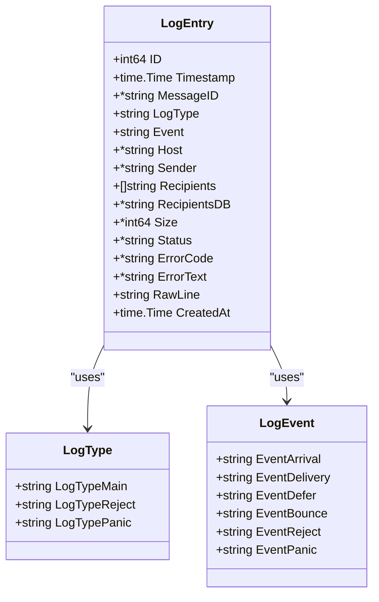
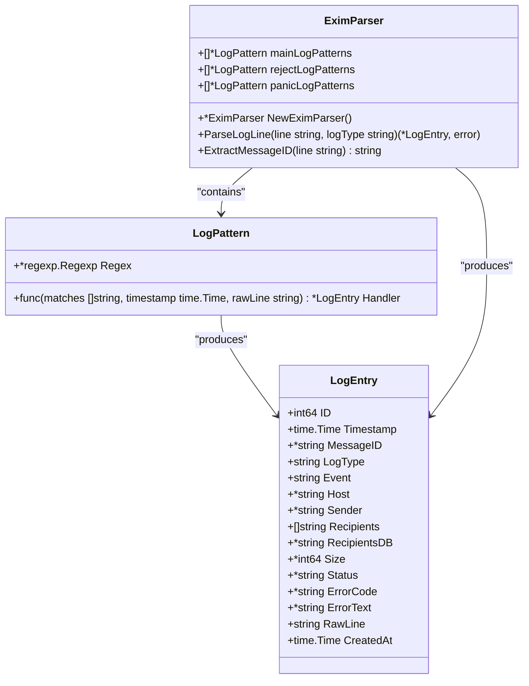
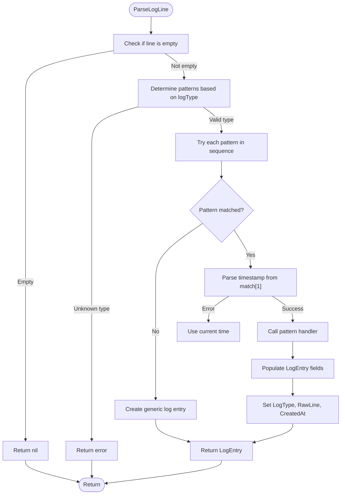
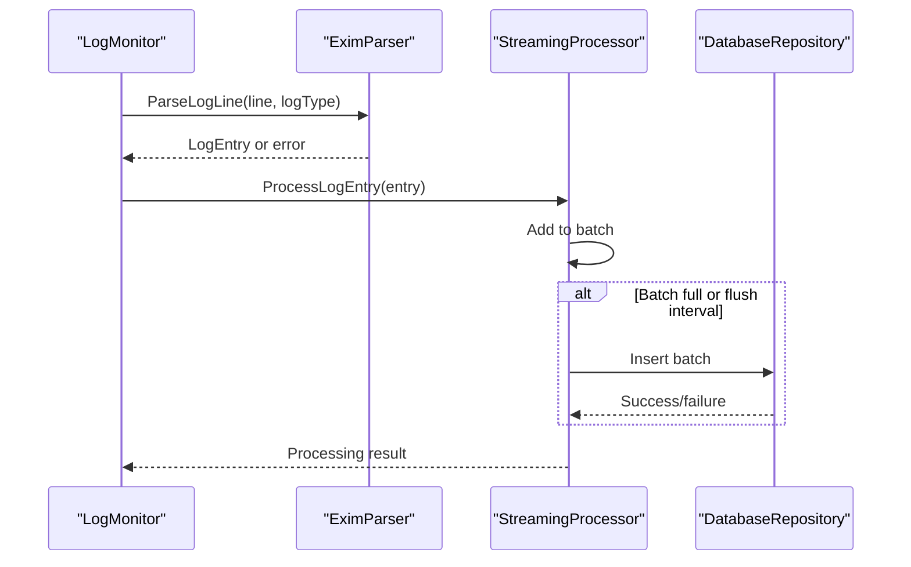

# Log Parsing and Extraction


## Table of Contents
1. [Introduction](#introduction)
2. [Log Entry Data Structure](#log-entry-data-structure)
3. [Parser Architecture](#parser-architecture)
4. [Regular Expression Patterns](#regular-expression-patterns)
5. [Parsing Process Flow](#parsing-process-flow)
6. [Error Handling and Fallbacks](#error-handling-and-fallbacks)
7. [Integration with Log Processor](#integration-with-log-processor)
8. [Performance Optimizations](#performance-optimizations)
9. [Troubleshooting Common Issues](#troubleshooting-common-issues)
10. [Conclusion](#conclusion)

## Introduction
The exim-pilot system includes a sophisticated log parsing mechanism designed to transform raw Exim mail server log entries into structured data for analysis and monitoring. The core component, `EximParser`, processes log lines from various Exim log files (main, reject, and panic logs) and extracts key information such as message IDs, sender and recipient addresses, timestamps, and delivery status. This documentation provides a comprehensive overview of the log parsing implementation, including the regular expression patterns used, the data structures involved, error handling strategies, and integration points with downstream components.

**Section sources**
- [exim_parser.go](file://internal/parser/exim_parser.go#L1-L50)
- [models.go](file://internal/database/models.go#L70-L86)

## Log Entry Data Structure
The parsed log data is stored in the `LogEntry` struct, which defines the schema for structured log information. This data structure captures all relevant fields extracted from raw log entries and serves as the foundation for downstream processing and storage.





**Diagram sources**
- [models.go](file://internal/database/models.go#L70-L86)
- [models.go](file://internal/database/models.go#L90-L102)

**Section sources**
- [models.go](file://internal/database/models.go#L70-L86)
- [models.go](file://internal/database/models.go#L90-L102)

## Parser Architecture
The `EximParser` is designed with a modular architecture that uses pattern matching and handler functions to process different types of log entries. The parser maintains separate collections of regular expression patterns for each log type (main, reject, and panic logs), allowing for specialized processing of different log formats.





**Diagram sources**
- [exim_parser.go](file://internal/parser/exim_parser.go#L10-L20)
- [exim_parser.go](file://internal/parser/exim_parser.go#L25-L35)
- [models.go](file://internal/database/models.go#L70-L86)

**Section sources**
- [exim_parser.go](file://internal/parser/exim_parser.go#L10-L35)
- [exim_parser.go](file://internal/parser/exim_parser.go#L25-L35)

## Regular Expression Patterns
The parser uses a comprehensive set of regular expressions to identify and extract data from different types of Exim log entries. Each pattern is associated with a handler function that processes the matched groups and creates a structured `LogEntry`.

### Main Log Patterns
The main log patterns handle the most common Exim events related to message processing:


```go
// Message arrival
Regex: `^(\d{4}-\d{2}-\d{2} \d{2}:\d{2}:\d{2}) ([A-Za-z0-9-]+) <= ([^\s]+) H=([^\s]+) \[([^\]]+)\].*?S=(\d+)`
Handler: handleMessageArrival

// Message delivery
Regex: `^(\d{4}-\d{2}-\d{2} \d{2}:\d{2}:\d{2}) ([A-Za-z0-9-]+) => ([^\s]+) R=([^\s]+) T=([^\s]+) H=([^\s]+) \[([^\]]+)\]`
Handler: handleMessageDelivery

// Message deferral
Regex: `^(\d{4}-\d{2}-\d{2} \d{2}:\d{2}:\d{2}) ([A-Za-z0-9-]+) == ([^\s]+) R=([^\s]+) T=([^\s]+) defer \(([^)]+)\): (.+)`
Handler: handleMessageDefer

// Message bounce
Regex: `^(\d{4}-\d{2}-\d{2} \d{2}:\d{2}:\d{2}) ([A-Za-z0-9-]+) \*\* ([^\s]+) R=([^\s]+) T=([^\s]+): (.+)`
Handler: handleMessageBounce

// Message completion
Regex: `^(\d{4}-\d{2}-\d{2} \d{2}:\d{2}:\d{2}) ([A-Za-z0-9-]+) Completed`
Handler: handleMessageCompleted
```


### Reject Log Patterns
The reject log patterns handle entries related to connection and SMTP rejections:


```go
// Connection rejected
Regex: `^(\d{4}-\d{2}-\d{2} \d{2}:\d{2}:\d{2}) rejected connection from \[([^\]]+)\]: (.+)`
Handler: handleConnectionRejected

// SMTP rejection
Regex: `^(\d{4}-\d{2}-\d{2} \d{2}:\d{2}:\d{2}) H=([^\s]+) \[([^\]]+)\] rejected ([A-Z]+) <([^>]+)>: (.+)`
Handler: handleSMTPRejected
```


### Panic Log Patterns
The panic log patterns handle system-level errors and panics:


```go
// General panic/error
Regex: `^(\d{4}-\d{2}-\d{2} \d{2}:\d{2}:\d{2}) exim: (panic|error): (.+)`
Handler: handlePanicError
```


**Section sources**
- [exim_parser.go](file://internal/parser/exim_parser.go#L45-L87)
- [exim_parser.go](file://internal/parser/exim_parser.go#L170-L298)

## Parsing Process Flow
The parsing process follows a systematic approach to transform raw log lines into structured data. The flowchart below illustrates the complete parsing workflow from input to output.





**Diagram sources**
- [exim_parser.go](file://internal/parser/exim_parser.go#L100-L150)

**Section sources**
- [exim_parser.go](file://internal/parser/exim_parser.go#L100-L150)

## Error Handling and Fallbacks
The parser implements robust error handling to ensure resilience when processing malformed or unexpected log entries. When no pattern matches a log line, the parser creates a generic log entry containing only the timestamp (if parseable) and the raw line content.


```go
func (p *EximParser) createGenericLogEntry(line, logType string) (*database.LogEntry, error) {
    timestampRegex := regexp.MustCompile(`^(\d{4}-\d{2}-\d{2} \d{2}:\d{2}:\d{2})`)
    matches := timestampRegex.FindStringSubmatch(line)

    var timestamp time.Time
    var err error

    if len(matches) > 1 {
        timestamp, err = p.parseTimestamp(matches[1])
        if err != nil {
            timestamp = time.Now()
        }
    } else {
        timestamp = time.Now()
    }

    return &database.LogEntry{
        Timestamp: timestamp,
        LogType:   logType,
        Event:     "unknown",
        RawLine:   line,
        CreatedAt: time.Now(),
    }, nil
}
```


The parser also handles empty lines by returning `nil, nil`, allowing the calling code to skip processing without generating errors. For unknown log types, the parser returns an error to prevent incorrect processing.

**Section sources**
- [exim_parser.go](file://internal/parser/exim_parser.go#L150-L190)

## Integration with Log Processor
The parsed log entries are integrated with the log processing pipeline through the `StreamingProcessor` and `LogMonitor` components. The `LogMonitor` uses the parser to process new log entries in real-time, while the `StreamingProcessor` handles bulk processing of log files.





The `LogMonitor` processes new content by reading from monitored log files and passing each line to the parser. If a log processor is available, it delegates further processing; otherwise, it stores entries directly in the database with retry logic.

**Diagram sources**
- [monitor.go](file://internal/logmonitor/monitor.go#L450-L500)
- [streaming.go](file://internal/logprocessor/streaming.go#L200-L250)

**Section sources**
- [monitor.go](file://internal/logmonitor/monitor.go#L450-L500)
- [streaming.go](file://internal/logprocessor/streaming.go#L200-L250)

## Performance Optimizations
The log parsing system includes several performance optimizations to handle high-throughput log processing efficiently:

1. **Pre-compiled regular expressions**: All regex patterns are compiled once during parser initialization and reused for all parsing operations.

2. **Streaming processing**: The `StreamingProcessor` uses a pipeline architecture with buffered channels to process log lines concurrently.

3. **Batch database operations**: Log entries are processed in batches to minimize database transaction overhead.

4. **Concurrent workers**: Multiple goroutines process log lines in parallel, configurable via the `ConcurrentWorkers` setting.


```go
// Streaming configuration with performance settings
type StreamingConfig struct {
    BatchSize           int           `json:"batch_size"`
    FlushInterval       time.Duration `json:"flush_interval"`
    MaxMemoryUsage      int64         `json:"max_memory_usage"`
    BufferSize          int           `json:"buffer_size"`
    ConcurrentWorkers   int           `json:"concurrent_workers"`
    ProcessingTimeout   time.Duration `json:"processing_timeout"`
    EnableCompression   bool          `json:"enable_compression"`
    EnableDeduplication bool          `json:"enable_deduplication"`
}
```


The default configuration processes up to 1,000 entries per batch with a 5-second flush interval and 4 concurrent workers, optimized for typical server workloads.

**Section sources**
- [streaming.go](file://internal/logprocessor/streaming.go#L20-L40)
- [streaming.go](file://internal/logprocessor/streaming.go#L100-L150)

## Troubleshooting Common Issues
When encountering issues with log parsing, consider the following common problems and their solutions:

### Log Format Mismatches
If log entries are not being parsed correctly, verify that the log format matches the expected patterns. Common issues include:

- **Custom log formats**: Exim allows custom log formats through configuration. If your Exim server uses a custom format, the existing regex patterns may not match.
- **Solution**: Extend the parser with additional patterns or modify existing ones to accommodate the custom format.

### Timestamp Parsing Errors
The parser expects timestamps in the format "YYYY-MM-DD HH:MM:SS". If timestamps use a different format:

- **Verify the timestamp format** in your Exim logs matches the expected format.
- **Update the parseTimestamp function** to handle alternative formats if necessary.

### Missing Message IDs
The parser extracts message IDs using the pattern `\b([A-Za-z0-9]{6}-[A-Za-z0-9]{6}-[A-Za-z0-9]{2})\b`. If message IDs have a different format:

- **Check the message ID format** in your Exim configuration.
- **Modify the ExtractMessageID regex** to match your server's message ID format.

### High Error Rates
If the parser is generating many errors or creating generic entries:

- **Enable debug logging** to see which lines are failing to parse.
- **Add specific patterns** for common log entries that are not currently handled.
- **Verify log file types** are correctly identified (main, reject, panic).

**Section sources**
- [exim_parser.go](file://internal/parser/exim_parser.go#L280-L298)
- [exim_parser_test.go](file://internal/parser/exim_parser_test.go#L50-L100)

## Conclusion
The exim-pilot log parsing mechanism provides a robust and extensible framework for transforming raw Exim log entries into structured data. By using a pattern-based approach with pre-compiled regular expressions and specialized handler functions, the parser efficiently extracts key information from various log types. The integration with the streaming processor and log monitor enables both real-time and batch processing of log data, while the fallback mechanisms ensure resilience when encountering malformed entries. The system's modular design allows for easy extension to support additional log formats or custom Exim configurations, making it a flexible solution for mail server monitoring and analysis.

**Referenced Files in This Document**   
- [exim_parser.go](file://internal/parser/exim_parser.go)
- [models.go](file://internal/database/models.go)
- [streaming.go](file://internal/logprocessor/streaming.go)
- [monitor.go](file://internal/logmonitor/monitor.go)
- [exim_parser_test.go](file://internal/parser/exim_parser_test.go)