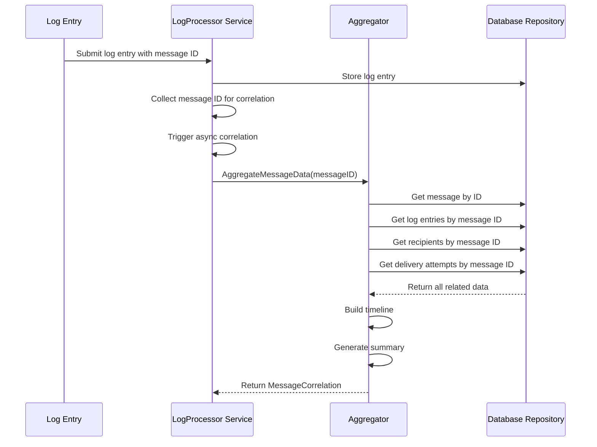
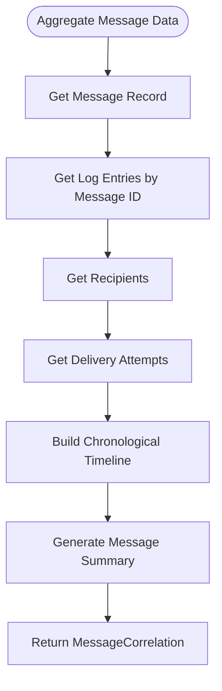
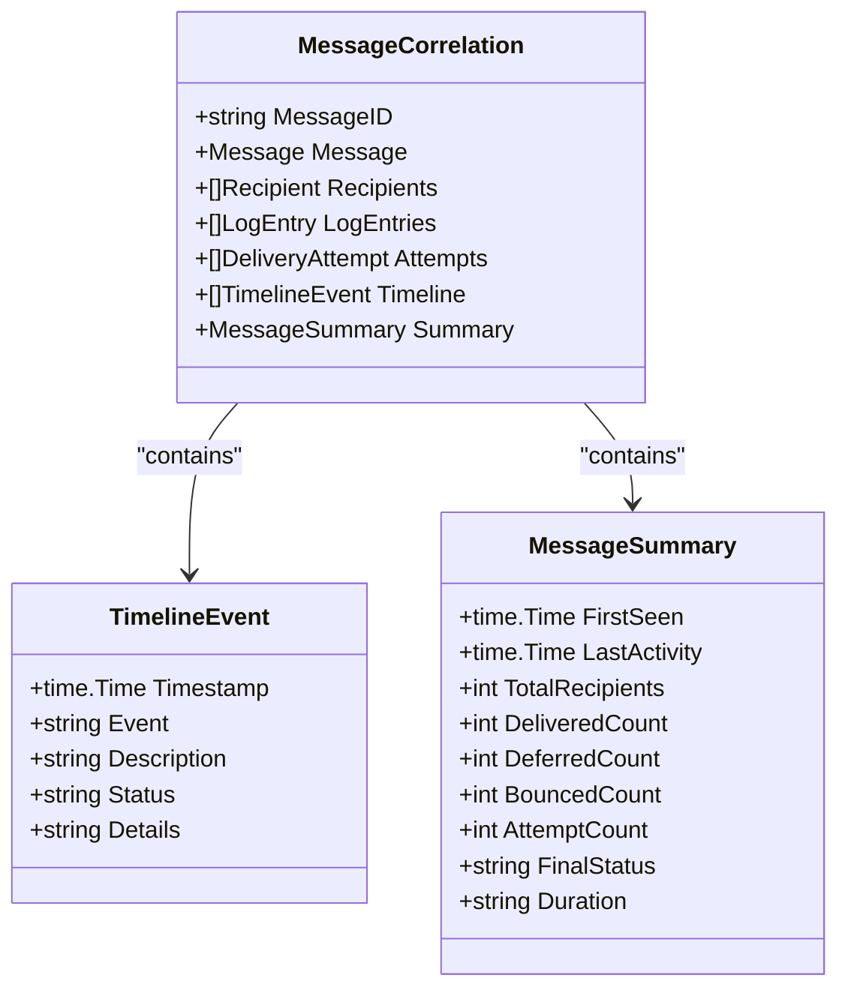
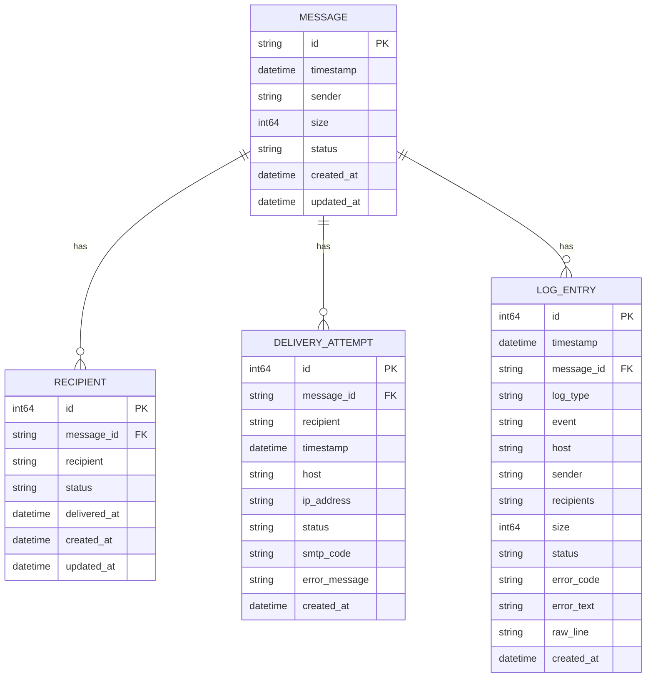
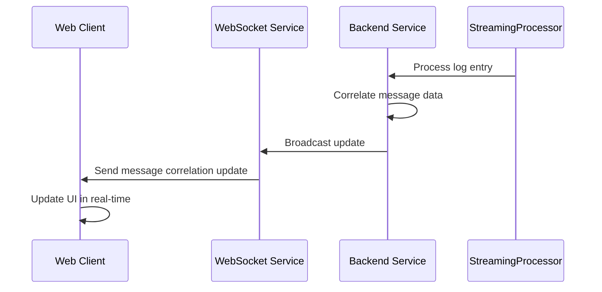
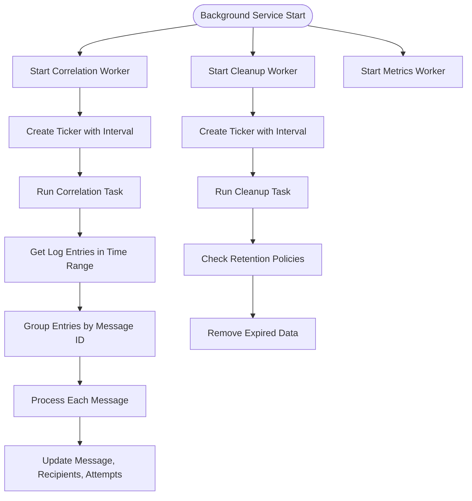
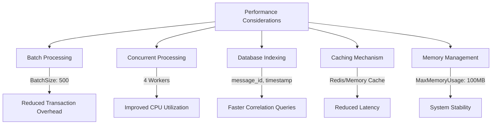

# Message Correlation and Aggregation


## Table of Contents
1. [Introduction](#introduction)
2. [Message Correlation Mechanism](#message-correlation-mechanism)
3. [Aggregation Process](#aggregation-process)
4. [In-Memory Data Structures](#in-memory-data-structures)
5. [Streaming Mode and Real-Time Updates](#streaming-mode-and-real-time-updates)
6. [Background Service for State Synchronization](#background-service-for-state-synchronization)
7. [Delivery Attempt Linking](#delivery-attempt-linking)
8. [Performance Considerations](#performance-considerations)
9. [Memory Optimization Strategies](#memory-optimization-strategies)

## Introduction
The exim-pilot system implements a sophisticated message correlation and aggregation framework that processes log entries from Exim mail server logs to reconstruct complete message delivery timelines. This document details how the system correlates multiple log entries belonging to the same message using message IDs, constructs delivery timelines, and compiles recipient statuses. The architecture combines real-time processing with background correlation tasks to provide comprehensive message tracing capabilities.

## Message Correlation Mechanism

The logprocessor service implements message correlation by tracking log entries with shared message IDs and establishing thread relationships between related messages. When a log entry is processed, the system extracts the message ID and triggers correlation if one exists.

The correlation process begins when log entries are processed through either the `ProcessLogEntry` or `ProcessLogEntries` methods in the log processor service. These methods store the log entries in the database and collect message IDs for correlation processing.





**Diagram sources**
- [service.go](file://internal/logprocessor/service.go#L110-L135)
- [aggregator.go](file://internal/logprocessor/aggregator.go#L57-L104)

**Section sources**
- [service.go](file://internal/logprocessor/service.go#L110-L170)
- [aggregator.go](file://internal/logprocessor/aggregator.go#L57-L104)

## Aggregation Process

The aggregator component is responsible for constructing delivery timelines and compiling recipient statuses by gathering all related data for a specific message. The `AggregateMessageData` method serves as the primary entry point for message aggregation.

The aggregation process follows these steps:
1. Retrieve the message record from the database
2. Fetch all log entries associated with the message ID
3. Get recipient information for the message
4. Collect delivery attempt records
5. Build a chronological timeline of events
6. Generate a comprehensive message summary





**Diagram sources**
- [aggregator.go](file://internal/logprocessor/aggregator.go#L57-L104)

**Section sources**
- [aggregator.go](file://internal/logprocessor/aggregator.go#L57-L104)

### Timeline Construction

The delivery timeline is constructed by combining log entries and delivery attempts into a single chronological sequence. The `buildTimeline` method processes both types of events and sorts them by timestamp to create a coherent narrative of the message's journey.

For log entries, the timeline includes events such as arrival, delivery, deferral, and bounce, with appropriate descriptions and status information. Delivery attempts are also incorporated into the timeline, providing details about connection attempts, hosts, IP addresses, and SMTP responses.


```go
// buildTimeline creates a chronological timeline of events
func (a *LogAggregator) buildTimeline(correlation *MessageCorrelation) {
    events := make([]TimelineEvent, 0)

    // Add log entries to timeline
    for _, entry := range correlation.LogEntries {
        event := TimelineEvent{
            Timestamp: entry.Timestamp,
            Event:     entry.Event,
            Status:    getEventStatus(entry.Event),
        }

        switch entry.Event {
        case database.EventArrival:
            event.Description = fmt.Sprintf("Message received from %s", getStringValue(entry.Sender))
            if entry.Size != nil {
                event.Details = fmt.Sprintf("Size: %d bytes", *entry.Size)
            }
        case database.EventDelivery:
            recipients := getRecipientsString(entry.Recipients)
            event.Description = fmt.Sprintf("Delivered to %s", recipients)
            if entry.Host != nil {
                event.Details = fmt.Sprintf("Host: %s", *entry.Host)
            }
        // Additional event cases...
        }

        events = append(events, event)
    }

    // Add delivery attempts to timeline
    for _, attempt := range correlation.Attempts {
        event := TimelineEvent{
            Timestamp:   attempt.Timestamp,
            Event:       "delivery_attempt",
            Description: fmt.Sprintf("Delivery attempt to %s", attempt.Recipient),
            Status:      attempt.Status,
        }
        // Additional attempt details...
        events = append(events, event)
    }

    // Sort timeline by timestamp
    // Sorting implementation...
}
```


**Section sources**
- [aggregator.go](file://internal/logprocessor/aggregator.go#L200-L250)

## In-Memory Data Structures

The system utilizes several key data structures to track message states during the correlation and aggregation process. These structures are designed to efficiently store and retrieve related information while minimizing memory overhead.

### MessageCorrelation Structure

The `MessageCorrelation` struct serves as the primary container for correlated message data, combining information from multiple sources into a unified representation.





**Diagram sources**
- [aggregator.go](file://internal/logprocessor/aggregator.go#L24-L55)

**Section sources**
- [aggregator.go](file://internal/logprocessor/aggregator.go#L24-L55)

### Database Models

The underlying database models define the structure of stored data and support the correlation process by providing relationships between messages, recipients, delivery attempts, and log entries.





**Diagram sources**
- [models.go](file://internal/database/models.go#L10-L150)

**Section sources**
- [models.go](file://internal/database/models.go#L10-L150)

## Streaming Mode and Real-Time Updates

The system implements streaming mode to enable real-time updates for message correlation data. The `StreamingProcessor` handles efficient log processing by implementing a pipeline architecture with concurrent workers for parsing, batching, and storing log entries.

The streaming processor uses the following configuration parameters to optimize real-time processing:

**Streaming Configuration**
- BatchSize: 1000 entries
- FlushInterval: 5 seconds
- MaxMemoryUsage: 100MB
- BufferSize: 10,000 lines
- ConcurrentWorkers: 4
- ProcessingTimeout: 30 seconds

The real-time update mechanism is completed by a WebSocket service that pushes correlation updates to connected clients. When new log entries are processed and correlated, the system broadcasts updates to subscribed clients, enabling immediate visualization of message delivery progress.





**Diagram sources**
- [streaming.go](file://internal/logprocessor/streaming.go#L20-L50)
- [websocket.ts](file://web/src/services/websocket.ts#L10-L30)

**Section sources**
- [streaming.go](file://internal/logprocessor/streaming.go#L20-L100)
- [websocket.ts](file://web/src/services/websocket.ts#L10-L165)

## Background Service for State Synchronization

The background service manages state synchronization and handles timeouts for incomplete message chains through periodic correlation and cleanup tasks. This service runs as a separate goroutine and performs regular maintenance operations to ensure data consistency.

The background service implements three primary workers:

1. **Correlation Worker**: Runs periodically to correlate log entries that may have been processed out of order or require batch processing
2. **Cleanup Worker**: Removes expired data according to retention policies
3. **Metrics Worker**: Collects and reports system performance metrics


```go
// BackgroundConfig holds configuration for background processing
type BackgroundConfig struct {
    CorrelationInterval   time.Duration
    CorrelationBatchHours int
    LogRetentionDays      int
    AuditRetentionDays    int
    SnapshotRetentionDays int
    CleanupInterval       time.Duration
    CleanupBatchSize      int
    MaxConcurrentTasks    int
}
```


The correlation worker processes log entries in batches based on configurable time intervals. By default, it runs every 30 minutes and processes entries from the last 24 hours, ensuring that any delayed or out-of-order log entries are properly correlated.





**Diagram sources**
- [background_service.go](file://internal/logprocessor/background_service.go#L50-L150)

**Section sources**
- [background_service.go](file://internal/logprocessor/background_service.go#L50-L200)

## Delivery Attempt Linking

The system links delivery attempts, bounces, and retries by establishing relationships through message IDs and recipient addresses. When a log entry indicates a delivery attempt, defer, or bounce, the system creates or updates corresponding delivery attempt records.

The `updateRecipientsFromLogEntries` method processes log entries to update recipient statuses and create delivery attempt records:


```go
// updateRecipientsFromLogEntries creates or updates recipient records
func (a *LogAggregator) updateRecipientsFromLogEntries(messageID string, entries []database.LogEntry,
    recipientRepo *database.RecipientRepository, attemptRepo *database.DeliveryAttemptRepository) error {

    // Get existing recipients
    existingRecipients, err := recipientRepo.GetByMessageID(messageID)
    if err != nil {
        return fmt.Errorf("failed to get existing recipients: %w", err)
    }

    recipientMap := make(map[string]*database.Recipient)
    for i := range existingRecipients {
        recipientMap[existingRecipients[i].Recipient] = &existingRecipients[i]
    }

    // Process log entries to update recipient status
    for _, entry := range entries {
        for _, recipientAddr := range entry.Recipients {
            recipient, exists := recipientMap[recipientAddr]
            if !exists {
                // Create new recipient
                recipient = &database.Recipient{
                    MessageID: messageID,
                    Recipient: recipientAddr,
                    Status:    database.RecipientStatusPending,
                }
                recipientMap[recipientAddr] = recipient
            }

            // Update status based on event
            switch entry.Event {
            case database.EventDelivery:
                recipient.Status = database.RecipientStatusDelivered
                recipient.DeliveredAt = &entry.Timestamp
            case database.EventDefer:
                if recipient.Status != database.RecipientStatusDelivered {
                    recipient.Status = database.RecipientStatusDeferred
                }
            case database.EventBounce:
                recipient.Status = database.RecipientStatusBounced
            }

            // Create delivery attempt record
            if entry.Event == database.EventDelivery || entry.Event == database.EventDefer || entry.Event == database.EventBounce {
                attempt := &database.DeliveryAttempt{
                    MessageID: messageID,
                    Recipient: recipientAddr,
                    Timestamp: entry.Timestamp,
                    Host:      entry.Host,
                    Status:    getAttemptStatus(entry.Event),
                }

                if entry.ErrorText != nil {
                    attempt.ErrorMessage = entry.ErrorText
                }

                if err := attemptRepo.Create(attempt); err != nil {
                    log.Printf("Failed to create delivery attempt: %v", err)
                }
            }
        }
    }

    // Save or update recipients
    for _, recipient := range recipientMap {
        if recipient.ID == 0 {
            if err := recipientRepo.Create(recipient); err != nil {
                log.Printf("Failed to create recipient: %v", err)
            }
        } else {
            if err := recipientRepo.Update(recipient); err != nil {
                log.Printf("Failed to update recipient: %v", err)
            }
        }
    }

    return nil
}
```


This method ensures that each delivery-related event creates a corresponding delivery attempt record while updating the recipient's status accordingly. The linkage between log entries, recipients, and delivery attempts enables comprehensive tracking of delivery attempts, bounces, and retries.

**Section sources**
- [aggregator.go](file://internal/logprocessor/aggregator.go#L400-L450)

## Performance Considerations

The system is designed to handle large volumes of concurrent messages through several performance optimization strategies:

**Batch Processing**: Log entries are processed in batches to reduce database transaction overhead. The default batch size is 500 entries, which balances memory usage with processing efficiency.

**Concurrent Processing**: The streaming processor utilizes multiple worker goroutines to parse log entries concurrently, improving throughput on multi-core systems.

**Indexing Strategy**: Database tables are indexed on key fields such as message_id, timestamp, and recipient to optimize query performance for correlation operations.

**Caching Mechanism**: Frequently accessed data, such as message status and recipient information, is cached to reduce database load during high-volume processing periods.





**Diagram sources**
- [service.go](file://internal/logprocessor/service.go#L70-L90)
- [streaming.go](file://internal/logprocessor/streaming.go#L30-L50)

**Section sources**
- [service.go](file://internal/logprocessor/service.go#L70-L90)
- [streaming.go](file://internal/logprocessor/streaming.go#L30-L50)

## Memory Optimization Strategies

To optimize memory usage when handling large volumes of concurrent messages, the system implements several strategies:

**Streaming Architecture**: The `StreamingProcessor` reads and processes log files line by line, avoiding the need to load entire files into memory.

**Buffer Management**: Configurable buffer sizes prevent excessive memory consumption during high-volume processing periods.

**Connection Pooling**: Database connection pooling limits the number of simultaneous connections while reusing existing connections.

**Garbage Collection Optimization**: The system is designed to minimize object allocation during hot code paths, reducing pressure on the garbage collector.

The `StreamingConfig` struct defines key memory-related parameters:


```go
// StreamingConfig holds configuration for streaming log processing
type StreamingConfig struct {
    BatchSize           int           `json:"batch_size"`
    FlushInterval       time.Duration `json:"flush_interval"`
    MaxMemoryUsage      int64         `json:"max_memory_usage"` // bytes
    BufferSize          int           `json:"buffer_size"`      // lines
    ConcurrentWorkers   int           `json:"concurrent_workers"`
    ProcessingTimeout   time.Duration `json:"processing_timeout"`
    EnableCompression   bool          `json:"enable_compression"`
    EnableDeduplication bool          `json:"enable_deduplication"`
}
```


These configuration options allow administrators to tune memory usage based on available system resources and processing requirements.

**Section sources**
- [streaming.go](file://internal/logprocessor/streaming.go#L20-L50)

**Referenced Files in This Document**   
- [aggregator.go](file://internal/logprocessor/aggregator.go)
- [service.go](file://internal/logprocessor/service.go)
- [background_service.go](file://internal/logprocessor/background_service.go)
- [streaming.go](file://internal/logprocessor/streaming.go)
- [models.go](file://internal/database/models.go)
- [websocket.ts](file://web/src/services/websocket.ts)