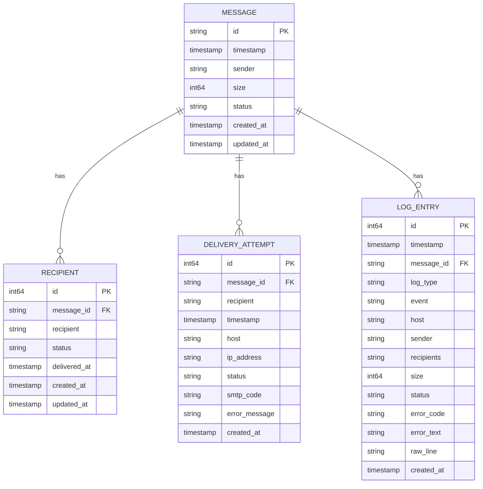
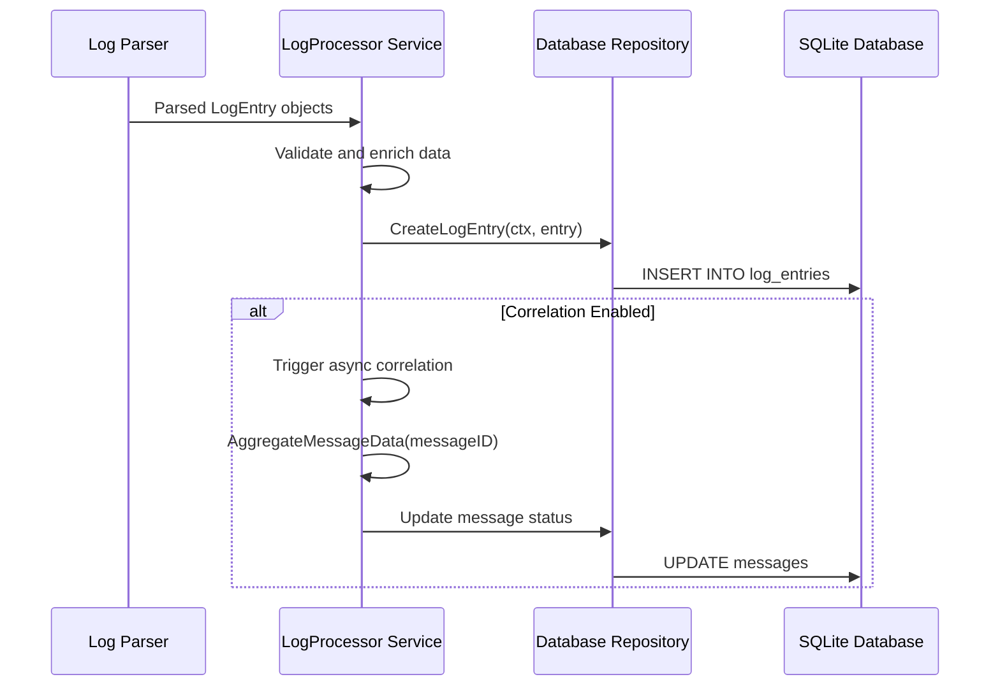
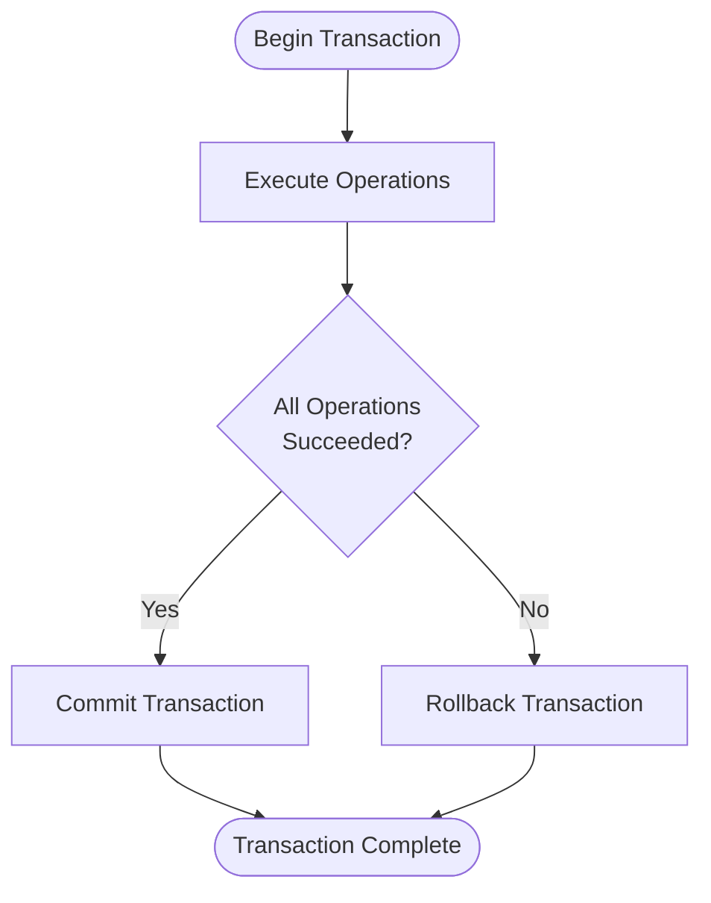

# Data Persistence and Database Operations


## Table of Contents
1. [Introduction](#introduction)
2. [Entity Relationships and Data Models](#entity-relationships-and-data-models)
3. [Database Schema Design](#database-schema-design)
4. [Repository Layer and Data Flow](#repository-layer-and-data-flow)
5. [Transaction Management](#transaction-management)
6. [Bulk Insert Optimization](#bulk-insert-optimization)
7. [Data Retention Policies](#data-retention-policies)
8. [Conclusion](#conclusion)

## Introduction
The exim-pilot system implements a robust data persistence layer using SQLite to store and manage email message logs, delivery attempts, and related metadata. This document details how parsed log data is stored, correlated, and retrieved through a well-defined database schema and repository pattern. The architecture emphasizes data integrity, query performance, and efficient bulk operations for high-volume log processing.

**Section sources**
- [models.go](file://internal/database/models.go#L8-L86)
- [service.go](file://internal/logprocessor/service.go#L0-L343)

## Entity Relationships and Data Models

The core data model revolves around four primary entities: `Message`, `Recipient`, `DeliveryAttempt`, and `LogEntry`. These entities are defined in the `models.go` file and represent the lifecycle of an email message from receipt to delivery or failure.





**Diagram sources**
- [models.go](file://internal/database/models.go#L8-L86)

### Message Entity
The `Message` entity represents an individual email message identified by a unique ID. It contains metadata such as sender, size, timestamp, and current status.


```go
type Message struct {
	ID        string    `json:"id" db:"id"`
	Timestamp time.Time `json:"timestamp" db:"timestamp"`
	Sender    string    `json:"sender" db:"sender"`
	Size      *int64    `json:"size" db:"size"`
	Status    string    `json:"status" db:"status"`
	CreatedAt time.Time `json:"created_at" db:"created_at"`
	UpdatedAt time.Time `json:"updated_at" db:"updated_at"`
}
```


### Recipient Entity
Each message can have multiple recipients, stored in the `Recipient` table with their delivery status and timestamps.


```go
type Recipient struct {
	ID          int64      `json:"id" db:"id"`
	MessageID   string     `json:"message_id" db:"message_id"`
	Recipient   string     `json:"recipient" db:"recipient"`
	Status      string     `json:"status" db:"status"`
	DeliveredAt *time.Time `json:"delivered_at" db:"delivered_at"`
	CreatedAt   time.Time  `json:"created_at" db:"created_at"`
	UpdatedAt   time.Time  `json:"updated_at" db:"updated_at"`
}
```


### DeliveryAttempt Entity
The `DeliveryAttempt` entity tracks each attempt to deliver a message to a recipient, including SMTP response codes and error messages.


```go
type DeliveryAttempt struct {
	ID           int64     `json:"id" db:"id"`
	MessageID    string    `json:"message_id" db:"message_id"`
	Recipient    string    `json:"recipient" db:"recipient"`
	Timestamp    time.Time `json:"timestamp" db:"timestamp"`
	Host         *string   `json:"host" db:"host"`
	IPAddress    *string   `json:"ip_address" db:"ip_address"`
	Status       string    `json:"status" db:"status"`
	SMTPCode     *string   `json:"smtp_code" db:"smtp_code"`
	ErrorMessage *string   `json:"error_message" db:"error_message"`
	CreatedAt    time.Time `json:"created_at" db:"created_at"`
}
```


### LogEntry Entity
The `LogEntry` entity stores raw parsed log data with a reference to the message ID when available. Recipients are stored as a JSON string in the database.


```go
type LogEntry struct {
	ID           int64     `json:"id" db:"id"`
	Timestamp    time.Time `json:"timestamp" db:"timestamp"`
	MessageID    *string   `json:"message_id" db:"message_id"`
	LogType      string    `json:"log_type" db:"log_type"`
	Event        string    `json:"event" db:"event"`
	Host         *string   `json:"host" db:"host"`
	Sender       *string   `json:"sender" db:"sender"`
	Recipients   []string  `json:"recipients" db:"-"`
	RecipientsDB *string   `json:"-" db:"recipients"`
	Size         *int64    `json:"size" db:"size"`
	Status       *string   `json:"status" db:"status"`
	ErrorCode    *string   `json:"error_code" db:"error_code"`
	ErrorText    *string   `json:"error_text" db:"error_text"`
	RawLine      string    `json:"raw_line" db:"raw_line"`
	CreatedAt    time.Time `json:"created_at" db:"created_at"`
}
```


**Section sources**
- [models.go](file://internal/database/models.go#L8-L86)

## Database Schema Design

The database schema is designed for efficient querying of message delivery status and log data. Key design decisions include:

- **Primary Keys**: Auto-incrementing integer IDs for most tables, with UUID-style message IDs as logical keys
- **Foreign Keys**: MessageID fields in related tables to maintain referential integrity
- **Indexing Strategy**: Critical fields are indexed to optimize query performance

The following indexes are implemented to support common query patterns:

- `message_id` on `recipients`, `delivery_attempts`, and `log_entries` tables for message correlation
- `timestamp` on `log_entries` for time-range queries
- `status` on `messages` and `recipients` for filtering by delivery status
- Composite indexes on frequently queried field combinations

These indexing decisions enable fast retrieval of message histories, delivery timelines, and statistical reports.

**Section sources**
- [schema.go](file://internal/database/schema.go)
- [models.go](file://internal/database/models.go#L8-L86)

## Repository Layer and Data Flow

The repository layer provides an abstraction over database operations, with the `Repository` struct exposing methods for CRUD operations. The data flow from log processing to persistence follows this path:





**Diagram sources**
- [service.go](file://internal/logprocessor/service.go#L0-L343)
- [repository.go](file://internal/database/repository.go)

The `LogProcessor.Service` handles incoming log entries and delegates persistence to the repository:


```go
func (s *Service) ProcessLogEntry(ctx context.Context, entry *database.LogEntry) error {
    if err := s.repository.CreateLogEntry(ctx, entry); err != nil {
        return fmt.Errorf("failed to store log entry: %w", err)
    }

    if s.config.EnableCorrelation && entry.MessageID != nil && *entry.MessageID != "" {
        go s.correlateMessageAsync(*entry.MessageID)
    }

    return nil
}
```


This asynchronous correlation ensures that log storage remains fast while related message data is updated in the background.

**Section sources**
- [service.go](file://internal/logprocessor/service.go#L0-L343)
- [repository.go](file://internal/database/repository.go)

## Transaction Management

Atomic updates are ensured through the `TxManager` and `TxRepository` components, which provide transactional wrappers for database operations. The `WithTransaction` method ensures that a series of operations either all succeed or are rolled back on error.





**Diagram sources**
- [transaction.go](file://internal/database/transaction.go#L0-L151)

The transaction management implementation:


```go
func (tm *TxManager) WithTransaction(fn func(*sql.Tx) error) error {
    tx, err := tm.db.BeginTx()
    if err != nil {
        return fmt.Errorf("failed to begin transaction: %w", err)
    }

    defer func() {
        if p := recover(); p != nil {
            tx.Rollback()
            panic(p)
        }
    }()

    if err := fn(tx); err != nil {
        tx.Rollback()
        return err
    }

    return tx.Commit()
}
```


This pattern is used when updating multiple related records atomically, such as when updating a message status and its recipients in a single transaction.

**Section sources**
- [transaction.go](file://internal/database/transaction.go#L0-L151)

## Bulk Insert Optimization

For high-volume log processing, the system implements batch processing to optimize database performance. The `ProcessLogEntries` method processes entries in configurable batches:


```go
func (s *Service) ProcessLogEntries(ctx context.Context, entries []*database.LogEntry) error {
    batchSize := s.config.BatchSize
    
    for i := 0; i < len(entries); i += batchSize {
        end := i + batchSize
        if end > len(entries) {
            end = len(entries)
        }

        batch := entries[i:end]

        for _, entry := range batch {
            if err := s.repository.CreateLogEntry(ctx, entry); err != nil {
                log.Printf("Failed to store log entry: %v", err)
                continue
            }
        }
    }
    
    return nil
}
```


Additional optimization techniques include:
- **Connection pooling**: Reusing database connections to reduce overhead
- **Prepared statements**: Using prepared statements for repeated INSERT operations
- **Asynchronous processing**: Offloading correlation work to background goroutines
- **Configurable batch size**: Tunable batch size (default 500) to balance memory usage and performance

These optimizations enable efficient processing of large log files while maintaining system responsiveness.

**Section sources**
- [service.go](file://internal/logprocessor/service.go#L0-L343)
- [optimization.go](file://internal/database/optimization.go)

## Data Retention Policies

Data retention is managed through configurable policies implemented in the retention service. The system automatically removes expired data based on configurable retention periods for different data types.

Retention configuration includes:
- **Log retention**: Number of days to keep log entries
- **Audit retention**: Number of days to keep audit logs
- **Snapshot retention**: Number of days to keep queue snapshots

The retention service provides methods to:
- Query current retention configuration
- Manually trigger cleanup operations
- Retrieve retention status and statistics


```go
func (s *Service) GetRetentionInfo(ctx context.Context) (*RetentionInfo, error) {
    info := &RetentionInfo{
        Config: RetentionConfig{
            LogRetentionDays:      s.config.BackgroundConfig.LogRetentionDays,
            AuditRetentionDays:    s.config.BackgroundConfig.AuditRetentionDays,
            SnapshotRetentionDays: s.config.BackgroundConfig.SnapshotRetentionDays,
        },
    }
    
    // Get current data counts
    tables := []string{"log_entries", "audit_log", "queue_snapshots"}
    info.CurrentCounts = make(map[string]int)

    for _, table := range tables {
        var count int
        query := fmt.Sprintf("SELECT COUNT(*) FROM %s", table)
        if err := s.repository.GetDB().QueryRow(query).Scan(&count); err != nil {
            continue
        }
        info.CurrentCounts[table] = count
    }
    
    return info, nil
}
```


These policies help manage storage requirements by automatically removing historical data that is no longer needed, while providing visibility into current data volumes and retention status.

**Section sources**
- [retention.go](file://internal/database/retention.go)
- [service.go](file://internal/logprocessor/service.go#L0-L343)

## Conclusion
The exim-pilot data persistence layer provides a robust foundation for storing and retrieving email message data. Through a well-designed schema, efficient repository pattern, and optimized bulk operations, the system handles high-volume log processing while maintaining data integrity. Transaction management ensures atomic updates, and configurable retention policies help manage storage requirements. The separation of concerns between parsing, processing, and persistence enables scalable and maintainable data operations.

**Referenced Files in This Document**   
- [models.go](file://internal/database/models.go#L8-L86)
- [repository.go](file://internal/database/repository.go)
- [transaction.go](file://internal/database/transaction.go#L0-L151)
- [service.go](file://internal/logprocessor/service.go#L0-L343)
- [retention.go](file://internal/database/retention.go)
- [schema.go](file://internal/database/schema.go)