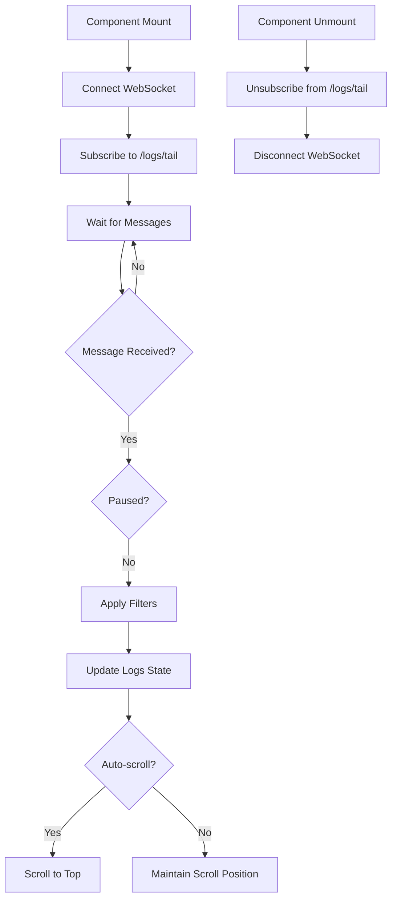
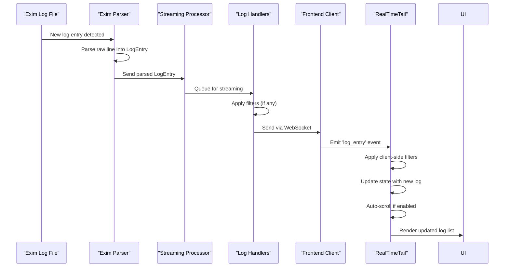

# Real-time Log Streaming and Updates


## Table of Contents
1. [Introduction](#introduction)
2. [Architecture Overview](#architecture-overview)
3. [Backend Implementation](#backend-implementation)
4. [Frontend Implementation](#frontend-implementation)
5. [Data Flow Sequence](#data-flow-sequence)
6. [Connection Management](#connection-management)
7. [Buffering and Performance](#buffering-and-performance)
8. [Error Recovery](#error-recovery)
9. [Configuration Options](#configuration-options)

## Introduction
The real-time log streaming feature in exim-pilot enables users to monitor Exim mail server logs as they are generated. This functionality provides immediate visibility into mail processing events, allowing administrators to quickly identify and respond to issues. The system implements a WebSocket-like pattern for efficient real-time communication between the server and client, with comprehensive filtering, buffering, and error recovery capabilities.

## Architecture Overview


```mermaid
graph TB
subgraph "Log Source"
LogFile[Exim Log File]
LogMonitor[Log Monitor]
end
subgraph "Backend"
Parser[Exim Parser]
StreamingService[Streaming Processor]
LogHandlers[Log Handlers]
APIServer[API Server]
end
subgraph "Frontend"
WebSocketClient[WebSocket Service]
RealTimeTail[RealTimeTail Component]
UI[User Interface]
end
LogFile --> LogMonitor
LogMonitor --> Parser
Parser --> StreamingService
StreamingService --> LogHandlers
LogHandlers --> APIServer
APIServer < --> WebSocketClient
WebSocketClient --> RealTimeTail
RealTimeTail --> UI
style LogFile fill:#f9f,stroke:#333
style UI fill:#bbf,stroke:#333
```


**Diagram sources**
- [server.go](file://internal/api/server.go#L1-L275)
- [RealTimeTail.tsx](file://web/src/components/Logs/RealTimeTail.tsx#L1-L387)

**Section sources**
- [server.go](file://internal/api/server.go#L1-L275)
- [RealTimeTail.tsx](file://web/src/components/Logs/RealTimeTail.tsx#L1-L387)

## Backend Implementation

The backend implementation of real-time log streaming is centered around the log_handlers.go file, which defines the API endpoints for log tailing. The system uses a streaming processor in the logprocessor package to handle real-time log data.

The `handleLogsTail` function in log_handlers.go is designed to handle WebSocket connections for real-time log tailing. Currently, it returns a placeholder response indicating that WebSocket support is needed, with filters for message_id, log_type, event, and keywords.


```go
// handleLogsTail handles WebSocket endpoint for real-time log tail
func (h *LogHandlers) handleLogsTail(w http.ResponseWriter, r *http.Request) {
    // For now, return a placeholder response indicating WebSocket support is needed
    // In a full implementation, this would upgrade the connection to WebSocket
    // and stream real-time log entries

    response := map[string]interface{}{
        "message": "WebSocket endpoint for real-time log tail",
        "note":    "This endpoint requires WebSocket implementation",
        "filters": map[string]string{
            "message_id": GetQueryParam(r, "message_id", ""),
            "log_type":   GetQueryParam(r, "log_type", ""),
            "event":      GetQueryParam(r, "event", ""),
            "keywords":   GetQueryParam(r, "keywords", ""),
        },
    }

    WriteSuccessResponse(w, response)
}
```


The streaming functionality is integrated with the log processor service, which receives parsed log entries from the exim_parser.go file. The parser converts raw log lines into structured LogEntry objects that can be efficiently transmitted to clients.

**Section sources**
- [log_handlers.go](file://internal/api/log_handlers.go#L159-L170)
- [exim_parser.go](file://internal/parser/exim_parser.go#L1-L300)

## Frontend Implementation

The frontend implementation of real-time log streaming is handled by the RealTimeTail.tsx component and the websocket.ts service. This implementation provides a user interface for viewing live log entries with filtering, pausing, and export capabilities.

### WebSocket Service

The websocket.ts file implements a WebSocket service class that manages the connection lifecycle, including automatic reconnection attempts and subscription management.


```mermaid
classDiagram
class WebSocketService {
-ws : WebSocket | null
-url : string
-reconnectAttempts : number
-maxReconnectAttempts : number
-reconnectInterval : number
-eventHandlers : Map[string, WebSocketEventHandler[]]
-subscriptions : Map[string, WebSocketEventHandler[]]
+connect() : Promise<void>
+on(eventType : string, handler : WebSocketEventHandler) : void
+off(eventType : string, handler : WebSocketEventHandler) : void
+send(message : any) : void
+disconnect() : void
+isConnected() : boolean
+subscribe(endpoint : string, handler : WebSocketEventHandler) : void
+unsubscribe(endpoint : string, handler? : WebSocketEventHandler) : void
-handleMessage(message : any) : void
-handleReconnect() : void
}
class WebSocketEventHandler {
<<type>>
(data : any) => void
}
```


**Diagram sources**
- [websocket.ts](file://web/src/services/websocket.ts#L1-L165)

**Section sources**
- [websocket.ts](file://web/src/services/websocket.ts#L1-L165)

### RealTimeTail Component

The RealTimeTail.tsx component provides the user interface for real-time log monitoring. It manages state for logs, connection status, filtering, and user preferences.

Key features include:
- Live streaming of log entries
- Connection status indication
- Pause/resume functionality
- Auto-scroll toggle
- Configurable maximum log count
- Filtering by message ID, log type, event, sender, recipient, and keywords
- Selection and export of log entries to CSV





**Diagram sources**
- [RealTimeTail.tsx](file://web/src/components/Logs/RealTimeTail.tsx#L1-L387)

**Section sources**
- [RealTimeTail.tsx](file://web/src/components/Logs/RealTimeTail.tsx#L1-L387)

## Data Flow Sequence

The complete sequence of real-time log streaming from file to frontend display involves multiple components working together.





**Diagram sources**
- [exim_parser.go](file://internal/parser/exim_parser.go#L1-L300)
- [RealTimeTail.tsx](file://web/src/components/Logs/RealTimeTail.tsx#L1-L387)
- [log_handlers.go](file://internal/api/log_handlers.go#L159-L170)

**Section sources**
- [exim_parser.go](file://internal/parser/exim_parser.go#L1-L300)
- [RealTimeTail.tsx](file://web/src/components/Logs/RealTimeTail.tsx#L1-L387)
- [log_handlers.go](file://internal/api/log_handlers.go#L159-L170)

## Connection Management

The real-time log streaming system implements robust connection management to ensure reliable operation even under unstable network conditions.

### Connection Lifecycle

The WebSocket service handles the complete connection lifecycle:

1. **Connection**: Establishes WebSocket connection to the server
2. **Subscription**: Subscribes to the /logs/tail endpoint
3. **Reconnection**: Automatically attempts to reconnect on disconnection
4. **Cleanup**: Properly unsubscribes and disconnects on component unmount

The service implements exponential backoff for reconnection attempts, with a maximum of 5 attempts and increasing intervals between attempts.

### State Management

The RealTimeTail component maintains several state variables to manage the connection and user experience:

- **isConnected**: Tracks WebSocket connection status
- **isPaused**: Allows users to pause log updates
- **autoScroll**: Controls automatic scrolling to newest logs
- **maxLogs**: Limits the number of stored logs to prevent memory issues

**Section sources**
- [websocket.ts](file://web/src/services/websocket.ts#L1-L165)
- [RealTimeTail.tsx](file://web/src/components/Logs/RealTimeTail.tsx#L1-L387)

## Buffering and Performance

The system implements several buffering and performance optimization strategies to handle high-frequency log environments efficiently.

### Client-side Buffering

The RealTimeTail component implements client-side buffering with the following characteristics:

- **Maximum log count**: Configurable limit (default 1000) to prevent memory exhaustion
- **Recent-first ordering**: New logs are added to the beginning of the list
- **Slice-based pruning**: Uses array slicing to maintain the maximum log count


```javascript
setLogs(prevLogs => {
    const newLogs = [logEntry, ...prevLogs];
    // Keep only the most recent logs to prevent memory issues
    return newLogs.slice(0, maxLogs);
});
```


### Performance Tuning Options

Users can adjust performance-related settings through the UI:

- **Max logs**: Dropdown to select 500, 1000, 2000, or 5000 maximum logs
- **Auto-scroll**: Toggle to enable/disable automatic scrolling
- **Filtering**: Apply filters to reduce the volume of displayed logs

These options allow users to balance between real-time visibility and system performance based on their specific needs and environment.

**Section sources**
- [RealTimeTail.tsx](file://web/src/components/Logs/RealTimeTail.tsx#L1-L387)

## Error Recovery

The real-time log streaming system includes comprehensive error recovery mechanisms to maintain reliability.

### Connection Recovery

The WebSocket service implements automatic reconnection with the following strategy:

- **Retry attempts**: Maximum of 5 reconnection attempts
- **Exponential backoff**: Increasing delay between attempts (1s, 2s, 3s, etc.)
- **Error logging**: Console messages for connection status and errors


```javascript
private handleReconnect() {
    if (this.reconnectAttempts < this.maxReconnectAttempts) {
        this.reconnectAttempts++;
        console.log(`Attempting to reconnect... (${this.reconnectAttempts}/${this.maxReconnectAttempts})`);
        
        setTimeout(() => {
            this.connect().catch(error => {
                console.error('Reconnection failed:', error);
            });
        }, this.reconnectInterval * this.reconnectAttempts);
    } else {
        console.error('Max reconnection attempts reached');
    }
}
```


### Message Handling

The system includes error handling for message parsing:

- **JSON parsing**: Try-catch block around JSON.parse() to handle malformed messages
- **Error logging**: Console errors for failed message parsing
- **Graceful degradation**: Continues operation after handling individual message errors

**Section sources**
- [websocket.ts](file://web/src/services/websocket.ts#L1-L165)

## Configuration Options

The real-time log streaming feature provides several configuration options to accommodate different use cases and performance requirements.

### User-configurable Settings

Users can configure the following options through the RealTimeTail interface:

- **Max logs**: Controls the maximum number of logs stored in memory (500, 1000, 2000, 5000)
- **Auto-scroll**: Enables/disables automatic scrolling to the newest logs
- **Filters**: Various filters to narrow the log stream:
  - Message ID
  - Log type (main, reject, panic)
  - Event type (arrival, delivery, defer, bounce, reject, panic)
  - Sender
  - Recipient
  - Keyword search in raw log line

### System-level Configuration

The backend system can be configured through the server configuration, though specific streaming parameters are not yet exposed in the current implementation. Future enhancements could include:

- **Streaming batch size**: Number of logs sent in each batch
- **Heartbeat interval**: Frequency of keep-alive messages
- **Compression**: Enable/disable message compression for high-volume environments
- **Rate limiting**: Controls for high-frequency log sources

The current placeholder implementation in log_handlers.go already captures filter parameters that could be used for server-side filtering in a complete implementation.

**Section sources**
- [RealTimeTail.tsx](file://web/src/components/Logs/RealTimeTail.tsx#L1-L387)
- [log_handlers.go](file://internal/api/log_handlers.go#L159-L170)

**Referenced Files in This Document**   
- [log_handlers.go](file://internal/api/log_handlers.go)
- [RealTimeTail.tsx](file://web/src/components/Logs/RealTimeTail.tsx)
- [websocket.ts](file://web/src/services/websocket.ts)
- [streaming.go](file://internal/logprocessor/streaming.go)
- [exim_parser.go](file://internal/parser/exim_parser.go)
- [server.go](file://internal/api/server.go)