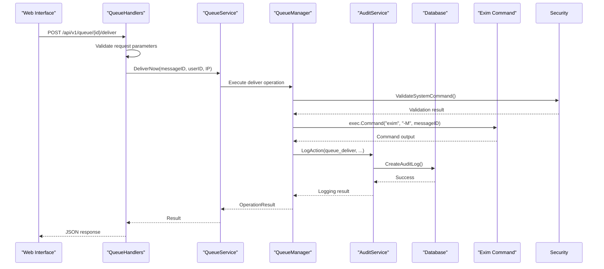
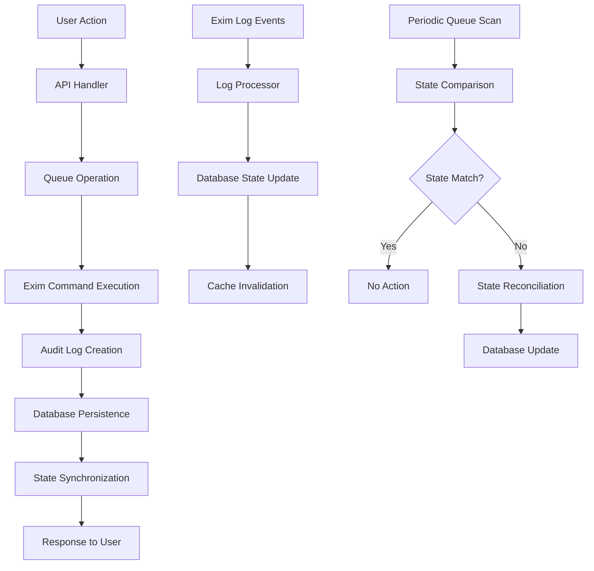

# User-Initiated Operations and State Updates


## Table of Contents
1. [Introduction](#introduction)
2. [Request Flow Overview](#request-flow-overview)
3. [API Layer: Queue Handlers](#api-layer-queue-handlers)
4. [Service Layer: Queue Operations](#service-layer-queue-operations)
5. [Audit Logging System](#audit-logging-system)
6. [Database Persistence and State Management](#database-persistence-and-state-management)
7. [Security Enforcement](#security-enforcement)
8. [Error Handling and Race Conditions](#error-handling-and-race-conditions)
9. [Troubleshooting Guide](#troubleshooting-guide)

## Introduction
This document details the data flow triggered by user actions in exim-pilot, focusing on queue operations such as deliver, freeze, thaw, and delete. It explains how these operations propagate from the web interface through the API, service, and database layers, ultimately resulting in Exim command execution and state updates. The document covers the complete lifecycle of user-initiated operations, including audit logging, permission checks, error handling, and synchronization between in-memory state and persistent storage.

**Section sources**
- [internal/api/queue_handlers.go](file://internal/api/queue_handlers.go#L1-L395)
- [internal/queue/operations.go](file://internal/queue/operations.go#L1-L432)

## Request Flow Overview
The request flow for user-initiated queue operations follows a structured path from the frontend to the Exim mail server:

1. **Frontend API Call**: User action in the web interface triggers an HTTP request to the API endpoint
2. **API Handler**: The request is processed by the appropriate handler in `queue_handlers.go`
3. **Service Layer**: The handler delegates to the queue service for business logic execution
4. **Queue Operations**: The operations layer executes Exim commands and manages state
5. **Audit Logging**: Administrative actions are recorded in the audit trail
6. **Database Persistence**: Message state changes are persisted in the database
7. **Exim Command Execution**: System commands are executed to modify the mail queue





**Diagram sources**
- [internal/api/queue_handlers.go](file://internal/api/queue_handlers.go#L1-L395)
- [internal/queue/operations.go](file://internal/queue/operations.go#L1-L432)
- [internal/audit/service.go](file://internal/audit/service.go#L1-L286)

## API Layer: Queue Handlers
The API layer handles HTTP requests for queue operations through dedicated endpoints in `queue_handlers.go`. Each operation has a corresponding handler function that validates input, extracts user context, and delegates to the service layer.

### Queue Operation Endpoints
The following endpoints are available for queue management:

- **POST /api/v1/queue/{id}/deliver**: Force immediate delivery of a message
- **POST /api/v1/queue/{id}/freeze**: Freeze a message to prevent delivery attempts
- **POST /api/v1/queue/{id}/thaw**: Thaw a frozen message to allow delivery
- **DELETE /api/v1/queue/{id}**: Remove a message from the queue
- **POST /api/v1/queue/bulk**: Perform bulk operations on multiple messages


```go
// handleQueueDeliver handles POST /api/v1/queue/{id}/deliver - Force delivery
func (h *QueueHandlers) handleQueueDeliver(w http.ResponseWriter, r *http.Request) {
	messageID := GetPathParam(r, "id")
	if messageID == "" {
		WriteBadRequestResponse(w, "Message ID is required")
		return
	}

	userID := h.getUserID(r)
	ipAddress := h.getClientIP(r)

	result, err := h.queueService.DeliverNow(messageID, userID, ipAddress)
	if err != nil {
		WriteInternalErrorResponse(w, "Failed to deliver message: "+err.Error())
		return
	}

	if result.Success {
		WriteSuccessResponse(w, result)
	} else {
		WriteBadRequestResponse(w, result.Error)
	}
}
```


**Section sources**
- [internal/api/queue_handlers.go](file://internal/api/queue_handlers.go#L1-L395)

## Service Layer: Queue Operations
The service layer, implemented in `operations.go`, contains the core logic for queue operations. The `Manager` struct provides methods for deliver, freeze, thaw, and delete operations, both for single messages and bulk operations.

### Operation Implementation
Each queue operation follows a consistent pattern:

1. **Input Validation**: Validate the message ID format
2. **Security Check**: Validate the system command through the security service
3. **Command Execution**: Execute the corresponding Exim command
4. **Result Processing**: Capture command output and determine success/failure
5. **Audit Logging**: Record the operation in the audit trail
6. **Response Generation**: Return an OperationResult to the caller


```go
// DeliverNow forces immediate delivery of a message using exim -M
func (m *Manager) DeliverNow(messageID string, userID string, ipAddress string) (*OperationResult, error) {
	result := &OperationResult{
		MessageID: messageID,
		Operation: "deliver_now",
	}

	// Validate command execution with security service
	args := []string{"-M", messageID}
	if err := m.securityService.ValidateSystemCommand(m.eximPath, args); err != nil {
		log.Printf("SECURITY: Command validation failed for deliver_now: %v", err)
		result.Success = false
		result.Error = "Security validation failed: " + err.Error()
		return result, err
	}

	// Log security event
	m.securityService.LogSecurityEvent("QUEUE_OPERATION",
		fmt.Sprintf("deliver_now messageID=%s userID=%s ip=%s", messageID, userID, ipAddress))

	// Execute exim -M command
	cmd := exec.Command(m.eximPath, "-M", messageID)
	output, err := cmd.CombinedOutput()

	if err != nil {
		result.Success = false
		result.Error = fmt.Sprintf("Command failed: %v", err)
		result.Message = string(output)
	} else {
		result.Success = true
		result.Message = "Delivery attempt initiated"
	}

	// Log the operation in audit trail
	if err := m.logAuditAction("deliver_now", messageID, userID, ipAddress, result); err != nil {
		fmt.Printf("Failed to log audit action: %v\n", err)
	}

	return result, nil
}
```


### Bulk Operations
Bulk operations are implemented using a helper function `performBulkOperation` that iterates through message IDs and applies the specified operation function:


```go
// performBulkOperation is a helper function for bulk operations
func (m *Manager) performBulkOperation(
	messageIDs []string,
	operation string,
	userID string,
	ipAddress string,
	operationFunc func(string, string, string) (*OperationResult, error),
) (*BulkOperationResult, error) {

	bulkResult := &BulkOperationResult{
		TotalMessages: len(messageIDs),
		Operation:     operation,
		Results:       make([]OperationResult, 0, len(messageIDs)),
	}

	// Perform operation on each message
	for _, messageID := range messageIDs {
		result, err := operationFunc(messageID, userID, ipAddress)
		if err != nil {
			// Create error result if operation function failed
			result = &OperationResult{
				Success:   false,
				MessageID: messageID,
				Operation: operation,
				Error:     err.Error(),
			}
		}

		bulkResult.Results = append(bulkResult.Results, *result)

		if result.Success {
			bulkResult.SuccessfulCount++
		} else {
			bulkResult.FailedCount++
		}
	}

	// Log bulk operation in audit trail
	if err := m.logBulkAuditAction(operation, messageIDs, userID, ipAddress, bulkResult); err != nil {
		fmt.Printf("Failed to log bulk audit action: %v\n", err)
	}

	return bulkResult, nil
}
```


**Section sources**
- [internal/queue/operations.go](file://internal/queue/operations.go#L1-L432)

## Audit Logging System
The audit logging system, implemented in `audit/service.go`, tracks all administrative actions for security and compliance purposes. Every queue operation generates an audit log entry that captures essential context and details.

### Audit Action Types
The system defines specific action types for different operations:

- **Queue operations**: `queue_deliver`, `queue_freeze`, `queue_thaw`, `queue_delete`
- **Bulk operations**: `bulk_deliver`, `bulk_freeze`, `bulk_thaw`, `bulk_delete`
- **Authentication actions**: `login`, `logout`
- **Message operations**: `message_view`, `message_content`, `note_create`, etc.


```go
// ActionType represents the type of administrative action
type ActionType string

const (
	// Queue operations
	ActionQueueDeliver ActionType = "queue_deliver"
	ActionQueueFreeze  ActionType = "queue_freeze"
	ActionQueueThaw    ActionType = "queue_thaw"
	ActionQueueDelete  ActionType = "queue_delete"
	ActionBulkDeliver  ActionType = "bulk_deliver"
	ActionBulkFreeze   ActionType = "bulk_freeze"
	ActionBulkThaw     ActionType = "bulk_thaw"
	ActionBulkDelete   ActionType = "bulk_delete"
)
```


### Audit Context and Details
Each audit log entry includes context information and detailed operation data:


```go
// AuditContext contains context information for audit logging
type AuditContext struct {
	UserID    string
	IPAddress string
	UserAgent string
	RequestID string
}

// AuditDetails contains detailed information about the action
type AuditDetails struct {
	MessageIDs    []string               `json:"message_ids,omitempty"`
	Recipients    []string               `json:"recipients,omitempty"`
	Operation     string                 `json:"operation,omitempty"`
	Parameters    map[string]interface{} `json:"parameters,omitempty"`
	Result        string                 `json:"result,omitempty"`
	ErrorMessage  string                 `json:"error_message,omitempty"`
	Duration      time.Duration          `json:"duration,omitempty"`
	ResourcePath  string                 `json:"resource_path,omitempty"`
	PreviousValue interface{}            `json:"previous_value,omitempty"`
	NewValue      interface{}            `json:"new_value,omitempty"`
}
```


### Audit Log Creation
The audit service serializes details to JSON and stores them in the database:


```go
// LogAction logs an administrative action to the audit trail
func (s *Service) LogAction(ctx context.Context, action ActionType, messageID *string, auditCtx *AuditContext, details *AuditDetails) error {
	// Serialize details to JSON
	var detailsJSON *string
	if details != nil {
		detailsBytes, err := json.Marshal(details)
		if err != nil {
			log.Printf("Failed to marshal audit details: %v", err)
			// Continue with logging without details rather than failing
		} else {
			detailsStr := string(detailsBytes)
			detailsJSON = &detailsStr
		}
	}

	// Create audit log entry
	auditEntry := &database.AuditLog{
		Timestamp: time.Now().UTC(),
		Action:    string(action),
		MessageID: messageID,
		UserID:    &auditCtx.UserID,
		Details:   detailsJSON,
		IPAddress: &auditCtx.IPAddress,
		CreatedAt: time.Now().UTC(),
	}

	// Store in database (immutable - no updates allowed)
	err := s.repository.CreateAuditLog(auditEntry)
	if err != nil {
		log.Printf("Failed to create audit log entry: %v", err)
		return fmt.Errorf("failed to create audit log entry: %w", err)
	}

	// Log to system log as well for redundancy
	s.logToSystemLog(action, messageID, auditCtx, details)

	return nil
}
```


**Section sources**
- [internal/audit/service.go](file://internal/audit/service.go#L1-L286)

## Database Persistence and State Management
The database layer, implemented in `repository.go`, handles persistence of audit logs and message state. The system uses a repository pattern to abstract database operations.

### Audit Log Persistence
Audit logs are stored in the `audit_log` table with the following structure:


```go
// Create inserts a new audit log entry
func (r *AuditLogRepository) Create(entry *AuditLog) error {
	query := `
		INSERT INTO audit_log (timestamp, action, message_id, user_id, details, ip_address, created_at)
		VALUES (?, ?, ?, ?, ?, ?, ?)`

	now := time.Now()
	entry.Timestamp = now
	entry.CreatedAt = now

	result, err := r.db.Exec(query, entry.Timestamp, entry.Action, entry.MessageID, entry.UserID, entry.Details, entry.IPAddress, entry.CreatedAt)
	if err != nil {
		return err
	}

	id, err := result.LastInsertId()
	if err != nil {
		return err
	}

	entry.ID = id
	return nil
}
```


### Message State Updates
While the queue operations themselves don't directly update message status in the database (as Exim manages the queue state), the system maintains message metadata in the `messages` table:


```go
// Update updates an existing message
func (r *MessageRepository) Update(msg *Message) error {
	query := `
		UPDATE messages 
		SET timestamp = ?, sender = ?, size = ?, status = ?, updated_at = ?
		WHERE id = ?`

	msg.UpdatedAt = time.Now()

	result, err := r.db.Exec(query, msg.Timestamp, msg.Sender, msg.Size, msg.Status, msg.UpdatedAt, msg.ID)
	if err != nil {
		return err
	}

	rowsAffected, err := result.RowsAffected()
	if err != nil {
		return err
	}

	if rowsAffected == 0 {
		return fmt.Errorf("message with ID %s not found", msg.ID)
	}

	return nil
}
```


### Synchronization Between In-Memory and Persistent State
The system synchronizes state through the following mechanisms:

1. **Audit Logs**: Record all state-changing operations for traceability
2. **Periodic Queue Scans**: The system periodically scans the Exim queue to update its internal state
3. **Event-Driven Updates**: Log processor monitors Exim logs to detect state changes
4. **Consistency Checks**: Regular validation ensures database state matches queue state





**Diagram sources**
- [internal/database/repository.go](file://internal/database/repository.go#L1-L799)
- [internal/queue/operations.go](file://internal/queue/operations.go#L1-L432)

**Section sources**
- [internal/database/repository.go](file://internal/database/repository.go#L1-L799)

## Security Enforcement
The security system, implemented in `security/service.go`, enforces strict controls on queue operations to prevent unauthorized access and command injection attacks.

### Command Validation
All system commands are validated before execution:


```go
// ValidateSystemCommand validates system commands before execution
func (s *Service) ValidateSystemCommand(command string, args []string) error {
	// Only allow specific Exim commands
	allowedCommands := map[string]bool{
		"exim":            true,
		"exim4":           true,
		"/usr/sbin/exim":  true,
		"/usr/sbin/exim4": true,
	}

	if !allowedCommands[command] {
		log.Printf("SECURITY: Attempted execution of disallowed command: %s", command)
		return fmt.Errorf("command '%s' is not allowed", command)
	}

	// Validate command arguments
	for _, arg := range args {
		if err := s.validateCommandArgument(arg); err != nil {
			log.Printf("SECURITY: Invalid command argument: %s", arg)
			return fmt.Errorf("invalid command argument: %w", err)
		}
	}

	log.Printf("SECURITY: System command validation passed: %s %v", command, args)
	return nil
}
```


### Argument Validation
Command arguments are checked for dangerous characters that could enable command injection:


```go
// validateCommandArgument validates individual command arguments
func (s *Service) validateCommandArgument(arg string) error {
	// Check for command injection attempts
	dangerousChars := []string{";", "&", "|", "`", "$", "(", ")", "<", ">", "\"", "'"}
	for _, char := range dangerousChars {
		if strings.Contains(arg, char) {
			return fmt.Errorf("argument contains dangerous character: %s", char)
		}
	}

	// Check for path traversal
	if strings.Contains(arg, "..") {
		return fmt.Errorf("argument contains path traversal sequence")
	}

	return nil
}
```


### Path Security
The system restricts file access to specific paths to prevent unauthorized file system access:


```go
// NewService creates a new security service
func NewService() *Service {
	return &Service{
		// Allowed paths for Exim log files and spool directories
		allowedPaths: []string{
			"/var/log/exim4",
			"/var/spool/exim4",
			"/var/lib/exim4",
			"/etc/exim4", // Read-only access for configuration
		},
		// Paths that should never be accessed
		restrictedPaths: []string{
			"/etc/passwd",
			"/etc/shadow",
			"/etc/sudoers",
			"/root",
			"/home",
			"/var/www",
			"/usr/bin",
			"/usr/sbin",
			"/bin",
			"/sbin",
		},
		// Paths that should only be accessed read-only
		readOnlyPaths: []string{
			"/etc/exim4",
			"/var/log/exim4",
		},
	}
}
```


**Section sources**
- [internal/security/service.go](file://internal/security/service.go#L1-L424)

## Error Handling and Race Conditions
The system implements comprehensive error handling and mitigation strategies for race conditions that may occur during concurrent operations.

### Error Handling Strategy
The system follows a consistent error handling pattern:

1. **Immediate Validation**: Validate inputs and permissions at the start of each operation
2. **Graceful Degradation**: Continue operation if non-critical components fail (e.g., audit logging)
3. **Detailed Error Reporting**: Provide specific error messages to aid troubleshooting
4. **Security Logging**: Log security-related failures for monitoring and analysis


```go
// Log the operation in audit trail
if err := m.logAuditAction("deliver_now", messageID, userID, ipAddress, result); err != nil {
	// Don't fail the operation if audit logging fails, just log the error
	fmt.Printf("Failed to log audit action: %v\n", err)
}
```


### Race Condition Mitigation
The system addresses potential race conditions through:

1. **Atomic Operations**: Exim commands are atomic at the mail server level
2. **Idempotent Design**: Operations can be safely retried without side effects
3. **State Verification**: Post-operation checks verify the intended state was achieved
4. **Concurrency Control**: The database layer handles concurrent access through transactions

### Permission Checks
All operations include permission checks through the authentication system:


```go
// getUserID extracts user ID from request context
func (h *QueueHandlers) getUserID(r *http.Request) string {
	user, ok := GetUserFromContext(r.Context())
	if !ok {
		return "anonymous"
	}
	return fmt.Sprintf("%d", user.ID)
}
```


The system assumes that authentication is handled by middleware, and user context is available in the request context.

**Section sources**
- [internal/queue/operations.go](file://internal/queue/operations.go#L1-L432)
- [internal/api/queue_handlers.go](file://internal/api/queue_handlers.go#L1-L395)

## Troubleshooting Guide
This section provides guidance for diagnosing and resolving common issues with queue operations and inconsistent states.

### Failed Operations
When a queue operation fails, follow these steps:

1. **Check the API Response**: Examine the error message returned to the client
2. **Review Audit Logs**: Check the audit trail for security-related failures
3. **Examine System Logs**: Look for security warnings in the application logs
4. **Verify Exim Status**: Ensure the Exim service is running and accessible


```bash
# Check if Exim is running
ps aux | grep exim

# Test Exim command manually
exim -bp  # List queue
```


### Inconsistent Queue States
If the web interface shows a different state than the actual Exim queue:

1. **Force State Refresh**: The system should automatically detect state changes through log monitoring
2. **Check Log Processor**: Verify the log processor service is running
3. **Manual Queue Scan**: Restart the queue scanning process


```go
// Get operation history for a message
func (m *Manager) GetOperationHistory(messageID string) ([]database.AuditLog, error) {
	if m.db == nil {
		return nil, fmt.Errorf("database connection not available")
	}

	repo := database.NewAuditLogRepository(m.db)

	// Get audit logs for this message
	logs, err := repo.List(100, 0, "", "")
	if err != nil {
		return nil, fmt.Errorf("failed to retrieve operation history: %w", err)
	}

	// Filter logs for this specific message
	var messageLogs []database.AuditLog
	for _, log := range logs {
		if log.MessageID != nil && *log.MessageID == messageID {
			messageLogs = append(messageLogs, log)
		}
	}

	return messageLogs, nil
}
```


### Security Validation Failures
If operations fail due to security validation:

1. **Check Command Permissions**: Verify the Exim binary path and permissions
2. **Review Security Configuration**: Ensure the command is in the allowed list
3. **Examine Argument Validation**: Check for special characters in message IDs


```go
// ValidateSystemCommand validates system commands before execution
func (s *Service) ValidateSystemCommand(command string, args []string) error {
	allowedCommands := map[string]bool{
		"exim":            true,
		"exim4":           true,
		"/usr/sbin/exim":  true,
		"/usr/sbin/exim4": true,
	}
	
	// Add debugging for troubleshooting
	log.Printf("Validating command: %s with args: %v", command, args)
	
	if !allowedCommands[command] {
		log.Printf("SECURITY: Attempted execution of disallowed command: %s", command)
		return fmt.Errorf("command '%s' is not allowed", command)
	}
}
```


### Audit Logging Issues
If audit logs are not being created:

1. **Verify Database Connection**: Ensure the database is accessible
2. **Check Repository Implementation**: Verify the audit log repository is properly configured
3. **Review Error Handling**: The system continues operation even if audit logging fails


```go
// Log the operation in audit trail
if err := m.logAuditAction("deliver_now", messageID, userID, ipAddress, result); err != nil {
	// Don't fail the operation if audit logging fails, just log the error
	fmt.Printf("Failed to log audit action: %v\n", err)
}
```


**Section sources**
- [internal/queue/operations.go](file://internal/queue/operations.go#L1-L432)
- [internal/audit/service.go](file://internal/audit/service.go#L1-L286)
- [internal/database/repository.go](file://internal/database/repository.go#L1-L799)

**Referenced Files in This Document**   
- [internal/api/queue_handlers.go](file://internal/api/queue_handlers.go)
- [internal/queue/operations.go](file://internal/queue/operations.go)
- [internal/queue/service.go](file://internal/queue/service.go)
- [internal/audit/service.go](file://internal/audit/service.go)
- [internal/database/repository.go](file://internal/database/repository.go)
- [internal/security/service.go](file://internal/security/service.go)