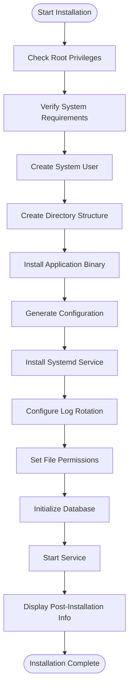
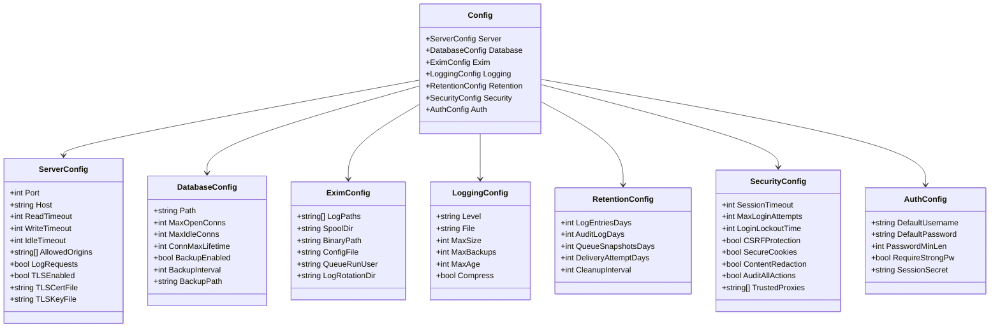
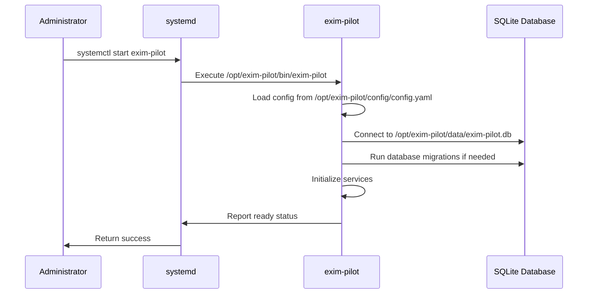
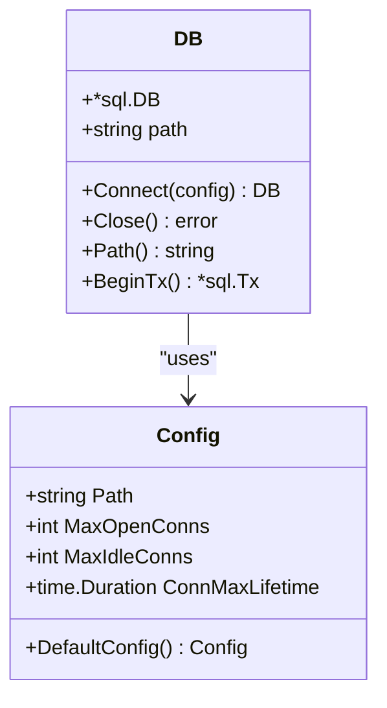

# Deployment Model


## Table of Contents
1. [Target Environment Requirements](#target-environment-requirements)
2. [Installation Process](#installation-process)
3. [Configuration Management](#configuration-management)
4. [Service Management](#service-management)
5. [Deployment Process Flow](#deployment-process-flow)
6. [Security Considerations](#security-considerations)
7. [System Integration](#system-integration)
8. [Deployment Topology Options](#deployment-topology-options)

## Target Environment Requirements

The exim-pilot deployment requires a specific environment setup to ensure proper functionality and integration with the Exim mail transfer agent. The system must meet the following requirements:

**Exim Log Access**: The application requires read access to Exim log files for monitoring and analysis. By default, it monitors three primary log files:
- `/var/log/exim4/mainlog` - Main Exim log containing message processing events
- `/var/log/exim4/rejectlog` - Log of rejected messages and connection attempts
- `/var/log/exim4/paniclog` - Critical error log for Exim daemon

**Spool Directory Access**: The application needs read access to the Exim spool directory at `/var/spool/exim4` to retrieve message content and queue information. This directory contains the actual email messages in transit.

**Database Storage**: exim-pilot uses SQLite as its primary data storage mechanism. The database file is stored at `/opt/exim-pilot/data/exim-pilot.db` by default. The system must have sufficient disk space to accommodate log data retention policies, which default to 90 days for log entries.

**Network Accessibility**: The web interface runs on port 8080 by default and binds to all network interfaces (`0.0.0.0`). This allows access from remote systems, though firewall rules may need to be adjusted to permit traffic on this port.

**Operating System**: The installation script is designed for Ubuntu/Debian systems, as verified by checking `/etc/os-release`. The system must have systemd available for service management.

**Prerequisites**: Exim4 must be installed on the system before deploying exim-pilot. The installer specifically checks for the presence of `exim4-daemon-heavy`, which provides the full feature set required for comprehensive monitoring.

**Section sources**
- [install.sh](file://deployments/install.sh#L50-L75)
- [config.example.yaml](file://config/config.example.yaml#L30-L36)

## Installation Process

The installation process for exim-pilot is automated through the `install.sh` script located in the deployments directory. This bash script handles all aspects of the installation, from system validation to service activation.

The installation begins with a series of system checks to ensure compatibility. It verifies that the script is running with root privileges, confirms the operating system is Ubuntu or Debian, checks for the presence of Exim4, and validates that systemd is available for service management.





**Diagram sources**
- [install.sh](file://deployments/install.sh#L80-L400)

The script creates a dedicated system user and group named `exim-pilot` to run the application with minimal privileges. This follows security best practices by avoiding the use of root or other privileged accounts for service execution.

A comprehensive directory structure is created under `/opt/exim-pilot` with the following subdirectories:
- `bin` - Application binaries
- `config` - Configuration files
- `data` - SQLite database and related data
- `logs` - Application log files
- `backups` - Database backup files

The installation process includes setting appropriate file permissions throughout the installation directory, with more restrictive permissions (750) applied to sensitive data directories.

**Section sources**
- [install.sh](file://deployments/install.sh#L80-L150)

## Configuration Management

Configuration for exim-pilot is managed through a YAML configuration file, with `config.example.yaml` serving as a template for creating the actual `config.yaml` file. The configuration system supports both file-based and environment variable overrides, providing flexibility for different deployment scenarios.

The main configuration file contains several key sections that control different aspects of the application:





**Diagram sources**
- [config.go](file://internal/config/config.go#L1-L480)
- [config.example.yaml](file://config/config.example.yaml#L1-L77)

The **Server Configuration** section controls the HTTP server behavior, including the port (default 8080), host binding, timeout settings, and CORS policies. The `allowed_origins` setting defaults to `["*"]` for development but should be restricted in production environments.

The **Database Configuration** specifies the SQLite database path, connection pool settings, and automatic backup configuration. The backup system can be enabled or disabled and configured with a specific interval (default 24 hours).

The **Exim Configuration** section defines the paths to Exim components, including log files, spool directory, binary, and configuration file. These paths are typically standard for Debian-based systems but can be customized for different installations.

The **Logging Configuration** controls application logging, including log level, file path, rotation settings (maximum size, number of backups, maximum age), and compression of rotated files.

The **Retention Configuration** sets data retention policies for different types of data, with separate settings for log entries (90 days), audit logs (365 days), queue snapshots (30 days), and delivery attempts (180 days).

The **Security Configuration** includes session management settings (timeout, CSRF protection, secure cookies), login attempt limits, and content redaction policies for sensitive information.

The **Authentication Configuration** defines the default admin user credentials, password requirements, and session secret generation. The default credentials are set to username "admin" and password "admin123", with a strong warning to change these after installation.

Configuration can be overridden using environment variables, which follow the pattern `EXIM_PILOT_<SECTION>_<SETTING>`. For example, `EXIM_PILOT_PORT` overrides the server port, and `EXIM_PILOT_ADMIN_PASSWORD` overrides the default admin password.

**Section sources**
- [config.go](file://internal/config/config.go#L1-L480)
- [config.example.yaml](file://config/config.example.yaml#L1-L77)

## Service Management

Service management for exim-pilot is handled through systemd, providing standard service control commands and automatic restart capabilities. The installation process creates a systemd service file and configures log rotation through the system's logrotate mechanism.

The systemd service file, installed to `/etc/systemd/system/exim-pilot.service`, defines the service properties including the executable path, user and group context, restart behavior, and dependencies. The service runs as the `exim-pilot` user and group, ensuring proper privilege separation.

Service control is performed using standard systemctl commands:
- `systemctl start exim-pilot` - Start the service
- `systemctl stop exim-pilot` - Stop the service
- `systemctl restart exim-pilot` - Restart the service
- `systemctl status exim-pilot` - Check service status
- `systemctl enable exim-pilot` - Enable automatic startup on boot
- `systemctl disable exim-pilot` - Disable automatic startup

The application binary itself supports several command-line options for management tasks:
- `-config` - Specify the configuration file path
- `-migrate-up` - Run database migrations to update the schema
- `-migrate-down` - Roll back database migrations
- `-version` - Display version information
- `-help` - Show help information





**Diagram sources**
- [main.go](file://cmd/exim-pilot/main.go#L1-L233)
- [install.sh](file://deployments/install.sh#L270-L290)

Log rotation is configured through a file in `/etc/logrotate.d/exim-pilot`, which rotates the application logs daily, keeps 30 days of logs, compresses rotated files, and sends a reload signal to the service after rotation to ensure the application starts writing to the new log file.

The application implements graceful shutdown handling, allowing up to 30 seconds for active requests to complete when the service is stopped. This prevents data corruption and ensures a clean shutdown process.

**Section sources**
- [install.sh](file://deployments/install.sh#L270-L310)
- [main.go](file://cmd/exim-pilot/main.go#L1-L233)

## Deployment Process Flow

The complete deployment process for exim-pilot follows a sequential flow from installation to web interface access. This process ensures all components are properly configured and integrated.

The process begins with running the installation script as root. The script first validates system requirements, then creates the necessary user accounts and directory structure. It copies the application binary to the installation directory and generates a configuration file with appropriate defaults.


```mermaid
flowchart TD
A[Run install.sh as root] --> B[Validate system requirements]
B --> C[Create exim-pilot user/group]
C --> D[Create directory structure]
D --> E[Copy application binary]
E --> F[Generate config.yaml]
F --> G[Install systemd service]
G --> H[Configure log rotation]
H --> I[Set file permissions]
I --> J[Initialize database]
J --> K[Start exim-pilot service]
K --> L[Access web UI at http://server:8080]
L --> M[Login with admin/admin123]
M --> N[Change default password]
N --> O[Configure TLS (recommended)]
```


**Diagram sources**
- [install.sh](file://deployments/install.sh#L1-L439)

After the service starts, the database is automatically initialized with the required schema through migration scripts. The application creates a default admin user if one does not already exist, using the credentials specified in the configuration.

The final step is accessing the web interface by navigating to `http://<server>:8080` in a web browser. The default credentials are username "admin" and password "admin123". The installation script prominently warns users to change the default password immediately after first login.

Post-installation configuration includes enabling TLS for secure communication, which requires obtaining SSL certificates and updating the configuration file with the certificate and key file paths. Firewall rules may also need to be adjusted to allow access to the service port.

**Section sources**
- [install.sh](file://deployments/install.sh#L1-L439)
- [main.go](file://cmd/exim-pilot/main.go#L1-L233)

## Security Considerations

Security is a critical aspect of exim-pilot deployment, with multiple layers of protection implemented at the file system, application, and network levels.

**File System Permissions**: The installation process sets strict file system permissions to minimize the attack surface. The main installation directory (`/opt/exim-pilot`) is owned by the `exim-pilot` user and group with 755 permissions. Sensitive data directories (`data`, `logs`, `backups`) have more restrictive 750 permissions. The configuration file has 640 permissions, readable only by the owner and group.

The `exim-pilot` user is added to the `adm` group to gain read access to system logs, including the Exim log files. The script also ensures the Exim log and spool directories have appropriate permissions (755) to allow read access.

**API Authentication**: The application implements a comprehensive authentication system with the following features:
- Default admin user with configurable credentials
- Session-based authentication with configurable timeout (default 60 minutes)
- CSRF protection for all state-changing operations
- Failed login attempt tracking with configurable limits (default 5 attempts)
- Account lockout after exceeding failed attempt limits (default 15 minutes)
- Secure cookies flag for HTTPS environments

**Network Exposure**: By default, the web interface binds to all network interfaces (`0.0.0.0`) on port 8080, making it accessible from any network. This should be restricted in production environments either through firewall rules or by binding to a specific interface (e.g., `127.0.0.1` for local access only).

The application supports TLS/SSL encryption, which should be enabled in production environments. When TLS is enabled, the application serves content over HTTPS, protecting credentials and sensitive data in transit.

**Content Redaction**: The configuration includes a `content_redaction` option that, when enabled, redacts sensitive information from logs and the user interface. This helps prevent accidental exposure of confidential data.

**Audit Logging**: The `audit_all_actions` configuration option enables comprehensive audit logging of administrative actions, providing an audit trail for security reviews and compliance requirements.

**Section sources**
- [install.sh](file://deployments/install.sh#L320-L340)
- [config.go](file://internal/config/config.go#L1-L480)
- [server.go](file://internal/api/server.go#L1-L275)

## System Integration

exim-pilot integrates with several system components and services to provide a comprehensive monitoring solution for Exim.

**systemd Integration**: The application is designed as a systemd service, allowing it to leverage the system's service management capabilities. This includes automatic startup on boot, status monitoring, restart on failure, and integration with system logging through journald.

The service file configuration ensures proper dependency management and clean startup/shutdown sequences. The post-rotation reload command in the logrotate configuration demonstrates integration with the system's log management infrastructure.

**Database Integration**: The application uses SQLite for persistent storage, with a well-defined schema managed through migration scripts. The database connection is configured with appropriate connection pool settings to balance performance and resource usage.





**Diagram sources**
- [connection.go](file://internal/database/connection.go#L1-L91)

The database initialization process includes running migration scripts to create the necessary tables and indexes. The application also supports manual migration commands for administrative purposes.

**Log Processing Integration**: The log processor service continuously monitors Exim log files, parsing entries and storing them in the database. It also performs correlation of related log entries to provide comprehensive message tracking.

The log processor includes background services for periodic tasks such as data cleanup (based on retention policies), correlation processing, and metrics collection. These services run within the main application process, ensuring coordinated resource usage.

**Web Interface Integration**: The frontend web interface is embedded within the Go binary, eliminating external dependencies for serving static assets. This simplifies deployment and ensures version compatibility between the frontend and backend.

The API server implements CORS (Cross-Origin Resource Sharing) to control access from web browsers, with configurable allowed origins. This allows the web interface to make API calls while preventing unauthorized cross-site requests.

**Section sources**
- [connection.go](file://internal/database/connection.go#L1-L91)
- [service.go](file://internal/logprocessor/service.go#L1-L344)
- [server.go](file://internal/api/server.go#L1-L275)

## Deployment Topology Options

exim-pilot supports multiple deployment topologies to accommodate different operational requirements and infrastructure constraints.

**Standalone Server Deployment**: In this configuration, exim-pilot is installed on the same server as the Exim mail transfer agent. This is the simplest deployment model, with direct access to Exim logs and spool directory.

This topology is ideal for single-server email environments or for organizations with a single mail server. It requires minimal network configuration and provides the lowest latency for log processing and queue management.

**Centralized Monitoring Deployment**: In larger environments with multiple Exim servers, exim-pilot can be deployed on a central monitoring server. This requires configuring log forwarding from each mail server to the central system.

Log forwarding can be achieved through various methods:
- Using syslog to forward Exim logs to the central server
- Mounting remote log directories via NFS or other network file systems
- Using log shipping tools like rsync or specialized log aggregation solutions

In this topology, the central exim-pilot instance monitors multiple Exim instances, providing a unified view of email operations across the organization. The configuration would need to specify multiple log paths corresponding to each monitored server.

**High Availability Deployment**: For critical environments, exim-pilot can be deployed in a high availability configuration with multiple instances accessing a shared database. However, since the application uses SQLite (a file-based database), this requires careful consideration.

SQLite does not support multiple writers simultaneously, so a high availability deployment would likely require a different database backend or a master-slave configuration with read replicas. The current implementation is optimized for single-writer scenarios.

**Containerized Deployment**: Although not explicitly supported in the current installation script, the application could be containerized for deployment in container orchestration platforms like Docker or Kubernetes. This would require creating a custom Dockerfile and adapting the installation process for container environments.

Each topology has different security implications. The standalone deployment has the smallest attack surface but provides monitoring only for a single server. The centralized deployment introduces network dependencies and requires secure communication channels between servers. The choice of topology should consider factors such as network bandwidth, security requirements, and administrative complexity.

**Section sources**
- [install.sh](file://deployments/install.sh#L1-L439)
- [config.example.yaml](file://config/config.example.yaml#L1-L77)

**Referenced Files in This Document**   
- [install.sh](file://deployments/install.sh#L1-L439)
- [config.example.yaml](file://config/config.example.yaml#L1-L77)
- [main.go](file://cmd/exim-pilot/main.go#L1-L233)
- [server.go](file://internal/api/server.go#L1-L275)
- [config.go](file://internal/config/config.go#L1-L480)
- [connection.go](file://internal/database/connection.go#L1-L91)
- [service.go](file://internal/logprocessor/service.go#L1-L344)