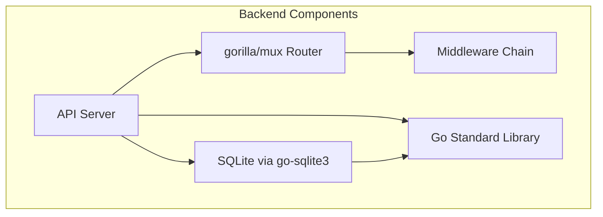
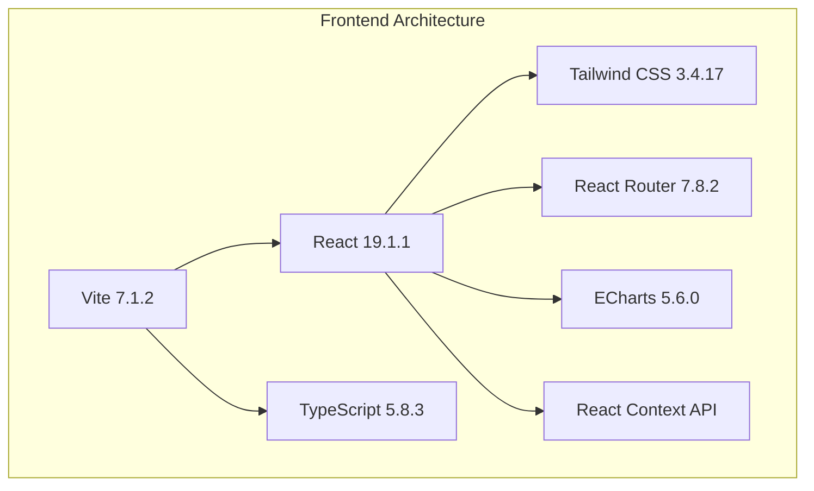
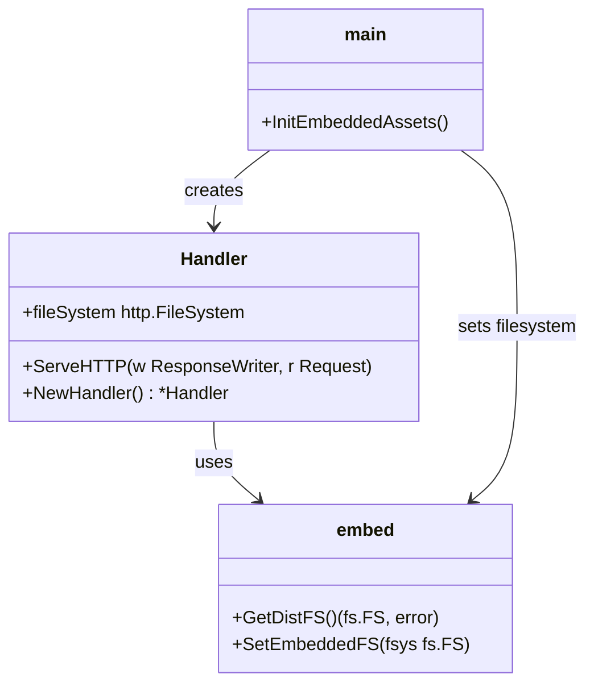
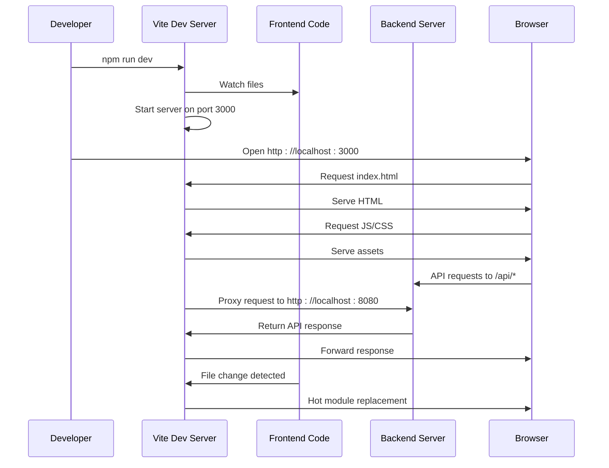
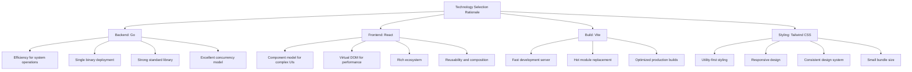

# Technology Stack


## Table of Contents
1. [Backend Stack](#backend-stack)
2. [Frontend Stack](#frontend-stack)
3. [Static Asset Embedding System](#static-asset-embedding-system)
4. [Development Workflow](#development-workflow)
5. [Technology Rationale](#technology-rationale)
6. [Version Compatibility and Dependencies](#version-compatibility-and-dependencies)

## Backend Stack

The backend of exim-pilot is built using Go 1.23.4, as specified in the `go.mod` file, which exceeds the minimum requirement of Go 1.20+. The application leverages the `gorilla/mux` package (v1.8.1) for HTTP routing, providing a powerful and flexible router for handling API endpoints with support for URL parameters, subrouters, and middleware integration.

Persistence is managed through SQLite via the `mattn/go-sqlite3` driver (v1.14.22), which is embedded directly into the Go binary. The database connection is configured with connection pooling parameters including a maximum of 25 open connections, 5 idle connections, and a 5-minute connection lifetime, ensuring efficient resource utilization and preventing connection exhaustion under load.

Core functionality relies heavily on Go's standard library for HTTP handling, context management, file system operations, and concurrency primitives. The architecture follows a modular design with clear separation of concerns across packages such as `api`, `database`, `logprocessor`, and `queue`. The API layer uses `gorilla/handlers` for CORS configuration and implements a comprehensive middleware chain including security headers, request logging, error handling, content-type validation, input validation, and audit logging.





**Diagram sources**
- [go.mod](file://go.mod#L1-L17)
- [server.go](file://internal/api/server.go#L1-L275)
- [connection.go](file://internal/database/connection.go#L1-L91)

**Section sources**
- [go.mod](file://go.mod#L1-L17)
- [server.go](file://internal/api/server.go#L1-L275)
- [connection.go](file://internal/database/connection.go#L1-L91)

## Frontend Stack

The frontend stack is built on React 19.1.1 with TypeScript 5.8.3, utilizing Vite 7.1.2 as the build tool. This combination provides a modern, high-performance development environment with fast cold starts and instant hot module replacement (HMR). The UI is styled using Tailwind CSS 3.4.17, which enables utility-first styling with a responsive design system.

React Router 7.8.2 manages client-side routing, enabling a single-page application (SPA) experience with navigation between Dashboard, Queue, Logs, Reports, and Message Trace views. The component architecture follows a modular structure with reusable components organized by feature domain (Auth, Common, Dashboard, Logs, Queue, Reports, MessageTrace). State management is handled through React Context API with custom hooks for dashboard, logs, and queue functionality.

Data visualization is powered by ECharts 5.6.0 integrated via `echarts-for-react`, providing interactive charts for metrics display. The UI includes advanced components such as virtualized lists (`react-window`) for efficient rendering of large datasets and infinite loading capabilities.





**Diagram sources**
- [package.json](file://web/package.json#L1-L46)
- [vite.config.ts](file://web/vite.config.ts#L1-L62)
- [tailwind.config.js](file://web/tailwind.config.js#L1-L11)
- [App.tsx](file://web/src/App.tsx#L1-L77)

**Section sources**
- [package.json](file://web/package.json#L1-L46)
- [vite.config.ts](file://web/vite.config.ts#L1-L62)
- [tailwind.config.js](file://web/tailwind.config.js#L1-L11)
- [App.tsx](file://web/src/App.tsx#L1-L77)

## Static Asset Embedding System

exim-pilot implements an embedded static asset system using Go's `embed` package to bundle the frontend assets directly into the binary. This is achieved through a conditional build system that serves different implementations based on the build tag.

The `embed.go` file contains the production implementation that serves files from an embedded filesystem (`embed.FS`) when the `embed` build tag is present. This allows the entire frontend (HTML, CSS, JavaScript, images) to be compiled into the Go binary, creating a self-contained executable with no external dependencies.

The `dev.go` file provides the development implementation that serves files from the filesystem, enabling hot reloading during development. The build system automatically selects the appropriate implementation based on the build context.

The `assets.go` file defines the interface for the embedded filesystem, with `SetEmbeddedFS` and `GetDistFS` functions that allow the main application to inject the embedded filesystem into the static handler.





**Diagram sources**
- [embed.go](file://internal/static/embed.go#L1-L146)
- [dev.go](file://internal/static/dev.go#L1-L148)
- [assets.go](file://internal/static/assets.go#L1-L21)
- [main.go](file://cmd/exim-pilot/main.go#L1-L233)

**Section sources**
- [embed.go](file://internal/static/embed.go#L1-L146)
- [dev.go](file://internal/static/dev.go#L1-L148)
- [assets.go](file://internal/static/assets.go#L1-L21)
- [main.go](file://cmd/exim-pilot/main.go#L1-L233)

## Development Workflow

The development workflow is optimized for productivity with hot reloading capabilities. The Vite configuration in `vite.config.ts` sets up a development server on port 3000 with proxy configuration that forwards API requests to the backend server running on port 8080. This enables seamless integration between the frontend and backend during development.

The build process is configured for optimal production output with code splitting, minification using Terser, and consistent chunk naming for better caching. The `optimizeDeps` configuration pre-bundles frequently used dependencies like React and ECharts for faster startup times.

The Playwright end-to-end testing framework is configured to run tests across multiple browsers (Chromium, Firefox, WebKit) and devices (desktop and mobile). The testing configuration automatically starts the development server before running tests, ensuring tests are executed against the actual application state.





**Diagram sources**
- [vite.config.ts](file://web/vite.config.ts#L1-L62)
- [playwright.config.ts](file://tests/playwright.config.ts#L1-L103)
- [main.go](file://cmd/exim-pilot/main.go#L1-L233)

**Section sources**
- [vite.config.ts](file://web/vite.config.ts#L1-L62)
- [playwright.config.ts](file://tests/playwright.config.ts#L1-L103)
- [main.go](file://cmd/exim-pilot/main.go#L1-L233)

## Technology Rationale

The technology choices for exim-pilot are driven by performance, maintainability, and developer experience considerations. Go was selected for the backend due to its efficiency in system-level operations, excellent concurrency model with goroutines, strong standard library, and ability to compile to a single binary with minimal dependencies. The `gorilla/mux` router provides a mature and feature-rich solution for API routing with excellent middleware support.

React was chosen for the frontend due to its component-based architecture that enables the creation of complex, interactive UIs through composable and reusable components. The virtual DOM provides efficient rendering performance, while the rich ecosystem supports advanced features like virtualized lists for handling large datasets in the queue and logs views.

TypeScript adds static typing to the frontend codebase, improving code quality, enabling better tooling support, and reducing runtime errors. Vite provides a modern build experience with fast startup times and hot module replacement, significantly improving developer productivity.

Tailwind CSS enables rapid UI development with a utility-first approach that promotes consistency and reduces the need for custom CSS. The atomic classes can be easily composed to create complex layouts while maintaining a small CSS bundle size through tree shaking.





**Section sources**
- [go.mod](file://go.mod#L1-L17)
- [package.json](file://web/package.json#L1-L46)
- [vite.config.ts](file://web/vite.config.ts#L1-L62)
- [tailwind.config.js](file://web/tailwind.config.js#L1-L11)

## Version Compatibility and Dependencies

The exim-pilot application maintains strict version compatibility requirements to ensure stability and security. The backend requires Go 1.23.4 or higher, with key dependencies including `gorilla/mux` v1.8.1 for routing, `mattn/go-sqlite3` v1.14.22 for database access, and `golang.org/x/crypto` v0.41.0 for cryptographic operations.

The frontend stack requires Node.js 18+ (as specified in Playwright dependencies) with React 19.1.1, TypeScript 5.8.3, and Vite 7.1.2. The development dependencies include Playwright 1.55.0 for end-to-end testing, ESLint 9.33.0 for code quality, and various TypeScript plugins for enhanced tooling.

Third-party dependencies are carefully managed through `go.mod` and `package-lock.json` to ensure reproducible builds. The application uses indirect dependencies only when necessary, minimizing the attack surface and reducing bundle size.

The embedded asset system ensures that frontend and backend versions are always in sync, as both are compiled into a single binary. This eliminates version mismatch issues that can occur in separate frontend/backend deployments.


```mermaid
dependency-graph
go.mod --> gorilla/mux
go.mod --> mattn/go-sqlite3
go.mod --> golang.org/x/crypto
go.mod --> gopkg.in/yaml.v3
package.json --> react
package.json --> typescript
package.json --> vite
package.json --> tailwindcss
package.json --> @playwright/test
package.json --> react-router-dom
package.json --> echarts
```


**Section sources**
- [go.mod](file://go.mod#L1-L17)
- [package.json](file://web/package.json#L1-L46)
- [package-lock.json](file://web/package-lock.json)
- [playwright.config.ts](file://tests/playwright.config.ts#L1-L103)

**Referenced Files in This Document**   
- [go.mod](file://go.mod)
- [package.json](file://web/package.json)
- [vite.config.ts](file://web/vite.config.ts)
- [tailwind.config.js](file://web/tailwind.config.js)
- [embed.go](file://internal/static/embed.go)
- [dev.go](file://internal/static/dev.go)
- [main.go](file://cmd/exim-pilot/main.go)
- [server.go](file://internal/api/server.go)
- [connection.go](file://internal/database/connection.go)
- [assets.go](file://internal/static/assets.go)
- [playwright.config.ts](file://tests/playwright.config.ts)