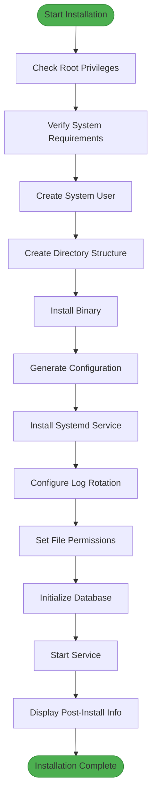
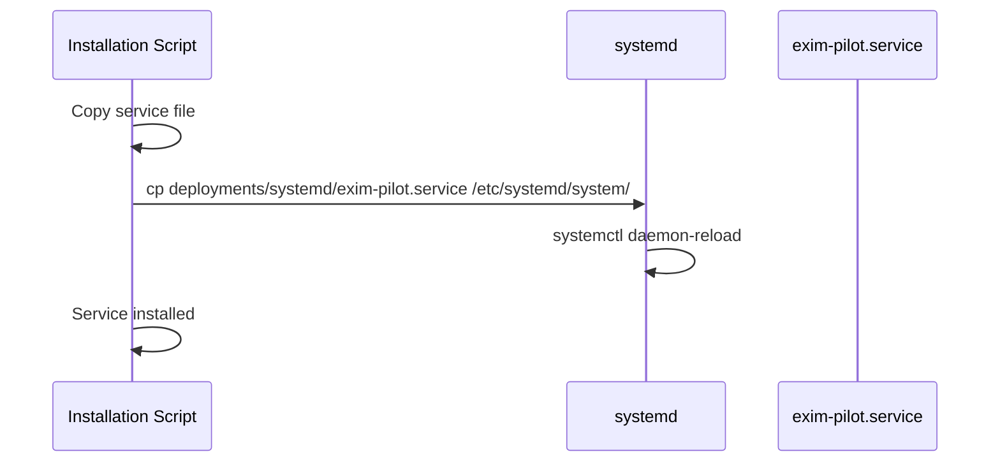

# Installation Guide


## Table of Contents
1. [System Prerequisites](#system-prerequisites)
2. [Installation Script Overview](#installation-script-overview)
3. [Step-by-Step Installation Process](#step-by-step-installation-process)
4. [Service Configuration and Management](#service-configuration-and-management)
5. [Post-Installation Setup](#post-installation-setup)
6. [Common Errors and Troubleshooting](#common-errors-and-troubleshooting)
7. [Uninstallation Procedure](#uninstallation-procedure)
8. [Validation and Verification](#validation-and-verification)

## System Prerequisites

Before running the installation script, ensure your system meets the following requirements:

**Operating System**
- Ubuntu or Debian-based Linux distribution
- Verified via `/etc/os-release` check in the script
- Script will exit with error if OS is not compatible

**Go Programming Language**
- Required version: **1.23.4**
- Source: `go.mod` file specifies `go 1.23.4`
- Used to compile the main `exim-pilot` binary
- Installation not handled by script; must be pre-installed

**Node.js and Frontend Dependencies**
- Node.js version: Compatible with **npm** and **Vite** tooling
- Package manager: **npm** (inferred from `package.json`)
- Build tool: **Vite v7.1.2** (from `vite: "^7.1.2"`)
- Frontend framework: **React 19.1.1** (from `react: "^19.1.1"`)
- TypeScript version: **~5.8.3** (from `typescript: "~5.8.3"`)

**Database**
- SQLite3 (embedded)
- Go driver: `github.com/mattn/go-sqlite3 v1.14.22`
- Database file created at: `/opt/exim-pilot/data/exim-pilot.db`
- No separate database server installation required

**System Services**
- **systemd** must be available and running
- Verified by checking presence of `systemctl` command
- Required for service management and auto-start configuration

**Required Software**
- **Exim4**: Must be installed prior to running installer
  - Required package: `exim4-daemon-heavy`
  - Binary path: `/usr/sbin/exim4`
  - Log directory: `/var/log/exim4`
  - Spool directory: `/var/spool/exim4`

**File Permissions**
- Script must be run with **root privileges**
- Created directories and files will have specific ownership:
  - User: `exim-pilot`
  - Group: `exim-pilot`
- Log access requires membership in `adm` group
- Configuration files set to `640` permissions for security

**Section sources**
- [install.sh](file://deployments/install.sh#L1-L50)
- [go.mod](file://go.mod#L1-L5)
- [package.json](file://web/package.json#L1-L10)

## Installation Script Overview

The `install.sh` script automates the deployment of Exim-Pilot on Ubuntu/Debian systems. It handles user creation, directory setup, binary installation, configuration, and service registration.





**Diagram sources**
- [install.sh](file://deployments/install.sh#L1-L439)

**Section sources**
- [install.sh](file://deployments/install.sh#L1-L439)

## Step-by-Step Installation Process

### Dependency Installation and Prerequisites

The script performs several prerequisite checks before proceeding:


```bash
# Check if running as root
if [ $EUID -ne 0 ](./$EUID -ne 0.md); then
    log_error "This script must be run as root"
    exit 1
fi

# Check OS compatibility
if ! grep -q "Ubuntu\|Debian" /etc/os-release; then
    log_error "This installer is designed for Ubuntu/Debian systems"
    exit 1
fi

# Verify Exim4 installation
if ! command -v exim4 &> /dev/null; then
    log_warning "Exim4 not found. Please install Exim4 first:"
    echo "  sudo apt update"
    echo "  sudo apt install exim4-daemon-heavy"
    exit 1
fi
```


**Expected Output:**

```
[INFO] Checking system requirements...
[SUCCESS] System requirements check passed
```


### Binary Compilation Requirements

The installation script does **not** compile the binary. Users must build it beforehand:


```bash
# From project root
./make build
```


The script expects the binary to exist in the current directory:

```bash
if [ ! -f "$BINARY_NAME" ](./! -f _$BINARY_NAME_.md); then
    log_error "Binary file '$BINARY_NAME' not found in current directory"
    log_info "Please ensure you have built the binary first:"
    echo "  make build"
    exit 1
fi
```


**Build Process Notes:**
- Build system uses a custom `./make` script (not standard Makefile)
- Production build embeds frontend assets
- Development build uses separate frontend server
- Frontend built using `npm run build` (Vite)

**Section sources**
- [install.sh](file://deployments/install.sh#L100-L120)
- [README.md](file://README.md#L38-L46)

### Directory Structure Creation

The script creates a standardized directory structure under `/opt/exim-pilot`:


```bash
# Create main directories
mkdir -p "$INSTALL_DIR"/{bin,config,data,logs,backups}
```


**Created Directory Structure:**

```
/opt/exim-pilot/
├── bin/        # Executable binaries
├── config/     # Configuration files
├── data/       # SQLite database
├── logs/       # Application logs
└── backups/    # Database backups
```


**Permissions Applied:**
- Root directory: `755` (rwxr-xr-x)
- Configuration: `755` (rwxr-xr-x)
- Data/Logs/Backups: `750` (rwxr-x---)
- Ownership: `exim-pilot:exim-pilot`

**Expected Output:**

```
[INFO] Creating directory structure...
[SUCCESS] Directory structure created
```


**Section sources**
- [install.sh](file://deployments/install.sh#L130-L145)

### Configuration File Setup

The script generates a default configuration file with security-sensitive defaults:


```bash
# Generate random session secret
SESSION_SECRET=$(openssl rand -hex 32 2>/dev/null || head -c 32 /dev/urandom | xxd -p -c 32)
```


**Configuration File:** `/opt/exim-pilot/config/config.yaml`

**Key Configuration Sections:**

**Server Configuration**

```yaml
server:
  port: 8080
  host: "0.0.0.0"
  tls_enabled: false
  # tls_cert_file: "/etc/ssl/certs/exim-pilot.crt"
  # tls_key_file: "/etc/ssl/private/exim-pilot.key"
```


**Database Configuration**

```yaml
database:
  path: "/opt/exim-pilot/data/exim-pilot.db"
  backup_enabled: true
  backup_interval: 24
  backup_path: "/opt/exim-pilot/backups"
```


**Exim Integration**

```yaml
exim:
  log_paths:
    - "/var/log/exim4/mainlog"
    - "/var/log/exim4/rejectlog"
    - "/var/log/exim4/paniclog"
  spool_dir: "/var/spool/exim4"
  binary_path: "/usr/sbin/exim4"
```


**Security Settings**

```yaml
security:
  session_timeout: 60
  max_login_attempts: 5
  csrf_protection: true
  secure_cookies: true

auth:
  default_username: "admin"
  default_password: "admin123"  # CHANGE THIS AFTER INSTALLATION
  session_secret: "$SESSION_SECRET"
```


If a config file already exists, it's backed up with timestamp:

```bash
cp "$CONFIG_FILE" "$CONFIG_FILE.backup.$(date +%Y%m%d_%H%M%S)"
```


**Expected Output:**

```
[INFO] Creating default configuration...
[WARNING] Configuration file already exists: /opt/exim-pilot/config/config.yaml
[INFO] Backing up existing configuration...
[SUCCESS] Configuration file created: /opt/exim-pilot/config/config.yaml
[WARNING] IMPORTANT: Change the default admin password after installation!
```


**Section sources**
- [install.sh](file://deployments/install.sh#L180-L270)
- [config.example.yaml](file://config/config.example.yaml#L1-L77)

### Service Registration

The script installs and configures a systemd service for process management:





**Service File Location:** `/etc/systemd/system/exim-pilot.service`

**Service Configuration:**

```ini
[Unit]
Description=Exim Control Panel (Exim-Pilot)
After=network.target
Wants=network.target

[Service]
Type=simple
User=exim-pilot
Group=exim-pilot
WorkingDirectory=/opt/exim-pilot
ExecStart=/opt/exim-pilot/bin/exim-pilot
Restart=always
RestartSec=5

[Install]
WantedBy=multi-user.target
```


**Security Hardening:**
- `NoNewPrivileges=true`
- `PrivateTmp=true`
- `ProtectSystem=strict`
- `ProtectHome=true`
- Capability bounding and system call filtering

**Resource Limits:**
- `LimitNOFILE=65536` (file descriptors)
- `LimitNPROC=4096` (processes)

**Environment Variables:**
- `EXIM_PILOT_CONFIG=/opt/exim-pilot/config/config.yaml`
- `EXIM_PILOT_LOG_LEVEL=info`

**Expected Output:**

```
[INFO] Installing systemd service...
[SUCCESS] Systemd service installed
```


**Section sources**
- [install.sh](file://deployments/install.sh#L275-L295)
- [exim-pilot.service](file://deployments/systemd/exim-pilot.service#L1-L52)

## Service Configuration and Management

### Log Rotation Setup

The script configures log rotation via `/etc/logrotate.d/exim-pilot`:


```bash
cat > "/etc/logrotate.d/exim-pilot" << EOF
$INSTALL_DIR/logs/*.log {
    daily
    missingok
    rotate 30
    compress
    delaycompress
    notifempty
    create 640 $SERVICE_USER $SERVICE_GROUP
    postrotate
        systemctl reload $SERVICE_NAME > /dev/null 2>&1 || true
    endscript
}
EOF
```


**Log Rotation Policy:**
- Rotation frequency: Daily
- Number of archives: 30
- Compression: Enabled
- Post-rotation: Send HUP signal to reload service
- File creation: `640` permissions, owned by `exim-pilot:exim-pilot`

### File Permissions Configuration

The script configures permissions for Exim log access:


```bash
# Add exim-pilot user to adm group for log access
usermod -a -G adm "$SERVICE_USER"

# Ensure log directories are readable
chmod 755 /var/log/exim4
chmod 755 /var/spool/exim4
```


This allows the `exim-pilot` service to read Exim logs while maintaining security boundaries.

**Expected Output:**

```
[INFO] Configuring file permissions...
[SUCCESS] Exim log directory permissions configured
[SUCCESS] Exim spool directory permissions configured
```


### Database Initialization

The script initializes the SQLite database using the application's migration system:


```bash
# Run database migrations as the service user
sudo -u "$SERVICE_USER" "$INSTALL_DIR/bin/$BINARY_NAME" --migrate-up --config "$CONFIG_FILE"
```


This command:
- Runs as the `exim-pilot` user for security
- Applies all pending database migrations
- Creates the initial database schema
- Sets up required tables and indexes

**Expected Output:**

```
[INFO] Initializing database...
[SUCCESS] Database initialized
```


**Section sources**
- [install.sh](file://deployments/install.sh#L300-L330)

## Post-Installation Setup

After successful installation, the script displays critical next steps:


```
=== Exim Control Panel Installation Summary ===
Installation directory: /opt/exim-pilot
Configuration file: /opt/exim-pilot/config/config.yaml
Service name: exim-pilot
Service user: exim-pilot

=== Next Steps ===
1. Change the default admin password:
   - Open http://localhost:8080 in your browser
   - Login with username: admin, password: admin123
   - Change the password in the user settings

2. Configure TLS (recommended for production):
   - Obtain SSL certificates
   - Update /opt/exim-pilot/config/config.yaml with certificate paths
   - Set tls_enabled: true
   - Restart service: systemctl restart exim-pilot

3. Adjust firewall settings if needed:
   - Allow port 8080: ufw allow 8080
```


**Service Management Commands:**
- Start: `systemctl start exim-pilot`
- Stop: `systemctl stop exim-pilot`
- Restart: `systemctl restart exim-pilot`
- Status: `systemctl status exim-pilot`
- Logs: `journalctl -u exim-pilot -f`

**Configuration Updates:**
- Edit `/opt/exim-pilot/config/config.yaml`
- Restart service after changes: `systemctl restart exim-pilot`

**Section sources**
- [install.sh](file://deployments/install.sh#L380-L430)

## Common Errors and Troubleshooting

### Missing Root Privileges

**Error Message:**

```
[ERROR] This script must be run as root
```


**Solution:**
Run the script with sudo:

```bash
sudo ./deployments/install.sh
```


### Exim4 Not Installed

**Error Message:**

```
[WARNING] Exim4 not found. Please install Exim4 first:
  sudo apt update
  sudo apt install exim4-daemon-heavy
```


**Solution:**
Install Exim4 before running the installer:

```bash
sudo apt update
sudo apt install exim4-daemon-heavy
```


### Binary Not Found

**Error Message:**

```
[ERROR] Binary file 'exim-pilot' not found in current directory
[INFO] Please ensure you have built the binary first:
  make build
```


**Solution:**
Build the binary before installation:

```bash
./make build
```


### Service Fails to Start

**Error Message:**

```
[ERROR] Service failed to start
[INFO] Check service status with: systemctl status exim-pilot
[INFO] Check logs with: journalctl -u exim-pilot -f
```


**Troubleshooting Steps:**
1. Check service status:

```bash
systemctl status exim-pilot
```


2. View detailed logs:

```bash
journalctl -u exim-pilot -f
```


3. Verify configuration file syntax:

```bash
yamllint /opt/exim-pilot/config/config.yaml
```


4. Check file permissions:

```bash
ls -la /opt/exim-pilot/
```


### Configuration File Conflicts

If the configuration file exists, it's backed up but not overwritten:

```
[WARNING] Configuration file already exists: /opt/exim-pilot/config/config.yaml
[INFO] Backing up existing configuration...
```


**Solution:**
- Review the backup file
- Manually merge changes if needed
- Or remove the existing config to generate a fresh one

**Section sources**
- [install.sh](file://deployments/install.sh#L80-L95)

## Uninstallation Procedure

The script includes a built-in uninstallation option:


```bash
./deployments/install.sh --uninstall
```


**Uninstallation Process:**
1. Stop and disable the systemd service
2. Remove the service file
3. Remove logrotate configuration
4. Prompt to remove data and configuration files
5. Prompt to remove system user and group

**Interactive Prompts:**

```
Remove all data and configuration files? [y/N]: 
Remove system user exim-pilot? [y/N]: 
```


**Manual Cleanup (if needed):**

```bash
# Remove installation directory
sudo rm -rf /opt/exim-pilot

# Remove systemd service
sudo rm /etc/systemd/system/exim-pilot.service
sudo systemctl daemon-reload

# Remove logrotate configuration
sudo rm /etc/logrotate.d/exim-pilot

# Remove user and group
sudo userdel exim-pilot
sudo groupdel exim-pilot
```


**Section sources**
- [install.sh](file://deployments/install.sh#L335-L375)

## Validation and Verification

After installation, verify the system is working correctly:

### Service Status Check


```bash
systemctl status exim-pilot
```


**Expected Output:**

```
● exim-pilot.service - Exim Control Panel (Exim-Pilot)
   Loaded: loaded (/etc/systemd/system/exim-pilot.service; enabled)
   Active: active (running) since Mon 2025-01-01 12:00:00 UTC; 5s ago
 Main PID: 1234 (exim-pilot)
    Tasks: 8
   Memory: 15.2M
```


### Log Verification


```bash
journalctl -u exim-pilot --since "5 minutes ago"
```


**Expected Output:**

```
Jan 01 12:00:00 server exim-pilot[1234]: [INFO] Starting Exim Control Panel
Jan 01 12:00:00 server exim-pilot[1234]: [INFO] Server listening on :8080
Jan 01 12:00:00 server exim-pilot[1234]: [INFO] Connected to database
```


### Web Interface Access

Access the web interface:

```bash
curl -I http://localhost:8080
```


**Expected Response:**

```
HTTP/1.1 200 OK
Content-Type: text/html; charset=utf-8
```


### Database Verification

Check database file:

```bash
ls -la /opt/exim-pilot/data/exim-pilot.db
```


**Expected Output:**

```
-rw-r--r-- 1 exim-pilot exim-pilot 131072 Jan 01 12:00 /opt/exim-pilot/data/exim-pilot.db
```


### Configuration Validation

Verify key configuration settings:

```bash
grep -E "port:|tls_enabled:|default_username:" /opt/exim-pilot/config/config.yaml
```


**Expected Output:**

```yaml
  port: 8080
  tls_enabled: false
  default_username: "admin"
```


**Section sources**
- [install.sh](file://deployments/install.sh#L350-L365)

**Referenced Files in This Document**   
- [install.sh](file://deployments/install.sh#L1-L439)
- [exim-pilot.service](file://deployments/systemd/exim-pilot.service#L1-L52)
- [config.example.yaml](file://config/config.example.yaml#L1-L77)
- [go.mod](file://go.mod#L1-L18)
- [package.json](file://web/package.json#L1-L46)
- [README.md](file://README.md#L38-L46)