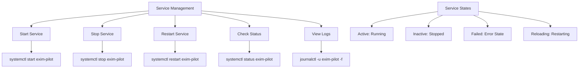
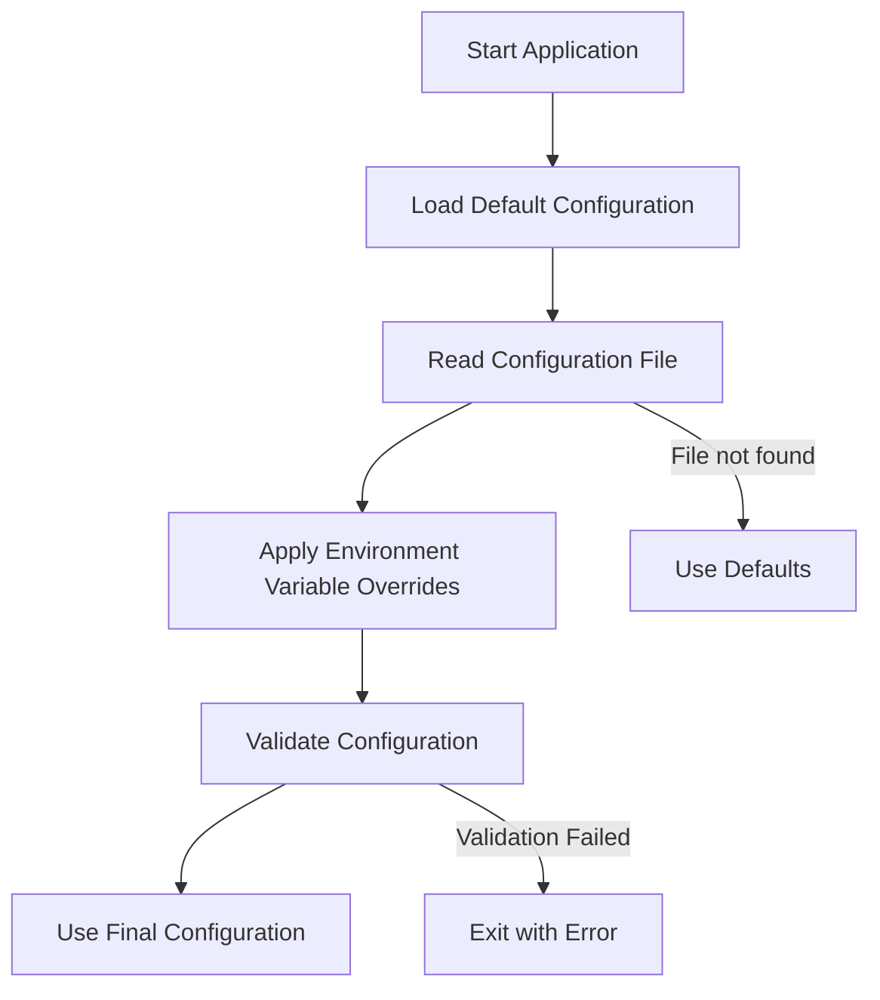
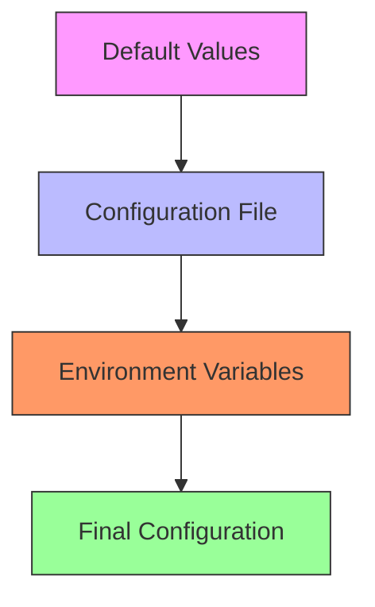
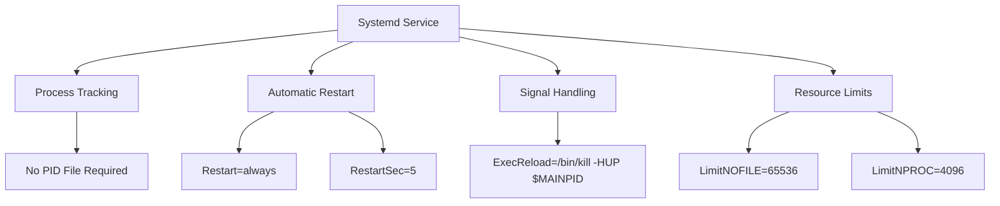

# Service Configuration


## Table of Contents
1. [Introduction](#introduction)
2. [Systemd Service Configuration](#systemd-service-configuration)
3. [Service Management Commands](#service-management-commands)
4. [Configuration Management](#configuration-management)
5. [Environment-Specific Configuration](#environment-specific-configuration)
6. [Logging Configuration](#logging-configuration)
7. [PID File and Process Management](#pid-file-and-process-management)
8. [Auto-Start on Boot](#auto-start-on-boot)
9. [Deployment Environment Configuration](#deployment-environment-configuration)
10. [Integration with System Logging](#integration-with-system-logging)

## Introduction
This document provides comprehensive guidance on configuring exim-pilot as a system service using systemd. It covers the complete service lifecycle including installation, configuration, management, and integration with system components. The documentation is based on analysis of the deployment scripts, service configuration files, and application source code from the exim-pilot repository. The focus is on providing practical instructions for system administrators to deploy and manage the exim-pilot service in various environments.

**Section sources**
- [install.sh](file://deployments/install.sh#L1-L438)
- [exim-pilot.service](file://deployments/systemd/exim-pilot.service#L1-L52)

## Systemd Service Configuration
The exim-pilot systemd service is configured through a unit file that defines the service behavior, security settings, and execution parameters. The service configuration is designed to follow security best practices while ensuring reliable operation.

```mermaid
graph TD
A[Unit Section] --> B[Description: Exim Control Panel]
A --> C[Documentation: GitHub Repository]
A --> D[After: network.target]
A --> E[Wants: network.target]
F[Service Section] --> G[Type: simple]
F --> H[User: exim-pilot]
F --> I[Group: exim-pilot]
F --> J[WorkingDirectory: /opt/exim-pilot]
F --> K[ExecStart: /opt/exim-pilot/bin/exim-pilot]
F --> L[Restart: always]
F --> M[StandardOutput: journal]
F --> N[StandardError: journal]
O[Security Settings] --> P[NoNewPrivileges: true]
O --> Q[PrivateTmp: true]
O --> R[ProtectSystem: strict]
O --> S[ProtectHome: true]
O --> T[ReadWritePaths: data, logs, backups]
O --> U[ReadOnlyPaths: Exim logs and spool]
V[Resource Limits] --> W[LimitNOFILE: 65536]
V --> X[LimitNPROC: 4096]
Y[Environment] --> Z[EXIM_PILOT_CONFIG: config path]
Y --> AA[EXIM_PILOT_LOG_LEVEL: info]
BB[Install Section] --> CC[WantedBy: multi-user.target]
```





**Diagram sources**
- [exim-pilot.service](file://deployments/systemd/exim-pilot.service#L1-L52)

**Section sources**
- [exim-pilot.service](file://deployments/systemd/exim-pilot.service#L1-L52)

## Service Management Commands
The exim-pilot service can be managed using standard systemd commands for start, stop, restart, and status operations. These commands provide reliable service control and are integrated with the system's service management framework.





The following commands are used to manage the exim-pilot service:

- **Start service**: `systemctl start exim-pilot`
- **Stop service**: `systemctl stop exim-pilot`
- **Restart service**: `systemctl restart exim-pilot`
- **Service status**: `systemctl status exim-pilot`
- **View logs**: `journalctl -u exim-pilot -f`

The install.sh script automates service management during installation by enabling and starting the service:


```bash
# Enable service to start on boot
systemctl enable "$SERVICE_NAME"

# Start service immediately
systemctl start "$SERVICE_NAME"

# Check service status
if systemctl is-active --quiet "$SERVICE_NAME"; then
    log_success "Service started successfully"
else
    log_error "Service failed to start"
fi
```


**Section sources**
- [install.sh](file://deployments/install.sh#L380-L398)
- [exim-pilot.service](file://deployments/systemd/exim-pilot.service#L1-L52)

## Configuration Management
The exim-pilot service uses YAML configuration files to define application settings. The configuration system supports both file-based configuration and environment variable overrides, providing flexibility for different deployment scenarios.

### Configuration File Structure
The main configuration file (config.yaml) contains several sections that control different aspects of the application:


```yaml
server:
  port: 8080
  host: "0.0.0.0"
  read_timeout: 15
  write_timeout: 15

database:
  path: "/opt/exim-pilot/data/exim-pilot.db"
  max_open_conns: 25
  max_idle_conns: 5

logging:
  level: "info"
  file: "/opt/exim-pilot/logs/exim-pilot.log"
  max_size: 100
  max_backups: 5
```


### Configuration Loading Process
The application follows a specific order for loading and applying configuration:





The configuration loading process is implemented in the config.go file:


```go
// LoadFromFile loads configuration from a YAML file
func LoadFromFile(path string) (*Config, error) {
    config := DefaultConfig()

    // Check if file exists
    if _, err := os.Stat(path); os.IsNotExist(err) {
        return config, fmt.Errorf("configuration file not found: %s", path)
    }

    // Read and parse YAML file
    data, err := os.ReadFile(path)
    if err != nil {
        return config, fmt.Errorf("failed to read configuration file: %w", err)
    }

    if err := yaml.Unmarshal(data, config); err != nil {
        return config, fmt.Errorf("failed to parse configuration file: %w", err)
    }

    // Apply environment variable overrides
    config.LoadFromEnv()

    // Validate configuration
    if err := config.Validate(); err != nil {
        return config, fmt.Errorf("configuration validation failed: %w", err)
    }

    return config, nil
}
```


**Diagram sources**
- [config.go](file://internal/config/config.go#L1-L480)

**Section sources**
- [config.example.yaml](file://config/config.example.yaml#L1-L77)
- [config.go](file://internal/config/config.go#L1-L480)

## Environment-Specific Configuration
The exim-pilot application supports environment-specific configuration through a combination of YAML configuration files and environment variable overrides. This allows for flexible deployment across different environments without modifying the configuration files.

### Configuration Hierarchy
The application uses the following hierarchy for configuration values:





### Environment Variable Overrides
The application supports numerous environment variables that can override configuration file settings:


```go
// LoadFromEnv loads configuration overrides from environment variables
func (c *Config) LoadFromEnv() {
    // Server configuration
    if port := os.Getenv("EXIM_PILOT_PORT"); port != "" {
        if p, err := strconv.Atoi(port); err == nil {
            c.Server.Port = p
        }
    }

    if host := os.Getenv("EXIM_PILOT_HOST"); host != "" {
        c.Server.Host = host
    }

    // Database configuration
    if dbPath := os.Getenv("EXIM_PILOT_DB_PATH"); dbPath != "" {
        c.Database.Path = dbPath
    }

    // Logging configuration
    if logLevel := os.Getenv("EXIM_PILOT_LOG_LEVEL"); logLevel != "" {
        c.Logging.Level = logLevel
    }

    // Auth configuration
    if adminPass := os.Getenv("EXIM_PILOT_ADMIN_PASSWORD"); adminPass != "" {
        c.Auth.DefaultPassword = adminPass
    }

    if sessionSecret := os.Getenv("EXIM_PILOT_SESSION_SECRET"); sessionSecret != "" {
        c.Auth.SessionSecret = sessionSecret
    }
}
```


The following environment variables are supported:

- **EXIM_PILOT_PORT**: Override server port
- **EXIM_PILOT_HOST**: Override server host
- **EXIM_PILOT_DB_PATH**: Override database path
- **EXIM_PILOT_LOG_LEVEL**: Override log level
- **EXIM_PILOT_ADMIN_PASSWORD**: Override admin password
- **EXIM_PILOT_SESSION_SECRET**: Override session secret
- **EXIM_PILOT_TLS_ENABLED**: Enable/disable TLS
- **EXIM_PILOT_TLS_CERT**: TLS certificate file path
- **EXIM_PILOT_TLS_KEY**: TLS key file path

**Section sources**
- [config.example.yaml](file://config/config.example.yaml#L70-L77)
- [config.go](file://internal/config/config.go#L252-L298)

## Logging Configuration
The exim-pilot application provides comprehensive logging configuration options that control log output, rotation, and retention. The logging system is integrated with both file-based logging and systemd journal logging.

### Logging Configuration Options
The logging configuration is defined in the YAML configuration file:


```yaml
logging:
  level: "info"                # Log level (debug, info, warn, error, fatal)
  file: "logs/exim-pilot.log"  # Log file path (empty for stdout only)
  max_size: 100                # Maximum log file size (MB)
  max_backups: 5               # Number of log backup files to keep
  max_age: 30                  # Maximum age of log files (days)
  compress: true               # Compress rotated log files
```


### Log Rotation Configuration
The install.sh script sets up log rotation using logrotate:


```bash
# Set up log rotation
setup_logrotate() {
    log_info "Setting up log rotation..."
    
    cat > "/etc/logrotate.d/exim-pilot" << EOF
$INSTALL_DIR/logs/*.log {
    daily
    missingok
    rotate 30
    compress
    delaycompress
    notifempty
    create 640 $SERVICE_USER $SERVICE_GROUP
    postrotate
        systemctl reload $SERVICE_NAME > /dev/null 2>&1 || true
    endscript
}
EOF
    
    log_success "Log rotation configured"
}
```


### Validation of Logging Configuration
The application validates logging configuration during startup:


```go
// Validate logging configuration
validLogLevels := map[string]bool{
    "debug": true, "info": true, "warn": true, "error": true, "fatal": true,
}

if !validLogLevels[c.Logging.Level] {
    return fmt.Errorf("invalid log level: %s", c.Logging.Level)
}

if c.Logging.File != "" {
    logDir := filepath.Dir(c.Logging.File)
    if err := os.MkdirAll(logDir, 0755); err != nil {
        return fmt.Errorf("cannot create log directory %s: %w", logDir, err)
    }
}
```


**Section sources**
- [config.example.yaml](file://config/config.example.yaml#L55-L61)
- [install.sh](file://deployments/install.sh#L320-L335)
- [config.go](file://internal/config/config.go#L280-L290)

## PID File and Process Management
The exim-pilot service does not use a traditional PID file for process management. Instead, it relies on systemd's built-in process tracking and management capabilities.

### Process Management Strategy
The service uses systemd's native process management features:





### Service Type and Behavior
The service is configured as a simple service type:


```ini
[Service]
Type=simple
ExecStart=/opt/exim-pilot/bin/exim-pilot
Restart=always
RestartSec=5
```


The `Type=simple` setting indicates that systemd should consider the service started immediately when the ExecStart command is executed. Systemd will then track the main process and manage its lifecycle.

### Signal Handling
The service supports graceful shutdown through signal handling:


```go
// Wait for interrupt signal to gracefully shutdown
quit := make(chan os.Signal, 1)
signal.Notify(quit, syscall.SIGINT, syscall.SIGTERM)
<-quit

log.Println("Shutting down server...")

// Create a context with timeout for graceful shutdown
ctx, cancel := context.WithTimeout(context.Background(), 30*time.Second)
defer cancel()

if err := server.Stop(ctx); err != nil {
    log.Fatalf("Server forced to shutdown: %v", err)
}
```


**Section sources**
- [exim-pilot.service](file://deployments/systemd/exim-pilot.service#L1-L52)
- [main.go](file://cmd/exim-pilot/main.go#L150-L170)

## Auto-Start on Boot
The exim-pilot service is configured to start automatically on system boot through systemd's service management capabilities.

### Service Installation Process
The install.sh script handles the auto-start configuration:


```bash
# Install systemd service
install_service() {
    log_info "Installing systemd service..."
    
    # Copy service file
    cp "deployments/systemd/exim-pilot.service" "/etc/systemd/system/"
    
    # Reload systemd
    systemctl daemon-reload
    
    log_success "Systemd service installed"
}

# Start and enable service
start_service() {
    log_info "Starting and enabling service..."
    
    # Enable service to start on boot
    systemctl enable "$SERVICE_NAME"
    
    # Start service immediately
    systemctl start "$SERVICE_NAME"
}
```


### Systemd Unit File Configuration
The service unit file includes the Install section that defines the boot behavior:


```ini
[Install]
WantedBy=multi-user.target
```


This configuration ensures that the service is started when the system reaches the multi-user target, which is the standard multi-user system state.

### Verification of Auto-Start Configuration
The auto-start configuration can be verified using the following commands:


```bash
# Check if service is enabled
systemctl is-enabled exim-pilot

# List services that start on boot
systemctl list-unit-files --type=service | grep exim-pilot

# Check service status
systemctl status exim-pilot
```


**Section sources**
- [install.sh](file://deployments/install.sh#L340-L398)
- [exim-pilot.service](file://deployments/systemd/exim-pilot.service#L49-L52)

## Deployment Environment Configuration
The exim-pilot application supports different deployment environments (development, staging, production) through configuration files and environment variables.

### Environment Configuration Examples
The config.example.yaml file provides guidance for environment-specific settings:


```yaml
server:
  allowed_origins: ["*"]       # Use specific domains in production
  tls_enabled: false           # Enable HTTPS in production

auth:
  default_password: "admin123" # CHANGE THIS AFTER INSTALLATION
```


### Development Environment
For development environments, the default configuration is suitable with minimal changes:


```yaml
server:
  port: 8080
  host: "0.0.0.0"
  allowed_origins: ["*"]
  tls_enabled: false

logging:
  level: "debug"
```


### Production Environment
For production environments, enhanced security settings are recommended:


```yaml
server:
  port: 443
  host: "0.0.0.0"
  allowed_origins: ["https://your-domain.com"]
  tls_enabled: true
  tls_cert_file: "/etc/ssl/certs/exim-pilot.crt"
  tls_key_file: "/etc/ssl/private/exim-pilot.key"

security:
  secure_cookies: true

auth:
  default_password: "your-strong-password-here"
```


### Environment-Specific Overrides
Environment variables can be used to customize settings for different environments:


```bash
# Production environment variables
export EXIM_PILOT_LOG_LEVEL="warn"
export EXIM_PILOT_ADMIN_PASSWORD="strong-password"
export EXIM_PILOT_TLS_ENABLED="true"
export EXIM_PILOT_TLS_CERT="/path/to/cert.pem"
export EXIM_PILOT_TLS_KEY="/path/to/key.pem"
```


**Section sources**
- [config.example.yaml](file://config/config.example.yaml#L1-L77)
- [config.go](file://internal/config/config.go#L1-L480)

## Integration with System Logging
The exim-pilot service is fully integrated with the system's logging infrastructure through systemd journal and traditional log files.

### Journal Integration
The service unit file configures integration with systemd journal:


```ini
[Service]
StandardOutput=journal
StandardError=journal
SyslogIdentifier=exim-pilot
```


These settings ensure that all output from the service is captured by the systemd journal with the identifier "exim-pilot".

### Accessing Service Logs
Service logs can be accessed using journalctl:


```bash
# View service logs
journalctl -u exim-pilot

# View logs in real-time
journalctl -u exim-pilot -f

# View logs with specific severity
journalctl -u exim-pilot -p err

# View logs from the current boot
journalctl -u exim-pilot -b

# View logs with timestamp
journalctl -u exim-pilot --since "2023-01-01" --until "2023-01-02"
```


### Log Correlation
The application provides service status information that can be correlated with system logs:


```go
// Get service status
serviceStatus := h.logService.GetServiceStatus()

// Create dashboard response
dashboard := map[string]interface{}{
    "service_status": serviceStatus,
    "summary": map[string]interface{}{
        "service_running": serviceStatus.Running,
    },
}
```


### Log Management Best Practices
The installation script sets up comprehensive log management:


```bash
# Configure file permissions for log access
configure_permissions() {
    # Add exim-pilot user to adm group for log access
    usermod -a -G adm "$SERVICE_USER"
}

# Set up log rotation
setup_logrotate() {
    cat > "/etc/logrotate.d/exim-pilot" << EOF
$INSTALL_DIR/logs/*.log {
    daily
    rotate 30
    compress
    create 640 $SERVICE_USER $SERVICE_GROUP
    postrotate
        systemctl reload $SERVICE_NAME > /dev/null 2>&1 || true
    endscript
}
EOF
}
```


**Section sources**
- [exim-pilot.service](file://deployments/systemd/exim-pilot.service#L1-L52)
- [install.sh](file://deployments/install.sh#L320-L335)
- [main.go](file://cmd/exim-pilot/main.go#L200-L233)

**Referenced Files in This Document**   
- [install.sh](file://deployments/install.sh#L1-L438)
- [exim-pilot.service](file://deployments/systemd/exim-pilot.service#L1-L52)
- [config.example.yaml](file://config/config.example.yaml#L1-L77)
- [config.go](file://internal/config/config.go#L1-L480)
- [main.go](file://cmd/exim-pilot/main.go#L1-L233)