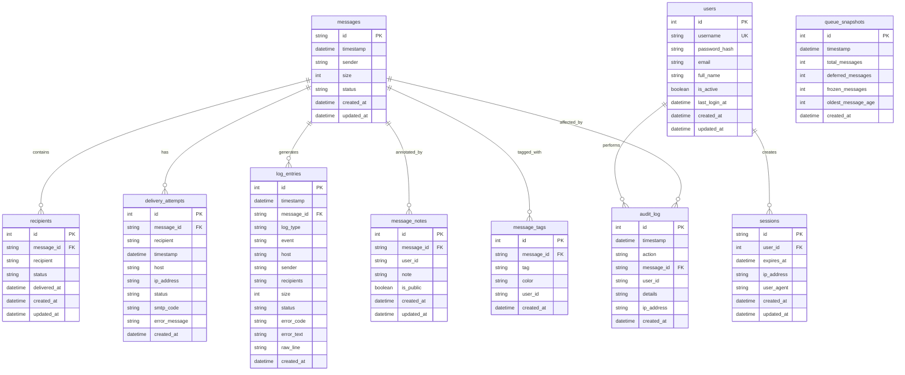

# Database Initialization and Migration


## Table of Contents
1. [Introduction](#introduction)
2. [Database Initialization](#database-initialization)
3. [Schema Initialization from Code](#schema-initialization-from-code)
4. [Migration System Overview](#migration-system-overview)
5. [Migration Process Details](#migration-process-details)
6. [The reset-db Tool](#the-reset-db-tool)
7. [Migration Safety and Best Practices](#migration-safety-and-best-practices)
8. [Verification and Recovery](#verification-and-recovery)

## Introduction

The exim-pilot application uses a SQLite database to store message tracking, log entries, audit logs, and user information. This document details the database initialization, schema migration, and data integrity processes. The system provides robust mechanisms for database setup, versioned schema migrations, and recovery operations through the `reset-db` command-line tool. The architecture ensures data consistency through transaction management and provides automated migration capabilities for smooth upgrades.

## Database Initialization

Database initialization in exim-pilot involves creating a new database connection, setting up the initial schema, and populating default data. The process begins with the `Connect` function in `connection.go`, which establishes a connection to the SQLite database with appropriate configuration parameters.


**Diagram sources**
- [connection.go](file://internal/database/connection.go#L45-L90)
- [migrations.go](file://internal/database/migrations.go#L15-L50)
- [service.go](file://internal/auth/service.go#L130-L160)

**Section sources**
- [connection.go](file://internal/database/connection.go#L45-L90)
- [migrations.go](file://internal/database/migrations.go#L15-L50)

## Schema Initialization from Code

The database schema is defined entirely in code within the `schema.go` file, which contains a constant `Schema` with all SQL statements for creating tables and indexes. This approach ensures that the schema is version-controlled and consistently applied across environments.

The schema includes several key tables:
- **messages**: Tracks all email messages with status and metadata
- **recipients**: Stores recipient information for each message
- **delivery_attempts**: Records all delivery attempts with timestamps and outcomes
- **log_entries**: Stores parsed log data with full-text search capabilities
- **audit_log**: Tracks administrative actions and security events
- **queue_snapshots**: Maintains historical queue state for performance analysis
- **message_notes** and **message_tags**: Allow operators to annotate messages
- **users** and **sessions**: Handle authentication and session management





**Diagram sources**
- [schema.go](file://internal/database/schema.go#L1-L195)
- [models.go](file://internal/database/models.go#L10-L199)

**Section sources**
- [schema.go](file://internal/database/schema.go#L1-L195)
- [models.go](file://internal/database/models.go#L10-L199)

## Migration System Overview

The migration system in exim-pilot provides versioned schema changes with support for upgrades, downgrades, and rollback. Migrations are defined as Go structures in the codebase, eliminating the need for external migration files. The system tracks the current database version in a `schema_migrations` table and applies pending migrations in order.

Key components of the migration system:
- **Migration Structure**: Defines version, description, and SQL statements for up and down operations
- **Version Tracking**: Uses a dedicated table to record applied migrations and their success status
- **Transaction Safety**: Each migration runs in its own transaction to ensure atomicity
- **Validation**: Provides tools to validate migration consistency before application
- **Rollback**: Supports down migrations for reverting changes


```mermaid
sequenceDiagram
participant CLI as "Command Line"
participant Migrate as "Migrate Command"
participant DB as "Database"
participant Migration as "Migration System"
CLI->>Migrate : migrate up
Migrate->>DB : Connect to database
Migrate->>DB : SELECT MAX(version) FROM schema_migrations
DB-->>Migrate : Current version
Migrate->>Migration : Get all migrations
Migration-->>Migrate : Sorted migration list
Migrate->>Migrate : Filter pending migrations
loop For each pending migration
Migrate->>DB : BEGIN TRANSACTION
Migrate->>DB : Execute migration SQL
alt Success
DB-->>Migrate : Success
Migrate->>DB : INSERT INTO schema_migrations (version, success) VALUES (?, TRUE)
DB-->>Migrate : Success
Migrate->>DB : COMMIT
else Failure
DB-->>Migrate : Error
Migrate->>DB : INSERT INTO schema_migrations (version, success) VALUES (?, FALSE)
DB-->>Migrate : Success
Migrate->>DB : ROLLBACK
Migrate-->>CLI : Migration failed
break
end
end
Migrate-->>CLI : All migrations applied successfully
```


**Diagram sources**
- [migrations.go](file://internal/database/migrations.go#L150-L300)
- [connection.go](file://internal/database/connection.go#L45-L90)

**Section sources**
- [migrations.go](file://internal/database/migrations.go#L150-L300)

## Migration Process Details

The migration process in exim-pilot is implemented through several key functions in the `migrations.go` file. The system follows a structured approach to ensure data integrity and provide recovery options.

### Migration Structure and Validation

Migrations are defined as Go structures with version numbers, descriptions, and SQL statements for both up and down operations. The `ValidateMigrations` function ensures migration integrity by checking for duplicate versions and version gaps:


```go
// Migration represents a database schema migration
type Migration struct {
    Version     int    // Sequential version number
    Description string // Human-readable description
    Up          string // SQL statements to apply the migration
    Down        string // SQL statements to revert the migration
}
```


The validation process enforces strict sequencing:
1. Checks for duplicate version numbers
2. Ensures no gaps in version numbering
3. Validates that all migrations have non-empty descriptions and up scripts

### Migration Execution

The `applyMigration` function handles the execution of individual migrations within a transaction:


**Diagram sources**
- [migrations.go](file://internal/database/migrations.go#L300-L450)

**Section sources**
- [migrations.go](file://internal/database/migrations.go#L300-L450)

### Migration Direction and Version Control

The system supports both forward and backward migrations:
- **MigrateUp**: Applies all pending migrations to reach the latest version
- **MigrateDown**: Reverts migrations to a previous version
- **MigrateToVersion**: Transitions to a specific version, applying or reverting as needed

The `getCurrentVersion` function queries the `schema_migrations` table to determine the current database state, while `GetPendingMigrations` identifies which migrations need to be applied.

## The reset-db Tool

The `reset-db` command-line tool provides a complete database reset and reinitialization capability. This tool is essential for development, testing, and recovery scenarios where a clean database state is required.

### Tool Functionality

The reset-db tool performs the following operations:
1. Deletes the existing database file (if it exists)
2. Creates a new database connection
3. Initializes the schema from code
4. Sets up the migration tracking system
5. Creates a default admin user account


**Diagram sources**
- [main.go](file://cmd/reset-db/main.go#L1-L50)
- [connection.go](file://internal/database/connection.go#L45-L90)
- [schema.go](file://internal/database/schema.go#L1-L195)
- [service.go](file://internal/auth/service.go#L130-L160)

**Section sources**
- [main.go](file://cmd/reset-db/main.go#L1-L50)
- [service.go](file://internal/auth/service.go#L130-L160)

### Default User Creation

During database reset, the tool creates a default admin user with predefined credentials. This functionality is implemented in the `CreateUser` method of the authentication service:


```go
// CreateUser creates a new user with hashed password
func (s *Service) CreateUser(username, password, email, fullName string) (*User, error) {
    // Hash password using bcrypt
    hashedPassword, err := bcrypt.GenerateFromPassword([]byte(password), bcrypt.DefaultCost)
    if err != nil {
        return nil, fmt.Errorf("failed to hash password: %w", err)
    }
    
    user := &User{
        Username:     username,
        PasswordHash: string(hashedPassword),
        Email:        &email,
        FullName:     &fullName,
        IsActive:     true,
    }
    
    if err := s.userRepo.Create(user); err != nil {
        return nil, fmt.Errorf("failed to create user: %w", err)
    }
    
    return user, nil
}
```


The default credentials are:
- **Username**: admin
- **Password**: admin (hashed using bcrypt)
- **Email**: admin@exim-pilot.local
- **Full Name**: Administrator

## Migration Safety and Best Practices

To ensure database integrity during migration operations, exim-pilot implements several safety mechanisms and recommends specific best practices.

### Safety Mechanisms

1. **Transaction Wrapping**: Each migration runs within a transaction, ensuring atomic application or rollback
2. **Migration Status Tracking**: The system records both successful and failed migrations in the `schema_migrations` table
3. **Pre-execution Validation**: The `ValidateMigrations` function checks for consistency before applying any changes
4. **Error Handling**: Detailed error messages help diagnose migration failures
5. **Rollback Support**: Down migrations allow reverting to previous states

### Recommended Best Practices

**Before Migration**
- **Backup Database**: Always create a backup before running migrations
- **Test in Staging**: Verify migrations on a staging environment first
- **Check Dependencies**: Ensure all application components are compatible with the new schema
- **Schedule Downtime**: Plan migrations during low-traffic periods when possible

**Migration Execution**
- **Use Versioned Migrations**: Always use the versioned migration system rather than direct schema modifications
- **Test Rollback**: Verify that down migrations work correctly
- **Monitor Logs**: Watch application logs for errors during and after migration
- **Validate Data**: Check data integrity after migration completion

**Post-Migration**
- **Verify Functionality**: Test key application features that interact with the database
- **Update Documentation**: Record the migration and any changes in behavior
- **Communicate Changes**: Inform team members of schema changes and their impact


**Diagram sources**
- [migrations.go](file://internal/database/migrations.go#L450-L732)
- [connection.go](file://internal/database/connection.go#L45-L90)

**Section sources**
- [migrations.go](file://internal/database/migrations.go#L450-L732)

## Verification and Recovery

Proper verification and recovery procedures are essential for maintaining database integrity after initialization or migration operations.

### Verification Steps

After database initialization or migration, verify the following:

1. **Database File Exists**: Confirm the database file was created at the expected location
2. **Schema Tables Present**: Check that all expected tables exist
3. **Migration Status**: Verify the migration tracking system is correctly configured
4. **Data Integrity**: Validate that required default data is present
5. **Application Connectivity**: Test that the application can connect and perform basic operations


```bash
# Example verification commands
sqlite3 exim-pilot.db ".tables"  # List all tables
sqlite3 exim-pilot.db "SELECT COUNT(*) FROM schema_migrations;"  # Check migration records
sqlite3 exim-pilot.db "SELECT * FROM users WHERE username = 'admin';"  # Verify admin user
```


### Recovery Scenarios

The system supports several recovery scenarios:

**Failed Migration Recovery**
1. Examine the `schema_migrations` table to identify the failed migration
2. Review application logs for error details
3. Fix the migration script or database issue
4. Re-run the migration command

**Data Corruption Recovery**
1. Restore from the most recent backup
2. Re-apply migrations from the backup point
3. Validate data integrity

**Complete Database Reset**
Use the `reset-db` tool to completely reset the database to its initial state:


```bash
go run cmd/reset-db/main.go
```


This will:
- Remove the existing database file
- Create a new database with the initial schema
- Set up migration tracking
- Create the default admin user

**Section sources**
- [migrations.go](file://internal/database/migrations.go#L450-L732)
- [main.go](file://cmd/reset-db/main.go#L1-L50)
- [connection.go](file://internal/database/connection.go#L45-L90)

**Referenced Files in This Document**   
- [main.go](file://cmd/reset-db/main.go)
- [connection.go](file://internal/database/connection.go)
- [schema.go](file://internal/database/schema.go)
- [models.go](file://internal/database/models.go)
- [repository.go](file://internal/database/repository.go)
- [migrations.go](file://internal/database/migrations.go)
- [transaction.go](file://internal/database/transaction.go)
- [service.go](file://internal/auth/service.go)