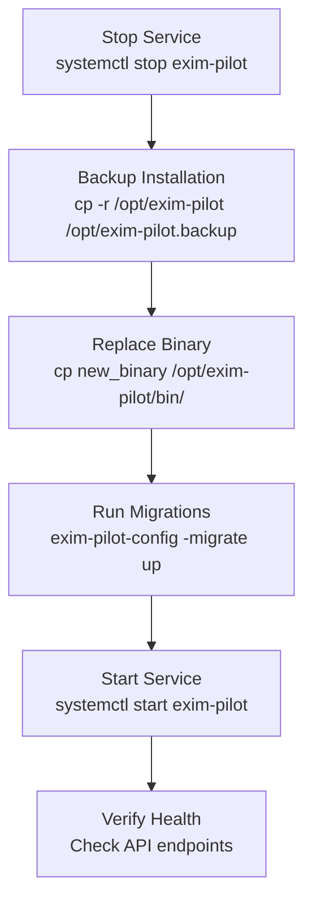
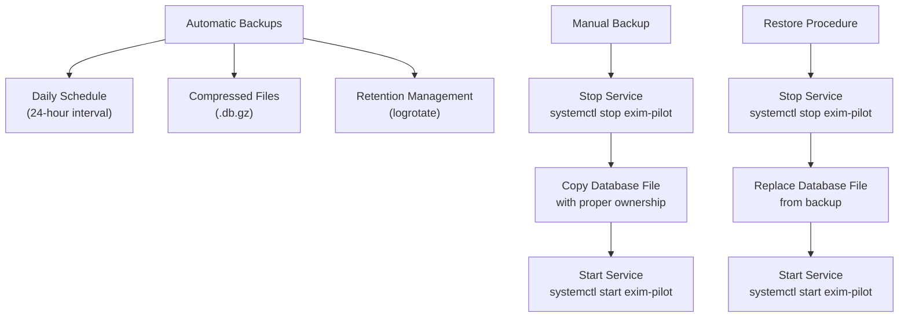
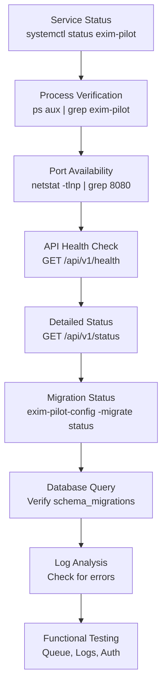

# Upgrades and Maintenance

## Table of Contents
1. [Version Compatibility and Breaking Changes](#version-compatibility-and-breaking-changes)
2. [Upgrade Process](#upgrade-process)
3. [Configuration Management](#configuration-management)
4. [Backup and Restore Procedures](#backup-and-restore-procedures)
5. [Log Rotation Policies](#log-rotation-policies)
6. [Maintenance Checklists](#maintenance-checklists)
7. [Health Verification](#health-verification)

## Version Compatibility and Breaking Changes

The exim-pilot application uses a sequential database migration system to manage schema changes across versions. The current migration system supports six distinct versions, each introducing specific changes to the database schema and application functionality.

Migration version 1 establishes the initial schema with core tables for messages, recipients, delivery attempts, log entries, audit logs, queue snapshots, users, and sessions. Version 2 adds performance-enhancing indexes to all major tables to improve query performance. Version 3 introduces message_notes and message_tags tables for troubleshooting and categorization purposes.

Version 4 represents a significant enhancement by adding system_config, system_status, and login_attempts tables for configuration management, health monitoring, and security auditing. This migration also adds corresponding indexes to support efficient querying of these new tables.

Migration version 5 addresses a schema inconsistency by adding a created_at column to the audit_log table, ensuring consistent timestamp tracking across all audit records. Version 6 implements more comprehensive schema corrections, including adding created_at columns to log_entries and several other tables, renaming columns in the users table (active to is_active, last_login to last_login_at), and adding missing timestamp columns to multiple tables.

Notably, the migration system acknowledges limitations in SQLite's ALTER TABLE capabilities, particularly the inability to drop columns. As documented in the Down migration scripts for versions 5 and 6, rollback procedures cannot fully remove added columns and instead leave them in place for safety, representing a one-way schema evolution for certain changes.

**Section sources**
- [migrations.go](file://internal/database/migrations.go#L1-L733)

## Upgrade Process

The upgrade process for exim-pilot follows a structured sequence of operations designed to minimize service disruption while ensuring data integrity. The process leverages the installation script and configuration management tool to handle binary replacement, schema migration, and service restart.

The upgrade workflow begins with stopping the existing service using systemctl stop exim-pilot. This ensures no active processes are writing to the database during the upgrade. Following service termination, a complete backup of the installation directory is recommended using cp -r /opt/exim-pilot /opt/exim-pilot.backup, preserving the current state for potential rollback.

Binary replacement is performed by copying the new exim-pilot binary to the installation directory's bin folder with proper ownership and permissions: cp exim-pilot /opt/exim-pilot/bin/ followed by chown exim-pilot:exim-pilot /opt/exim-pilot/bin/exim-pilot and chmod 755 /opt/exim-pilot/bin/exim-pilot.

The most critical phase of the upgrade is schema migration, executed using the exim-pilot-config tool with the migrate up command: sudo -u exim-pilot exim-pilot-config -migrate up -config /opt/exim-pilot/config/config.yaml. This command applies all pending database migrations in sequence, automatically detecting the current schema version and applying only the necessary upgrades.

After successful migration, the service is restarted with systemctl start exim-pilot, loading the new binary and updated schema. The entire process is designed to be idempotent, allowing repeated execution without adverse effects if interrupted.

**Diagram sources**
- [install.sh](file://deployments/install.sh#L400-L438)
- [README.md](file://deployments/README.md#L230-L274)

**Section sources**
- [install.sh](file://deployments/install.sh#L400-L438)
- [README.md](file://deployments/README.md#L230-L274)

## Configuration Management

Configuration management in exim-pilot is handled through a YAML configuration file that supports both file-based and environment variable overrides. The primary configuration file, config.yaml, is located in the installation directory's config folder and follows the structure defined in config.example.yaml.

The configuration system provides several key features for upgrade scenarios. During upgrades, existing configuration files are preserved, and new configuration options are introduced through documentation rather than automatic file modification. The exim-pilot-config tool includes a validation function that checks configuration integrity, verifying file paths, permissions, and required services.

Critical configuration sections include server settings (port, host, TLS configuration), database parameters (path, connection limits), Exim integration details (log paths, spool directory), logging configuration (level, file, rotation), data retention policies, security settings, and authentication parameters.

Environment variables can override specific configuration values, allowing deployment-specific settings without modifying the configuration file. Key environment variables include EXIM_PILOT_PORT, EXIM_PILOT_HOST, EXIM_PILOT_DB_PATH, EXIM_PILOT_LOG_LEVEL, EXIM_PILOT_ADMIN_PASSWORD, EXIM_PILOT_SESSION_SECRET, and TLS-related variables.

During upgrades, administrators should review the configuration file for new options or deprecated settings. The configuration validation tool can be run with exim-pilot-config -validate -config /path/to/config.yaml to identify potential issues before restarting the service.

**Section sources**
- [config.example.yaml](file://config/config.example.yaml#L1-L77)
- [main.go](file://cmd/exim-pilot-config/main.go#L200-L343)

## Backup and Restore Procedures

exim-pilot implements a comprehensive backup strategy combining automatic and manual procedures for both configuration and data protection.

Automatic backups are configured through the database settings in config.yaml, with backup_enabled set to true by default and backup_interval set to 24 hours. The system automatically creates compressed backups in the specified backup_path directory, with retention managed by the system's log rotation configuration.

Manual backup procedures provide administrators with immediate control over backup operations. To create a manual backup, execute: sudo -u exim-pilot cp /opt/exim-pilot/data/exim-pilot.db /opt/exim-pilot/backups/manual-backup-$(date +%Y%m%d_%H%M%S).db. This command creates a timestamped backup of the SQLite database while maintaining proper file ownership.

The restore process requires service interruption to ensure data consistency. First, stop the service with systemctl stop exim-pilot. Then, replace the database file with the backup: sudo -u exim-pilot cp /opt/exim-pilot/backups/backup-file.db /opt/exim-pilot/data/exim-pilot.db. Finally, restart the service with systemctl start exim-pilot.

For configuration file protection, administrators should maintain version-controlled copies of config.yaml or use the system's built-in backup of configuration changes. When the installation script detects an existing configuration file, it automatically creates a timestamped backup before overwriting.

**Diagram sources**
- [install.sh](file://deployments/install.sh#L250-L270)
- [README.md](file://deployments/README.md#L126-L181)

**Section sources**
- [install.sh](file://deployments/install.sh#L250-L270)
- [README.md](file://deployments/README.md#L126-L181)

## Log Rotation Policies

The exim-pilot system implements log rotation policies through both application-level configuration and system-level logrotate integration. This dual approach ensures comprehensive log management for both application and system logs.

Application-level log rotation is configured in the logging section of config.yaml, with parameters for max_size (100 MB by default), max_backups (5 files), max_age (30 days), and compression. The application automatically manages its log file according to these settings, creating rotated files when size limits are reached.

System-level log rotation is implemented through a dedicated configuration file at /etc/logrotate.d/exim-pilot, created during installation. This configuration rotates logs daily, keeps 30 rotated files, compresses them, and sends a reload signal to the service after rotation to reopen log files.

The logrotate configuration includes postrotate script that executes systemctl reload exim-pilot, which sends a SIGHUP signal to the application, triggering it to close and reopen its log files. This ensures that log writes continue to the new file after rotation without requiring a full service restart.

Log retention is further managed by the application's background cleanup service, which removes log entries older than the retention period specified in the configuration (log_entries_days, default 90 days). This multi-layered approach prevents log files from consuming excessive disk space while maintaining historical data for troubleshooting and analysis.

**Section sources**
- [install.sh](file://deployments/install.sh#L300-L320)
- [config.example.yaml](file://config/config.example.yaml#L50-L57)

## Maintenance Checklists

Regular maintenance of exim-pilot should follow a structured checklist to ensure system health, data integrity, and optimal performance.

**Daily Maintenance:**
- Verify service status with systemctl status exim-pilot
- Check application logs for errors in /opt/exim-pilot/logs/exim-pilot.log
- Monitor disk space usage, particularly in data and logs directories
- Review system logs with journalctl -u exim-pilot -f for any warnings

**Weekly Maintenance:**
- Verify database backup completion in /opt/exim-pilot/backups/
- Check migration status with exim-pilot-config -migrate status
- Review data retention settings and cleanup effectiveness
- Validate Exim log file accessibility and permissions

**Monthly Maintenance:**
- Perform database optimization using the API endpoint or admin interface
- Review security audit logs for suspicious activity
- Update configuration documentation with any changes
- Test backup restoration procedure on a staging system

**Pre-Upgrade Checklist:**
- Create full backup of installation directory
- Document current configuration settings
- Verify current database schema version
- Schedule maintenance window with stakeholders
- Prepare rollback procedure and verification steps

**Post-Upgrade Checklist:**
- Verify service is running and responsive
- Check application logs for migration-related messages
- Validate database schema version matches expected
- Test critical functionality (queue monitoring, log search)
- Confirm user access and authentication

**Section sources**
- [install.sh](file://deployments/install.sh#L350-L370)
- [README.md](file://deployments/README.md#L181-L230)

## Health Verification

Post-upgrade health verification is critical to ensure the exim-pilot system is functioning correctly after maintenance operations. The application provides multiple endpoints and methods for comprehensive health assessment.

The primary health check endpoint is GET /api/v1/health, which returns basic service availability status. A more detailed system status is available at GET /api/v1/status, providing component-level health information including database connectivity, log processor status, and queue monitor functionality.

Administrators should verify the following health indicators after an upgrade:

1. **Service Status**: Confirm the systemd service is active with systemctl status exim-pilot
2. **Process Verification**: Check that the exim-pilot process is running with the correct user (exim-pilot) using ps aux | grep exim-pilot
3. **Port Availability**: Verify the service is listening on the configured port (default 8080) with netstat -tlnp | grep 8080
4. **Database Connectivity**: Confirm database access by checking the schema_migrations table: sqlite3 /opt/exim-pilot/data/exim-pilot.db "SELECT * FROM schema_migrations ORDER BY version;"
5. **Log Verification**: Check application logs for successful startup messages and absence of migration errors
6. **API Functionality**: Test key API endpoints including authentication, queue retrieval, and log search
7. **Background Services**: Verify that log processing and queue monitoring background services are operational

The exim-pilot-config tool provides a migration status command (exim-pilot-config -migrate status) that displays applied and pending migrations, confirming successful schema updates. This output should show all expected migrations as successfully applied with current timestamps.

**Diagram sources**
- [README.md](file://deployments/README.md#L181-L230)
- [main.go](file://cmd/exim-pilot-config/main.go#L300-L343)

**Section sources**
- [README.md](file://deployments/README.md#L181-L230)
- [main.go](file://cmd/exim-pilot-config/main.go#L300-L343)

**Referenced Files in This Document**   
- [install.sh](file://deployments/install.sh)
- [migrations.go](file://internal/database/migrations.go)
- [main.go](file://cmd/exim-pilot-config/main.go)
- [config.example.yaml](file://config/config.example.yaml)
- [README.md](file://deployments/README.md)