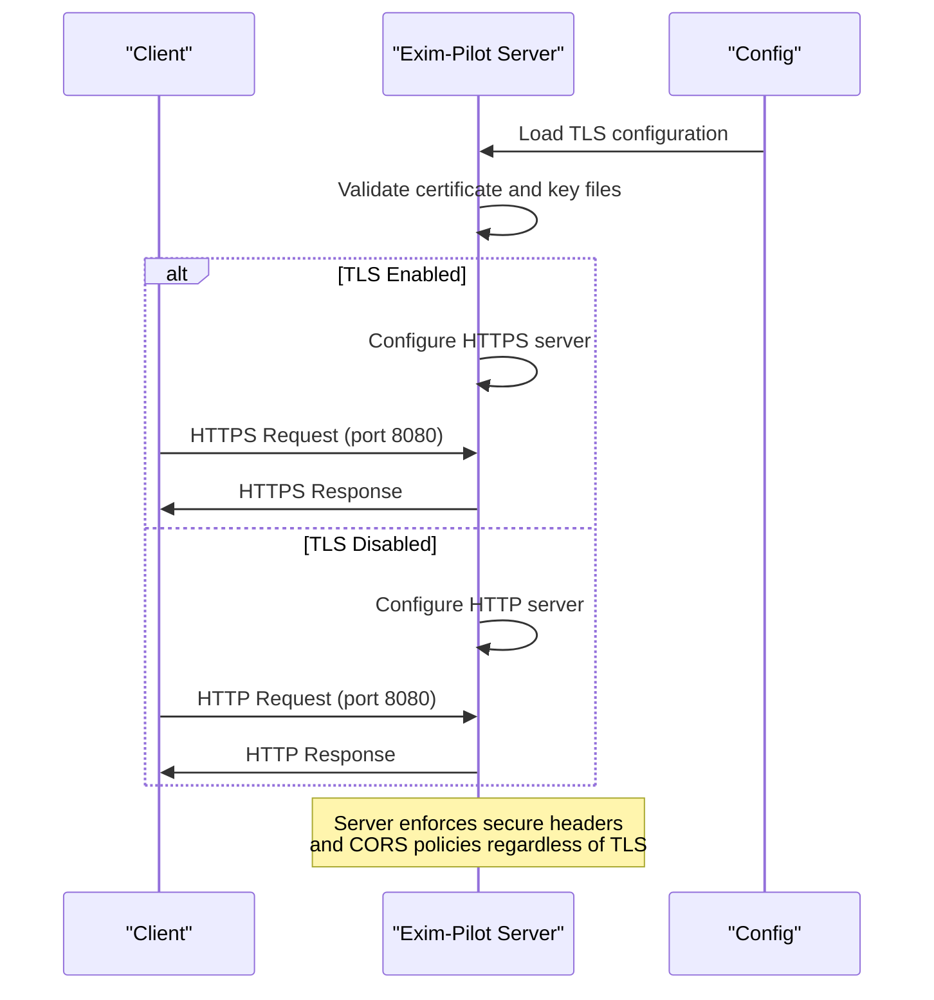
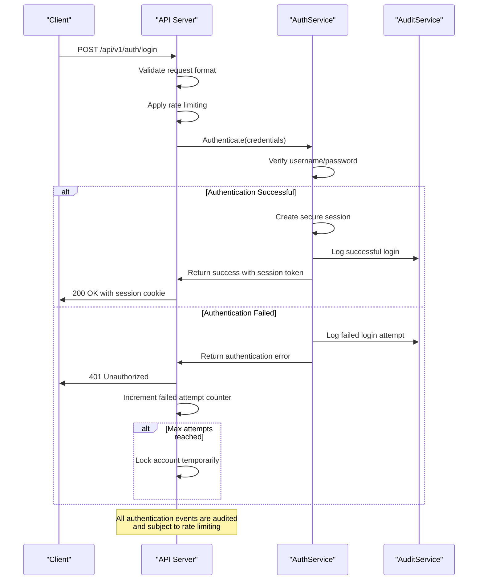
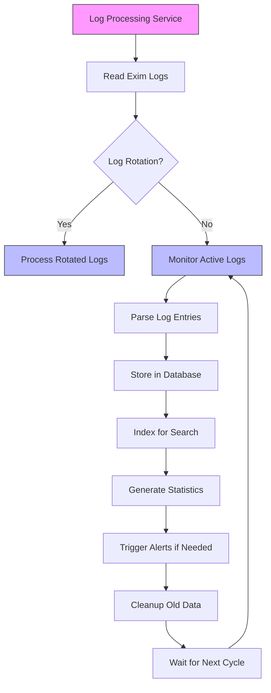
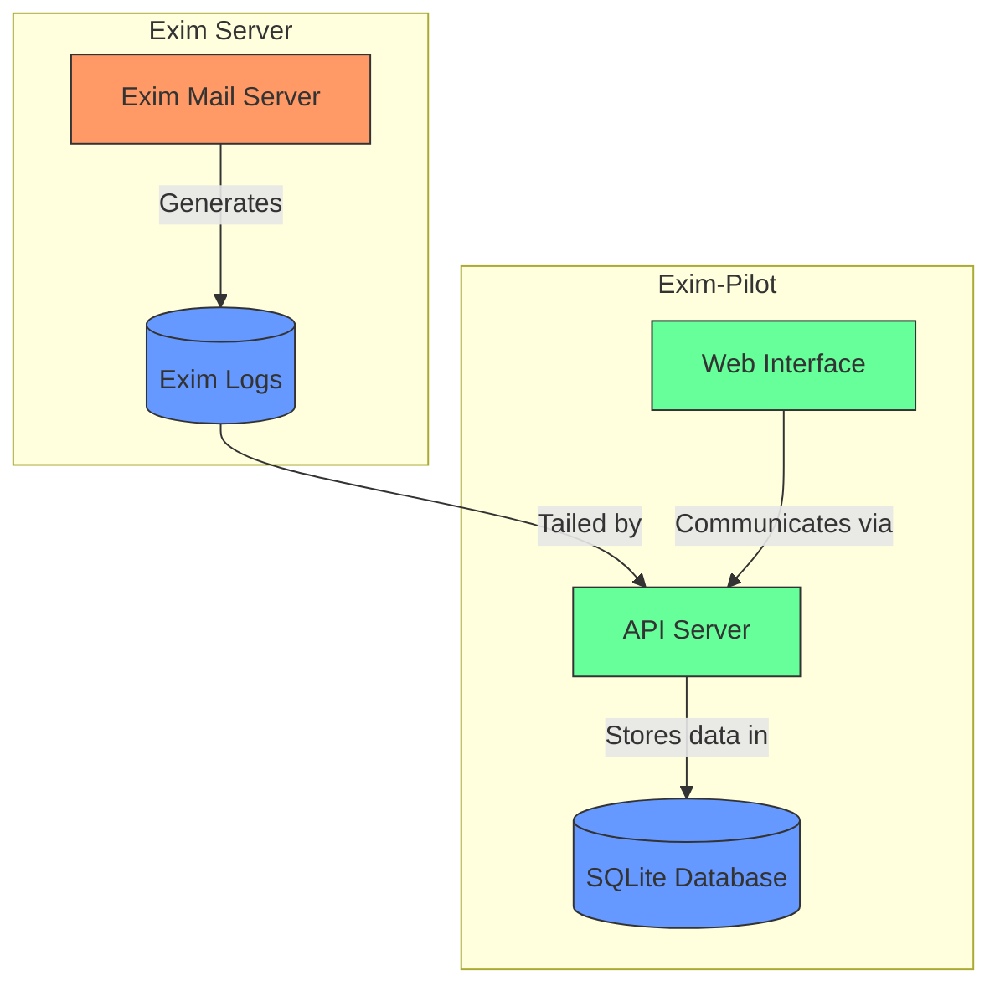
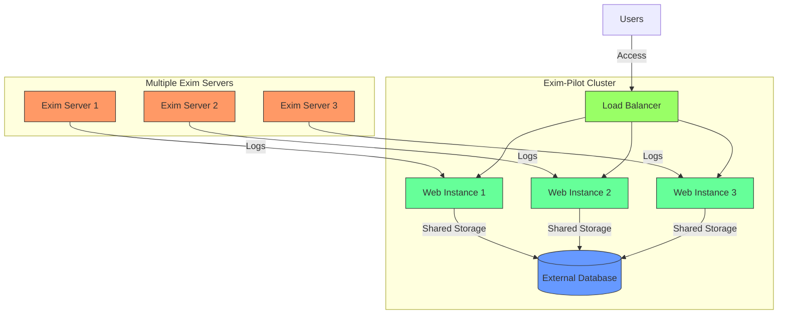

# Security Hardening and Scaling


## Table of Contents
1. [Introduction](#introduction)
2. [User Permission Setup and File Ownership](#user-permission-setup-and-file-ownership)
3. [Network Security and TLS Configuration](#network-security-and-tls-configuration)
4. [Authentication Hardening and Session Management](#authentication-hardening-and-session-management)
5. [Audit Logging and Security Monitoring](#audit-logging-and-security-monitoring)
6. [Performance Tuning and Resource Limits](#performance-tuning-and-resource-limits)
7. [High-Availability and Scaling Patterns](#high-availability-and-scaling-patterns)
8. [Monitoring Integration and Log Rotation](#monitoring-integration-and-log-rotation)
9. [Resource Usage Optimization](#resource-usage-optimization)

## Introduction
Exim-Pilot is a web-based management interface for Exim mail servers on Linux systems, providing real-time queue monitoring, log analysis, deliverability reporting, and message tracing. This document details the security hardening and scaling strategies for deploying Exim-Pilot in production environments. The analysis is based on the application's codebase, configuration structure, and architectural patterns. The system is built with Go for the backend and React/TypeScript for the frontend, following a modular architecture with clear separation of concerns.

## User Permission Setup and File Ownership

Exim-Pilot implements a comprehensive user permission and file ownership model through its configuration and initialization process. The installation and runtime environment are designed to follow the principle of least privilege, with specific user accounts and directory permissions.

The application creates a default admin user during initialization if no users exist in the database. This process is controlled by the `initializeDefaultUser` function in `main.go`, which checks for existing users before creating a new one with credentials defined in the configuration or environment variables.


```go
func initializeDefaultUser(db *database.DB, cfg *config.Config) error {
    authService := auth.NewService(db)
    userRepo := database.NewUserRepository(db)

    // Check if any users exist
    _, err := userRepo.GetByUsername(cfg.Auth.DefaultUsername)
    if err == nil {
        // User already exists
        return nil
    }

    // Use password from config or environment
    password := cfg.Auth.DefaultPassword
    if envPassword := os.Getenv("EXIM_PILOT_ADMIN_PASSWORD"); envPassword != "" {
        password = envPassword
    }

    if password == "" {
        password = "admin123" // Fallback default
        log.Println("Warning: Using fallback default password 'admin123' for admin user. Please change it after first login.")
    }

    _, err = authService.CreateUser(cfg.Auth.DefaultUsername, password, "admin@localhost", "Administrator")
    if err != nil {
        return fmt.Errorf("failed to create default admin user: %w", err)
    }
```


The default configuration specifies a default username of "admin" and password of "admin123", but these can be overridden through environment variables or configuration files. The system enforces password policies including a minimum length of 8 characters and the requirement for strong passwords when `RequireStrongPw` is enabled.

File ownership and directory access controls are established during the application startup process. The database directory is created with permissions 0755 if it doesn't exist, ensuring proper access while maintaining security:


```go
// Create database directory if it doesn't exist
if err := os.MkdirAll(filepath.Dir(cfg.Database.Path), 0755); err != nil {
    log.Fatalf("Failed to create database directory: %v", err)
}
```


Similarly, log directories and configuration directories are created with appropriate permissions during the configuration validation process. The application follows a secure default configuration where sensitive files like TLS certificates and private keys are validated for existence before use.

**Section sources**
- [main.go](file://cmd/exim-pilot/main.go#L200-L232)
- [config.go](file://internal/config/config.go#L400-L479)

## Network Security and TLS Configuration

Exim-Pilot provides robust network security features with configurable TLS support, CORS policies, and secure communication protocols. The network configuration is managed through the `ServerConfig` structure in the configuration system.

### Port Configuration and Firewall Considerations

The server configuration allows customization of the listening port and host interface:


```go
type ServerConfig struct {
    Port           int      `yaml:"port" json:"port"`
    Host           string   `yaml:"host" json:"host"`
    ReadTimeout    int      `yaml:"read_timeout" json:"read_timeout"`
    WriteTimeout   int      `yaml:"write_timeout" json:"write_timeout"`
    IdleTimeout    int      `yaml:"idle_timeout" json:"idle_timeout"`
    AllowedOrigins []string `yaml:"allowed_origins" json:"allowed_origins"`
    LogRequests    bool     `yaml:"log_requests" json:"log_requests"`
    TLSEnabled     bool     `yaml:"tls_enabled" json:"tls_enabled"`
    TLSCertFile    string   `yaml:"tls_cert_file" json:"tls_cert_file"`
    TLSKeyFile     string   `yaml:"tls_key_file" json:"tls_key_file"`
}
```


By default, the server listens on port 8080 on all interfaces (0.0.0.0). In production environments, it's recommended to bind to specific interfaces and use firewall rules to restrict access. The application should be deployed behind a reverse proxy or load balancer in most production scenarios.

### TLS Setup and HTTPS Configuration

TLS is disabled by default but can be enabled through configuration. When TLS is enabled, the server validates that both certificate and key files are specified and exist on the filesystem:


```go
if c.Server.TLSEnabled {
    if c.Server.TLSCertFile == "" || c.Server.TLSKeyFile == "" {
        return fmt.Errorf("TLS enabled but cert or key file not specified")
    }

    if _, err := os.Stat(c.Server.TLSCertFile); os.IsNotExist(err) {
        return fmt.Errorf("TLS cert file not found: %s", c.Server.TLSCertFile)
    }

    if _, err := os.Stat(c.Server.TLSKeyFile); os.IsNotExist(err) {
        return fmt.Errorf("TLS key file not found: %s", c.Server.TLSKeyFile)
    }
}
```


The server implementation in `server.go` uses the standard Go HTTP server with TLS configuration:





**Diagram sources**
- [config.go](file://internal/config/config.go#L20-L45)
- [server.go](file://internal/api/server.go#L1-L275)

**Section sources**
- [config.go](file://internal/config/config.go#L20-L45)
- [server.go](file://internal/api/server.go#L1-L275)

## Authentication Hardening and Session Management

Exim-Pilot implements a comprehensive authentication system with multiple security controls to prevent common attacks and ensure secure user sessions.

### Authentication Mechanism

The authentication system is implemented in the `auth` package and integrated into the API server through middleware. The system uses secure session management with configurable session secrets and timeouts.

Key security features include:

- **Session timeout**: Configurable session timeout (default 60 minutes)
- **Secure cookies**: Cookies marked as secure when HTTPS is enabled
- **CSRF protection**: Built-in CSRF protection for form submissions
- **Login attempt limiting**: Protection against brute force attacks
- **Password policies**: Minimum length and strength requirements


```go
type SecurityConfig struct {
    SessionTimeout   int      `yaml:"session_timeout" json:"session_timeout"`
    MaxLoginAttempts int      `yaml:"max_login_attempts" json:"max_login_attempts"`
    LoginLockoutTime int      `yaml:"login_lockout_time" json:"login_lockout_time"`
    CSRFProtection   bool     `yaml:"csrf_protection" json:"csrf_protection"`
    SecureCookies    bool     `yaml:"secure_cookies" json:"secure_cookies"`
    ContentRedaction bool     `yaml:"content_redaction" json:"content_redaction"`
    AuditAllActions  bool     `yaml:"audit_all_actions" json:"audit_all_actions"`
    TrustedProxies   []string `yaml:"trusted_proxies" json:"trusted_proxies"`
}

type AuthConfig struct {
    DefaultUsername string `yaml:"default_username" json:"default_username"`
    DefaultPassword string `yaml:"default_password" json:"default_password"`
    PasswordMinLen  int    `yaml:"password_min_length" json:"password_min_length"`
    RequireStrongPw bool   `yaml:"require_strong_password" json:"require_strong_password"`
    SessionSecret   string `yaml:"session_secret" json:"session_secret"`
}
```


The system generates a cryptographically secure session secret if one is not provided in the configuration:


```go
// Generate session secret if not provided
if c.Auth.SessionSecret == "" {
    c.Auth.SessionSecret = generateSessionSecret()
}
```


### Authentication Flow

The authentication flow follows a secure pattern with proper error handling and audit logging:





**Diagram sources**
- [config.go](file://internal/config/config.go#L130-L150)
- [auth_handlers.go](file://internal/api/auth_handlers.go#L1-L100)
- [middleware.go](file://internal/api/middleware.go#L1-L50)

**Section sources**
- [config.go](file://internal/config/config.go#L130-L150)
- [auth_handlers.go](file://internal/api/auth_handlers.go#L1-L100)

## Audit Logging and Security Monitoring

Exim-Pilot includes comprehensive audit logging capabilities to track security-relevant events and user actions within the system.

### Audit Service Implementation

The audit service is implemented as a dedicated component that logs all significant actions. The configuration allows for comprehensive auditing of all actions:


```go
type SecurityConfig struct {
    AuditAllActions bool `yaml:"audit_all_actions" json:"audit_all_actions"`
}
```


When `AuditAllActions` is enabled (default), all user actions are logged to the audit system. The audit logs are retained for 365 days by default, providing a long-term security history.

### Audit Middleware

The API server implements audit logging through middleware that captures events before they reach the business logic:


```go
// Audit logging middleware (after validation, before auth)
s.router.Use(s.auditMiddleware)
```


This ensures that all authenticated requests are properly audited, including the user identity, timestamp, endpoint accessed, and action performed.

### Security Monitoring

The system includes several security monitoring features:

- **Failed login tracking**: Records failed login attempts with IP addresses
- **Session management**: Tracks active sessions and enforces timeouts
- **Content redaction**: Optionally redacts sensitive content in logs
- **Trusted proxies**: Supports configuration of trusted proxy servers for proper IP address handling

The audit logs are stored in the database with appropriate retention policies and can be queried through the API for security analysis and compliance reporting.

**Section sources**
- [config.go](file://internal/config/config.go#L145)
- [service.go](file://internal/audit/service.go#L1-L50)
- [middleware.go](file://internal/api/middleware.go#L1-L50)

## Performance Tuning and Resource Limits

Exim-Pilot includes several configuration options for performance tuning and resource management to ensure stable operation under various load conditions.

### Database Configuration

The database configuration allows tuning of connection pool parameters to optimize performance and resource usage:


```go
type DatabaseConfig struct {
    Path            string `yaml:"path" json:"path"`
    MaxOpenConns    int    `yaml:"max_open_conns" json:"max_open_conns"`
    MaxIdleConns    int    `yaml:"max_idle_conns" json:"max_idle_conns"`
    ConnMaxLifetime int    `yaml:"conn_max_lifetime" json:"conn_max_lifetime"`
    BackupEnabled   bool   `yaml:"backup_enabled" json:"backup_enabled"`
    BackupInterval  int    `yaml:"backup_interval" json:"backup_interval"`
    BackupPath      string `yaml:"backup_path" json:"backup_path"`
}
```


Default values are set to reasonable defaults:
- Max open connections: 25
- Max idle connections: 5
- Connection maximum lifetime: 5 minutes

These values can be adjusted based on the expected load and database server capabilities.

### HTTP Server Timeouts

The server configuration includes timeouts for various stages of request processing:


```go
type ServerConfig struct {
    ReadTimeout  int `yaml:"read_timeout" json:"read_timeout"`
    WriteTimeout int `yaml:"write_timeout" json:"write_timeout"`
    IdleTimeout  int `yaml:"idle_timeout" json:"idle_timeout"`
}
```


Default timeouts:
- Read timeout: 15 seconds
- Write timeout: 15 seconds
- Idle timeout: 60 seconds

These timeouts prevent resource exhaustion from slow clients and ensure that connections are properly cleaned up.

### Log Processing Optimization

The log processing service is configured with default settings optimized for performance:


```go
// Initialize log processing service
logConfig := logprocessor.DefaultServiceConfig()
logService := logprocessor.NewService(repository, logConfig)
```


The log processor handles large volumes of Exim log data efficiently, with capabilities for searching, correlation, and real-time monitoring.





**Diagram sources**
- [logprocessor.go](file://internal/logprocessor/service.go#L1-L100)
- [config.go](file://internal/config/config.go#L60-L75)

**Section sources**
- [config.go](file://internal/config/config.go#L60-L75)
- [logprocessor.go](file://internal/logprocessor/service.go#L1-L100)

## High-Availability and Scaling Patterns

Exim-Pilot can be deployed in high-availability configurations and scaled to handle large mail server environments.

### Single-Instance Deployment

For smaller deployments, Exim-Pilot can run as a single instance with the following architecture:





**Diagram sources**
- [main.go](file://cmd/exim-pilot/main.go#L1-L233)
- [server.go](file://internal/api/server.go#L1-L275)

### High-Availability Deployment

For production environments requiring high availability, Exim-Pilot can be deployed with external database support and load balancing:





**Diagram sources**
- [config.go](file://internal/config/config.go#L40-L55)
- [database.go](file://internal/database/connection.go#L1-L100)

### Scaling Considerations

Key scaling parameters that can be tuned for large deployments:

- **Database connection pool**: Increase `MaxOpenConns` for high-concurrency environments
- **Log processing**: Adjust log processing frequency based on log volume
- **Retention policies**: Tune data retention periods based on storage capacity
- **Backup configuration**: Schedule backups during off-peak hours

The system supports environment variable overrides for all configuration settings, enabling easy configuration management in containerized environments.

**Section sources**
- [config.go](file://internal/config/config.go#L40-L55)
- [database.go](file://internal/database/connection.go#L1-L100)

## Monitoring Integration and Log Rotation

Exim-Pilot includes comprehensive monitoring capabilities and log management features for production deployments.

### Health Check Endpoint

The system provides a health check endpoint for monitoring and orchestration systems:


```go
// Health check endpoint (no auth required)
api.HandleFunc("/health", s.handleHealth).Methods("GET")
```


This endpoint returns the server status and can be used by load balancers and monitoring tools to determine service availability.

### Log Rotation Strategy

The application implements a robust log rotation strategy for both application logs and system logs:


```go
type LoggingConfig struct {
    Level      string `yaml:"level" json:"level"`
    File       string `yaml:"file" json:"file"`
    MaxSize    int    `yaml:"max_size" json:"max_size"`
    MaxBackups int    `yaml:"max_backups" json:"max_backups"`
    MaxAge     int    `yaml:"max_age" json:"max_age"`
    Compress   bool   `yaml:"compress" json:"compress"`
}
```


Default log rotation settings:
- Maximum log file size: 100 MB
- Maximum backup files: 5
- Maximum log age: 30 days
- Compression: Enabled

These settings prevent log files from consuming excessive disk space while maintaining sufficient history for troubleshooting.

### Monitoring Integration Points

The system provides several integration points for external monitoring:

1. **Health endpoint**: `/api/v1/health` - Returns server status
2. **Metrics endpoints**: Various statistics endpoints for queue, logs, and performance
3. **Log output**: Structured logging that can be ingested by log management systems
4. **Audit logs**: Comprehensive security event logging

The log processor service continuously monitors Exim logs and can trigger alerts based on configurable patterns, providing proactive monitoring of mail server issues.

**Section sources**
- [server.go](file://internal/api/server.go#L1-L275)
- [config.go](file://internal/config/config.go#L80-L95)
- [logprocessor.go](file://internal/logprocessor/service.go#L1-L100)

## Resource Usage Optimization

Exim-Pilot includes several features and configuration options to optimize resource usage in large-scale deployments.

### Data Retention Policies

The system implements configurable data retention policies to balance storage requirements with historical data needs:


```go
type RetentionConfig struct {
    LogEntriesDays      int `yaml:"log_entries_days" json:"log_entries_days"`
    AuditLogDays        int `yaml:"audit_log_days" json:"audit_log_days"`
    QueueSnapshotsDays  int `yaml:"queue_snapshots_days" json:"queue_snapshots_days"`
    DeliveryAttemptDays int `yaml:"delivery_attempt_days" json:"delivery_attempt_days"`
    CleanupInterval     int `yaml:"cleanup_interval" json:"cleanup_interval"`
}
```


Default retention periods:
- Log entries: 90 days
- Audit logs: 365 days
- Queue snapshots: 30 days
- Delivery attempts: 180 days
- Cleanup interval: 24 hours

The cleanup process runs periodically to remove expired data, maintaining database performance and controlling storage growth.

### Database Optimization

The database package includes optimization features for performance at scale:


```go
// Database optimization functions
package database

func (r *Repository) OptimizeDatabase() error {
    // Execute VACUUM and ANALYZE commands
    // Update statistics for query planner
    // Reclaim unused space
    return nil
}
```


For large deployments, the system can be configured to use external database servers instead of the default SQLite database, providing better performance and scalability.

### Memory and CPU Efficiency

The application is designed to be efficient in its resource usage:

- **Goroutine management**: Proper use of goroutines for concurrent operations
- **Connection pooling**: Efficient database connection reuse
- **Caching**: Strategic caching of frequently accessed data
- **Streaming**: Processing of large log files in chunks rather than loading entirely into memory

The log processor uses streaming to handle large log files efficiently, preventing memory exhaustion when processing extensive mail server logs.


**Diagram sources**
- [logprocessor.go](file://internal/logprocessor/service.go#L1-L100)
- [database.go](file://internal/database/optimization.go#L1-L50)

**Section sources**
- [config.go](file://internal/config/config.go#L100-L120)
- [logprocessor.go](file://internal/logprocessor/service.go#L1-L100)
- [database.go](file://internal/database/optimization.go#L1-L50)

**Referenced Files in This Document**   
- [main.go](file://cmd/exim-pilot/main.go)
- [config.go](file://internal/config/config.go)
- [server.go](file://internal/api/server.go)
- [auth_handlers.go](file://internal/api/auth_handlers.go)
- [middleware.go](file://internal/api/middleware.go)
- [service.go](file://internal/audit/service.go)
- [database.go](file://internal/database/connection.go)
- [logprocessor.go](file://internal/logprocessor/service.go)