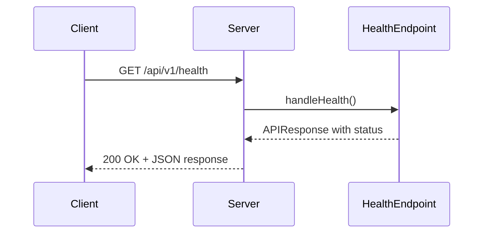
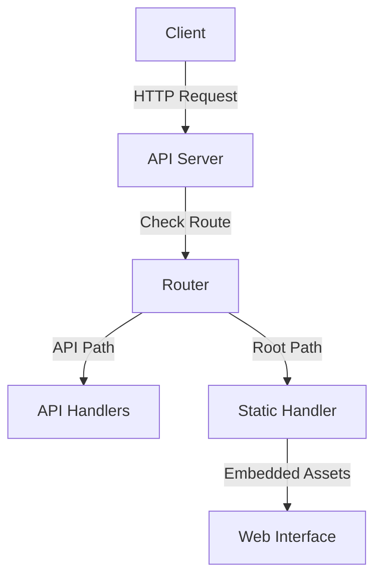
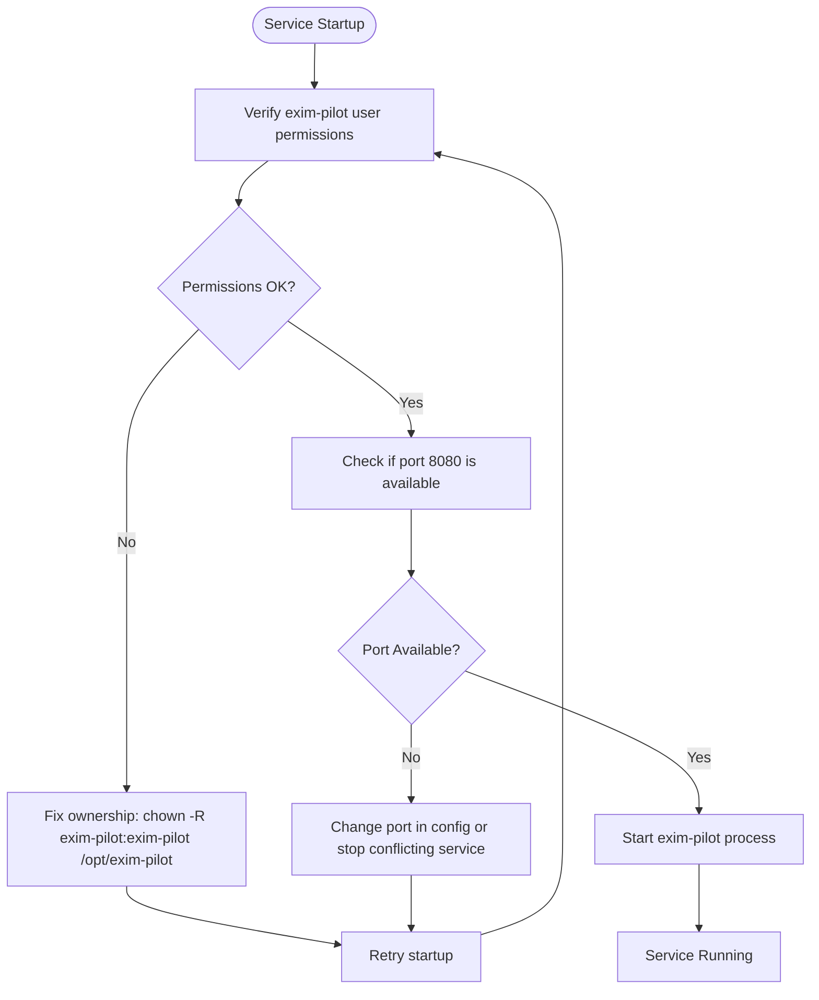
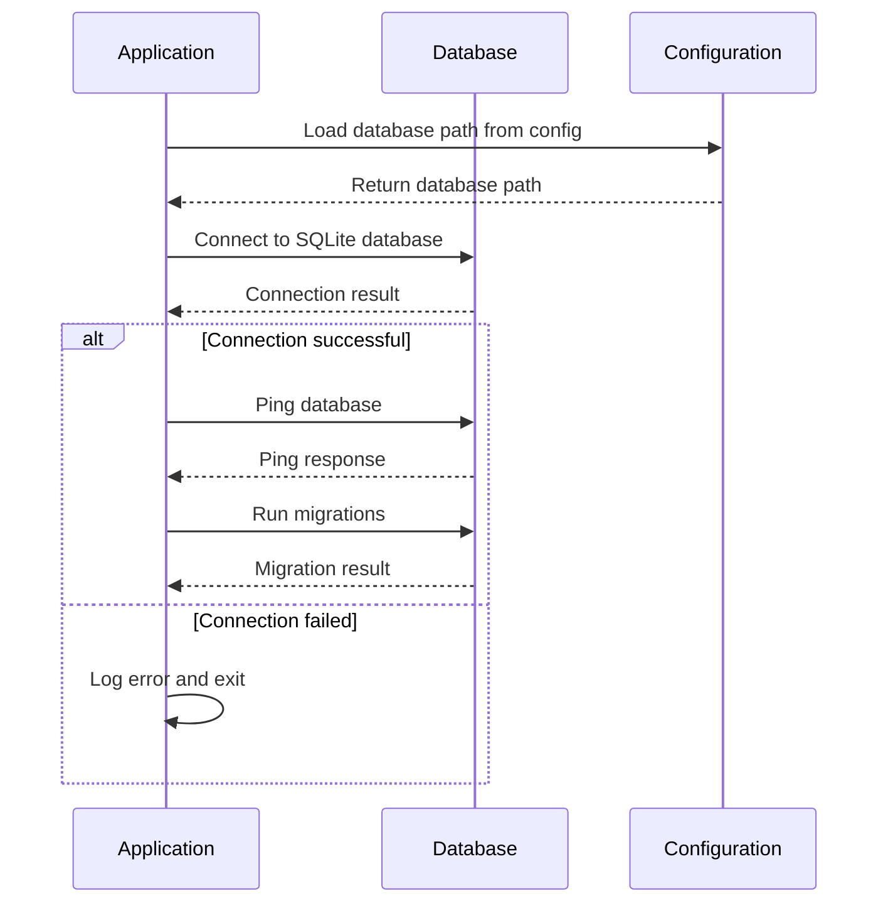
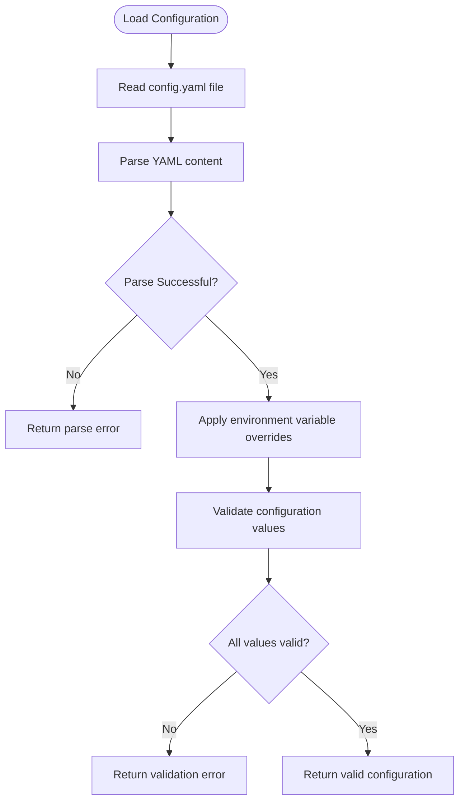

# Post-Deployment Verification and Troubleshooting


## Table of Contents
1. [Post-Installation Verification](#post-installation-verification)
2. [Troubleshooting Common Issues](#troubleshooting-common-issues)
3. [Service Startup Failures](#service-startup-failures)
4. [Database Connection Errors](#database-connection-errors)
5. [Configuration Parsing Issues](#configuration-parsing-issues)
6. [Permission Denied Errors](#permission-denied-errors)
7. [Log Analysis Techniques](#log-analysis-techniques)

## Post-Installation Verification

After successful deployment of Exim-Pilot, several verification steps should be performed to confirm proper operation of all system components.

### Service Status Check

The Exim-Pilot service is managed through systemd. Verify the service status using:


```bash
systemctl status exim-pilot
```


A healthy service will show "active (running)" status. The installation script automatically enables the service to start on boot and initiates it immediately after installation.

**Section sources**
- [install.sh](file://deployments/install.sh#L380-L390)

### API Health Endpoint Testing

The system provides a health check endpoint at `/api/v1/health` that returns basic system status information. Test this endpoint using curl:


```bash
curl http://localhost:8080/api/v1/health
```


Expected response:

```json
{
  "success": true,
  "data": {
    "status": "healthy",
    "timestamp": "2023-12-07T15:30:45Z",
    "version": "1.0.0"
  }
}
```


The health endpoint does not require authentication and is accessible without login.





**Diagram sources**
- [server.go](file://internal/api/server.go#L150-L158)

**Section sources**
- [server.go](file://internal/api/server.go#L150-L158)

### Web Interface Accessibility

The web interface should be accessible via browser at the configured address (default: `http://localhost:8080`). After installation, access the interface and verify:

1. Login page loads correctly
2. Default credentials (admin/admin123) allow login
3. Dashboard displays without errors
4. Navigation between sections works properly

The web interface is embedded within the binary and served through the API server's static file routing.





**Diagram sources**
- [server.go](file://internal/api/server.go#L250-L258)

**Section sources**
- [server.go](file://internal/api/server.go#L250-L258)

### Log File Validation

Verify that the application is writing logs to the configured location. By default, logs are written to `/opt/exim-pilot/logs/exim-pilot.log`.

Check log file existence and recent entries:

```bash
tail /opt/exim-pilot/logs/exim-pilot.log
```


Expected log entries include:
- Server startup messages
- Database connection confirmation
- Successful service initialization
- HTTP request logging (if enabled)

The log rotation is configured through logrotate at `/etc/logrotate.d/exim-pilot` to rotate logs daily and keep 30 days of history.

**Section sources**
- [install.sh](file://deployments/install.sh#L330-L345)

## Troubleshooting Common Issues

This section provides guidance for diagnosing and resolving common problems encountered after deployment.

## Service Startup Failures

Service startup failures are typically indicated by systemd showing the service as failed or inactive.

### Diagnostic Commands

Check service status:

```bash
systemctl status exim-pilot
```


View recent service logs:

```bash
journalctl -u exim-pilot -n 100
```


Check if the port is already in use:

```bash
netstat -tlnp | grep :8080
```


### Common Causes and Solutions

**Service fails to start with permission errors:**
- Ensure the `exim-pilot` user and group exist
- Verify directory ownership: `chown -R exim-pilot:exim-pilot /opt/exim-pilot`
- Check that the user has appropriate permissions

**Port already in use:**
- Change the port in the configuration file
- Stop the conflicting service using the port
- Configure the firewall to allow the required port





**Section sources**
- [install.sh](file://deployments/install.sh#L270-L285)

## Database Connection Errors

Database connection issues prevent the application from storing and retrieving data.

### Diagnostic Commands

Verify database file existence:

```bash
ls -la /opt/exim-pilot/data/exim-pilot.db
```


Check database directory permissions:

```bash
ls -la /opt/exim-pilot/data/
```


Test database connectivity from the application:

```bash
/opt/exim-pilot/bin/exim-pilot --migrate-up --config /opt/exim-pilot/config/config.yaml
```


### Common Causes and Solutions

**Database file not found:**
- Ensure the data directory exists: `mkdir -p /opt/exim-pilot/data`
- Verify the path in the configuration file matches the actual location
- Check that the exim-pilot user has write permissions to the directory

**Database migration failures:**
- Run migrations manually: `exim-pilot --migrate-up --config /path/to/config.yaml`
- Check for syntax errors in migration files
- Ensure the database file is not corrupted





**Diagram sources**
- [connection.go](file://internal/database/connection.go#L45-L70)
- [main.go](file://cmd/exim-pilot/main.go#L65-L80)

**Section sources**
- [connection.go](file://internal/database/connection.go#L45-L70)
- [main.go](file://cmd/exim-pilot/main.go#L65-L80)

## Configuration Parsing Issues

Configuration parsing problems occur when the system cannot read or interpret the configuration file correctly.

### Diagnostic Commands

Validate configuration file syntax:

```bash
yamllint /opt/exim-pilot/config/config.yaml
```


Test configuration loading:

```bash
cat /opt/exim-pilot/config/config.yaml | yq .
```


Check for environment variable conflicts:

```bash
printenv | grep EXIM_PILOT
```


### Common Causes and Solutions

**Invalid YAML syntax:**
- Use a YAML validator to check for syntax errors
- Ensure proper indentation (spaces, not tabs)
- Quote strings containing special characters
- Verify that all required fields are present

**Missing required configuration values:**
- Ensure the configuration file contains all required sections
- Verify that paths exist and are accessible
- Confirm that port numbers are within valid range (1-65535)

**Environment variable conflicts:**
- Check for environment variables that override configuration
- Ensure environment variables have correct format
- Remove conflicting environment variables if necessary





**Diagram sources**
- [config.go](file://internal/config/config.go#L200-L480)

**Section sources**
- [config.go](file://internal/config/config.go#L200-L480)

## Permission Denied Errors

Permission issues commonly occur when the exim-pilot user lacks necessary access rights.

### Diagnostic Commands

Check file and directory ownership:

```bash
ls -la /opt/exim-pilot/
```


Verify user group membership:

```bash
groups exim-pilot
```


Check specific file permissions:

```bash
namei -l /opt/exim-pilot/config/config.yaml
```


### Common Causes and Solutions

**Application cannot read configuration file:**
- Ensure the file is owned by exim-pilot:exim-pilot
- Set appropriate permissions: `chmod 640 /opt/exim-pilot/config/config.yaml`
- Verify the directory has execute permission for the user

**Cannot access Exim log files:**
- Add exim-pilot user to adm group: `usermod -a -G adm exim-pilot`
- Ensure log directories have read permissions
- Verify the installation script configured permissions correctly

**Cannot write to data or log directories:**
- Confirm directory ownership: `chown -R exim-pilot:exim-pilot /opt/exim-pilot/data`
- Set proper directory permissions: `chmod 750 /opt/exim-pilot/data`
- Ensure the parent directory structure allows traversal


```mermaid
graph TD
User[exim-pilot user] --> |Must be in| Group[adm group]
User --> |Owns| AppDir[/opt/exim-pilot]
AppDir --> |Contains| ConfigDir[config/]
AppDir --> |Contains| DataDir[data/]
AppDir --> |Contains| LogsDir[logs/]
AppDir --> |Contains| BinDir[bin/]
ConfigDir --> |Permissions| ConfigPerm[640]
DataDir --> |Permissions| DataPerm[750]
LogsDir --> |Permissions| LogsPerm[750]
BinDir --> |Permissions| BinPerm[755]
System --> |Contains| EximLogs[/var/log/exim4]
EximLogs --> |Accessible to| Group
style User fill:#f9f,stroke:#333
style Group fill:#bbf,stroke:#333
style AppDir fill:#ffd,stroke:#333
```


**Diagram sources**
- [install.sh](file://deployments/install.sh#L285-L305)

**Section sources**
- [install.sh](file://deployments/install.sh#L285-L305)

## Log Analysis Techniques

Effective log analysis is crucial for diagnosing issues and understanding system behavior.

### Key Log Messages to Monitor

**Startup sequence:**
- "Starting API server on X:X"
- "Database initialized"
- "Log service started"
- "Server exited"

**Error patterns:**
- "Failed to connect to database"
- "Configuration validation failed"
- "Permission denied"
- "File not found"

**Operational messages:**
- HTTP request logging (when enabled)
- Database migration messages
- Scheduled task execution
- Authentication attempts

### Recovery Procedures

For configuration issues:
1. Restore from backup: `cp config.yaml.backup.* config.yaml`
2. Validate YAML syntax
3. Restart service: `systemctl restart exim-pilot`

For database issues:
1. Check file permissions and ownership
2. Verify disk space availability
3. Restore from backup if available
4. Re-run migrations if schema is missing

For service issues:
1. Check systemd status and logs
2. Verify port availability
3. Restart the service
4. Reboot the system if necessary

**Section sources**
- [install.sh](file://deployments/install.sh#L400-L430)
- [main.go](file://cmd/exim-pilot/main.go#L150-L200)

**Referenced Files in This Document**   
- [install.sh](file://deployments/install.sh#L1-L438)
- [server.go](file://internal/api/server.go#L1-L275)
- [connection.go](file://internal/database/connection.go#L1-L91)
- [config.go](file://internal/config/config.go#L1-L480)
- [main.go](file://cmd/exim-pilot/main.go#L1-L233)