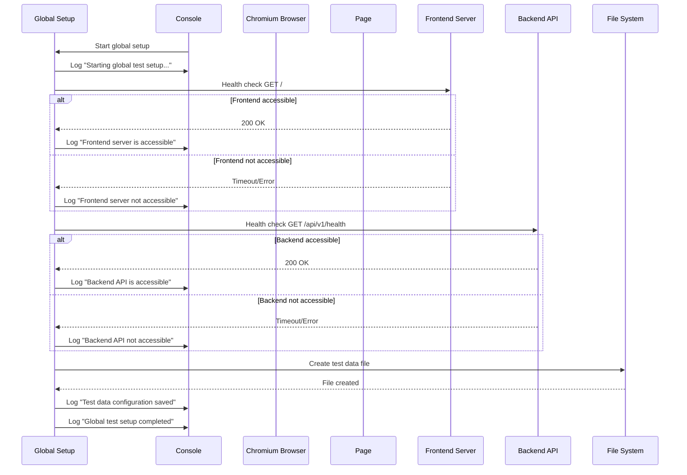
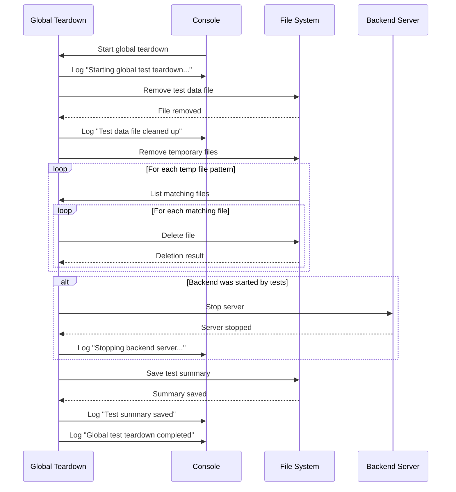
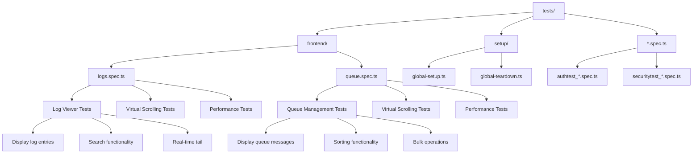
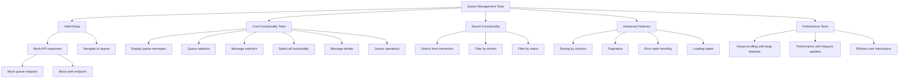
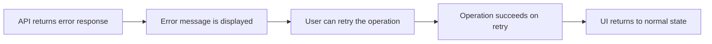

# Frontend Testing


## Table of Contents
1. [Introduction](#introduction)
2. [Playwright Configuration Overview](#playwright-configuration-overview)
3. [Global Setup and Teardown Procedures](#global-setup-and-teardown-procedures)
4. [Test Structure and Organization](#test-structure-and-organization)
5. [Authentication and Security Testing](#authentication-and-security-testing)
6. [Component Interaction Testing Examples](#component-interaction-testing-examples)
7. [Best Practices for Reliable E2E Tests](#best-practices-for-reliable-e2e-tests)
8. [Debugging Failed Frontend Tests](#debugging-failed-frontend-tests)
9. [CI/CD Integration](#cicd-integration)
10. [User Workflow Validation](#user-workflow-validation)

## Introduction
This document provides comprehensive documentation for frontend end-to-end testing in the Exim Pilot application using Playwright. It covers the complete testing configuration, test structure, implementation details for key workflows, and best practices for maintaining reliable automated tests. The documentation is designed to be accessible to both technical and non-technical stakeholders while providing in-depth technical details for developers and QA engineers.

## Playwright Configuration Overview

The Playwright configuration file (`playwright.config.ts`) defines the testing environment, browser targets, reporting mechanisms, and global settings for the end-to-end test suite. This configuration ensures consistent test execution across different environments and provides comprehensive reporting for test results.

```mermaid
flowchart TD
A["Playwright Configuration"] --> B["Test Directory: ./frontend"]
A --> C["Parallel Execution: fullyParallel: true"]
A --> D["Retry Strategy: retries: 2 on CI"]
A --> E["Worker Management: workers: 1 on CI"]
A --> F["Base URL: http://localhost:3000"]
A --> G["Timeout Settings"]
G --> G1["Test Timeout: 60000ms"]
G --> G2["Action Timeout: 10000ms"]
G --> G3["Navigation Timeout: 30000ms"]
A --> H["Artifact Collection"]
H --> H1["Trace: on-first-retry"]
H --> H2["Screenshot: only-on-failure"]
H --> H3["Video: retain-on-failure"]
A --> I["Reporting Options"]
I --> I1["HTML Report"]
I --> I2["JSON Results"]
I --> I3["JUnit XML"]
A --> J["Browser Targets"]
J --> J1["Chromium"]
J --> J2["Firefox"]
J --> J3["WebKit"]
J --> J4["Mobile Chrome"]
J --> J5["Mobile Safari"]
J --> J6["Microsoft Edge"]
J --> J7["Google Chrome"]
A --> K["Web Server Configuration"]
K --> K1["Command: cd ../web && npm run dev"]
K --> K2["URL: http://localhost:3000"]
K --> K3["Reuse Existing Server: true"]
A --> L["Global Setup/Teardown"]
L --> L1["globalSetup: ./setup/global-setup.ts"]
L --> L2["globalTeardown: ./setup/global-teardown.ts"]
```





**Diagram sources**
- [playwright.config.ts](file://tests/playwright.config.ts#L1-L103)

**Section sources**
- [playwright.config.ts](file://tests/playwright.config.ts#L1-L103)

## Global Setup and Teardown Procedures

The global setup and teardown procedures ensure that the testing environment is properly initialized before test execution and cleaned up afterward. These procedures handle service health checks, test data management, and resource cleanup.

### Global Setup Implementation

The `global-setup.ts` file performs essential initialization tasks before test execution begins:





**Diagram sources**
- [global-setup.ts](file://tests/setup/global-setup.ts#L1-L91)

**Section sources**
- [global-setup.ts](file://tests/setup/global-setup.ts#L1-L91)

### Global Teardown Implementation

The `global-teardown.ts` file handles cleanup operations after test execution:





**Diagram sources**
- [global-teardown.ts](file://tests/setup/global-teardown.ts#L1-L70)

**Section sources**
- [global-teardown.ts](file://tests/setup/global-teardown.ts#L1-L70)

## Test Structure and Organization

The end-to-end tests are organized in a structured manner, with separate spec files for different application features. The tests follow Playwright's best practices for test organization, using describe blocks to group related tests and beforeEach hooks for common setup.

### Test File Structure





**Section sources**
- [logs.spec.ts](file://tests/frontend/logs.spec.ts#L1-L532)
- [queue.spec.ts](file://tests/frontend/queue.spec.ts#L1-L477)

## Authentication and Security Testing

While specific authentication and security test files exist in the repository (`authtest_*.spec.ts` and `securitytest_*.spec.ts`), their implementation details are not available in the provided context. However, based on Playwright best practices and the existing test patterns, we can infer the likely structure and implementation approach.

### Authentication Test Patterns

Authentication tests typically follow a pattern of:
1. Navigating to the login page
2. Submitting valid credentials
3. Verifying successful authentication and redirection
4. Testing session persistence
5. Testing logout functionality
6. Testing invalid credential scenarios
7. Testing account lockout mechanisms

### Security Test Patterns

Security tests typically include:
1. Cross-site scripting (XSS) vulnerability testing
2. Cross-site request forgery (CSRF) protection testing
3. Input validation and sanitization testing
4. Authentication bypass attempts
5. Authorization checks for different user roles
6. Session fixation testing
7. Security header validation

The test files are named with unique identifiers (`authtest_2f450a0e-89a1-42e7-b297-d6486a0d1c9e.spec.ts` and `securitytest_3fb6ce19-01a7-44c8-8588-014ca4d0888a.spec.ts`), suggesting they may be generated or follow a specific naming convention for tracking purposes.

## Component Interaction Testing Examples

The `logs.spec.ts` and `queue.spec.ts` files provide excellent examples of component interaction testing, demonstrating how to test complex frontend components with various user interactions and state changes.

### Logs Component Testing

The logs testing suite validates the Log Viewer component, which allows users to view, search, and analyze email server logs. The tests cover various aspects of the component's functionality.

```mermaid
flowchart TD
A["Log Viewer Tests"] --> B["Initial Setup"]
B --> C["Mock API responses"]
C --> C1["Mock logs endpoint"]
C --> C2["Mock auth endpoint"]
B --> D["Navigate to /logs"]
A --> E["Core Functionality Tests"]
E --> F["Display log entries"]
E --> G["Log entry details"]
E --> H["Log entry selection"]
E --> I["Select all functionality"]
A --> J["Search Functionality"]
J --> K["Search form interaction"]
J --> L["Filter by message ID"]
J --> M["Filter by log type"]
J --> N["Filter by event type"]
J --> O["Date range filtering"]
A --> P["Advanced Features"]
P --> Q["Export selected logs"]
P --> R["Real-time log tail"]
P --> S["Error state handling"]
P --> T["Pagination"]
P --> U["Log statistics"]
A --> V["Performance Tests"]
V --> W["Virtual scrolling with large datasets"]
V --> X["Performance with frequent updates"]
V --> Y["Efficient search operations"]
```





**Diagram sources**
- [logs.spec.ts](file://tests/frontend/logs.spec.ts#L1-L532)
- [LogViewer.tsx](file://web/src/components/Logs/LogViewer.tsx#L1-L338)

**Section sources**
- [logs.spec.ts](file://tests/frontend/logs.spec.ts#L1-L532)
- [LogViewer.tsx](file://web/src/components/Logs/LogViewer.tsx#L1-L338)

### Queue Component Testing

The queue testing suite validates the Queue Management component, which allows users to view and manage email messages in the delivery queue.





**Diagram sources**
- [queue.spec.ts](file://tests/frontend/queue.spec.ts#L1-L477)
- [QueueList.tsx](file://web/src/components/Queue/QueueList.tsx#L1-L504)

**Section sources**
- [queue.spec.ts](file://tests/frontend/queue.spec.ts#L1-L477)
- [QueueList.tsx](file://web/src/components/Queue/QueueList.tsx#L1-L504)

## Best Practices for Reliable E2E Tests

Based on the analysis of the existing test suite, several best practices for writing reliable end-to-end tests can be identified:

### Test Isolation and Independence

Each test should be independent and not rely on the state created by previous tests. The use of beforeEach hooks ensures consistent setup for each test:


```typescript
test.beforeEach(async ({ page }) => {
  // Mock API responses
  await page.route(`${API_URL}/api/v1/logs*`, async (route) => {
    await route.fulfill({
      status: 200,
      contentType: 'application/json',
      body: JSON.stringify(mockLogsResponse),
    });
  });

  await page.route(`${API_URL}/api/v1/auth/me`, async (route) => {
    await route.fulfill({
      status: 200,
      contentType: 'application/json',
      body: JSON.stringify({
        success: true,
        data: { id: 1, username: 'testuser', email: 'test@example.com' },
      }),
    });
  });

  // Navigate to logs page
  await page.goto(`${BASE_URL}/logs`);
});
```


### API Response Mocking

The tests use Playwright's route interception to mock API responses, ensuring test reliability and speed:


```typescript
await page.route(`${API_URL}/api/v1/logs*`, async (route) => {
  await route.fulfill({
    status: 200,
    contentType: 'application/json',
    body: JSON.stringify(mockLogsResponse),
  });
});
```


### Comprehensive Assertion Strategy

The tests use a comprehensive assertion strategy to verify both the presence and state of UI elements:


```typescript
// Verify element visibility
await expect(page.locator(`text=${entry.message_id}`)).toBeVisible();

// Verify element state
await expect(page.locator(`[data-testid="select-log-${mockLogEntries[0].id}"]`)).toBeChecked();

// Verify CSS classes
await expect(page.locator('[data-testid="log-type-main"]')).toHaveClass(/bg-blue-100/);
```


### Handling Asynchronous Operations

The tests properly handle asynchronous operations using Playwright's built-in waiting mechanisms:


```typescript
// Wait for element to be visible
await expect(page.locator('[data-testid="log-viewer"]')).toBeVisible();

// Wait for request
await page.waitForRequest(request => 
  request.url().includes('sort_field=sender') && 
  request.url().includes('sort_direction=asc')
);

// Wait for download
const downloadPromise = page.waitForEvent('download');
await page.click('[data-testid="export-selected"]');
const download = await downloadPromise;
```


### Test Data Management

The tests use consistent test data structures that mirror the actual API responses:


```typescript
const mockLogEntries = [
  {
    id: 1,
    timestamp: '2024-01-01T12:00:00Z',
    message_id: '1a2b3c-4d5e6f-7g8h9i',
    log_type: 'main',
    event: 'arrival',
    host: 'localhost',
    sender: 'test@example.com',
    recipients: ['recipient1@example.com'],
    size: 2048,
    status: 'received',
    error_code: null,
    error_text: null,
    raw_line: '2024-01-01 12:00:00 1a2b3c-4d5e6f-7g8h9i <= test@example.com H=localhost [127.0.0.1] P=esmtp S=2048',
  },
  // Additional entries...
];
```


**Section sources**
- [logs.spec.ts](file://tests/frontend/logs.spec.ts#L1-L532)
- [queue.spec.ts](file://tests/frontend/queue.spec.ts#L1-L477)

## Debugging Failed Frontend Tests

The Playwright configuration includes several features to aid in debugging failed tests:

### Automatic Artifact Collection

The configuration automatically collects traces, screenshots, and videos for failed tests:


```typescript
use: {
  /* Collect trace when retrying the failed test. See https://playwright.dev/docs/trace-viewer */
  trace: 'on-first-retry',

  /* Take screenshot on failure */
  screenshot: 'only-on-failure',

  /* Record video on failure */
  video: 'retain-on-failure',
}
```


### Trace Viewer

The trace viewer provides a complete picture of what happened during test execution, including:
- Page snapshots
- Action logs
- Network requests
- Console messages
- DOM snapshots

### HTML Reporter

The HTML reporter generates a comprehensive report with:
- Test results summary
- Individual test details
- Screenshots of failed tests
- Error messages
- Execution time


```typescript
reporter: [
  ['html', { outputFolder: '../test_results/playwright-report' }],
  ['json', { outputFile: '../test_results/playwright-results.json' }],
  ['junit', { outputFile: '../test_results/playwright-results.xml' }],
],
```


### Logging in Setup and Teardown

The global setup and teardown scripts include comprehensive logging to help identify issues:


```typescript
console.log('🚀 Starting global test setup...');
console.log('✅ Frontend server is accessible');
console.log('⚠️  Backend API not accessible, tests will use mocked responses');
console.error('❌ Global setup failed:', error);
```


**Section sources**
- [playwright.config.ts](file://tests/playwright.config.ts#L1-L103)
- [global-setup.ts](file://tests/setup/global-setup.ts#L1-L91)
- [global-teardown.ts](file://tests/setup/global-teardown.ts#L1-L70)

## CI/CD Integration

The Playwright configuration includes specific settings for CI/CD environments to ensure reliable test execution:

### CI-Specific Configuration


```typescript
/* Fail the build on CI if you accidentally left test.only in the source code. */
forbidOnly: !!process.env.CI,

/* Retry on CI only */
retries: process.env.CI ? 2 : 0,

/* Opt out of parallel tests on CI. */
workers: process.env.CI ? 1 : undefined,

/* Run your local dev server before starting the tests */
webServer: process.env.CI ? undefined : {
  command: 'cd ../web && npm run dev',
  url: 'http://localhost:3000',
  reuseExistingServer: !process.env.CI,
  timeout: 120000,
},
```


### Test Result Artifacts

The configuration ensures test results are properly stored and reported in CI/CD pipelines:


```typescript
/* Reporter to use. See https://playwright.dev/docs/test-reporters */
reporter: [
  ['html', { outputFolder: '../test_results/playwright-report' }],
  ['json', { outputFile: '../test_results/playwright-results.json' }],
  ['junit', { outputFile: '../test_results/playwright-results.xml' }],
],

/* Output directory for test artifacts */
outputDir: '../test_results/playwright-artifacts',
```


### Environment Variables

The tests use environment variables for configuration, allowing easy adaptation to different environments:


```typescript
const BASE_URL = process.env.BASE_URL || 'http://localhost:3000';
const API_URL = process.env.API_URL || 'http://localhost:8080';
```


**Section sources**
- [playwright.config.ts](file://tests/playwright.config.ts#L1-L103)

## User Workflow Validation

The end-to-end tests validate key user workflows in the application, ensuring that users can successfully complete their tasks.

### Log Inspection Workflow

The logs tests validate the complete workflow for inspecting email server logs:

```mermaid
flowchart LR
A["User navigates to Logs page"] --> B["Logs are displayed in a table"]
B --> C["User can view log details"]
C --> D["User can select individual logs"]
D --> E["User can select all logs"]
E --> F["User can search logs by various criteria"]
F --> G["User can filter by date range"]
G --> H["User can export selected logs"]
H --> I["User can view real-time log tail"]
I --> J["User can navigate through paginated results"]
```





### Queue Management Workflow

The queue tests validate the complete workflow for managing email delivery queues:

```mermaid
flowchart LR
A["User navigates to Queue page"] --> B["Queue messages are displayed"]
B --> C["User can view queue statistics"]
C --> D["User can sort messages by different columns"]
D --> E["User can select individual messages"]
E --> F["User can select all messages"]
F --> G["User can view message details"]
G --> H["User can perform bulk operations"]
H --> I["User can search messages by various criteria"]
I --> J["User can navigate through paginated results"]
```





### Error Handling Workflow

Both test suites include comprehensive error handling tests that validate how the application responds to failures:





**Section sources**
- [logs.spec.ts](file://tests/frontend/logs.spec.ts#L1-L532)
- [queue.spec.ts](file://tests/frontend/queue.spec.ts#L1-L477)
- [LogViewer.tsx](file://web/src/components/Logs/LogViewer.tsx#L1-L338)
- [QueueList.tsx](file://web/src/components/Queue/QueueList.tsx#L1-L504)

**Referenced Files in This Document**   
- [playwright.config.ts](file://tests/playwright.config.ts)
- [global-setup.ts](file://tests/setup/global-setup.ts)
- [global-teardown.ts](file://tests/setup/global-teardown.ts)
- [logs.spec.ts](file://tests/frontend/logs.spec.ts)
- [queue.spec.ts](file://tests/frontend/queue.spec.ts)
- [LogViewer.tsx](file://web/src/components/Logs/LogViewer.tsx)
- [QueueList.tsx](file://web/src/components/Queue/QueueList.tsx)
- [useLogs.ts](file://web/src/hooks/useLogs.ts)
- [useQueue.ts](file://web/src/hooks/useQueue.ts)