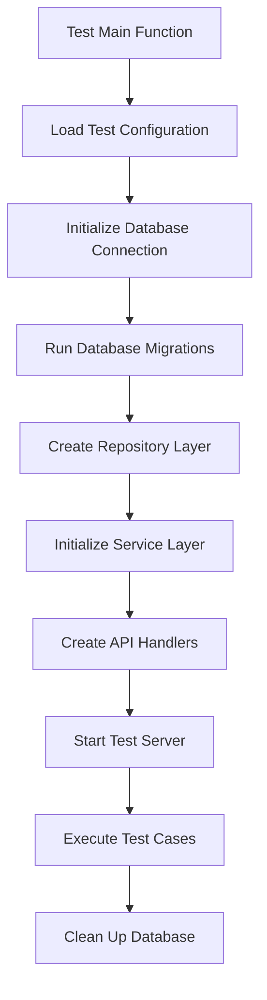
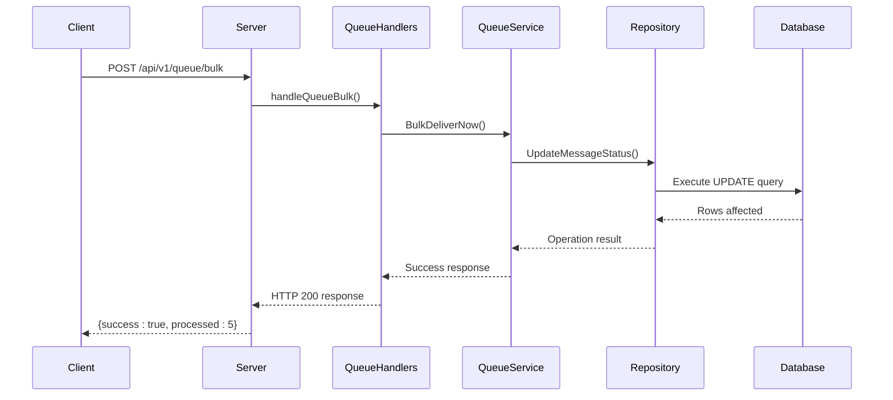
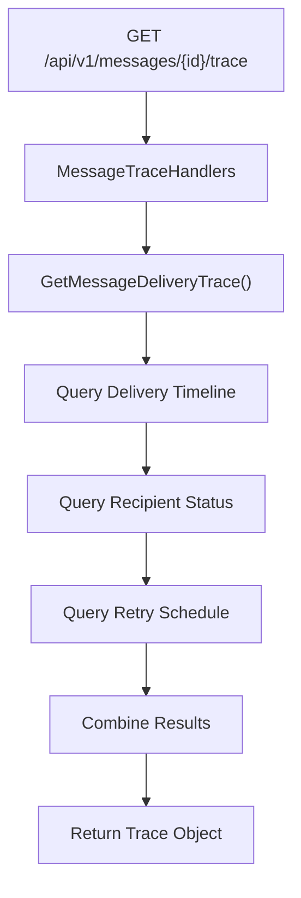
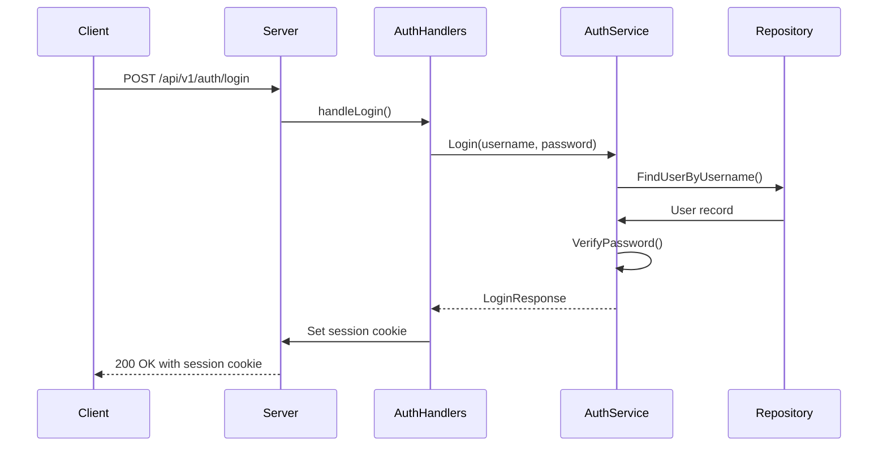

# Integration Testing


## Table of Contents
1. [Introduction](#introduction)
2. [Test Setup and Database Configuration](#test-setup-and-database-configuration)
3. [API Endpoint Test Coverage](#api-endpoint-test-coverage)
4. [Request and Response Validation](#request-and-response-validation)
5. [Test Data Management](#test-data-management)
6. [Adding New Integration Tests](#adding-new-integration-tests)
7. [Common Pitfalls and Best Practices](#common-pitfalls-and-best-practices)

## Introduction
This document provides comprehensive documentation for the integration testing framework in the Exim-Pilot application. The focus is on end-to-end testing of API endpoints, covering the complete flow from HTTP request handling through business logic to database interactions. The integration tests ensure that all components work together correctly and that the API behaves as expected under various conditions.

The testing framework uses a real database connection rather than mocking, providing high-fidelity testing of the actual system behavior. Tests are organized in the `tests/integration` directory with `api_test.go` serving as the primary integration test file.

## Test Setup and Database Configuration

The integration testing framework establishes a complete runtime environment that closely mirrors production. This includes setting up database connections, initializing services, and configuring the API server with test-specific settings.





**Diagram sources**
- [api_test.go](file://tests/integration/api_test.go)
- [config.go](file://internal/config/config.go)
- [connection.go](file://internal/database/connection.go)

**Section sources**
- [api_test.go](file://tests/integration/api_test.go#L1-L100)
- [config.go](file://internal/config/config.go#L1-L50)

The test configuration is loaded from `config/test-config.yaml`, which provides database connection parameters specifically for testing. The database connection is established using the `database.Connection` package, which handles connection pooling and error handling.


```go
// Example from api_test.go - simplified
func setupTestEnvironment() (*httptest.Server, func()) {
    // Load test configuration
    config, err := config.LoadConfig("config/test-config.yaml")
    if err != nil {
        panic(err)
    }
    
    // Initialize database connection
    dbConn, err := database.NewConnection(config.Database)
    if err != nil {
        panic(err)
    }
    
    // Run migrations to ensure schema is up to date
    if err := database.Migrate(dbConn.DB); err != nil {
        panic(err)
    }
    
    // Create repository and service layers
    repo := database.NewRepository(dbConn.DB)
    queueService := queue.NewService(repo)
    logService := logprocessor.NewService(repo)
    
    // Create API handlers
    queueHandlers := api.NewQueueHandlers(queueService)
    logHandlers := api.NewLogHandlers(logService)
    
    // Set up router and test server
    router := api.NewServer().SetupRoutes(queueHandlers, logHandlers)
    server := httptest.NewServer(router)
    
    return server, func() {
        server.Close()
        dbConn.Close()
    }
}
```


The test environment uses a dedicated test database that is completely isolated from development and production databases. This ensures that tests can modify data freely without affecting other environments.

## API Endpoint Test Coverage

The integration tests cover a comprehensive set of API endpoints across multiple domains: queue operations, message tracing, authentication, logging, and reporting. Each endpoint is tested for various scenarios including successful requests, validation errors, and error conditions.

### Queue Operations Testing

The queue management endpoints are thoroughly tested to ensure proper handling of message operations. The tests validate both individual message operations and bulk operations.





**Diagram sources**
- [queue_handlers.go](file://internal/api/queue_handlers.go#L200-L250)
- [service.go](file://internal/queue/service.go#L150-L200)

**Section sources**
- [api_test.go](file://tests/integration/api_test.go#L150-L300)
- [queue_handlers.go](file://internal/api/queue_handlers.go#L1-L400)

Key queue endpoints tested include:
- **GET /api/v1/queue**: List queue messages with pagination
- **POST /api/v1/queue/search**: Search queue messages by criteria
- **GET /api/v1/queue/{id}**: Retrieve message details
- **POST /api/v1/queue/{id}/deliver**: Force message delivery
- **POST /api/v1/queue/{id}/freeze**: Freeze a message
- **POST /api/v1/queue/{id}/thaw**: Thaw a frozen message
- **DELETE /api/v1/queue/{id}**: Delete a message
- **POST /api/v1/queue/bulk**: Perform bulk operations on multiple messages

Each endpoint is tested with various input scenarios to validate proper request validation, business logic execution, and response formatting.

### Message Tracing and Reporting

The message tracing and reporting endpoints provide detailed insights into message delivery and system performance. These endpoints are critical for monitoring and troubleshooting.





**Diagram sources**
- [message_trace_handlers.go](file://internal/api/message_trace_handlers.go#L50-L100)
- [reports_handlers.go](file://internal/api/reports_handlers.go#L300-L400)

**Section sources**
- [api_test.go](file://tests/integration/api_test.go#L400-L600)
- [message_trace_handlers.go](file://internal/api/message_trace_handlers.go#L1-L800)

The message tracing functionality includes:
- **Delivery timeline visualization**: Shows the complete history of delivery attempts
- **Per-recipient delivery history**: Tracks delivery status for each recipient
- **Retry schedule visualization**: Displays the planned retry timeline
- **Threaded timeline view**: Organizes events by recipient and delivery attempt
- **Delivery statistics**: Provides summary metrics and analytics

Reporting endpoints include deliverability reports, volume analysis, failure breakdowns, top senders/recipients, and domain-based analysis.

### Authentication Testing

The authentication system is tested to ensure secure user management and proper session handling.





**Diagram sources**
- [auth_handlers.go](file://internal/api/auth_handlers.go#L30-L80)
- [service.go](file://internal/auth/service.go#L10-L50)

**Section sources**
- [api_test.go](file://tests/integration/api_test.go#L600-L700)
- [auth_handlers.go](file://internal/api/auth_handlers.go#L1-L200)

Authentication endpoints tested:
- **POST /api/v1/auth/login**: User authentication with session creation
- **POST /api/v1/auth/logout**: Session termination and cookie clearing
- **GET /api/v1/auth/me**: Retrieve current user information

## Request and Response Validation

Integration tests thoroughly validate both requests and responses to ensure API contract compliance and proper error handling.

### Status Code Verification

Each test case verifies the appropriate HTTP status code based on the request outcome:


```go
// Example test case for queue listing
func TestQueueList_Success(t *testing.T) {
    // Setup test data
    createTestMessages(t, 10)
    
    // Make request
    resp, err := http.Get(server.URL + "/api/v1/queue?page=1&per_page=10")
    if err != nil {
        t.Fatal(err)
    }
    defer resp.Body.Close()
    
    // Verify status code
    if resp.StatusCode != http.StatusOK {
        t.Errorf("Expected status %d, got %d", http.StatusOK, resp.StatusCode)
    }
    
    // Additional response validation...
}
```


Common status code validations:
- **200 OK**: Successful GET requests and non-error responses
- **201 Created**: Successful resource creation
- **400 Bad Request**: Invalid input parameters or malformed requests
- **401 Unauthorized**: Authentication required or failed
- **404 Not Found**: Resource not found
- **500 Internal Server Error**: Unexpected server errors

### Payload Assertions

Response payloads are validated to ensure correct data structure and content:


```go
func TestQueueSearch_Validation(t *testing.T) {
    // Test invalid JSON
    reqBody := strings.NewReader(`{"criteria": invalid}`)
    resp, err := http.Post(server.URL+"/api/v1/queue/search", "application/json", reqBody)
    if err != nil {
        t.Fatal(err)
    }
    defer resp.Body.Close()
    
    // Verify error response structure
    var apiResp APIResponse
    if err := json.NewDecoder(resp.Body).Decode(&apiResp); err != nil {
        t.Fatal("Failed to decode response:", err)
    }
    
    if !apiResp.Success {
        t.Error("Expected success=false for invalid request")
    }
    
    if apiResp.Error == "" {
        t.Error("Expected error message for invalid request")
    }
}
```


Payload validation includes:
- **JSON structure**: Ensuring responses have the expected fields and nesting
- **Data types**: Verifying that fields have the correct data types
- **Content accuracy**: Confirming that returned data matches the actual state
- **Pagination metadata**: Validating page, per_page, total, and other pagination fields
- **Error response format**: Ensuring consistent error response structure

## Test Data Management

Effective test data management is crucial for reliable and repeatable integration tests. The framework employs several strategies to handle test data lifecycle.

### Data Seeding

Test data is seeded before test execution to ensure consistent starting conditions:


```go
func seedTestData(t *testing.T) {
    // Insert test messages
    messages := []database.QueueMessage{
        {
            ID:           "test-msg-1",
            Sender:       "sender@test.com",
            Recipients:   []string{"recipient@test.com"},
            Size:         1024,
            Status:       "queued",
            RetryCount:   0,
            CreatedAt:    time.Now().Add(-1 * time.Hour),
            NextRetry:    time.Now().Add(10 * time.Minute),
        },
        {
            ID:           "test-msg-2",
            Sender:       "sender2@test.com",
            Recipients:   []string{"recipient2@test.com"},
            Size:         2048,
            Status:       "deferred",
            RetryCount:   3,
            CreatedAt:    time.Now().Add(-2 * time.Hour),
            NextRetry:    time.Now().Add(5 * time.Minute),
        },
    }
    
    for _, msg := range messages {
        if err := repo.CreateQueueMessage(&msg); err != nil {
            t.Fatalf("Failed to create test message: %v", err)
        }
    }
}
```


### Data Cleanup

After each test, data is cleaned up to prevent test contamination:


```go
func cleanupTestData(t *testing.T) {
    // Delete all test messages
    if _, err := repo.DB.Exec("DELETE FROM queue_messages WHERE id LIKE 'test-%'"); err != nil {
        t.Logf("Warning: failed to cleanup test messages: %v", err)
    }
    
    // Delete test logs
    if _, err := repo.DB.Exec("DELETE FROM log_entries WHERE message_id LIKE 'test-%'"); err != nil {
        t.Logf("Warning: failed to cleanup test logs: %v", err)
    }
    
    // Reset sequences if using auto-increment
    if _, err := repo.DB.Exec("DELETE FROM sqlite_sequence WHERE name='delivery_attempts'"); err != nil {
        t.Logf("Warning: failed to reset sequence: %v", err)
    }
}
```


The cleanup process is typically implemented as a deferred function to ensure it runs even if the test fails:


```go
func TestQueueOperations(t *testing.T) {
    // Setup
    seedTestData(t)
    defer cleanupTestData(t)
    
    // Test cases...
}
```


## Adding New Integration Tests

To add new integration tests for API routes, follow this structured approach:

### Test File Structure

New tests should be added to `tests/integration/api_test.go` following the existing pattern:


```go
func TestNewEndpoint(t *testing.T) {
    // 1. Setup: Initialize test data and dependencies
    setupFn := setupTestData(t)
    defer setupFn()
    
    // 2. Execution: Make HTTP request to the endpoint
    resp, err := http.Get(server.URL + "/api/v1/new-endpoint")
    if err != nil {
        t.Fatal(err)
    }
    defer resp.Body.Close()
    
    // 3. Validation: Verify response status and payload
    assert.Equal(t, http.StatusOK, resp.StatusCode)
    
    var result map[string]interface{}
    if err := json.NewDecoder(resp.Body).Decode(&result); err != nil {
        t.Fatal("Failed to decode response:", err)
    }
    
    // 4. Assertions: Validate response content
    assert.Contains(t, result, "expected_field")
    assert.Equal(t, "expected_value", result["expected_field"])
}
```


### Testing Service Layer Correctness

When adding tests for new API routes, ensure they validate the complete service layer:


```go
func TestNewServiceFunction(t *testing.T) {
    // Test the service function directly
    result, err := queueService.NewFunction("test-input")
    assert.NoError(t, err)
    assert.NotNil(t, result)
    
    // Test the API endpoint that uses the service function
    resp, err := http.Post(server.URL+"/api/v1/new-function", "application/json", 
        strings.NewReader(`{"input": "test-input"}`))
    assert.NoError(t, err)
    defer resp.Body.Close()
    
    assert.Equal(t, http.StatusOK, resp.StatusCode)
}
```


### Test Organization

Organize tests by API domain and use subtests for related functionality:


```go
func TestMessageTraceEndpoints(t *testing.T) {
    t.Run("DeliveryTrace", func(t *testing.T) {
        // Test delivery trace endpoint
    })
    
    t.Run("RecipientHistory", func(t *testing.T) {
        // Test recipient history endpoint
    })
    
    t.Run("TimelineFiltering", func(t *testing.T) {
        // Test timeline filtering functionality
    })
}
```


## Common Pitfalls and Best Practices

### Race Conditions

Race conditions can occur when multiple tests access shared resources concurrently:


```go
// BAD: Shared state without synchronization
var sharedCounter int

func TestRaceCondition(t *testing.T) {
    // This test may fail due to race conditions
    go func() { sharedCounter++ }()
    go func() { sharedCounter++ }()
}

// GOOD: Use table tests with sequential execution
func TestNoRaceConditions(t *testing.T) {
    tests := []struct {
        name string
        setup func(*testing.T)
        validate func(*testing.T)
    }{
        {"test1", setup1, validate1},
        {"test2", setup2, validate2},
    }
    
    for _, tt := range tests {
        t.Run(tt.name, func(t *testing.T) {
            tt.setup(t)
            tt.validate(t)
        })
    }
}
```


### Dependency Coupling

Avoid tight coupling between tests and implementation details:


```go
// BAD: Testing implementation details
func TestInternalLogic(t *testing.T) {
    // This tests private methods and internal state
    // which makes tests brittle
}

// GOOD: Test behavior and contracts
func TestAPIBehavior(t *testing.T) {
    // Test what the API does, not how it does it
    // Focus on inputs and outputs
}
```


### Best Practices

1. **Isolate tests**: Each test should be independent and not rely on the state created by other tests.

2. **Use descriptive test names**: Test names should clearly indicate what is being tested and the expected outcome.

3. **Test edge cases**: Include tests for boundary conditions, error scenarios, and invalid inputs.

4. **Keep tests fast**: Avoid unnecessary delays and optimize test data setup.

5. **Use table-driven tests**: For testing multiple input scenarios with the same validation logic.

6. **Clean up after tests**: Always ensure test data is removed to prevent test contamination.

7. **Test error handling**: Verify that appropriate error responses are returned for invalid requests.

8. **Validate response structure**: Ensure API responses maintain consistent structure across endpoints.

By following these guidelines, new integration tests will be reliable, maintainable, and effective at catching regressions and ensuring API correctness.

**Referenced Files in This Document**   
- [api_test.go](file://tests/integration/api_test.go)
- [queue_handlers.go](file://internal/api/queue_handlers.go)
- [log_handlers.go](file://internal/api/log_handlers.go)
- [reports_handlers.go](file://internal/api/reports_handlers.go)
- [message_trace_handlers.go](file://internal/api/message_trace_handlers.go)
- [auth_handlers.go](file://internal/api/auth_handlers.go)
- [server.go](file://internal/api/server.go)
- [config.go](file://internal/config/config.go)
- [connection.go](file://internal/database/connection.go)
- [repository.go](file://internal/database/repository.go)
- [service.go](file://internal/queue/service.go)
- [service.go](file://internal/logprocessor/service.go)