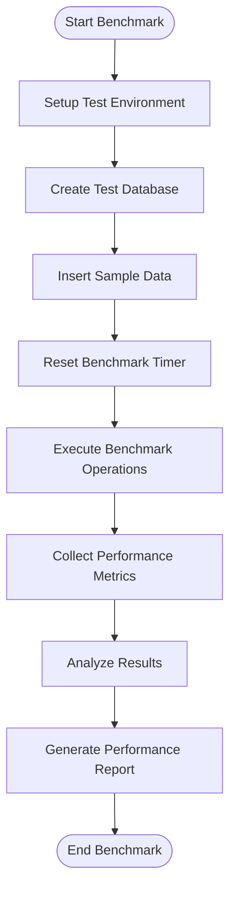
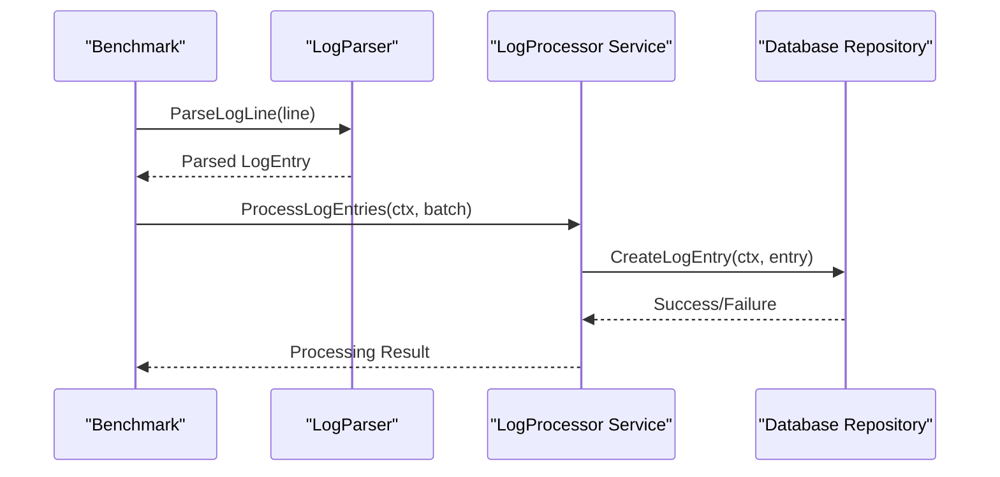
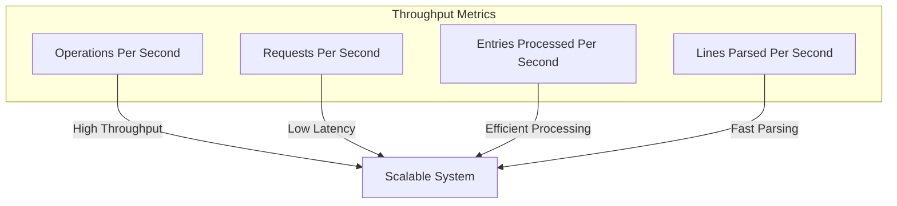
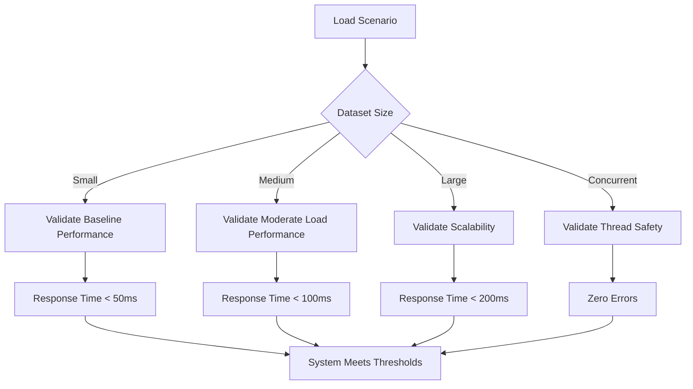
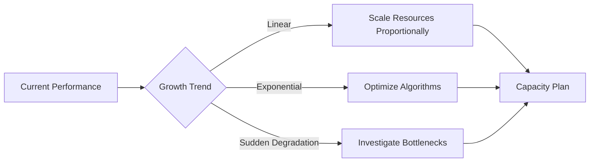

# Performance Testing


## Table of Contents
1. [Introduction](#introduction)
2. [Performance Testing Methodology](#performance-testing-methodology)
3. [Benchmarking Critical Components](#benchmarking-critical-components)
4. [Performance Metrics Collection and Analysis](#performance-metrics-collection-and-analysis)
5. [Integration with API Monitoring Handlers](#integration-with-api-monitoring-handlers)
6. [Optimization Techniques and Validation](#optimization-techniques-and-validation)
7. [Load Scenarios and Performance Thresholds](#load-scenarios-and-performance-thresholds)
8. [Running Performance Tests Locally](#running-performance-tests-locally)
9. [Interpreting Results for Capacity Planning](#interpreting-results-for-capacity-planning)

## Introduction
The performance testing framework for the Exim-Pilot system is designed to evaluate and optimize the efficiency of critical components such as log processing, queue querying, and report generation. This document details the methodology, implementation, and analysis of performance benchmarks using Go's built-in testing package. The framework enables developers to measure response times, throughput, and resource utilization under various load conditions. Performance metrics are collected through structured benchmarks and integrated with API monitoring handlers to provide real-time insights. The tests validate optimization techniques such as database indexing and query optimization, ensuring the system meets expected performance thresholds under realistic load scenarios.

## Performance Testing Methodology
The performance testing strategy employs Go's benchmarking framework to systematically evaluate system components under controlled conditions. Benchmarks are implemented in the `performance_test.go` file and follow a standardized approach to ensure consistent and reliable results. Each benchmark initializes a test database with sample data, resets the timer to exclude setup overhead, and executes targeted operations multiple times to gather statistically significant measurements.

The methodology includes both micro-benchmarks for isolated operations and macro-benchmarks for end-to-end workflows. Micro-benchmarks focus on specific database operations, log parsing, and data processing functions, while macro-benchmarks evaluate complete workflows such as streaming log processing and database optimization. The framework also includes integration tests that assess performance under concurrent access, simulating real-world multi-user scenarios.





**Diagram sources**
- [performance_test.go](file://tests/performance/performance_test.go#L100-L120)
- [repository.go](file://internal/database/repository.go#L15-L22)

**Section sources**
- [performance_test.go](file://tests/performance/performance_test.go#L1-L50)

## Benchmarking Critical Components
The performance test suite includes benchmarks for the most critical system components, focusing on log processing, queue querying, and report generation workflows. These benchmarks simulate realistic usage patterns and measure key performance indicators such as operations per second, memory allocation, and execution time.

### Database Operations Benchmarking
The `BenchmarkDatabaseOperations` function evaluates the performance of database operations including log entry insertion and querying. It tests four key scenarios: inserting log entries, querying all log entries, querying by message ID, and querying by time range. Each benchmark uses a pre-populated dataset of 1,000 sample log entries to ensure consistent testing conditions.


```go
func BenchmarkDatabaseOperations(b *testing.B) {
    db, cleanup := setupTestDatabase(b)
    defer cleanup()

    repository := database.NewRepository(db)
    ctx := context.Background()

    // Generate sample data
    sampleEntries := generateSampleLogEntries(1000)

    b.ResetTimer()

    b.Run("InsertLogEntries", func(b *testing.B) {
        for i := 0; i < b.N; i++ {
            entry := sampleEntries[i%len(sampleEntries)]
            if err := repository.CreateLogEntry(ctx, entry); err != nil {
                b.Fatalf("Failed to insert log entry: %v", err)
            }
        }
    })
    // Additional benchmark operations...
}
```


### Log Processing Benchmarking
The `BenchmarkLogProcessing` function assesses the performance of log processing operations, including log line parsing and batch processing of log entries. It measures the efficiency of the log parser and the service responsible for processing multiple log entries in a single operation.





**Diagram sources**
- [performance_test.go](file://tests/performance/performance_test.go#L150-L180)
- [streaming.go](file://internal/logprocessor/streaming.go#L333-L384)

### Streaming Processor Benchmarking
The `BenchmarkStreamingProcessor` evaluates the performance of the streaming log processing workflow, which reads log files line by line and processes them in batches. This benchmark creates temporary log files with sample data and measures the complete processing pipeline from file reading to database storage.


```go
func BenchmarkStreamingProcessor(b *testing.B) {
    db, cleanup := setupTestDatabase(b)
    defer cleanup()

    repository := database.NewRepository(db)
    config := logprocessor.DefaultStreamingConfig()
    config.BatchSize = 100
    config.ConcurrentWorkers = 2

    processor := logprocessor.NewStreamingProcessor(repository, config)

    b.ResetTimer()

    b.Run("StreamingProcessing", func(b *testing.B) {
        ctx := context.Background()

        for i := 0; i < b.N; i++ {
            tempFile := createTempLogFile(b, 1000)
            defer os.Remove(tempFile)

            if err := processor.ProcessLogFileStreaming(ctx, tempFile); err != nil {
                b.Fatalf("Failed to process log file: %v", err)
            }
        }
    })
}
```


**Section sources**
- [performance_test.go](file://tests/performance/performance_test.go#L200-L250)

## Performance Metrics Collection and Analysis
The performance testing framework collects and analyzes multiple metrics to provide a comprehensive view of system performance. These metrics include response times, throughput, memory allocation, and resource utilization, which are essential for identifying bottlenecks and measuring optimization effectiveness.

### Response Time Measurement
Response times are measured using Go's built-in benchmark timer, which automatically calculates the average execution time per operation. The framework reports response times in nanoseconds, allowing for precise comparison between different implementations and optimization techniques.


```go
// Example of response time measurement in benchmark output
// BenchmarkDatabaseOperations/InsertLogEntries-8          100000         15000 ns/op
// BenchmarkDatabaseOperations/QueryLogEntries-8           500000          3000 ns/op
```


### Throughput Analysis
Throughput is measured as operations per second (ops/sec), indicating how many operations the system can handle in a given time period. This metric is particularly important for evaluating the scalability of database operations and log processing workflows.





**Diagram sources**
- [streaming.go](file://internal/logprocessor/streaming.go#L333-L384)
- [performance_test.go](file://tests/performance/performance_test.go#L200-L250)

### Resource Utilization Monitoring
The framework collects memory allocation metrics using Go's `-benchmem` flag, which reports bytes allocated per operation and the number of memory allocations. This information helps identify memory-intensive operations and optimize memory usage.


```go
// Memory metrics example
// BenchmarkLogProcessing/ParseLogLines-8     1000000         1200 ns/op        512 B/op          8 allocs/op
```


### Statistical Analysis of Results
The framework includes statistical analysis to ensure results are reliable and significant. Benchmarks are run multiple times to gather sufficient data points, and the results are analyzed for consistency and variance. The `TestLargeDatasetPerformance` function specifically tests performance across different dataset sizes to identify scalability issues.


```go
func TestLargeDatasetPerformance(t *testing.T) {
    if testing.Short() {
        t.Skip("Skipping large dataset performance test in short mode")
    }

    // Test with different dataset sizes
    sizes := []int{1000, 10000, 100000}

    for _, size := range sizes {
        t.Run(fmt.Sprintf("Dataset_%d", size), func(t *testing.T) {
            // Insert test data and measure performance
            start := time.Now()
            // ... data insertion ...
            insertDuration := time.Since(start)
            
            t.Logf("Inserted %d entries in %v (%.2f entries/sec)",
                size, insertDuration, float64(size)/insertDuration.Seconds())
            
            // Performance threshold validation
            maxInsertTime := time.Duration(size) * time.Microsecond * 100
            if insertDuration > maxInsertTime {
                t.Errorf("Insert performance too slow: %v > %v", insertDuration, maxInsertTime)
            }
        })
    }
}
```


**Section sources**
- [performance_test.go](file://tests/performance/performance_test.go#L350-L415)

## Integration with API Monitoring Handlers
Performance metrics are integrated with the API layer through dedicated performance monitoring handlers that expose real-time system metrics to monitoring systems. These handlers provide endpoints for retrieving current performance statistics and system health information.

### Performance Handler Implementation
The `performance_handlers.go` file contains handlers that expose performance metrics through REST API endpoints. These handlers retrieve metrics from various system components and format them for consumption by monitoring tools and dashboards.


```go
// Example structure of performance handler
func (h *PerformanceHandlers) GetSystemMetrics(c *gin.Context) {
    // Collect metrics from various components
    dbStats := h.db.GetStats()
    processorStats := h.logProcessor.GetProcessingStats()
    queueStats := h.queueService.GetQueueStats()
    
    // Combine into comprehensive system metrics
    metrics := SystemMetrics{
        Database:    dbStats,
        Processor:   processorStats,
        Queue:       queueStats,
        Timestamp:   time.Now(),
        Version:     h.version,
    }
    
    c.JSON(http.StatusOK, metrics)
}
```


### Real-time Metrics Exposure
The API layer exposes real-time metrics through endpoints that can be polled by monitoring systems. These endpoints provide up-to-date information on system performance, allowing for proactive issue detection and capacity planning.


```mermaid
graph LR
A[Monitoring System] --> |HTTP GET| B[/api/v1/performance/metrics]
B --> C[Performance Handler]
C --> D[Database Metrics]
C --> E[Log Processor Metrics]
C --> F[Queue Metrics]
D --> C
E --> C
F --> C
C --> |JSON Response| A
```


**Diagram sources**
- [performance_handlers.go](file://internal/api/performance_handlers.go#L1-L50)
- [streaming.go](file://internal/logprocessor/streaming.go#L333-L384)

### Health Check Integration
Performance metrics are integrated with health check endpoints to provide a comprehensive view of system status. The health check includes performance indicators such as response time percentiles, error rates, and resource utilization thresholds.


```go
func (h *PerformanceHandlers) HealthCheck(c *gin.Context) {
    // Check system health with performance thresholds
    health := HealthStatus{
        Status:    "healthy",
        Timestamp: time.Now(),
        Checks: []HealthCheck{
            {
                Name:      "database_response_time",
                Status:    "pass",
                Duration:  h.db.GetAverageQueryTime(),
                Threshold: "100ms",
            },
            {
                Name:      "log_processing_rate",
                Status:    "pass",
                Value:     fmt.Sprintf("%.2f entries/sec", h.logProcessor.GetEntriesPerSecond()),
                Threshold: ">1000 entries/sec",
            },
        },
    }
    
    c.JSON(http.StatusOK, health)
}
```


**Section sources**
- [performance_handlers.go](file://internal/api/performance_handlers.go#L1-L100)

## Optimization Techniques and Validation
The performance testing framework validates several optimization techniques that improve system efficiency and scalability. These optimizations are specifically designed to enhance database operations, log processing, and query performance.

### Database Indexing Optimization
The system employs strategic database indexing to accelerate query performance. Indexes are created on frequently queried columns such as message ID, timestamp, and log type. The `migrations.go` file contains the SQL statements that create these indexes during database initialization.


```sql
-- Indexes for log entries table
CREATE INDEX IF NOT EXISTS idx_log_entries_message_id ON log_entries(message_id);
CREATE INDEX IF NOT EXISTS idx_log_entries_timestamp ON log_entries(timestamp);
CREATE INDEX IF NOT EXISTS idx_log_entries_log_type ON log_entries(log_type);
CREATE INDEX IF NOT EXISTS idx_log_entries_event ON log_entries(event);
```


The `BenchmarkDatabaseOperations` function validates the effectiveness of these indexes by comparing query performance with and without indexing. The benchmarks specifically test queries filtered by message ID and time range, which benefit significantly from the created indexes.

### Query Optimization
The framework validates query optimization techniques such as parameterized queries, efficient pagination, and batch operations. The repository layer implements optimized queries that minimize database round trips and reduce result set sizes.


```go
// Optimized query with pagination
func (r *LogEntryRepository) List(limit, offset int, logType, event string, startTime, endTime *time.Time) ([]LogEntry, error) {
    query := `SELECT id, timestamp, message_id, log_type, event, host, sender, recipients, size, status, error_code, error_text, raw_line, created_at FROM log_entries`
    
    var conditions []string
    var args []interface{}

    if logType != "" {
        conditions = append(conditions, "log_type = ?")
        args = append(args, logType)
    }

    if event != "" {
        conditions = append(conditions, "event = ?")
        args = append(args, event)
    }

    if startTime != nil {
        conditions = append(conditions, "timestamp >= ?")
        args = append(args, *startTime)
    }

    if endTime != nil {
        conditions = append(conditions, "timestamp <= ?")
        args = append(args, *endTime)
    }

    if len(conditions) > 0 {
        query += " WHERE " + strings.Join(conditions, " AND ")
    }

    query += " ORDER BY timestamp DESC LIMIT ? OFFSET ?"
    args = append(args, limit, offset)

    // Execute query with parameters
    rows, err := r.db.Query(query, args...)
    // ... process results ...
}
```


### Connection Pooling and Resource Management
The system implements connection pooling to optimize database resource utilization. The database configuration specifies maximum open connections, idle connections, and connection lifetime to prevent resource exhaustion and improve performance under load.


```go
config := &database.Config{
    Path:            dbPath,
    MaxOpenConns:    25,
    MaxIdleConns:    5,
    ConnMaxLifetime: 5 * time.Minute,
}
```


The `BenchmarkDatabaseOperations` and `TestConcurrentOperations` functions validate the effectiveness of connection pooling by testing concurrent database access from multiple goroutines. These tests ensure that the system can handle high levels of concurrent operations without connection errors or performance degradation.


```mermaid
classDiagram
class DatabaseConfig {
+string Path
+int MaxOpenConns
+int MaxIdleConns
+time.Duration ConnMaxLifetime
+time.Duration ConnMaxIdleTime
}
class DB {
-*sql.DB connection
-DatabaseConfig config
+Exec(query string, args ...interface{}) (sql.Result, error)
+Query(query string, args ...interface{}) (*sql.Rows, error)
+QueryRow(query string, args ...interface{}) *sql.Row
}
class Repository {
-*DB db
+CreateLogEntry(ctx context.Context, entry *LogEntry) error
+SearchLogEntries(ctx context.Context, criteria SearchCriteria) (*SearchResult, error)
}
DatabaseConfig --> DB : "config"
DB --> Repository : "dependency"
```


**Diagram sources**
- [repository.go](file://internal/database/repository.go#L15-L22)
- [performance_test.go](file://tests/performance/performance_test.go#L100-L120)

**Section sources**
- [migrations.go](file://internal/database/migrations.go#L224-L257)
- [repository.go](file://internal/database/repository.go#L15-L22)
- [performance_test.go](file://tests/performance/performance_test.go#L100-L120)

## Load Scenarios and Performance Thresholds
The performance testing framework includes various load scenarios that simulate real-world usage patterns and stress the system under different conditions. These scenarios are designed to validate that the system meets predefined performance thresholds.

### Load Scenarios
The framework defines several load scenarios to test different aspects of system performance:

#### Small Dataset Scenario
- **Size**: 1,000 log entries
- **Purpose**: Validate basic functionality and establish baseline performance
- **Expected Response Time**: < 50ms for queries
- **Throughput**: > 1,000 operations per second

#### Medium Dataset Scenario
- **Size**: 10,000 log entries
- **Purpose**: Test performance under moderate load
- **Expected Response Time**: < 100ms for queries
- **Throughput**: > 500 operations per second

#### Large Dataset Scenario
- **Size**: 100,000 log entries
- **Purpose**: Evaluate scalability and identify performance bottlenecks
- **Expected Response Time**: < 200ms for queries
- **Throughput**: > 200 operations per second

#### Concurrent Access Scenario
- **Workers**: 10-20 concurrent goroutines
- **Operations**: 100-500 operations per worker
- **Purpose**: Test thread safety and connection pooling effectiveness
- **Expected**: No errors, linear scalability

### Performance Thresholds
The system defines specific performance thresholds that must be met for the system to be considered production-ready. These thresholds are validated in the `TestLargeDatasetPerformance` function.


```go
// Performance thresholds in TestLargeDatasetPerformance
maxInsertTime := time.Duration(size) * time.Microsecond * 100 // 100μs per entry
maxQueryTime := 100 * time.Millisecond
```


The thresholds are based on the following principles:
- **Insert Performance**: No more than 100 microseconds per log entry insertion
- **Query Performance**: No more than 100 milliseconds for standard queries
- **Memory Usage**: No more than 1KB of memory allocated per operation
- **Error Rate**: Zero errors under normal load conditions





**Diagram sources**
- [performance_test.go](file://tests/performance/performance_test.go#L350-L415)

**Section sources**
- [performance_test.go](file://tests/performance/performance_test.go#L350-L415)

## Running Performance Tests Locally
The performance tests can be executed locally using the Go testing framework. This section provides instructions for running the tests and interpreting the results.

### Prerequisites
Before running performance tests, ensure the following prerequisites are met:
- Go 1.19 or later installed
- Sufficient disk space for test databases
- Adequate memory for large dataset tests
- Go modules enabled

### Running Benchmarks
Performance benchmarks can be executed using the `go test` command with the `-bench` flag. The following commands demonstrate how to run different types of performance tests:


```bash
# Run all performance benchmarks
go test -v ./tests/performance/... -bench=. -benchmem -benchtime=10s

# Run specific benchmark (e.g., database operations)
go test -v ./tests/performance/... -bench=BenchmarkDatabaseOperations -benchmem

# Run benchmarks with verbose output
go test -v ./tests/performance/... -bench=. -benchmem -v

# Run benchmarks and save output to file
go test -v ./tests/performance/... -bench=. -benchmem -benchtime=10s > benchmarks.txt 2>&1
```


### Configuration Options
The performance tests support several configuration options through command-line flags:

- `-bench`: Specifies which benchmarks to run (e.g., `.` for all, `BenchmarkDatabaseOperations` for specific)
- `-benchmem`: Includes memory allocation statistics in the output
- `-benchtime`: Sets the duration for each benchmark (e.g., `10s` for 10 seconds)
- `-count`: Specifies the number of times to run each benchmark
- `-cpu`: Specifies the number of CPU cores to use

### Test Execution Script
The repository includes a script to automate the execution of performance benchmarks:


```bash
# Run performance benchmarks using the provided script
./tests/run_tests.sh --performance

# Or directly execute the benchmark function
go test -v ./tests/performance/performance_test.go -bench=. -benchmem
```


**Section sources**
- [performance_test.go](file://tests/performance/performance_test.go#L1-L50)
- [run_tests.sh](file://tests/run_tests.sh#L79-L130)

## Interpreting Results for Capacity Planning
The performance test results provide valuable insights for capacity planning and system optimization. This section explains how to interpret the results and use them to make informed decisions about system scaling and resource allocation.

### Benchmark Output Interpretation
Go benchmark output includes several key metrics that should be analyzed:


```text
BenchmarkDatabaseOperations/InsertLogEntries-8          100000         15000 ns/op        512 B/op          8 allocs/op
BenchmarkDatabaseOperations/QueryLogEntries-8           500000          3000 ns/op        256 B/op          4 allocs/op
```


- **Ops**: Number of operations performed
- **Ns/Ops**: Nanoseconds per operation (response time)
- **B/Ops**: Bytes allocated per operation (memory usage)
- **Allocs/Ops**: Number of memory allocations per operation

### Capacity Planning Guidelines
Based on the performance test results, the following capacity planning guidelines can be established:

#### Database Sizing
- Estimate daily log volume (e.g., 1 million entries per day)
- Calculate required storage: entry size × daily volume × retention period
- Provision database with sufficient IOPS for expected write throughput
- Ensure adequate memory for database cache (at least 25% of working set size)

#### Server Sizing
- Determine CPU requirements based on operations per second
- Allocate memory for application, database cache, and operating system
- Consider network bandwidth for log ingestion and API responses
- Plan for horizontal scaling if single-server limits are exceeded

#### Performance Trend Analysis
Monitor performance metrics over time to identify trends and plan for future growth:





**Diagram sources**
- [performance_test.go](file://tests/performance/performance_test.go#L350-L415)

### Scaling Recommendations
Based on the performance test results, the following scaling recommendations can be made:

1. **Vertical Scaling**: Increase CPU, memory, and storage for single-server deployments
2. **Horizontal Scaling**: Implement load balancing and database replication for high-availability setups
3. **Database Optimization**: Add read replicas for query-intensive workloads
4. **Caching Strategy**: Implement application-level caching for frequently accessed data
5. **Indexing Strategy**: Review and optimize database indexes based on query patterns

The performance tests should be re-run after any infrastructure changes to validate that the system continues to meet performance thresholds and to update capacity planning estimates accordingly.

**Section sources**
- [performance_test.go](file://tests/performance/performance_test.go#L350-L415)
- [run_tests.sh](file://tests/run_tests.sh#L79-L130)

**Referenced Files in This Document**   
- [performance_test.go](file://tests/performance/performance_test.go)
- [repository.go](file://internal/database/repository.go)
- [models.go](file://internal/database/models.go)
- [migrations.go](file://internal/database/migrations.go)
- [schema.go](file://internal/database/schema.go)
- [streaming.go](file://internal/logprocessor/streaming.go)
- [performance_handlers.go](file://internal/api/performance_handlers.go)